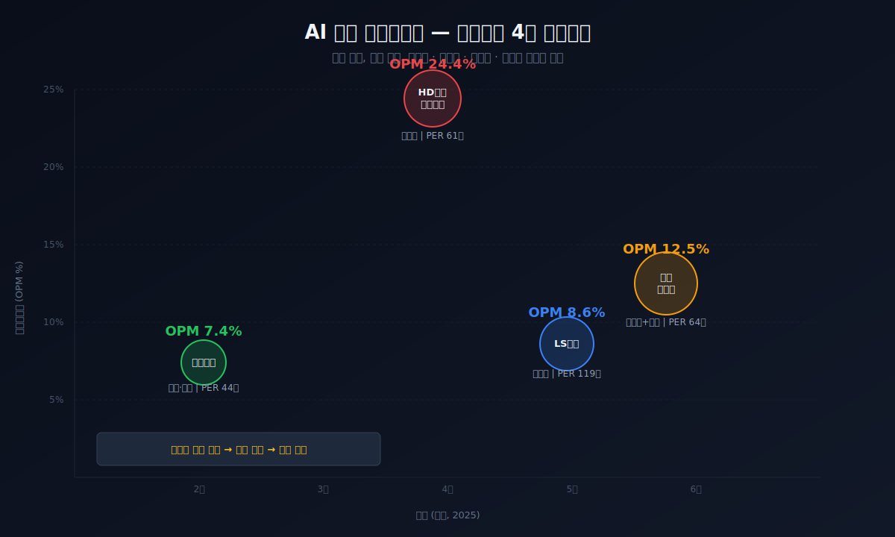
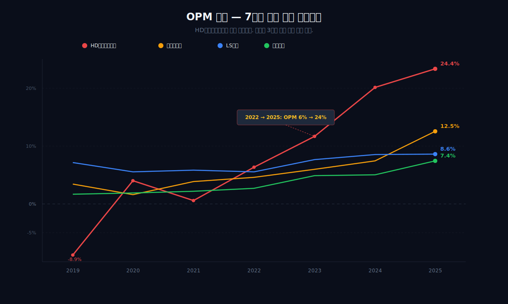
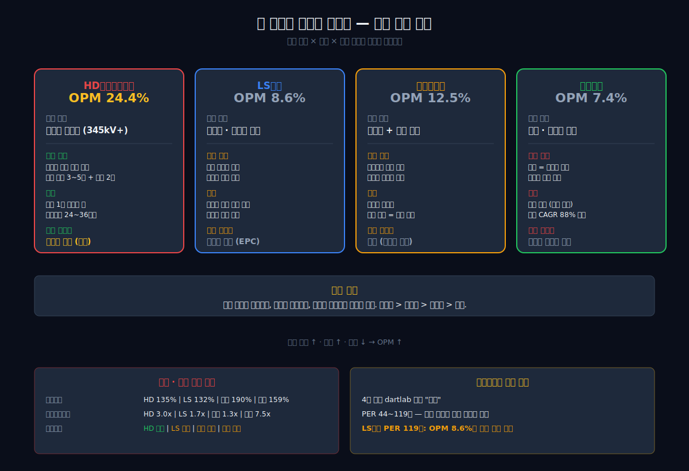
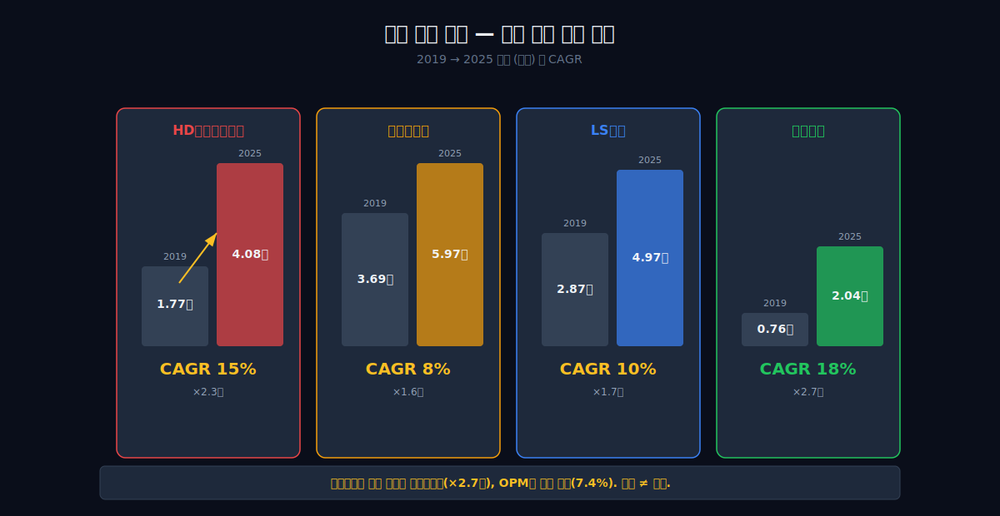
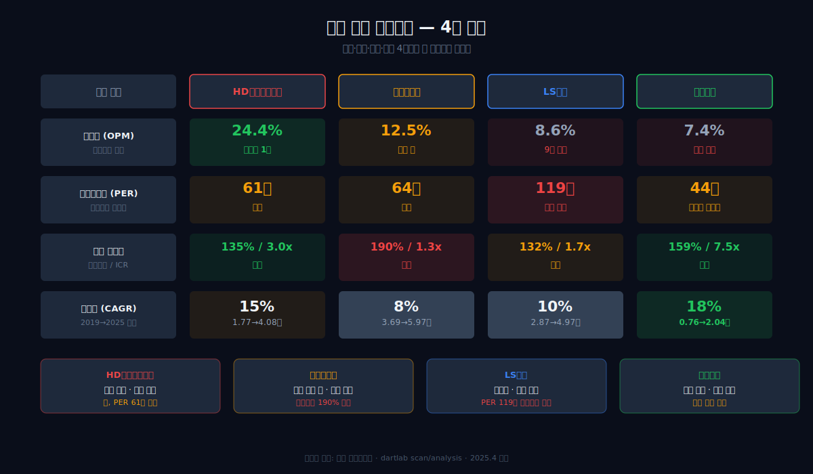

AI가 전기를 먹는다. 엔비디아 H100 GPU 한 대가 700W, 데이터센터 한 동이 수십 MW를 삼킨다. 이 전력을 공급하려면 변압기, 배전반, 차단기, 권선이 필요하다. 한국에 이 네 가지를 만드는 대표 기업이 각각 있다. 2025년, 네 회사 모두 매출이 역대 최대급이다.

그런데 영업이익률은 3배 차이가 난다.

## 4사 한눈에 — 같은 수요, 다른 숫자

<ComboChart
  title="전력기기 4사 영업이익률 추이 (%)"
  unit="%"
  lineKeys={["HD현대일렉트릭", "효성중공업", "LS전기", "일진전기"]}
  lineColors={["#ea4647", "#f59e0b", "#3b82f6", "#22c55e"]}
  barKeys={[]}
  data={[
    { year: "2019", "HD현대일렉트릭": -8.85, "효성중공업": 3.44, "LS전기": 7.18, "일진전기": 1.71 },
    { year: "2020", "HD현대일렉트릭": 4.01, "효성중공업": 1.48, "LS전기": 5.57, "일진전기": 1.95 },
    { year: "2021", "HD현대일렉트릭": 0.54, "효성중공업": 3.88, "LS전기": 5.81, "일진전기": 2.19 },
    { year: "2022", "HD현대일렉트릭": 6.32, "효성중공업": 4.62, "LS전기": 5.55, "일진전기": 2.70 },
    { year: "2023", "HD현대일렉트릭": 11.66, "효성중공업": 6.00, "LS전기": 7.68, "일진전기": 4.87 },
    { year: "2024", "HD현대일렉트릭": 20.14, "효성중공업": 7.41, "LS전기": 8.56, "일진전기": 5.06 },
    { year: "2025", "HD현대일렉트릭": 24.40, "효성중공업": 12.52, "LS전기": 8.59, "일진전기": 7.40 }
  ]}
/>

HD현대일렉트릭(빨간선)만 유독 꺾어 올라간다. 2019년 OPM -8.85%에서 2025년 24.4%까지 — 7년 만에 33pp 개선. 나머지 3사는 완만하게 올라가거나 횡보한다.

왜?

## HD현대일렉트릭 — 변압기가 마진을 먹는다

HD현대일렉트릭의 핵심 제품은 **초고압 변압기**(345kV 이상). 이 시장의 특성:

- **진입 장벽**: 초고압 변압기 제조 설비를 갖춘 공장이 전 세계에 수십 곳뿐이다. 새 공장 건설에 3~5년, 인증에 2년 이상 소요.
- **수주-납품 리드타임**: 24~36개월. 고객이 지금 주문해도 2028년에나 받는다. 이미 수주가 확보된 상태에서 가격 협상력이 올라간다.
- **AI 데이터센터 수요 집중**: 대형 변압기 1대가 수십억 원. 데이터센터 한 동에 수십 대가 들어간다.

매출총이익률(GPM)이 답을 보여준다: 2018년 7.87% → 2025년 34.14%. 같은 제품을 만드는데 원가 구성이 완전히 달라졌다. 수요가 공급을 압도하면서 **단가**가 올라간 것이다.

<ComboChart
  title="HD현대일렉트릭 OPM 턴어라운드"
  unit="%"
  barKeys={["매출(조)"]}
  barColors={["#3b82f6"]}
  lineKeys={["OPM"]}
  lineColors={["#ea4647"]}
  data={[
    { year: "2018", "매출(조)": 1.94, "OPM": -5.18 },
    { year: "2019", "매출(조)": 1.77, "OPM": -8.85 },
    { year: "2020", "매출(조)": 1.81, "OPM": 4.01 },
    { year: "2021", "매출(조)": 1.81, "OPM": 0.54 },
    { year: "2022", "매출(조)": 2.10, "OPM": 6.32 },
    { year: "2023", "매출(조)": 2.70, "OPM": 11.66 },
    { year: "2024", "매출(조)": 3.32, "OPM": 20.14 },
    { year: "2025", "매출(조)": 4.08, "OPM": 24.40 }
  ]}
/>

매출이 2배 늘 때 영업이익은 10배 늘었다. 이건 레버리지의 전형이다 — 고정비가 큰 제조업에서 가동률이 올라가면 이익률이 기하급수로 개선된다. 거기에 단가 인상까지 더해졌다.

## LS전기 — 배전반은 왜 8%에 머무는가

LS전기 매출은 4.97조로 HD현대일렉트릭(4.08조)보다 크다. 그런데 OPM은 8.59%로, 9년간 5~9% 사이를 벗어난 적이 없다.

이유는 제품 구조에 있다:

- **배전반·차단기·자동화 장비** — 다품종 소량. 고객마다 사양이 다르고, 한 대당 단가가 변압기보다 낮다. 경쟁사도 많다.
- **B2B 다수 거래처** — 대형 EPC(엔지니어링)에 납품. 가격 결정권이 고객 쪽에 있다.
- **해외 매출 비중 확대 중** — 데이터센터향 수주가 늘고 있지만, 변압기처럼 공급 병목이 심하지 않아 단가 프리미엄이 제한적.

LS전기의 PER은 118.5배로 4사 중 가장 높다. 시장이 "AI 전력 수혜"라는 기대를 가장 크게 반영한 곳이 정작 마진이 가장 얇은 회사다.

## 효성중공업 — 건설이 섞이면

효성중공업 매출 5.97조는 4사 중 가장 크다. 하지만 전력기기만 만드는 회사가 아니다. **건설 사업**(플랜트, 인프라)이 매출의 상당 부분을 차지한다.

건설은 전력기기보다 마진이 낮다. 2020년 OPM 1.48%까지 떨어진 이유다. 그런데 2025년 12.52%로 올라왔다 — 전력기기 사업의 비중과 마진이 동시에 개선된 결과다.

부채비율 190%, ICR 1.29는 4사 중 가장 위험한 수준. 건설 사업 특성상 선투입 후회수 구조가 부채를 높인다.

## 일진전기 — 부품 전문의 한계와 가능성

일진전기는 4사 중 매출이 2.04조로 가장 작다. 핵심 제품은 **권선**(변압기·모터 내부 구리 코일)과 **변압기 부품**. 완제품이 아니라 부품을 납품하는 구조다.

OPM 추이가 흥미롭다: 2017년 0.78% → 2025년 7.40%. 매년 조금씩 개선. 매출 성장률(CAGR 88%)이 4사 중 압도적이다 — 0.76조에서 2.04조로 3배.

부품 전문 기업의 특성: 완제품 기업의 수주가 늘면 부품 수요도 따라 늘지만, 가격 결정권은 완제품 기업에 있다. 마진이 낮은 대신 설비 투자 부담도 작아서 성장 속도는 빠르다.

## 밸류에이션 — 모두 "과열"

<BarChart
  title="전력기기 4사 PER 비교 (2025.4)"
  unit="배"
  keys={["PER"]}
  colors={["#ea4647"]}
  data={[
    { year: "HD현대일렉트릭", "PER": 61.4 },
    { year: "LS전기", "PER": 118.5 },
    { year: "효성중공업", "PER": 63.7 },
    { year: "일진전기", "PER": 44.3 }
  ]}
/>

4사 모두 dartlab 밸류에이션 등급 "과열". PER 44~118배. 시장은 AI 전력 수요의 지속을 가격에 반영하고 있다.

가장 눈에 띄는 건 **LS전기 PER 118배**. OPM 8.6%인 회사에 시장이 가장 높은 기대를 거는 이유 — "앞으로 마진이 개선될 것"이라는 기대가 이미 들어간 가격이다. 반대로 **일진전기 PER 44배**는 4사 중 가장 낮은데, 매출 CAGR 88%라는 성장성은 가장 높다.

## 결론 — 같은 수요, 다른 구조

| | HD현대일렉트릭 | 효성중공업 | LS전기 | 일진전기 |
|---|---|---|---|---|
| **핵심 제품** | 초고압 변압기 | 차단기 + 건설 | 배전반·자동화 | 권선·부품 |
| **매출 2025** | 4.08조 | 5.97조 | 4.97조 | 2.04조 |
| **OPM 2025** | **24.4%** | 12.5% | 8.6% | 7.4% |
| **OPM 2019** | -8.9% | 3.4% | 7.2% | 1.7% |
| **PER** | 61.4배 | 63.7배 | **118.5배** | 44.3배 |
| **부채비율** | 135% | **190%** | 132% | 159% |

같은 AI 전력 수요를 받지만:

- **변압기**는 공급 병목이 심해서 단가를 올릴 수 있다. HD현대일렉트릭.
- **배전반·자동화**는 경쟁이 많아서 단가를 못 올린다. LS전기.
- **건설이 섞이면** 전력기기 마진을 희석한다. 효성중공업.
- **부품은** 완제품 기업 수주에 따라가지만, 가격 결정권이 제한적이다. 일진전기.

전력 슈퍼사이클은 진행 중이다. 하지만 수요가 모든 기업을 같은 크기로 밀어주지는 않는다. 어떤 제품을, 어떤 경쟁 구조에서, 얼마나 독점적으로 공급하는지가 마진을 결정한다.

> 개별 기업 딥다이브: [HD현대일렉트릭 (#08)](/blog/08-267260-hd-hyundai-electric) · [LS ELECTRIC (#65)](/blog/65-010120-ls-electric)
>
> 데이터 출처: dartlab `scan("profitability")`, `scan("valuation")`, `scan("debt")`, `Company("267260").analysis("financial", "수익성")` 등. 모든 수치는 각사 사업보고서 기반.
