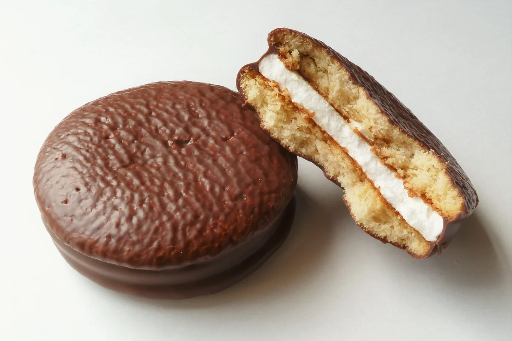
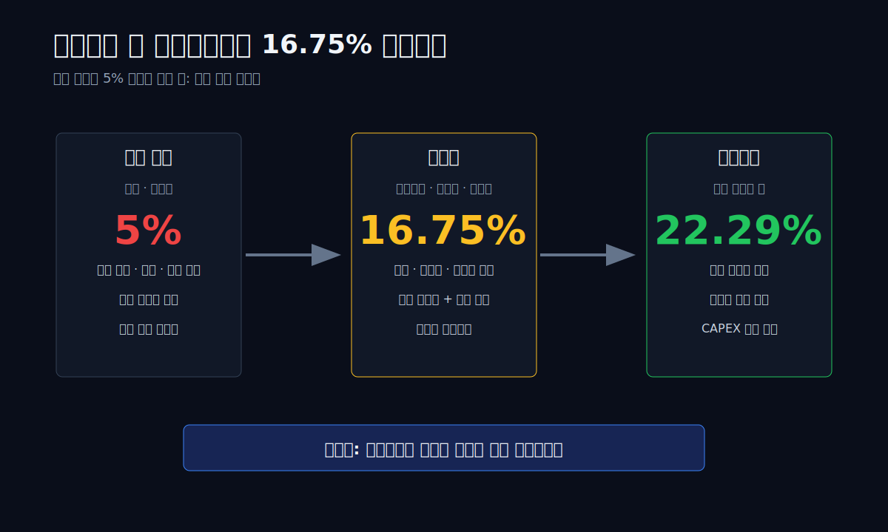
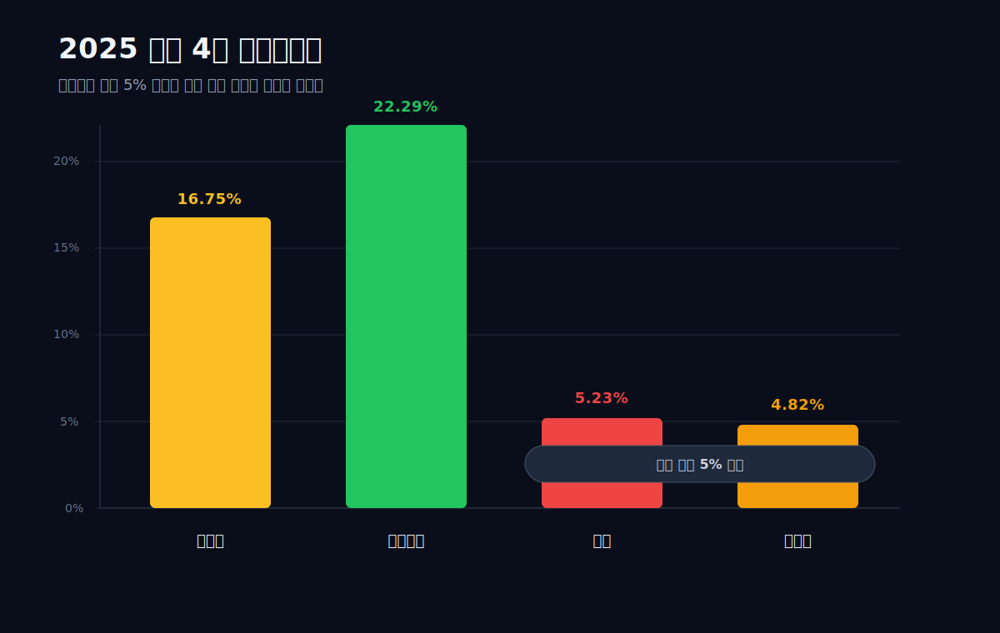
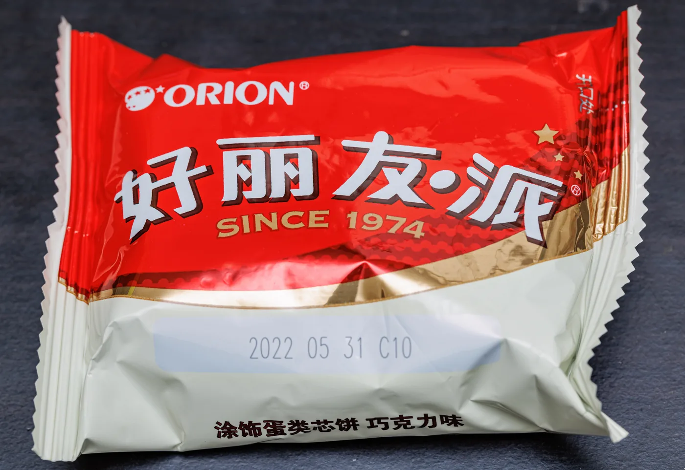
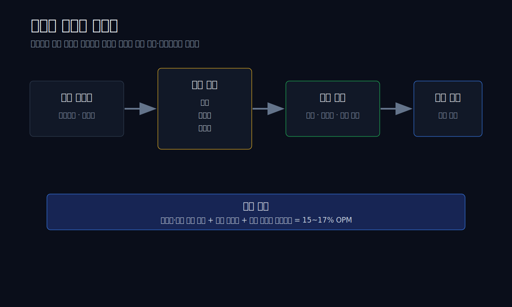
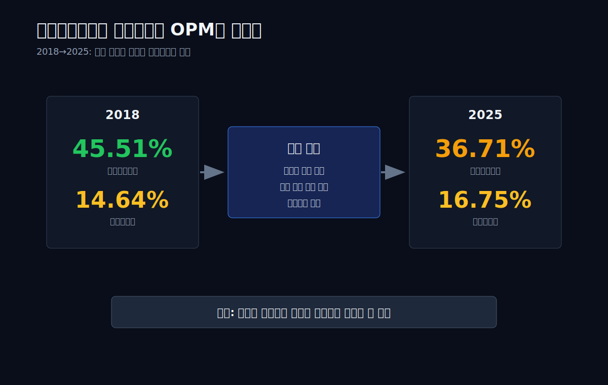
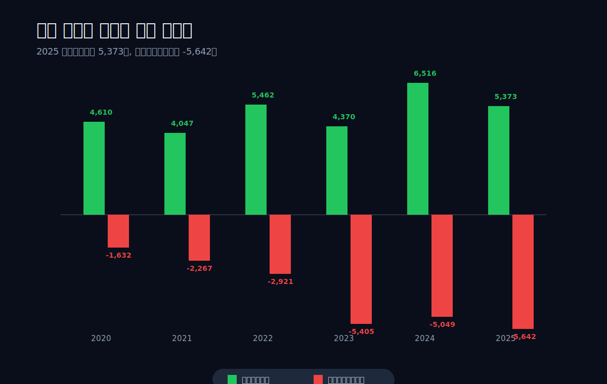
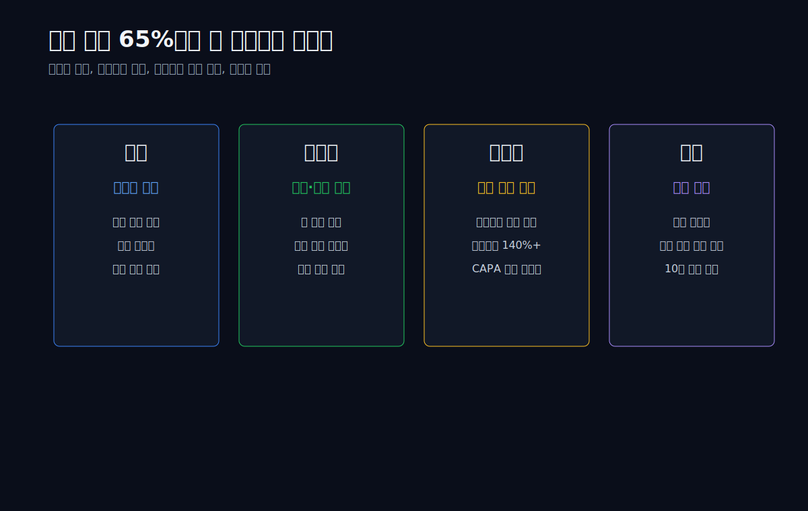
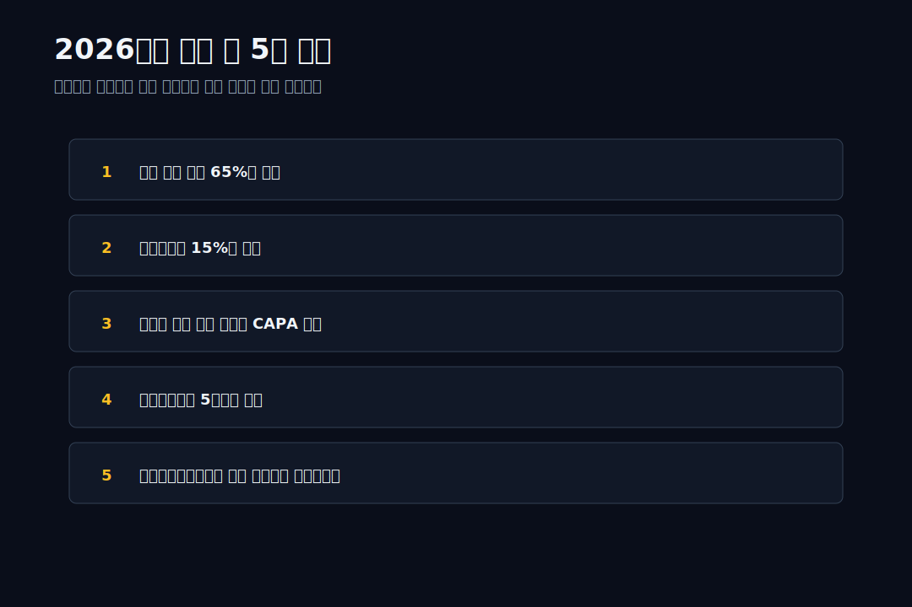

<script>
import ComboChart from '$lib/components/blog/ComboChart.svelte';
import StackBar from '$lib/components/blog/StackBar.svelte';
import HFDataLink from '$lib/components/blog/HFDataLink.svelte';
</script>

> **프랜차이즈** | 식품·음료 > 제과 | 2026-04-28 dartlab 실측
> 같은 시리즈: [삼양식품](/blog/samyang-foods) · [농심](/blog/nongshim) · [오뚜기](/blog/ottogi) · [실리콘투](/blog/silicon2) · [기업이야기 시리즈 전체](/blog/series/company-reports)

<HFDataLink code="271560" />

[삼양식품](/blog/samyang-foods)의 2025년 영업이익률은 22.29%다. [농심](/blog/nongshim)은 5.23%, [오뚜기](/blog/ottogi)는 4.82%다. 같은 식품인데 마진이 네 배 갈린다. 라면 글 세 편의 결론은 단순했다. 내수 식품은 가격을 마음대로 올리지 못한다. 원재료비가 오르면 마진이 눌리고, 대형마트와 편의점 프로모션이 붙으면 5%대에서 벗어나기 어렵다.

그런데 오리온(271560)은 제과회사인데 2025년 영업이익률이 **16.75%**다. 매출은 3.33조원, 영업이익은 5,582억원. 농심보다 매출은 작지만 영업이익은 세 배다. 오뚜기보다 매출은 3,420억원 작지만 영업이익은 3.1배다. 초코파이와 포카칩을 파는 회사가 왜 내수 식품의 천장을 벗어났는가.

답은 "해외 수출"보다 한 단계 더 깊다. 오리온은 한국에서 만든 과자를 외국에 보내는 회사가 아니다. 중국, 베트남, 러시아에 공장을 깔고 현지 유통망 안으로 들어간 회사다. 초코파이는 한국 제품이지만, 중국 소비자에게는 중국 슈퍼마켓에서 사는 현지 간식이다. 베트남 소비자에게는 명절 선물이고, 러시아 소비자에게는 부족해서 공장 가동률이 140%를 넘는 제품이다.


*오리온 초코파이 패키지. 이 글의 핵심은 제품 자체보다 이 제품이 한국 수출품을 넘어 중국·베트남·러시아 현지 진열대에 올라가는 방식이다. (출처: Wikimedia Commons, CC BY-SA 계열 라이선스)*



```python
import dartlab

o = dartlab.Company("271560")   # 오리온
s = dartlab.Company("003230")   # 삼양식품
n = dartlab.Company("004370")   # 농심
t = dartlab.Company("007310")   # 오뚜기

o.analysis("financial", "수익성")
o.select("IS", ["매출액", "영업이익", "당기순이익"], freq="Y")
o.select("CF", ["영업활동현금흐름", "투자활동현금흐름"], freq="Y")
```

## 1막: 매출 3.33조, 영업이익률 16.75% — 제과회사 같지 않은 숫자

왜 초코파이 회사의 영업이익률이 농심의 세 배인가.

2025년 오리온의 연결 매출은 **3.332조원**, 영업이익은 **5,582억원**이다. 영업이익률은 **16.75%**. 제과·라면·소스·가공식품을 같은 식품 업종으로 묶으면 이 숫자는 튄다. 농심 5.23%, 오뚜기 4.82%와 비교하면 오리온은 다른 업종처럼 보인다.

| 항목 (1년치 합산) | 오리온 | 삼양식품 | 농심 | 오뚜기 |
|:---|---:|---:|---:|---:|
| 매출액 | 3.33조 | 2.35조 | 3.51조 | 3.67조 |
| 영업이익 | 5,582억 | 5,242억 | 1,839억 | 1,773억 |
| 영업이익률 | **16.75%** | **22.29%** | 5.23% | 4.82% |
| 매출총이익률 | 36.71% | 44.78% | 28.99% | 16.10% |
| 영업현금흐름 | 5,373억 | 3,093억 | 2,687억 | 2,189억 |

표시: 오리온은 삼양식품만큼 폭발적이지는 않다. 하지만 농심·오뚜기와는 다른 층에 있다. 매출총이익률 36.71%는 오뚜기의 두 배가 넘고, 영업이익률 16.75%는 농심의 3.2배다. 더 중요한 것은 이 수익성이 한 해 튄 숫자가 아니라는 점이다.

| 연도 | 2025 | 2024 | 2023 | 2022 | 2021 | 2020 | 2019 | 2018 |
|:---|---:|---:|---:|---:|---:|---:|---:|---:|
| 매출액(조원) | 3.33 | 3.10 | 2.91 | 2.87 | 2.36 | 2.23 | 2.02 | 1.93 |
| 영업이익률 | 16.75% | 17.51% | 16.91% | 16.24% | 15.83% | 16.87% | 16.19% | 14.64% |
| 매출총이익률 | 36.71% | 38.53% | 38.71% | 37.98% | 40.18% | 42.74% | 45.14% | 45.51% |

2018년 이후 오리온의 영업이익률은 한 번도 14% 아래로 내려가지 않았다. 2020년 코로나, 2022년 원재료 상승, 2024~2025년 카카오·유지류 가격 부담을 지나도 숫자는 15~17% 박스권에 남아 있다. 라면 3사가 원가와 판촉비에 흔들릴 때, 오리온은 같은 식품인데도 마진 방어가 됐다.

이 지점이 글의 관통선이다. **오리온은 왜 식품회사인데 식품회사 마진을 벗어났는가.**



오리온의 숫자는 삼양식품과도 다르다. 삼양식품은 불닭이라는 단일 브랜드가 글로벌 밈이 되면서 2024~2025년에 마진이 급등했다. 오리온은 그런 갑작스러운 폭발이 아니다. 오리온은 2018년에도 14.64%, 2019년에도 16.19%, 2020년에도 16.87%였다. 즉 오리온의 16% 마진은 유행이 아니라 구조다.

그 구조는 어디서 왔을까. 제품이 프리미엄이라서만은 아니다. 초코파이는 고가 명품 과자가 아니다. 편의점과 마트에서 파는 대중 제품이다. 답은 제품보다 **시장 위치**에 있다.

## 2막: 초코파이는 수출품이 아니라 현지 식품이 됐다

왜 해외 비중이 높으면 마진이 달라지는가.

오리온의 핵심은 해외 매출 비중이다. 2025년 1분기 실적 발표에서 오리온의 해외 매출 비중은 **68%**로 언급됐고, 2025년 연간 보도 기준 해외 비중은 **65.4%**다. 기준 시점은 다르지만 방향은 같다. 한국 식품회사 중 매출의 3분의 2 안팎을 해외에서 만드는 회사는 많지 않다. 삼양식품도 해외 비중이 77%로 더 높지만, 삼양은 한국 생산 수출의 비중이 크다. 오리온은 중국·베트남·러시아 현지 법인과 공장이 크다.

오리온의 역사는 이 차이를 보여준다. 1990년대 초코파이가 중국에서 팔리기 시작했고, 1997년 중국 현지 법인이 세워졌다. 이후 베이징·상하이·광저우·선양 등 중국 주요 거점에 생산과 판매망을 깔았다. 베트남도 2000년대 중반부터 현지 생산을 시작했고, 러시아는 초코파이와 비스킷 수요를 기반으로 공장을 증설했다.


*중국판 오리온 초코파이. 초코파이는 한국 수출품이 아니라 중국 현지 소비자가 마트에서 고르는 대중 간식이 됐다. (출처: Wikimedia Commons, Dinkun Chen, CC BY-SA 4.0)*

식품 수출은 보통 세 가지 한계에 걸린다.

1. 운송비가 붙는다.
2. 유통기한과 현지 재고 부담이 커진다.
3. 현지 가격이 환율과 관세에 흔들린다.

현지 생산은 이 세 가지를 줄인다. 원재료 일부를 현지에서 사고, 현지 통화로 팔고, 현지 유통망에 넣는다. 소비자에게는 "수입 과자"가 아니라 마트에 늘 있는 브랜드가 된다. 그래서 오리온 초코파이는 한국의 추억 상품이면서 동시에 중국·베트남·러시아의 현지 대중 간식이 됐다.

이 차이가 라면 빅3와 갈린다. 농심과 오뚜기는 국내에서 생필품 가격 압박을 받는다. 신라면과 진라면 가격은 물가 뉴스가 된다. 초코파이도 한국에서는 대중 간식이지만, 오리온 전체 실적에서 한국은 더 이상 전부가 아니다. 해외 법인이 전체 매출의 3분의 2를 만들면 한국 가격 규제와 국내 판촉 경쟁의 비중이 줄어든다.

여기서 "해외 비중"이라는 표현을 조심해야 한다. 단순 수출 비중이 높다는 뜻이면 환율, 운임, 통관, 한국 공장 가동률에 실적이 크게 묶인다. 현지 법인 비중이 높다는 뜻이면 이야기가 달라진다. 현지에서 만들고 현지에서 팔면 제품 가격과 원가가 같은 통화권에서 움직인다. 한국 원화 기준 환산 효과는 남지만, 소비자가 지불하는 가격과 매장 진열의 힘은 현지 법인이 직접 잡는다.

오리온이 강한 이유는 이 두 번째 쪽에 있다. 초코파이·스낵의 레시피와 브랜드는 한국에서 출발했지만, 매출을 만드는 실무는 현지 공장과 현지 영업망이 맡는다. 그래서 오리온의 해외 매출은 "한국 과자가 외국에서 인기"라는 기사식 문장보다 더 무겁다. 재무제표 관점에서는 현지 고정비를 깔고 그 위에 물량을 얹는 구조다.



2025년 1분기 오리온은 연결 매출 8,018억원, 영업이익 1,314억원을 기록했고, 중국·베트남·러시아 주요 해외 법인과 한국 법인의 수출 증가가 실적을 견인했다고 밝혔다. 2025년 연간으로도 매출 3.33조원, 영업이익 5,582억원을 냈다. 외부 보도에서는 러시아가 47.2%, 인도가 30.3% 성장했고, 러시아 법인은 초코파이 5개 생산라인 가동률이 140%를 넘는 등 공급 부족 상황이라고 전했다.

공급 부족이라는 말은 중요하다. 내수 식품회사는 대개 수요보다 판촉이 문제다. 더 팔려면 할인해야 한다. 반대로 공급이 부족한 회사는 가격과 믹스를 지킬 수 있다. 오리온 러시아 법인의 140% 가동률은 단순한 지역 뉴스가 아니라, 전사 마진 방어의 한 조각이다.

## 3막: 16% 마진의 비밀 — 원가율보다 판관비 구조가 중요하다

오리온은 왜 매출총이익률이 내려가도 영업이익률을 지키는가.

오리온의 매출총이익률은 2018년 45.51%에서 2025년 36.71%로 내려왔다. 원가 부담이 꽤 커졌다. 카카오, 유지류, 견과류, 설탕 같은 원재료 가격이 오르면 제과회사는 바로 영향을 받는다. 2025년에도 주요 원재료 가격 상승과 고환율이 제조원가 부담으로 언급됐다.

그런데 영업이익률은 2018년 14.64%에서 2025년 16.75%로 오히려 높다. 매출총이익률은 8.80%포인트 내려갔는데, 영업이익률은 2.11%포인트 올랐다. 이상하다. 원가율이 나빠졌는데 어떻게 영업이익률이 버텼을까.

답은 판관비 레버리지다.

| 연도 | 매출총이익률 | 영업이익률 | 차이 |
|:---|---:|---:|---:|
| 2018 | 45.51% | 14.64% | 30.87%p |
| 2019 | 45.14% | 16.19% | 28.95%p |
| 2020 | 42.74% | 16.87% | 25.87%p |
| 2021 | 40.18% | 15.83% | 24.35%p |
| 2022 | 37.98% | 16.24% | 21.74%p |
| 2023 | 38.71% | 16.91% | 21.80%p |
| 2024 | 38.53% | 17.51% | 21.02%p |
| 2025 | 36.71% | 16.75% | 19.96%p |

매출총이익률과 영업이익률의 차이는 판관비와 일부 조정 항목의 부담을 나타낸다. 2018년에는 그 차이가 30.87%포인트였는데, 2025년에는 19.96%포인트다. 매출이 1.93조원에서 3.33조원으로 커지는 동안, 영업망·브랜드·공장·관리비가 매출만큼 비례해서 늘지 않았다. 해외 법인이 자리 잡은 뒤에는 같은 유통망으로 더 많은 제품을 밀어 넣을 수 있다.

이게 프랜차이즈형 식품회사의 장점이다. 브랜드가 이미 있고, 진열대가 이미 있고, 공장과 물류망이 이미 있으면 신제품 하나가 추가될 때 매출은 늘지만 고정비는 덜 는다. 초코파이 하나로 끝나는 것이 아니라 고래밥, 포카칩, 꼬북칩, 오!감자, 예감 같은 제품이 같은 채널을 탄다.

삼양식품은 불닭 하나가 너무 강해서 마진이 폭발했다. 오리온은 반대로 제품 포트폴리오가 넓고, 해외 법인 채널이 이미 깔려 있어 마진이 안정적이다. 어느 쪽이 더 좋은지는 투자자 성향에 따라 다르다. 폭발력은 삼양이 강하고, 방어력은 오리온이 강하다.



## 4막: 현금흐름은 좋다 — 그런데 2025년 단순 OCF+ICF는 마이너스다

오리온은 돈을 잘 버는데 왜 잉여현금흐름이 눌렸는가.

오리온의 영업현금흐름은 매우 좋다. 2025년 영업현금흐름은 **5,373억원**이다. 같은 해 영업이익 5,582억원과 거의 같다. 이익이 장부에만 있는 것이 아니라 현금으로 들어온다. 2024년에는 영업현금흐름이 6,516억원으로 영업이익보다 컸다. 식품회사의 장점이 여기서 나온다. 재고와 매출채권이 늘어도, 현금 회수가 비교적 빠르고 반복 구매가 많다.

하지만 2025년 잉여현금흐름은 편하지 않다. 투자활동현금흐름이 **-5,642억원**이었기 때문이다. 엄밀한 FCF는 CAPEX와 운전자본 조정을 따로 계산해야 하지만, 여기서는 빠른 점검용으로 **단순 OCF+ICF**를 쓴다. 2025년 단순 OCF+ICF는 **5,373억원 + (-5,642억원) = -269억원**이다. 2024년에는 +1,467억원이었고, 2023년에는 -1,036억원이었다. 즉 오리온은 돈을 벌면서 동시에 계속 공장과 설비에 돈을 넣고 있다.

| 연도 | 영업현금흐름 | 투자활동현금흐름 | 단순 OCF+ICF |
|:---|---:|---:|---:|
| 2025 | 5,373억 | -5,642억 | **-269억** |
| 2024 | 6,516억 | -5,049억 | +1,467억 |
| 2023 | 4,370억 | -5,405억 | -1,036억 |
| 2022 | 5,462억 | -2,921억 | +2,540억 |
| 2021 | 4,047억 | -2,267억 | +1,780억 |
| 2020 | 4,610억 | -1,632억 | +2,978억 |

이 표는 오리온을 단순한 안정주로만 보면 안 된다는 뜻이다. 오리온은 현금이 남아서 배당만 하는 회사가 아니라, 해외 생산능력을 계속 늘리는 회사다. 러시아 공급 부족, 베트남·인도 성장, 미국·유럽 수출 확대가 계속된다면 CAPEX는 단순 비용이 아니라 다음 매출의 입장권이다.

하지만 CAPEX는 항상 양면이다. 수요가 유지되면 성장 투자이고, 수요가 꺾이면 고정비가 된다. 오리온 글에서 2026년에 봐야 할 첫 지표는 매출 성장률이 아니라 **투자한 공장이 얼마나 빨리 매출로 돌아오는가**다.



## 5막: 순이익 -26.8% — 영업은 멀쩡한데 headline이 흔들렸다

왜 2025년 순이익은 줄었나.

이 막은 관통선의 예외처럼 보이지만 사실 반대다. 오리온을 볼 때 본업 마진과 headline 순이익을 분리해야 한다는 점을 보여준다. 이 회사의 핵심은 순이익 한 해 증감이 아니라 **영업이익률 15~17%가 유지되는가**다.

2025년 오리온의 영업이익은 5,582억원으로 전년 대비 2.7% 증가했다. 그런데 당기순이익은 3,906억원으로 2024년 5,332억원보다 **26.75% 감소**했다. 영업은 버텼는데 순이익이 크게 줄었다. 이것은 "오리온이 갑자기 나빠졌다"는 뜻이 아니다. 2024년에 리가켐바이오사이언스 지분 취득 관련 파생상품 평가이익 등 비경상손익 **1,437억원**이 반영됐고, 2025년에는 그 효과가 빠졌다. 그래서 2025년 순이익 감소는 본업 훼손보다 2024년 비경상 이익의 기저효과를 먼저 봐야 한다.

| 연도 | 영업이익 | 당기순이익 | 순이익률 |
|:---|---:|---:|---:|
| 2025 | 5,582억 | 3,906억 | 11.72% |
| 2024 | 5,436억 | 5,332억 | 17.18% |
| 2023 | 4,924억 | 3,850억 | 13.22% |
| 2022 | 4,667억 | 3,983억 | 13.86% |
| 2021 | 3,729억 | 2,637억 | 11.19% |

2024년 순이익률 17.18%는 오리온의 정상 범위보다 높다. 2025년 11.72%는 오히려 2021년 수준과 비슷하다. 그래서 headline만 보면 "순이익 급감"이지만, 본업 수익성은 16~17% OPM을 유지했다.

투자자는 여기서 두 가지를 분리해야 한다. 첫째, 영업이익률 16.75%는 여전히 강하다. 둘째, 순이익이 영업이익과 같이 움직이지 않는 해에는 영업외 손익, 법인세, 환율, 일회성 비용을 따로 봐야 한다. 오리온은 본업이 망가진 회사가 아니라, 본업은 안정적인데 headline 순이익이 흔들린 회사다.

이 차이는 [유한양행](/blog/yuhan)의 영업외 구조와도 연결된다. 유한양행은 본업 마진이 낮지만 영업외 두 기둥이 순이익을 키운다. 오리온은 반대로 본업 마진이 높고, 순이익 변동은 본업 위에 얹힌 층이다. 그래서 오리온 분석의 중심은 순이익보다 영업이익률과 현금흐름이어야 한다.

## 6막: 중국·베트남·러시아 — 세 나라가 같은 역할을 하지 않는다

오리온 해외 성장은 한 덩어리가 아니다.

해외 비중 65.4%라는 연간 숫자는 편하지만, 너무 뭉뚱그리면 틀린다. 중국, 베트남, 러시아는 각각 다른 역할을 한다.

중국은 규모의 시장이다. 오리온이 오래전부터 쌓아온 유통망과 브랜드 인지도가 있다. 다만 중국 소비 둔화와 로컬 경쟁은 성장률의 부담이다. 오리온의 중국 사업은 이제 "고성장 신시장"이라기보다 "큰 기반을 지키면서 제품과 채널을 바꾸는 시장"에 가깝다.

베트남은 명절과 선물 수요가 중요한 시장이다. 초코파이는 단순 간식이 아니라 가족·선물·명절 소비와 연결된다. 뗏 효과가 축소되면 분기 실적이 흔들릴 수 있지만, 현지에서 브랜드가 자리 잡으면 반복 구매가 생긴다.

러시아는 2025년에 가장 강한 성장 축이다. 외부 보도에 따르면 러시아 법인은 2025년에 높은 성장률을 보였고, 초코파이 생산라인 가동률이 140%를 넘는 공급 부족 상황까지 언급됐다. 지정학 리스크는 있지만, 수요 자체는 강하다. 이 시장은 오리온의 2026년 성장 서사에서 가장 눈에 띄는 축이다.

인도는 아직 규모보다 옵션에 가깝다. 성장률은 높지만 절대 규모가 중국·베트남·러시아와 같다고 보기 어렵다. 오리온의 투자 포인트는 인도가 바로 실적을 바꾸는지가 아니라, 인도가 다음 10년의 네 번째 축이 될 수 있는지다.

2025년 보도 기준으로 공개된 지역별 힌트를 정리하면 다음과 같다.

| 지역 | 2025년에 확인된 신호 | 해석 |
|:---|:---|:---|
| 중국 | 간식점 채널 비중 확대, 성장세 회복 기대 | 규모는 크지만 소비 둔화와 로컬 경쟁을 같이 봐야 함 |
| 베트남 | 일부 분기 둔화, 명절·선물 수요 영향 | 계절성과 내수 소비가 분기 실적을 흔듦 |
| 러시아 | 매출 +47.2%, 초코파이 5개 생산라인 가동률 140% 초과 | 2025년 가장 강한 성장축, 공급 부족이 병목 |
| 인도 | 매출 +30.3%, 절대 매출 275억원 보도 | 아직 작지만 다음 10년 옵션 |

표시: 러시아와 인도는 성장률이 높지만 성격이 다르다. 러시아는 이미 의미 있는 규모가 된 생산·판매 법인이고, 인도는 아직 작지만 새 지역 확장성의 증거다. 중국은 성장률보다 채널 믹스와 수익성 회복이 중요하고, 베트남은 명절 수요와 내수 소비를 같이 봐야 한다.



내수형 식품주 비교와 여기서 갈린다. 농심과 삼양도 해외에서 잘 판다. 하지만 오리온의 강점은 개별 제품 유행보다 지역 포트폴리오다. 한 나라가 둔화해도 다른 나라가 보완한다. 2025년에도 중국과 베트남의 명절 효과가 약했지만 러시아·인도·수출이 전체 성장을 보완했다.

## 7막: 투자 포인트 — 2026년에 오리온은 무엇을 봐야 하나

오리온의 관통선은 "내수 식품의 마진 천장을 해외 현지화로 깬 회사"다. 따라서 앞으로 봐야 할 지표도 이 관통선에서 나온다.

첫째, 해외 매출 비중 65%대가 유지되는지 봐야 한다. 오리온의 프리미엄은 국내 제과 1위가 아니라 해외 현지 생산망에서 나온다. 해외 비중이 더 올라가면 내수 가격 경쟁의 영향은 줄고, 현지 공장 레버리지가 커진다.

둘째, 영업이익률 16% 방어 여부다. 오리온은 2019년 이후 15~17%를 유지했다. 2026년에 원재료 가격이 다시 오르거나 중국 판촉 경쟁이 강해져도 15%대를 지키면 구조는 살아 있다. 14% 아래로 내려가면 관통선이 흔들린다.

셋째, 러시아와 인도의 생산능력 확장 속도다. 러시아는 공급 부족이 성장의 병목이다. 인도는 아직 옵션이지만, 스낵 소비가 커지는 시장이다. 두 시장이 CAPEX를 흡수하면 2025년의 마이너스 단순 OCF+ICF는 성장 투자로 해석된다. 반대로 매출이 따라오지 않으면 CAPEX는 고정비가 된다.

넷째, 순이익보다 영업현금흐름이다. 2025년 순이익은 전년 대비 줄었지만 영업현금흐름은 5,373억원이다. 오리온의 품질은 headline 순이익보다 현금 회수에서 확인된다.

다섯째, 라면·제과 식품 클러스터 안에서의 상대 위치다. 삼양식품은 폭발형, 농심·오뚜기는 내수 천장형, 오리온은 글로벌 현지화형이다. 식품 업종을 한 묶음으로 보면 이 차이를 놓친다.



## 8막: 담철곤·이화경 체제 — 브랜드보다 오래 남은 것은 해외 법인이다

오리온을 숫자로만 보면 조용한 고마진 회사다. 하지만 이 구조가 그냥 생긴 것은 아니다. 오리온의 해외화는 제품 한두 개를 외국에 뿌린 이벤트가 아니라, 1990년대부터 쌓인 장기 의사결정의 결과다.

오리온의 전신은 동양제과다. 초코파이는 1974년에 출시됐다. 한국에서는 어린 시절 간식, 군대 간식, 학교 매점 간식으로 기억된다. 그러나 이 제품이 회사의 재무제표를 바꾼 시점은 국내가 아니라 해외였다. 중국에서 초코파이가 팔리기 시작하고, 현지 법인과 생산거점이 생기면서 초코파이는 한국 추억 상품에서 아시아·러시아권 대중 간식으로 이동했다.

담철곤 회장과 이화경 부회장 체제에서 오리온은 제과와 엔터테인먼트, 외식, 미디어를 오가며 여러 갈래를 시도했다. 하지만 지금 재무제표에 남은 핵심은 제과, 그중에서도 해외 법인이다. 이건 흥미롭다. 경영자가 여러 방향을 시도해도, 재무제표는 결국 살아남은 엔진만 남긴다. 오리온에서 살아남은 엔진은 초코파이 브랜드 하나가 아니라 그 브랜드를 현지에서 만들고 파는 법인 네트워크다.

이 점에서 오리온은 농심과도 다르고 삼양식품과도 다르다. 농심은 국내 라면 시장 1위라는 위치가 너무 강해서 정부 물가 압박과 국민 라면 프레임을 피하기 어렵다. 삼양식품은 불닭이라는 강력한 단일 브랜드가 세계로 나간다. 오리온은 둘 사이 어딘가에 있다. 초코파이라는 장수 브랜드가 있지만, 회사 전체를 설명하는 것은 단일 제품보다 해외 법인의 반복 판매 구조다.

식품회사에서 장수 브랜드는 양날의 검이다. 오래 팔린 제품은 소비자가 알고, 유통업자가 받아주고, 광고비를 덜 써도 진열된다. 하지만 오래 팔린 제품은 가격을 크게 올리기 어렵다. 소비자가 기준 가격을 기억하기 때문이다. 오리온은 이 장수 브랜드의 약점을 해외에서 줄였다. 한국 소비자는 초코파이의 과거 가격을 기억하지만, 중국·베트남·러시아 소비자는 각 시장의 현지 가격대와 경쟁 제품 안에서 초코파이를 평가한다.

그래서 오리온의 해외화는 단순히 "더 큰 시장으로 갔다"가 아니다. 가격 기억이 다른 시장으로 갔다. 유통 구조가 다른 시장으로 갔다. 제품의 의미가 다른 시장으로 갔다. 한국에서는 오래된 국민 간식이지만, 해외에서는 현지 명절·학교·가정 소비에 들어간 브랜드가 됐다. 이 차이가 재무제표에서 16% OPM으로 나타난다.

한 회사의 해외 진출은 보통 두 단계로 실패한다. 첫 번째 실패는 제품만 보내는 것이다. 한국에서 잘 팔리는 제품을 그대로 수출했는데 현지 소비자가 왜 사야 하는지 모르는 경우다. 두 번째 실패는 마케팅만 하는 것이다. 광고와 이벤트로 한 번 띄우지만 공급망과 유통망이 따라오지 않아 반복 구매가 생기지 않는 경우다. 오리온은 이 두 단계를 모두 넘었다. 제품을 보냈고, 공장을 지었고, 유통망을 깔았고, 현지 소비자의 반복 구매에 들어갔다.

이 장기성이 오리온의 방어력이다. 2025년 매출총이익률은 36.71%로 과거보다 낮다. 원가 부담은 분명히 있다. 그런데 영업이익률은 16.75%다. 단기 이벤트만으로 만든 마진이면 원가가 올라갈 때 바로 무너진다. 오리온은 무너지지 않았다. 법인·공장·유통망이 원가 부담을 흡수했다.

## 9막: 경쟁사는 왜 같은 길을 못 갔나

오리온을 제대로 보려면 롯데웰푸드와 라면 3사를 같이 봐야 한다. 같은 식품인데 누구는 해외화가 마진을 바꾸고, 누구는 해외 매출이 있어도 내수 구조를 크게 벗어나지 못한다.

롯데웰푸드는 한국 제과의 또 다른 큰 축이다. 껌, 빙과, 과자, 초콜릿, 가공식품까지 포트폴리오가 넓다. 하지만 넓은 포트폴리오가 곧 높은 마진을 뜻하지 않는다. 제품이 많으면 생산·물류·판촉이 복잡해지고, 내수 유통 채널에서 가격 경쟁이 붙는다. 제과·빙과는 편의점, 대형마트, 온라인 채널의 프로모션 강도가 높다. 매대에 들어가는 순간 가격표와 할인 행사가 소비자를 움직인다.

오리온도 같은 유통 채널에 있다. 하지만 오리온은 해외 법인이 연결 실적의 큰 비중을 차지한다. 국내에서 한 봉지 더 팔기 위해 할인하는 구조만으로 회사 전체가 설명되지 않는다. 중국·베트남·러시아에서 현지 가격과 현지 유통망을 통해 매출을 만든다. 그래서 국내 제과 경쟁의 마진 압박이 전체 손익을 덜 흔든다.

라면 3사와 비교하면 차이가 더 선명하다. 라면은 국민 생필품에 가깝다. 신라면, 진라면, 삼양라면 가격은 소비자가 매우 민감하게 기억한다. 정부도 물가 안정 프레임으로 라면 가격을 본다. 라면 회사가 국내 가격을 올리면 바로 뉴스가 된다. 제과도 물가 민감 품목이지만, 오리온의 전체 손익은 국내 라면 가격처럼 한 제품의 국민 가격에 묶이지 않는다.

삼양식품은 이 한계를 불닭으로 뚫었다. 불닭은 국민 생필품이 아니라 챌린지와 취향의 제품이다. 소비자는 더 높은 가격을 받아들일 수 있고, 해외에서는 K-콘텐츠 소비와 같이 움직인다. 그래서 삼양식품의 매출총이익률은 2025년 44.78%까지 올라갔다. 오리온보다 높다. 다만 삼양식품은 불닭 의존도가 높고, 공격적인 CAPEX가 이어진다. 성장의 기울기는 가파르지만, 제품 집중 리스크도 크다.

오리온의 장점은 기울기가 아니라 면적이다. 초코파이 하나만 보는 회사가 아니다. 지역도 여럿이고 제품도 여럿이다. 중국이 둔화하면 러시아·베트남·수출이 보완하고, 초코파이 외에도 포카칩·꼬북칩·오!감자 같은 스낵이 채널을 탄다. 이것이 삼양식품의 "불닭 폭발"과 다른 "현지화 포트폴리오"다.

| 비교 대상 | 강점 | 약점 | 오리온과의 차이 |
|:---|:---|:---|:---|
| 삼양식품 | 불닭 글로벌 수요, OPM 22.29% | 단일 브랜드 집중, CAPEX 부담 | 폭발력은 삼양, 안정성은 오리온 |
| 농심 | 국내 라면 1위, 해외 법인 보유 | 생필품 가격 압박, OPM 5.23% | 규모는 크지만 마진 레벨이 다름 |
| 오뚜기 | 다품종 내수 식탁 장악 | 내수 비중 높고 OPM 4.82% | 안정성은 있지만 해외 레버리지 약함 |
| 롯데웰푸드 | 제과·빙과 포트폴리오 넓음 | 복잡한 제품군, 내수 판촉 압박 | 오리온은 해외 법인 비중이 더 강함 |

이 표의 결론은 "오리온이 제일 좋다"가 아니다. 각 회사의 좋은 점이 다르다. 삼양식품은 성장주처럼 봐야 하고, 농심·오뚜기는 내수 프랜차이즈처럼 봐야 한다. 오리온은 글로벌 현지화 프랜차이즈다. 식품업 안에서도 재무제표를 읽는 렌즈가 달라야 한다.

## 10막: 리스크 — 해외 현지화는 방어막이면서 노출이다

오리온의 강점은 해외 현지화다. 동시에 리스크도 해외 현지화에서 나온다. 좋은 글은 강점만 말하면 안 된다. 오리온이 16% OPM을 유지하는 이유를 설명했다면, 그 구조가 언제 깨질지도 같이 봐야 한다.

첫 번째 리스크는 중국 둔화다. 중국은 오리온 해외 사업의 오래된 기반이다. 기반이 크면 성장률이 낮아지는 것은 자연스럽다. 문제는 소비 둔화와 로컬 경쟁이 겹칠 때다. 중국 소비자가 더 싼 로컬 과자로 이동하거나, 유통 채널에서 판촉 강도가 올라가면 오리온의 매출총이익률은 눌릴 수 있다. 2025년 매출총이익률 36.71%는 이미 과거 40%대보다 낮다. 중국에서 가격과 믹스가 더 나빠지면 OPM 15% 방어가 어려워질 수 있다.

두 번째 리스크는 원재료다. 초콜릿과 스낵은 카카오, 유지류, 설탕, 감자, 포장재 가격에 영향을 받는다. 원재료가 오르면 매출총이익률이 먼저 내려간다. 오리온은 판관비 레버리지로 이를 흡수해 왔지만, 판관비율은 영원히 줄일 수 없다. 이미 2018~2025년 동안 판관비 부담은 크게 낮아졌다. 앞으로 원가가 한 번 더 크게 뛰면 영업이익률 방어 여지가 과거보다 작을 수 있다.

세 번째 리스크는 환율과 지정학이다. 현지 생산은 수출보다 안정적이지만, 연결 재무제표는 원화로 환산된다. 러시아처럼 지정학 리스크가 큰 시장에서는 수요가 강해도 회계·물류·송금·규제 리스크가 남는다. 러시아 공장 가동률이 높다는 것은 좋은 소식이지만, 동시에 그 시장에 대한 노출이 커진다는 뜻이기도 하다.

네 번째 리스크는 CAPEX 회수다. 2025년 투자활동현금흐름은 -5,642억원이다. 영업현금흐름 5,373억원을 모두 써도 투자 지출을 덮지 못했다. 이것은 나쁜 신호라고 단정할 수 없다. 성장 투자는 원래 현금을 먼저 먹는다. 하지만 2026~2027년에 매출 증가와 OPM 유지로 돌아오지 않으면, 지금의 투자는 현금 압박이 된다.

다섯 번째 리스크는 브랜드 노후화다. 초코파이는 강력한 브랜드지만 오래된 브랜드다. 장수 브랜드는 신뢰를 주지만, 젊은 소비자에게는 새로움이 약할 수 있다. 꼬북칩 같은 신제품이 계속 나와야 한다. 해외에서도 초코파이만으로는 한계가 있다. 지역별로 다른 스낵 포트폴리오가 계속 붙어야 현지 유통망 레버리지가 유지된다.

따라서 오리온의 투자 판단은 단순히 "좋은 회사"로 끝나면 안 된다. 좋은 회사가 비싸지면 수익률은 낮아지고, 좋은 구조도 리스크가 누적되면 숫자가 꺾인다. 오리온은 좋은 구조를 가진 회사지만, 확인할 것은 명확하다. OPM 15% 방어, 영업현금 5천억원대 유지, CAPEX 회수, 중국 둔화 방어, 러시아·인도 성장 지속. 이 다섯 개가 동시에 살아야 "초코파이는 해외 생산망"이라는 관통선이 유지된다.

## 11막: 리가켐바이오 — 제과 현금이 어디로 가는가

오리온 글에서 리가켐바이오사이언스를 빼면 안 된다. 겉으로는 제과회사 이야기와 멀어 보이지만, 2024~2025년 순이익 변동과 자본배분을 설명하는 핵심 사건이다.

오리온은 2024년 리가켐바이오사이언스 지분을 취득했다. 리가켐바이오사이언스는 ADC(항체-약물 접합체) 신약 플랫폼을 가진 바이오 기업이다. 제과회사와 바이오 기업의 조합은 처음 들으면 이상하다. 초코파이로 번 현금이 왜 바이오로 가는가. 이 질문은 오리온 투자자가 반드시 해야 한다.

2024년에는 이 거래가 회계적으로 순이익을 키웠다. 지분 취득 과정에서 파생상품 평가이익 등 비경상손익 1,437억원이 반영됐고, 2024년 당기순이익은 5,332억원까지 올라갔다. 그런데 2025년에는 그 효과가 사라졌다. 그래서 2025년 순이익 3,906억원은 전년 대비 26.75% 감소로 보인다. headline만 보면 순이익 급감이지만, 영업이익은 5,436억원에서 5,582억원으로 늘었다.

이 사건은 두 가지를 동시에 말한다.

첫째, 오리온의 본업은 여전히 현금을 만든다. 2025년 영업현금흐름 5,373억원은 제과 본업과 해외 법인이 실제로 돈을 벌고 있음을 보여준다. 순이익이 줄었다고 해서 초코파이·스낵 사업이 갑자기 망가진 것은 아니다.

둘째, 그 현금의 사용처가 중요해졌다. 과거의 오리온은 해외 공장과 제과 포트폴리오에 투자하는 회사였다. 이제는 바이오라는 완전히 다른 자산에도 돈이 들어간다. 리가켐바이오 투자가 장기적으로 성공하면 제과 현금이 새로운 성장 옵션을 산 것이 된다. 실패하면 제과 본업에서 번 현금이 비관련 투자로 묶인 사례가 된다.

그래서 오리온의 투자 포인트는 하나 더 늘었다. "해외 현지화가 마진을 지키는가"와 함께 "제과 현금이 어디로 배분되는가"를 봐야 한다. 현금흐름이 좋은 회사일수록 자본배분 실수의 비용도 커진다. 돈을 못 버는 회사는 투자할 돈이 없어서 문제지만, 돈을 잘 버는 회사는 그 돈을 어디에 쓰는지가 문제다.

오리온의 리가켐바이오 투자는 아직 결론을 내릴 단계가 아니다. 바이오 투자는 시간이 오래 걸리고, 연구개발 결과는 제과 신제품처럼 바로 매출로 확인되지 않는다. 하지만 블로그 관점에서는 이미 중요한 재무 사건이다. 2024년 순이익을 키웠고, 2025년 순이익 감소의 기저효과가 됐고, 향후 지분법손익과 자본배분 평가에 계속 등장할 가능성이 높다.

따라서 2026년 이후 오리온을 볼 때는 제과 본업만 보는 것이 부족하다. 사업보고서에서 관계기업·공동기업투자, 영업외손익, 지분법손익, 파생상품 평가손익을 같이 봐야 한다. 초코파이가 벌어온 현금이 제과 공장으로 가는지, 바이오 지분으로 가는지, 주주환원으로 돌아오는지에 따라 같은 OPM 16%도 다른 의미가 된다.

## 사업보고서 체크포인트 — 어디를 먼저 봐야 하나

오리온 사업보고서를 열면 숫자가 많다. 하지만 이 글의 관통선에 맞춰 보면 순서는 단순하다.

첫째, 연결 손익계산서에서 매출액과 영업이익을 본다. 이때 순이익부터 보면 안 된다. 2024년 리가켐바이오 관련 비경상손익처럼 본업 밖 숫자가 headline을 흔들 수 있기 때문이다. 오리온의 본업 체력은 영업이익률에서 먼저 확인한다.

둘째, 지역별 또는 종속회사 정보를 본다. 오리온의 핵심은 한국 제과가 아니라 해외 법인이다. 중국, 베트남, 러시아, 인도 법인의 매출과 손익이 어떻게 움직이는지 봐야 한다. 특히 러시아는 2025년 성장률과 공급 부족이 강한 신호였고, 중국은 규모가 큰 만큼 둔화 여부가 중요하다.

셋째, 매출총이익률과 판관비율을 나눠 본다. 매출총이익률이 내려가는데 영업이익률이 버티면 판관비 레버리지가 작동한 것이다. 반대로 매출총이익률도 내려가고 판관비율도 올라가면 구조가 흔들리는 것이다. 오리온의 2018~2025년 핵심은 매출총이익률 하락을 판관비 효율이 흡수했다는 점이다.

넷째, 현금흐름표에서 영업활동현금흐름과 투자활동현금흐름을 같이 본다. 영업현금흐름이 5천억원대인데 투자활동현금흐름이 더 크면, 회사는 현금을 못 버는 것이 아니라 번 돈을 다시 넣는 중이다. 이 투자가 러시아·인도·신제품 매출로 돌아오면 좋고, 그렇지 않으면 고정비 부담이 된다.

다섯째, 영업외손익과 관계기업 주석을 본다. 2024년과 2025년 순이익 차이는 본업 손익만으로 설명되지 않는다. 리가켐바이오 관련 비경상손익 같은 항목이 headline을 흔든다. 오리온 같은 현금 창출 기업은 본업 외 투자도 같이 봐야 한다.

정리하면, 오리온 사업보고서의 읽기 순서는 다음과 같다.

| 순서 | 볼 항목 | 질문 |
|:---|:---|:---|
| 1 | 연결 손익계산서 | OPM 15~17%가 유지됐나 |
| 2 | 지역별 법인/종속회사 | 해외 65%대 구조가 유지됐나 |
| 3 | 매출총이익률·판관비 | 원가 부담을 판관비 레버리지가 흡수했나 |
| 4 | 현금흐름표 | 영업현금이 CAPEX를 감당하나 |
| 5 | 영업외손익·관계기업 | 리가켐바이오 등 비본업 항목이 headline을 흔들었나 |

이 순서로 읽으면 오리온은 복잡하지 않다. 초코파이와 스낵이 해외에서 팔린다. 해외 법인과 공장이 그 매출을 현지에서 만든다. 판관비 레버리지가 마진을 지킨다. 영업현금이 다시 공장과 신사업으로 들어간다. 그리고 영업외 숫자가 순이익을 흔드는지 확인한다. 이 다섯 줄이면 오리온의 사업보고서가 한 화면에 들어온다.

## 실전 루프: 오리온을 다시 볼 때 실행할 순서

오리온은 headline 매출보다 구조 확인이 중요하다. 다음 분기나 다음 사업보고서를 볼 때는 세 줄만 먼저 돌리면 된다.

```python
import dartlab

o = dartlab.Company("271560")
o.select("IS", ["매출액", "영업이익", "당기순이익"], freq="Y")
o.analysis("financial", "수익성")
o.select("CF", ["영업활동현금흐름", "투자활동현금흐름"], freq="Y")
```

첫 번째 줄은 매출과 이익의 방향을 본다. 두 번째 줄은 매출총이익률과 영업이익률의 분해를 본다. 세 번째 줄은 영업현금흐름과 투자활동현금흐름을 같이 본다. 오리온은 순이익보다 영업이익률과 현금흐름이 본업을 더 잘 보여준다.

비교군은 라면 3사가 가장 좋다. 같은 식품이면서 마진 구조가 완전히 다르기 때문이다.

```python
codes = {
    "오리온": "271560",
    "삼양식품": "003230",
    "농심": "004370",
    "오뚜기": "007310",
}

for name, code in codes.items():
    c = dartlab.Company(code)
    print(name, c.analysis("financial", "수익성")["marginTrend"]["history"][0])
```

이 비교에서 봐야 할 것은 순위가 아니다. 삼양식품의 22%가 오리온보다 높다는 사실만 보면 오리온이 덜 좋아 보인다. 하지만 삼양식품의 숫자는 불닭 단일 브랜드 폭발과 2024~2025년 미국 유통 확장이 만든 급경사다. 오리온의 숫자는 2018년부터 2025년까지 15~17%대에 오래 머문 완만한 고원이다. 급경사와 고원은 다른 위험을 가진다.

삼양식품은 불닭 수요가 꺾이거나 CAPEX가 앞서가면 마진과 현금흐름이 동시에 흔들릴 수 있다. 오리온은 특정 제품 하나가 꺾여도 중국·베트남·러시아·한국 수출이 서로 보완한다. 대신 중국 둔화가 길어지고 러시아 지정학 리스크가 커지면 여러 지역이 동시에 할인받을 수 있다. 그래서 오리온의 핵심은 "더 빠른 성장"보다 "여러 지역이 계속 서로를 보완하는가"다.

## 내부 링크로 보는 식품 클러스터

오리온 글은 기존 식품 클러스터의 빈칸을 채운다. [삼양식품](/blog/samyang-foods)은 불닭 하나가 글로벌 밈이 된 폭발형 성장이다. [농심](/blog/nongshim)은 국내 1위가 오히려 가격 결정권을 잃은 사례다. [오뚜기](/blog/ottogi)는 내수 식품의 5% 마진 천장을 가장 정직하게 보여준다. [실리콘투](/blog/silicon2)는 K-뷰티 유통 플랫폼이 매출은 폭발했지만 재고와 현금흐름이 분리된 사례다.

오리온은 이 네 글 사이에서 다른 답을 낸다. 삼양식품처럼 한 제품이 터진 것도 아니고, 농심·오뚜기처럼 국내 생필품 가격 압박에 갇힌 것도 아니다. 실리콘투처럼 재고가 이익을 창고에 묶은 플랫폼도 아니다. 오리온은 제품을 현지 법인과 공장에 태워서 해외 대중식품으로 만든 회사다.

이 차이는 식품업을 볼 때 중요하다. 식품회사는 흔히 안정적이라고 묶이지만, 재무제표는 네 갈래를 보여준다.

| 유형 | 대표 글 | 핵심 질문 | 재무제표 신호 |
|:---|:---|:---|:---|
| 내수 천장형 | 농심·오뚜기 | 가격을 올릴 수 있는가 | OPM 5~7% 박스 |
| 글로벌 밈 폭발형 | 삼양식품 | 단일 브랜드 수요가 지속되는가 | OPM 급등 + CAPEX 확대 |
| 해외 현지화형 | 오리온 | 현지 공장과 유통망이 레버리지 되는가 | OPM 15~17% 장기 유지 |
| 유통 플랫폼형 | 실리콘투 | 이익이 현금으로 회수되는가 | 재고·OCF 괴리 |

이 표가 오리온을 쓰는 이유다. 오리온은 "식품주는 다 비슷하다"는 생각을 깨는 사례다. 같은 과자라도 한국 내수 진열대에만 있으면 가격과 판촉이 마진을 누른다. 해외 현지 법인으로 들어가면 같은 제품이 다른 재무 구조를 만든다.

## 한 문장으로 다시 읽기

오리온 글을 가장 짧게 줄이면 이렇다. **국내에서는 과자지만, 해외에서는 생산망이다.**

국내에서 초코파이는 익숙한 간식이다. 너무 익숙해서 가격을 크게 올리기 어렵고, 편의점과 대형마트에서 할인 경쟁에 들어가기 쉽다. 하지만 중국·베트남·러시아에서 초코파이는 현지 법인의 제품이다. 현지 공장에서 만들고, 현지 영업망이 팔고, 현지 소비자가 반복 구매한다. 같은 제품인데 재무제표에서의 역할이 달라진다.

농심과 오뚜기는 국내 식탁을 장악했지만, 그래서 가격의 자유도가 낮다. 삼양식품은 불닭으로 그 천장을 한 번에 뚫었지만, 단일 브랜드 집중이라는 다른 위험을 얻었다. 오리온은 더 느리지만 오래 가는 길을 택했다. 현지 법인, 현지 공장, 현지 유통망을 여러 나라에 깔았다. 그래서 2025년에도 OPM 16.75%를 냈다.

다만 이 글의 결론은 "오리온은 무조건 좋다"가 아니다. 좋은 회사도 확인하지 않으면 틀린다. 2025년 순이익은 전년 대비 줄었고, 단순 OCF+ICF는 마이너스였고, 리가켐바이오 투자는 제과 현금의 새 사용처가 됐다. 러시아는 강하지만 지정학 리스크가 있고, 중국은 크지만 둔화 리스크가 있다. 즉 오리온은 안정적이지만 단순하지 않다.

그래서 다음 실적을 볼 때 질문은 세 개면 충분하다. 해외 비중 65%대가 유지됐나. OPM 15% 이상이 유지됐나. 영업현금흐름이 CAPEX와 비본업 투자를 감당하나. 이 세 질문에 모두 Yes라면 관통선은 살아 있다. 하나라도 No가 나오면 "초코파이는 해외 생산망"이라는 문장을 다시 검증해야 한다.

마지막으로 이 글은 오리온을 추천하거나 비추천하려는 글이 아니다. 좋은 회사와 좋은 투자는 다르다. 좋은 회사라도 비싸게 사면 기대수익률이 낮아지고, 숫자가 흔들리는 회사라도 가격이 충분히 낮으면 투자 기회가 될 수 있다. 여기서 확인한 것은 하나다. 오리온의 프리미엄은 브랜드 감성이 아니라 현지 생산망의 반복 수익성에서 나온다. 그래서 주가를 보기 전에도 먼저 생산망, 마진, 현금흐름을 따로 봐야 한다.

## 자주 묻는 질문

### 오리온은 삼양식품보다 좋은 회사인가

질문을 이렇게 던지면 답이 흐려진다. 삼양식품과 오리온은 좋은 방식이 다르다. 삼양식품은 불닭이라는 단일 브랜드가 글로벌 수요를 만들면서 2025년 OPM 22.29%까지 올라간 회사다. 성장의 기울기가 매우 가파르다. 반대로 오리온은 2018년 이후 OPM 14~17%대를 오래 유지한 회사다. 폭발력은 삼양식품, 지속성은 오리온 쪽에 더 가깝다. 투자자는 둘 중 누가 더 좋은지가 아니라 어떤 위험을 감당할 것인지 봐야 한다.

### 오리온의 2025년 순이익 감소는 나쁜 신호인가

본업 기준으로는 차단 신호가 아니다. 영업이익은 2024년 5,436억원에서 2025년 5,582억원으로 늘었다. 순이익이 줄어든 핵심 이유는 2024년에 리가켐바이오사이언스 지분 취득 관련 파생상품 평가이익 등 비경상손익 1,437억원이 반영됐고, 2025년에 그 효과가 빠졌기 때문이다. 다만 리가켐바이오 투자는 계속 봐야 한다. 본업 훼손은 아니지만, 제과 현금이 비본업 자산으로 이동한 사건이기 때문이다.

### 오리온에서 가장 먼저 꺾이면 위험한 숫자는 무엇인가

첫 번째는 영업이익률이다. 오리온의 핵심은 OPM 15~17% 방어다. 두 번째는 영업현금흐름이다. 순이익보다 현금 회수가 중요하다. 세 번째는 해외 비중과 러시아·인도 성장률이다. 해외 비중 65%대가 무너지고, 러시아 공급 부족이 성장으로 이어지지 않거나 인도 확장이 멈추면 관통선이 약해진다. 오리온은 "과자가 잘 팔리는가"보다 "현지 생산망이 계속 레버리지 되는가"가 핵심이다.

## 결론: 초코파이는 과자가 아니라 해외 생산망이다

오리온을 한국 제과회사로 보면 2025년 숫자가 이상하다. 초코파이와 포카칩을 파는데 영업이익률 16.75%, 영업이익 5,582억원이다. 오뚜기와 농심이 5% 근처에 묶여 있는데, 오리온은 같은 식품업에서 세 배 마진을 낸다.

하지만 오리온을 해외 현지 생산망으로 보면 숫자가 이해된다. 중국·베트남·러시아에서 브랜드와 공장과 유통망을 쌓았고, 한국 법인은 수출까지 키운다. 초코파이는 한국에서 만든 수출품이 아니라, 여러 나라에서 현지 생산되는 대중 간식이 됐다.

그래서 오리온의 핵심 질문은 "과자가 잘 팔리나?"가 아니다. **해외 현지화가 내수형 식품의 5% 마진 천장을 계속 깰 수 있나?** 이 질문에 대한 2025년 답은 아직 Yes다. 다만 2026년에는 단순 OCF+ICF와 CAPEX 회수, 러시아 공급 부족 해소, 중국 성장 둔화 방어를 같이 봐야 한다.

오리온은 삼양식품처럼 한 제품이 세계를 뒤흔든 회사가 아니다. 농심처럼 국내 1위 생필품 회사도 아니다. 오뚜기처럼 내수 식탁의 안정 프랜차이즈도 아니다. 오리온은 더 조용한 방식으로 식품업의 경계를 넘었다. 초코파이를 현지 제품으로 만든 회사. 그 차이가 5%와 16%를 갈랐다.

## 검증표

| 검증 항목 | 값 | 출처 | 기준 |
|:---|---:|:---|:---|
| 오리온 2025 매출 | 3.332조원 | `dartlab.Company("271560").select("IS", ["매출액"], freq="Y")` | 1년치 합산 |
| 오리온 2025 영업이익 | 5,582억원 | `dartlab.Company("271560").select("IS", ["영업이익"], freq="Y")` | 1년치 합산 |
| 오리온 2025 영업이익률 | 16.75% | `dartlab.Company("271560").analysis("financial", "수익성")` | 1년치 합산 |
| 오리온 2025 ROE | 9.98% | `dartlab.Company("271560").analysis("financial", "수익성")` | 1년치 합산 |
| 오리온 2025 부채비율 | 17.55% | `dartlab.Company("271560").select("ratios", ["부채비율 (%)"])` | 2025Q4 스냅샷 |
| 오리온 2025 영업현금흐름 | 5,373억원 | `dartlab.Company("271560").select("CF", ["영업활동현금흐름"], freq="Y")` | 1년치 합산 |
| 오리온 2025 투자활동현금흐름 | -5,642억원 | `dartlab.Company("271560").select("CF", ["투자활동현금흐름"], freq="Y")` | 1년치 합산 |
| 오리온 2025 단순 OCF+ICF | -269억원 | `영업활동현금흐름 + 투자활동현금흐름` | 빠른 점검용, 엄밀 FCF 아님 |
| 삼양식품 2025 영업이익률 | 22.29% | `dartlab.Company("003230").analysis("financial", "수익성")` | 1년치 합산 |
| 농심 2025 영업이익률 | 5.23% | `dartlab.Company("004370").analysis("financial", "수익성")` | 1년치 합산 |
| 오뚜기 2025 영업이익률 | 4.82% | `dartlab.Company("007310").analysis("financial", "수익성")` | 1년치 합산 |
| 2025년 1분기 해외 매출 비중 | 68% | 오리온 2025년 1분기 실적 관련 보도 | 분기 발표 기준 |
| 2025년 연간 해외 매출 비중 | 65.4% | 동아일보 2026-02-05 보도 | 연간 연결 기준 |
| 2025년 러시아·인도 성장률 | 러시아 +47.2%, 인도 +30.3% | 동아일보·전자신문 2026-02-05 보도 | 연간 보도 기준 |
| 2024년 비경상손익 | 1,437억원 | 네이트/공시 보도 | 리가켐바이오사이언스 지분 취득 관련 파생상품 평가이익 등 |
| 2025년 연간 매출·영업이익 공시 | 매출 3.332조·영업이익 5,582억 | 오리온 2026-02-05 잠정실적 보도/공시 | 연결 기준 |

## 공시 / Filings

- [DART 오리온 공시 검색](https://dart.fss.or.kr/dsab007/main.do?option=corp&textCrpNM=271560)
- [DART 전자공시시스템](https://dart.fss.or.kr/)
- [오리온 공식 홈페이지](https://www.orionworld.com/)
- [오리온 2025년 1분기 실적 보도 — 해외 매출 비중 68%](https://www.nextdaily.co.kr/news/articleView.html?idxno=238128)
- [오리온 2025년 연간 실적 보도 — 매출 3.332조, 영업이익 5,582억원](https://www.wowtv.co.kr/NewsCenter/News/Read?articleId=A202602050500)
- [오리온 2024년 역대 최대 실적 보도 — 해외 매출 비중 65%](https://www.economidaily.com/view/20250211142245427)
- [동아일보 — 2025년 연간 해외 비중 65.4%, 러시아·인도 성장률](https://www.donga.com/news/Economy/article/all/20260205/133307399/2)
- [전자신문 — 러시아 매출 3,394억원, 인도 매출 275억원](https://www.etnews.com/20260205000262)
- [네이트 — 순이익 감소와 2024년 비경상손익 1,437억원](https://news.nate.com/view/20260211n19045)

## 재무제표 — 최근 5개년

| 항목 (억원) | 2025 | 2024 | 2023 | 2022 | 2021 |
|:---|---:|---:|---:|---:|---:|
| 매출액 | 33,324 | 31,043 | 29,124 | 28,732 | 23,555 |
| 영업이익 | 5,582 | 5,436 | 4,924 | 4,667 | 3,729 |
| 당기순이익 | 3,906 | 5,332 | 3,850 | 3,983 | 2,637 |
| 영업이익률 | 16.75% | 17.51% | 16.91% | 16.24% | 15.83% |
| 매출총이익률 | 36.71% | 38.53% | 38.71% | 37.98% | 40.18% |
| 영업현금흐름 | 5,373 | 6,516 | 4,370 | 5,462 | 4,047 |
| 투자활동현금흐름 | -5,642 | -5,049 | -5,405 | -2,921 | -2,267 |
