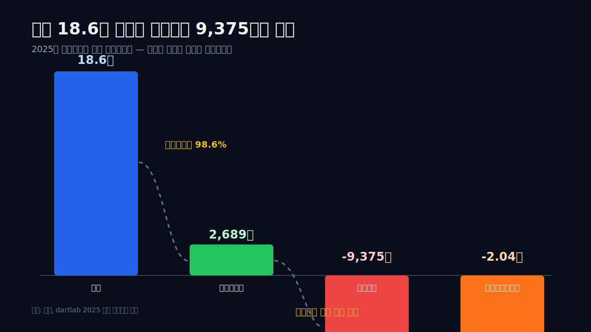
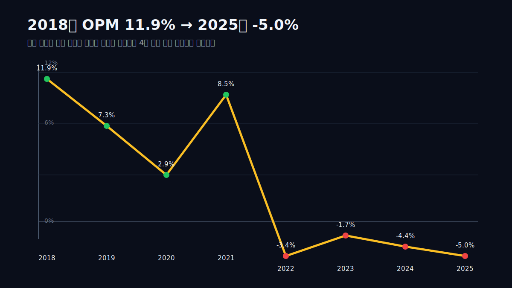
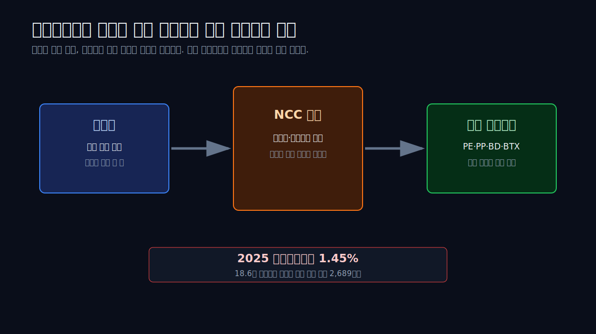
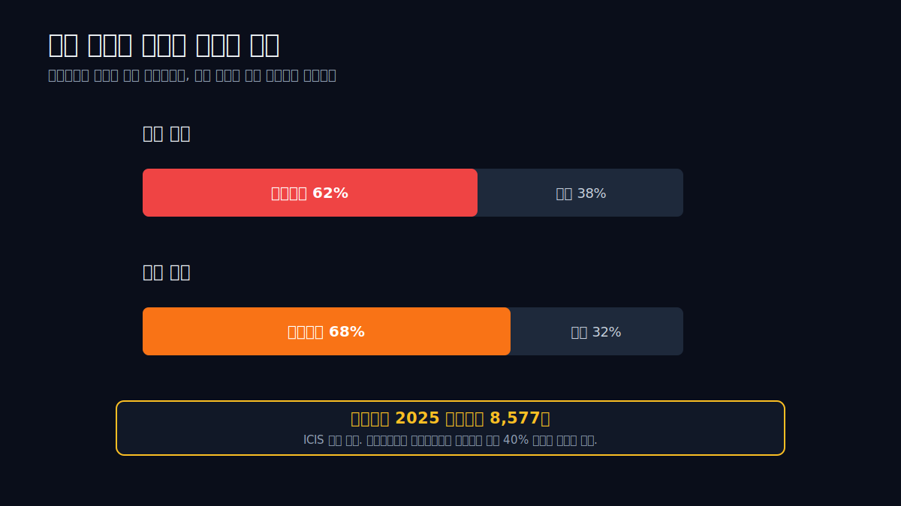
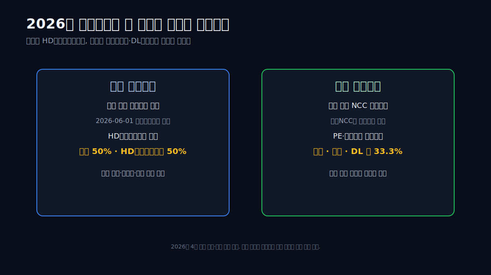
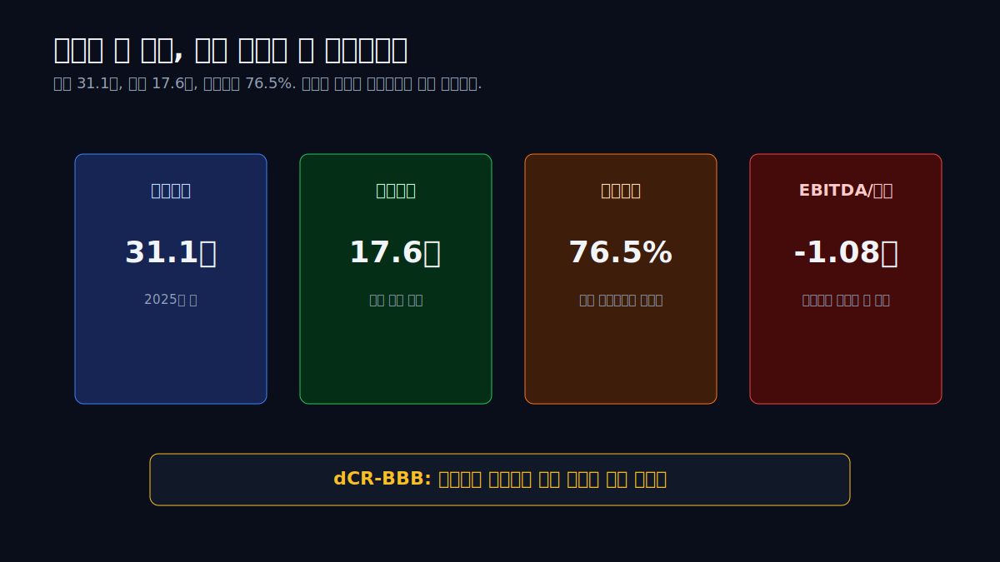
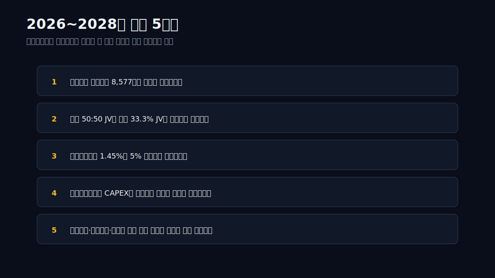

<script>
import ComboChart from '$lib/components/blog/ComboChart.svelte';
import StackBar from '$lib/components/blog/StackBar.svelte';
import HFDataLink from '$lib/components/blog/HFDataLink.svelte';
</script>

> **사이클 + 구조조정** | 소재 > 석유화학 | 2026-04-28 dartlab 실측
> 같은 시리즈: [효성화학](/blog/hyosung-chemical) · [에코프로](/blog/ecopro) · [삼성SDI](/blog/samsung-sdi) · [LG에너지솔루션](/blog/lg-energy-solution) · [기업이야기 시리즈 전체](/blog/series/company-reports)

<HFDataLink code="011170" />

롯데케미칼(011170)은 2025년에 매출 **18.6조원**을 냈다. 웬만한 대기업 집단의 핵심 계열사보다 크다. 그런데 영업손익은 **-9,375억원**이다. 지배주주에게 귀속되는 순손실은 **-2.04조원**이다. 매출이 없는 회사가 적자를 낸 것이 아니다. 제품을 18조원 넘게 팔고도 팔수록 손실이 쌓였다.

첫 질문은 단순하다. **왜 18조 매출 회사가 3년째 적자인가.** 답은 "불황"이라는 한 단어로 끝나지 않는다. 롯데케미칼은 2022년부터 2025년까지 4년 연속 영업손실 구간에 들어갔다. 2021년에는 영업이익 1.54조원, 영업이익률 8.47%였는데, 2025년에는 영업손실 9,375억원, 영업이익률 -5.04%가 됐다. 같은 나프타를 사서 비슷한 플라스틱을 만드는 사업인데, 4년 만에 재무제표의 방향이 바뀌었다.

이 글의 관통선은 하나다. **롯데케미칼은 제품을 못 팔아서 무너진 것이 아니라, 가격 결정권이 없는 범용 석유화학 모델이 중국 공급 과잉 앞에서 스프레드를 잃어 무너졌다.** 대산과 여수 구조조정은 선택지가 아니라 재무제표가 밀어낸 결론이다.



```python
import dartlab

c = dartlab.Company("011170")  # 롯데케미칼
c.select("IS", ["매출액", "매출총이익", "영업이익", "당기순이익"], freq="Y")
c.select("BS", ["자산총계", "부채총계", "자본총계", "현금및현금성자산"], freq="Y")
c.select("CF", ["영업활동현금흐름", "투자활동현금흐름"], freq="Y")
c.credit("grade")
```

## 1막: 매출 18.6조, 영업손실 9,375억 — 크기가 회사를 지켜주지 못했다

왜 매출 18조 회사가 영업이익을 못 남겼는가.

2025년 롯데케미칼의 연결 매출은 dartlab 실측 기준 **18조5,948억원**이다. 회사 공식 보도자료는 2025년 매출을 **18조4,830억원**, 영업손실을 **9,436억원**으로 발표했다. 집계 기준과 반올림 차이는 있지만 방향은 같다. 매출은 거대하고, 이익은 사라졌다. 회사는 2026년 전략을 두 축으로 설명했다. 범용 석유화학 비중 축소와 미래 성장 기반 구축이다. 이 말은 완곡하지만, 재무제표 언어로 번역하면 "기존 중심 사업이 더 이상 충분한 이익을 내지 못한다"는 뜻이다. [롯데케미칼 2025 실적 발표](https://www.lottechem.com/en/media/news/1175/view.do)

숫자를 한 줄씩 내려가면 더 선명하다.

| 항목 | 2025 | 2024 | 2023 | 2022 | 2021 |
|:---|---:|---:|---:|---:|---:|
| 매출액 | 18.59조 | 20.43조 | 19.95조 | 22.28조 | 18.12조 |
| 매출총이익 | 2,689억 | 3,299억 | 7,813억 | 2,833억 | 2.46조 |
| 영업이익 | **-9,375억** | -8,941억 | -3,477억 | -7,626억 | 1.54조 |
| 영업이익률 | **-5.04%** | -4.38% | -1.74% | -3.42% | 8.47% |
| 지배주주순손실 | **-2.04조** | -1.71조 | -500억 | 흑자권 | 흑자권 |

표의 핵심은 2025년 매출총이익이다. 매출 18.59조원에서 매출원가를 빼고 남은 돈이 2,689억원뿐이다. 매출총이익률은 **1.45%**. 석유화학 회사가 제품을 만들고 팔아서 원가를 겨우 넘긴 정도다. 여기서 인건비, 물류비, 감가상각, 연구비, 판매관리비를 빼면 영업손실로 내려간다. "판관비가 많아서 적자"가 아니다. 영업이익 이전에 이미 스프레드가 너무 얇다.

2021년과 비교하면 변화가 더 크다. 2021년 매출 18.12조원, 영업이익 1.54조원, 영업이익률 8.47%. 2025년 매출은 비슷한데 영업손익은 2.47조원 악화됐다. 같은 크기의 매출이 전혀 다른 이익을 만든다. 이것이 석유화학 사이클의 무서운 점이다. 매출액은 물량과 원료 가격을 반영하기 때문에 커질 수 있지만, 이익은 나프타와 제품 가격 사이의 스프레드가 결정한다.

롯데케미칼의 2025년 손익계산서는 세 가지를 말한다. 첫째, 매출 규모는 더 이상 안전판이 아니다. 둘째, 적자는 한 분기 사건이 아니라 2022년 이후 누적된 구조다. 셋째, 회사가 말하는 "구조조정"은 전략적 선택이라기보다 손익계산서가 이미 요구한 수술이다.



## 2막: 원료는 비싸고 제품은 싸다 — 나프타 NCC의 스프레드 함정

왜 매출총이익률이 1.45%까지 내려갔는가.

롯데케미칼의 핵심 사업은 나프타분해설비, 즉 NCC다. 원유에서 나온 나프타를 분해해 에틸렌·프로필렌·부타디엔·BTX 같은 기초유분을 만들고, 다시 PE·PP·ABS 같은 범용 소재로 이어간다. 이 구조는 호황기에는 강력하다. 설비를 크게 지어 놓으면 물량이 늘고, 스프레드가 벌어질 때 고정비 레버리지가 붙는다. 2018년 영업이익률 11.89%, 2021년 8.47%가 그 시절의 숫자다.

하지만 불황기에는 같은 구조가 반대로 작동한다. 원료 가격은 국제 유가에 묶여 있고, 제품 가격은 글로벌 수요와 중국 공급에 눌린다. 롯데케미칼은 원유 가격도, 중국 신규 설비도, 글로벌 PE·PP 가격도 마음대로 정하지 못한다. 회사가 할 수 있는 것은 가동률 조정, 비용 절감, 제품 믹스 개선, 설비 통합 정도다. 그런데 NCC는 고정비가 큰 장치산업이다. 멈추면 손실이고, 돌려도 스프레드가 없으면 손실이다.



2025년 롯데케미칼의 매출원가율은 **98.55%**다. 매출 100원을 올리면 원가가 98.55원이다. 여기에 판관비와 기타 영업비용을 더하면 100원을 넘는다. 일반 제조업에서 매출원가율 98%대는 "가격을 못 받는다"는 말과 같다. 공장은 돌아가지만 가격표가 회사를 살리지 못한다.

문제는 롯데케미칼 혼자만의 비효율이 아니라는 점이다. 동종 대형 소재 기업들을 2025년 기준으로 보면 대부분 마진이 얇다.

| 회사 | 매출 | 영업이익 | 영업이익률 | OCF+ICF |
|:---|---:|---:|---:|---:|
| 롯데케미칼 | 18.59조 | **-9,375억** | **-5.04%** | -921억 |
| LG화학 | 45.98조 | 1.19조 | 2.59% | -4.24조 |
| SK이노베이션 | 80.30조 | 4,487억 | 0.56% | -2.00조 |
| S-Oil | 34.25조 | 2,356억 | 0.69% | 1,596억 |
| POSCO홀딩스 | 69.09조 | 1.83조 | 2.64% | -2.12조 |

표시: 2025년 한국의 대형 소재·에너지 기업은 대부분 낮은 마진 구간에 있다. 하지만 롯데케미칼은 그중에서도 영업손실 규모가 가장 눈에 띈다. 이유는 범용 석유화학 노출이 크고, 고정비 큰 국내 NCC를 많이 갖고 있으며, 중국 공급 과잉의 압박을 직접 맞기 때문이다.

여기서 중요한 구분이 있다. 석유화학 불황은 "수요가 조금 약하다"와 다르다. 수요가 약해도 공급이 더 약하면 스프레드는 살아난다. 반대로 수요가 유지돼도 공급이 과하면 제품 가격은 눌린다. 2020년대 중반의 문제는 후자다. 중국이 과거 수입하던 범용 화학 제품을 점점 자국 생산으로 대체했고, 동북아 전체에 공급 과잉이 생겼다. 롯데케미칼 CEO가 2026년 4월 투자자 미팅에서 중국 자급률 상승과 공급 과잉을 언급한 배경도 여기 있다. [ICIS 2026-04-17](https://www.icis.com/explore/resources/news/2026/04/17/11198985/s-korea-s-lotte-chemical-accelerating-restructuring-plans/)

따라서 롯데케미칼 글의 핵심은 "원가 절감하면 되나?"가 아니다. 핵심 질문은 **기초화학 비중을 줄이지 않고 이익률을 회복할 수 있나**다.

## 보론: 중국 공급 과잉은 왜 한 해 이슈가 아닌가

롯데케미칼을 볼 때 가장 위험한 해석은 "2025년이 바닥이니까 2026년에는 정상화"라고 바로 넘기는 것이다. 석유화학 사이클은 반도체처럼 재고 조정이 끝나면 곧바로 가격이 뛰는 구조와 다르다. 범용 화학 제품은 생산 설비의 수명이 길고, 한 번 지은 NCC·PDH·CTO·MTO 설비는 적자가 나도 완전히 멈추기 어렵다. 국가 산업 정책, 고용, 원료 계약, 지역 산업단지 인프라가 얽혀 있기 때문이다.

중국의 변화는 수요 둔화보다 더 중요하다. 과거 중국은 동북아 석유화학 기업들의 최대 수요처였다. 한국에서 에틸렌 계열 제품과 합성수지를 만들고 중국으로 보내면 됐다. 그런데 중국이 대규모 설비를 직접 지으면서 수입 의존도가 내려갔다. ICIS는 롯데케미칼 CEO 발언을 인용해 중국 자급률이 2030년 90%까지 올라갈 수 있다고 정리했다. 이 숫자가 맞다면, 과거 한국 NCC의 "중국 수출 시장"은 더 이상 같은 크기로 돌아오지 않는다.

이 변화는 손익계산서에서 세 단계로 나타난다.

| 단계 | 과거 호황기 | 2025년 이후 문제 |
|:---|:---|:---|
| 수요 | 중국 수입 증가 | 중국 자급률 상승 |
| 가격 | 동북아 제품 가격 상승 | 저가 물량이 가격 상단을 누름 |
| 가동률 | 큰 설비가 이익 레버리지 | 큰 설비가 고정비 부담 |
| 투자 판단 | 증설이 성장 | 감축·통합이 생존 |

롯데케미칼이 지금 마주한 것은 "판매량이 조금 빠진 문제"가 아니다. 과거 고객이 경쟁자가 된 문제다. 한국 NCC는 중국 수요를 보고 커졌는데, 중국 설비가 자국 수요를 먹기 시작하면 한국 NCC는 같은 물량을 더 낮은 가격에 팔아야 한다. 이때 매출은 생각보다 천천히 줄 수 있다. 원료 가격과 물량이 매출을 지탱하기 때문이다. 하지만 이익은 빠르게 사라진다. 2025년 매출총이익률 1.45%가 그 증거다.

그래서 롯데케미칼의 회복을 보려면 중국 수요 회복만 보면 안 된다. 더 중요한 질문은 세 가지다. **첫째, 중국 내 노후 설비가 실제로 닫히는가. 둘째, 한국·일본·대만의 노후 설비도 같이 줄어드는가. 셋째, 롯데케미칼이 줄어드는 시장에서 어느 제품을 남기고 어느 제품을 포기하는가.** 업황 회복은 외부 변수지만, 설비 포트폴리오 선택은 회사의 변수다.

이 지점에서 대산·여수 구조조정이 다시 중요해진다. 구조조정 없이 기다리기만 하면 회사는 스프레드 회복을 외부에 맡긴다. 반대로 구조조정을 실행하면 회사가 통제할 수 있는 변수가 생긴다. 설비 중복을 줄이고, 원료 수급을 안정시키고, 상대적으로 나은 다운스트림을 남긴다. 그 결과가 매출총이익률로 찍혀야 한다. 발표보다 마진이 먼저다.

## 3막: 문제 사업이 회사의 중심이다 — 기초화학 62%의 무게

왜 구조조정이 어려운가.

손실 사업을 팔거나 줄이면 된다고 말하기는 쉽다. 하지만 롯데케미칼의 문제는 그 손실 사업이 주변부가 아니라 중심부라는 점이다. ICIS 보도에 따르면 기초화학은 회사 매출의 약 **62%**, 자산의 약 **68%**를 차지한다. 동시에 2025년 기초화학 부문만 **8,577억원 영업손실**을 냈다. 줄이고 싶은 사업이 회사의 덩치 대부분을 차지한다. 이것이 롯데케미칼 구조조정의 난이도다.



기초화학은 나쁜 사업이라서 문제가 아니다. 기초화학은 호황기에는 엄청난 현금창출 사업이었다. 2018년 롯데케미칼 영업이익은 1.97조원, 영업이익률 11.89%였다. 2021년에도 영업이익 1.54조원, 영업이익률 8.47%. 장치산업의 고정비 레버리지가 작동할 때는 큰 설비가 곧 이익이다. 하지만 같은 설비가 불황기에는 손실 레버리지로 바뀐다.

투자자는 여기서 "왜 빨리 접지 않나"라고 묻기 쉽다. 그러나 NCC는 카페 하나 닫는 일이 아니다. 설비 하나가 지역 산업단지의 원료 공급망, 하공정 제품, 공동배관, 전력·스팀·항만 인프라, 협력사, 고용과 연결돼 있다. 한 공장을 닫으면 그 공장에서 나온 에틸렌·프로필렌을 쓰던 다운스트림도 다시 설계해야 한다. 그래서 정부, 공정거래위원회, 산업통상자원부, 여러 주주사가 동시에 등장한다.

롯데케미칼이 2026년에 추진하는 구조조정은 바로 이 복잡한 연결망을 다시 짜는 작업이다. 대산은 HD현대오일뱅크 쪽과, 여수는 여천NCC·한화솔루션·DL케미칼 쪽과 묶는다. 회사 하나가 공장 한두 개를 닫는 게 아니라, 산업단지 단위로 중복 설비를 합치고 가동률을 재배치하는 그림이다.

이 구조에서 롯데케미칼의 난제는 두 가지다. 첫째, 구조조정은 단기 매출을 줄인다. 회사도 구조조정 이후 단기 매출 감소 가능성을 인정한다. 둘째, 구조조정 비용은 당장 들어가지만 이익 개선은 늦게 온다. 설비 통합, 법인 분할, 합병, 인허가, 직원·계약·원료 배분, 감가상각과 손상처리까지 시간이 걸린다. 그래서 2026년은 "좋아지는 해"라기보다 "수술이 시작되는 해"에 가깝다.

## 4막: 대산과 여수 — 2026년 구조조정은 이미 시작됐다

왜 2026년이 중요해졌는가.

롯데케미칼 구조조정은 두 축으로 진행된다. 첫 번째는 **대산**이다. 보도와 회사 설명을 종합하면, 롯데케미칼은 대산 기초소재 사업을 물적분할해 롯데대산석유화학을 만들고, 이를 HD현대케미칼과 합병해 롯데케미칼과 HD현대오일뱅크가 50:50으로 보유하는 구조를 추진한다. 목적은 중복 설비 정리, 원료 조달 안정화, 가동률 최적화다. ICIS는 이 절차가 2026년 6월 분할, 9월 합병을 목표로 한다고 정리했다.

두 번째는 **여수**다. 롯데케미칼은 여수 NCC와 일부 다운스트림 설비를 분할해 여천NCC와 합병하는 구조를 추진한다. 여천NCC는 한화솔루션과 DL케미칼이 공동으로 갖고 있는 회사다. 재편 후에는 롯데케미칼·한화솔루션·DL케미칼이 각각 33.3%를 갖는 공동 지배 구조가 논의된다. 2026년 3월에는 관련 기업결합 사전심사와 사업재편 계획 제출 보도가 나왔다. [여수 구조개편 보도](https://news.nate.com/view/20260320n24628?mid=n1101)



이 구조조정은 단순한 재무 이벤트가 아니다. 롯데케미칼의 사업 정체성을 바꾼다. 과거에는 "대규모 NCC를 가진 범용 석화 대형사"가 핵심 정체성이었다. 2026년 이후 회사가 원하는 모습은 "기초화학 비중을 줄이고 첨단소재·정밀화학·배터리소재·수소·암모니아를 키우는 포트폴리오 회사"다.

문제는 새 포트폴리오의 크기다. 2025년 4분기 회사가 공개한 사업부별 실적을 보면 기초소재는 매출 3조3,431억원, 영업손실 3,957억원이다. 같은 분기 첨단소재는 매출 9,295억원, 영업이익 221억원이다. 롯데정밀화학은 매출 4,391억원, 영업이익 193억원. 롯데에너지머티리얼즈는 매출 1,709억원, 영업손실 338억원이다. 좋은 사업이 없다는 뜻이 아니다. 좋은 사업들이 아직 범용 석화 손실을 압도할 만큼 크지 않다는 뜻이다.

회사 발표는 2026년 고기능성 소재, Super EP, 미국 동박 공장, AI 회로용 동박, 반도체 공정 소재, 친환경 소재, 수소연료전지 발전을 언급한다. 방향은 맞다. 하지만 투자자가 봐야 할 것은 방향보다 **대체 속도**다. 기초화학이 매출 62%인 회사에서 새로운 사업이 5년 안에 얼마만큼 손익계산서를 바꿀 수 있는가. 이 질문에 답하지 못하면 구조조정은 "미래 성장"이 아니라 "현재 손실 축소"에 그친다.

## 5막: 재무상태표는 아직 버틴다 — 그래서 더 냉정하게 봐야 한다

왜 이 회사는 바로 위험 회사가 아닌가.

롯데케미칼의 손익계산서는 나쁘다. 하지만 재무상태표는 아직 무너지지 않았다. 2025년 말 자산총계는 **31.1조원**, 부채총계는 **13.5조원**, 자본총계는 **17.6조원**이다. 부채비율은 **76.5%**다. 현금및현금성자산은 **1.87조원**이다. 이 숫자만 보면 "당장 유동성 위기"라고 말하기 어렵다.



dartlab dCR도 같은 결론을 낸다. 롯데케미칼의 정량 신용등급은 **dCR-BBB**다. 적격 등급이다. 자본구조 축은 부채비율 76.5%, 차입금의존도 15.93%로 비교적 양호하다. 큰 회사의 자본 쿠션과 자산 기반이 아직 남아 있기 때문이다. 그래서 이 글은 롯데케미칼을 "곧 쓰러질 회사"로 쓰지 않는다. 그건 숫자와 맞지 않는다.

하지만 신용등급의 세부 축을 보면 경고도 분명하다. EBITDA/이자비용은 **-1.08배**다. 이익으로 이자를 덮지 못한다. 유동성 축은 단기차입금비중 100%라는 항목 때문에 약하다. 현금흐름 축도 FCF 음수와 CAPEX 부담이 걸린다. dCR의 설명처럼 이 등급은 정량 공시 데이터 기반이고, 그룹 지원·시장 지위 같은 정성 요인은 별도다. 따라서 "BBB니까 괜찮다"가 아니라, "자본은 버티지만 손익이 돌아오지 않으면 등급을 갉아먹는다"가 정확하다.

현금흐름도 양면적이다. 2025년 영업활동현금흐름은 **4,889억원** 플러스다. 영업손실이 9,375억원인데 OCF가 플러스인 이유는 감가상각, 운전자본, 재고 조정, 비현금 손상 등이 섞이기 때문이다. 그러나 투자활동현금흐름은 **-5,810억원**이다. 단순 OCF+ICF는 **-921억원**. 회사가 영업에서 현금을 벌어도 투자와 구조조정 부담을 동시에 지면 현금이 남지 않는다.

2023년에는 단순 OCF+ICF가 **-4.29조원**이었다. 2024년은 -4,058억원, 2025년은 -921억원으로 개선됐다. 이 흐름은 긍정적이다. 하지만 여전히 관찰 포인트는 "플러스 전환"이다. 롯데케미칼이 진짜로 회복하려면 손익계산서의 영업손실 축소와 현금흐름의 투자 부담 완화가 같이 와야 한다.

## 6막: 롯데케미칼과 효성화학은 다르다 — 같은 화학 적자라도 질이 다르다

왜 효성화학 글과 같은 결론으로 가면 안 되는가.

[효성화학](/blog/hyosung-chemical)은 2025년에 영업손실을 내고도 순이익이 플러스로 돌아섰다. 특수가스사업부 매각이라는 일회성 이익이 자본잠식을 피하게 만든 사례였다. 롯데케미칼은 반대다. 영업손실도 크고, 지배주주순손실도 크다. 매각이나 일회성 이익이 손익계산서를 뒤집어주지 않았다. 그래서 롯데케미칼은 "한 번 팔아서 시간을 번 회사"가 아니라, "중심 사업을 재배치해야 하는 회사"다.

또 다른 차이는 자본 쿠션이다. 효성화학은 자본잠식 문턱까지 갔고, 금융비용이 매출 대비 매우 무거웠다. 롯데케미칼은 자본 17.6조원을 보유하고 부채비율도 76.5%다. 그래서 생존 문제는 덜 급하지만, 구조 전환의 규모는 훨씬 크다. 효성화학은 하나의 사업부 매각이 재무제표를 흔들었다. 롯데케미칼은 대산과 여수라는 산업단지 단위의 재편이 필요하다.

[에코프로](/blog/ecopro)와도 다르다. 에코프로는 리튬 가격에 매출과 원가가 동시에 흔들리는 양극재 사이클이었다. 롯데케미칼은 나프타와 범용 제품의 스프레드 사이클이다. 둘 다 원자재·제품 가격에 종속되지만, 롯데케미칼의 문제는 중국 자급률 상승과 동북아 설비 과잉이라는 더 느리고 구조적인 흐름이다. 리튬 가격처럼 1년 만에 급등락하는 변동보다 회복이 더딜 수 있다.

[HD한국조선해양](/blog/hd-ksoe), [HD현대중공업] 같은 조선 사이클과도 반대다. 조선은 과거 저가 수주 물량이 빠지고 고가 선박이 인도되면서 영업이익률이 올라간다. 석유화학은 과거 고수익 설비가 이제는 과잉 설비가 됐다. 조선은 수주잔고가 미래 이익을 보여주지만, 롯데케미칼의 설비는 미래 손실을 줄여야 할 대상이 됐다.

이 비교가 중요한 이유는 투자자가 화학 적자를 모두 같은 방식으로 보면 안 되기 때문이다. 롯데케미칼은 단기 회복주가 아니다. 경기 반등만 기다리는 사이클주도 아니다. **산업 재편이 실제로 일어나야 손익계산서가 바뀌는 구조조정주**다.

## 7막: 숫자는 무엇을 먼저 회복해야 하나

투자자가 봐야 할 첫 숫자는 무엇인가.

첫 번째는 **매출총이익률**이다. 영업이익보다 먼저 봐야 한다. 2025년 매출총이익률 1.45%는 너무 낮다. 이 숫자가 5% 이상으로 회복되지 않으면 판관비를 아무리 줄여도 영업흑자 전환은 어렵다. 2021년 매출총이익률은 13.60%였다. 그 수준까지 당장 돌아가기는 어렵더라도, 1%대에서 벗어나는지가 회복의 첫 신호다.

두 번째는 **기초화학 부문 손실**이다. 2025년 기초화학 영업손실 8,577억원이 줄어드는지 봐야 한다. 회사 전체 영업손실 9천억원대의 대부분이 여기서 나온다. 첨단소재가 200억, 정밀화학이 100억 벌어도 기초화학에서 수천억을 잃으면 회사 전체는 바뀌지 않는다.

세 번째는 **대산·여수 구조조정 일정**이다. 분할, 합병, 기업결합 심사, 현물출자, 설비 감축이 일정대로 닫히는지 봐야 한다. 발표만 있고 실행이 늦어지면 손익 개선도 늦어진다. 구조조정이 잘 되면 매출은 줄 수 있다. 중요한 것은 매출 감소가 아니라 손실 감소다.

네 번째는 **영업현금흐름과 투자현금흐름의 합**이다. 2025년 단순 OCF+ICF는 -921억원으로 2023년 -4.29조원보다 좋아졌다. 이 숫자가 플러스로 돌아서면 재무 방어력이 좋아진다. 반대로 구조조정 비용과 CAPEX가 겹쳐 다시 대규모 음수로 가면 자본 쿠션을 소모한다.

다섯 번째는 **새 포트폴리오의 이익 크기**다. Super EP, 반도체 공정 소재, AI 회로용 동박, ESS용 동박, 수소·암모니아, 친환경 소재는 모두 그럴듯한 단어다. 하지만 블로그가 봐야 할 것은 단어가 아니라 손익이다. 첨단소재·정밀화학·에너지소재가 각각 얼마를 벌고, 기초화학 손실을 얼마나 상쇄하는가. 그 숫자가 없으면 미래 사업은 아직 슬로건이다.



## 8막: 그래서 롯데케미칼은 싸졌나, 위험해졌나

이 질문은 조심해야 한다. 주가가 많이 빠졌다고 싸진 것은 아니다. 영업손실이 커졌다고 무조건 위험한 것도 아니다. 롯데케미칼의 가치는 두 질문 사이에 있다. **이 회사의 31조 자산 중 얼마가 앞으로도 돈을 벌 수 있는 자산인가. 그리고 손실을 내는 자산은 얼마나 빨리 줄어드는가.**

과거 롯데케미칼은 "큰 설비를 가진 화학 대형사"라는 점이 장점이었다. 지금은 그 같은 장점이 부담이다. 설비가 크면 감가상각과 고정비가 크다. 공급 과잉기에 큰 설비는 시장 가격을 회복시키지 못한다. 그래서 대형사 프리미엄이 대형사 디스카운트로 바뀐다.

반대로 재무상태표는 여전히 의미가 있다. 자본 17.6조원, 현금 1.87조원, 부채비율 76.5%는 회복 시간을 준다. 롯데케미칼이 중소 화학사였다면 4년 연속 적자는 생존 문제로 바로 번졌을 수 있다. 그러나 롯데케미칼은 구조조정을 실행할 체력은 있다. 문제는 체력이 충분한가가 아니라, 체력을 쓰는 방향이 맞는가다.

여기서 투자 판단은 세 갈래로 나뉜다.

첫째, **사이클 회복 베팅**. 중국 구조조정과 동북아 설비 감축이 실제로 일어나고, 나프타 스프레드가 회복되면 롯데케미칼의 영업손익은 빠르게 개선될 수 있다. 2021년 이익력을 기억하는 투자자는 이 시나리오를 산다.

둘째, **구조조정 성공 베팅**. 대산과 여수 JV가 손실 설비를 줄이고, 첨단소재·정밀화학·동박이 커져 기초화학 비중을 낮추면 회사의 이익 품질이 바뀐다. 이 시나리오는 시간이 더 걸리지만, 성공하면 단순 사이클 회복보다 더 좋은 변화다.

셋째, **가치 함정 회피**. 구조조정이 늦고, 중국 자급률이 계속 올라가며, 새 사업이 손실을 메우지 못하면 낮아진 주가는 싸게 보이는 함정일 수 있다. 자산가치가 커도 그 자산이 낮은 수익률을 내면 PBR 할인은 오래 간다.

이 글은 세 번째 가능성을 무시하지 않는다. 롯데케미칼은 이름값이 크고 자산도 크지만, 재무제표는 "대형사라서 괜찮다"고 말하지 않는다. 오히려 "대형 설비라서 바꾸기 어렵다"고 말한다.

## 시나리오: 회복, 지연, 가치 함정

롯데케미칼은 숫자 하나로 결론 내리기 어렵다. 같은 2025년 재무제표 안에 두 얼굴이 같이 있다. 손익계산서는 매우 나쁘고, 재무상태표는 아직 버틴다. 구조조정은 시작됐지만, 그 효과가 어느 정도일지는 아직 확인되지 않았다. 그래서 이 회사는 단일 목표가가 아니라 세 가지 경로로 봐야 한다.

### 시나리오 1 — 구조조정 성공형

가장 좋은 경로는 대산과 여수 구조조정이 일정대로 닫히고, 기초화학 손실이 빠르게 줄어드는 경우다. 이때 매출은 오히려 줄 수 있다. 분할·합병·설비 감축은 외형 축소를 동반하기 때문이다. 그러나 투자자가 봐야 할 것은 매출이 아니라 손실의 절대액이다. 매출 18조가 16조로 줄어도 영업손실 9천억원이 2천억원으로 줄면 재무제표는 좋아진다.

이 시나리오에서 핵심 숫자는 매출총이익률이다. 2025년 1.45%가 2026년 3~4%, 2027년 5% 이상으로 올라가면 구조조정 효과가 손익계산서로 들어오기 시작했다는 뜻이다. 기초화학 손실도 8,577억원에서 절반 이하로 내려와야 한다. 그때 첨단소재·정밀화학·동박의 이익이 회사 전체를 움직일 수 있다.

### 시나리오 2 — 지연형

두 번째 경로는 구조조정 발표는 진행되지만 실제 손익 개선이 늦는 경우다. 인허가, 합병비율, 설비 감축 범위, 고용 조정, 원료 계약 재편이 예상보다 오래 걸릴 수 있다. 이 경우 2026년 손익은 좋아 보이는 분기와 나빠 보이는 분기가 섞인다. 투자자는 "적자가 줄었다"는 headline보다 어떤 비용이 줄었는지 봐야 한다.

지연형에서 가장 위험한 착시는 일회성 비용 감소다. 2025년에 손상·재고·가동 중단 비용이 컸다면 2026년에는 기저효과로 손실이 줄 수 있다. 그러나 이것이 구조 개선인지, 단순히 전년 비용이 컸던 탓인지는 매출총이익률과 현금흐름이 알려준다. 영업손실은 줄었는데 OCF+ICF가 다시 큰 음수로 가면 구조조정 비용이 현금으로 빠지는 중일 수 있다.

### 시나리오 3 — 가치 함정형

가장 나쁜 경로는 구조조정이 외형 축소만 만들고 손익 개선을 충분히 만들지 못하는 경우다. 기초화학 비중은 줄었지만 남은 설비도 낮은 마진에 묶이고, 새 사업은 아직 작고, 동박은 전기차 수요 둔화로 적자를 이어간다. 이 경우 롯데케미칼은 PBR이 낮아 보여도 계속 할인될 수 있다. 자산은 크지만 자산수익률이 낮으면 시장은 장부가를 그대로 인정하지 않는다.

가치 함정형의 신호는 분명하다. 매출총이익률이 1~3%대에 머물고, 기초화학 손실이 수천억원 단위로 유지되고, 영업현금흐름이 CAPEX와 구조조정 비용을 감당하지 못한다. 이때 회사는 추가 자산 매각이나 배당 축소, 투자 지연을 선택할 수 있다. 그러면 주가는 "싸다"보다 "왜 싸게 거래되는지"를 먼저 설명하게 된다.

이 세 가지 시나리오 중 어느 쪽으로 갈지는 아직 확정되지 않았다. 하지만 2026~2027년에 확인할 숫자는 이미 정해져 있다. **매출총이익률, 기초화학 손실, OCF+ICF, 구조조정 일정, 새 포트폴리오 영업이익.** 이 다섯 개가 같이 돌아오면 회복형이고, 하나씩 따로 놀면 지연형이며, 전부 멈추면 가치 함정형이다.

## 투자자가 분기마다 확인해야 할 순서

롯데케미칼은 뉴스로만 추적하면 판단이 흔들린다. 석유화학 업황 뉴스는 항상 크다. 중국 감산, 나프타 가격 하락, 유가 안정, 스프레드 반등, 구조조정 협상, 신사업 투자 같은 문장이 반복된다. 하지만 주가는 문장보다 숫자에 반응한다. 그래서 확인 순서를 정해두는 편이 낫다.

첫 번째는 매출총이익률이다. 2025년 매출총이익률 1.45%는 이 회사의 가장 중요한 경고등이다. 영업비용을 줄이기 전에 이미 제품을 팔아서 남는 돈이 거의 없다는 뜻이기 때문이다. 매출총이익률이 4~5%대로만 올라와도 손익계산서의 표정은 달라진다. 반대로 매출총이익률이 1~3%에 갇히면 영업손실 축소는 비용 절감이나 일회성에 기대는 일이 된다. 기초화학 회사의 회복은 매출 증가가 아니라 매출총이익률 회복에서 먼저 보인다.

두 번째는 기초화학 부문 손실이다. 롯데케미칼 전체 적자를 설명하는 중심축은 여전히 기초화학이다. 첨단소재나 정밀화학이 좋아져도 기초화학 손실이 수천억원 단위로 유지되면 전체 이익은 돌아오기 어렵다. 투자자는 "신사업이 좋다"보다 "기초화학이 얼마나 덜 잃는가"를 먼저 봐야 한다. 특히 대산과 여수 구조조정 뉴스가 실제 숫자로 연결되는지는 이 항목에서 확인된다.

세 번째는 운전자본이다. 불황기 화학사는 재고, 매출채권, 원재료 가격 변동 때문에 현금흐름이 흔들린다. 손익계산서상 적자가 줄어도 재고가 쌓이거나 채권 회수가 느려지면 현금은 좋아지지 않는다. 2025년 롯데케미칼은 영업활동현금흐름이 플러스였지만, 투자활동현금흐름까지 더하면 단순 OCF+ICF가 -921억원이었다. 이 수치가 플러스로 안정화되는지가 중요하다. 영업이익 흑자 전환보다 현금흐름 전환이 더 늦게 올 수 있기 때문이다.

네 번째는 구조조정 비용이다. 구조조정은 공짜가 아니다. 설비 통합, 지분 조정, 인력·운영 효율화, 계약 재조정에는 비용과 시간이 들어간다. 그래서 초기에는 구조조정 발표가 오히려 손익계산서의 일회성 부담으로 나타날 수 있다. 이때 중요한 것은 비용의 존재가 아니라 비용의 목적이다. 손실 설비를 닫거나 통합하기 위한 비용이라면 미래 손익을 가볍게 만든다. 반대로 단순히 현재 손실을 가리는 비용이면 효과가 약하다.

다섯 번째는 새 포트폴리오의 이익 기여다. 롯데케미칼이 말하는 첨단소재, 정밀화학, 고부가 소재, 수소·암모니아, 배터리 소재 방향은 모두 필요하다. 다만 회사 전체 매출이 18조원대인 상황에서는 작은 사업의 성장률만으로는 부족하다. 투자자는 매출 성장률보다 영업이익 기여액을 봐야 한다. 작은 사업이 20% 성장해도 이익 기여가 수백억원이면 기초화학 손실 수천억원을 뒤집지 못한다. 반대로 새 포트폴리오가 1,000억~2,000억원 단위 이익을 안정적으로 만들기 시작하면 회사의 할인율은 낮아질 수 있다.

정리하면 롯데케미칼의 분기 체크리스트는 단순하다. 매출총이익률이 먼저 올라야 하고, 기초화학 손실이 줄어야 하며, OCF+ICF가 플러스에 가까워져야 한다. 그 다음에 구조조정 비용의 성격과 새 포트폴리오 이익을 본다. 이 순서를 거꾸로 보면 신사업 스토리에 먼저 끌려가고, 정작 18조원 손익계산서를 움직이는 핵심을 놓치게 된다.

## 밸류에이션: 싸 보이는 주식의 함정

롯데케미칼 같은 회사는 장부가 기준으로 보면 늘 싸 보일 수 있다. 자산 31.1조원, 자본 17.6조원이라는 숫자는 작지 않다. 문제는 시장이 장부가를 그대로 사주지 않는다는 점이다. 장부가가 의미 있으려면 그 자산이 돈을 벌어야 한다. 자산이 크지만 이익을 만들지 못하면 장부가는 방어선이 아니라 질문이 된다. "이 자산이 정말 이 가격만큼 벌 수 있나"라는 질문이다.

석유화학 대형사의 PBR 할인은 보통 세 가지에서 나온다. 첫째, 설비가 경기순환의 영향을 크게 받는다. 둘째, 제품 차별화가 약하면 경쟁사의 증설이 곧바로 가격 압박으로 이어진다. 셋째, 다운사이클이 길어질수록 감가상각과 금융비용이 이익을 갉아먹는다. 롯데케미칼은 지금 이 세 가지를 동시에 맞고 있다. 그래서 단순히 과거 평균 PBR로 회귀한다고 보는 것은 위험하다.

그렇다고 장부가가 아무 의미 없다는 뜻은 아니다. 재무상태표가 튼튼하면 구조조정을 버틸 시간이 생긴다. 현금 1.87조원, 자본 17.6조원, 부채비율 76.5%는 회사가 당장 막다른 곳에 몰린 숫자는 아니다. 이 방어력은 중요하다. 다만 방어력은 투자 아이디어의 시작일 뿐 끝이 아니다. 방어력이 있다고 해서 수익성이 자동으로 돌아오지는 않는다. 투자자는 "버틸 수 있다"와 "돈을 벌 수 있다"를 분리해야 한다.

롯데케미칼의 재평가 조건은 PBR이 낮다는 사실이 아니라 ROE가 돌아온다는 증거다. ROE가 회복되려면 순이익이 회복되어야 하고, 순이익이 회복되려면 영업이익이 돌아와야 하며, 영업이익이 돌아오려면 매출총이익률과 기초화학 손실이 바뀌어야 한다. 결국 밸류에이션 논리도 다시 첫 번째 질문으로 돌아온다. 범용 석유화학이 더 이상 돈을 못 버는 구조라면 낮은 PBR은 싸다는 증거가 아니다. 구조조정 후에도 현금흐름이 돌아온다면 그때 낮은 PBR은 기회가 된다.

그래서 이 글의 결론은 매수·매도 판단이 아니라 조건부 판단이다. 롯데케미칼은 숫자가 망가진 회사지만, 재무상태표가 아직 시간을 준다. 그 시간 안에 회사가 손실 설비를 줄이고 고부가 포트폴리오의 이익 기여를 키우면 할인은 줄어든다. 반대로 구조조정이 느리고 신사업 이익이 작으면 할인은 오래 간다. 이 차이가 롯데케미칼을 "싸 보이는 화학주"가 아니라 "재편 성공 여부에 베팅하는 산업주"로 봐야 하는 이유다.

## 자주 묻는 질문

### 롯데케미칼은 부도 위험 회사인가

현재 숫자로는 그렇게 쓰면 과하다. 2025년 말 자본총계 17.6조원, 현금및현금성자산 1.87조원, 부채비율 76.5%다. dartlab dCR도 BBB다. 문제는 단기 부도보다 손익 회복이다. 영업손실이 계속되면 재무상태표가 천천히 약해진다. 그래서 "당장 위험"보다 "시간을 쓰는 구조조정"으로 봐야 한다.

### 2026년에 흑자 전환하면 문제가 끝나는가

아니다. 분기 흑자 전환은 좋은 신호지만, 구조 문제의 끝은 아니다. 봐야 할 것은 매출총이익률, 기초화학 손실 축소, OCF+ICF, 구조조정 일정이다. 일회성 비용 감소나 재고 효과로 한두 분기 좋아지는 것과 기초화학 스프레드가 회복되는 것은 다르다.

### 롯데케미칼의 새 성장 사업은 의미가 없는가

의미는 있다. 첨단소재, 정밀화학, 반도체 공정 소재, 동박, 수소·암모니아는 모두 회사가 가야 할 방향이다. 다만 아직 회사 전체를 바꾸기에는 기초화학의 덩치가 너무 크다. 좋은 사업의 존재보다 그 사업이 기초화학 손실을 얼마만큼 상쇄하는지가 중요하다.

### 왜 대산과 여수 구조조정이 핵심인가

롯데케미칼의 손실 원인이 설비와 스프레드에 있기 때문이다. 비용 절감만으로는 매출총이익률 1.45% 문제를 해결하기 어렵다. 중복 설비를 묶고, 가동률을 조정하고, 원료·다운스트림 구조를 다시 짜야 한다. 대산과 여수는 그 수술대다.

## 결론: 롯데케미칼은 불황주가 아니라 산업 재편주다

롯데케미칼을 "화학 업황이 나빠서 적자"라고만 보면 반쪽이다. 업황은 나쁘다. 하지만 더 중요한 것은 구조다. 나프타를 사서 범용 제품을 만드는 사업에서 가격 결정권이 사라졌다. 중국 공급 과잉은 일시적 재고 문제가 아니라 동북아 화학 산업의 지형 변화다. 롯데케미칼은 그 변화를 가장 큰 설비와 가장 큰 손익계산서로 맞고 있다.

2025년 숫자는 잔인하다. 매출 18.6조원, 매출총이익률 1.45%, 영업손실 9,375억원, 지배주주순손실 2.04조원. 그러나 동시에 자본 17.6조원, 현금 1.87조원, 부채비율 76.5%라는 방어력도 있다. 이 둘을 같이 봐야 한다. 롯데케미칼은 약한 회사가 아니라, 강한 재무상태표 위에 약해진 사업모델을 얹고 있는 회사다.

그래서 2026년의 질문은 "롯데케미칼이 살아남나"가 아니다. **롯데케미칼이 범용 석유화학 대형사에서 구조조정된 소재 포트폴리오 회사로 바뀔 수 있나**다. 대산과 여수는 이 질문의 첫 시험이다. 기초화학 손실이 줄고, 매출총이익률이 회복되고, OCF+ICF가 플러스로 돌아오면 이야기는 바뀐다. 반대로 구조조정이 늦고 새 사업의 이익이 작으면, 18조 매출은 다시 한 번 회사의 크기가 아니라 부담을 보여주는 숫자가 된다.

## 검증표

| 검증 항목 | 값 | 출처 | 기준 |
|:---|---:|:---|:---|
| 롯데케미칼 2025 매출 | 18.59조원 | `dartlab.Company("011170").show("IS", freq="Y")` | 연결, 1년치 합산 |
| 롯데케미칼 2025 매출총이익 | 2,689억원 | `show("IS", freq="Y")` | 연결 |
| 롯데케미칼 2025 매출총이익률 | 1.45% | `매출총이익 / 매출액` | 수동 계산 |
| 롯데케미칼 2025 영업손실 | -9,375억원 | `show("IS", freq="Y")` | 연결 |
| 롯데케미칼 2025 영업이익률 | -5.04% | `영업이익 / 매출액` | 수동 계산 |
| 롯데케미칼 2025 지배주주순손실 | -2.04조원 | `show("IS", freq="Y")` 지배주주 귀속 순손익 | 연결 |
| 롯데케미칼 2025 자산총계 | 31.12조원 | `show("BS", freq="Y")` | 2025년 말 |
| 롯데케미칼 2025 부채총계 | 13.49조원 | `show("BS", freq="Y")` | 2025년 말 |
| 롯데케미칼 2025 자본총계 | 17.63조원 | `show("BS", freq="Y")` | 2025년 말 |
| 롯데케미칼 2025 현금및현금성자산 | 1.87조원 | `show("BS", freq="Y")` | 2025년 말 |
| 롯데케미칼 2025 부채비율 | 76.5% | `부채총계 / 자본총계` | 수동 계산 |
| 롯데케미칼 2025 영업활동현금흐름 | 4,889억원 | `show("CF", freq="Y")` | 연결 |
| 롯데케미칼 2025 투자활동현금흐름 | -5,810억원 | `show("CF", freq="Y")` | 연결 |
| 롯데케미칼 2025 단순 OCF+ICF | -921억원 | `영업활동현금흐름 + 투자활동현금흐름` | 빠른 점검용, 엄밀 FCF 아님 |
| 롯데케미칼 dCR | dCR-BBB | `c.credit("grade")` | 2025년 기준 정량 등급 |
| 롯데케미칼 EBITDA/이자비용 | -1.08배 | `c.credit("grade")` 세부 metric | 정량 신용 축 |
| 회사 공식 2025 매출·영업손실 | 매출 18.483조·영업손실 9,436억 | 롯데케미칼 2026-02-04 보도자료 | 회사 발표 |
| 2025 4Q 기초소재 손실 | 영업손실 3,957억원 | 롯데케미칼 2026-02-04 보도자료 | 사업부별 4Q |
| 2025 기초화학 부문 손실 | 영업손실 8,577억원 | ICIS 2026-04-17 | 외부 보도 |
| 기초화학 비중 | 매출 62%, 자산 68% | ICIS 2026-04-17 | 회사 CEO 발언 인용 보도 |
| 대산 구조조정 | 롯데대산석화 분할 후 HD현대케미칼과 50:50 JV 추진 | ICIS 2026-04-17 | 보도 기준 |
| 여수 구조조정 | 여천NCC와 통합, 롯데·한화·DL 33.3% 공동지배 추진 | 2026-03-20 보도 | 보도 기준 |

## 참고 출처

- [롯데케미칼 2025 실적 발표 — 회사 공식 보도자료](https://www.lottechem.com/en/media/news/1175/view.do)
- [롯데케미칼 2025년 3분기 잠정실적 — 회사 공식 보도자료](https://www.lottechem.com/en/media/news/1137/view.do)
- [롯데케미칼 2025년 2분기 잠정실적 — 회사 공식 보도자료](https://www.lottechem.com/en/media/news/1100/view.do?page=1)
- [롯데케미칼 2025년 1분기 잠정실적 — 회사 공식 보도자료](https://www.lottechem.com/en/media/news/1064/view.do)
- [ICIS — Lotte Chemical accelerating restructuring plans, 2026-04-17](https://www.icis.com/explore/resources/news/2026/04/17/11198985/s-korea-s-lotte-chemical-accelerating-restructuring-plans/)
- [여수 석유화학 구조개편 보도 — 롯데·한화·DL 공동 운영](https://news.nate.com/view/20260320n24628?mid=n1101)
- [롯데케미칼·여천NCC 기업결합 사전심사 보도](https://news.jkn.co.kr/post/856835)
- [롯데케미칼 2024 실적 발표 — 회사 공식 보도자료](https://www.lottechem.com/en/media/news/1036/view.do)

---

<!-- AUTO:START — sync_financials.py가 자동 생성. 수동 편집 금지 -->


## 공시 / Filings

| 기간 | 보고서 | 링크 |
|------|--------|------|
| 2025 | 사업보고서 (2025.12) | [DART에서 보기](https://dart.fss.or.kr/dsaf001/main.do?rcpNo=20260312001296) |
| 2025 | 분기보고서 (2025.09) | [DART에서 보기](https://dart.fss.or.kr/dsaf001/main.do?rcpNo=20251114003070) |
| 2025 | 반기보고서 (2025.06) | [DART에서 보기](https://dart.fss.or.kr/dsaf001/main.do?rcpNo=20250814004370) |
| 2025 | 분기보고서 (2025.03) | [DART에서 보기](https://dart.fss.or.kr/dsaf001/main.do?rcpNo=20250515002726) |
| 2024 | [기재정정]사업보고서 (2024.12) | [DART에서 보기](https://dart.fss.or.kr/dsaf001/main.do?rcpNo=20250725000806) |
| 2024 | 사업보고서 (2024.12) | [DART에서 보기](https://dart.fss.or.kr/dsaf001/main.do?rcpNo=20250317000991) |
| 2024 | 분기보고서 (2024.09) | [DART에서 보기](https://dart.fss.or.kr/dsaf001/main.do?rcpNo=20241114002994) |
| 2024 | 반기보고서 (2024.06) | [DART에서 보기](https://dart.fss.or.kr/dsaf001/main.do?rcpNo=20240814002335) |
| 2024 | 분기보고서 (2024.03) | [DART에서 보기](https://dart.fss.or.kr/dsaf001/main.do?rcpNo=20240516001796) |
| 2023 | [기재정정]사업보고서 (2023.12) | [DART에서 보기](https://dart.fss.or.kr/dsaf001/main.do?rcpNo=20240401004380) |

> 전체 공시 목록은 dartlab에서 확인:
> ```python
> import dartlab
> c = dartlab.Company("011170")
> c.filings()
> ```

## 재무제표 — 최근 5개년

> 아래는 최근 5개년 요약입니다. 전체 기간·분기별 데이터는 dartlab에서 직접 확인할 수 있습니다:
> ```python
> import dartlab
> c = dartlab.Company("011170")
> c.show("IS")              # 손익계산서 (분기)
> c.show("IS", freq="Y")    # 손익계산서 (연간)
> c.show("BS")              # 재무상태표
> c.show("CF")              # 현금흐름표
> c.show("SCE")             # 자본변동표
> c.show("ratios")          # 재무비율
> ```

### 손익계산서 (IS) — 단위 억원

<ComboChart data={[{year:"2025",매출액:185948,영업이익:-9375,당기순이익:-8811},{year:"2024",매출액:204304,영업이익:-8941,당기순이익:-6814},{year:"2023",매출액:199464,영업이익:-3477,당기순이익:-392},{year:"2022",매출액:222761,영업이익:-7626,당기순이익:278},{year:"2021",매출액:181205,영업이익:15356,당기순이익:14256}]} lineKeys={["매출액"]} barKeys={["영업이익","당기순이익"]} lineColors={["#22c55e"]} barColors={["#3b82f6","#f59e0b"]} title="매출(라인) vs 영업이익·당기순이익(막대)" unit="억원" />

| 항목 | 2025 | 2024 | 2023 | 2022 | 2021 |
|---|---:|---:|---:|---:|---:|
| 매출액 | 185,948 | 204,304 | 199,464 | 222,761 | 181,205 |
| 매출원가 | 183,259 | 201,005 | 191,651 | 219,928 | 156,565 |
| 매출총이익 | 2,689 | 3,299 | 7,813 | 2,833 | 24,639 |
| 판매비와관리비 | 12,064 | 9,233 | 8,605 | 10,459 | 9,283 |
| 영업이익 | -9,375 | -8,941 | -3,477 | -7,626 | 15,356 |
| 금융수익 | — | — | — | — | — |
| 금융비용 | 8,667 | 8,020 | 7,350 | 7,206 | 2,555 |
| 당기순이익 | -8,811 | -6,814 | -392 | 278 | 14,256 |

### 재무상태표 (BS) — 단위 억원

<StackBar data={[{year:"2025",segments:[{label:"부채",value:134889,color:"#ef4444"},{label:"자본",value:176284,color:"#22c55e"}]},{year:"2024",segments:[{label:"부채",value:145644,color:"#ef4444"},{label:"자본",value:199879,color:"#22c55e"}]},{year:"2023",segments:[{label:"부채",value:132438,color:"#ef4444"},{label:"자본",value:202325,color:"#22c55e"}]},{year:"2022",segments:[{label:"부채",value:95203,color:"#ef4444"},{label:"자본",value:172642,color:"#22c55e"}]},{year:"2021",segments:[{label:"부채",value:74188,color:"#ef4444"},{label:"자본",value:154512,color:"#22c55e"}]}]} title="부채 vs 자본 구조" unit="억원" />

| 항목 | 2025 | 2024 | 2023 | 2022 | 2021 |
|---|---:|---:|---:|---:|---:|
| 자산총계 | 311,173 | 345,523 | 334,763 | 267,846 | 228,700 |
| 유동자산 | 79,945 | 89,834 | 98,144 | 94,662 | 94,307 |
| 비유동자산 | 231,229 | 255,689 | 236,619 | 173,184 | 134,392 |
| 부채총계 | 134,889 | 145,644 | 132,438 | 95,203 | 74,188 |
| 유동부채 | 76,736 | 85,023 | 65,235 | 63,840 | 45,791 |
| 비유동부채 | 58,153 | 60,620 | 67,202 | 31,363 | 28,396 |
| 자본총계 | 176,284 | 199,879 | 202,325 | 172,642 | 154,512 |

### 현금흐름표 (CF) — 단위 억원

<ComboChart data={[{year:"2025",영업CF:4889,투자CF:-5810,재무CF:-1488},{year:"2024",영업CF:15424,투자CF:-19482,재무CF:-1875},{year:"2023",영업CF:7895,투자CF:-50746,재무CF:11404},{year:"2022",영업CF:-1675,투자CF:-6883,재무CF:21320},{year:"2021",영업CF:14862,투자CF:-14584,재무CF:-71}]} barKeys={["영업CF","투자CF","재무CF"]} barColors={["#22c55e","#ef4444","#3b82f6"]} title="영업·투자·재무 현금흐름" unit="억원" />

| 항목 | 2025 | 2024 | 2023 | 2022 | 2021 |
|---|---:|---:|---:|---:|---:|
| 영업활동현금흐름 | 4,889 | 15,424 | 7,895 | -1,675 | 14,862 |
| 투자활동현금흐름 | -5,810 | -19,482 | -50,746 | -6,883 | -14,584 |
| 재무활동현금흐름 | -1,488 | -1,875 | 11,404 | 21,320 | -71 |

### 자본변동표 (SCE) — 단위 억원

| 항목 | 2025 | 2024 | 2023 | 2022 | 2021 |
|---|---:|---:|---:|---:|---:|
| 회계정책변경 | — | — | — | — | — |
| 지분법자본변동 | -0.6 | 0.0 | 0.0 | 135 | 667 |
| 기초자본 | 17,304 | 129,648 | 131,385 | 1,714 | 1,714 |
| 유상증자 | 0.0 | 0.0 | 11,672 | — | — |
| 현금흐름위험회피 | 0.0 | 0.0 | 0.0 | 328 | -19 |
| 연결범위변동 | 0.0 | — | 0.0 | 17,805 | — |
| 배당 | 0.0 | 0.0 | 569 | 3,502 | 1,593 |
| 기말자본 | 20,859 | 56,356 | 46,894 | 8,258 | 1,714 |
| FVOCI평가 | 0.0 | 23 | 0.0 | -378 | 104 |
| 해외사업환산 | 150 | 0.0 | 18 | 1,889 | 2,580 |
| 연결범위내거래 | 0.0 | 0.0 | 0.0 | 449 | -50 |
| 비지배지분변동 | — | — | — | — | — |
| 당기순이익 | -20,371 | 0.0 | -500 | 616 | 13,457 |
| 기타(기업회계기준서1029호효과) | — | — | 0.0 | — | — |
| 기타(기업회계기준서 1029호 효과) | — | — | — | 1,019 | — |

*최종 갱신: 2026-04-28 | dartlab 실측 (DART 공시 기준)*

<!-- AUTO:END -->
