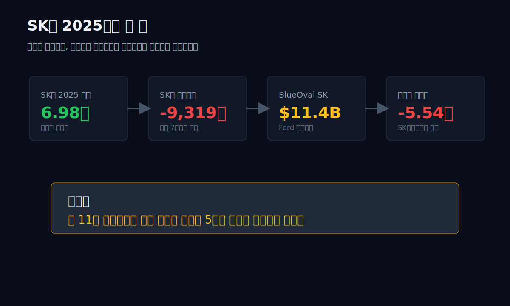
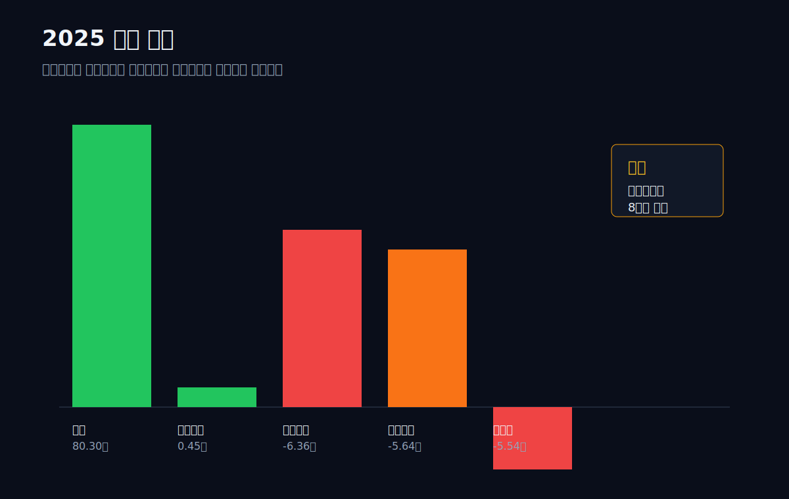
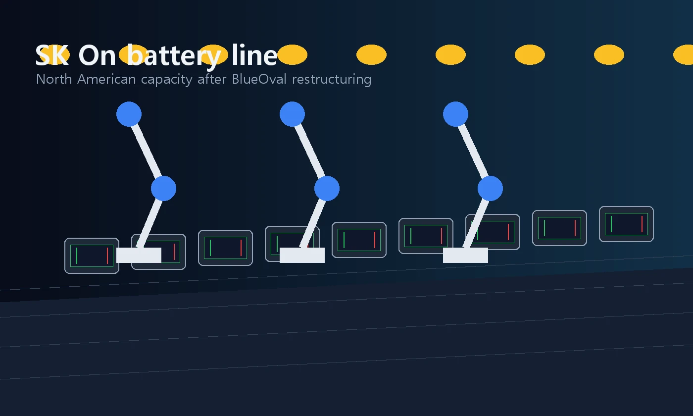
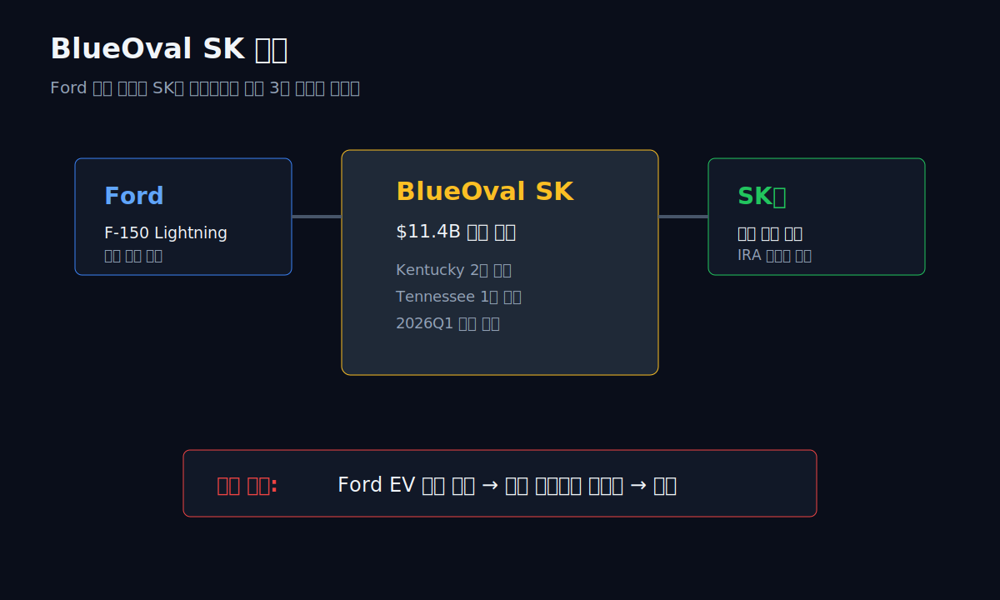
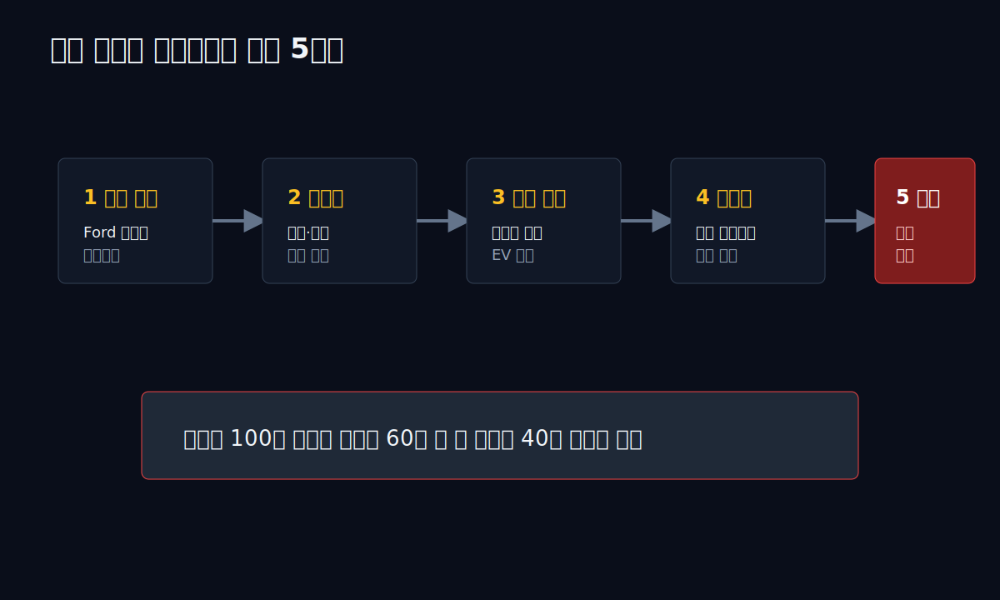
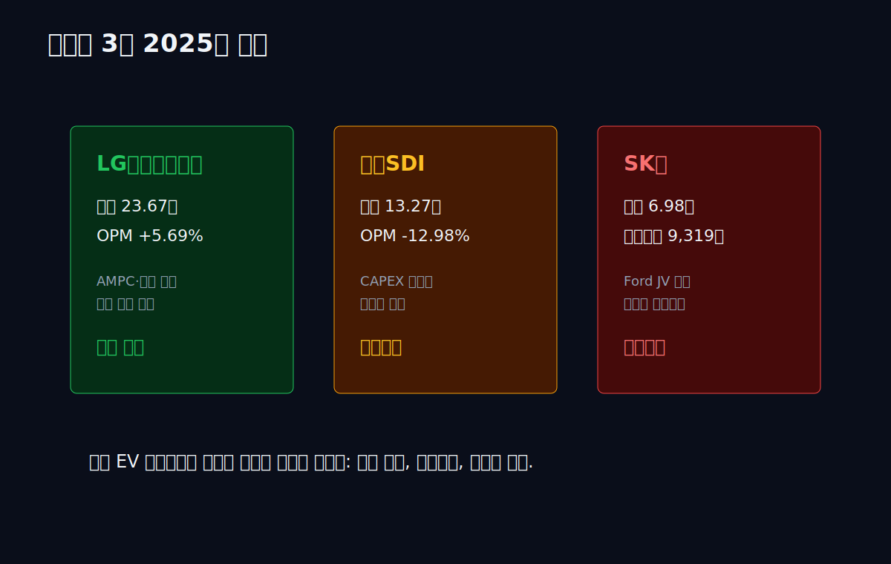
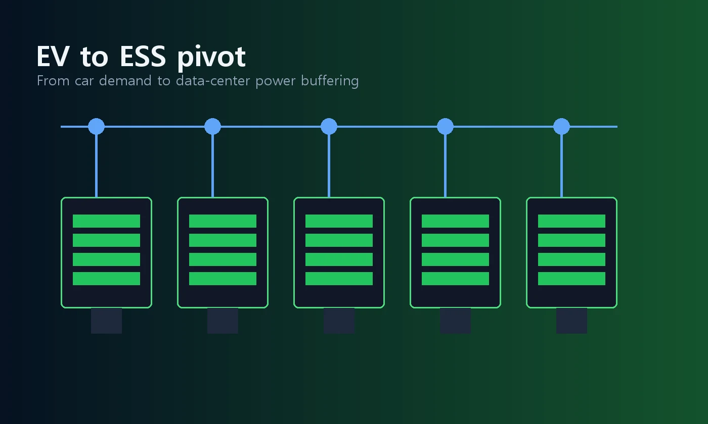
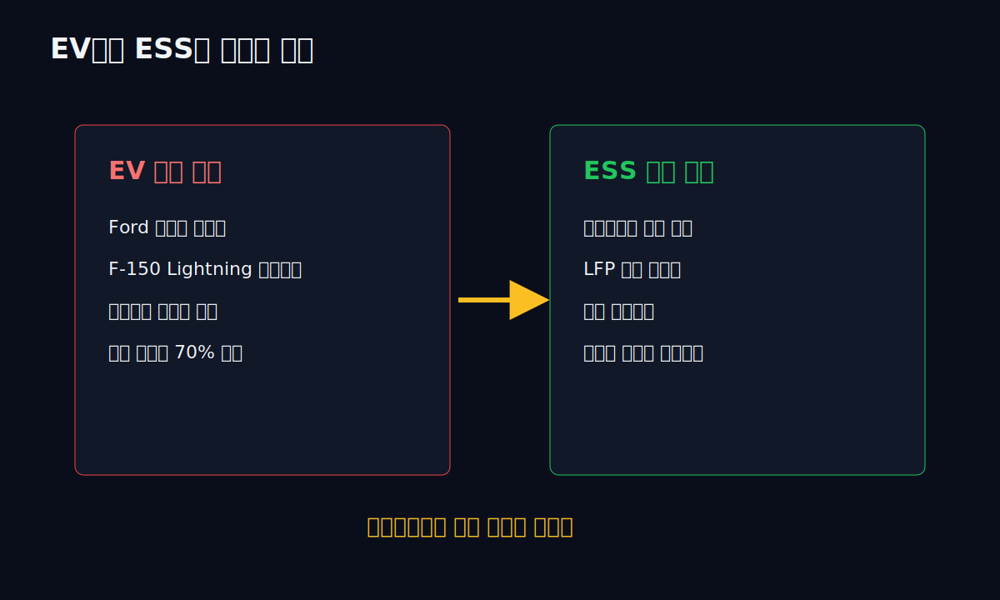
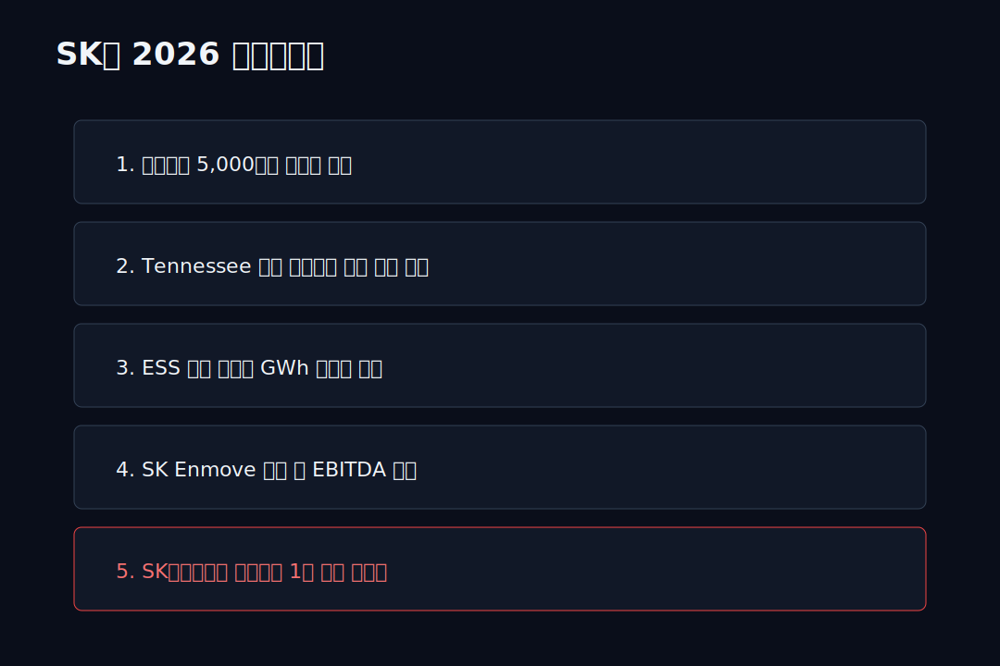

<script>
	import CompanyFinancials from '$lib/components/blog/CompanyFinancials.svelte';
import HFDataLink from '$lib/components/blog/HFDataLink.svelte';
</script>

> **자본집약** | 이차전지 · 에너지 | 2026-04-28 dartlab 실측  
> 같은 시리즈: [LG에너지솔루션](/blog/373220-lg-energy-solution) · [삼성SDI](/blog/006400-samsung-sdi) · [에코프로](/blog/086520-ecopro) · [롯데케미칼](/blog/011170-lotte-chemical) · [기업이야기 시리즈 전체](/blog/series/company-reports)

<HFDataLink code="096770" />



SK온은 상장사가 아니다. 그래서 `dartlab.Company("SK온")`으로 별도 손익계산서를 열 수 없다. 공시는 모회사 **SK이노베이션(096770)** 연결 재무제표와 사업부 설명 안에 들어 있다. 이 글은 그 한계를 명시하고 시작한다. SK온 단독 수치는 회사 실적 발표와 보도자료, 모회사 연결 수치는 dartlab 실측으로 구분한다.

2025년 SK온은 매출 **6조 9,782억원**, 영업손실 **9,319억원**을 기록했다. 매출이 없는 회사가 아니다. 7조 가까이 팔았다. 그런데 영업단에서 1조 가까이 잃었다. 그리고 더 큰 숫자는 모회사 SK이노베이션 쪽에서 튀어나왔다. SK이노베이션 2025년 연결 매출은 **80.30조원**, 영업이익은 **4,487억원** 흑자였지만 당기순손실은 **5.54조원**이었다.

왜 영업이익이 흑자인 회사가 순손실 5.54조를 냈나. dartlab이 잡은 핵심 줄은 `*기타비용`이다. SK이노베이션의 기타비용은 2024년 **7,006억원**에서 2025년 **5.64조원**으로 뛰었다. 거의 8배다. 이 큰 구멍의 중심에 **BlueOval SK**, Ford와 SK온이 2021년에 발표한 11.4억 달러가 아니라 **11.4 billion dollars**, 원화로 약 15조원 규모의 미국 배터리 합작 프로젝트가 있다.

관통선은 하나다.

> **왜 11조 합작공장은 성장 투자가 아니라 5조대 손실의 출발점이 됐는가.**

이 질문은 SK온 하나의 문제가 아니다. [LG에너지솔루션](/blog/373220-lg-energy-solution)은 같은 EV 캐즘에서 영업흑자를 지켰고, [삼성SDI](/blog/006400-samsung-sdi)는 2025년 영업손실 -1.72조로 밀렸다. SK온은 그보다 더 복잡하다. 독립 상장 전에 미국 JV, 모회사 합병, 윤활유 자회사 결합, ESS 전환이 한꺼번에 얽혔다. 배터리 산업의 가장 아픈 장부가 여기 있다.

---

## 1막 — 2025년 숫자: 매출 80조 회사의 순손실 5.54조

먼저 모회사 SK이노베이션 연결 손익계산서를 본다. SK온은 이 연결 안에 들어 있다.

```python
import dartlab
c = dartlab.Company("096770")
c.analysis("financial", "수익성")["marginWaterfall"]["history"][0]
```

| 항목 (SK이노베이션 연결, 1년치) | 2025 | 2024 | 2023 | 2022 |
|---|---:|---:|---:|---:|
| 매출액 | **80.30조** | 74.72조 | 77.29조 | 78.06조 |
| 매출총이익 | 4.30조 | 4.04조 | 5.01조 | 7.03조 |
| 영업이익 | **0.45조** | 0.32조 | 1.90조 | 3.92조 |
| 기타비용 | **5.64조** | 0.70조 | 0.13조 | 0.38조 |
| 금융비용 | 6.36조 | 6.40조 | 6.18조 | 8.11조 |
| 당기순이익 | **-5.54조** | -2.37조 | 0.55조 | 1.90조 |

표시: 2025년의 이상한 숫자는 매출이나 영업이익보다 **기타비용 5.64조**다. 영업이익은 4,487억원 흑자다. 그런데 기타비용과 금융비용이 밑에서 손익을 뒤집는다.

손익 폭포로 보면 더 선명하다.

| 단계 (2025년, 매출 100원 기준) | 비율 |
|---|---:|
| 매출 | 100.00 |
| 매출원가 | -94.65 |
| 매출총이익률 | **5.35** |
| 판관비 | -5.69 |
| 영업이익률 | **0.56** |
| 금융비용 | -7.92 |
| 세전이익률 | **-7.31** |
| 순이익률 | **-6.90** |

매출 100원을 팔아 영업단에서 0.56원이 남았다. 그다음 금융비용 7.92원이 빠졌다. 그리고 BlueOval SK 구조조정 관련 손상이 포함된 기타비용이 손익계산서 아래층을 무너뜨렸다. 결과는 순이익률 -6.90%. **80조 매출 회사가 5.54조 순손실**을 냈다.



여기서 SK온 단독 숫자를 겹친다. 2025년 SK온 매출은 **6.98조**, 영업손실은 **9,319억원**으로 보도됐다. 모회사 전체 매출 80.30조의 8.7% 수준이지만, 손실의 방향은 훨씬 크다. 석유·화학·LNG가 벌어도 배터리와 합작공장 구조조정이 밑에서 끌어내리는 구조다.

이 막의 답은 간단하다. **SK온은 연결 매출의 일부지만, 손실과 투자 위험에서는 연결 손익의 중심 변수가 됐다.** 다음 막은 그 위험이 왜 Ford와 연결됐는지 따라간다.

---

## 2막 — BlueOval SK: 2021년에는 미국 전동화의 상징이었다

2021년 9월, Ford와 SK이노베이션은 미국에서 대형 배터리 합작 투자를 발표했다. 이름은 **BlueOval SK**. 테네시와 켄터키에 배터리 공장을 짓고, Ford 전기차에 배터리를 공급하는 구조였다. Ford는 이를 자사 역사상 최대 제조 투자 중 하나로 설명했다. Manufacturing Dive는 이 합작투자를 **11.4 billion dollars** 규모로 정리했다.

당시 논리는 완벽해 보였다.

- Ford는 F-150 Lightning, Mustang Mach-E, 차세대 전기 픽업을 밀어야 했다.
- SK온은 미국 IRA 시대에 북미 현지 생산능력이 필요했다.
- 배터리 공장은 완성차 고객과 붙어야 가동률이 안정된다.
- 합작법인은 투자 부담과 수요 리스크를 나눠 갖는다.

여기서 중요한 단어는 "합작"이다. 배터리 회사가 혼자 공장을 지으면 수요 위험을 혼자 진다. 완성차 회사가 지분을 같이 들고 들어오면, 겉으로는 위험이 나뉜다. Ford도 배터리 공급을 잠그고, SK온도 고객을 잠근다. 이 구조가 2021년에는 가장 합리적인 답처럼 보였다. 미국은 IRA로 현지 생산을 요구했고, 중국 배터리를 피하려는 완성차 회사는 한국 배터리 업체와 손잡을 이유가 있었다.

하지만 합작은 위험을 없애는 장치가 아니라 **위험을 같은 방향으로 묶는 장치**다. Ford가 EV 판매 목표를 올릴 때는 SK온도 같이 커진다. Ford가 속도를 낮출 때는 SK온도 같이 멈춘다. 독립 고객 포트폴리오가 넓으면 한 고객의 속도 조절을 다른 고객 물량으로 메울 수 있다. 그런데 특정 공장이 특정 완성차 플랫폼에 맞춰 지어지면, 그 공장의 경제성은 고객 한 명의 생산계획에 더 강하게 묶인다.

배터리 사업에서 공장은 단순한 생산설비가 아니다. **고객 약속을 담보로 먼저 짓는 대차대조표**다. 완성차 회사가 2026년에 전기차 100만대를 만들겠다고 말하면, 배터리 회사는 2023~2024년에 이미 토지를 사고, 장비를 발주하고, 인력을 뽑아야 한다. 수요가 실제로 오기 전에 돈이 먼저 나간다.

BlueOval SK가 바로 그 구조였다.





문제는 2024~2025년에 전제 자체가 바뀐 것이다. Ford는 전기 픽업과 EV 전환 속도를 낮췄다. EV 부문 손실은 커졌고, F-150 Lightning 수요는 기대보다 약했다. AP는 2026년 3월 SK Battery America 조지아 공장에서 **958명 감원**, 전체의 37% 수준의 인력 축소가 있었다고 보도했다. 전기차 수요 둔화가 공장 인력으로 바로 내려온 장면이다.

2025년 12월, SK온과 Ford는 BlueOval SK 해체에 합의했다. Korea JoongAng Daily 보도에 따르면 Ford는 켄터키 2개 공장을 가져가고, SK온은 테네시 공장을 맡는 구조다. 합작법인은 2026년 1분기 종료를 목표로 정리된다.

성장기의 언어로 보면 "전략적 재조정"이다. 재무제표의 언어로 보면 다르다. **투자했던 자산의 미래 현금흐름이 낮아졌으니 손상을 인식해야 한다.**

그래서 BlueOval SK는 단순한 파트너십 종료가 아니다. 2021년에 미래 생산량을 당겨서 자산으로 세웠고, 2025년에 미래 생산량을 낮춰서 비용으로 되돌린 사건이다. 이 지점에서 배터리 회사는 기술주가 아니라 제조업이다. 좋은 셀을 만들 수 있느냐보다, 그 셀을 만들 공장이 몇 년 안에 얼마만큼 돌아가느냐가 손익을 결정한다.

이 막의 답은 이렇다. **BlueOval SK는 수요가 살아있을 때는 북미 진출권이었지만, Ford의 EV 속도가 꺾이자 손상 테스트 대상 자산이 됐다.**

---

## 3막 — 합작공장이 손상차손이 되는 과정

손상차손은 회계 용어지만 구조는 직관적이다. 장부에 100으로 잡힌 공장이 앞으로 100을 벌어줄 것 같으면 그대로 둔다. 앞으로 60밖에 못 벌 것 같으면 40을 비용으로 턴다. BlueOval SK 구조조정은 이 판단을 강제했다.

SK이노베이션 2025년 기타비용 5.64조는 단순 영업비용이 아니다. dartlab에서 보이는 계정 위치는 영업이익 아래층이다.

```python
c.select("IS", ["영업이익", "*기타비용", "법인세차감전순이익", "당기순이익"])
```

| 항목 | 2025 | 2024 |
|---|---:|---:|
| 영업이익 | 4,487억원 | 3,155억원 |
| 기타비용 | **5조 6,364억원** | 7,006억원 |
| 법인세차감전순이익 | **-5조 8,688억원** | -2조 3,798억원 |
| 당기순이익 | **-5조 5,398억원** | -2조 3,725억원 |

표시: 영업이익은 2024년보다 조금 늘었다. 그런데 기타비용이 4.94조 늘면서 세전손실이 5.87조까지 커졌다. 이게 2025년 손익계산서의 중심이다.

외부 보도도 같은 방향을 가리킨다. Seoul Economic Daily는 SK이노베이션이 BlueOval SK 구조조정 과정에서 세전손실 **5.82조원**을 기록했다고 정리했다. Bloomberg 보도 요약은 Ford 합작 해체 관련 자산 손실을 **3.7조원** 수준으로 언급했다. 숫자의 세부 분류는 공시 주석을 더 봐야 하지만, 방향은 분명하다. **합작공장 재편이 영업외 손실로 내려왔다.**

배터리 사업의 무서운 점은 여기 있다. 손익계산서에서는 매출이 6.98조로 보이지만, 대차대조표에서는 그 매출을 위해 수십조의 공장·장비·합작 지분이 먼저 깔린다. 수요가 20%만 빗나가도 손상은 매출 감소율보다 크게 온다.

이 구조를 회계 순서로 풀면 네 단계다.

첫째, 선투자 단계다. 토지, 건물, 장비, 합작법인 지분이 자산으로 쌓인다. 이때 손익계산서는 아직 조용하다. 비용은 감가상각으로 천천히 내려오거나, 건설 중인 자산으로 대차대조표에 남는다.

둘째, 가동률 검증 단계다. 공장이 돌아가기 시작하면 매출과 원가가 동시에 나타난다. 문제는 초기 가동률이다. 배터리 공장은 품질 안정화, 수율, 고객 인증, 물량 ramp-up이 맞아야 한다. 매출은 늦게 붙고 고정비는 먼저 내려온다. SK온의 영업손실 9,319억원은 이 구간의 부담을 보여준다.

셋째, 미래 현금흐름 재추정 단계다. 고객 생산계획이 낮아지거나 공장 용도가 바뀌면 회계는 묻는다. "이 자산이 장부가만큼 벌 수 있는가?" 이 질문에 아니라고 답하면 손상차손이 나온다. 이때 손실은 공장 한 해의 적자가 아니라, 앞으로 벌 것으로 기대했던 현금흐름의 현재가치가 한꺼번에 낮아진 결과다.

넷째, 신용 부담 단계다. 손상차손 자체는 현금 유출이 아닐 수 있다. 하지만 손상이 나왔다는 것은 기존 투자 판단이 틀렸고, 차입으로 세운 자산의 수익성이 낮아졌다는 뜻이다. 그래서 신용평가와 자금조달 비용은 손익계산서 숫자보다 더 민감하게 반응한다.



이 막의 답은 이렇다. **SK온은 영업손실만 낸 것이 아니라, 미래 수요를 믿고 먼저 세운 공장의 장부가를 다시 써야 하는 국면에 들어갔다.**

---

## 4막 — SK온은 왜 혼자 아픈가: LG엔솔·삼성SDI와 다른 위치

같은 배터리 업황인데 세 회사의 2025년 장부는 다르게 찍혔다.

| 회사 | 2025년 핵심 숫자 | 해석 |
|---|---:|---|
| LG에너지솔루션 | 매출 23.67조, OPM 5.69% | AMPC·고객 포트폴리오·고가 재고 소진으로 흑자 방어 |
| 삼성SDI | 매출 13.27조, OPM -12.98% | CAPEX 타이밍과 고객 믹스가 겹치며 영업적자 |
| SK온 | 매출 6.98조, 영업손실 9,319억 | 규모는 커졌지만 Ford JV 재편과 지속 적자에 노출 |

LG에너지솔루션은 GM·현대차·Stellantis·Tesla 등 고객이 넓다. 삼성SDI는 BMW·Stellantis·GM 쪽이지만 프리미엄 각형 배터리 중심이라 포트폴리오가 다르다. SK온은 현대차·기아라는 강한 고객이 있지만, 북미 성장 스토리에서 Ford 의존도가 컸다. Ford가 전동화 속도를 낮추자 합작공장 경제성이 흔들렸다.

SK온의 두 번째 차이는 모회사 구조다. LG에너지솔루션은 독립 상장사라 손실·차입·CAPEX가 자기 장부에 직접 보인다. 삼성SDI도 상장사다. SK온은 비상장 자회사라 숫자가 SK이노베이션 연결 안에서 섞인다. 투자자는 SK온 단독 장부보다 **SK이노베이션 전체 손익으로 충격을 먼저 본다.**

세 번째 차이는 현금흐름이다. SK이노베이션은 정유·화학·LNG·윤활유가 있다. 그래서 SK온 적자를 견딜 수 있다. 하지만 그 방어막이 영원한 것은 아니다. 2025년 SK이노베이션 연결 영업활동현금흐름은 **2.28조원**이었고, FCF는 dartlab 기준 **-3.37조원**이다. 정유가 벌어도 배터리 투자와 금융비용이 현금을 먹는다.

배터리 3사를 같은 산업으로만 묶으면 이 차이를 놓친다. LG에너지솔루션의 핵심 질문은 "AMPC와 고객 포트폴리오로 어느 정도 마진을 지킬 수 있는가"다. 삼성SDI의 핵심 질문은 "프리미엄 고객과 각형·원통형 전략이 CAPEX 부담을 이길 수 있는가"다. SK온의 핵심 질문은 다르다. "비상장 배터리 자회사의 적자를 모회사 포트폴리오가 얼마나 오래 흡수할 수 있는가"다.

그래서 SK온을 볼 때 LG엔솔의 흑자 여부만 가져와 비교하면 안 된다. SK온은 손익계산서의 사업부이고, 동시에 모회사 신용의 변수이며, 동시에 Ford 합작공장 재편의 당사자다. 세 층이 한꺼번에 움직인다. 이 구조 때문에 SK온의 회복 신호도 단일 지표로 나오지 않는다. 영업손실 축소, 모회사 기타비용 정상화, 공장 가동률, 신규 수주, 신용지표가 같이 움직여야 한다.



이 막의 답은 이렇다. **SK온은 배터리 3사 중 가장 늦게 독립했고, 가장 공격적으로 북미 JV에 얹혔고, 가장 모회사 손익에 묻혀 보이는 회사다.**

---

## 5막 — SK Enmove 합병: 윤활유 현금흐름을 배터리에 붙이는 수술

2025년 SK그룹은 SK온과 SK Enmove 결합을 추진했다. SK Enmove는 윤활유·기유 사업을 하는 회사다. 배터리와 윤활유는 얼핏 멀어 보인다. 하지만 재무제표 관점에서는 이유가 있다.

배터리는 현금을 먹는 사업이다. 공장 투자가 먼저이고, 가동률이 뒤따른다. 반대로 윤활유·기유는 상대적으로 현금흐름이 안정적이다. SK온이 계속 적자를 내는 동안, SK Enmove의 현금창출력을 붙이면 신용도와 EBITDA가 개선된다. Chosunbiz는 SK이노베이션이 SK온·SK Enmove 합병 시너지를 통해 2030년까지 추가 EBITDA 2,000억원 이상을 기대한다고 보도했다.

이건 성장 전략이면서 동시에 재무 수술이다. 손실 자회사에 현금흐름 좋은 자회사를 붙이는 구조다. 좋은 표현으로는 "전동화 경쟁력 강화"이고, 냉정한 표현으로는 **배터리 적자를 버티기 위해 안정 현금흐름을 붙인 것**이다.

여기에 사업적 연결고리도 있다. 전기차 배터리 열관리, immersion cooling, ESS 냉각 기술은 윤활유·열관리 소재와 맞닿는다. SK그룹은 InterBattery 2025에서 SK온과 SK Enmove의 immersion cooling 기술을 함께 내세웠다. AI 데이터센터 ESS가 커지면, 배터리와 냉각 기술을 묶는 논리가 생긴다.

하지만 순서는 중요하다. 시너지가 먼저라서 합친 것이 아니라, **재무 부담을 줄여야 했고 그 안에서 시너지 논리를 만든 것**에 가깝다.

여기서 투자자가 조심해야 할 해석이 있다. 현금흐름 좋은 사업을 붙인다고 배터리 사업의 경제성이 자동으로 좋아지는 것은 아니다. SK Enmove가 붙으면 연결 EBITDA와 유동성은 나아질 수 있다. 그러나 SK온 공장의 가동률, 수율, 고객 물량, 제품 믹스가 그대로라면 배터리 본업의 손실 구조는 남는다. 합병은 시간을 벌어주는 장치이지, 공장 경제성을 대신 고쳐주는 장치는 아니다.

반대로 이 결합을 단순한 부실 지원으로만 봐도 부족하다. ESS와 데이터센터 전력 인프라가 커지면 배터리 셀, 열관리, 냉각 소재, 장기 유지보수는 한 묶음으로 팔릴 수 있다. SK Enmove의 역할은 그때 의미가 커진다. 2026~2027년에 확인할 것은 "합쳤다"가 아니라, 합친 뒤 실제 고객 제안이 바뀌었는가다.

이 막의 답은 이렇다. **SK Enmove 결합은 SK온의 성장 엔진 보강이면서 동시에 손실 흡수 장치다.**

---

## 6막 — EV에서 ESS로: 성장 스토리의 방향 전환

BlueOval SK 해체 이후 보도에서 반복되는 단어는 ESS다. Energy Storage System, 에너지저장장치. 전기차 배터리와 같은 셀 기술을 쓰지만 고객은 다르다. 자동차 회사가 아니라 전력망, 데이터센터, 재생에너지 사업자가 고객이다.

왜 ESS인가.



첫째, AI 데이터센터 전력 수요가 폭증하고 있다. 전력망은 피크 부하를 견뎌야 하고, ESS는 전력 공급의 완충 장치가 된다. 둘째, EV는 소비자 구매 사이클과 보조금에 민감하지만, ESS는 전력망 투자와 장기 계약에 더 가깝다. 셋째, LFP 배터리와 궁합이 좋다. 에너지 밀도보다 가격·안전성·수명이 중요하기 때문이다.

SK온 입장에서는 ESS가 탈출구다. Ford EV 수요에 맞춰 세운 공장이 흔들렸다면, 일부 생산능력을 ESS로 돌리는 전략이 필요하다. AJU Press는 BlueOval SK 해체를 한국 배터리 업체들의 ESS 전환 신호로 해석했고, Ford 역시 Kentucky 공장 일부를 LFP/ESS 방향으로 재편하는 흐름을 보였다.

문제는 ESS도 공짜 시장이 아니라는 점이다. CATL·BYD·EVE·Hithium 같은 중국 업체들이 이미 강하다. EV에서 중국과 싸우다 밀린 회사가 ESS로 간다고 해서 경쟁이 쉬워지는 것은 아니다. 오히려 ESS는 가격 경쟁이 더 심하다. SK온이 살아남으려면 "EV용 프리미엄 NCM"이 아니라 **북미 현지 생산 + 비중국 공급망 + 장기 전력 고객**으로 차별화해야 한다.

ESS 전환에서 또 하나 봐야 할 것은 배터리 화학 체계다. EV용 고성능 NCM은 주행거리와 출력이 중요하다. ESS는 다르다. 설치 후 오래 버티는 수명, 화재 리스크, 초기 가격, 유지보수 비용이 더 중요하다. 그래서 LFP가 강하다. SK온이 ESS를 키우려면 단순히 남는 공장 물량을 ESS로 돌리는 수준이 아니라, 원가 구조와 제품 설계를 ESS 고객에게 맞춰야 한다.

또 ESS 고객은 완성차 고객과 구매 방식이 다르다. 자동차 회사는 플랫폼별로 몇 년 단위 물량을 잡고, 셀 인증과 품질 기준을 깊게 본다. 전력망·데이터센터 고객은 프로젝트 금융, 전력계약, 설치 후 운영 안정성을 본다. 판매 조직, 보증 리스크, 서비스 구조가 달라진다. SK온이 EV에서 ESS로 간다는 말은 시장 이름만 바꾸는 것이 아니라, 영업과 리스크 관리 방식 전체를 바꾸는 일이다.



이 막의 답은 이렇다. **ESS는 SK온의 탈출구가 될 수 있지만, EV보다 쉬운 시장이 아니라 다른 방식으로 어려운 시장이다.**

---

## 7막 — 신용등급은 왜 아직 AA-인가

2025년 순손실 5.54조인데 dartlab 신용등급은 **dCR-AA-**다. 이상해 보인다. 이유는 모회사 SK이노베이션 연결 규모와 사업 포트폴리오 때문이다.

```python
c.credit("등급")
```

| 축 | dartlab 실측 |
|---|---:|
| 등급 | dCR-AA- |
| healthScore | 66.82 |
| 부채비율 | 190.2% |
| Debt/EBITDA | 19.8배 |
| EBITDA/이자비용 | 0.07배 |
| 단기차입금비중 | 100.0% |
| 등급 보정 사유 | 대형기업, 캡티브금융, CAPEX집약 OCF양수, 연속 영업흑자 |

위험 신호는 분명하다. 유동성 축이 약하고, Debt/EBITDA가 높고, EBITDA/이자비용은 거의 바닥이다. 그런데 매출 80조 규모, 정유·화학·LNG·윤활유 포트폴리오, SK E&S 합병 효과가 등급을 지탱한다. SK온만 떼어내면 이 등급은 나오기 어렵다.

이게 투자자가 봐야 할 핵심이다. **SK온은 단독으로 버티는 회사가 아니라 SK이노베이션의 포트폴리오 안에서 버티는 회사**다. 그래서 SK온의 회복은 두 층에서 판단해야 한다.

첫째, SK온 자체가 영업손실을 줄이는가.  
둘째, SK이노베이션 전체가 배터리 손실을 흡수하면서도 신용을 유지하는가.

둘 중 하나만 좋아져도 부족하다. SK온이 좋아져도 모회사 금융비용이 무거우면 순이익은 안 돌아온다. 모회사가 벌어도 SK온 적자가 계속되면 투자 스토리는 접힌다.

특히 EBITDA/이자비용 0.07배는 그냥 낮은 숫자가 아니다. 영업현금흐름이 양수여도, 금융비용이 크면 순이익은 회복되지 않는다. 2025년 금융비용 6.36조는 영업이익 0.45조보다 훨씬 컸다. 배터리 손상은 한 번의 큰 비용일 수 있지만, 금융비용은 자본구조가 바뀌기 전까지 반복된다. 그래서 SK온 회복을 말하려면 "올해 손상차손이 끝났다"만으로 부족하다. 차입 부담과 이자비용이 같이 내려와야 한다.

이 관점에서 SK이노베이션의 포트폴리오는 양날이다. 정유·LNG·윤활유가 있기 때문에 배터리 손실을 버틴다. 동시에 배터리 손실이 커지면 그 포트폴리오 전체가 차입 비용을 부담한다. 좋은 사업이 나쁜 사업을 영원히 보조할 수는 없다. 신용등급이 유지되는 동안에는 시간이 생기지만, 그 시간이 회복으로 연결되지 않으면 다음 단계는 자산 매각, 투자 축소, 추가 합병 같은 구조조정이다.

이 막의 답은 이렇다. **AA-는 SK온의 등급이 아니라 SK이노베이션 포트폴리오의 등급이다. SK온은 그 등급을 쓰고 있는 적자 성장 자회사다.**

---

## 8막 — 앞으로 볼 5개 숫자

SK온 단독편의 마지막은 체크리스트다. 이 회사는 비상장이라 주가보다 공시와 보도자료를 먼저 봐야 한다.



**1. SK온 연간 영업손실 5,000억원 이하.**  
2025년 영업손실 9,319억원이 기준선이다. 2026년에 절반 이하로 줄어야 턴어라운드 이야기 시작이다.

**2. Tennessee 공장 가동률.**  
BlueOval SK 해체 후 SK온이 가져가는 핵심 자산이다. 이 공장이 Ford 차세대 EV 또는 ESS 물량으로 채워지는지가 첫 번째 현장 신호다.

**3. ESS 장기 수주.**  
EV에서 ESS로 방향을 바꾼다고 말하는 것은 쉽다. 중요한 것은 데이터센터·전력회사와의 GWh 단위 장기 계약이다.

**4. SK Enmove 결합 후 EBITDA.**  
합병 시너지가 진짜라면 2026~2027 EBITDA가 먼저 움직여야 한다. 손익계산서의 순이익보다 현금창출력 회복이 먼저다.

**5. SK이노베이션 기타비용 정상화.**  
2025년 기타비용 5.64조는 반복되면 안 되는 숫자다. 2026년에 1조 이하로 내려오는지 확인해야 한다.

이 다섯 개 중 두 개만 좋아져도 회복 신호가 아니다. 최소 세 개, 가능하면 네 개가 동시에 움직여야 한다. 배터리 자본집약 사업은 한 지표만 좋아져서는 손익이 돌아오지 않는다.

---

## 9막 — 회복 신호는 어떤 순서로 와야 하나

SK온 회복은 한 번에 오지 않는다. 순서가 있다. 가장 먼저 나와야 할 것은 손상차손의 종료다. 2025년 기타비용 5.64조 같은 숫자가 반복되면 다른 개선은 의미가 약하다. 손상은 "과거 투자의 가치가 낮아졌다"는 회계 판단이기 때문에, 같은 성격의 비용이 또 나오면 아직 바닥을 확인하지 못했다는 뜻이다.

두 번째는 영업손실 축소다. 여기서 순이익을 먼저 보면 안 된다. SK이노베이션 연결 순이익은 금융비용, 기타손익, 세금, 합병 효과가 섞인다. SK온 본업의 첫 번째 신호는 배터리 부문 영업손실이 줄어드는지다. 2025년 9,319억원 손실에서 2026년에 얼마나 내려오는가. 이 숫자가 줄어야 공장 가동률, 수율, 원가, 고객 믹스 중 하나가 실제로 개선됐다고 볼 수 있다.

세 번째는 매출의 질이다. 매출이 늘어도 손실이 같이 늘면 회복이 아니다. 배터리 회사는 물량을 밀어 넣으면 매출을 키울 수 있다. 그러나 낮은 가동률, 낮은 판가, 높은 보증비, 낮은 수율이 붙으면 매출 증가는 손실 증가로 이어진다. 그래서 SK온의 다음 실적에서 봐야 할 것은 "매출이 늘었나"보다 "매출 1원당 손실이 줄었나"다. 매출 6.98조에 영업손실 9,319억원이면 매출 대비 영업손실률은 약 13.4%다. 이 비율이 한 자릿수로 내려오는지가 더 중요하다.

네 번째는 현금흐름이다. 손익계산서가 좋아 보여도 운전자본과 CAPEX가 현금을 먹으면 모회사 부담은 계속된다. SK이노베이션 2025년 영업활동현금흐름은 2.28조원 양수였지만 투자활동현금흐름은 -4.29조원이었다. 영업에서 번 돈보다 투자로 나간 돈이 컸다. 배터리 투자가 줄거나 ESS·고객 선급금으로 현금 구조가 바뀌어야 FCF가 회복된다.

다섯 번째는 신용지표다. 신용등급이 유지된다는 말은 아직 자금조달 창구가 열려 있다는 뜻이다. 하지만 Debt/EBITDA 19.8배, EBITDA/이자비용 0.07배 같은 숫자는 시간을 오래 주지 않는다. 2026년에 손상차손이 줄고 영업손실이 줄어도, 이자비용이 계속 무거우면 순이익은 늦게 돌아온다. 그래서 SK온의 회복을 말하려면 손익계산서와 현금흐름표, 신용지표가 같은 방향이어야 한다.

이 순서가 중요한 이유는 투자자가 흔히 마지막 신호를 먼저 보기 때문이다. "ESS가 뜬다", "전고체가 온다", "북미 생산이 유리하다"는 말은 모두 뒤쪽 이야기다. 앞쪽 숫자인 손상 종료, 손실 축소, 매출의 질, FCF, 신용지표가 확인되지 않으면 성장 스토리는 다시 비용으로 돌아올 수 있다.

---

## 10막 — 비상장 SK온을 추적하는 법

SK온은 상장사가 아니다. 그래서 투자자가 흔히 보는 PBR, PER, 주가 차트로 바로 판단하기 어렵다. 대신 세 장부를 겹쳐야 한다. 첫째는 SK이노베이션 연결 손익계산서다. 기타비용, 금융비용, 순손실이 여기서 보인다. 둘째는 SK온 단독 실적 보도다. 매출과 영업손실의 방향을 확인한다. 셋째는 합작법인과 공장 관련 뉴스다. Ford, Hyundai, ESS 고객, Tennessee 공장 가동률이 실제 수요의 대리 지표다.

이렇게 보면 SK온은 단순한 "배터리 적자 회사"가 아니다. **공장 선투자 → 고객 수요 변경 → 손상 인식 → 모회사 신용 부담 → 사업 포트폴리오 재편**으로 이어지는 자본집약 산업의 전형적 사례다. 이 패턴은 이차전지에서만 끝나지 않는다. 조선, 석유화학, 반도체, 항공기 엔진처럼 설비가 먼저 깔리는 산업은 모두 비슷한 위험을 갖는다. 차이는 회복 속도다. 반도체는 업황이 돌아오면 가격이 먼저 움직이고, 조선은 수주잔고가 손익을 끌고 오며, 배터리는 고객의 차량 플랫폼과 공장 가동률이 동시에 맞아야 한다.

그래서 SK온의 다음 1년은 "배터리 산업이 좋아지느냐"보다 좁게 봐야 한다. Ford 물량이 어떻게 재배치되는가. Tennessee 공장은 어느 고객으로 채워지는가. ESS 전환은 수주로 확인되는가. SK Enmove 결합 후 현금흐름이 실제로 버팀목이 되는가. 모회사 기타비용은 2025년 한 번으로 끝나는가. 이 다섯 질문이 답을 주기 전까지, SK온의 회복은 스토리이고 아직 재무제표는 아니다.

---

## 11막 — 판단: SK온은 실패한 배터리 회사인가

실패라고 단정하기엔 이르다. SK온은 여전히 현대차·기아·Ford 같은 고객을 갖고 있고, 북미 생산 거점도 남아 있다. 배터리 산업에서 현지 생산능력은 사라지는 자산이 아니다. EV 속도가 느려져도 ESS와 전력망 수요가 커지면 일부 공장은 다시 의미를 찾을 수 있다.

하지만 성공 스토리라고 부르기에도 이르다. 2025년 장부는 너무 비싸게 배운 교훈을 보여준다. Ford와의 합작은 2021년에는 미국 전동화의 상징이었지만, 2025년에는 손상과 구조조정의 이름으로 돌아왔다. 7조 매출을 내는 배터리 회사가 1조 가까운 영업손실을 냈고, 모회사 손익계산서에는 순손실 5.54조가 찍혔다.

이 글의 결론은 하나다.

> **SK온의 문제는 배터리를 못 팔아서가 아니다. 수요가 오기 전에 공장을 먼저 지어야 하는 산업에서, 가장 큰 고객 중 하나였던 Ford의 속도가 꺾인 것이다. 성장 투자가 손상차손이 되는 순간, 배터리 회사는 기술 회사가 아니라 자본집약 제조업이라는 본질을 드러낸다.**

2026년 SK온을 볼 때 "전고체", "ESS", "북미 생산" 같은 단어보다 먼저 봐야 할 숫자는 손실 축소와 기타비용 정상화다. 영업손실이 줄고, Tennessee 공장이 채워지고, SK Enmove 결합 EBITDA가 올라오고, 모회사 기타비용이 정상화되면 이 회사는 첫 번째 골짜기를 통과한다.

반대로 2026년에도 손실이 1조 안팎이고, ESS 수주가 말뿐이고, 기타비용이 또 튀면 이야기는 달라진다. 그때는 SK온이 아니라 SK이노베이션 전체가 배터리 베팅의 가격을 다시 치르게 된다.

지금 SK온은 실패와 회복 사이에 있다. 재무제표는 아직 회복을 말하지 않는다. 다만 무엇이 회복인지 볼 숫자는 분명해졌다.

이 글을 한 문장으로 줄이면 이렇다. **SK온은 기술 경쟁에서만 진 것이 아니라 시간표에서 졌다.** EV 수요가 약해진 뒤 공장을 지은 것이 아니라, 수요가 강할 것이라는 약속을 믿고 먼저 공장을 지었다. 자본집약 제조업에서 이 순서는 중요하다. 수요가 맞으면 선점이고, 수요가 빗나가면 손상이다. 같은 공장도 업황에 따라 전략 자산과 부실 자산 사이를 오간다.

그래서 2026년의 좋은 뉴스는 화려한 단어가 아니라 지루한 숫자에서 나올 가능성이 크다. 기타비용이 정상화되고, 배터리 영업손실률이 내려가고, 투자현금 유출이 줄고, 이자 부담이 완화되는 순서다. 그다음에 ESS 수주와 북미 생산능력이 의미를 갖는다. 순서가 바뀌면 다시 스토리가 장부보다 앞서간다.

반대로 나쁜 뉴스도 같은 방식으로 읽으면 된다. 대형 수주 발표가 있어도 손실률이 안 내려가면 아직 가격이 낮거나 원가가 높다는 뜻이다. 공장 가동률이 오른다고 해도 FCF가 계속 마이너스면 운전자본과 CAPEX가 현금을 먹고 있다는 뜻이다. 신용등급이 유지돼도 이자보상력이 바닥이면 회복의 시간은 비싸다. SK온은 그런 회사다. 뉴스 제목보다 손익계산서 아래쪽과 현금흐름표가 더 솔직하다.

따라서 이 글의 사용법은 명확하다. 2026년 실적이 나올 때마다 먼저 기타비용을 보고, 그다음 SK온 영업손실률을 보고, 마지막으로 Tennessee와 ESS 수주를 보면 된다. 이 순서를 지키면 스토리에 끌려가지 않는다. 숫자가 먼저 길을 열고, 뉴스는 그 뒤를 따라와야 한다.

SK온은 아직 답이 아니라 관찰 대상이다. 그러나 이제 무엇을 관찰해야 하는지는 장부가 충분히 말해줬다.

그게 이 글의 최종 판단이다. 지금은 숫자부터 봐야 한다.

---

## 검증표

본문의 수치는 dartlab 실측, 회사 발표, 외부 보도 출처를 구분했다. 📅 **dartlab 실측 2026-04-28**.

| 본문 수치 | 출처 / 호출 | 결과 |
|---|---|---|
| SK이노베이션 2025 매출 80.30조 | `dartlab.Company("096770").select("IS")` 분기 합산 | ✅ 실측 |
| SK이노베이션 2025 영업이익 4,487억원 | 위 동일 | ✅ 실측 |
| SK이노베이션 2025 순손실 5.54조 | 위 동일 | ✅ 실측 |
| SK이노베이션 2025 기타비용 5.64조 | 위 동일 `*기타비용` | ✅ 실측 |
| SK이노베이션 2024 기타비용 7,006억원 | 위 동일 | ✅ 실측 |
| 2025 금융비용 6.36조 | `c.analysis("financial","수익성")` | ✅ 실측 |
| 2025 순이익률 -6.90% | `marginWaterfall.history[0]` | ✅ 실측 |
| 2025 영업활동현금흐름 2.28조 | `c.select("CF")` 분기 합산 | ✅ 실측 |
| 2025 FCF -3.37조 | `c.analysis("financial","자본배분")["fcfUsage"]` | ✅ 실측 |
| dCR-AA-, healthScore 66.82 | `c.credit("등급")` | ✅ 실측 |
| 부채비율 190.2%, Debt/EBITDA 19.8배 | `c.credit("등급")` | ✅ 실측 |
| SK온 2025 매출 6.9782조, 영업손실 9,319억원 | AJU Press 2026-01-28 보도 | 📰 외부 |
| BlueOval SK 11.4 billion dollar 합작 | Manufacturing Dive, Korea JoongAng Daily | 📰 외부 |
| Ford와 SK온 BlueOval SK 해체, 2026Q1 종료 목표 | Manufacturing Dive, Korea JoongAng Daily | 📰 외부 |
| SK Battery America 조지아 공장 958명 감원 | AP 2026-03-06 | 📰 외부 |
| BlueOval SK 구조조정 관련 세전손실 5.82조 | Seoul Economic Daily 2026-01-29 | 📰 외부 |
| Ford JV 해체 관련 자산손실 3.7조 보도 | Bloomberg 보도 요약 | 📰 외부 |
| SK Enmove 결합 시너지 2030 EBITDA 2,000억원+ 기대 | Chosunbiz 2025-07-30 | 📰 외부 |

---

## 외부 출처

- [AJU Press — SK On 2025 실적과 BlueOval SK 구조조정](https://www.ajupress.com/view/20260128171570001)
- [Korea JoongAng Daily — SK On·Ford BlueOval SK 해체](https://koreajoongangdaily.joins.com/news/2025-12-11/business/industry/SK-On-Ford-agree-to-dissolve-11B-battery-joint-venture-across-3-US-factories/2475633)
- [Manufacturing Dive — Ford·SK On JV dissolution](https://www.manufacturingdive.com/news/ford-skon-dissolving-blueoval-sk-ev-battery-joint-venture/807801/)
- [AP — SK Battery America 조지아 공장 감원](https://apnews.com/article/79a4ec7a5b7f2816f64033f8b3d4898d)
- [Seoul Economic Daily — BlueOval 손상과 5.8조 손실](https://en.sedaily.com/finance/2026/01/29/sk-innovation-posts-58-trillion-won-loss-on-blueoval)
- [Bloomberg — Ford 합작 종료 관련 3.7조 자산손실](https://www.bloomberg.com/news/articles/2026-01-28/sk-innovation-says-ford-battery-breakup-cost-it-2-6-billion)
- [Chosunbiz — SK On·SK Enmove 결합](https://biz.chosun.com/en/en-industry/2025/07/30/SLOGCI72NVCYBCTNKX22GTLYSM/)

<CompanyFinancials code="096770" />
