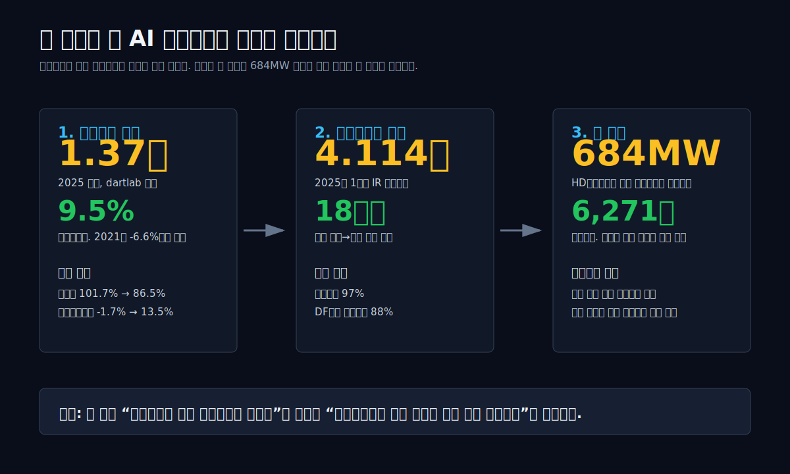
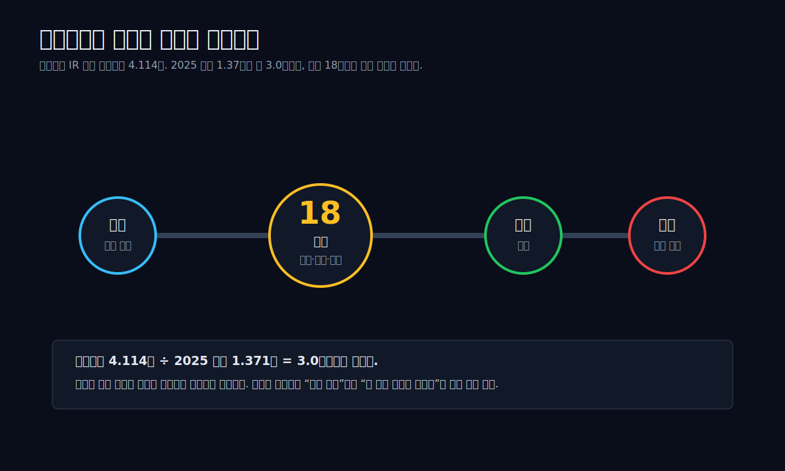
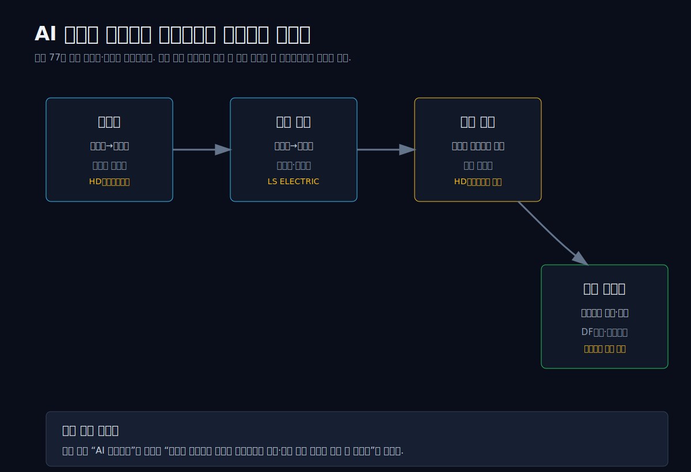
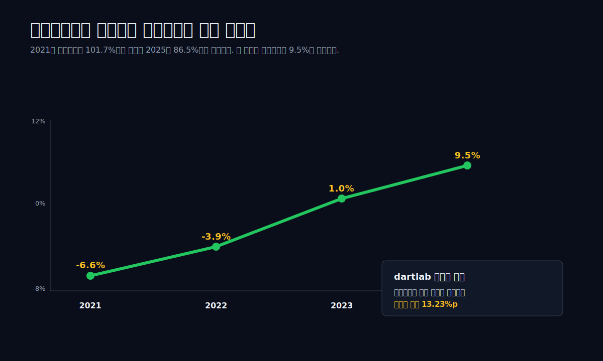
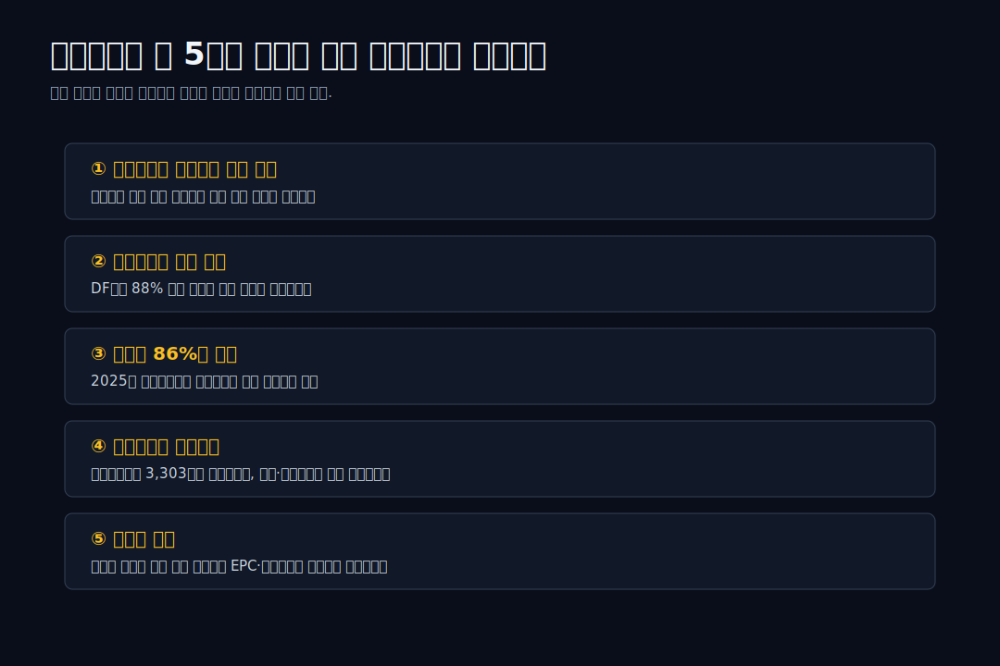
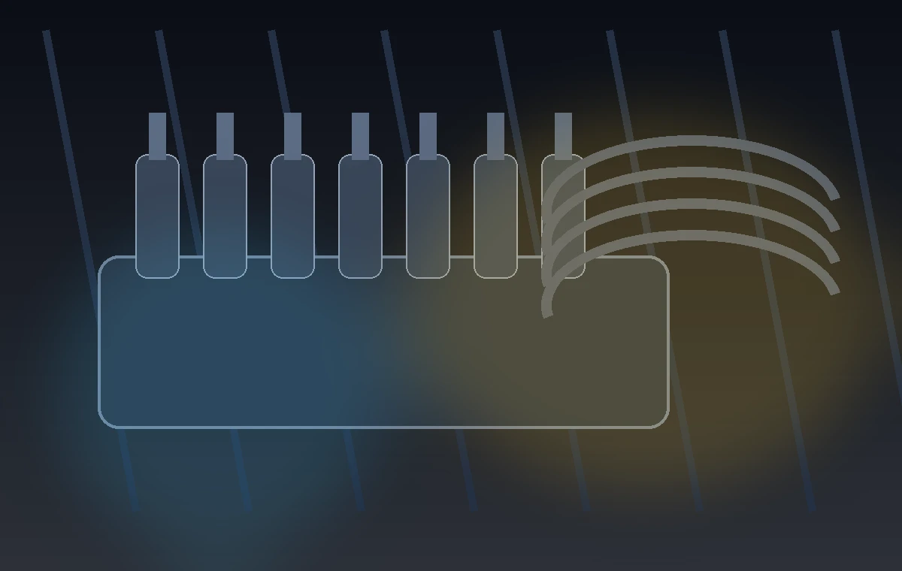
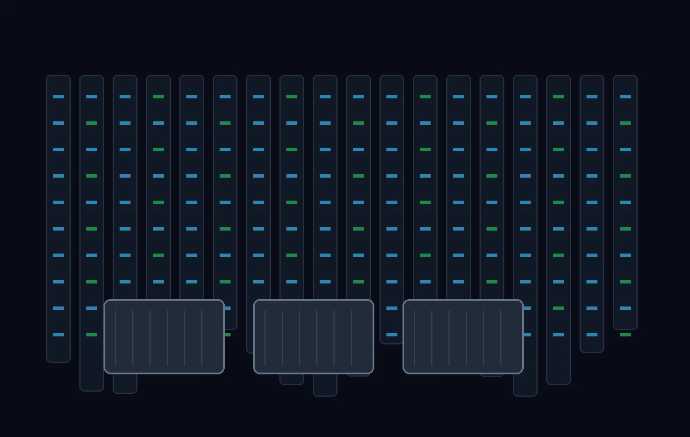

<script>
	import CompanyFinancials from '$lib/components/blog/CompanyFinancials.svelte';
import ComboChart from '$lib/components/blog/ComboChart.svelte';
import BarChart from '$lib/components/blog/BarChart.svelte';
import HFDataLink from '$lib/components/blog/HFDataLink.svelte';
</script>

> **턴어라운드** | 선박엔진 · 발전엔진 | 2026-04-29 dartlab 실측  
> 같은 시리즈: [한화오션](/blog/042660-hanwha-ocean) · [HD한국조선해양](/blog/009540-hd-ksoe) · [HD현대일렉트릭](/blog/267260-hd-hyundai-electric) · [전력기기 4사 비교](/blog/power-equipment-supercycle)

<HFDataLink code="082740" />



한화엔진(082740)을 데이터센터 회사라고 부르면 아직 과장이다. 2026년 4월 29일 현재, 한화엔진 이름으로 확인되는 핵심 사업은 여전히 선박엔진이다. 2025년 1분기 IR에도 수주잔고의 **97%가 선박엔진**으로 표시된다. 그러니 이 글의 첫 문장은 기대가 아니라 경계로 시작해야 한다.

그런데 질문이 바뀌었다. 2026년 4월, HD현대중공업은 미국 에너지 인프라 개발사 Aperion Energy Group에 **684MW 규모 발전설비**를 공급하는 계약을 맺었다. 금액은 **6,271억원**. 데이터센터 전력 인프라용이고, 20MW급 HiMSEN 엔진 기반이다. 이 사건은 “AI 데이터센터 수혜주는 변압기 회사”라는 기존 문장을 한 칸 옆으로 밀었다. 전력망 접속이 늦고, GPU 클러스터는 빨리 켜야 한다면, 엔진 발전기도 데이터센터 공급망에 들어온다.

그래서 관통선은 이것이다.

> **한화엔진은 아직 선박엔진 회사인데, 왜 AI 데이터센터 전력원 이야기 안으로 들어오기 시작했나.**

답은 둘로 나뉜다. 현재 숫자는 선박엔진 턴어라운드가 만들었다. 미래 질문은 발전엔진 시장이 만들었다. 이 둘을 섞으면 거짓말이 되고, 분리해서 보면 흥미로운 장부가 된다.

---

## 1막 — 먼저 착시를 걷어낸다: 한화엔진은 아직 데이터센터 수주 회사가 아니다

가장 위험한 문장은 “한화엔진, AI 데이터센터 수혜”다. 이 문장은 맞을 수도 있고 틀릴 수도 있는데, 현재 공시만 놓고는 중간에 있어야 한다. 한화엔진의 2025년 1분기 IR은 회사의 수주잔고를 **4.114조원**으로 제시한다. 그런데 그 안의 대부분은 데이터센터가 아니다. 선박엔진이다.

한화엔진의 IR 자료에서 확인되는 문장은 세 가지다. 수주잔고는 4.114조원. 선박엔진 비중은 97%. 2025년 1분기 신규 수주에서 DF엔진(Dual-Fuel Engine, 이중연료 엔진) 비중은 88%. 평균 수주-매출 전환 기간은 18개월. 이 숫자는 강하다. 하지만 강한 이유는 데이터센터가 아니라 **고부가 선박엔진 수주가 쌓여 있기 때문**이다.



여기서 첫 번째 판단이 나온다. 한화엔진을 읽을 때 “AI 데이터센터”를 제목에 넣을 수는 있다. 하지만 본문 첫 장에는 “직접 수주 미확인”을 반드시 써야 한다. 지금 확인되는 실적 개선은 선박엔진의 가격과 믹스, 조선업 호황, DF엔진 비중 상승이 만든 것이다.

그런데도 이 글이 데이터센터로 가는 이유가 있다. 바로 옆 산업에서 사건이 터졌기 때문이다. HD현대중공업의 684MW 계약은 한화엔진의 직접 수주가 아니다. 하지만 **한국 조선 엔진 기술이 데이터센터 전력 인프라로 이동할 수 있음을 보여준 첫 대형 사례**다. 한화엔진은 같은 질문을 받게 된다. “너희 엔진도 배 밖으로 나갈 수 있나?”

이 질문이 2막을 만든다.

## 2막 — 684MW 계약: 데이터센터가 왜 엔진을 찾았나

데이터센터는 전기를 많이 먹는다는 말만으로는 부족하다. 진짜 병목은 “전기를 언제 받을 수 있느냐”다. 하이퍼스케일 데이터센터는 토지, 서버, 냉각, 변압기, 송전망, 전력구매계약이 동시에 맞아야 한다. GPU 서버는 주문하면 들어오는데, 송전망 보강은 몇 년씩 걸릴 수 있다. 이 시간차가 엔진 발전기의 자리를 만든다.

HD현대중공업의 미국 계약은 이 시간차를 보여준다. 보도에 따르면 20MW급 HiMSEN 엔진 기반 발전설비를 미국 데이터센터 전력 인프라에 공급하고, 총 용량은 684MW, 금액은 6,271억원이다. 684MW는 단순 백업 발전기 몇 대의 숫자가 아니다. 중형 발전소급 전력이다. 데이터센터가 전력망 접속만 기다리지 않고, 현장 발전이라는 선택지를 계약으로 만들고 있다는 뜻이다.

기존 [전력기기 4사 비교](/blog/power-equipment-supercycle)는 변압기와 배전반의 마진 차이를 다뤘다. 그 글의 중심 질문은 “같은 AI 전력 수요인데 왜 HD현대일렉트릭과 LS ELECTRIC의 영업이익률이 다른가”였다. 이번 글은 다르다. 변압기 뒤에 또 하나의 질문이 생겼다.

**전력망이 늦으면, 데이터센터는 무엇으로 시간을 사는가.**

그 답 중 하나가 엔진 발전기다. 특히 20MW급 중속엔진은 단일 장비 크기가 크고, 여러 대를 묶어 수백 MW 단위로 구성할 수 있다. LNG, 디젤, 이중연료 기술이 붙으면 연료 선택지도 넓어진다. 데이터센터 입장에서는 “완벽한 장기 전력원”이라기보다 “전력망과 GPU 도입 일정 사이의 시간차를 메우는 장비”가 된다.



한화엔진의 직접 수주가 아직 없더라도 이 사건이 중요한 이유가 여기에 있다. 한국 조선 엔진사가 만든 중속엔진이 데이터센터 시장에서 계약 언어로 등장했다. 그러면 투자자는 한화엔진의 수주잔고를 다시 본다. “선박엔진 97%”는 약점이 아니라 출발점이다. 배에 들어가던 엔진 기술이 육상 발전 프로젝트로 넘어갈 수 있는지 보는 것이다.

물론 이 연결은 아직 가설이다. 그래서 3막에서는 데이터센터가 아니라 한화엔진의 실제 재무제표로 돌아가야 한다.

## 3막 — 2025년 숫자: 한화엔진은 이미 본업에서 돌아섰다

한화엔진의 2025년 실적은 데이터센터 없이도 흥미롭다. dartlab 기준 2025년 매출은 **1조 3,710억원**, 영업이익률은 **9.5%**다. 2021년 영업이익률은 -6.6%, 2022년 -3.9%, 2023년 1.0%였다. 적자 회사가 흑자 회사로 바뀌었다.

```python
import dartlab
c = dartlab.Company("082740")
c.analysis("financial", "수익성")["marginWaterfall"]["history"][0]
```

| 항목 (한화엔진, 1년치) | 2025 | 2022 | 2021 |
|---|---:|---:|---:|
| 매출액 | **1.371조** | 0.764조 | 0.599조 |
| 매출원가 | 1.186조 | 0.762조 | 0.609조 |
| 매출총이익 | **1,855억** | 23억 | -101억 |
| 매출총이익률 | **13.5%** | 0.3% | -1.7% |
| 영업이익률 | **9.5%** | -3.9% | -6.6% |

이 표의 핵심은 매출이 아니다. 원가율이다. 2021년 한화엔진은 100원을 팔면 매출원가가 101.7원이었다. 팔수록 손해가 나는 구간이었다. 2025년에는 매출원가율이 86.5%로 내려왔다. 판관비율은 4%대라서 회사의 운명을 갈랐던 것은 영업 조직 비용이 아니라 제품 원가와 단가였다.



dartlab의 수익성 분해도 같은 방향을 가리킨다. 2025년 영업이익률 개선 기여에서 가장 큰 항목은 **원가율 개선 13.23%p**다. 매출 레버리지와 판관비 효율도 있지만, 주된 힘은 제품 믹스와 가격이다. 이 말은 한화엔진이 단순히 더 많이 팔아서 좋아진 것이 아니라, **더 나은 조건의 엔진을 팔기 시작했다**는 뜻에 가깝다.

이 대목에서 DF엔진 88%가 중요해진다. DF엔진은 LNG 등 두 가지 연료를 쓸 수 있는 이중연료 엔진이다. 선박 발주 시장이 환경규제와 연료 전환을 반영하면, 엔진도 단순 디젤에서 고부가 제품으로 이동한다. 한화엔진의 신규수주에서 DF엔진 비중이 높다는 것은 단순 물량보다 믹스가 좋아졌다는 신호다.

따라서 한화엔진의 첫 번째 투자 포인트는 데이터센터가 아니다. **고부가 선박엔진 수주가 2025~2026년 손익계산서로 얼마나 높은 마진으로 풀리느냐**다. 이 본업이 확인되지 않으면 데이터센터 옵션도 힘을 잃는다.

## 4막 — 수주잔고 4.114조: 좋아 보이는 숫자일수록 천천히 읽어야 한다

수주잔고 4.114조원은 한화엔진의 2025년 매출 1.371조원의 약 3.0배다. 이 숫자만 보면 “이미 3년치 매출이 확보됐다”고 쓰고 싶어진다. 하지만 조선 기자재 회사에서 수주잔고는 매출이 아니라 시간표다. 주문을 받았고, 설계와 제작과 검사를 거쳐, 선박 건조 일정에 맞춰 납품되어야 매출이 된다.

한화엔진 IR은 평균 수주-매출 전환 기간을 18개월로 제시한다. 그래서 수주잔고를 볼 때는 세 가지를 분리해야 한다. 첫째, 잔고 총액. 둘째, 제품 믹스. 셋째, 전환 기간과 원가율. 잔고가 커도 저가 수주면 마진이 낮다. 잔고가 좋아도 원재료와 외주비가 먼저 오르면 현금흐름이 흔들릴 수 있다.

```python
c.analysis("financial", "현금흐름")["cashQuality"]["history"][0]
```

| 항목 (한화엔진, 2025) | 수치 |
|---|---:|
| 영업현금흐름 | **3,303억원** |
| 영업현금흐름률 | **24.1%** |
| 현금성자산 | **2,767억원** |
| 총차입금 | **839억원** |
| 순차입금 | **-1,928억원** |

2025년 현금흐름은 좋다. 영업현금흐름 3,303억원, 현금성자산 2,767억원, 총차입금 839억원이면 순현금 상태다. 하지만 동시에 부채비율은 204.9%다. 조선 기자재 회사의 부채에는 선수금, 매입채무, 프로젝트 관련 부채가 섞인다. 그래서 “부채비율 205% = 당장 위험”도 단순하고, “순현금이니 문제 없음”도 단순하다.

핵심은 운전자본이다. 수주가 늘면 선수금이 들어오지만, 제작 과정에서 재고와 외주비도 늘어난다. 매출 인식 전까지 장부가 먼저 커진다. 2025년 자산은 1.696조원으로 2024년 대비 51.2% 늘었다. 성장이 장부를 키우고 있다. 좋은 성장인지 부담스러운 성장인지는 다음 분기 원가율과 영업현금흐름이 같이 말해준다.

그래서 한화엔진의 수주잔고는 “안전마진”보다 “검증해야 할 파이프라인”이다. 2025년까지는 원가율 개선으로 답이 나왔다. 2026년에도 DF엔진 비중과 마진이 유지되면 본업 사이클은 이어진다. 여기서 5막의 질문이 나온다. 이 파이프라인이 선박 밖으로도 갈 수 있나.

## 5막 — 한화오션과 한화엔진: 그룹 안의 해석도 바뀐다

한화엔진을 한화오션과 떼어놓고 보면 반쪽이다. 한화그룹은 2024년 한화엔진을 편입했고, 한화오션은 LNG선, 특수선, 해양 방산, 친환경 선박 쪽으로 수주 포트폴리오를 확장하고 있다. 선박 발주가 고부가로 이동하면 엔진도 같이 바뀐다. 엔진은 선박의 심장이고, 연료 전환은 엔진 사양을 바꾼다.

이 연결은 두 방향이다. 첫째, 조선소가 고부가 선박을 수주하면 엔진 공급망의 단가와 믹스가 좋아진다. 둘째, 엔진 회사가 DF·친환경 엔진 기술을 확보하면 조선소의 선박 제안력도 좋아진다. 그룹 내 조선-엔진 수직 연결은 단순 내부거래가 아니라, 연료 전환 시대의 제품 패키지에 가깝다.

다만 여기서도 과장은 금물이다. 한화엔진의 수주잔고 97%가 선박엔진이라는 사실은 여전히 중요하다. 한화오션과의 연결은 “데이터센터로 당장 간다”가 아니라 “본업 선박엔진의 고부가 사이클을 설명하는 배경”이다. 한화엔진의 현재 가치는 이 배경 위에 있다.

그런데 데이터센터 발전엔진이 붙으면 질문이 달라진다. 선박엔진은 조선소와 선주가 고객이다. 발전엔진은 에너지 인프라 개발사, EPC, 데이터센터 운영자, 전력 구매 구조가 고객이다. 판매 조직도, 보증 리스크도, 서비스 계약도 다르다. 한화엔진이 이 시장으로 들어간다면 단순 제품 판매가 아니라 사업 모델 일부가 달라진다.

이 차이를 알아야 한다. 선박엔진 수주는 조선업 사이클에 묶인다. 데이터센터 발전엔진 수주는 AI 인프라와 전력망 병목에 묶인다. 같은 엔진이라도 최종 수요의 사이클이 다르다. 한화엔진의 재평가는 이 두 사이클이 겹칠 때 시작된다.

## 6막 — 반대편 증거: 데이터센터 옵션은 아직 숫자가 아니다

여기서 일부러 브레이크를 밟아야 한다. 한화엔진이 데이터센터 발전엔진을 직접 수주했다는 공식 공시는 아직 확인하지 못했다. dartlab story thesis도 같은 결론을 냈다. 재무적 잠재력은 일부 지지하지만, “선박엔진 수주잔고가 데이터센터 발전엔진으로 확장되고 있다”는 직접 공시 증거는 부족하다는 판정이다.

```python
c.story(
    type="thesis",
    template="성장",
    hypothesis="선박엔진 수주잔고가 데이터센터 발전엔진으로 확장되면 한화엔진의 성장 사이클은 연장된다"
)
```

요약하면 이렇다. 한화엔진은 전환기 회사다. 2025년 실적은 좋아졌다. 수주잔고와 DF엔진 비중도 좋다. 그러나 데이터센터 발전엔진 수주가 실제로 찍히기 전까지, 데이터센터는 본업 실적이 아니라 **옵션**이다.

옵션이라는 말은 가볍게 쓰는 말이 아니다. 옵션은 가치가 있을 수 있다. 그러나 기초자산이 있어야 한다. 한화엔진의 기초자산은 선박엔진 수주잔고, DF엔진 기술, 조선업 고부가 사이클, 원가율 개선이다. 이 네 가지가 흔들리면 데이터센터 옵션도 설득력을 잃는다.

그래서 투자자는 HD현대중공업의 684MW 계약을 한화엔진 매출로 가져오면 안 된다. 대신 “데이터센터 발전설비 시장이 엔진 회사를 부르기 시작했다”는 산업 신호로 읽어야 한다. 한화엔진이 그 시장에 직접 들어오는지, 들어온다면 어떤 고객과 어떤 사양으로 들어오는지, 이것이 다음 관찰 포인트다.

## 7막 — 과거~현재 패턴: 한화엔진의 사이클은 가격보다 믹스다

한화엔진의 과거 8년을 보면 매출이 계속 우상향한 회사는 아니다. 2017년 매출 7,689억원, 2018년 5,113억원, 2020년 8,300억원, 2021년 5,990억원, 2025년 1.371조원이다. 출렁임이 크다. 조선 기자재는 선박 발주와 납기, 선종 믹스, 원자재 비용의 영향을 동시에 받기 때문이다.

<ComboChart
  title="한화엔진 매출과 영업이익률"
  unit="조원 / %"
  barKeys={["매출(조원)"]}
  barColors={["#38bdf8"]}
  lineKeys={["영업이익률"]}
  lineColors={["#fbbf24"]}
  data={[
    { year: "2021", "매출(조원)": 0.60, "영업이익률": -6.6 },
    { year: "2022", "매출(조원)": 0.76, "영업이익률": -3.9 },
    { year: "2023", "매출(조원)": 0.85, "영업이익률": 1.0 },
    { year: "2025", "매출(조원)": 1.37, "영업이익률": 9.5 }
  ]}
/>

이번 사이클의 특징은 매출보다 마진 회복이 더 선명하다는 점이다. 2021년에는 매출원가율이 100%를 넘었다. 2025년에는 매출총이익률이 13.5%로 올라왔다. 이 차이는 저가 수주가 빠지고 고부가 엔진이 들어오는 시차와 맞물린다. 조선업에서는 몇 년 전 받은 수주가 뒤늦게 손익계산서에 나타난다. 그래서 2025년 실적은 2025년에 갑자기 좋아진 것이 아니라, 2022~2024년 수주 가격과 믹스가 뒤늦게 나타난 결과로 봐야 한다.

산업 패턴도 비슷하다. HD현대중공업은 2021년 영업이익률 -9.6%에서 2025년 11.6%로 회복했다. 한화오션도 2021년 -39.1%에서 2025년 9.1%로 올라왔다. 조선 본체가 적자선에서 고부가 수주로 이동하자 엔진과 기자재도 같이 살아났다. 한화엔진의 턴어라운드는 독립 사건이 아니라 조선 사이클의 후행 반영이다.

그런데 데이터센터 발전엔진은 이 패턴을 바꿀 수 있다. 조선 수주와 다른 고객군이 붙으면 한화엔진의 사이클 민감도가 달라진다. 이것이 아직 실적이 아니라 옵션인 이유다. 옵션이 현실이 되려면 공시가 필요하다. 계약 상대, 용량, 금액, 납기, 엔진 사양이 나와야 한다.

## 8막 — 투자 포인트: 이 회사는 “기대”가 아니라 “확인 순서”로 봐야 한다

한화엔진의 투자 포인트는 다섯 개다.



첫째, **데이터센터 발전엔진 직접 수주**다. 한화엔진 또는 고객사 공시에서 데이터센터 발전설비, 엔진 발전기, 전력 인프라 프로젝트가 구체적으로 확인되어야 한다. 이 전까지 데이터센터는 제목이 아니라 관찰 항목이다.

둘째, **DF엔진 비중**이다. 2025년 1분기 신규수주 DF엔진 88%는 좋은 숫자다. 이 비중이 유지되면 선박엔진 본업의 마진 방어력이 커진다. 반대로 저가 물량이 다시 늘면 2025년 영업이익률 9.5%를 그대로 연장하기 어렵다.



셋째, **원가율 86%대 유지**다. 2025년 턴어라운드의 거의 전부가 원가율 개선에서 나왔다. 다음 분기와 다음 연도에 원가율이 다시 90%대로 올라가면 “수주잔고는 좋은데 마진이 안 남는” 장부가 된다.

넷째, **영업현금흐름**이다. 2025년 영업현금흐름 3,303억원은 강하다. 하지만 수주가 늘수록 재고와 매출채권도 먼저 움직인다. 현금흐름이 이익보다 뒤처지기 시작하면 성장의 질을 다시 봐야 한다.



다섯째, **고객 확장**이다. 조선소와 선주 중심의 고객 구조가 에너지 인프라 개발사, EPC, 데이터센터 운영자 쪽으로 넓어지는가. 이 지점이 확인되어야 데이터센터 옵션이 숫자가 된다.

닫는 판단은 조심스럽지만 분명하다. 한화엔진은 “이미 데이터센터 수혜주”가 아니다. 그러나 “데이터센터 전력 병목이 엔진 회사의 주소록까지 넓혔다”는 산업 변화 안에는 들어왔다. 2025년 실적 개선은 본업이 만들었고, 2026년 이후의 새 질문은 발전엔진 시장이 만들었다. 이 둘을 분리해서 볼 때 한화엔진의 장부는 가장 선명해진다.

---

## 검증표

| 검증 항목 | 수치 / 사실 | 기준 | 출처 |
|---|---:|---|---|
| 한화엔진 매출 | 1.371조원 | 2025년 1년치 | dartlab `Company("082740").analysis("financial", "수익성")` |
| 한화엔진 영업이익률 | 9.5% | 2025년 1년치 | dartlab 수익성 |
| 매출총이익률 | 13.5% | 2025년 1년치 | dartlab 수익성 |
| 2021년 영업이익률 | -6.6% | 2021년 1년치 | dartlab timeline |
| 영업현금흐름 | 3,303억원 | 2025년 1년치 | dartlab 현금흐름 |
| 현금성자산 | 2,767억원 | 2025년 말 | dartlab 안정성 |
| 총차입금 | 839억원 | 2025년 말 | dartlab 안정성 |
| 순차입금 | -1,928억원 | 2025년 말 | dartlab 안정성 |
| 부채비율 | 204.9% | 2025년 말 | dartlab 안정성 |
| 수주잔고 | 4.114조원 | 2025년 1분기 | 한화엔진 IR Book 1Q25 |
| 선박엔진 비중 | 97% | 수주잔고 기준 | 한화엔진 IR Book 1Q25 |
| DF엔진 신규수주 비중 | 88% | 2025년 1분기 신규수주 | 한화엔진 IR Book 1Q25 |
| 평균 수주-매출 전환 | 18개월 | 회사 IR 설명 | 한화엔진 IR Book 1Q25 |
| HD현대중공업 데이터센터 발전설비 | 684MW / 6,271억원 | 2026년 4월 계약 | Korea JoongAng Daily, DCD, 아주경제 보도 |
| 한화엔진 데이터센터 직접 수주 | 미확인 | 2026-04-29 현재 | 공시·IR 확인 기준 |

## 공시 / Filings

- 한화엔진 IR Book 1Q25: [Investor Relations PDF](https://www.hanwha-engine.com/templates/com/download/pdf/invest/ir/IR%20Book_1Q25_eg.pdf)
- DART 전자공시 한화엔진(082740) 정기보고서 검색: [DART](https://dart.fss.or.kr/)
- 한화엔진 공식 IR 자료실: [Hanwha Engine IR](https://www.hanwha-engine.com/)
- Korea JoongAng Daily, 2026-04-24: [From factories to data centers: Korea's heavy industries pivot to meet surging AI demand](https://koreajoongangdaily.joins.com/news/2026-04-24/business/industry/From-factories-to-data-centers-Koreas-heavy-industries-pivot-to-meet-surging-AI-demand-/2575538)
- Data Center Dynamics, 2026-04-23: [Hyundai Heavy Industries inks 684MW natural gas turbine supply deal with Aperion](https://www.datacenterdynamics.com/en/news/hyundai-heavy-industries-inks-684mw-natural-gas-turbine-supply-deal-with-aperion-to-power-us-data-center-market/)
- 아주경제, 2026-04-22: [HD현대重, 美 데이터센터에 6271억 규모 발전설비 공급](https://www.ajunews.com/amp/20260422112102463)

## 재무제표 — 최근 5개년

| 항목 (한화엔진, 1년치) | 2025 | 2024 | 2023 | 2022 | 2021 |
|---|---:|---:|---:|---:|---:|
| 매출액 | 1.371조 | — | 0.854조 | 0.764조 | 0.599조 |
| 영업이익률 | 9.5% | — | 1.0% | -3.9% | -6.6% |
| 총자산 | 1.696조 | 1.122조 | 1.137조 | 0.956조 | 0.796조 |
| 자기자본 | 0.556조 | 0.353조 | 0.224조 | 0.222조 | 0.209조 |
| 부채비율 | 204.9% | 218.1% | 407.2% | 331.5% | 280.5% |
| 영업현금흐름 | 0.330조 | — | 0.070조 | -0.021조 | -0.046조 |

`—` 표시는 로컬 timeline 또는 분석 출력에서 해당 연도 손익 항목이 비어 있어 본문 수치로 사용하지 않은 값이다. 이 글의 핵심 판단은 2025년 실측과 2021~2023년 비교 가능 항목을 기준으로 했다.

---

<CompanyFinancials code="082740" />
