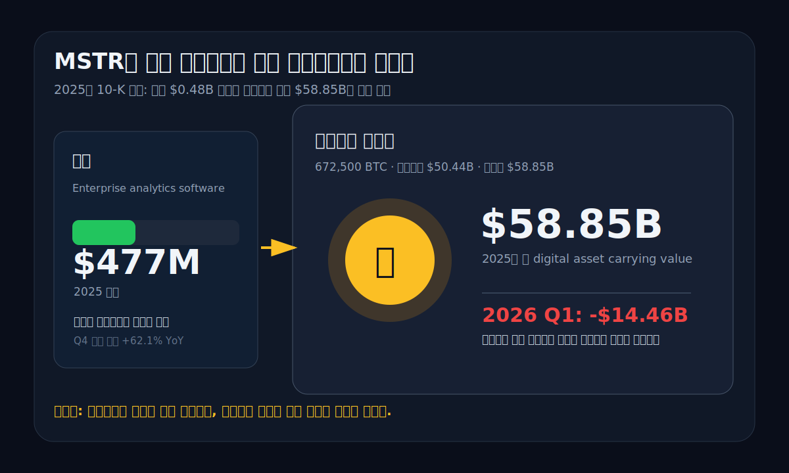
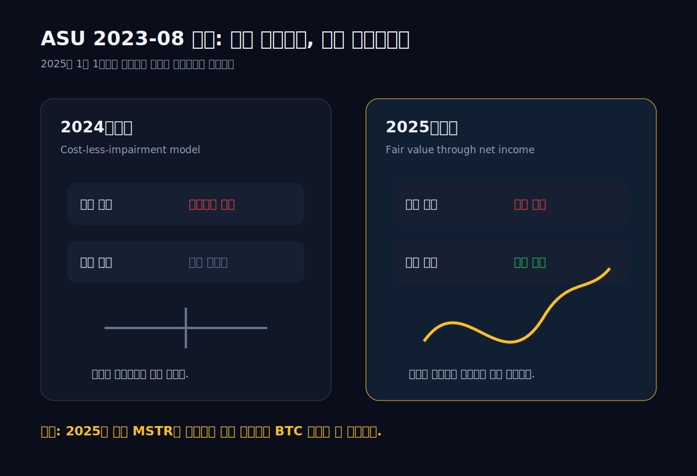
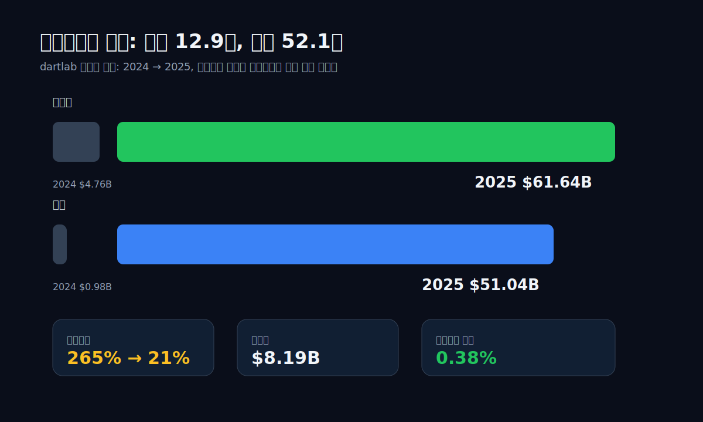
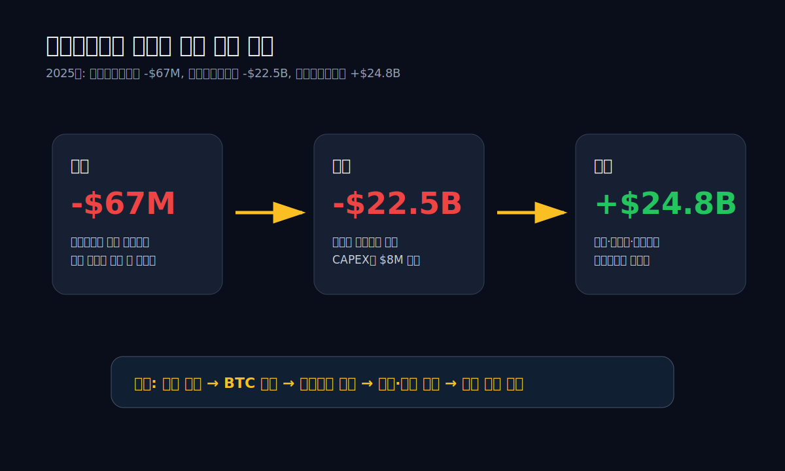
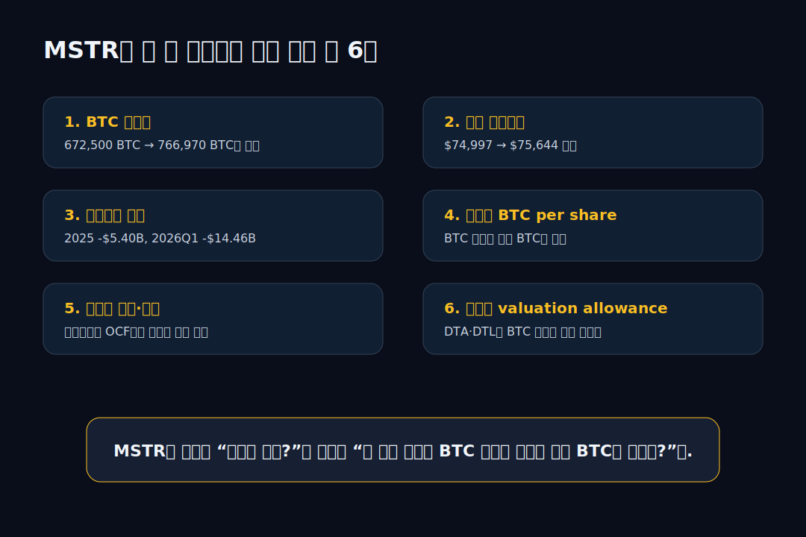

<script>
import ComboChart from '$lib/components/blog/ComboChart.svelte';
import HFDataLink from '$lib/components/blog/HFDataLink.svelte';
</script>

<HFDataLink code="MSTR" kind="edgar" />

> **자본집약** | 미국 Bitcoin Treasury · NASDAQ | 2026-04-29 dartlab 실측 + SEC EDGAR 원문



Strategy Inc, 예전 이름 MicroStrategy. 티커는 **MSTR**. 겉으로 보면 기업용 분석 소프트웨어 회사다. 2025년 매출은 **$477.2M**. 매출총이익률은 **68.7%**. 구독 매출은 빠르게 자라고, 제품 지원 매출은 줄고, 라이선스 회사에서 클라우드 구독 회사로 넘어가는 전형적인 소프트웨어 전환 그림이 있다.

그런데 이 회사의 2025년 10-K를 열면 소프트웨어 회사의 재무제표가 아니다. 2025년 말 Strategy는 **672,500 BTC**를 들고 있었다. 취득원가는 **$50.44B**, 장부가는 **$58.85B**. 평균 취득원가는 **BTC당 $74,997**. 회사 전체 자산은 **$61.64B**인데, 그 대부분이 비트코인이다.

그래서 MSTR의 질문은 "소프트웨어 매출이 얼마나 늘었나"에서 끝나지 않는다. 진짜 질문은 이거다.

**매출 $0.48B 회사가 왜 $58.85B 비트코인 장부를 들고 있고, 왜 분기 손익은 $10B 단위로 뒤집히는가?**

답은 회계와 자본조달에 있다. 2025년 1월 1일부터 Strategy는 **ASU 2023-08**을 적용했다. 비트코인을 원가에서 손상만 잡던 과거 방식이 아니라, 보고기간 말 공정가치로 재측정하고 그 변동을 순손익에 넣는다. 비트코인 가격이 오르면 손익계산서에 이익이 찍히고, 내리면 손실이 찍힌다.

이 규칙 하나가 MSTR을 완전히 다른 회사로 바꿨다. 2025년 전체로는 디지털자산 공정가치 손실 **-$5.40B**가 들어갔다. 2026년 1분기에는 더 선명했다. 회사는 2026년 4월 6일 8-K에서 2026년 1분기 디지털자산 미실현손실 **-$14.46B**, 관련 이연법인세효과 **$2.42B**, 2026년 3월 31일 기준 digital asset carrying value **$51.65B**를 공시했다.

이 글은 MSTR을 비트코인 찬반으로 보지 않는다. **재무제표의 형태가 바뀐 회사**로 본다. 손익계산서, 대차대조표, 현금흐름표가 각각 어떤 말을 하는지, EDGAR 원문과 dartlab 실측 숫자로 따라간다.

---

## 1막 — 2025년 1월 1일, 손익계산서의 문법이 바뀌었다



2024년까지 Strategy의 비트코인은 회계적으로 이상한 자산이었다. 가격이 떨어지면 손상차손을 잡았다. 그런데 가격이 다시 올라가도 팔기 전까지는 이익을 잡지 못했다. 손익계산서가 아래쪽으로만 열려 있었다. 그래서 비트코인이 장기적으로 올라도 장부에는 과거 저점의 상처가 오래 남았다.

2025년부터는 다르다. **ASU 2023-08**은 특정 암호자산을 공정가치로 측정하고, 변동분을 순손익에 반영하게 한다. Strategy 2025년 10-K는 이 변화를 노골적으로 설명한다. 공정가치가 오르면 이익, 내리면 손실. 더 이상 손상차손만 보는 회사가 아니다.

이 변화가 중요한 이유는 규모 때문이다. 소프트웨어 회사가 비트코인을 조금 들고 있으면 회계 주석이다. Strategy는 다르다. 비트코인 장부가가 연간 매출의 **123배**다. 매출 $477M 회사가 장부가 $58.85B 자산을 들고 있다. 손익계산서에서 소프트웨어 매출 증감은 작은 파도이고, 비트코인 공정가치 변동은 조수다.

2025년 숫자를 보면 바로 감이 온다.

| 항목 | 2025년 값 | 읽는 법 |
| :--- | ---: | :--- |
| 매출 | $477.2M | 소프트웨어 본업 규모 |
| 매출총이익 | $327.8M | 매출총이익률 68.7% |
| 영업현금흐름 | -$67.2M | 본업 현금은 아직 압박 |
| 디지털자산 공정가치 손실 | -$5.40B | 본업보다 11배 큰 손익 항목 |
| 비트코인 장부가 | $58.85B | 총자산의 대부분 |

한 문장으로 줄이면 이렇다. **MSTR의 손익계산서는 더 이상 제품 판매표가 아니라, 비트코인 종가표가 붙은 재무제표다.**

여기서 첫 번째 함정이 생긴다. "2025년 순손실이 크다"만 보면 회사가 망가진 것처럼 보이고, "비트코인 장부가가 크다"만 보면 자산이 엄청난 것처럼 보인다. 둘 다 반쪽이다. 공정가치 회계에서는 같은 비트코인이 손익과 자본을 동시에 흔든다. 손실은 현금 유출이 아닐 수 있지만, 자본시장 접근성과 담보력에는 바로 영향을 준다.

Strategy는 이 회계 전환을 적극적으로 받아들였다. 회사 스스로를 "Bitcoin Treasury Company"라고 부른다. 소프트웨어 회사가 비트코인을 보유한 것이 아니라, 비트코인 재무부가 소프트웨어 사업을 같이 들고 있는 구조에 가깝다.

---

## 2막 — 본업은 살아 있지만, 주인공은 아니다

Strategy의 소프트웨어 사업은 죽은 사업이 아니다. 2025년 매출은 **$477.2M**으로 전년 대비 **+3.0%**. 매출총이익률은 **68.7%**. 2026년 2월 5일 Q4 발표에서 회사는 2025년 4분기 총매출 **$123.0M**, 구독서비스 매출 **$51.8M**, 구독서비스 YoY **+62.1%**를 제시했다.

구독 매출이 늘고 있다는 건 중요하다. 기존 라이선스·제품지원형 소프트웨어 회사가 클라우드 구독형으로 바뀌는 과정에서는 전체 매출이 한동안 밋밋하게 보일 수 있다. 라이선스 일시 매출이 줄고, 구독 매출은 기간에 걸쳐 인식되기 때문이다. Strategy도 그 경로 위에 있다.

하지만 규모가 너무 작다. 2025년 매출총이익 **$327.8M**은 비트코인 공정가치 손실 **$5.40B**의 6% 수준이다. 2026년 1분기 미실현손실 **$14.46B**와 비교하면 2%대다. 그래서 본업은 "회사가 실제 제품을 파는가"를 확인하는 근거이지, 현재 MSTR의 분기 실적을 설명하는 주인공은 아니다.

```python
import dartlab
c = dartlab.Company("MSTR")
prof = c.analysis("financial", "수익성")
growth = c.analysis("financial", "성장성")
```

dartlab 수익성 분석은 이 간극을 숫자로 보여준다.

| 연도 | 매출 | 매출총이익률 | 순이익 |
| :--- | ---: | ---: | ---: |
| 2025 | $477.2M | 68.7% | dartlab 추출값 없음 |
| 2024 | $463.5M | 72.1% | -$652.4M |
| 2023 | $496.3M | n/a | $429.1M |
| 2022 | $499.3M | n/a | -$1.47B |
| 2021 | $510.8M | n/a | -$535.5M |

여기서 보이는 건 두 가지다.

첫째, 소프트웨어 매출은 장기적으로 크게 자라지 않았다. 2017~2025년 매출 CAGR은 dartlab 기준 **-0.7%**다. 구독 전환은 있지만, 전체 매출 규모는 5억 달러 안팎에 묶여 있다.

둘째, 순이익은 본업의 성장률과 무관하게 흔들렸다. 2023년 순이익이 흑자였고, 2024년은 적자, 2025년은 공정가치 회계 때문에 손익 해석 방식 자체가 바뀌었다. 이 회사의 순이익 시계열을 일반 소프트웨어 회사처럼 보면 틀린다.

<ComboChart data={[{year:"2025",매출액:477,영업CF:-67,FCF:-75},{year:"2024",매출액:463,영업CF:-53,FCF:-56},{year:"2023",매출액:496,영업CF:13,FCF:10},{year:"2022",매출액:499,영업CF:3,FCF:0},{year:"2021",매출액:511,영업CF:94,FCF:91}]} lineKeys={["매출액"]} barKeys={["영업CF","FCF"]} lineColors={["#22c55e"]} barColors={["#3b82f6","#ef4444"]} title="MSTR 본업 매출과 현금흐름" unit="$M" />

이 차트에서 중요한 건 매출선이 아니라 막대다. 영업현금흐름이 2025년 **-$67M**, FCF가 **-$75M**다. 소프트웨어 사업이 엄청난 현금기계라서 비트코인을 사는 구조가 아니다. 반대다. 자본시장에서 조달한 돈으로 비트코인을 사고, 소프트웨어 사업은 회사의 운영 플랫폼과 신용 서사의 일부로 남아 있다.

그래서 MSTR을 볼 때 "구독 매출이 좋다"는 말은 맞지만 부족하다. 구독 매출이 아무리 좋아도 2025년 말 비트코인 장부가 $58.85B를 설명하지 못한다. 본업은 회사의 이름표를 유지하지만, 장부의 무게중심은 이미 넘어갔다.

---

## 3막 — 대차대조표가 1년 만에 다른 회사가 됐다



2024년 말 Strategy의 총자산은 **$4.76B**였다. 자기자본은 **$979M**. 부채비율은 **265%**. 이때도 이미 비트코인 회사였지만, 장부는 아직 과거 회계의 흔적을 갖고 있었다.

2025년 말에는 완전히 다르다. 총자산 **$61.64B**, 자기자본 **$51.04B**, 총부채 **$10.60B**. 부채비율은 **20.8%**로 내려간다. 언뜻 보면 재무구조가 엄청나게 좋아진 것처럼 보인다.

하지만 이 개선을 일반 제조업의 "벌어서 갚았다"로 읽으면 안 된다. 핵심은 두 가지다.

첫째, 공정가치 회계 도입으로 과거 누적손상이 자본에 되돌아왔다. Strategy 10-K의 디지털자산 표는 2025년 1월 1일 ASU 2023-08 도입 효과로 누적손상 **$4.06B**가 제거되고, 장부가가 **$17.88B** 증가했다고 보여준다.

둘째, 회사가 2025년에도 비트코인을 대량 매입했다. 2025년 디지털자산 구매는 **$22.47B**, 추가 BTC는 **225,030개**. 그래서 2024년 말 447,470 BTC에서 2025년 말 672,500 BTC로 늘었다.

```python
stab = c.analysis("financial", "안정성")
```

dartlab 안정성 분석은 이 변화를 이렇게 잡는다.

| 항목 | 2024 | 2025 | 변화 |
| :--- | ---: | ---: | :--- |
| 총자산 | $4.76B | $61.64B | 12.9배 |
| 자기자본 | $0.98B | $51.04B | 52.1배 |
| 총부채 | $2.60B | $10.60B | 4.1배 |
| 현금 | $46.8M | $2.30B | 49.2배 |
| 총차입 | $2.18B | $8.19B | 3.8배 |
| 순차입 | $2.14B | $5.89B | 2.8배 |
| 부채비율 | 265.3% | 20.8% | 급락 |

이 표가 MSTR의 착시를 만든다. 부채비율만 보면 좋아졌다. 하지만 부채비율의 분모인 자본이 비트코인 공정가치와 자본발행으로 커졌다. 비트코인 가격이 크게 내려가면 자본은 다시 줄 수 있다.

2026년 4월 6일 8-K가 바로 그 되감기 장면이다. 2026년 3월 31일 기준, 회사는 비트코인 취득원가가 공정가치를 넘어섰다고 밝혔다. 디지털자산 장부가는 **$51.65B**로 내려왔고, 공정가치 손실 때문에 이연법인세자산 **$1.73B**와 같은 금액의 valuation allowance를 설정했다.

즉 2025년 대차대조표의 개선은 실체가 없다는 뜻이 아니다. 실제 BTC가 있고, 실제 자본조달이 있었다. 다만 그 개선은 **가격 민감한 자본**이다. 제조업의 축적 이익잉여금과 다르고, 은행의 규제자본과도 다르다. MSTR의 자본은 비트코인 가격표와 같이 움직인다.

---

## 4막 — 현금흐름표는 더 솔직하다



손익계산서는 공정가치 때문에 흔들리고, 대차대조표는 공정가치 때문에 커진다. 그럼 실제 현금은 어디서 왔나. 답은 현금흐름표다.

2025년 Strategy의 영업현금흐름은 **-$67.2M**. 투자현금흐름은 **-$22.51B**. 재무현금흐름은 **+$24.84B**. 이 숫자를 한 줄로 읽으면 이렇다.

**영업으로 번 돈이 아니라 자본시장에서 조달한 돈으로 비트코인을 샀다.**

이건 비난이 아니라 구조 설명이다. Strategy는 자기 모델을 숨기지 않는다. 회사는 ATM 주식발행, 전환사채, 우선주, Digital Credit 구조를 활용해 자본을 조달하고, 그 돈으로 BTC를 산다. 자본조달 비용보다 BTC 축적과 주당 BTC 증가가 더 가치 있다고 보는 전략이다.

dartlab 현금흐름 분석도 같은 결론을 낸다.

| 연도 | 영업CF | 투자CF | 재무CF | FCF | 해석 |
| :--- | ---: | ---: | ---: | ---: | :--- |
| 2025 | -$67M | -$22.51B | +$24.84B | -$75M | 자본조달로 BTC 매입 |
| 2024 | -$53M | n/a | +$22.13B | -$56M | 조달 확대 |
| 2023 | +$13M | n/a | +$1.89B | +$10M | BTC 전략 지속 |
| 2022 | +$3M | -$279M | +$265M | n/a | 초기 축적 |
| 2021 | +$94M | -$2.63B | +$2.54B | +$91M | 대규모 전환 |

여기서 "위기형"이라는 자동 판정이 뜬다. 영업CF가 적자인데 외부 차입·발행으로 투자활동을 메우기 때문이다. 다만 전통적 의미의 부실기업과는 다르다. Strategy는 매출이 무너져서 자본조달을 하는 회사가 아니라, 자본조달 자체를 사업 모델의 엔진으로 삼는다.

그래서 MSTR을 분석할 때는 현금흐름표를 다음 순서로 봐야 한다.

1. 영업CF가 우선주 배당·이자·운영비를 얼마나 받쳐주는가.
2. 투자CF의 음수가 CAPEX인지, BTC 매입인지 구분한다.
3. 재무CF가 주식발행인지, 전환사채인지, 우선주인지 나눈다.
4. 조달비용이 올라갈 때도 같은 속도로 BTC를 살 수 있는지 본다.
5. BTC 가격 하락기에 조달 창구가 닫히는지 확인한다.

Strategy의 CAPEX는 2025년 **$8.2M** 수준이다. 유형자산 투자가 큰 회사가 아니다. 그런데 투자현금흐름은 -$22.5B다. 이 회사의 "투자"는 공장 건설이 아니라 비트코인 축적이다. 그래서 일반 자본집약 기업의 분석법을 그대로 적용하면 안 된다. 감가상각과 설비효율보다 중요한 건 **조달 단가, BTC 평균단가, 만기 구조, 주당 BTC**다.

---

## 5막 — 672,500 BTC라는 숫자의 안쪽


2025년 10-K의 디지털자산 표는 이 글의 중심 증거다.

| 항목 | 2024년 말 | 2025년 도입 직후 | 2025년 말 |
| :--- | ---: | ---: | ---: |
| BTC 보유량 | 447,470 | 447,470 | 672,500 |
| 취득원가 | $27.97B | $27.97B | $50.44B |
| 장부가 | $23.91B | $41.79B | $58.85B |
| 평균 취득원가 | $62,503 | $62,503 | $74,997 |
| 2025년 매입 BTC | - | - | 225,030 |
| 2025년 디지털자산 손실 | - | - | -$5.40B |

2025년에 Strategy는 평균 **BTC당 약 $99,840**에 225,030 BTC를 추가로 샀다. 그 결과 전체 평균 취득원가는 $62,503에서 $74,997로 올라갔다. 즉 2025년 매입은 장기 평균단가를 끌어올렸다.

이 대목이 중요하다. 보유량은 늘었다. 하지만 평균단가도 올라갔다. BTC 가격이 계속 오르면 이 전략은 강력하다. 주식·채권·우선주로 낮은 비용의 자본을 조달하고, BTC를 사서 주당 BTC를 늘리는 구조가 된다. 반대로 BTC 가격이 평균단가 아래로 내려가면 공정가치 손실, 이연법인세자산, valuation allowance, 자본시장 심리 악화가 한꺼번에 온다.

2026년 4월 6일 8-K는 이 위험을 실제로 보여줬다.

| 날짜 | BTC 보유량 | aggregate purchase price | 평균 취득원가 |
| :--- | ---: | ---: | ---: |
| 2026-03-31 | 762,099 BTC | $57.69B | $75,694 |
| 2026-04-05 | 766,970 BTC | $58.02B | $75,644 |

2025년 말 672,500 BTC에서 2026년 4월 5일 766,970 BTC로 더 늘었다. 보유량은 계속 증가했다. 그런데 2026년 1분기 손익은 **-$14.46B** 미실현손실이다. 이유는 단순하다. 보유량이 늘수록 BTC 가격 변동 1달러가 손익계산서에 미치는 금액도 커진다.

이 회사의 민감도를 거칠게 생각해보자. 766,970 BTC를 들고 있으면, 비트코인 가격이 **$10,000** 움직일 때 보유자산 공정가치는 약 **$7.67B** 움직인다. 이건 2025년 전체 매출의 16배다. 그래서 MSTR의 실적 발표에서 "매출이 컨센서스를 넘었나"보다 "분기말 BTC 가격이 얼마였나"가 더 크게 들린다.

---

## 6막 — Q4 2025의 -$12.6B 손실은 왜 나왔나

2026년 2월 5일 회사는 2025년 4분기 실적을 발표했다. 표면 숫자는 충격적이다. 2025년 4분기 순손실 **$12.4B**, 보통주 귀속 순손실 **$12.6B**. 전년 동기 순손실 $670.8M와 비교하면 완전히 다른 크기다.

그런데 같은 발표에서 소프트웨어 사업은 그렇게 무너진 게 아니다. 4분기 총매출은 **$123.0M**, YoY **+1.9%**. 구독서비스 매출은 **$51.8M**, YoY **+62.1%**. 매출총이익은 **$81.3M**, 매출총이익률 **66.1%**.

그럼 손실은 어디서 왔나. 4분기 영업손실 **$17.4B** 안에 디지털자산 미실현손실 **$17.4B**가 들어갔다. 본업 손익이 아니라 비트코인 공정가치 손실이 손익계산서를 압도했다.

이게 공정가치 회계의 양면이다.

비트코인이 오르면 같은 방식으로 이익이 나온다. 실제 현금이 들어오지 않아도 장부 이익이 나온다. 비트코인이 내리면 실제 매각하지 않아도 손실이 나온다. 그래서 Strategy의 분기 순이익은 현금창출력 지표가 아니라 **보유 BTC의 분기말 가격 재측정표**에 가깝다.

투자자가 여기서 할 일은 "손실이 비현금이니 무시"도 아니고, "손실이 크니 끝"도 아니다. 비현금 손실이라도 자본, 세금, 신용, 조달 가능성에는 영향을 준다. 특히 Strategy처럼 자본시장을 통해 계속 BTC를 사는 회사에서는 주가와 신용스프레드, 우선주 배당률, ATM 발행 여건이 사업 모델 자체다.

이 점에서 Q4 2025는 중요한 전환점이다. 회사는 동시에 "USD Reserve"를 세웠다고 밝혔다. 2025년 말 현금 및 현금성자산은 **$2.3B**로 늘었다. CFO는 배당 의무를 2.5년 이상 커버할 수 있는 준비금이라고 설명했다. 즉 회사도 알고 있다. BTC 변동성을 견디려면 현금 완충장치가 필요하다.

MSTR은 높은 확신을 가진 BTC 매입 전략이지만, 재무제표에서는 늘 두 층으로 보인다.

첫째, 장기 BTC 축적의 방향.

둘째, 단기 손익·세금·배당·조달을 버틸 유동성.

첫째만 보면 낙관론이고, 둘째만 보면 공포론이다. 이 글은 둘을 같이 봐야 한다고 본다.

---

## 7막 — 자본구조: 전환사채, 우선주, ATM, 그리고 희석

Strategy는 비트코인을 사기 위해 단순히 빚만 늘리지 않았다. 전환사채, 보통주 ATM, 여러 종류의 우선주와 Digital Credit 상품을 섞었다. 2026년 2월 발표에서 회사는 STRC 같은 우선주·신용형 상품을 강조했다. 핵심은 "BTC 변동성은 보통주가 흡수하고, 일부 투자자에게는 고정수익 성격의 상품을 제공한다"는 구조다.

이 구조는 똑똑하다. 동시에 복잡하다. 보통주 투자자 입장에서 봐야 할 것은 BTC 보유량 총량만이 아니다.

**주당 BTC가 늘었는가.**

BTC가 20% 늘어도 주식 수와 우선주·전환권 부담이 더 빠르게 늘면 보통주 투자자 몫은 희석된다. 반대로 프리미엄 높은 가격에 자본을 조달해 BTC를 사면 보통주 주당 BTC가 늘 수 있다. MSTR 투자 논리는 바로 이 지점에 걸려 있다.

회사가 제시하는 BTC Yield, BTC Gain, BTC $ Gain 같은 지표도 이 배경에서 나온다. 일반 회계 지표가 아니라, 보통주 기준 BTC 축적 효과를 보여주려는 보조 지표다. 다만 이 지표들은 GAAP 이익과 다르고, 주가 프리미엄이 유지될 때 훨씬 좋아 보인다. 프리미엄이 줄거나 할인으로 가면 ATM 발행의 경제성이 나빠진다.

자본구조의 리스크는 세 가지다.

첫째, 고정비가 늘어난다. 전환사채 이자, 우선주 배당, 신용형 상품의 배당률은 소프트웨어 영업현금흐름만으로 감당하기 어렵다. 2025년 영업CF가 -$67M라는 점을 잊으면 안 된다.

둘째, 조달 창구가 시장 심리에 의존한다. BTC 가격이 오르고 MSTR이 NAV 대비 프리미엄을 받으면 발행이 쉬워진다. BTC 가격이 내려가고 프리미엄이 줄면 발행이 어려워진다. 이때 회사는 BTC를 더 싸게 사고 싶지만 자본조달 조건은 나빠질 수 있다.

셋째, 회계 손실이 신용과 세금에 연결된다. 2026Q1 8-K에서 보듯, BTC 공정가치가 취득원가 아래로 내려가면 이연법인세자산과 valuation allowance 문제가 생긴다. 이는 현금 유출은 아니어도 재무제표 신뢰성과 자본시장 커뮤니케이션에 영향을 준다.

그래서 MSTR은 일반적인 "부채비율 낮으니 안전" 식으로 끝낼 수 없다. 2025년 말 부채비율 20.8%는 낮다. 그러나 이 낮은 비율은 BTC 장부가와 자본발행이 만든 결과다. BTC 가격이 크게 흔들리면 분모가 움직인다.

---

## 8막 — 2026년 1분기는 2025년 서사를 되감았다


2025년 10-K만 보면 Strategy의 장부는 강해 보인다. 자산 616억 달러, 자본 510억 달러, 현금 23억 달러, BTC 672,500개. 공정가치 회계 도입으로 과거 손상도 되돌아왔다.

하지만 2026년 4월 6일 8-K는 같은 구조의 반대편을 보여준다.

| 2026Q1 8-K 항목 | 값 |
| :--- | ---: |
| 2026Q1 디지털자산 미실현손실 | -$14.46B |
| 관련 이연법인세효과 | $2.42B |
| 2026-03-31 digital asset carrying value | $51.65B |
| 관련 DTA | $1.73B |
| DTA valuation allowance | -$1.73B |
| 2026-04-05 BTC 보유량 | 766,970 BTC |
| 2026-04-05 평균 취득원가 | $75,644 |

이 표는 2025년 글의 결론을 검증한다. MSTR의 재무제표는 BTC 가격에 따라 즉시 움직인다. 2025년에는 공정가치 회계 도입으로 장부가 커졌고, 2026년 1분기에는 같은 규칙 때문에 손실과 valuation allowance가 생겼다.

흥미로운 점은 보유량이 줄지 않았다는 것이다. 오히려 늘었다. 2026년 4월 5일 보유량은 766,970 BTC다. Strategy는 하락기에도 BTC를 더 샀다. 이건 회사의 전략 일관성을 보여준다. 동시에 평균 취득원가와 가격 민감도를 더 키운다.

여기서 투자자 관점의 핵심 질문은 바뀐다.

**하락기에 더 사는 전략이 장기적으로 맞는가?**

이 질문의 답은 비트코인 가격 전망만으로 충분하지 않다. 조달 조건이 같이 들어가야 한다. BTC가 장기적으로 오른다고 해도, 그 전까지 우선주 배당과 이자, 세금, 발행 희석, 시장 프리미엄 축소를 버텨야 한다. Strategy의 전략은 "BTC 장기 상승"과 "MSTR 자본시장 접근성 유지"라는 두 가정이 동시에 필요하다.

---

## 9막 — EDGAR에서 직접 읽는 세 줄: 회계, 세금, 유동성

MSTR은 블로그 요약이나 보도 기사만 보면 오해하기 쉽다. 숫자가 너무 크고, 비트코인 찬반 감정이 너무 강하다. 그래서 이 회사는 EDGAR 원문을 직접 봐야 한다. 특히 세 줄만 잡으면 된다.

첫째, **회계 정책**. 2025년 10-K에서 Strategy는 2025년 1월 1일 ASU 2023-08을 채택했고, 디지털자산 공정가치 증가·감소를 손익계산서에 인식한다고 설명한다. 이 문장이 없으면 2025년 이후 손익을 읽을 수 없다. 2024년 순손실과 2025년 순손실은 같은 문법으로 비교하면 안 된다.

둘째, **디지털자산 표**. 2025년 말 BTC 보유량 672,500개, 취득원가 $50.44B, 장부가 $58.85B, 평균 취득원가 $74,997. 이 표가 MSTR 대차대조표의 중심이다. 재무제표 독자는 매출표보다 이 표를 먼저 봐야 한다.

셋째, **세금 주석과 valuation allowance**. 2026년 4월 6일 8-K에서 회사는 2026Q1 손실뿐 아니라 이연법인세자산과 valuation allowance를 같이 공시했다. BTC 공정가치가 취득원가 아래로 내려가면 손실만 생기는 게 아니다. 세금자산의 회수가능성 판단도 같이 흔들린다.

이 세 줄을 놓치면 MSTR은 "비트코인 많이 산 회사" 정도로만 보인다. 하지만 실제 재무제표에서는 더 복잡하다. 공정가치 회계는 손익을 흔들고, 세금 회계는 자본을 흔들고, 자본조달은 주당 BTC를 흔든다.

```python
import dartlab
c = dartlab.Company("MSTR")

cash = c.analysis("financial", "현금흐름")
stability = c.analysis("financial", "안정성")
quality = c.analysis("financial", "이익품질")
print(cash["cashFlowFlags"])
print(stability["debtMaturity"])
print(quality["earningsVolatility"])
```

dartlab을 쓸 때도 같은 순서가 좋다. 먼저 `현금흐름`으로 실제 현금의 방향을 보고, `안정성`으로 만기와 차입 구조를 보고, `이익품질`로 순이익이 현금인지 공정가치인지 분리한다. `수익성`만 먼저 보면 소프트웨어 회사의 마진을 보게 되고, 이 회사의 본질을 놓친다.

MSTR은 EDGAR 학습용으로 좋은 사례다. [쿠팡(CPNG)](/blog/CPNG-coupang)은 영업현금흐름의 전환이 핵심이고, [Nike(NKE)](/blog/NKE-nike)는 재고와 브랜드 마진이 핵심이고, [Intel(INTC)](/blog/INTC-intel)은 제조투자와 파운드리 손실이 핵심이다. MSTR은 다르다. 여기서는 **회계 기준 변경 자체가 주인공**이다. [Oklo(OKLO)](/blog/OKLO-oklo)처럼 아직 매출보다 미래 인허가가 큰 회사도 있지만, MSTR처럼 이미 거대한 장부자산이 손익을 지배하는 경우는 별도 문법이 필요하다.

---

## 10막 — 세 가지 스트레스 테스트

MSTR을 풍부하게 읽으려면 낙관·비관 전망을 크게 외치는 것보다 스트레스 테스트를 작게 쪼개는 게 낫다. 핵심은 BTC 가격, 조달 창구, 고정비다.

### 테스트 1: BTC 가격이 평균 취득원가 아래에 오래 머문다

2026년 4월 5일 평균 취득원가는 $75,644다. BTC 가격이 이 선 아래에 오래 머물면 공정가치 손실이 반복될 수 있다. 이 손실은 현금 유출이 아니다. 하지만 순손익, 자본, 세금 회계, 신용 평가, 투자자 심리에 영향을 준다.

문제는 손실 자체보다 반복성이다. 한 분기 손실은 "비현금 손실"로 설명할 수 있다. 두세 분기 이어지면 시장은 다른 질문을 한다. 회사가 계속 발행할 수 있는가. 우선주 배당률이 올라가는가. 전환사채 투자자가 같은 조건을 받아들이는가. 보통주 프리미엄이 유지되는가.

### 테스트 2: MSTR 프리미엄이 줄어든다

Strategy의 BTC 축적 전략은 MSTR이 순자산가치보다 높은 평가를 받을 때 강하다. 높은 프리미엄에서 주식을 발행해 BTC를 사면 기존 보통주 주당 BTC가 늘 수 있다. 이때는 희석이 꼭 나쁜 말이 아니다. 비싼 주식으로 더 많은 BTC를 사는 구조이기 때문이다.

하지만 프리미엄이 낮아지면 계산이 바뀐다. 발행은 더 비싸지고, 희석 부담은 커지고, BTC 매입 속도는 둔화될 수 있다. 이때 회사가 우선주와 신용형 상품으로 우회하면 고정 배당 부담이 늘어난다. 즉 프리미엄 축소는 단순한 주가 문제가 아니라 사업 모델의 연료 가격 문제다.

### 테스트 3: 고정비가 소프트웨어 현금흐름을 넘어선다

2025년 영업현금흐름은 -$67M이다. 소프트웨어 사업이 고정비를 넉넉히 커버하는 상태가 아니다. 회사는 현금 $2.3B와 USD Reserve를 갖췄지만, 우선주 배당·이자·운영비는 시간이 지나며 현금을 먹는다.

여기서 중요한 건 만기와 쿠폰의 달력이다. 단기차입 비중 0.38%는 좋다. 급하게 갚아야 할 차입이 적다는 뜻이다. 그러나 우선주 배당은 만기가 아니라 지속 비용이다. 투자자는 부채 만기표와 함께 배당 의무를 봐야 한다. 전통적 부채비율만으로는 이 고정비를 다 포착하지 못한다.

이 세 테스트를 통과하면 MSTR의 강세 논리는 분명해진다. BTC 장기 상승, 자본시장 접근성 유지, 주당 BTC 증가. 이 세 가지가 같이 맞으면 MSTR은 단순 BTC 보유보다 공격적인 구조가 된다.

반대로 하나라도 깨지면 같은 구조가 약점이 된다. BTC 하락은 손익을 때리고, 프리미엄 축소는 조달을 때리고, 고정비 증가는 유동성을 때린다. 그래서 MSTR은 "좋다/나쁘다"보다 "어떤 조건에서 작동하는가"로 봐야 하는 회사다.

---

## 11막 — 다른 EDGAR 종목과 비교하면 더 선명하다

MSTR의 특이성은 다른 EDGAR 기업들과 나란히 놓으면 더 잘 보인다.

[NVIDIA(NVDA)](/blog/NVDA-nvidia)는 AI 데이터센터 수요가 매출과 매출총이익률로 바로 들어온다. 좋은 회사인지 보려면 매출 성장, 매출총이익률, 재고, 고객 집중, CAPEX 수요를 보면 된다. 손익계산서와 사업 실체가 대체로 같은 방향으로 움직인다.

[Palantir(PLTR)](/blog/PLTR-palantir)은 SBC와 영업레버리지가 핵심이다. 매출 성장과 주식보상비용을 같이 봐야 하지만, 그래도 분석의 중심은 소프트웨어 매출과 비용 구조다.

[Rocket Lab(RKLB)](/blog/RKLB-rocket-lab)은 우주 발사와 제조 CAPEX, 적자 현금흐름, 미래 수주가 핵심이다. 손익계산서보다 수주잔고와 현금 runway가 중요하지만, 회계 기준 하나가 순손익을 $10B 단위로 흔들지는 않는다.

[Lockheed Martin(LMT)](/blog/LMT-lockheed-martin)은 cost-plus 계약과 방산 프로그램 손실이 핵심이다. Sentinel 손실처럼 큰 항목이 있지만, 그래도 매출 $75B 사업의 원가 구조 안에서 벌어진다.

MSTR은 이들과 다르다. 소프트웨어 매출 $477M 회사인데, 손익의 중심 항목은 $50B 넘는 비트코인 장부다. 사업의 물리적 규모와 손익의 회계적 규모가 분리돼 있다. 그래서 MSTR은 EDGAR 독해 훈련에서 "사업 설명"보다 "회계 정책과 주석"이 먼저 나오는 사례다.

한국 기업 글과 비교해도 차이가 선명하다. [SK온](/blog/096770-sk-on)은 합작공장 종료와 손상·지분법·배터리 투자 부담을 읽는 글이고, [한화엔진](/blog/082740-hanwha-engine)은 데이터센터 전력원이라는 산업 수요가 엔진 수주로 연결되는 글이다. 둘 다 산업과 재무가 이어진다. MSTR은 산업보다 자본구조가 먼저다.

---

## 12막 — 그래서 MSTR은 어떻게 읽어야 하나



MSTR은 단순한 소프트웨어 회사가 아니다. 그렇다고 단순한 비트코인 ETF도 아니다. ETF는 비트코인을 들고 있을 뿐이다. MSTR은 비트코인을 들고, 자본시장에서 조달하고, 우선주와 전환사채를 설계하고, 소프트웨어 사업과 현금 준비금을 붙여 복합 자본구조를 만든다.

그래서 MSTR의 읽는 순서는 따로 있어야 한다.

### 첫째, BTC 총량보다 주당 BTC를 본다

672,500 BTC에서 766,970 BTC로 늘었다는 사실은 중요하다. 하지만 보통주 투자자에게는 총량보다 주당 몫이 중요하다. 발행·전환·우선주 구조가 보통주 몫을 얼마나 희석시키는지 확인해야 한다. 회사가 발표하는 BTC Yield 지표는 이 문제를 겨냥한다.

### 둘째, 평균 취득원가를 손익계산서 민감도로 바꿔 읽는다

2025년 말 평균 취득원가는 $74,997. 2026년 4월 5일은 $75,644. BTC 가격이 이 선 아래로 내려가면 공정가치 손실과 세금 회계 문제가 커진다. 가격이 위로 올라가면 손익계산서는 다시 급격히 좋아질 수 있다.

### 셋째, 소프트웨어 사업은 안전마진이 아니라 운영 기반이다

매출총이익률 68.7%는 좋다. 구독 매출 성장도 좋다. 그러나 영업CF가 -$67M인 상황에서 소프트웨어 사업을 "BTC 전략의 현금 안전마진"으로 보기는 어렵다. 현재로서는 브랜드, 영업조직, 상장회사 플랫폼, 일부 현금창출 능력을 제공하는 기반에 가깝다.

### 넷째, 현금과 USD Reserve를 본다

2025년 말 현금 $2.3B는 작지 않다. 회사가 배당 의무를 커버하기 위해 USD Reserve를 세웠다는 점은 중요하다. 이 준비금이 줄어드는 속도, 새 우선주 배당률, 이자비용, 영업CF 회복 여부를 같이 봐야 한다.

### 다섯째, 공정가치 손익을 영업성과로 착각하지 않는다

MSTR의 순이익은 비트코인 가격에 따라 $10B 단위로 흔들릴 수 있다. 그래서 순이익률, EPS, PER 같은 일반 지표는 해석력이 낮다. 더 나은 질문은 "이번 손익이 현금인가, 공정가치인가, 세금 회계인가"다.

### 여섯째, 자본시장 창구가 닫히는 시나리오를 생각한다

이 전략은 자본시장과 함께 굴러간다. MSTR 프리미엄이 유지되고, 주식·우선주·전환사채 발행이 가능하면 BTC 축적은 계속된다. 반대로 프리미엄이 줄고 변동성이 커지면 같은 전략의 비용이 올라간다. 이때 회사는 BTC를 팔지 않고 버틸 수 있는가. 이것이 진짜 스트레스 테스트다.

---

## 결론 — MSTR은 손익계산서가 아니라 자본구조로 읽어야 한다

Strategy(MSTR)의 2025년은 한 문장으로 요약된다.

**비트코인이 손익계산서를 먹었다.**

소프트웨어 매출 $477M, 매출총이익률 68.7%, 구독 매출 성장. 이 숫자들은 회사가 빈 껍데기가 아니라는 걸 보여준다. 하지만 672,500 BTC, 장부가 $58.85B, 디지털자산 손실 -$5.40B, 2026Q1 손실 -$14.46B가 훨씬 더 크다. 그래서 MSTR은 일반 소프트웨어 멀티플로 읽히지 않는다.

이 회사의 본질은 다음 순환이다.

자본시장 조달 → BTC 매입 → 공정가치 재측정 → 자본·손익 변동 → 프리미엄과 신용 조건 변화 → 다시 자본시장 조달.

이 순환이 좋은 방향으로 돌면 MSTR은 비트코인보다 더 레버리지된 상승 구조가 된다. 나쁜 방향으로 돌면 공정가치 손실, 희석 부담, 배당·이자 고정비, valuation allowance가 한꺼번에 보인다.

따라서 MSTR을 볼 때 질문은 "이번 분기 EPS가 얼마인가"가 아니다.

**이 자본구조가 BTC 변동성을 견디면서 보통주 주당 BTC를 늘릴 수 있는가.**

그 질문에 답하려면 EDGAR 10-K와 8-K를 같이 봐야 한다. 손익계산서만 보면 소음이 너무 크고, 비트코인 보유량만 보면 위험이 너무 작아 보인다. MSTR은 그 둘 사이, 정확히 말하면 **회계와 자본시장의 접합부**에 있는 회사다.

---

## 검증표

| 주장 | 수치 | 근거 |
| :--- | ---: | :--- |
| 2025년 매출 | $477.2M | dartlab `c.analysis("financial","수익성")`, SEC 2025 10-K |
| 2025년 매출총이익률 | 68.7% | dartlab 수익성 분석 |
| 2025년 총자산 | $61.64B | dartlab 안정성 분석 |
| 2025년 자기자본 | $51.04B | dartlab 안정성 분석 |
| 2025년 총차입 | $8.19B | dartlab 안정성 분석 |
| 2025년 영업CF | -$67.2M | dartlab 현금흐름 분석 |
| 2025년 투자CF | -$22.51B | dartlab 현금흐름 분석 |
| 2025년 재무CF | +$24.84B | dartlab 현금흐름 분석 |
| 2025년 말 BTC 보유량 | 672,500 BTC | SEC 2025 10-K digital assets note |
| 2025년 말 BTC 장부가 | $58.85B | SEC 2025 10-K digital assets note |
| 2025년 디지털자산 공정가치 손실 | -$5.40B | SEC 2025 10-K |
| 2026Q1 디지털자산 미실현손실 | -$14.46B | SEC 2026-04-06 8-K |
| 2026-04-05 BTC 보유량 | 766,970 BTC | SEC 2026-04-06 8-K |

## 공시 / Filings

| 날짜 | 문서 | 왜 봐야 하나 | 링크 |
| :--- | :--- | :--- | :--- |
| 2026-02-19 | Form 10-K FY2025 | ASU 2023-08, 672,500 BTC, 디지털자산 표, 재무제표 원문 | [SEC 10-K](https://www.sec.gov/Archives/edgar/data/1050446/000105044626000020/mstr-20251231.htm) |
| 2026-02-05 | Form 8-K | Q4 2025 순손실, 디지털자산 손실, Q4 소프트웨어 매출 | [SEC 8-K](https://www.sec.gov/Archives/edgar/data/1050446/000105044626000012/mstr-20260205.htm) |
| 2026-04-06 | Form 8-K | 2026Q1 -$14.46B 미실현손실, 766,970 BTC, DTA valuation allowance | [SEC 8-K](https://www.sec.gov/Archives/edgar/data/1050446/000119312526142925/mstr-20260406.htm) |
| 2026-02-05 | Company press release | Q4 2025 실적 발표와 소프트웨어·Bitcoin Summary | [Strategy IR](https://www.strategy.com/press/strategy-announces-fourth-quarter-2025-financial-results_02-05-2026) |
| 2025-11-03 | Form 10-Q Q3 2025 | 2025년 중간 공정가치 회계와 BTC 전략 추적 | [SEC 10-Q](https://www.sec.gov/Archives/edgar/data/1050446/000119312525262568/mstr-20250930.htm) |

## 재무제표 — 최근 5개년

### 손익계산서 요약

| 연도 | 매출 | 매출총이익 | 순이익 |
| :--- | ---: | ---: | ---: |
| 2025 | $477.2M | $327.8M | n/a |
| 2024 | $463.5M | $333.9M | -$652.4M |
| 2023 | $496.3M | n/a | $429.1M |
| 2022 | $499.3M | n/a | -$1.47B |
| 2021 | $510.8M | n/a | -$535.5M |

### 대차대조표 요약

| 연도 | 총자산 | 총부채 | 자기자본 | 현금 |
| :--- | ---: | ---: | ---: | ---: |
| 2025 | $61.64B | $10.60B | $51.04B | $2.30B |
| 2024 | $4.76B | $2.60B | $979.0M | $46.8M |
| 2023 | $2.41B | n/a | $446.2M | n/a |
| 2022 | n/a | n/a | n/a | n/a |
| 2021 | n/a | n/a | n/a | n/a |

### 현금흐름표 요약

| 연도 | 영업CF | 투자CF | 재무CF | FCF |
| :--- | ---: | ---: | ---: | ---: |
| 2025 | -$67.2M | -$22.51B | +$24.84B | -$75.5M |
| 2024 | -$53.0M | n/a | +$22.13B | -$56.0M |
| 2023 | +$12.7M | n/a | +$1.89B | +$9.8M |
| 2022 | +$3.2M | -$278.6M | +$265.2M | n/a |
| 2021 | +$93.8M | -$2.63B | +$2.54B | +$91M |

## 같은 시리즈에서 이어 읽기

- [Intel (INTC) — 파운드리 적자가 손익계산서를 어떻게 바꾸는가](/blog/INTC-intel)
- [NVIDIA (NVDA) — AI 인프라가 매출총이익률을 어떻게 끌어올렸나](/blog/NVDA-nvidia)
- [Palantir (PLTR) — SBC와 영업레버리지의 경계](/blog/PLTR-palantir)
- [Monster Beverage (MNST) — 현금부자 프랜차이즈의 재무제표](/blog/MNST-monster-beverage)
