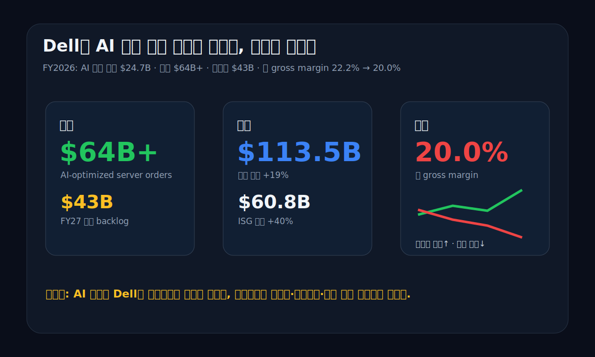
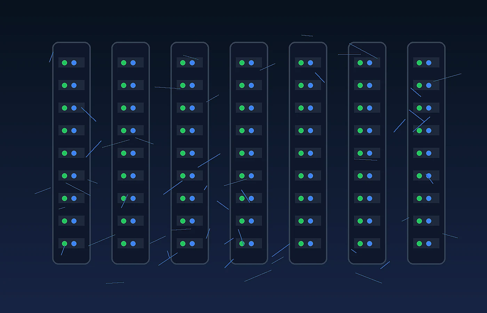
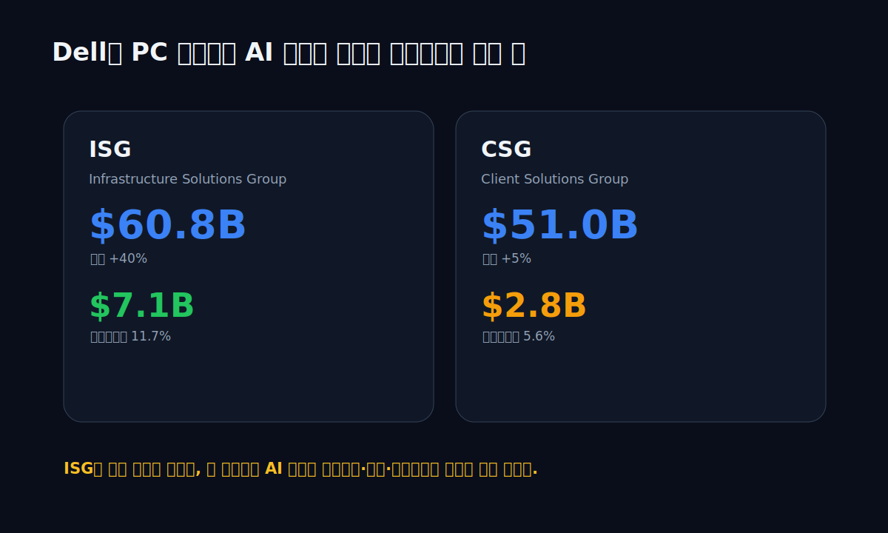
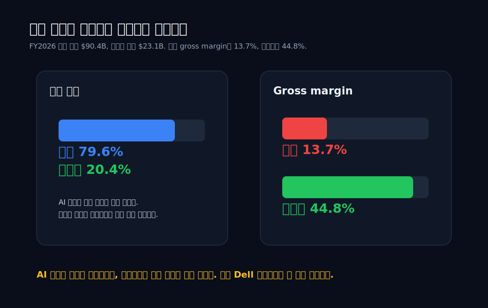
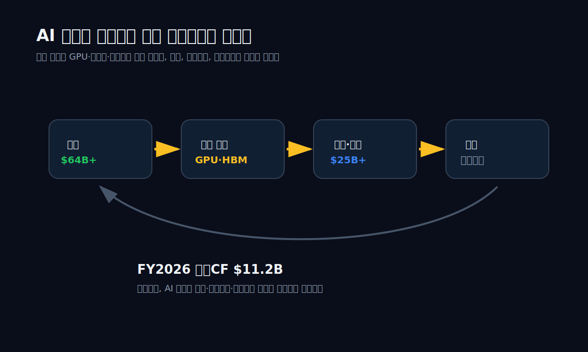
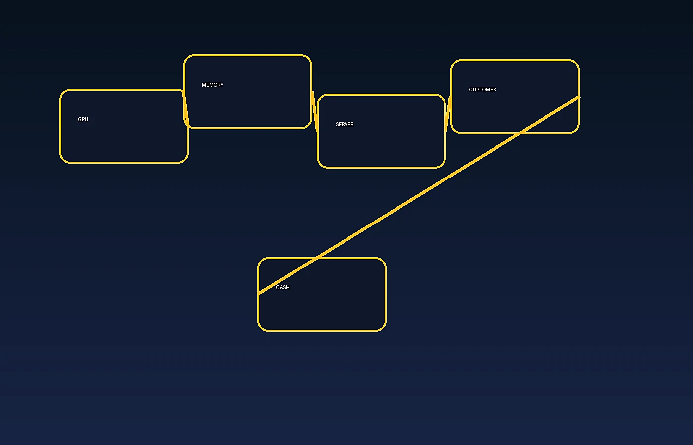
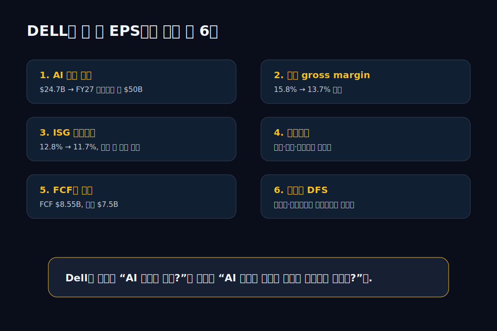

<script>
import ComboChart from '$lib/components/blog/ComboChart.svelte';
import HFDataLink from '$lib/components/blog/HFDataLink.svelte';
</script>

<HFDataLink code="DELL" kind="edgar" />

> **자본집약** | AI 인프라 · 서버 · PC · NYSE | 2026-04-29 dartlab 실측 + SEC EDGAR 원문



Dell Technologies, 티커 **DELL**. 한때 투자자가 이 회사를 보면 PC를 먼저 떠올렸다. 노트북, 데스크톱, 모니터, 기업용 PC. 그런데 FY2026 10-K를 열면 중심 단어가 바뀐다. **AI-optimized servers**. Dell은 FY2026에 AI 최적화 서버 주문 **$64B+**, 출하 **$25B+**, FY2027 진입 백로그 **$43B**를 발표했다.

표면만 보면 완벽한 AI 인프라 수혜주다. FY2026 매출은 **$113.5B**, 전년 대비 **+19%**. 영업이익은 **$8.15B**, 순이익은 **$5.94B**. 영업현금흐름은 **$11.2B**, FCF는 dartlab 기준 **$8.55B**. 회사는 배당을 20% 올리고, 자사주 매입 한도도 $10B 늘렸다.

그런데 재무제표에는 반대 방향의 신호가 하나 있다.

**총 gross margin이 22.2%에서 20.0%로 내려갔다.**

AI 서버 주문은 폭발했는데, 매출총이익률은 내려갔다. 이게 이 글의 질문이다.

**AI 서버가 그렇게 잘 팔리는데 Dell은 왜 더 높은 마진 회사가 아니라 더 낮은 gross margin 회사처럼 보이나?**

답은 간단하지 않다. AI 서버는 고부가가치라는 말과 다르게, Dell 입장에서는 대형고객·GPU·메모리·네트워킹 부품·가격경쟁·운전자본이 엮인 제품 사업이다. 소프트웨어처럼 한 번 만들고 복제하는 사업이 아니다. 주문은 크지만 원가도 크다. 백로그는 크지만 부품 확보와 수금 타이밍도 따라온다.

이 글은 Dell을 "AI 수혜주"라는 한 단어로 보지 않는다. **AI 서버 주문이 손익계산서, 세그먼트, 현금흐름표, 운전자본을 어떻게 바꾸는지** EDGAR 10-K와 dartlab 숫자로 읽는다.

---

## 프롤로그 — Dell은 원래부터 낮은 마진을 현금으로 바꾸는 회사였다

Dell을 풍부하게 읽으려면 FY2026 AI 서버 숫자에서 바로 시작하면 안 된다. 이 회사의 오래된 습관을 먼저 봐야 한다. Dell의 역사는 "높은 gross margin"보다 **낮은 마진을 빠른 회전과 공급망으로 현금화하는 능력**에 가깝다.

PC 시절 Dell의 강점은 예쁜 제품 하나가 아니었다. 주문을 받고, 부품을 조달하고, 조립하고, 고객에게 빨리 넘기는 운영 모델이었다. 재고를 오래 들고 있지 않는 것, 공급업체와 고객 사이의 시간차를 관리하는 것, 대량 구매로 원가를 낮추는 것. 이게 Dell의 몸에 밴 기술이다.

1980~1990년대 PC 시장에서 Dell이 보여준 차별점은 "PC를 만든다"보다 "PC를 주문형 공급망으로 판다"에 가까웠다. 대리점 재고를 많이 깔아두는 방식보다 고객 주문을 먼저 받고 구성품을 맞추는 방식이 강했다. 이 모델은 화려하지 않지만 재무제표에는 직접 나타난다. 재고 회전, 매입채무, 매출채권, 현금전환주기가 회사의 경쟁력이 된다. Dell을 읽을 때 손익계산서만 보면 반쪽이고, 현금흐름표와 운전자본을 같이 봐야 하는 이유가 여기서 시작된다.

이 배경은 지금 AI 서버에서도 그대로 반복된다. 과거에는 CPU, 메모리, 저장장치, 모니터를 묶어 기업 PC를 납품했다. 지금은 GPU, CPU, HBM, 스위치, 스토리지, 전원, 냉각, 랙, 서비스 계약을 묶어 AI 클러스터를 납품한다. 제품은 완전히 달라졌지만 회사가 돈을 버는 동사는 비슷하다. **부품을 확보하고, 고객 구성에 맞춰 조립하고, 납기와 수금 사이의 시간차를 관리한다.**

그 다음 큰 장면은 **EMC 인수**다. Dell은 2016년 EMC를 인수하면서 기업용 스토리지, 서버, 가상화 생태계로 깊게 들어갔다. 그 거래는 단순한 사업 확장이 아니라 자본구조 사건이었다. Dell은 큰 부채를 안고 더 거대한 기업용 인프라 회사가 됐다. 한동안 투자자가 Dell을 볼 때 핵심 질문은 "이 부채를 어떻게 줄이나"였다.

EMC 인수는 Dell을 "PC 제조사"에서 "기업 인프라 공급자"로 옮겨놓은 사건이었다. 스토리지는 서버 옆에 붙는 주변 상품이 아니라 데이터센터 설계의 중심이다. 가상화와 하이브리드 클라우드도 기업 IT 의사결정의 핵심이었다. Dell은 이 거래로 더 복잡한 고객을 상대하게 됐다. 은행, 제조사, 병원, 통신사, 공공기관처럼 한 번 장비를 사면 몇 년 동안 운영·지원·업그레이드가 따라붙는 고객들이다.

이후 VMware 분리와 재상장은 Dell의 재무제표를 다시 바꿨다. 소프트웨어성 자산을 분리하고, 남은 Dell은 더 하드웨어·인프라·서비스 중심 회사가 됐다. 그래서 FY2026 AI 서버 붐은 갑자기 하늘에서 떨어진 이야기가 아니다. Dell이 오랫동안 쌓아온 공급망, 기업 고객, 서버·스토리지 영업, 고객금융이 AI 인프라 수요와 만난 결과다.

VMware를 품고 있던 시기의 Dell은 하드웨어와 소프트웨어가 같이 보이는 회사였다. VMware가 분리된 뒤에는 Dell의 실체가 더 선명해졌다. 남은 Dell은 고마진 소프트웨어 회사라기보다, 대규모 기업 인프라를 판매하고 유지하는 운영 회사다. 이 변화가 지금 글의 핵심 질문을 만든다. AI라는 단어는 같아도, Dell의 AI 수혜는 모델·칩·클라우드 구독의 수혜와 다르다. Dell은 AI 수요를 실제 장비, 납품, 설치, 서비스, 금융으로 바꾸는 쪽에 서 있다.

이 배경을 모르면 FY2026 숫자를 잘못 읽는다.

AI 서버 주문 $64B+만 보면 "이제 Dell도 NVIDIA 같은 AI 주식인가?"라고 묻게 된다. 하지만 Dell의 역사적 DNA를 보면 질문이 달라진다. "Dell은 이 거대한 주문을 얼마나 빠르게, 얼마나 낮은 재고 위험으로, 얼마의 gross margin과 현금흐름으로 바꿀 수 있나?"가 된다.

이 글의 관통선은 그래서 더 정확히 말하면 이렇다.

**Dell은 AI 붐을 발명한 회사가 아니라, AI 붐을 배송 가능한 제품과 현금흐름으로 바꾸는 회사다.**

이 문장이 중요하다. 발명하는 회사와 배송하는 회사의 재무제표는 다르다. 발명하는 회사는 지식재산과 가격결정력이 gross margin을 만든다. 배송하는 회사는 규모, 운영, 재고, 채권, 공급망이 현금흐름을 만든다. Dell은 후자다.

---

## 1막 — FY2026, Dell은 다시 성장 회사처럼 보였다

FY2026 Dell의 첫인상은 강하다. 매출 **$113.5B**, 전년 대비 **+19%**. 영업이익 **$8.15B**, 전년 대비 **+31%**. 순이익 **$5.94B**, 전년 대비 **+30%**. EPS도 올라갔다. 2026년 2월 26일 8-K의 Exhibit 99.1은 이를 "record full-year revenue"와 "record cash generation"으로 제시한다.

```python
import dartlab
c = dartlab.Company("DELL")
prof = c.analysis("financial", "수익성")
cash = c.analysis("financial", "현금흐름")
```

dartlab 수익성 분석도 같은 그림을 잡는다.

| 연도 | 매출 | 영업이익 | 영업이익률 | 순이익 | 순이익률 |
| :--- | ---: | ---: | ---: | ---: | ---: |
| 2026 | $113.5B | $8.15B | 7.18% | $5.94B | 5.23% |
| 2023 | $102.3B | $5.77B | 5.64% | $2.44B | 2.39% |
| 2022 | $101.2B | $4.66B | 4.60% | $5.56B | 5.50% |
| 2021 | $94.2B | $5.14B | 5.46% | $3.25B | 3.45% |
| 2020 | $92.2B | $2.62B | 2.85% | $4.62B | 5.01% |

2026년의 특징은 매출 성장보다 영업이익률 개선이다. 2023년 5.64%였던 영업이익률이 2026년 7.18%까지 올라왔다. 총 gross margin은 내려갔는데 영업이익률은 올라간다. 여기서 Dell 재무제표의 두 번째 반전이 나온다.

**총마진은 눌렸지만 판관비율은 더 크게 내려갔다.**

10-K의 손익 요약을 보면 FY2026 operating expenses는 매출 대비 **12.8%**다. FY2025는 **15.7%**, FY2024는 **17.7%**였다. 즉 AI 서버 믹스 때문에 gross margin은 낮아졌지만, 매출 레버리지와 비용통제로 영업이익률은 오히려 개선됐다.

<ComboChart data={[{year:"2026",매출액:113538,영업이익:8149,순이익:5936},{year:"2025",매출액:95567,영업이익:6237,순이익:4576},{year:"2024",매출액:88425,영업이익:5411,순이익:3372},{year:"2023",매출액:102301,영업이익:5771,순이익:2442},{year:"2022",매출액:101197,영업이익:4659,순이익:5563}]} lineKeys={["매출액"]} barKeys={["영업이익","순이익"]} lineColors={["#22c55e"]} barColors={["#3b82f6","#f59e0b"]} title="Dell 매출과 이익" unit="$M" />

그래서 Dell은 "마진이 나빠졌다"로만 끝낼 회사가 아니다. AI 서버가 들어오면서 매출은 커지고, 비용 구조는 좋아지고, 현금흐름도 좋아졌다. 다만 gross margin이 내려간 이유를 모르면 이 성장의 질을 오해한다.

---

## 2막 — 주문서가 재무제표로 이동하는 순서

AI 서버 주문은 보도자료에서는 한 줄이다. "$64B+ orders". 하지만 재무제표에서는 여러 칸으로 찢어진다. 주문서가 곧바로 매출이 되는 것도 아니고, 매출이 곧바로 현금이 되는 것도 아니다. Dell 같은 하드웨어·인프라 회사에서 주문은 다음 순서로 이동한다.

1. 고객이 AI 서버 구성을 정한다.
2. Dell이 GPU, CPU, 메모리, 네트워킹, 스토리지, 전원·냉각 부품의 확보 가능성을 본다.
3. 부품 조달 조건과 납기, 가격, 고객 결제조건을 맞춘다.
4. 제조·조립·검수·출하가 일어난다.
5. 회계상 매출과 원가가 인식된다.
6. 매출채권이 생기고, 고객이 대금을 지급한다.
7. 그 사이 공급업체 지급과 재고 부담이 현금흐름표에 남는다.

현장 그림으로 바꾸면 더 분명하다. 어떤 대형 고객이 자체 AI 서비스를 키우기 위해 수천 대 규모의 GPU 서버를 필요로 한다고 하자. 고객은 먼저 어느 GPU 세대를 쓸지, 랙당 전력과 냉각을 어떻게 맞출지, 스토리지를 어디까지 붙일지, 네트워크 토폴로지를 어떻게 짤지 정해야 한다. Dell은 그 요구를 받아 제품 구성표를 만들고, 공급 가능한 부품과 납기를 맞춘다. 이 단계에서는 아직 손익계산서에 매출이 찍히지 않는다. 하지만 회사 안에서는 이미 공급망과 재무팀이 움직인다.

다음에는 부품 확보가 온다. AI 서버는 일반 서버보다 원가가 무겁다. GPU, 고성능 메모리, 고속 네트워킹 부품의 비중이 크다. Dell이 고객 주문을 받았더라도, 핵심 부품을 제때 확보하지 못하면 출하가 밀린다. 반대로 부품을 먼저 확보했는데 고객 데이터센터의 전력·냉각 준비가 늦어지면 재고 부담이 생긴다. 여기서 10-K의 "non-linearity"가 현실이 된다. 매출이 한 분기에 몰리거나 다음 분기로 넘어가는 일이 생길 수 있다.

그 다음에는 조립과 검수가 있다. AI 서버는 박스 하나를 파는 일이 아니라 랙 단위, 클러스터 단위로 맞물린다. 전력, 열, 네트워크, 펌웨어, 서비스 조건이 같이 맞아야 한다. 제품이 출하되고 고객에게 통제권이 이전되어야 매출과 원가가 손익계산서에 들어온다. 그리고 대금 회수 전까지는 매출채권이나 고객금융이 남는다. 주문이 커질수록 이 시간차도 커진다.

이 순서 때문에 백로그는 좋은 소식이면서 동시에 숙제다. 백로그 $43B는 미래 매출의 가시성을 높인다. 하지만 그 백로그가 실제 매출이 되려면 부품이 와야 하고, 고객 데이터센터 준비가 끝나야 하고, 제품 구성이 바뀌지 않아야 하며, 배송과 수금이 진행돼야 한다.

10-K가 "non-linearity"를 언급하는 이유가 여기에 있다. AI 인프라 주문은 일정하게 흐르지 않는다. 고객이 데이터센터 전력과 냉각을 준비하는 속도, GPU 세대 전환, 네트워킹 구성 변경, 공급업체 할당이 모두 매출 인식 시점을 흔든다. 그래서 분기별 매출은 매끄러운 선이 아니라 계단처럼 움직일 수 있다.

재무제표 독자는 여기서 한 가지를 배운다. **AI 서버 주문은 매출의 선행지표지만, gross margin과 현금흐름의 보증서는 아니다.**

주문이 많아도 낮은 가격으로 받은 주문이면 gross margin은 낮다. 주문이 많아도 부품을 먼저 사야 하면 재고가 늘어난다. 주문이 많아도 고객 수금이 늦으면 매출채권이 늘어난다. 주문이 많아도 GPU 세대가 바뀌면 일부 재고는 할인 또는 충당 위험을 갖는다.

그래서 Dell FY2026에서 가장 좋은 숫자는 주문 $64B+ 하나가 아니라, 주문이 커지는 와중에도 영업현금흐름이 $11.2B까지 올라왔다는 점이다. 이것은 회사가 단순히 매출만 밀어낸 게 아니라, 현금화도 잘했다는 증거다. 그러나 FY2027에는 같은 시험이 더 크게 온다. AI 서버 매출 가이던스가 $50B라면, 주문서가 재무제표로 이동하는 모든 칸이 두 배 가까이 커진다.

---

## 3막 — AI 서버가 주인공이 됐다



FY2026 10-K에서 Dell은 ISG의 서버·네트워킹 매출을 더 세분화했다. 이유는 분명하다. AI-optimized servers 규모가 너무 커졌기 때문이다. 회사는 2026년 10-K에서 "Given the scale and growth" 때문에 서버와 네트워킹 안의 AI 서버를 별도 카테고리로 나눴다고 설명한다.

숫자는 크다.

| ISG 제품군 | FY2024 | FY2025 | FY2026 | FY2026 성장률 |
| :--- | ---: | ---: | ---: | ---: |
| AI-optimized servers | $1.87B | $9.29B | $24.68B | +166% |
| Traditional servers and networking | $15.75B | $17.85B | $19.51B | +9% |
| Storage | $16.26B | $16.46B | $16.63B | +1% |
| **ISG total** | **$33.89B** | **$43.59B** | **$60.83B** | **+40%** |

AI 서버는 FY2024 $1.87B에서 FY2026 $24.68B로 13배가 됐다. FY2026 ISG 매출 증가분의 대부분이 여기서 나온다. 전통 서버와 스토리지도 나쁘지 않지만, 성장 엔진은 AI 서버다.



2026년 2월 26일 8-K Exhibit 99.1은 더 공격적인 숫자를 준다. AI 최적화 서버 주문 **$64B+**, 연간 출하 **$25B+**, FY2027 진입 백로그 **$43B**. FY2027 AI 서버 매출 가이던스는 약 **$50B**다. FY2026 실제 AI 서버 매출 $24.68B의 두 배 수준이다.

이 대목만 보면 Dell은 전통 하드웨어 회사가 아니라 AI 인프라 플랫폼처럼 보인다. Nvidia GPU를 담고, 네트워킹과 스토리지를 붙이고, 대형 클라우드·엔터프라이즈 고객에게 납품하는 공급망의 핵심 노드다.

하지만 바로 여기서 마진 문제가 시작된다. AI 서버는 주문 단가가 크다. 동시에 부품 원가도 크다. 특히 GPU와 고성능 메모리, 네트워킹 부품은 Dell이 마음대로 가격을 정하는 소프트웨어가 아니다. 고객도 대형이다. 대형 클라우드와 AI 인프라 고객은 주문 규모가 크지만 가격 협상력도 크다.

10-K의 Risk Factors는 이 점을 직접 말한다. AI 대형 주문은 경쟁과 가격 압력이 강하고, gross margin과 영업성과에 영향을 줄 수 있으며, 더 큰 운전자본 약속을 요구할 수 있다고 설명한다. 즉 회사 스스로 AI 서버가 "고성장 고마진"만은 아니라고 공시하고 있다.

여기서 Dell과 NVIDIA의 차이가 결정적으로 갈린다. NVIDIA의 핵심 병목은 GPU 설계, CUDA 생태계, 패키징, 공급 할당이다. Dell의 병목은 그 GPU를 고객이 실제로 쓸 수 있는 랙과 클러스터로 묶는 일이다. 고객은 GPU만 사지 않는다. 전원, 냉각, 네트워킹, 스토리지, 배포, 유지보수, 금융조건까지 묶어 산다.

그래서 Dell의 AI 서버 매출은 "한 대 더 팔았다"보다 복잡하다. 대형 고객이 원하는 구성은 계속 바뀐다. GPU 세대가 바뀌면 보드, 섀시, 열 설계, 전원, 네트워킹이 같이 바뀐다. 납기와 부품 배정도 달라진다. Dell이 가진 장점은 이 복잡성을 대규모로 운영해본 경험이다. 단점은 그 복잡성이 gross margin을 압박한다는 점이다.

---

## 4막 — 제품과 서비스가 갈라졌다



Dell의 gross margin 하락은 제품·서비스 분해를 보면 바로 이해된다.

| 항목 | FY2024 | FY2025 | FY2026 |
| :--- | ---: | ---: | ---: |
| 제품 매출 | $64.35B | $71.42B | $90.41B |
| 제품 매출 비중 | 72.8% | 74.7% | 79.6% |
| 제품 gross margin | 17.5% | 15.8% | 13.7% |
| 서비스 매출 | $24.07B | $24.15B | $23.13B |
| 서비스 매출 비중 | 27.2% | 25.3% | 20.4% |
| 서비스 gross margin | 40.8% | 41.4% | 44.8% |
| 총 gross margin | 23.8% | 22.2% | 20.0% |

이 표 하나가 Dell FY2026의 핵심이다. AI 서버는 제품 매출을 밀어 올렸다. 제품 매출은 FY2026에 **+27%** 증가했다. 그런데 제품 gross margin은 **15.8% → 13.7%**로 내려갔다. 반대로 서비스 gross margin은 **44.8%**까지 올라갔지만, 서비스 매출 비중은 줄었다.

그래서 총 gross margin은 내려간다. 서비스는 더 좋아졌지만, 제품이 훨씬 커졌다. 낮은 마진의 큰 매출이 높은 마진의 작은 매출을 희석한 것이다.

이건 나쁜 신호만은 아니다. Dell이 AI 서버 시장에서 실제 물량을 따내고 있다는 뜻이다. 그러나 투자자가 "AI 서버니까 당연히 소프트웨어급 마진"이라고 생각하면 틀린다. Dell의 AI 서버는 고성능 제조·조립·통합·공급망 사업이다. gross margin은 부품 원가와 고객 가격에 묶인다.

여기서 서비스 attach가 중요해진다. Dell이 서버만 팔고 끝나면 제품 gross margin 13.7%의 세계에 갇힌다. 하지만 고객이 장비를 몇 년 동안 운영하려면 지원, 보증, 교체, 구축 서비스, 스토리지, 네트워킹, 보안, 금융조건이 필요하다. 이 부가 영역은 제품보다 마진이 높다. FY2026 서비스 gross margin 44.8%가 그 차이를 보여준다.

문제는 비중이다. 서비스는 수익성이 좋지만 FY2026 매출 비중은 20.4%로 내려왔다. 제품 매출이 너무 빠르게 커졌기 때문이다. 그래서 Dell의 질적 성장은 "AI 서버를 얼마나 많이 파느냐"에서 끝나지 않는다. 그 서버 뒤에 얼마만큼의 서비스, 스토리지, 네트워킹, 장기 지원 계약을 붙이느냐가 중요하다. 이게 잘 되면 AI 서버는 낮은 gross margin의 일회성 매출이 아니라 장기 고객관계의 입구가 된다. 이게 안 되면 매출은 커지지만 이익률은 계속 희석된다.

기업 고객 입장에서도 이 차이는 크다. AI 클러스터는 한 번 설치하고 잊어버리는 장비가 아니다. 장애가 나면 모델 학습과 추론 서비스가 멈춘다. GPU 세대가 바뀌면 업그레이드 경로를 고민해야 한다. 데이터가 커지면 스토리지와 네트워크 병목이 생긴다. 그래서 Dell의 진짜 판매는 "서버 한 대"가 아니라 "몇 년 동안 운영 가능한 인프라 묶음"이어야 한다.

이 점에서 Dell은 [NVIDIA(NVDA)](/blog/NVDA-nvidia)와 다르다. NVIDIA는 GPU 설계와 생태계 지배력이 gross margin을 만든다. Dell은 그 GPU를 포함한 시스템을 설계·조립·납품한다. 가치사슬에서 위치가 다르다. AI 붐의 수혜를 받지만, 수혜의 형태가 다르다.

Super Micro Computer는 아직 dartlab 블로그에서 다루지 않았지만, 비교 축은 분명하다. AI 서버 조립·통합 업체는 매출이 빠르게 커질 수 있다. 대신 부품 조달, 고객 집중, 재고 리스크, 가격경쟁을 같이 떠안는다. Dell은 규모와 브랜드, 공급망, 서비스 조직이 있어 더 안정적이지만, 경제학은 같은 쪽에 있다.

---

## 5막 — ISG는 성장했지만 영업마진은 내려갔다

Dell의 세그먼트는 크게 두 개다.

**ISG**는 Infrastructure Solutions Group. 서버, 네트워킹, 스토리지, AI 인프라.

**CSG**는 Client Solutions Group. 상업용·소비자용 PC와 주변기기.

FY2026에는 ISG가 명백한 주인공이다.

| 세그먼트 | FY2025 매출 | FY2026 매출 | 성장률 | FY2026 영업이익 | 영업이익률 |
| :--- | ---: | ---: | ---: | ---: | ---: |
| ISG | $43.59B | $60.83B | +40% | $7.11B | 11.7% |
| CSG | $48.39B | $50.98B | +5% | $2.83B | 5.6% |
| Corporate and other | $3.58B | $1.73B | 별도 계산 생략 | $47M | 별도 계산 생략 |

ISG 매출은 CSG를 넘어섰다. Dell이 더 이상 PC 중심 회사로만 보이지 않는 이유다. AI 서버가 ISG를 밀어 올렸고, ISG가 전사 성장을 이끌었다.

그런데 ISG 영업이익률은 FY2025 **12.8%**에서 FY2026 **11.7%**로 내려갔다. 영업이익 총액은 $5.58B에서 $7.11B로 늘었다. 하지만 매출이 더 빠르게 늘면서 마진율은 하락했다.

이게 Dell AI 서버 스토리의 세 번째 반전이다.

**AI 서버는 Dell의 영업이익을 늘렸지만, ISG 마진율은 낮췄다.**

이건 성장의 질을 나쁘게만 보라는 뜻이 아니다. 어떤 산업에서는 마진율보다 절대 영업이익과 현금흐름이 더 중요하다. Dell은 $60.8B ISG 매출에서 $7.1B 영업이익을 냈다. 충분히 큰 돈이다. 다만 투자자가 기대하는 "AI 프리미엄"이 어느 정도까지 정당화되는지는 별개의 문제다.

AI 서버가 앞으로 $50B 매출로 커진다면, 질문은 더 날카로워진다. 그 $50B가 10%대 초반 세그먼트 마진으로 들어오는가. 아니면 가격경쟁과 부품비 때문에 더 낮아지는가. 반대로 규모의 경제와 서비스 attach로 마진이 회복되는가. 이 질문이 FY2027 Dell의 핵심이다.

---

## 6막 — 현금흐름은 강하다, 그래서 이야기가 복잡해진다





마진만 보면 Dell에 조심스러워진다. 그런데 현금흐름표를 보면 이야기가 다시 좋아진다. FY2026 영업현금흐름은 **$11.19B**. FCF는 dartlab 기준 **$8.55B**. FY2025 영업현금흐름 $4.52B 대비 크게 개선됐다.

| 연도 | 영업CF | CAPEX | FCF | 패턴 |
| :--- | ---: | ---: | ---: | :--- |
| 2026 | $11.19B | $2.63B | $8.55B | 성숙형 — 영업으로 벌어 투자 |
| 2025 | $4.52B | 미기재 | 미기재 | AI 운전자본 부담 |
| 2024 | $8.68B | 미기재 | 미기재 | 정상 현금 창출 |
| 2023 | $3.57B | $3.00B | $0.56B | 현금 전환 약화 |
| 2022 | $10.31B | $2.80B | $7.51B | 강한 현금 창출 |

FY2026 현금흐름이 강한 이유는 세 가지다. 매출 성장, 이익 증가, 그리고 운전자본 타이밍이다. 10-K는 FY2026 영업CF가 순매출 성장, 수익성, 운전자본 dynamics로부터 나왔다고 설명한다. 동시에 AI 서버 수요가 financing receivables와 working capital에 영향을 줬다고 밝힌다.

여기서 중요한 건 "운전자본 dynamics"라는 표현이다. AI 서버는 주문을 받으면 끝나는 사업이 아니다. GPU, 메모리, 네트워킹 부품을 확보해야 한다. 재고를 쌓고, 고객에게 납품하고, 대금을 회수한다. 대형 고객은 결제조건도 협상한다. 공급업체와 고객 사이의 결제 타이밍이 Dell 현금흐름을 흔든다.

그래서 FY2026 영업CF $11.2B는 매우 좋은 숫자지만, 단순 반복 가능 현금으로만 보면 안 된다. AI 서버 수요가 커질수록 working capital의 진폭도 커진다. 특히 FY2027 AI 서버 매출 가이던스가 약 $50B라면, 매출 성장과 운전자본 부담이 같이 커질 가능성이 있다.

Dell의 강점은 여기서 드러난다. 작은 서버 업체라면 이 운전자본을 감당하기 어렵다. Dell은 글로벌 공급망, 고객금융(DFS), 대형 고객 관계, 자본시장 접근성이 있다. 그래서 AI 서버 물량을 소화할 수 있다. 하지만 그 강점은 동시에 재무제표를 복잡하게 만든다. 재고, 매출채권, financing receivables, 매입채무를 같이 봐야 한다.

```python
cash = c.analysis("financial", "현금흐름")
quality = c.analysis("financial", "이익품질")
print(cash["cashFlowOverview"]["history"][0])
print(quality["accrualAnalysis"]["history"][0])
```

FY2026 이익품질 분석은 오히려 좋다. 순이익 $5.94B 대비 영업CF $11.19B, OCF/NI 약 **188%**다. 발생액 관점에서도 FY2026 Sloan accrual ratio는 음수다. 즉 Dell의 FY2026 이익은 현금으로 잘 전환됐다.

다만 이것을 "AI 서버는 항상 현금전환이 좋다"로 일반화하면 안 된다. FY2026은 매출 성장과 working capital timing이 우호적으로 겹친 해다. AI 서버 주문이 더 커지는 FY2027에는 부품 선확보와 고객 결제조건이 더 큰 변수가 된다. 특히 GPU 세대 전환이 빠른 시장에서는 재고를 잘못 잡으면 높은 매출 성장 뒤에 재고평가손이나 할인 판매가 따라올 수 있다.

운전자본 회사는 항상 시간차를 산다. 공급업체에는 언제 돈을 주고, 고객에게서는 언제 받는가. Dell은 이 시간차를 다루는 데 강한 회사지만, 시간차 자체가 사라지는 것은 아니다.

---

## 7막 — 주주환원은 강하지만, 부채와 DFS를 같이 봐야 한다

FY2026 Dell은 주주환원도 강했다. 회사는 2026년 2월 발표에서 배당 20% 인상과 자사주 매입 한도 $10B 증액을 발표했다. FY2026 동안 주주에게 돌려준 금액은 **$7.5B**, 자사주 매입은 약 **5,400만 주**였다.

dartlab 자본배분 분석도 FY2026 FCF 사용 여력을 보여준다.

| 항목 | FY2026 |
| :--- | ---: |
| 영업현금흐름 | $11.19B |
| FCF | $8.55B |
| 배당 지급 | $1.46B |
| FCF 대비 배당 | 17.1% |
| 순이익 대비 배당성향 | 24.6% |

이 정도면 배당 자체는 부담스럽지 않다. 오히려 Dell은 현금흐름이 좋은 하드웨어 회사다. 문제는 총부채와 고객금융이다.

2026년 10-K의 리스크 섹션은 2026년 1월 30일 기준 회사와 자회사에 약 **$31.5B**의 indebtedness가 있다고 밝힌다. 또 상업어음 프로그램 $5.0B, revolver $5.9B 여력을 언급한다. Dell Financial Services(DFS)는 고객에게 금융을 제공하고, 그 receivables와 funding 구조가 현금흐름에 영향을 준다.

이건 나쁜 구조라는 뜻이 아니다. Dell 같은 기업용 IT 회사에는 고객금융이 경쟁력이다. 고객이 대형 서버와 스토리지를 도입할 때 금융 조건은 구매 결정의 일부다. 하지만 투자자는 Dell을 단순한 제조업으로 보면 안 된다. 제품 판매, 서비스, 금융이 묶여 있다.

이 때문에 Dell의 현금흐름을 볼 때는 두 줄을 나눠야 한다.

첫째, 본업이 만드는 현금. FY2026은 강했다.

둘째, DFS와 운전자본이 만드는 타이밍. AI 서버가 커질수록 이 줄의 중요성이 커진다.

---

## 8막 — 자기자본이 마이너스인 회사가 왜 배당을 늘리나

Dell 재무제표에서 처음 보는 사람이 당황하는 지점이 하나 더 있다. dartlab 수익성 분석을 보면 FY2026 자기자본이 **-$2.47B**로 잡힌다. ROE도 일반적인 의미로 해석하기 어렵다. 자기자본이 마이너스인데 회사는 배당을 늘리고 자사주 매입 한도를 키운다. 이상해 보인다.

이건 Dell을 읽을 때 반드시 설명해야 하는 장면이다.

마이너스 자기자본은 곧바로 "망했다"는 뜻이 아니다. Dell은 과거 대규모 인수, 구조 재편, VMware 분리, 자사주 매입, 부채 조달과 상환을 거치며 장부상 자본이 작거나 음수가 되는 구조를 만들었다. 동시에 회사는 거대한 매출과 현금흐름을 만든다. FY2026 순이익은 $5.94B, 영업현금흐름은 $11.19B다.

자기자본이 얇거나 음수인 회사에서는 ROE가 의미를 잃는다. 분모가 음수면 ROE가 이상한 숫자가 된다. 그래서 Dell을 ROE로 평가하면 안 된다. 대신 봐야 할 것은 네 가지다.

| 질문 | 왜 중요한가 |
| :--- | :--- |
| 영업CF가 이자·배당·투자를 감당하나 | 장부자본보다 현금 지급능력이 중요 |
| 총부채 만기와 금리 구조는 어떤가 | 리파이낸싱 부담이 실제 위험 |
| FCF가 환원보다 큰가 | 자사주·배당이 현금흐름 안에 있는지 확인 |
| 운전자본이 악화될 때도 현금이 남나 | AI 서버 성장기 스트레스 테스트 |

FY2026만 보면 Dell은 이 네 질문에 꽤 좋은 답을 냈다. 영업CF $11.2B, FCF $8.55B, 배당 $1.46B. 주주환원 $7.5B도 FCF 안팎에서 설명 가능하다. 하지만 이 구조는 고정적으로 안전하다는 뜻이 아니다. AI 서버 매출이 커지는 국면에서 운전자본이 나빠지면 FCF가 줄 수 있고, 그때도 같은 환원 속도를 유지할지는 별도 판단이다.

즉 Dell은 전통적인 "자본이 두껍고 배당이 안정적인 회사"가 아니다. **현금흐름이 강해서 얇은 자본구조를 버티는 회사**다. 이 차이를 놓치면 배당 증가를 과소평가하거나, 반대로 마이너스 자기자본을 과대공포로 해석하게 된다.

---

## 9막 — PC 회사라는 낡은 라벨은 틀렸다

Dell을 여전히 PC 회사로 보면 FY2026 재무제표가 잘 안 읽힌다. CSG 매출은 $51.0B로 여전히 크다. 하지만 성장률은 +5%다. 영업이익은 $2.83B로 전년 대비 -5%다. PC 사업은 Dell의 바닥이지만, 성장 엔진은 아니다.

반면 ISG는 매출 $60.8B, 성장률 +40%, 영업이익 $7.1B다. AI 서버가 ISG를 밀어 올렸고, ISG가 전사 이익의 중심이 됐다.

이 변화는 [Intel(INTC)](/blog/INTC-intel)과도 연결된다. Intel은 AI 인프라 붐의 중심에서 밀려나며 파운드리 투자와 구조조정 부담을 안고 있다. Dell은 반대로 AI 인프라 붐을 고객 주문으로 받고 있다. 하지만 [NVIDIA(NVDA)](/blog/NVDA-nvidia)처럼 높은 gross margin을 누리는 위치는 아니다. Dell은 가치사슬의 "판매 가능한 시스템"을 만드는 쪽이다.

[ARM](/blog/ARM-arm-holdings)은 설계 IP의 경제학이고, [Palantir](/blog/PLTR-palantir)는 소프트웨어 영업레버리지의 경제학이다. Dell은 다르다. Dell은 AI 수요를 실제 랙, 서버, 부품, 물류, 고객금융으로 바꾸는 회사다. 그래서 매출은 크고, 현금흐름은 강하지만, gross margin은 낮다.

이 라벨 전환이 투자 판단을 바꾼다. Dell이 PC 회사라면 저성장 현금주다. Dell이 AI 인프라 회사라면 성장주다. 하지만 재무제표가 말하는 정확한 표현은 그 중간이다.

**Dell은 AI 인프라 수요를 흡수하는 대형 하드웨어·공급망·금융 플랫폼이다.**

이 표현이 가장 정확하다.

---

## 10막 — AI 인프라 가치사슬에서 Dell의 자리

AI 인프라를 한 줄로 보면 GPU가 전부처럼 보인다. 그러나 실제 데이터센터는 GPU만으로 돌아가지 않는다. GPU 서버, CPU, 메모리, 스토리지, 네트워킹, 전원, 냉각, 랙 통합, 운영 소프트웨어, 유지보수, 금융조건이 필요하다. Dell은 이 중 "고객이 구매 가능한 시스템"을 담당한다.

이 위치에는 장점이 있다.

첫째, 고객 접점이 넓다. Dell은 170개국 이상에서 기업 고객과 채널을 갖고 있다. AI 도입은 클라우드 대기업만의 일이 아니다. 금융, 제조, 의료, 공공, 통신 기업도 온프레미스와 하이브리드 환경에서 AI 인프라를 도입한다. Dell은 이 고객층을 잘 안다.

둘째, 솔루션 묶음 판매가 가능하다. 서버만이 아니라 스토리지, 네트워킹, 서비스, 지원, 금융을 같이 붙일 수 있다. 이게 잘 되면 낮은 서버 gross margin을 서비스와 유지보수로 보완할 수 있다.

셋째, 공급망 규모가 있다. AI 서버 시장에서는 부품 확보가 경쟁력이다. 부품을 제때 못 받으면 주문은 매출이 되지 않는다. Dell은 대형 공급망을 운영해본 회사이고, 공급업체와 협상할 규모가 있다.

하지만 이 위치에는 한계도 있다.

첫째, 핵심 부품의 경제적 이익은 부품 공급자가 가져간다. GPU 부족기에는 GPU 공급자의 가격결정력이 크다. Dell은 그 위에 시스템 마진을 붙이지만, 부품 자체의 초과이익을 모두 가져오지는 못한다.

둘째, 대형 고객은 가격에 민감하다. 수십억 달러 단위 주문을 넣는 고객은 Dell에게도 좋은 고객이지만, 동시에 강한 협상자다. 대량 주문은 매출을 만들지만, 마진을 압박할 수 있다.

셋째, 기술 전환 속도가 빠르다. GPU 세대와 네트워킹 표준이 바뀌면 재고와 설계가 빠르게 낡을 수 있다. 이 리스크는 소프트웨어 회사보다 하드웨어 통합 회사에 더 직접적이다.

그래서 Dell의 AI 전략은 "칩보다 낮은 마진, PC보다 높은 성장"의 중간 지대에 있다. 이 중간 지대를 잘 운영하면 Dell은 AI 인프라의 현금흐름형 승자가 된다. 잘못 운영하면 매출은 커지는데 마진과 운전자본이 따라가지 못하는 회사가 된다.

---

## 11막 — 경쟁사와 비교하면 Dell의 장단점이 선명해진다

AI 서버 시장에서 Dell을 혼자 놓고 보면 주문 $64B+가 너무 커 보인다. 비교를 붙이면 더 정확해진다.

| 비교 대상 | Dell과 다른 점 | Dell을 볼 때 얻는 질문 |
| :--- | :--- | :--- |
| NVIDIA | GPU와 소프트웨어 생태계의 가격결정력 | Dell은 부품 마진이 아니라 시스템 통합 마진 |
| Super Micro | AI 서버 조립·통합 순수도가 높고 변동성이 큼 | Dell은 규모·서비스·고객금융으로 안정성을 더할 수 있나 |
| HPE | 서버·네트워킹·서비스 포트폴리오 경쟁 | Dell ISG 마진이 업계 평균 대비 방어되는가 |
| Lenovo | 글로벌 PC·서버 경쟁과 가격 압력 | Dell CSG와 ISG가 가격경쟁에서 얼마나 버티나 |
| 클라우드 자체 설계 | 대형 고객이 직접 시스템을 설계할 수 있음 | Dell의 통합·서비스 가치가 계속 필요한가 |

NVIDIA와 비교하면 Dell은 낮은 gross margin이 당연해 보인다. Dell은 GPU의 소유자가 아니라 GPU를 담는 시스템의 판매자다. 핵심 부품의 초과이익은 NVIDIA와 메모리·네트워킹 공급자가 가져간다. Dell은 시스템 설계, 공급망, 고객관계, 서비스, 금융에서 돈을 번다.

Super Micro와 비교하면 Dell의 장점은 규모와 신뢰성이다. 대형 기업 고객은 서버만 싸게 사는 게 아니라 납기, 지원, 금융조건, 글로벌 서비스망을 산다. Dell은 이 패키지에서 강하다. 대신 빠르게 성장하는 순수 AI 서버 업체보다 매출 믹스가 복잡하고, PC와 레거시 사업도 같이 들고 있다.

HPE와 비교하면 Dell의 관전 포인트는 ISG 수익성이다. 두 회사 모두 기업 인프라 시장을 겨냥하지만, Dell은 AI 서버 수요를 FY2026에 훨씬 큰 숫자로 보여줬다. 그러나 큰 매출이 곧 높은 경제적 이익은 아니다. ISG 영업마진 11.7%가 방어되는지가 중요하다.

Lenovo와 비교하면 가격경쟁이 보인다. PC와 서버는 글로벌 공급망과 원가경쟁이 강한 시장이다. Dell이 브랜드와 기업 고객 관계를 갖고 있어도, 고객은 대안을 가진다. AI 서버가 표준화될수록 가격경쟁은 더 강해질 수 있다.

마지막으로 클라우드 자체 설계가 있다. 대형 클라우드와 AI 기업은 자체 서버 설계 역량을 키울 수 있다. 모든 고객이 Dell의 완성형 시스템을 같은 방식으로 필요로 하지는 않는다. Dell은 이들에게 납품 파트너가 될 수도 있지만, 일부 영역에서는 고객이 직접 설계하고 제조 파트너만 쓰는 구조가 될 수도 있다.

여기에 한 층 더 봐야 할 경쟁자가 있다. Dell의 경쟁자는 서버 업체만이 아니다. 고객의 선택지는 "Dell 서버를 산다"와 "다른 서버 업체를 산다" 둘뿐이 아니다. 클라우드로 올릴 수도 있고, GPU 클라우드 사업자에게 빌릴 수도 있고, 자체 설계와 ODM 제조를 결합할 수도 있고, 기존 데이터센터 증설을 늦출 수도 있다. AI 인프라 투자는 기업의 CAPEX, 전력 계약, 데이터 보안, 모델 전략, 클라우드 전략이 한꺼번에 묶인 의사결정이다.

이 관점에서 Dell의 강점은 보수적인 기업 고객에게 더 잘 보인다. 모든 회사가 대형 클라우드처럼 자체 서버를 설계할 수는 없다. 모든 회사가 GPU 클러스터 운영 인력을 충분히 갖고 있지도 않다. 금융사, 제조사, 병원, 공공기관은 데이터 위치와 보안 때문에 온프레미스 또는 하이브리드 AI 인프라를 원할 수 있다. 이 고객에게 Dell은 장비 판매자가 아니라 "복잡한 AI 인프라 구매를 현실적인 프로젝트로 바꿔주는 공급자"가 된다.

반대로 초대형 클라우드와 AI 연구 고객에게 Dell의 협상력은 낮아질 수 있다. 이들은 주문 규모가 크고, 대체 공급자도 찾을 수 있고, 자체 설계 역량도 있다. 그래서 Dell은 고객군에 따라 다른 경제성을 가진다. 엔터프라이즈 고객에서는 서비스와 신뢰가 프리미엄을 만들 수 있지만, 초대형 고객에서는 규모가 매출을 만들고 가격협상력이 마진을 누를 수 있다.

그래서 Dell의 경쟁력은 "AI 서버를 만든다"가 아니라 **AI 서버를 대규모 고객에게 안정적으로 납품하고, 그 뒤 서비스와 금융까지 묶는다**에 있다. 이 차이를 이해해야 Dell의 프리미엄과 한계를 같이 볼 수 있다.

---

## 12막 — FY2027의 관전 포인트는 매출이 아니라 마진의 방어선

회사는 FY2027 가이던스를 공격적으로 제시했다. 매출 **$138B~$142B**, midpoint $140B. FY2026 대비 약 +23%. AI 서버 매출은 약 **$50B**, FY2026 $24.7B의 두 배 수준이다.

그럼 주가는 당연히 좋아야 하나. 여기서 다시 마진 질문으로 돌아온다.

AI 서버 매출이 $25B에서 $50B로 커질 때, 제품 gross margin은 어디까지 내려갈까. 13.7%에서 방어될까. ISG 영업이익률 11.7%가 유지될까. 아니면 고객 믹스와 가격경쟁 때문에 더 내려갈까.

Dell이 낙관적일 수 있는 근거는 있다.

첫째, 규모가 커지면 운영비율이 더 내려갈 수 있다. FY2026에도 gross margin 하락을 operating expense rate 하락이 상쇄했다.

둘째, AI 서버에 서비스와 스토리지, 네트워킹, 지원 계약이 붙으면 mix가 좋아질 수 있다. 제품만 팔고 끝나는 구조보다 고객 생애주기 매출이 중요하다.

셋째, Dell은 대형 공급망을 운영해본 회사다. PC와 서버에서 오랫동안 낮은 마진·높은 회전율 모델을 다뤄왔다. AI 서버 운전자본이 어렵지만, Dell이 상대적으로 잘할 수 있는 영역이기도 하다.

반대로 리스크도 선명하다.

첫째, 대형 고객 집중. AI 서버 매출은 소수 대형 고객과 클라우드 서비스 제공자에게 많이 팔릴 수 있다. 고객 협상력이 커진다.

둘째, 부품 공급. GPU와 고성능 부품 업데이트가 빠르다. 재고가 늦게 돌거나 고객 주문이 바뀌면 재고충당과 마진 압박이 생긴다.

셋째, 결제조건. 고객 대금 회수가 늦고 공급업체 지급이 빠르면 매출은 좋아도 현금흐름이 눌린다.

넷째, 경쟁. AI 서버 조립·통합은 성장 시장이라 경쟁자가 몰린다. Dell의 브랜드와 공급망이 우위지만 가격경쟁은 피하기 어렵다.

따라서 FY2027 Dell의 핵심 지표는 매출 성장률 하나가 아니다. **AI 서버 매출, 제품 gross margin, ISG 영업이익률, 영업현금흐름, 재고·채권 회전**을 같이 봐야 한다.

---

## 13막 — Dell을 읽는 체크리스트



Dell은 좋아진 회사다. FY2026 매출과 현금흐름은 강했고, AI 서버 주문과 백로그는 실제다. 하지만 AI 서버 붐을 소프트웨어 붐처럼 읽으면 안 된다. Dell은 주문을 서버로 바꾸는 회사다. 서버는 부품과 운전자본을 먹는다.

그래서 DELL을 볼 때는 여섯 가지를 순서대로 봐야 한다.

### 첫째, AI 서버 매출이 가이던스를 따라가는가

FY2026 AI 서버 매출은 $24.7B. FY2027 가이던스는 약 $50B. 이 숫자가 현실화되면 Dell의 매출 규모는 다시 한 단계 커진다. 다만 주문과 백로그가 실제 매출로 전환되는 타이밍은 비선형적일 수 있다. 10-K도 고객 준비도, 부품 전환, 수요 타이밍의 비선형성을 언급한다.

### 둘째, 제품 gross margin 13.7%가 바닥인가

FY2026 제품 gross margin은 13.7%다. 2024년 17.5%, 2025년 15.8%에서 계속 내려왔다. AI 서버 믹스가 더 커지는 FY2027에 이 수치가 더 내려가면, 매출 성장에도 이익 레버리지는 약해질 수 있다.

### 셋째, ISG 영업마진 11.7%가 유지되는가

ISG는 Dell의 성장 엔진이다. 하지만 FY2026 영업마진은 12.8%에서 11.7%로 내려갔다. AI 서버가 ISG 매출을 키우면서도 세그먼트 마진을 희석하는지 확인해야 한다.

### 넷째, 영업현금흐름이 매출보다 먼저 꺾이지 않는가

FY2026 영업CF $11.2B는 강했다. 하지만 AI 서버 매출이 더 커질수록 재고, 매출채권, financing receivables가 커질 수 있다. 매출은 늘지만 영업CF가 따라오지 않으면 운전자본 부담이 커진 것이다.

### 다섯째, 환원이 현금흐름 안에 머무는가

FY2026 주주환원 $7.5B, FCF $8.55B. 아직은 감당 가능해 보인다. 그러나 AI 서버 성장이 더 많은 운전자본을 요구하면, 환원과 성장 투자 사이의 균형이 중요해진다.

### 여섯째, 부채와 고객금융을 같이 본다

총 indebtedness 약 $31.5B, DFS financing receivables 구조는 Dell의 정상 사업 일부다. 하지만 금리, 신용시장, 고객 결제조건이 바뀌면 현금흐름 해석이 달라진다.

---

## 14막 — 이 글의 용어 사전

DELL 글은 용어를 놓치면 재미가 사라진다. 숫자는 크지만, 의미는 용어 안에 숨어 있다.

| 용어 | 이 글에서의 뜻 |
| :--- | :--- |
| AI-optimized servers | AI 학습·추론용 고성능 서버. GPU, 고속 네트워킹, 메모리, 전원·냉각 구성이 중요 |
| Backlog | 아직 매출로 인식되지 않은 주문 잔고. 미래 매출 가시성을 주지만 납기·부품·고객 준비도에 따라 타이밍이 흔들림 |
| Product gross margin | 제품 매출에서 제품 원가를 뺀 비율. Dell FY2026은 13.7% |
| Service gross margin | 서비스 매출의 gross margin. Dell FY2026은 44.8%로 제품보다 훨씬 높음 |
| ISG | Infrastructure Solutions Group. 서버, 네트워킹, 스토리지, AI 인프라를 담당 |
| CSG | Client Solutions Group. 상업용·소비자용 PC와 주변기기 |
| DFS | Dell Financial Services. 고객 금융을 제공하며 financing receivables와 현금흐름에 영향 |
| Operating expense rate | 판관비·R&D 등 영업비용이 매출에서 차지하는 비율. Dell은 이 비율 하락으로 gross margin 하락을 상쇄 |
| Working capital dynamics | 재고, 매출채권, 매입채무, 고객금융의 시간차가 현금흐름에 미치는 효과 |
| Attach | 서버 판매 뒤 서비스·지원·스토리지·네트워킹이 붙는 효과. Dell 마진 개선의 핵심 후보 |

이 용어들을 연결하면 Dell FY2026의 전체 문장이 나온다. AI-optimized servers가 ISG 매출을 끌어올렸다. 하지만 product gross margin은 낮다. Service gross margin은 높지만 매출 비중은 작아졌다. Operating expense rate 하락이 영업마진을 방어했다. Working capital dynamics가 FY2026 영업CF를 좋게 만들었지만, FY2027에는 더 큰 변수가 된다.

---

## 15막 — 독자가 직접 재현하는 순서

이 글은 "AI 서버 수혜"라는 의견에서 시작하지 않았다. 재현 순서는 반대다. 먼저 손익계산서에서 이상한 지점을 찾고, 다음에 10-K 주석으로 이유를 확인했다.

첫 번째로 볼 표는 10-K의 consolidated results다. 여기서 전사 매출 $113.5B, total gross margin 20.0%, operating income $8.15B가 나온다. 이 표만 보면 "매출도 늘고 이익도 늘었다"가 결론이다.

두 번째로 제품·서비스 분해를 본다. 여기서 이야기가 바뀐다. 제품 매출은 $90.4B로 커졌고, 제품 gross margin은 13.7%로 내려갔다. 서비스 gross margin은 44.8%로 높지만 매출 비중은 20.4%다. 이 순간 "AI 서버가 전체 마진을 희석한다"는 가설이 생긴다.

세 번째로 ISG product category를 본다. AI-optimized servers가 $24.68B, 전년 대비 +166%. 전통 서버와 스토리지보다 훨씬 빠르다. 이제 gross margin 하락의 원인이 단순한 PC 가격경쟁이 아니라 AI 서버 믹스라는 점이 보인다.

네 번째로 세그먼트 영업이익률을 본다. ISG 매출은 +40%인데 영업이익률은 12.8%에서 11.7%로 내려간다. 이것이 "성장하지만 마진율은 희석"이라는 본문 관통선의 숫자 근거다.

다섯 번째로 현금흐름표를 본다. 여기서 단순 비관을 멈춰야 한다. gross margin이 내려가도 영업CF는 $11.2B로 강하다. Dell은 낮은 gross margin을 현금으로 바꾸는 데 성공했다. 그래서 이 글의 결론은 "Dell 나쁘다"가 아니라 "Dell은 소프트웨어형 AI 수혜주가 아니라 운영형 AI 인프라 수혜주"다.

```python
import dartlab

c = dartlab.Company("DELL")
profit = c.analysis("financial", "수익성")
cash = c.analysis("financial", "현금흐름")
quality = c.analysis("financial", "이익품질")
capital = c.analysis("financial", "자본배분")

print(profit["marginTrend"]["history"][0])
print(cash["cashFlowOverview"]["history"][0])
print(quality["accrualAnalysis"]["history"][0])
print(capital["dividendPolicy"]["history"][0])
```

이 코드를 돌리면 블로그의 핵심 숫자가 재현된다. FY2026 매출 $113.5B, 영업이익률 7.18%, gross margin 20.0%, 영업CF $11.19B, FCF $8.55B, OCF/NI 188%, 배당성향 24.6%. 여기에 SEC 10-K의 제품·서비스 분해와 ISG 제품군 분해를 붙이면 글의 뼈대가 완성된다.

이 순서를 독자가 익히면 DELL 하나만 읽는 게 아니라 다른 EDGAR 기업도 읽을 수 있다. [MSTR](/blog/MSTR-strategy)은 손익계산서보다 공정가치 회계 주석을 먼저 봐야 했다. [DELL](/blog/DELL-dell-technologies)은 손익계산서 다음에 제품·서비스 gross margin과 세그먼트 주석을 봐야 한다. [LMT](/blog/LMT-lockheed-martin)은 매출보다 계약 구조와 프로그램 손실을 봐야 한다. EDGAR 글의 목적은 바로 이 순서 감각을 쌓는 것이다.

---

## 16막 — Dell을 읽을 때 가장 쉬운 오독 세 가지

첫 번째 오독은 **"AI 서버니까 NVIDIA 같은 마진을 기대한다"**다. 같은 AI 인프라 안에 있어도 경제적 위치가 다르다. NVIDIA는 핵심 칩과 소프트웨어 생태계의 가격결정력을 갖는다. Dell은 그 칩을 포함한 시스템을 고객이 쓸 수 있는 형태로 통합한다. Dell에게 중요한 것은 GPU의 초과이익이 아니라 시스템 통합 마진, 서비스 attach, 운전자본 관리다.

두 번째 오독은 **"gross margin이 내려갔으니 나쁜 성장이다"**다. 이것도 절반만 맞다. FY2026 Dell의 gross margin은 내려갔다. 하지만 영업이익과 영업현금흐름은 강했다. 운영비율이 내려가면서 총마진 하락을 상당 부분 흡수했고, OCF는 $11.2B까지 올라왔다. 그래서 이 성장은 나쁜 성장이라고 단정할 수 없다. 더 정확한 표현은 "좋은 수요가 들어왔지만, 낮은 제품 마진과 운전자본 시험을 동반하는 성장"이다.

세 번째 오독은 **"마이너스 자기자본이면 바로 부실하다"**다. Dell의 자기자본은 마이너스지만, 이것만으로 회사를 판단하면 안 된다. 과거 EMC 거래, VMware 관련 구조, 자사주 매입, 부채와 현금흐름의 조합이 모두 들어가야 한다. 더 중요한 질문은 장부상 자기자본의 부호가 아니라 이자비용, 만기구조, FCF, 고객금융 자산, 환원 규모가 서로 맞는가다. FY2026 기준으로는 FCF가 강하고 배당성향도 과하지 않다. 다만 AI 서버가 더 커지는 FY2027에는 운전자본과 부채 관리의 난도가 올라간다.

이 세 가지 오독을 피하면 Dell의 결론이 더 균형 잡힌다. Dell은 단순한 PC 회사도 아니고, NVIDIA 같은 칩 회사도 아니고, 위험한 부채 회사 한 줄로 끝낼 수도 없다. **Dell은 AI 인프라 수요를 대규모 하드웨어 매출과 현금흐름으로 바꾸는 운영 회사**다. 그래서 분석의 중심은 항상 수요, 마진, 운전자본, 현금흐름 네 가지를 같이 묶어야 한다.

---

## 결론 — Dell은 AI 수혜주지만, 소프트웨어 수혜주가 아니다

Dell FY2026의 핵심은 한 문장이다.

**AI 서버는 매출을 폭발시켰지만, gross margin을 낮췄다.**

이 문장이 Dell을 정확히 읽게 한다. AI 서버 주문 $64B+, 출하 $25B+, 백로그 $43B는 진짜다. FY2026 매출 $113.5B, 영업CF $11.2B, FCF $8.55B도 진짜다. Dell은 AI 인프라 붐을 실제 숫자로 바꿨다.

하지만 제품 gross margin은 15.8%에서 13.7%로 내려갔다. 총 gross margin은 22.2%에서 20.0%로 내려갔다. ISG 영업마진도 12.8%에서 11.7%로 내려갔다. AI 서버는 Dell에게 성장 엔진이지만, 소프트웨어급 마진 엔진은 아니다.

그래서 Dell을 보는 질문은 "AI 수요가 있나?"가 아니다. 이미 있다.

진짜 질문은 이거다.

**Dell이 AI 서버 수요를 얼마의 마진과 얼마의 현금으로 바꿀 수 있나.**

그 답은 FY2027의 AI 서버 매출 $50B 가이던스보다 제품 gross margin, ISG 영업마진, 영업현금흐름, 운전자본에서 나온다. Dell은 AI 시대의 승자 후보지만, 승리의 방식은 NVIDIA와 다르다. Dell은 칩을 파는 회사가 아니라 AI 인프라를 배송 가능한 시스템으로 바꾸는 회사다. 그래서 매출은 크고, 현금은 강하지만, 마진은 늘 싸워야 한다.

---

## 검증표

| 주장 | 수치 | 근거 |
| :--- | ---: | :--- |
| FY2026 매출 | $113.5B | SEC FY2026 10-K, dartlab 수익성 |
| FY2026 영업이익 | $8.15B | SEC FY2026 10-K, dartlab 수익성 |
| FY2026 순이익 | $5.94B | SEC FY2026 10-K, dartlab 수익성 |
| 총 gross margin | 22.2% → 20.0% | SEC FY2026 10-K |
| 제품 gross margin | 15.8% → 13.7% | SEC FY2026 10-K |
| 서비스 gross margin | 41.4% → 44.8% | SEC FY2026 10-K |
| AI 서버 매출 | $24.68B | SEC FY2026 10-K ISG product category |
| AI 서버 주문 | $64B+ | SEC 2026-02-26 8-K Exhibit 99.1 |
| FY27 진입 AI 서버 백로그 | $43B | SEC 2026-02-26 8-K Exhibit 99.1 |
| ISG 매출 | $60.83B | SEC FY2026 10-K segment note |
| ISG 영업이익 | $7.11B | SEC FY2026 10-K segment note |
| FY2026 영업CF | $11.19B | SEC FY2026 10-K, dartlab 현금흐름 |
| FY2026 FCF | $8.55B | dartlab 현금흐름 |
| FY2026 주주환원 | $7.5B | SEC 2026-02-26 8-K Exhibit 99.1 |

## 공시 자료

| 날짜 | 문서 | 왜 봐야 하나 | 링크 |
| :--- | :--- | :--- | :--- |
| 2026-03-16 | Form 10-K FY2026 | AI 서버 매출 분해, 제품·서비스 gross margin, 세그먼트, 현금흐름 | [SEC 10-K](https://www.sec.gov/Archives/edgar/data/1571996/000157199626000008/dell-20260130.htm) |
| 2026-02-26 | Form 8-K | FY2026 실적 발표, AI 서버 주문 $64B+, 백로그 $43B, FY2027 가이던스 | [SEC 8-K](https://www.sec.gov/Archives/edgar/data/1571996/000157199626000003/dell-20260226.htm) |
| 2026-02-26 | Exhibit 99.1 | Q4/FY2026 실적 발표 원문 | [SEC Exhibit 99.1](https://www.sec.gov/Archives/edgar/data/1571996/000157199626000003/exhibit991earnings8kq4fy26.htm) |
| 2025-12-09 | Form 10-Q Q3 FY2026 | AI 수요와 운전자본 흐름의 중간 경로 | [SEC 10-Q](https://www.sec.gov/Archives/edgar/data/1571996/000157199625000127/dell-20251031.htm) |
| 2025-09-08 | Form 10-Q Q2 FY2026 | AI 서버 매출 확대와 상반기 현금흐름 | [SEC 10-Q](https://www.sec.gov/Archives/edgar/data/1571996/000157199625000102/dell-20250801.htm) |

## 재무제표 — 최근 5개년

### 손익계산서 요약

| 연도 | 매출 | 영업이익 | 순이익 | Gross margin |
| :--- | ---: | ---: | ---: | ---: |
| 2026 | $113.5B | $8.15B | $5.94B | 20.0% |
| 2025 | $95.6B | $6.24B | $4.58B | 22.2% |
| 2024 | $88.4B | $5.41B | $3.37B | 23.8% |
| 2023 | $102.3B | $5.77B | $2.44B | 22.2% |
| 2022 | $101.2B | $4.66B | $5.56B | 21.6% |

### 세그먼트 요약

| FY2026 | 매출 | 영업이익 | 영업이익률 |
| :--- | ---: | ---: | ---: |
| ISG | $60.83B | $7.11B | 11.7% |
| CSG | $50.98B | $2.83B | 5.6% |
| Corporate and other | $1.73B | $47M | 별도 계산 생략 |

### 현금흐름표 요약

| 연도 | 영업CF | CAPEX | FCF |
| :--- | ---: | ---: | ---: |
| 2026 | $11.19B | $2.63B | $8.55B |
| 2025 | $4.52B | 미기재 | 미기재 |
| 2024 | $8.68B | 미기재 | 미기재 |
| 2023 | $3.57B | $3.00B | $0.56B |
| 2022 | $10.31B | $2.80B | $7.51B |

## 같은 시리즈에서 이어 읽기

- [NVIDIA (NVDA) — AI 인프라가 매출총이익률을 어떻게 끌어올렸나](/blog/NVDA-nvidia)
- [Intel (INTC) — 파운드리 적자가 손익계산서를 어떻게 바꾸는가](/blog/INTC-intel)
- [ARM Holdings (ARM) — 설계 IP 회사의 매출과 로열티](/blog/ARM-arm-holdings)
- [Palantir (PLTR) — 소프트웨어 영업레버리지의 다른 얼굴](/blog/PLTR-palantir)
- [Strategy (MSTR) — 비트코인이 손익계산서를 먹었다](/blog/MSTR-strategy)
