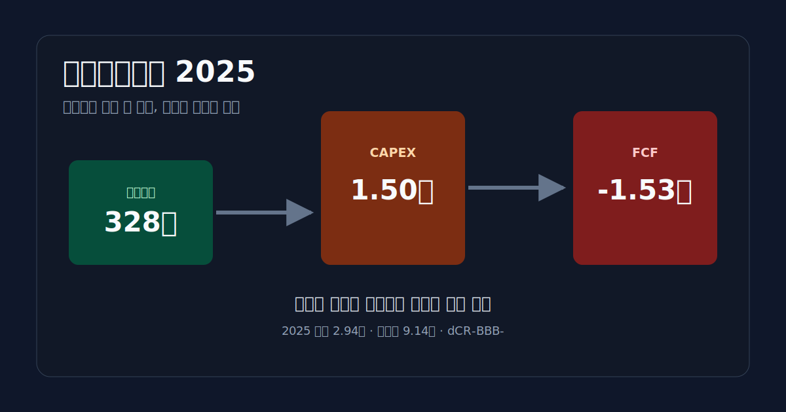
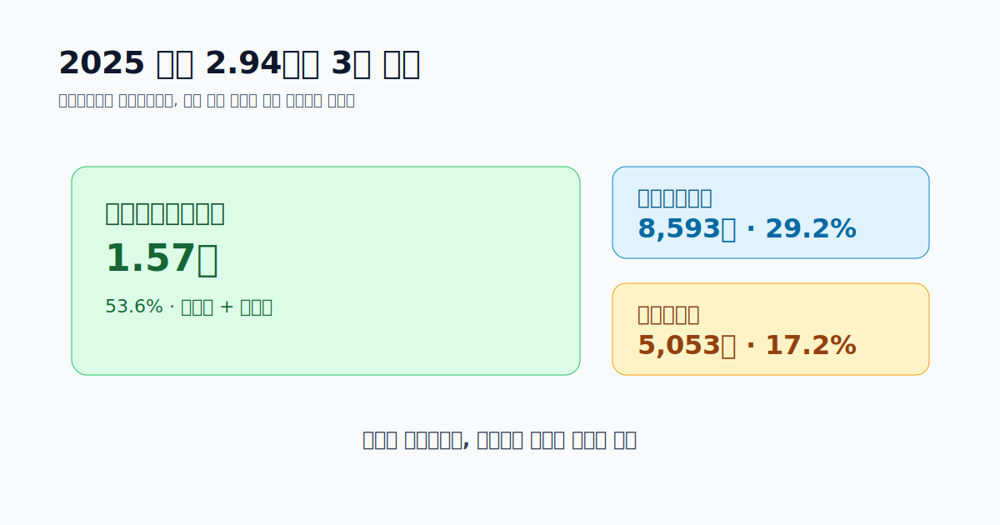
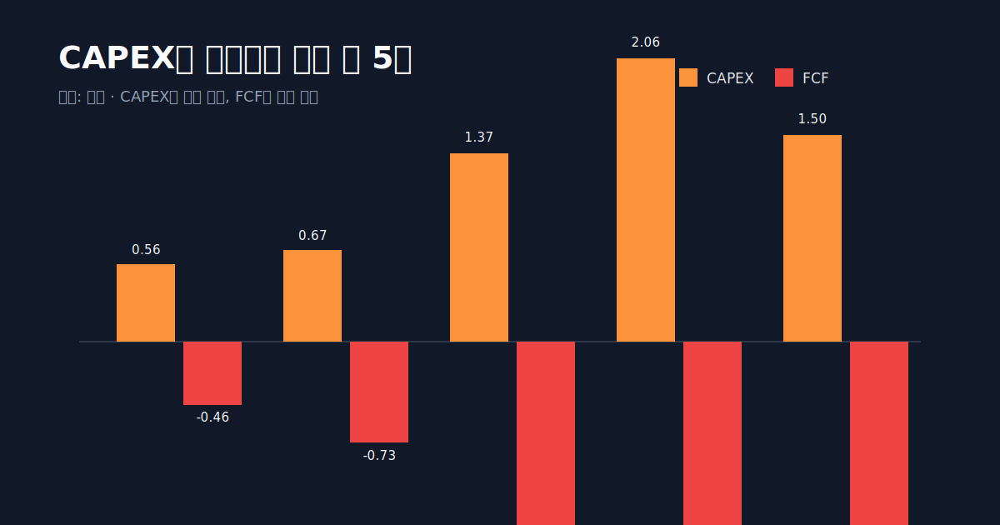
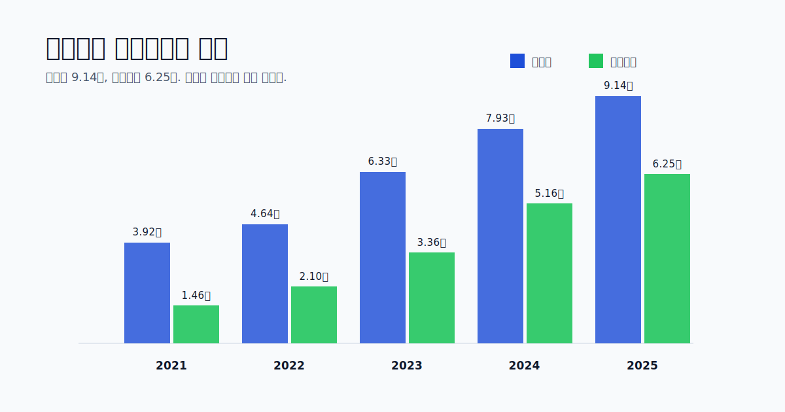
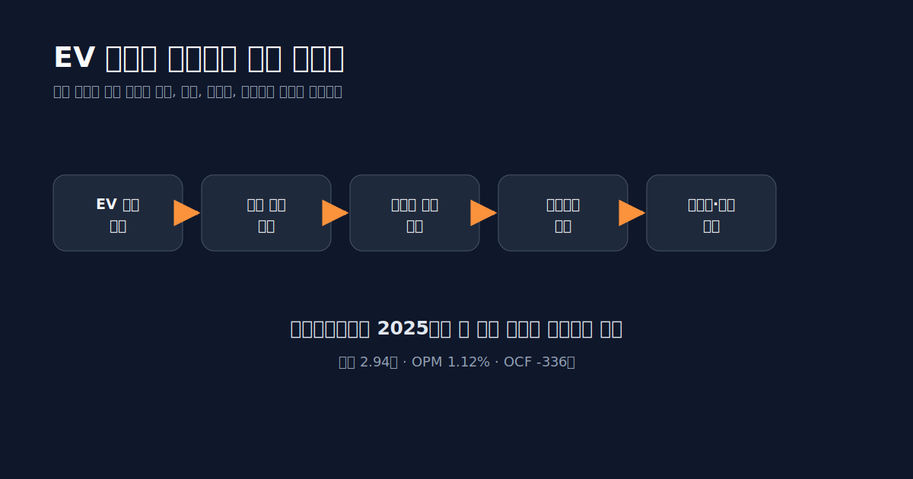
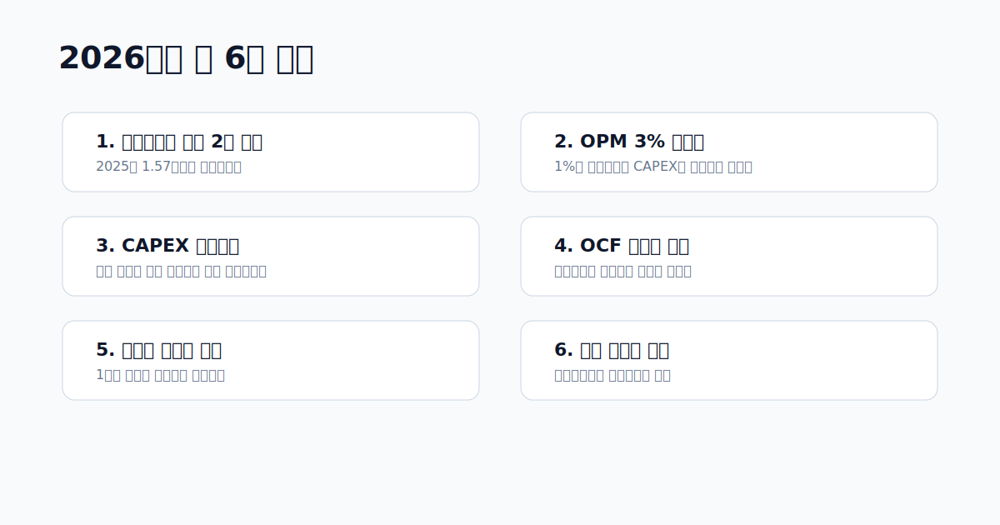

<script>
	import CompanyFinancials from '$lib/components/blog/CompanyFinancials.svelte';
import ComboChart from '$lib/components/blog/ComboChart.svelte';
import HFDataLink from '$lib/components/blog/HFDataLink.svelte';
</script>

> **자본집약** | 배터리소재 · 양극재 · 음극재 · 포스코 그룹 | 2026-04-29 dartlab 실측
> 같은 시리즈: [LG에너지솔루션](/blog/373220-lg-energy-solution) · [삼성SDI](/blog/006400-samsung-sdi) · [SK온](/blog/096770-sk-on) · [에코프로](/blog/086520-ecopro) · [롯데케미칼](/blog/011170-lotte-chemical)

<HFDataLink code="003670" />



포스코퓨처엠(003670)을 배터리 소재 성장주라고 부르는 건 틀리지 않다. 회사의 미래 질문은 양극재와 음극재에서 나온다. 전기차 배터리 한 셀 안에서 양극재는 원가의 큰 부분을 차지하고, 음극재는 중국 의존도를 낮춰야 하는 전략 품목이다. 포스코 그룹이 리튬·니켈·양극재·음극재를 한 묶음으로 키우려는 이유도 여기에 있다.

그런데 2025년 재무제표를 열면 성장주라는 단어만으로는 설명이 부족하다.

**영업이익은 328억원인데, CAPEX는 1조 4,989억원이다.**

영업현금흐름은 **-336억원**, FCF는 **-1조 5,325억원**이다. 매출은 2023년 4.76조에서 2025년 2.94조로 줄었다. 영업이익률은 2022년 5.02%에서 2025년 1.12%로 내려왔다. 자산은 2018년 0.95조에서 2025년 9.14조로 거의 10배가 됐다.

이게 이 글의 질문이다.

**포스코퓨처엠은 왜 이익보다 훨씬 큰 공장을 먼저 깔고 있나. 그리고 그 베팅은 언제 재무제표에서 보상받을 수 있나.**

답은 단순하지 않다. 포스코퓨처엠은 순수 양극재 회사가 아니다. 내화물, 라임화성, 에너지소재가 함께 있다. 전통 사업은 손익을 받치고, 에너지소재는 성장을 맡는다. 그런데 EV 캐즘과 리튬·니켈 가격 하락이 오면 성장 사업의 매출과 마진은 먼저 흔들리고, 이미 깔아둔 공장과 차입금은 재무제표에 남는다.

이 글은 포스코퓨처엠을 "배터리 소재 수혜주" 한 줄로 보지 않는다. **배터리 소재 선투자가 손익계산서, 현금흐름표, 자산구조, 그룹 지원을 어떻게 바꾸는지** DART 사업보고서와 dartlab 숫자로 읽는다.

---

## 프롤로그 — 포스코퓨처엠은 원래 배터리 회사가 아니었다

포스코퓨처엠을 제대로 읽으려면 양극재에서 바로 시작하면 안 된다. 이 회사의 오래된 뿌리는 포스코 제철소 옆에 있다. 과거 포스코켐텍, 포스코케미칼로 이어진 회사는 철강 공정에 필요한 내화물, 생석회, 화성품 같은 소재를 다뤘다. 뜨거운 쇳물을 담는 내화물, 제철 공정에 들어가는 라임, 코크스 공정에서 나오는 화성품. 화려한 성장 산업은 아니지만 포스코 생태계 안에서 반복 수요가 있는 사업이었다.

이 배경이 중요하다. 포스코퓨처엠은 갑자기 생긴 배터리 스타트업이 아니다. 기존 포스코 그룹 소재 회사가 배터리 소재로 방향을 틀며 몸집을 키운 사례다. 그래서 재무제표에는 두 성격이 겹쳐 있다. 하나는 철강 공정에 붙은 안정적 소재 사업이고, 다른 하나는 전기차 배터리 수요를 보고 먼저 공장을 짓는 성장 사업이다.

배터리 소재로 이동한 뒤 회사의 질문은 바뀌었다. 내화물 사업에서는 고객과 원료, 공정이 비교적 익숙했다. 양극재와 음극재에서는 리튬, 니켈, 흑연, 전구체, 고객 인증, 전기차 판매, 미국·중국 공급망 규제, 장기 공급계약이 모두 들어온다. 같은 소재 회사지만 위험의 종류가 달라진다.

이 변화가 2025년 숫자에 그대로 찍힌다. 에너지소재 사업은 미래의 중심이지만, EV 수요가 흔들리면 먼저 매출이 줄고 마진이 얇아진다. 반대로 내화물과 라임화성은 성장률은 낮아도 회사를 버티게 한다. 포스코퓨처엠의 2025년은 이 두 얼굴이 정면으로 충돌한 해다.

---

## 1막 — 2025년 숫자: 매출은 줄고, 공장은 늘었다

먼저 손익계산서를 본다.

```python
import dartlab

c = dartlab.Company("003670")
profit = c.analysis("financial", "수익성")
cash = c.analysis("financial", "현금흐름")
assets = c.analysis("financial", "자산구조")
```

| 연도 | 매출 | 영업이익 | 영업이익률 | 순이익 | 매출총이익률 |
| :--- | ---: | ---: | ---: | ---: | ---: |
| 2025 | 2.94조 | 328억 | 1.12% | 365억 | 8.72% |
| 2024 | 3.70조 | 7억 | 0.02% | -2,313억 | 6.38% |
| 2023 | 4.76조 | 359억 | 0.75% | 44억 | 5.40% |
| 2022 | 3.30조 | 1,659억 | 5.02% | 1,219억 | 10.14% |
| 2021 | 1.99조 | 1,217억 | 6.12% | 1,338억 | 11.97% |

표의 첫 줄만 보면 2025년은 회복처럼 보인다. 2024년 영업이익 7억원에서 2025년 328억원으로 올라왔다. 순손실도 흑자로 돌아왔다. 하지만 시계를 2022년으로 돌리면 그림이 달라진다. 2022년 영업이익은 1,659억원이었다. 2025년은 그 5분의 1 수준이다.

매출도 마찬가지다. 2023년 4.76조였던 매출은 2025년 2.94조로 내려왔다. 2년 만에 1.82조가 줄었다. 배터리 소재 성장주라면 매출이 매년 계단식으로 올라갈 것 같지만, 실제로는 리튬·니켈 가격 하락과 고객 수요 조정이 판매단가와 물량에 같이 영향을 줬다.

그런데 자산은 줄지 않았다. 오히려 늘었다. 총자산은 2023년 6.33조, 2024년 7.93조, 2025년 9.14조로 계속 커졌다. 매출은 줄었는데 자산은 커졌다. 이 조합이 포스코퓨처엠의 핵심이다.

<ComboChart data={[{year:"2025",매출액:29387,영업이익:328,순이익:365},{year:"2024",매출액:36999,영업이익:7,순이익:-2313},{year:"2023",매출액:47599,영업이익:359,순이익:44},{year:"2022",매출액:33019,영업이익:1659,순이익:1219},{year:"2021",매출액:19895,영업이익:1217,순이익:1338}]} lineKeys={["매출액"]} barKeys={["영업이익","순이익"]} lineColors={["#22c55e"]} barColors={["#3b82f6","#f59e0b"]} title="포스코퓨처엠 매출과 이익" unit="억원" />

이 회사의 2025년을 한 문장으로 줄이면 이렇다.

**손익계산서는 EV 캐즘을 맞았고, 재무상태표는 아직 성장 계획을 밀고 있다.**

---

## 2막 — 에너지소재는 주인공이지만, 2025년에는 방어선이 아니었다

포스코퓨처엠의 사업 부문은 크게 세 갈래다. 내화물사업, 라임화성사업, 에너지소재사업부. 2025년 부문 매출은 다음과 같다.

| 부문 | 2025년 매출 | 비중 |
| :--- | ---: | ---: |
| 내화물사업 | 5,053억원 | 17.2% |
| 라임화성사업 | 8,593억원 | 29.2% |
| 에너지소재사업부 | 1조 5,741억원 | 53.6% |
| 합계 | 2조 9,387억원 | 100.0% |

에너지소재가 절반을 넘는다. 이 사업부가 회사의 미래라는 점은 분명하다. 양극재와 음극재는 전기차 배터리의 핵심 소재이고, 비중국 공급망을 원하는 고객에게 포스코퓨처엠은 전략적 공급자가 될 수 있다. 포스코 그룹은 리튬·니켈·재활용·소재까지 연결하는 밸류체인을 만들려 한다.

하지만 2025년에는 그 미래 사업이 회사의 이익을 충분히 지켜주지 못했다. 에너지소재 매출은 2023~2024년의 기대보다 낮아졌고, 가격 하락과 가동률 부담이 마진을 눌렀다. 반대로 전통 사업인 내화물과 라임화성은 성장 스토리는 덜 화려하지만 포스코 그룹 철강 공정과 붙어 있어 손익 방어선 역할을 한다.



이 구조는 LG에너지솔루션, 삼성SDI, SK온과 다르다. [LG에너지솔루션](/blog/373220-lg-energy-solution)은 배터리 셀 자체가 중심이고, [삼성SDI](/blog/006400-samsung-sdi)는 EV 배터리 적자가 회사 전체를 크게 흔들었다. [SK온](/blog/096770-sk-on)은 비상장 자회사라 모회사 SK이노베이션의 손익과 신용에 충격이 섞여 들어간다.

포스코퓨처엠은 소재 회사다. 셀 회사보다 고객 단계가 앞에 있고, 원재료 가격과 고객사 생산계획에 더 민감하다. 그리고 철강 쪽 전통 사업이 함께 있다. 그래서 이 회사의 질문은 "전기차가 팔리나" 하나로 끝나지 않는다. **양극재·음극재 가격, 고객 인증, 공장 가동률, 포스코 그룹 원료 조달, 전통 소재 사업의 방어력**을 같이 봐야 한다.

---

## 3막 — CAPEX 1.50조: 이익보다 먼저 공장이 온다

2025년 포스코퓨처엠의 핵심 숫자는 CAPEX다. dartlab 현금흐름 분석 기준 2025년 CAPEX는 **1조 4,989억원**이다. 같은 해 영업이익은 328억원이다. 비율로 보면 CAPEX가 영업이익의 약 45.7배다.

| 연도 | 영업CF | CAPEX | FCF | 패턴 |
| :--- | ---: | ---: | ---: | :--- |
| 2025 | -336억 | 1.50조 | -1.53조 | 위기형 |
| 2024 | 6,709억 | 2.06조 | -1.39조 | 확장형 |
| 2023 | -4,448억 | 1.37조 | -1.81조 | 위기형 |
| 2022 | -610억 | 6,659억 | -7,269억 | 위기형 |
| 2021 | 1,030억 | 5,622억 | -4,592억 | 확장형 |

2021~2025년 누적 CAPEX는 약 **6.15조원**이다. 이 기간 누적 FCF는 계속 음수다. 이것은 실패라는 뜻이 아니다. 배터리 소재 사업의 경제학이 원래 그렇다는 뜻이다. 고객에게 양극재와 음극재를 공급하려면 공장을 먼저 지어야 한다. 고객 인증도 받아야 한다. 장기 공급계약을 따려면 "나중에 지을 수 있다"가 아니라 "언제 어느 공장에서 얼마를 납품할 수 있다"를 보여줘야 한다.

문제는 시간차다. 공장은 먼저 장부에 올라오고, 매출은 나중에 붙는다. EV 수요가 계획대로 커지면 선투자는 선점이 된다. EV 캐즘이 오면 선투자는 부담이 된다. 2025년 포스코퓨처엠은 이 시간차의 한가운데 있다.



이 대목에서 POSCO홀딩스의 역할이 나온다. 2025년 POSCO홀딩스는 포스코퓨처엠 등 이차전지 소재 자회사 유상증자에 약 1조원을 투입하겠다고 밝혔다. 회사는 이 자금을 양극재·음극재 생산능력 확대와 캐나다 합작 양극재 공장, 포항·광양 양극재 공장 확장 등에 쓰겠다고 설명했다. 이건 단순 자금 보충이 아니다. 그룹이 "EV 캐즘에도 이 소재 투자를 접지 않겠다"고 말한 사건이다. [POSCO Group Newsroom](https://newsroom.posco.com/en/posco-holdings-commits-krw-1-trillion-to-capital-increase-in-rechargeable-battery-material-subsidiaries-to-reinforce-responsible-management-of-core-businesses/)

투자자는 이 지점을 차갑게 봐야 한다. 그룹 지원은 장점이다. 자금 조달 창구가 열려 있고, 원료·소재 밸류체인 안에서 전략적 의미가 크다. 하지만 그룹 지원이 공장의 경제성을 대신 증명하지는 않는다. 결국 공장은 가동률, 판매단가, 고객 믹스, 원재료 가격을 통해 손익계산서로 증명되어야 한다.

---

## 4막 — 자산 9.14조: 성장주가 무거운 장치산업이 되는 순간

포스코퓨처엠의 자산 구조는 이 회사가 어디에 돈을 묶어두고 있는지 보여준다.

| 연도 | 총자산 | 유형자산 | 재고자산 | 현금 |
| :--- | ---: | ---: | ---: | ---: |
| 2025 | 9.14조 | 6.25조 | 8,411억 | 3,198억 |
| 2024 | 7.93조 | 5.16조 | 7,682억 | 6,442억 |
| 2023 | 6.33조 | 3.36조 | 9,167억 | 3,896억 |
| 2022 | 4.64조 | 2.10조 | 8,701억 | 2,814억 |
| 2021 | 3.92조 | 1.46조 | 4,406억 | 723억 |

2021년 1.46조였던 유형자산은 2025년 6.25조가 됐다. 4년 만에 4.3배다. 총자산도 3.92조에서 9.14조로 늘었다. 반면 매출은 2023년 4.76조를 정점으로 줄었다. 그러면 자산회전율은 낮아진다. 2025년 매출/총자산 회전은 0.32회 수준이다.

자산회전율이 낮아진다는 말은 공장과 장비가 매출을 충분히 만들기 전에 장부에 먼저 쌓였다는 뜻이다. 배터리 소재 회사는 이 구간을 반드시 지나간다. 하지만 지나가는 속도가 중요하다. 2026~2027년에 에너지소재 매출이 회복되고 가동률이 올라오면 이 자산은 성장 기반이 된다. 그렇지 않으면 감가상각, 금융비용, 재고평가손실의 부담이 된다.



여기서 포스코퓨처엠과 [한미반도체](/blog/042700-hanmi-semi), [리노공업](/blog/058470-rino-industrial)의 차이가 나온다. 한미반도체와 리노공업은 AI 공급망의 장비·소모품 회사다. 수요가 터지면 마진이 빠르게 올라갈 수 있고, 상대적으로 자산이 가볍다. 포스코퓨처엠은 다르다. 양극재·음극재는 화학 공장과 대량 생산 설비가 필요하다. 성장의 방향은 비슷해 보여도 재무제표의 무게가 다르다.

그래서 포스코퓨처엠을 "배터리 소재 성장주"라고만 읽으면 부족하다. 이 회사는 성장주이면서 동시에 장치산업이다. 장치산업은 항상 같은 질문을 받는다.

**공장이 깔린 뒤, 그 공장을 채울 수요가 충분히 빨리 오는가.**

---

## 5막 — 차입금과 유상증자: 누가 이 시간을 돈으로 버티나

공장을 먼저 짓는 회사는 돈이 필요하다. 포스코퓨처엠의 자금조달 구조를 보면 2025년 총자산 9.14조 중 금융차입이 약 2.99조, 자본금·자본잉여금이 약 2.60조, 이익잉여금이 0.77조다. 내부에서 번 돈보다 외부에서 조달한 돈의 비중이 크다.

dartlab 자금조달 분석은 이를 "외부 조달 우위 — 금융차입이 내부유보를 초과"로 진단한다. 금융차입 비중은 2018년 0.47%에서 2025년 32.65%로 뛰었다. 2018년의 포스코퓨처엠은 훨씬 가벼운 회사였고, 2025년의 포스코퓨처엠은 공장과 차입을 안은 회사다.

다만 자본구조가 당장 무너지는 그림은 아니다. 부채비율은 2025년 102.65%, 자기자본비율은 49%다. 단기차입금비중은 4.27%로 낮다. 유동비율도 130.86%다. 즉 단기 유동성은 아주 나쁘지 않다. 문제는 만기보다 수익성이다.

신용 분석에서 가장 아픈 항목은 현금흐름과 채무상환능력이다. dCR은 포스코퓨처엠을 **dCR-BBB-**로 평가한다. 투자적격의 마지막 구간이다. EBITDA/이자비용은 0.21배로 낮고, Debt/EBITDA는 90.96배로 높게 잡힌다. 영업이익이 얇고 감가상각 전 이익도 충분하지 않은데 차입과 설비가 커졌기 때문이다.

이 말은 "곧 위험하다"가 아니다. 더 정확히는 "그룹 지원과 자본시장이 시간을 주고 있지만, 손익계산서가 아직 그 시간을 갚지 못했다"다.

---

## 6막 — EV 캐즘은 손익보다 먼저 가격표를 바꾼다

배터리 소재 회사의 매출은 단순히 물량만으로 결정되지 않는다. 양극재 가격은 리튬, 니켈, 코발트 같은 금속 가격과 연동된다. 금속 가격이 내려가면 고객에게 파는 단가도 내려간다. 그래서 물량이 유지돼도 매출이 줄 수 있다. 반대로 고가 원재료 재고를 갖고 있을 때 가격이 내려가면 재고평가손실이 생길 수 있다.

2024년 포스코퓨처엠의 실적 발표에서 회사는 리튬 가격 하락과 전기차 수요 둔화, 음극재 판매 감소가 매출과 수익성에 부담을 줬다고 설명했다. 2024년 매출은 3.6999조, 영업이익은 7억원 수준으로 급감했다. 2025년에는 영업이익이 328억원으로 회복됐지만, 2022년 수준에는 아직 멀다. [POSCO Future M 2024 results](https://newsroom.posco.com/en/posco-future-m-announces-2024-financial-results/)

이 대목에서 EV 캐즘이라는 단어를 조심해야 한다. EV 캐즘은 "전기차가 끝났다"가 아니다. 더 정확히는 수요 성장 속도가 기존 공장 증설 계획보다 느려진 구간이다. 셀 업체와 소재 업체가 이미 지은 공장, 이미 체결한 장기 계약, 이미 조달한 원료가 수요 둔화를 만나면 회계 숫자가 먼저 흔들린다.

[삼성SDI](/blog/006400-samsung-sdi)는 이 구간에서 영업적자로 밀렸다. [LG에너지솔루션](/blog/373220-lg-energy-solution)은 AMPC와 고객 포트폴리오로 흑자를 지켰지만 금융비용 부담이 컸다. [SK온](/blog/096770-sk-on)은 Ford JV 재편과 손상 이슈가 모회사 손익에 크게 나타났다. 포스코퓨처엠은 셀 업체보다 앞단에 있는 소재 회사로서 가격과 가동률의 충격을 받았다.



그래서 2026년 포스코퓨처엠의 회복을 보려면 전기차 판매량 headline만 보면 안 된다. 봐야 할 것은 양극재 판가, 출하량, 공장 가동률, 재고평가손실, 에너지소재 부문 손익이다. 특히 음극재는 비중국 공급망이라는 전략성이 있지만, 실제 손익 개선은 고객 인증과 물량이 따라와야 가능하다.

---

## 7막 — 음극재는 옵션이 아니라 공급망 정치다

포스코퓨처엠의 흥미로운 지점은 음극재다. 양극재는 한국 소재 업체들이 많이 뛰어든 시장이지만, 음극재는 중국 의존도가 훨씬 강하다. 천연흑연, 인조흑연, 실리콘계 음극재는 전기차 배터리 공급망에서 지정학적 의미가 커졌다. 미국과 유럽이 중국 의존도를 낮추려 하면 한국 음극재 업체에는 기회가 생긴다.

2026년 3월 POSCO Future M은 약 1조원 규모의 인조흑연 음극재 공급 계약을 발표했다. 회사는 국내 배터리 업체와 GM 등 고객에게 음극재를 공급해 왔고, 천연흑연 음극재 계약에 이어 인조흑연 쪽에서도 수주 기반을 넓히겠다고 설명했다. [POSCO Group Newsroom](https://newsroom.posco.com/en/posco-future-m-secures-krw-1-trillion-artificial-graphite-anode-order-laying-the-groundwork-for-a-quantum-leap-in-the-anode-business/)

이 계약은 2025년 재무제표에는 아직 충분히 반영되지 않았다. 하지만 관전 포인트를 바꾼다. 포스코퓨처엠이 단순 양극재 가격 사이클 회사로만 남을지, 아니면 비중국 음극재 공급망의 전략 자산이 될지의 문제다.

다만 여기서도 같은 원칙이 적용된다. 계약은 매출의 선행지표이지 현금흐름의 보증서가 아니다. 음극재 공장도 선투자와 고객 인증이 필요하다. 가동률이 낮으면 고정비가 먼저 온다. 고객이 원하는 품질과 가격을 맞추지 못하면 전략성은 손익으로 바뀌지 않는다.

그래서 음극재를 볼 때 질문은 세 가지다.

첫째, 수주가 실제 출하로 이어지는가.

둘째, 출하가 영업이익률을 높이는가.

셋째, 음극재 투자가 추가 차입 없이 진행되는가.

이 세 가지가 맞아야 "공급망 정치"가 재무제표의 이익으로 바뀐다.

---

## 8막 — 포스코 그룹이라는 안전망과 족쇄

포스코퓨처엠은 독립된 소재 회사이면서 포스코 그룹의 전략 회사다. 이 점은 장점과 단점을 동시에 만든다.

장점부터 보자. 포스코 그룹은 철강, 리튬, 니켈, 소재, 재활용을 묶어 배터리 밸류체인을 만들려 한다. 포스코퓨처엠은 그 밸류체인의 가공·소재 단에 있다. 그룹이 원료와 고객, 자금 조달을 지원하면 단독 소재 회사보다 버틸 수 있는 시간이 길어진다. 2025년 1조원 규모 유상증자 참여도 이런 맥락이다.

단점도 있다. 그룹 전략 회사는 사이클이 나쁘다고 쉽게 투자를 접기 어렵다. 포스코퓨처엠의 배터리 소재 투자는 단순히 한 회사의 ROIC 계산만이 아니라 그룹의 미래 포트폴리오 전략과 연결된다. 그러면 단기 손익이 나빠도 투자가 계속될 수 있다. 투자자 입장에서는 이것이 안정망이면서 동시에 자본효율 부담이다.

이 구조는 POSCO홀딩스 자체를 분석할 때도 핵심이 된다. 포스코 그룹의 배터리 소재 전략은 장기적으로는 철강 이후 성장 축을 만드는 일이다. 그러나 2025년 숫자만 보면 아직 "성장 축"이라기보다 "현금을 쓰는 축"이다. 포스코퓨처엠은 그 긴장감을 가장 직접적으로 보여주는 계열사다.

---

## 9막 — 경쟁사와 비교하면 포스코퓨처엠의 자리가 보인다

포스코퓨처엠은 에코프로비엠, 엘앤에프, LG화학 양극재, 중국 소재 업체들과 경쟁한다. dartlab 블로그 안에서는 [에코프로](/blog/086520-ecopro), [LG에너지솔루션](/blog/373220-lg-energy-solution), [삼성SDI](/blog/006400-samsung-sdi), [SK온](/blog/096770-sk-on)과 연결해 보는 것이 더 유용하다.

| 비교 대상 | 포스코퓨처엠과 다른 점 | 포스코퓨처엠을 볼 때 얻는 질문 |
| :--- | :--- | :--- |
| LG에너지솔루션 | 셀 제조, AMPC, 글로벌 JV 중심 | 소재 가격 하락이 셀 업체보다 먼저 오는가 |
| 삼성SDI | 프리미엄 셀, EV 부진에 영업적자 | 고객 포트폴리오 차이가 소재 출하에 어떻게 반영되는가 |
| SK온 | 비상장 셀 자회사, Ford JV 재편 | 고객 물량 변화가 공장 손상으로 이어지는가 |
| 에코프로 | 양극재 밸류체인 순수도 높음 | 양극재 가격 사이클과 자본조달 부담을 어떻게 나눠 갖는가 |
| 롯데케미칼 | 범용 석유화학 스프레드 붕괴 | 소재업도 가격결정력이 없으면 매출 규모가 방어선이 되지 않음 |

이 비교에서 포스코퓨처엠의 특징은 "전략성은 강하지만, 손익 증명은 아직 약하다"다. 양극재와 음극재 모두 배터리 공급망에서 중요한 위치다. 중국 의존도를 낮추려는 흐름도 우호적이다. 하지만 2025년 손익계산서는 아직 높은 마진을 보여주지 못한다.

반대로 이 회사를 단순 부실 회사로 보는 것도 틀리다. 부채비율 102.65%, 단기차입금비중 4.27%, POSCO홀딩스 지원, 영업자산 중심 구조를 보면 당장 유동성 위기라고 보긴 어렵다. 문제는 생존이 아니라 투자수익률이다.

**포스코퓨처엠의 핵심 질문은 망하느냐가 아니라, 이미 깔아둔 9조 자산이 어느 시점에 5% 이상의 영업이익률을 만들 수 있느냐다.**

---

## 10막 — 2026년에 볼 숫자는 매출보다 가동률과 현금흐름이다

2026년 포스코퓨처엠을 볼 때 매출 성장률만 보면 부족하다. 매출은 금속 가격에 따라 흔들릴 수 있다. 판매량이 늘어도 판가가 내려가면 매출은 크게 늘지 않을 수 있다. 반대로 금속 가격이 오르면 매출은 커져 보이지만 실제 마진은 따라오지 않을 수 있다.

따라서 체크리스트는 다음 순서가 맞다.



**첫째, 에너지소재 매출이 다시 2조원대로 올라오는가.**

2025년 에너지소재 매출은 1.57조다. 회사 전체의 미래가 이 사업부에 있다면, 회복은 부문 매출에서 먼저 보여야 한다.

**둘째, 영업이익률이 3%를 넘는가.**

2025년 OPM 1.12%는 너무 얇다. CAPEX와 이자비용을 감당하려면 1%대 마진으로는 부족하다. 2022년 5.02%까지는 아니더라도 3% 이상으로 올라오는지가 첫 방어선이다.

**셋째, CAPEX가 매출보다 빠르게 줄거나 매출이 CAPEX를 앞지르는가.**

CAPEX 1.50조는 미래를 위한 돈이다. 하지만 매년 이 규모가 반복되면 외부 조달 의존이 커진다.

**넷째, 영업현금흐름이 플러스로 안정되는가.**

2025년 OCF -336억원은 손익과 현금이 어긋난 신호다. 재고와 매출채권, 고객 결제조건이 같이 개선돼야 한다.

**다섯째, 음극재 수주가 실제 출하와 이익으로 바뀌는가.**

비중국 음극재 공급망은 매력적이다. 하지만 출하와 이익률이 확인되기 전까지는 전략 옵션이다.

**여섯째, POSCO홀딩스 지원이 주주 희석과 자본효율을 어떻게 바꾸는가.**

그룹 지원은 신용을 지키지만, 유상증자와 투자 지속은 기존 주주 입장에서 희석과 낮은 ROE를 동반할 수 있다.

---

## 11막 — 독자가 직접 재현하는 순서

이 글은 "배터리 소재 유망"이라는 의견에서 시작하지 않았다. 숫자의 순서는 반대다.

먼저 손익계산서에서 2023년 매출 4.76조가 2025년 2.94조로 줄었는지 확인한다. 여기서 EV 캐즘과 가격 하락의 흔적이 보인다.

두 번째로 영업이익률을 본다. 2022년 5.02%에서 2025년 1.12%로 내려간다. 이 순간 "성장 산업인데 왜 마진이 얇은가"라는 질문이 생긴다.

세 번째로 현금흐름표를 본다. 2025년 영업CF -336억원, CAPEX 1.50조, FCF -1.53조. 여기서 이 글의 관통선이 나온다. 이익보다 공장이 먼저 온다.

네 번째로 자산구조를 본다. 유형자산 6.25조, 총자산 9.14조. 이 회사는 이제 가벼운 소재 회사가 아니라 무거운 장치산업 회사다.

다섯 번째로 공시와 그룹 뉴스를 붙인다. 2025년 POSCO홀딩스의 1조원 유상증자 참여, 2026년 인조흑연 음극재 공급 계약, 2025년 사업보고서 부문 매출을 연결하면 왜 회사가 투자를 멈추지 않는지 보인다.

```python
import dartlab

c = dartlab.Company("003670")
profit = c.analysis("financial", "수익성")
cash = c.analysis("financial", "현금흐름")
funding = c.analysis("financial", "자금조달")
quality = c.analysis("financial", "이익품질")

print(profit["marginTrend"]["history"][0])
print(cash["cashFlowOverview"]["history"][0])
print(funding["fundingSources"]["latest"])
print(quality["accrualAnalysis"]["history"][0])
```

이 순서를 익히면 포스코퓨처엠 하나만 읽는 게 아니라 배터리 소재 업종 전체를 읽을 수 있다. [삼성SDI](/blog/006400-samsung-sdi)는 셀 공장의 가동률과 고객 믹스를 봐야 했다. [SK온](/blog/096770-sk-on)은 합작공장과 모회사 신용을 봐야 했다. 포스코퓨처엠은 양극재·음극재 공장이 손익보다 먼저 커지는지를 봐야 한다.

---

## 결론 — 포스코퓨처엠은 실패한 성장주가 아니라, 아직 증명 전인 장치산업이다

포스코퓨처엠의 2025년을 좋다 나쁘다로만 자르면 틀린다.

좋은 쪽은 분명하다. 회사는 배터리 소재 공급망에서 전략적 위치를 갖고 있다. 양극재와 음극재를 함께 다루고, 포스코 그룹의 리튬·니켈·소재 밸류체인 안에 있다. POSCO홀딩스의 자금 지원도 있다. 비중국 음극재 공급망이라는 장기 테마도 있다.

나쁜 쪽도 분명하다. 2025년 영업이익은 328억원뿐이다. 영업현금흐름은 -336억원이다. CAPEX는 1.50조, FCF는 -1.53조다. 자산은 9.14조까지 커졌고, dCR은 BBB-로 투자적격 마지막 구간이다. 이 회사는 미래를 위해 이미 큰돈을 썼지만, 그 미래가 아직 손익계산서에 충분히 오지 않았다.

그래서 결론은 이렇다.

**포스코퓨처엠은 배터리 소재 수혜주이지만, 2025년 현재는 수혜보다 선투자의 무게가 더 크게 보이는 회사다.**

2026년부터 봐야 할 것은 화려한 수주 뉴스가 아니다. 에너지소재 매출이 회복되는지, OPM이 3%를 넘는지, FCF 적자가 줄어드는지, 음극재 수주가 출하와 이익으로 바뀌는지다. 이 네 가지가 같이 움직이면 2025년의 CAPEX는 선점이 된다. 그렇지 않으면 공장은 남고, 이익은 늦게 오는 장치산업의 전형이 된다.

---

## 검증표

| 주장 | 수치 | 근거 |
| :--- | ---: | :--- |
| 2025년 매출 | 2.94조 | dartlab 수익성, DART 2025 사업보고서 |
| 2025년 영업이익 | 328억원 | dartlab 수익성 |
| 2025년 CAPEX | 1.50조 | dartlab 현금흐름 |
| 2025년 FCF | -1.53조 | dartlab 현금흐름 |
| 2025년 에너지소재 매출 | 1.57조 | dartlab 부문정보 |
| 2025년 총자산 | 9.14조 | dartlab 자산구조 |
| 2025년 유형자산 | 6.25조 | dartlab 자산구조 |
| dCR 등급 | BBB- | dartlab 신용분석 |
| POSCO홀딩스 1조원 유상증자 참여 | 2025-05-16 발표 | POSCO Group Newsroom |
| 인조흑연 음극재 1조원 공급 계약 | 2026년 발표 | POSCO Group Newsroom |

## 외부 출처

- [DART — 포스코퓨처엠 2025 사업보고서](https://dart.fss.or.kr/dsaf001/main.do?rcpNo=20260312000826)
- [POSCO Group Newsroom — POSCO Future M 2024 financial results](https://newsroom.posco.com/en/posco-future-m-announces-2024-financial-results/)
- [POSCO Group Newsroom — POSCO Holdings 1조원 유상증자 참여](https://newsroom.posco.com/en/posco-holdings-commits-krw-1-trillion-to-capital-increase-in-rechargeable-battery-material-subsidiaries-to-reinforce-responsible-management-of-core-businesses/)
- [POSCO Group Newsroom — 인조흑연 음극재 1조원 공급 계약](https://newsroom.posco.com/en/posco-future-m-secures-krw-1-trillion-artificial-graphite-anode-order-laying-the-groundwork-for-a-quantum-leap-in-the-anode-business/)

## 같은 시리즈에서 이어 읽기

- [LG에너지솔루션 — 매출 30% 줄었는데 영업이익은 2배](/blog/373220-lg-energy-solution)
- [삼성SDI — 2년 만에 이익이 3.3조 사라졌다](/blog/006400-samsung-sdi)
- [SK온 — 11조 합작공장을 접자 5.6조 순손실이 찍혔다](/blog/096770-sk-on)
- [에코프로 — 양극재 사이클과 지주회사 구조](/blog/086520-ecopro)
- [롯데케미칼 — 매출 18조 회사가 왜 3년째 적자인가](/blog/011170-lotte-chemical)

---

<CompanyFinancials code="003670" />
