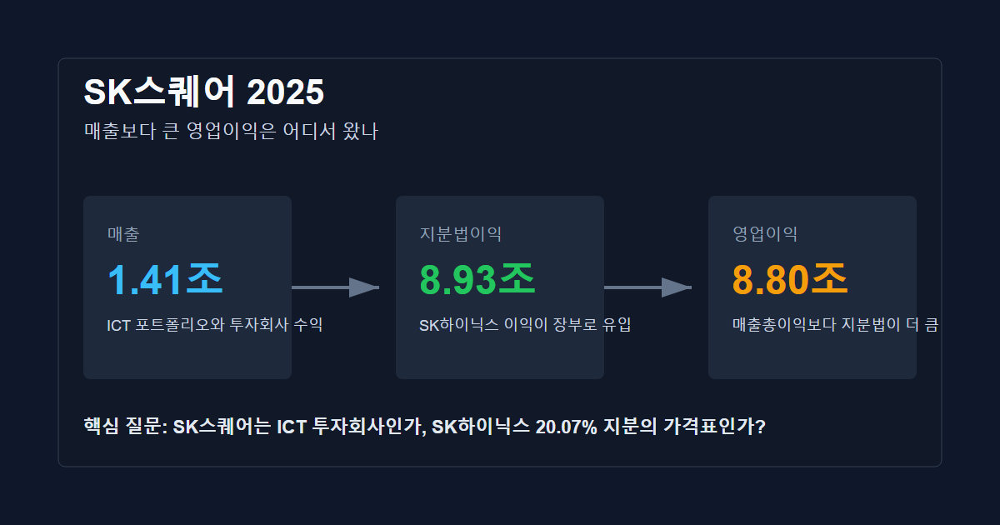
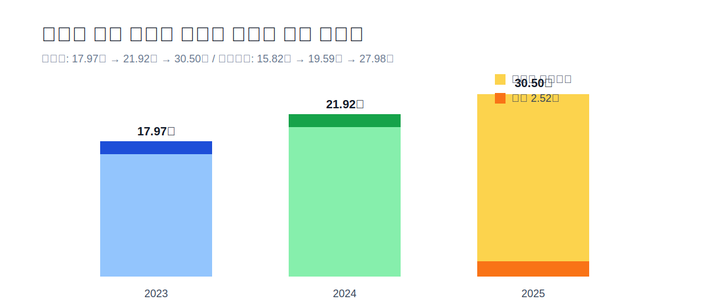
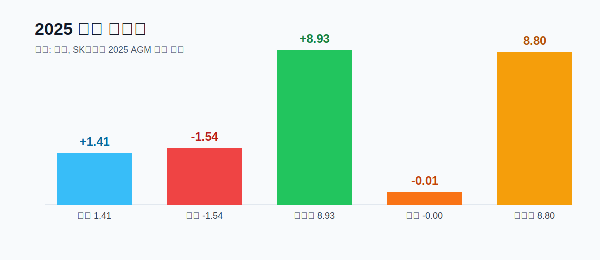
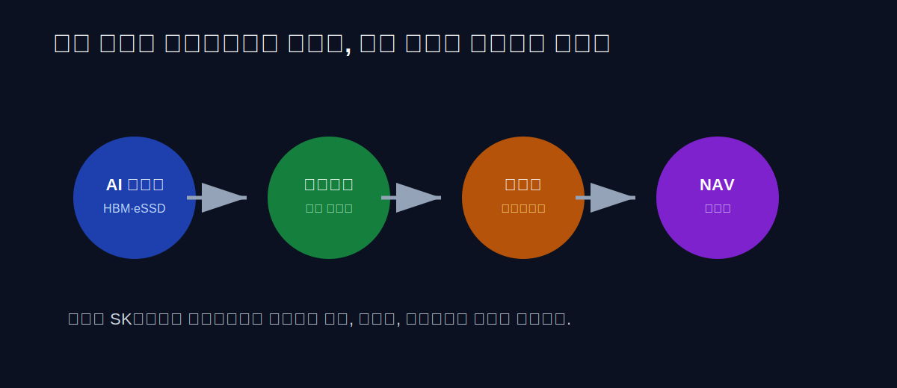
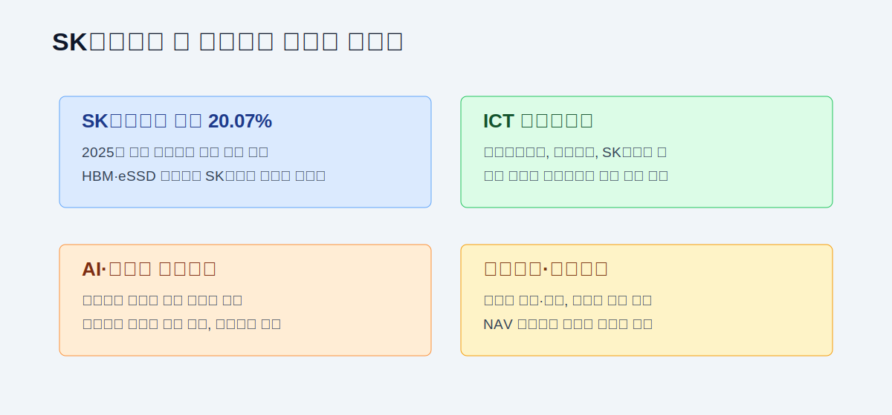
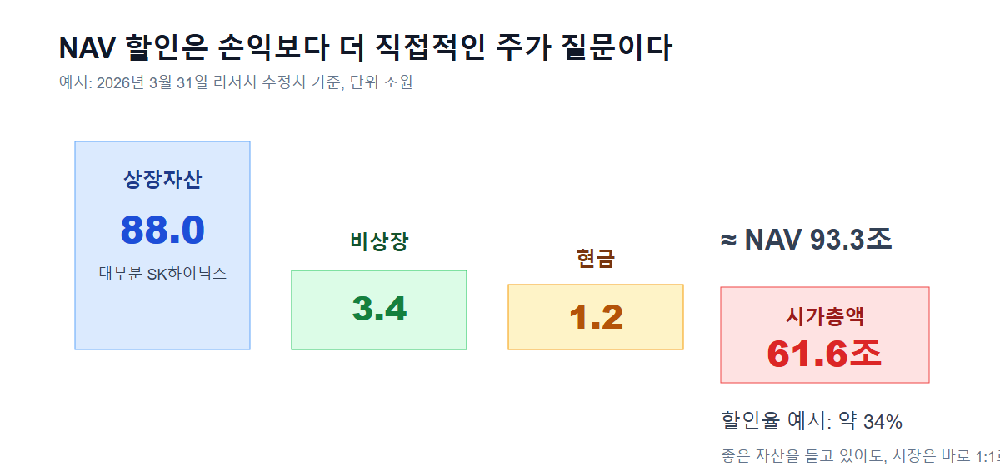
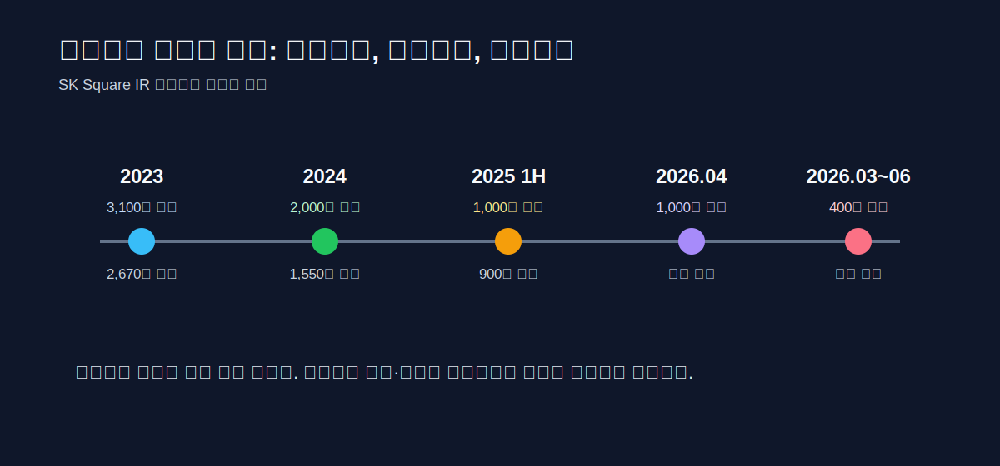
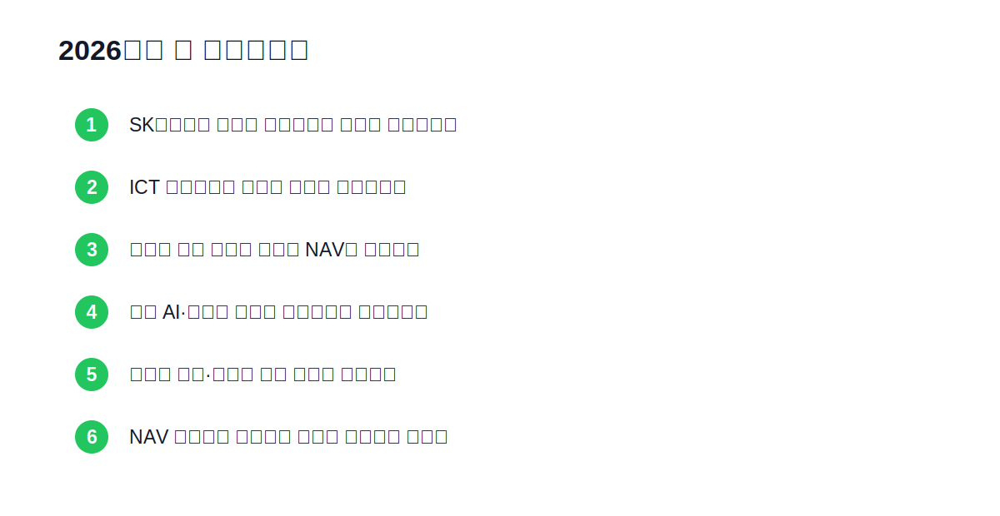

<script>
import ComboChart from '$lib/components/blog/ComboChart.svelte';
import HFDataLink from '$lib/components/blog/HFDataLink.svelte';
import StackBar from '$lib/components/blog/StackBar.svelte';
</script>

> **지주회사** | SK하이닉스 · 지분법이익 · AI 메모리 · NAV 할인 | 2026-04-29 dartlab 실측
> 같은 시리즈: [SK하이닉스](/blog/000660-skhynix) · [SK텔레콤](/blog/017670-skt) · [NAVER](/blog/naver) · [카카오](/blog/kakao) · [메리츠금융지주](/blog/138040-meritz-financial)

<HFDataLink code="402340" />



SK스퀘어(402340)를 일반 사업회사처럼 읽으면 첫 줄부터 막힌다.

2025년 연결 매출은 **1조 4,115억원**이다. 그런데 영업이익은 **8조 7,974억원**이다. 순이익은 **8조 8,187억원**이다. 매출보다 영업이익이 6배 넘게 크다. 제조업, 플랫폼, 유통, 통신, 게임 어느 틀에 넣어도 이상하다.

이 이상함이 이 글의 출발점이다.

**SK스퀘어는 무엇을 팔아서 8.8조를 번 회사인가?**

정답은 "상품을 팔아서"가 아니다. **SK하이닉스 지분을 들고 있었기 때문**이다. SK스퀘어 2025년 AGM 자료에는 지분법손익이 **8조 9,304억원**, 그중 지분법이익이 **9조 440억원**으로 표시된다. 같은 해 영업이익 8조 7,974억원보다 지분법이익이 더 크다. 즉 2025년 SK스퀘어 손익계산서의 주인공은 티맵, 원스토어, 11번가, SK플래닛이 아니라 SK하이닉스다.

이 회사의 진짜 이야기는 여기 있다.

SK스퀘어는 2021년 SK텔레콤에서 인적분할되어 나온 투자회사다. SK텔레콤 본체는 통신 사업을 남겼고, SK스퀘어는 SK하이닉스 지분과 ICT 투자 포트폴리오를 들고 나왔다. 말은 "반도체·ICT 투자전문회사"였지만, 시장이 이 회사를 보는 방식은 훨씬 노골적이다.

**SK스퀘어는 SK하이닉스 20.07% 지분의 가격표인가, 아니면 그 지분을 활용해 새 투자회사가 될 수 있는가.**

2025년 숫자는 이 질문을 더 크게 만든다. SK하이닉스는 AI 메모리, HBM, eSSD 수요를 타고 매출 **97조 1,467억원**, 영업이익 **47조 2,063억원**, 순이익 **42조 9,479억원**을 냈다. SK스퀘어는 그 이익을 지분법으로 인식했다. 그래서 SK스퀘어의 매출은 줄었는데 영업이익은 폭발했다.

이 글은 SK스퀘어를 "하이닉스 수혜주" 한 줄로 끝내지 않는다. 그건 너무 쉽다. 진짜 문제는 그 다음이다. 하이닉스가 벌어준 이익은 SK스퀘어의 손익계산서에 찍힌다. 하지만 투자자는 손익계산서가 아니라 **순자산가치(NAV), 할인율, 자사주, 포트폴리오 정리, 신규 투자**를 같이 산다. 그래서 SK스퀘어는 좋은 해에도 단순하지 않다.

---

## 프롤로그 — SK스퀘어는 SK텔레콤에서 떨어져 나온 질문이다

### 분할은 회사 이름 변경이 아니라 위험의 분리였다

SK스퀘어를 이해하려면 2025년 이익보다 먼저 2021년 분할을 봐야 한다.

원래 SK텔레콤은 통신회사이면서 동시에 SK하이닉스를 보유한 회사였다. 이동통신, IPTV, 유선인터넷으로 안정적인 현금을 벌고, 그 위에 하이닉스라는 거대한 반도체 자산을 들고 있었다. 그런데 통신과 반도체 투자는 성격이 다르다. 통신은 규제산업이고 배당주다. 반도체는 사이클 산업이고 성장주다. 하나의 주식 안에 두 성격이 섞이면 투자자는 어느 쪽에도 온전히 가격을 매기기 어렵다.

그래서 SK텔레콤은 회사를 둘로 나눴다.

하나는 통신 본체인 SK텔레콤. 다른 하나가 SK스퀘어다. SK스퀘어는 SK하이닉스 지분, 11번가, 티맵모빌리티, 원스토어, SK플래닛, 콘텐츠·커머스·모빌리티 관련 투자자산을 들고 출발했다. 구조만 보면 "투자회사"다. 더 정확히 말하면 **SK그룹 ICT 자산을 담은 중간 지주형 투자회사**다.

분할 당시 시장의 질문은 두 갈래였다. 통신 본체는 배당주로 단순해질 수 있는가. 그리고 SK스퀘어는 하이닉스 지분을 단순 보유하는 그릇을 넘어, 그 지분을 기반으로 새 투자를 만들 수 있는가. 이 질문은 2026년에도 그대로 살아 있다. 분할은 회사 이름을 바꾼 이벤트가 아니라, 투자자가 사는 위험을 둘로 찢은 사건이었다.

SK텔레콤을 사는 투자자는 가입자, 요금제, 설비투자, 배당을 산다. SK스퀘어를 사는 투자자는 하이닉스 지분, 비상장 ICT 포트폴리오, 자본배치 판단, 지주회사 할인율을 산다. 같은 그룹에서 나왔지만 재무제표의 문법이 완전히 다르다. 이 차이를 놓치면 SK스퀘어의 2025년 실적은 "매출보다 이익이 큰 이상한 회사"로만 보인다.

### 투자회사는 손익보다 번역 능력으로 평가된다

그런데 투자회사는 숫자를 읽는 방식이 다르다. 제조업이면 매출, 원가, 가동률, CAPEX를 본다. 플랫폼이면 MAU, 광고 매출, 결제액, take rate를 본다. 지주회사나 투자회사는 보유자산 가치와 할인율을 본다. 손익계산서 이익이 크더라도 그 이익이 현금 배당으로 들어오는지, 자산 가치가 실제 매각 가능한지, 주주에게 환원되는지에 따라 가격이 달라진다.

이 지점에서 SK스퀘어의 난도가 올라간다. 2025년 SK스퀘어는 엄청난 이익을 냈다. 하지만 그 이익의 대부분은 자체 사업에서 나온 돈이 아니다. SK하이닉스가 번 돈 중 SK스퀘어 지분 몫이 장부에 들어온 것이다. 장부상 이익과 현금 유입은 다르다. 지분법이익은 손익계산서에 찍히지만, 그 전부가 현금으로 들어오지는 않는다. 현금은 배당, 지분 매각, 자산 유동화, 차입, 자사주 정책을 통해 따로 움직인다.

그래서 SK스퀘어는 "이익이 크다"에서 끝내면 안 된다. **이익의 출처, 현금화 경로, 자본배치 의지**를 같이 봐야 한다.

---

## 1막 — 2025년 숫자: 매출 1.41조, 영업이익 8.80조

### 영업이익률 623%라는 이상한 숫자

2025년 SK스퀘어의 표면 숫자는 강하다.

| 항목 | 2023 | 2024 | 2025 |
|---|---:|---:|---:|
| 매출 | 2.28조 | 1.91조 | 1.41조 |
| 영업이익 | -2.34조 | 3.91조 | 8.80조 |
| 순이익 | -1.31조 | 3.65조 | 8.82조 |
| 총자산 | 17.97조 | 21.92조 | 30.50조 |
| 자기자본 | 15.82조 | 19.59조 | 27.98조 |

이 표만 봐도 이상한 점이 세 개 있다.

첫째, 매출은 줄었다. 2023년 2.28조에서 2025년 1.41조로 내려왔다. 일반 사업회사라면 성장 둔화다. 그런데 영업이익은 같은 기간 -2.34조에서 +8.80조로 11조원 넘게 개선됐다.

둘째, 영업이익률이라는 지표가 거의 의미를 잃는다. 2025년 영업이익률은 매출 대비 **623%**다. 이건 "마진이 좋은 회사"라는 뜻이 아니다. 매출과 영업이익의 출처가 다르다는 뜻이다. 매출은 포트폴리오 회사의 영업수익이고, 이익은 지분법손익이 먹고 들어온다.

셋째, 자산이 빠르게 커졌다. 총자산은 2023년 17.97조에서 2025년 30.50조가 됐다. 부채는 2.52조에 불과하다. 자기자본이 27.98조다. SK스퀘어는 공장을 잔뜩 지어서 자산이 커진 회사가 아니다. 보유 지분 가치와 이익잉여금이 자본을 키운 회사다.



숫자의 결론은 분명하다. SK스퀘어의 2025년은 매출 성장의 해가 아니다. **지분 가치 재평가와 지분법이익의 해**다.

### 자산 30.50조의 대부분은 공장이 아니다

AGM 자료의 재무 요약은 이 구조를 더 단순하게 보여준다. 연결 기준 자산은 **30조 5,045억원**, 부채는 **2조 5,214억원**, 자기자본은 **27조 9,832억원**이다. 부채가 회사를 밀어 올린 게 아니다. 하이닉스 지분과 관련 이익이 자기자본을 키웠다. 그래서 SK스퀘어의 재무제표는 제조업의 "투자→공장→감가상각→매출" 흐름이 아니라, 투자회사의 "지분→이익 인식→자본 증가→할인율" 흐름으로 읽어야 한다.

---

## 2막 — 손익계산서를 먹은 지분법

### 매출과 이익이 다른 층에서 온다

SK스퀘어 2025년 AGM 자료를 보면 구조가 더 선명하다.



2025년 계속영업 기준 매출은 **1조 4,115억원**이다. 영업비용은 **1조 5,445억원**이다. 여기까지만 보면 영업 자체는 -1,330억원 수준으로 보인다. 그런데 그 다음 줄에 지분법손익 **8조 9,304억원**이 들어온다. 그 결과 영업이익은 **8조 7,974억원**이 된다.

이 구조를 문장으로 바꾸면 이렇다.

**SK스퀘어의 2025년 영업이익은 사업 마진이 아니라 보유 지분의 이익 몫으로 만들어졌다.**

이건 나쁜 말이 아니다. 투자회사의 본질이 그렇다. 버크셔 해서웨이도 보험 영업과 투자자산이 섞여 있고, 일본 종합상사도 사업과 지분투자가 함께 간다. 문제는 투자자가 무엇을 사고 있는지 정확히 알아야 한다는 것이다. SK스퀘어를 티맵·커머스·앱마켓 회사로 보면 2025년 이익을 설명할 수 없다. SK하이닉스 지분을 담은 투자회사로 봐야 설명된다.

그래서 2025년 SK스퀘어의 핵심 지표는 영업이익률이 아니다. 다음 네 가지다.

### 첫째, SK하이닉스 이익 사이클

하이닉스가 HBM과 eSSD로 얼마를 버는지가 SK스퀘어 지분법손익을 결정한다. 2025년 하이닉스는 매출 97.15조, 영업이익 47.21조, 순이익 42.95조를 냈다. SK스퀘어의 지분법이익은 이 사이클의 결과다.

### 둘째, 지분법이익의 현금화 가능성

지분법이익은 현금흐름표의 현금 유입과 다르다. 현금은 하이닉스 배당, 지분 매각, 차입, 기존 포트폴리오 정리, 자사주 정책으로 따로 온다. 그래서 투자자는 "이익이 크다"보다 "그 이익을 어떻게 주주에게 연결하나"를 봐야 한다.

### 셋째, NAV 할인율

SK스퀘어 주가는 보유자산 가치 전체를 그대로 반영하지 않는다. 지주회사에는 보통 할인이 붙는다. 세금, 지배구조, 자본배치 불신, 비상장 자회사 가치 불확실성 때문이다. SK스퀘어가 아무리 좋은 자산을 들고 있어도 할인율이 줄지 않으면 주가는 보유자산을 따라가지 못한다.

### 넷째, 포트폴리오 정리 속도

11번가, 드림어스컴퍼니, 인크로스 같은 비핵심 자산 정리와 ICT 포트폴리오 손익 개선은 SK스퀘어가 단순 보유회사에서 실제 투자회사로 이동하는지 보여준다.

---

## 3막 — SK하이닉스가 사실상 본업이다

### 20.07% 지분이 손익계산서를 움직인다

SK스퀘어를 읽을 때 가장 불편하지만 가장 정확한 문장은 이거다.

**2025년 기준 SK스퀘어의 본업은 SK하이닉스 지분이다.**

법적으로 SK스퀘어의 본업은 투자다. 사업 포트폴리오도 있다. 하지만 손익 기여도를 보면 하이닉스가 압도한다. SK스퀘어가 보유한 SK하이닉스 지분은 약 **20.07%**다. 하이닉스가 2025년에 순이익 42.95조를 냈으니, SK스퀘어가 인식하는 지분법이익이 9조원 안팎으로 커지는 것은 자연스럽다.

여기서 중요한 건 "하이닉스가 좋다"가 아니다. 이미 [SK하이닉스 글](/blog/000660-skhynix)에서 본 것처럼 하이닉스의 2025년은 한국 반도체 역사에서도 이례적인 해다. HBM, eSSD, AI 서버 수요가 동시에 터졌고, 메모리 가격과 제품 믹스가 모두 우호적이었다. 그 결과 하이닉스 영업이익률은 연간 49%까지 올라갔다.

SK스퀘어는 이 사이클의 2차 수혜자다. 직접 HBM을 만들지 않는다. 공장 CAPEX도 하이닉스가 한다. 임직원 보너스와 웨이퍼 투입, 고객 인증, 수율 리스크도 하이닉스에 있다. 대신 SK스퀘어는 지분을 들고 있다. 그래서 하이닉스가 잘 벌면 손익계산서가 좋아지고, 하이닉스 주가가 오르면 NAV가 커진다.

여기서 지분법 회계를 한 번 더 풀어야 한다. SK스퀘어가 하이닉스 지분 약 20.07%를 보유하면, 하이닉스 순이익 중 지분율만큼이 SK스퀘어 손익계산서에 들어온다. 하지만 그 돈이 전부 SK스퀘어 통장으로 들어오는 건 아니다. 하이닉스가 배당을 해야 현금이 들어온다. 하이닉스 주식을 팔아야 큰 현금이 된다. 지분법이익은 "경제적 몫"이지 "입금 완료"가 아니다.

### 장부상 이익과 입금된 현금은 다르다

그래서 SK스퀘어의 손익계산서와 현금흐름표는 다른 이야기를 할 수 있다. 손익계산서에는 8조원대 이익이 찍히지만, 별도 기준 현금과 단기금융상품, 배당수입, 지분 매각대금, 자사주 매입 여력이 실제 자본배치의 원천이다. 독자가 여기서 착각하면 안 된다. SK스퀘어는 2025년에 장부상 엄청난 이익을 냈지만, 주주환원은 장부상 순이익 전체를 그대로 나눠주는 방식이 아니다.

이 구조는 장점과 약점이 동시에 있다.

장점은 명확하다. SK스퀘어는 하이닉스에 대한 간접 노출을 제공한다. 하이닉스의 이익이 폭발하면 SK스퀘어도 이익을 인식한다. 동시에 SK스퀘어 자체 부채는 크지 않다. 총자산 30.50조, 부채 2.52조, 자기자본 27.98조 구조는 제조업 회사보다 훨씬 가볍다.

약점도 명확하다. 투자자는 SK스퀘어를 사도 결국 하이닉스 사이클을 피할 수 없다. 메모리 가격이 꺾이고 하이닉스 이익이 줄면 지분법이익도 줄어든다. 하이닉스 주가가 내려가면 NAV도 흔들린다. SK스퀘어의 다른 포트폴리오가 작다면 완충재 역할은 제한적이다.



따라서 SK스퀘어를 볼 때 첫 질문은 SK스퀘어가 아니다.

**SK하이닉스 이익이 얼마나 오래 유지될 수 있나?**

---

## 4막 — 그런데 하이닉스만 보면 반쪽이다

### 하이닉스 밖의 자산은 할인율을 결정한다

SK스퀘어를 단순히 "하이닉스 할인 상품"으로만 보면 또 반쪽이다. 왜냐하면 지주회사 가격은 보유자산 가치만으로 정해지지 않기 때문이다. 시장은 "그 자산을 누가 어떻게 관리하느냐"에도 가격을 매긴다.

같은 10조원짜리 자산을 들고 있어도, 주주환원을 강하게 하는 회사와 그렇지 않은 회사의 할인율은 다르다. 비핵심 자산을 정리하고 현금을 재배치하는 회사와, 적자 자회사에 계속 돈을 넣는 회사의 할인율도 다르다. SK스퀘어가 투자회사로 인정받으려면 하이닉스 지분을 들고 있는 것만으로는 부족하다.

그래서 SK스퀘어의 두 번째 이야기는 포트폴리오다.

SK스퀘어는 티맵모빌리티, 원스토어, SK플래닛, FSK L&S, 콘텐츠·커머스 관련 자산을 보유한다. 2025년에는 비핵심 자산 정리와 포트폴리오 리밸런싱이 진행됐다. 기사와 회사 자료를 종합하면 드림어스컴퍼니, 인크로스, 11번가 같은 자산 정리가 핵심 축이었다. 11번가는 SK플래닛과의 결합 구조로 이동했고, SK스퀘어는 포트폴리오를 AI·반도체 중심으로 재편하겠다는 메시지를 냈다.

여기서 포트폴리오 이름을 하나씩 읽어야 한다.

### 11번가 — 커머스는 성장보다 비용 구조가 먼저다

11번가는 SK스퀘어가 안고 있던 가장 상징적인 숙제였다. 쿠팡, 네이버쇼핑, G마켓, 컬리, 알리·테무까지 들어온 전자상거래 시장에서 11번가는 규모와 수익성을 동시에 증명해야 했다. 커머스는 매출을 키우려면 물류와 마케팅 비용이 붙고, 비용을 줄이면 성장성이 약해진다. 그래서 투자회사 입장에서 11번가는 "언젠가 좋아질 옵션"이 아니라 계속 관리해야 하는 자본 소모 자산이 될 수 있었다.

### 티맵모빌리티 — 이용자 기반과 수익 모델은 다르다

티맵모빌리티는 다른 종류의 숙제다. 지도와 내비게이션 이용자 기반은 강하지만, 모빌리티 사업은 호출, 대리, 주차, 광고, 데이터, 보험, 물류까지 여러 방향으로 넓어진다. 넓어진다는 건 가능성이 있다는 뜻이지만, 동시에 돈 버는 축이 분산된다는 뜻이다. 플랫폼이 강해도 단위경제가 약하면 지주회사 할인은 줄지 않는다.

### 원스토어 — 전략성은 있지만 숫자가 따라와야 한다

원스토어는 앱마켓이라는 전략성은 분명하지만, 구글과 애플이 장악한 모바일 유통 구조 안에서 독자적인 성장과 수익성을 보여줘야 한다. 정책 변화나 규제 이슈가 기회가 될 수 있지만, 기회만으로 가치는 확정되지 않는다. 실제 결제액, 개발자 생태계, 수수료율, 흑자 전환이 따라와야 한다.

### SK플래닛 — 결합은 출발이지 결론이 아니다

SK플래닛은 결제·마케팅·데이터·커머스 인프라 성격이 강하다. 11번가와 결합하면 비용 구조를 줄이고 고객 데이터를 합칠 여지는 있다. 하지만 결합 자체가 가치 창출은 아니다. 합친 뒤에 비용이 줄고, 중복 기능이 정리되고, 매출이 남아야 한다.

이렇게 보면 SK스퀘어 포트폴리오의 핵심은 "좋은 이름이 많다"가 아니다. **각 자산이 현금을 먹는 단계에서 현금을 만드는 단계로 넘어가느냐**다. 하이닉스가 큰 이익을 만들어주는 동안, 이 포트폴리오들이 계속 적자와 복잡성을 남기면 SK스퀘어는 할인받는다. 반대로 손익이 개선되고 정리가 반복되면 시장은 SK스퀘어를 투자회사로 보기 시작한다.

이 움직임의 의미는 단순하다.

**하이닉스 지분을 들고 있는 회사에서, 하이닉스 주변의 투자회사로 바뀌려는 시도다.**

그게 성공하려면 세 가지가 맞아야 한다.

첫째, 기존 ICT 포트폴리오의 적자가 줄어야 한다. 회사가 보유한 자회사들이 계속 현금을 먹으면 지주회사 할인은 줄지 않는다. 아무리 하이닉스가 잘 벌어도 다른 자회사가 가치를 깎으면 시장은 "복잡한 할인"을 붙인다.

둘째, 새 투자는 하이닉스와 연결되어야 한다. AI 반도체, 인프라, 보안, 데이터센터, 반도체 장비·소재·서비스처럼 하이닉스 생태계와 붙는 투자라면 논리가 선다. 반대로 테마만 넓고 연결고리가 약하면 투자회사의 정체성이 흐려진다.

셋째, 현금화와 환원이 반복되어야 한다. 비핵심 지분을 정리해 현금을 만들고, 그 현금을 좋은 투자와 자사주·배당으로 나누는 루프가 보여야 한다. 한 번의 매각이나 한 번의 자사주 매입으로는 할인율이 크게 줄기 어렵다.



---

## 5막 — NAV 할인은 숫자가 아니라 신뢰의 가격이다

### 순자산가치와 시가총액 사이의 간격

지주회사 글에서 NAV는 피할 수 없다. NAV는 순자산가치다. 쉽게 말하면 회사가 들고 있는 자산들의 시장가치에서 부채를 뺀 값이다. SK스퀘어의 경우 가장 큰 자산은 SK하이닉스 지분이다. 여기에 비상장 포트폴리오, 현금, 기타 투자자산이 붙고 부채를 뺀다.

그런데 지주회사 주가는 보통 NAV보다 낮다. 이걸 할인율이라고 한다.

예시로 계산해보자. 2026년 3월 31일 한 증권사 리포트는 SK스퀘어의 상장자산 가치를 약 **88조원**, 비상장자산을 약 **3.4조원**, 현금을 약 **1.2조원**으로 추정했다. 합치면 NAV는 약 **93.3조원**이다. 같은 리포트의 당시 시가총액은 약 **61.6조원**이었다. 단순 계산하면 시장은 SK스퀘어 자산을 장부와 추정가치 그대로 100% 인정하지 않고, 약 3분의 1을 깎아 가격을 매긴 셈이다.



이 예시는 실시간 주가에 따라 달라진다. 하이닉스 주가가 움직이면 상장자산 가치가 바뀌고, SK스퀘어 주가가 움직이면 할인율도 바뀐다. 중요한 건 숫자 하나가 아니라 계산의 방향이다. 투자자는 SK스퀘어를 볼 때 "올해 순이익 몇 조"보다 먼저 "보유자산 대비 얼마나 할인되어 있고, 그 할인이 줄어들 이유가 있나"를 물어야 한다.

### 왜 시장은 좋은 자산에도 할인을 붙이나

왜 할인될까.

첫째, 투자자가 자산을 직접 살 수 있기 때문이다. SK하이닉스가 상장되어 있다면 투자자는 굳이 SK스퀘어를 거치지 않고 하이닉스를 직접 살 수 있다. SK스퀘어를 살 이유가 있으려면 할인율이 충분히 크거나, SK스퀘어가 하이닉스 외의 가치를 만들어야 한다.

둘째, 세금과 거래비용이 있다. 지분을 팔아 현금화하면 세금이 붙을 수 있다. 장부상 자산가치가 곧바로 주주에게 배분되는 현금은 아니다.

셋째, 자본배치 불확실성이 있다. 회사가 돈을 벌어도 그 돈을 어디에 쓸지 투자자가 믿지 못하면 할인은 유지된다. 좋은 자산을 들고 있어도 나쁜 투자를 하면 가치가 새어 나간다.

넷째, 비상장 자산 가치는 불확실하다. 티맵, 원스토어, SK플래닛 같은 자산은 매일 시장가격이 찍히지 않는다. 투자자는 보수적으로 본다.

그래서 SK스퀘어가 해야 할 일은 명확하다. 하이닉스 지분 가치가 올라가는 것만 기다리면 안 된다. **할인율을 줄이는 행동**을 해야 한다. 비핵심 자산을 정리하고, 적자 포트폴리오를 개선하고, 현금을 주주에게 돌려주고, 새 투자의 기준을 좁혀야 한다.

2025년과 2026년의 자사주 매입·소각, 포트폴리오 리밸런싱은 이 할인율을 줄이려는 행동이다. 이게 반복되면 SK스퀘어는 단순 하이닉스 보유회사에서 자본배치 회사로 평가받을 수 있다. 반복되지 않으면 할인은 다시 커진다.

SK스퀘어 IR 페이지에 따르면 주주환원은 2023년부터 숫자로 쌓였다. 2023년에는 3,100억원 결의와 2,670억원 실행, 2024년에는 2,000억원 결의와 1,550억원 실행, 2025년 상반기에는 1,000억원 결의와 900억원 실행이 있었다. 이후에도 2025년 9월 매입분 소각, 2026년 2월 매입분의 2026년 4월 소각, 2026년 3월부터 6월까지 400억원 매입 구간이 이어진다.

공식 IR의 주주환원 정책 문구는 짧다.

> "Share buyback & Cancellation or Cash Dividend"

이 짧은 문장이 중요한 이유는, SK스퀘어가 배당만 고집하지 않고 자사주 매입·소각을 할인율 축소 수단으로 쓰겠다는 뜻이기 때문이다. 배당은 현금을 직접 나눠준다. 자사주 소각은 남은 주주의 지분율을 높인다. 지주회사 할인 구간에서는 후자가 더 강하게 작동할 때가 있다.



이 연표가 중요한 이유는 간단하다. 지주회사 할인은 "우리는 주주가치를 중시한다"는 말로 줄지 않는다. 시장은 말보다 행동을 본다. 매입했는가. 소각했는가. 한 번이 아니라 반복했는가. 그리고 그 돈이 자회사 지원이나 모호한 신규투자로 새지 않았는가. SK스퀘어가 할인율을 줄이려면 이 질문에 매년 답해야 한다.

---

## 6막 — 좋은 투자회사와 나쁜 지주회사의 차이

### 좋은 투자회사는 자본을 옮긴다

투자회사는 두 종류로 나뉜다.

좋은 투자회사는 자본을 싼 곳에서 비싼 곳으로 옮긴다. 시장이 싫어하는 자산을 싸게 사고, 경쟁력이 확인되면 키우고, 과열되면 판다. 현금은 주주에게 돌려주거나 더 좋은 투자에 쓴다. 이 과정이 반복되면 투자자는 경영진에게 프리미엄을 준다.

나쁜 지주회사는 자산을 오래 들고만 있다. 보유자산이 좋아도 할인된다. 현금이 생기면 자회사 지원으로 사라지고, 비핵심 자산은 정리되지 않고, 새 투자는 테마를 따라 넓어진다. 투자자는 "내가 왜 이 복잡한 구조를 사야 하지?"라고 묻는다.

SK스퀘어는 아직 어느 쪽인지 완전히 확정되지 않았다. 2025년 숫자는 좋은 해였다. 하지만 좋은 투자회사인지 여부는 하이닉스가 잘 벌어서가 아니라, **하이닉스가 벌어준 시간을 어떻게 쓰는지**로 결정된다.

여기서 "시간"이라는 표현이 중요하다. 하이닉스 사이클이 좋은 동안 SK스퀘어는 숨을 크게 쉴 수 있다. 장부상 이익이 커지고, 자본이 늘고, 시장 관심이 커진다. 이때 비핵심 포트폴리오를 정리하고, 적자 자회사 손익을 개선하고, 주주환원을 실행하면 할인율을 줄일 수 있다.

반대로 하이닉스 사이클이 좋은데도 포트폴리오가 복잡해지고, 현금이 불투명하게 쓰이고, 새 투자가 성과 없이 쌓이면 다음 다운사이클에서 할인은 더 커진다. 좋은 사이클은 영원하지 않기 때문이다.

### 나쁜 사이클에서 진짜 실력이 드러난다

이 차이를 가장 잘 보여주는 문장은 "하이닉스가 벌어준 시간"이다. 하이닉스가 초호황일 때는 SK스퀘어가 실수해도 손익계산서가 가려준다. 지분법이익이 너무 크기 때문이다. 하지만 투자회사의 품질은 좋은 사이클보다 나쁜 사이클에서 드러난다. 하이닉스 이익이 줄어드는 해에도 포트폴리오 손익이 개선되고, 현금이 남고, 자사주 정책이 이어지면 시장은 SK스퀘어를 다르게 본다. 반대로 하이닉스가 꺾이는 순간 모든 설명이 사라지면, 이 회사는 하이닉스 지분을 비싸게 포장한 구조물로 돌아간다.

---

## 7막 — SK스퀘어와 SK텔레콤을 같이 봐야 하는 이유

### 같은 SK 이름, 다른 투자 계약

SK스퀘어는 [SK텔레콤](/blog/017670-skt)에서 나온 회사다. 그래서 두 회사를 같이 보면 분할의 의미가 보인다.

SK텔레콤은 통신 본체다. 매출과 현금흐름이 안정적이고, 규제와 경쟁이 있지만 사업 구조는 예측 가능하다. 통신주는 배당, ARPU, 가입자, 설비투자, 마케팅비를 본다. 큰 폭의 멀티플 확장보다는 안정성과 현금분배가 핵심이다.

SK스퀘어는 반대다. 매출 안정성보다 보유자산 가치가 중요하다. 하이닉스 사이클, NAV 할인율, 자본배치가 주가를 움직인다. 같은 SK 이름을 달고 있지만 투자자가 사는 것은 완전히 다르다.

분할은 이 차이를 드러냈다. 통신 안정성을 원하는 투자자는 SK텔레콤을 보면 된다. 하이닉스와 ICT 투자자산의 상승 여력을 보려는 투자자는 SK스퀘어를 본다. 문제는 SK스퀘어가 그 상승 여력을 온전히 주주 가치로 바꿀 수 있는가다.

이 질문은 한국 지주회사 전체의 질문과도 닿아 있다. 한국 시장에는 보유자산은 좋은데 할인율이 큰 회사가 많다. 복잡한 지배구조, 낮은 주주환원, 비상장 자회사 가치 불확실성 때문에 NAV와 시가총액이 벌어진다. SK스퀘어가 이 할인율을 줄이는 데 성공하면 단순히 한 회사의 문제가 아니라 한국형 지주회사 리레이팅 사례가 될 수 있다.

---

## 8막 — 2026년에 볼 숫자는 매출이 아니다

### 체크리스트는 손익보다 자본배치에 있다

SK스퀘어의 2026년 체크리스트에서 매출은 뒤로 밀린다. 매출 1.41조가 1.6조가 되는지보다 더 중요한 숫자가 있다.



**첫째, SK하이닉스 이익이 지분법으로 얼마나 유지되는가.**

2025년 지분법손익 8.93조는 하이닉스 초호황의 결과다. 2026년에도 HBM과 eSSD 수요가 이어지면 SK스퀘어 손익은 강하게 유지된다. 반대로 메모리 가격이 꺾이면 손익도 빠르게 식는다.

**둘째, ICT 포트폴리오 적자가 실제로 줄어드는가.**

회사는 주요 ICT 포트폴리오 손익 개선을 강조한다. 이 숫자가 중요하다. 하이닉스가 벌어도 포트폴리오가 계속 적자를 내면 투자회사로서 설득력이 약해진다.

**셋째, 비핵심 지분 정리가 현금과 NAV로 바뀌는가.**

드림어스컴퍼니, 인크로스, 11번가 같은 정리는 단순 매각 뉴스가 아니라 자본배치 신호다. 정리한 돈이 어디로 가는지 봐야 한다.

**넷째, 신규 AI·반도체 투자가 하이닉스와 연결되는가.**

AI·반도체라는 말은 넓다. 좋은 투자는 병목을 겨냥한다. 하이닉스 생태계와 붙는 인프라, 소부장, 패키징, 데이터센터, 보안 영역이라면 논리가 있다. 테마만 넓으면 할인이 커진다.

**다섯째, 자사주 매입·소각이 반복 가능한 정책인가.**

한 번의 자사주 매입은 이벤트다. 반복되면 정책이다. SK스퀘어가 NAV 할인율을 낮추려면 주주환원이 일회성이라는 의심을 줄여야 한다.

**여섯째, NAV 할인율이 줄어드는 속도가 실적보다 빠른가.**

하이닉스 이익이 좋아지는 동안에도 SK스퀘어 할인율이 줄지 않으면 투자자는 직접 하이닉스를 사는 쪽을 택할 수 있다. SK스퀘어 주가의 핵심은 결국 "간접 보유의 불편함"을 얼마나 줄이느냐다.

---

## 9막 — 투자자가 틀리기 쉬운 세 가지

### 착각 하나가 밸류에이션을 완전히 바꾼다

SK스퀘어에서 가장 흔한 착각은 세 가지다.

**첫째, 영업이익률 623%를 고마진 사업으로 착각하는 것.**

이건 고마진 사업이 아니라 회계 구조다. 지분법이익이 영업이익에 들어와 매출보다 영업이익이 커진 것이다. 이익의 질을 보려면 영업이익률이 아니라 지분법손익, 배당 수입, 현금흐름, 포트폴리오 손익을 봐야 한다.

**둘째, SK하이닉스가 오르면 SK스퀘어도 반드시 같은 비율로 오른다고 보는 것.**

SK스퀘어는 하이닉스 지분을 보유하지만 할인율이 있다. 하이닉스가 오르는 동안 할인율이 같이 줄면 SK스퀘어가 더 민감하게 움직일 수 있다. 반대로 할인율이 커지면 하이닉스 상승을 덜 따라갈 수 있다.

**셋째, 포트폴리오 정리를 작은 뉴스로 보는 것.**

투자회사에서 포트폴리오 정리는 본업이다. 어떤 자산을 팔고, 어떤 자산을 남기고, 어디에 재투자하는지가 회사의 정체성을 만든다. SK스퀘어가 하이닉스 주변 AI·반도체 투자회사로 좁혀질지, 여러 ICT 자산을 넓게 들고 있는 복합 지주회사로 남을지 여기서 갈린다.

---

## 10막 — 결론: SK스퀘어는 하이닉스의 그림자이자 자본배치 시험대다

### 2025년은 하이닉스가 답을 써준 해였다

SK스퀘어의 2025년은 숫자만 보면 압도적이다. 매출 1.41조, 영업이익 8.80조, 순이익 8.82조. 총자산 30.50조, 자기자본 27.98조. 부채는 상대적으로 작다.

하지만 이 회사의 핵심은 "매출보다 큰 이익"이라는 신기한 현상이 아니다. 그 현상 뒤에 있는 구조다.

**SK하이닉스가 벌면 SK스퀘어 손익계산서가 커진다. 하이닉스 가치가 오르면 SK스퀘어 NAV가 커진다. 그러나 투자자가 받는 수익률은 NAV가 아니라 NAV 할인율과 자본배치가 결정한다.**

그래서 SK스퀘어는 두 얼굴을 가진다.

### 2026년부터는 SK스퀘어가 직접 답해야 한다

하나는 하이닉스의 그림자다. AI 메모리 슈퍼사이클이 이어지면 SK스퀘어는 가장 큰 수혜를 받는 지분 보유회사 중 하나다. 하이닉스 지분 20.07%는 한국 자본시장에서 매우 희귀한 자산이다.

다른 하나는 자본배치 시험대다. 포트폴리오를 줄이고, 현금을 만들고, 주주환원을 반복하고, 신규 투자를 좁고 깊게 해야 한다. 이걸 해내면 SK스퀘어는 "하이닉스 할인 상품"에서 "AI 반도체 투자회사"로 바뀔 수 있다. 못 해내면 좋은 자산을 들고도 할인받는 지주회사로 남는다.

내 결론은 이렇다.

**SK스퀘어는 싸다/비싸다보다 먼저, 하이닉스 지분을 어떻게 주주 가치로 번역하는지를 봐야 하는 회사다. 2025년은 하이닉스가 답을 써준 해였고, 2026년부터는 SK스퀘어의 자본배치가 답을 써야 한다.**

---

## 독자가 직접 재현하는 순서

1. DART에서 SK스퀘어 `2025년 사업보고서`를 연다.
2. 연결 손익계산서에서 매출, 영업비용, 지분법손익, 영업이익을 분리한다.
3. SK하이닉스 2025년 실적 발표에서 매출, 영업이익, 순이익, HBM/eSSD 설명을 확인한다.
4. SK스퀘어 보유 지분과 주요 포트폴리오를 정리한다.
5. 시가총액과 보유 하이닉스 지분가치를 비교해 NAV 할인율을 계산한다.
6. 자사주 매입·소각, 비핵심 지분 정리, 신규 투자 공시가 반복되는지 본다.
7. SK Square IR의 주주환원 페이지에서 매입 결의, 실제 실행, 소각 완료일을 분리해 적는다.
8. 비상장 포트폴리오별로 "현금 창출", "손익 개선", "정리 대상" 중 어디에 가까운지 표시한다.

```python
import dartlab

c = dartlab.Company("402340")
is_df = c.show("income_statement")
bs_df = c.show("balance_sheet")

print(is_df.loc[["매출액", "영업이익", "당기순이익"]].tail())
print(bs_df.loc[["자산총계", "부채총계", "자본총계"]].tail())
```

## 검증표

| 질문 | 확인한 값 | 해석 |
|---|---:|---|
| 매출보다 영업이익이 큰가 | 매출 1.41조, 영업이익 8.80조 | 일반 사업 마진이 아니라 지분법 구조 |
| 이익의 핵심 출처는 무엇인가 | 지분법손익 8.93조 | SK하이닉스 이익 사이클 의존 |
| 자산 구조는 무거운가 | 총자산 30.50조, 부채 2.52조 | 제조업보다 가벼운 지분 보유 구조 |
| 매출은 성장했나 | 2023년 2.28조 → 2025년 1.41조 | 매출 성장주는 아님 |
| 투자 포인트는 무엇인가 | NAV 할인율 축소와 자본배치 | 손익보다 주주환원·포트폴리오 정리 중요 |

## 외부 출처

- [DART — SK스퀘어 2025년 사업보고서](https://dart.fss.or.kr/dsaf001/main.do?rcpNo=20260317000830)
- [SK Square — 2026 AGM Agenda](https://www.sksquare.com/assets/download/2026_AGM%20Agenda_eng.pdf?v3=)
- [SK hynix Newsroom — 2025년 경영실적 발표](https://news.skhynix.co.kr/2025-business-results/)
- [SK Square — 2025년 1분기 실적 발표](https://www.sksquare.com/eng/news/newsMediaDetail.do?idx=262)
- [SK Square — Shareholder Return](https://www.sksquaredev.com/eng/ir/return.do)
- [아시아경제 — SK스퀘어 2025년 실적 보도](https://www.asiae.co.kr/en/article/2026022507452249444)
- [한경 컨센서스 — SK스퀘어 리포트 2026-04-01](https://consensus.hankyung.com/analysis/downpdf?report_idx=648004)

---

## 같은 시리즈

- [SK하이닉스 — 한국 반도체 30년의 미스터리](/blog/000660-skhynix)
- [SK텔레콤 — 해킹 한 번이 OPM 10%를 6%로 만들었다](/blog/017670-skt)
- [NAVER — 별도 75%, 연결 18%의 차이](/blog/naver)
- [카카오 — 3,000만 DAU가 있어도 마진이 낮은 이유](/blog/kakao)
- [메리츠금융지주 — PBR 0.5에서 1.8배까지](/blog/138040-meritz-financial)

---

<!-- AUTO:START — sync_financials.py가 자동 생성. 수동 편집 금지 -->


## 공시 자료

| 기간 | 보고서 | 링크 |
|------|--------|------|
| 2025 | 사업보고서 (2025.12) | [DART에서 보기](https://dart.fss.or.kr/dsaf001/main.do?rcpNo=20260317000830) |
| 2025 | 분기보고서 (2025.09) | [DART에서 보기](https://dart.fss.or.kr/dsaf001/main.do?rcpNo=20251113000629) |
| 2025 | 반기보고서 (2025.06) | [DART에서 보기](https://dart.fss.or.kr/dsaf001/main.do?rcpNo=20250814002335) |
| 2025 | 분기보고서 (2025.03) | [DART에서 보기](https://dart.fss.or.kr/dsaf001/main.do?rcpNo=20250515001434) |
| 2024 | 사업보고서 (2024.12) | [DART에서 보기](https://dart.fss.or.kr/dsaf001/main.do?rcpNo=20250319001044) |
| 2024 | 분기보고서 (2024.09) | [DART에서 보기](https://dart.fss.or.kr/dsaf001/main.do?rcpNo=20241114002200) |
| 2024 | [기재정정]반기보고서 (2024.06) | [DART에서 보기](https://dart.fss.or.kr/dsaf001/main.do?rcpNo=20240814002073) |
| 2024 | 반기보고서 (2024.06) | [DART에서 보기](https://dart.fss.or.kr/dsaf001/main.do?rcpNo=20240813001060) |
| 2024 | 분기보고서 (2024.03) | [DART에서 보기](https://dart.fss.or.kr/dsaf001/main.do?rcpNo=20240516001564) |
| 2023 | [기재정정]사업보고서 (2023.12) | [DART에서 보기](https://dart.fss.or.kr/dsaf001/main.do?rcpNo=20240419000675) |

> 전체 공시 목록은 dartlab에서 확인:
> ```python
> import dartlab
> c = dartlab.Company("402340")
> c.filings()
> ```

## 재무제표 — 최근 5개년

> 아래는 최근 5개년 요약입니다. 전체 기간·분기별 데이터는 dartlab에서 직접 확인할 수 있습니다:
> ```python
> import dartlab
> c = dartlab.Company("402340")
> c.show("IS")              # 손익계산서 (분기)
> c.show("IS", freq="Y")    # 손익계산서 (연간)
> c.show("BS")              # 재무상태표
> c.show("CF")              # 현금흐름표
> c.show("SCE")             # 자본변동표
> c.show("ratios")          # 재무비율
> ```

### 손익계산서 (IS) — 단위 억원

<ComboChart data={[{year:"2025",매출액:14115,영업이익:87974,당기순이익:32769},{year:"2024",매출액:19066,영업이익:39126,당기순이익:25213},{year:"2023",매출액:23927,영업이익:-9662,당기순이익:-5345}]} lineKeys={["매출액"]} barKeys={["영업이익","당기순이익"]} lineColors={["#22c55e"]} barColors={["#3b82f6","#f59e0b"]} title="매출(라인) vs 영업이익·당기순이익(막대)" unit="억원" />

| 항목 | 2025 | 2024 | 2023 |
|---|---:|---:|---:|
| 매출액 | 14,115 | 19,066 | 23,927 |
| 매출원가 | — | — | — |
| 매출총이익 | — | — | — |
| 판매비와관리비 | — | — | — |
| 영업이익 | 87,974 | 39,126 | -9,662 |
| 금융수익 | — | — | — |
| 금융비용 | 1,406 | 1,870 | 3,074 |
| 당기순이익 | 32,769 | 25,213 | -5,345 |

### 재무상태표 (BS) — 단위 억원

<StackBar data={[{year:"2025",segments:[{label:"부채",value:25214,color:"#ef4444"},{label:"자본",value:279832,color:"#22c55e"}]},{year:"2024",segments:[{label:"부채",value:23356,color:"#ef4444"},{label:"자본",value:195854,color:"#22c55e"}]},{year:"2023",segments:[{label:"부채",value:21535,color:"#ef4444"},{label:"자본",value:158165,color:"#22c55e"}]}]} title="부채 vs 자본 구조" unit="억원" />

| 항목 | 2025 | 2024 | 2023 |
|---|---:|---:|---:|
| 자산총계 | 305,045 | 219,211 | 179,700 |
| 유동자산 | 22,555 | 27,028 | 22,885 |
| 비유동자산 | 282,491 | 192,183 | 156,815 |
| 부채총계 | 25,214 | 23,356 | 21,535 |
| 유동부채 | 9,746 | 13,963 | 13,806 |
| 비유동부채 | 15,467 | 9,393 | 7,729 |
| 자본총계 | 279,832 | 195,854 | 158,165 |

### 현금흐름표 (CF) — 단위 억원

<ComboChart data={[{year:"2025",영업CF:3872,투자CF:296,재무CF:-4193},{year:"2024",영업CF:1900,투자CF:897,재무CF:-2007},{year:"2023",영업CF:642,투자CF:-189,재무CF:-877}]} barKeys={["영업CF","투자CF","재무CF"]} barColors={["#22c55e","#ef4444","#3b82f6"]} title="영업·투자·재무 현금흐름" unit="억원" />

| 항목 | 2025 | 2024 | 2023 |
|---|---:|---:|---:|
| 영업활동현금흐름 | 3,872 | 1,900 | 642 |
| 투자활동현금흐름 | 296 | 897 | -189 |
| 재무활동현금흐름 | -4,193 | -2,007 | -877 |

### 자본변동표 (SCE) — 단위 억원

| 항목 | 2025 | 2024 | 2023 |
|---|---:|---:|---:|
| 기초자본 | 141 | 146,664 | 3,436 |
| 배당 | 0.0 | 0.0 | -61 |
| 기말자본 | 279,832 | 5,529 | 2,009 |
| 자본변동합계 | — | — | -80 |
| 연결범위내거래 | 0.0 | 0.0 | -998 |
| 당기순이익 | 0.0 | 0.0 | 0.0 |
| 기타포괄손익 | — | — | -22 |
| 기타(종속회사 지배력 상실로 인한 변동) | 0.0 | 0.0 | — |
| 기타(종속회사의 지배력 상실로 인한 변동) | — | — | 0.0 |
| 이익잉여금처분 | 0.0 | 0.0 | -10,000 |
| 주식보상 | 502 | 17 | 258 |
| 주식선택권 | — | — | 0.0 |
| 총포괄손익 | 0.0 | 0.0 | -13,400 |
| 자기주식취득 | 0.0 | 0.0 | 2,656 |
| 자기주식처분 | 0.0 | 0.0 | 27 |

*최종 갱신: 2026-04-29 | dartlab 실측 (DART 공시 기준)*

<!-- AUTO:END -->
