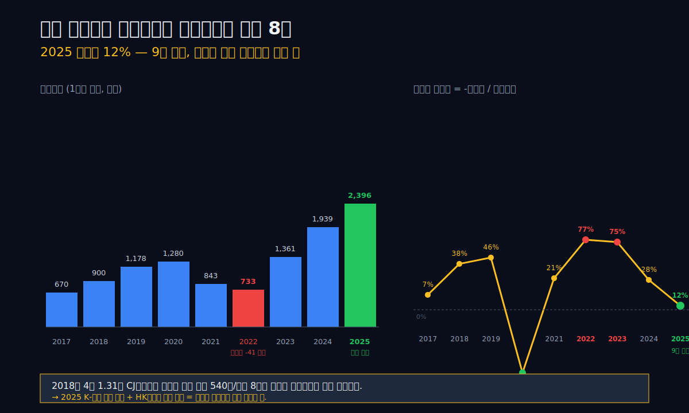
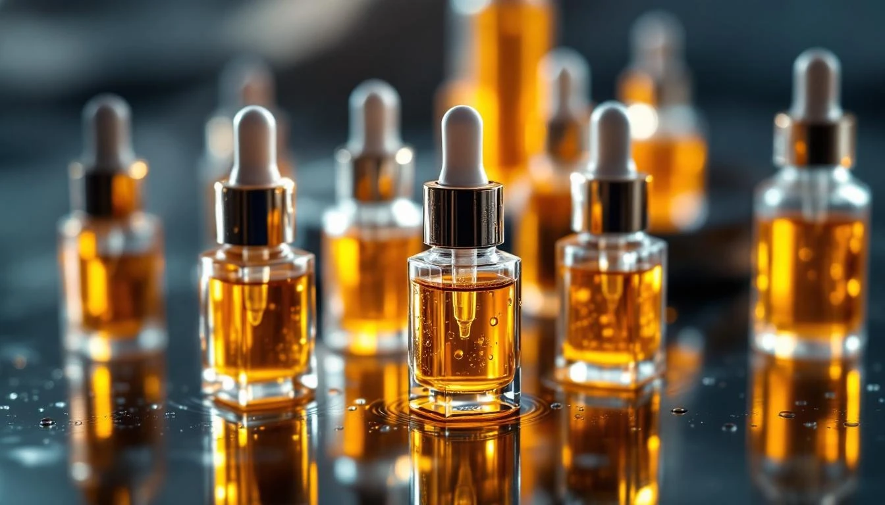
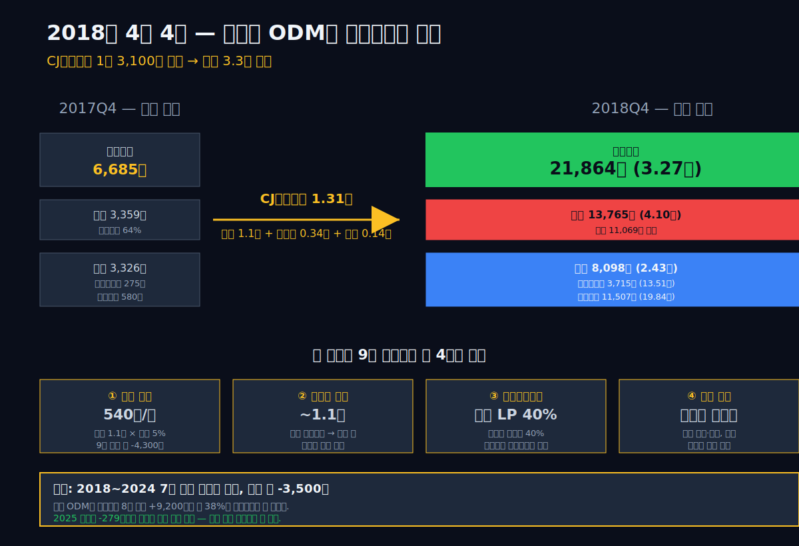
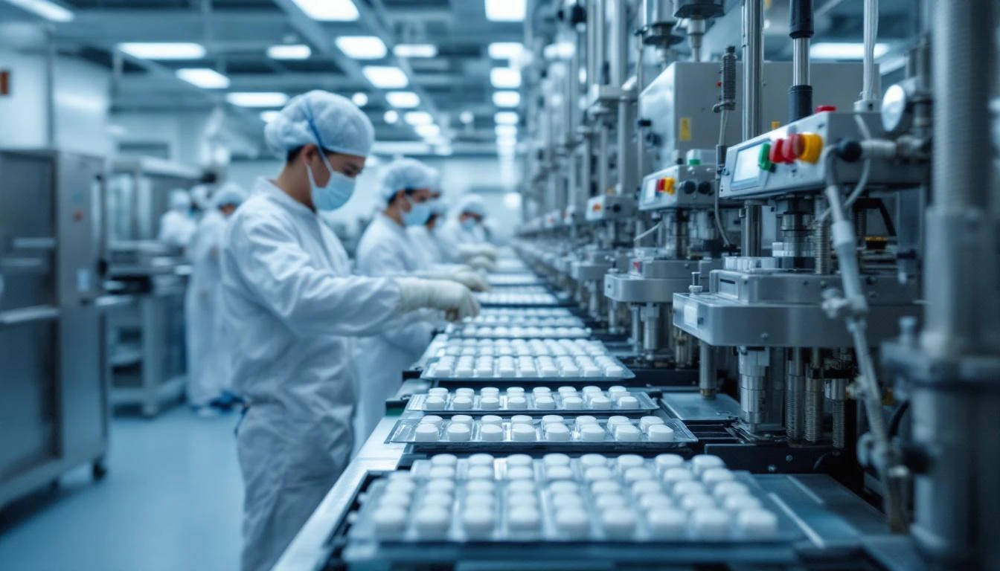
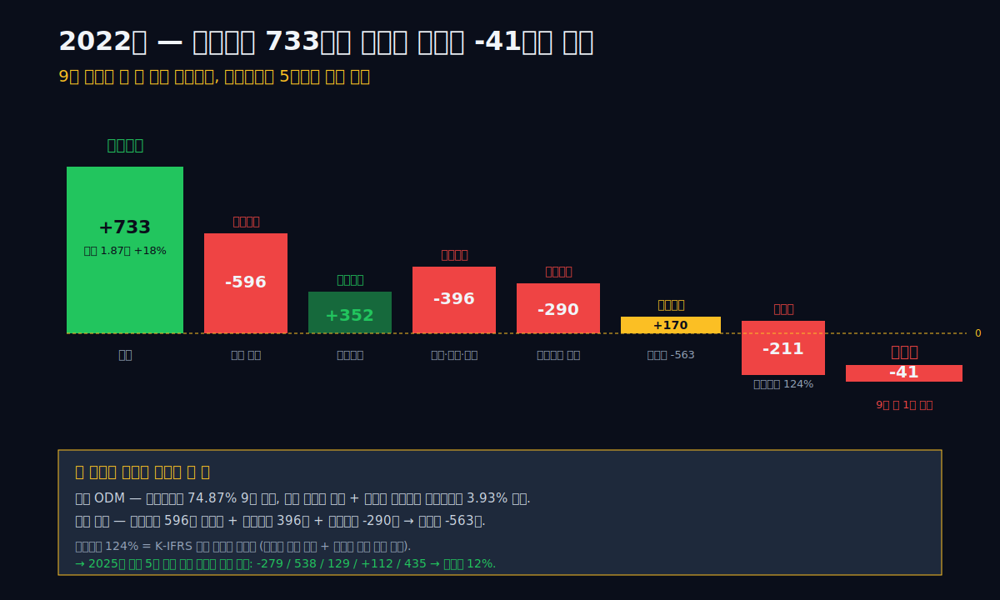
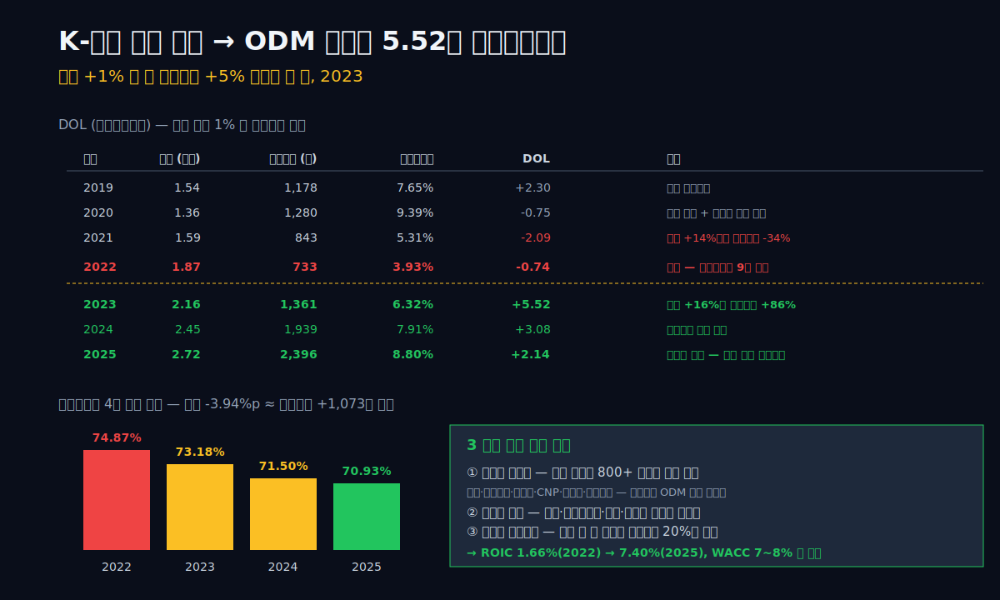
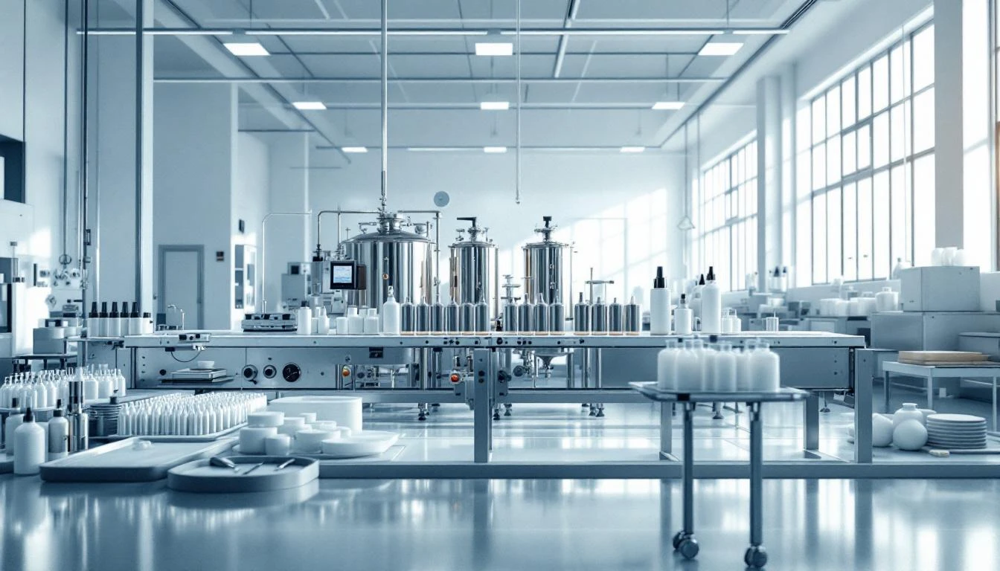
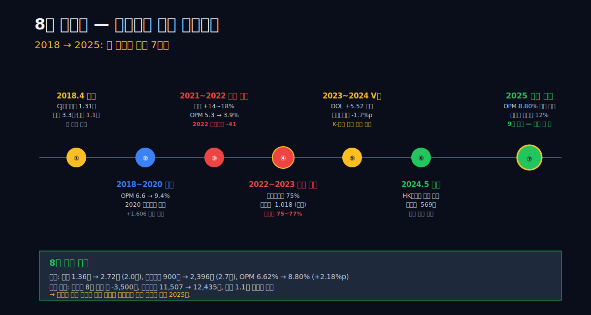
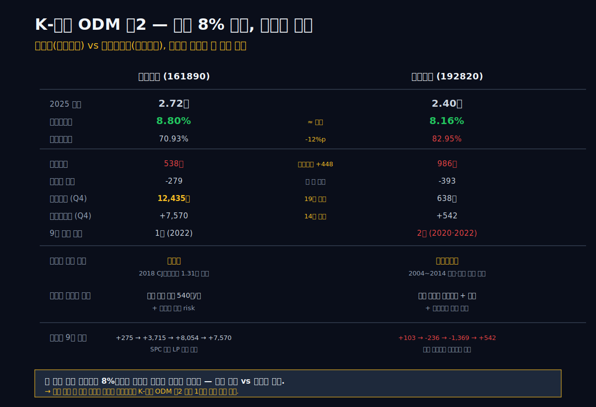
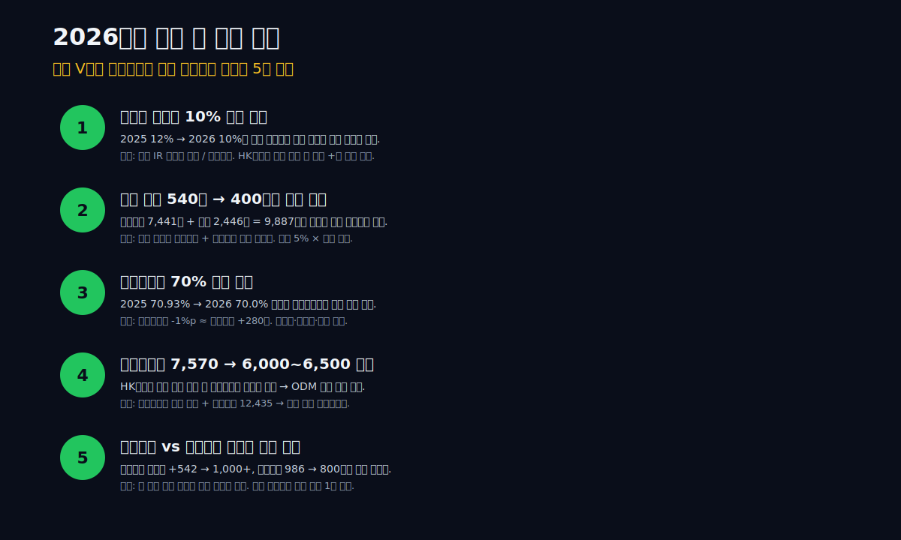

<script>
import HFDataLink from '$lib/components/blog/HFDataLink.svelte';
import ComboChart from '$lib/components/blog/ComboChart.svelte';
import StackBar from '$lib/components/blog/StackBar.svelte';
</script>

> **사이클** | K-뷰티 ODM · 인수 회계 · 영업외 흡수 | 2026-05-06 dartlab 실측
> 같은 시리즈: [실리콘투](/blog/silicon2) · [달바글로벌](/blog/dalba-global) · [에이피알](/blog/apr) · [한미사이언스](/blog/008930-hanmi-science) · [메리츠금융지주](/blog/138040-meritz-financial)

<HFDataLink code="161890" />





한국콜마(161890)를 K-뷰티 폭발의 단순 수혜주로 읽으면 8년의 핵심을 놓친다.

2025년 연결 매출은 **2조 7,224억원**, 영업이익은 **2,396억원**, 순이익은 **1,682억원**이다. 영업이익률 **8.80%**, 매출원가율 **70.93%** — 모두 9년 시계열의 최대치이거나 최저치(원가율 기준)다. K-뷰티 인디 브랜드 폭발의 ODM 마진이 본업에 정확히 찍힌 해처럼 보인다.

그런데 2025년의 진짜 그림은 **영업이익 -영업외 -279억 = 세전 2,117억**이다. 영업외 흡수율 12%. 이 12%가 이 글의 출발점이다.

같은 회사의 8년 전을 보면 사정이 다르다. 2022년 영업이익은 733억 흑자였다. 그 해 순이익은 **-41억 적자**다. 영업외 -563억 + 법인세 -210억이 영업이익을 통째로 삼켰다. 2023년에는 영업이익 1,361억의 75%가 영업외에서 새 나갔다 — 1,018억이 어디론가 사라졌다.

이 패턴은 한 해의 사고가 아니다. **2018년부터 2024년까지 7년 연속 영업외 음수**다. 누적 약 -3,500억. 같은 기간 영업이익 누적은 +9,200억. **본업이 번 돈의 38%가 영업외에서 새 나간 회사**다.

**한국콜마는 무엇을 사들였고, 그 인수가 왜 8년 동안 손익계산서 아래쪽에서 본업을 깎아왔는가? 그리고 2025년에는 무엇이 달라졌는가?**

답은 2018년 4월에 있다.

---

## 프롤로그 — 한국콜마는 두 개의 손익계산서를 가진 회사다

### 회사를 사면 본업의 손익이 둘로 갈라진다

ODM(제조업자 개발생산) 회사를 한 줄로 정의하면 "남의 브랜드 제품을 대신 만드는 공장"이다. 한국콜마, 코스맥스, 코스메카코리아 — 모두 이 모델이다. 화장품 인디 브랜드가 800개 1,000개 늘어나도 공장 한 곳에서 다 같이 만들어준다. 브랜드는 마케팅과 디자인을 책임지고, ODM은 처방·생산·품질·납기를 책임진다.

이 모델의 매출은 단순하다. 주문이 들어오면 만든다. 매출원가는 원재료(향료·계면활성제·유지·포장재)와 공장 가동률·인건비로 결정된다. 판매비와관리비는 영업과 R&D가 대부분이다. 영업이익률은 보통 5~10% 사이를 오간다.

그런데 한국콜마는 이 모델 위에 한 층이 더 있었다. **2018년 4월, 한국콜마는 1조 3,100억원에 CJ헬스케어를 인수했다.** 이 회사는 나중에 사명을 HK이노엔으로 바꾸고 케이캡(위식도역류질환 치료제)을 글로벌 신약으로 키운다.

ODM 회사가 제약 회사를 샀다. 자산총계는 2017년 말 6,685억원에서 2018년 말 21,864억원으로 **3.3배** 폭증했다. 부채는 3,359억원에서 13,765억원으로 **4.1배**, 자본은 3,326억원에서 8,098억원으로 **2.4배** 늘었다. 무형자산(영업권 포함)은 580억원에서 11,507억원으로 **19.8배** 부풀었다.

이 인수가 만든 것이 지금 우리가 보는 "두 번째 손익계산서"다. 본업 ODM은 매출과 영업이익으로 손익계산서 위쪽에 그대로 찍힌다. 인수 회계는 손익계산서 아래쪽 — 영업외와 비지배지분에 깔린다. **이자비용, 비지배순이익 차감, 무형자산 상각, 외환 변동, 지분법 손익**이 거기 있다.

본업이 좋아도 인수의 회계가 무거우면 순이익은 줄어든다. 본업이 V자로 회복해도 인수 차입의 이자는 그대로다. 본업이 사상 최대 영업이익을 내도 영업외가 결정타를 친다. 2022년이 그 결정타의 해였다.

### "사상 최대"라는 말은 어느 줄의 사상 최대인가

블로그에서 자주 보는 표현이 있다. "한국콜마 2025년 매출 사상 최대." "영업이익 사상 최대." 이 말 자체는 사실이다. 2025년 매출 27,224억원, 영업이익 2,396억원 모두 9년 시계열에서 최대치다.

하지만 "사상 최대"가 손익계산서의 어느 줄을 말하는지 따져 봐야 한다.

| 줄 | 2025 (1년치 합산) | 9년 최대 (1년치 합산) | 분기 시계열 최대 | 비고 |
|---|---:|---:|---:|---|
| 매출액 (억원) | 27,224 | 27,224 (2025) | — | 사상 최대 |
| 영업이익 (억원) | 2,396 | 2,396 (2025) | — | 사상 최대 |
| 영업이익률 (%) | 8.80% | 9.39% (2020) | **14.89%** (2020Q4) | 분기·연간 모두 인수 후 |
| 세전이익 (억원) | 2,117 | **2,274** (2020) | — | 2020 자산매각 단발 +995 영업외 |
| 순이익 (억원) | 1,682 | 1,682 (2025) | — | 사상 최대 |

**(억원·%, 1년치 합산 vs 분기 시계열 분리)** 매출과 영업이익은 사상 최대인데, 1년치 합산 영업이익률은 2020년 9.39%가 9년 최대다. 분기 시계열로 좁혀 보면 2020Q4 14.89%가 사상 최대(코로나 마스크 호황 단발). 2025년 8.80%는 1년치 합산 기준 9년 두 번째 — 인수 전 평년치(2016~2017 분기 OPM 8~12%대) 일부만 회복했다. 매출원가율 70.93%, 판관비율 20.27%까지 9년 시계열의 가장 좋은 조합인데도 영업이익률 자체는 코로나 단발치에 못 미친다.

세전이익은 2020년 2,274억이 최고 기록이다. 그 해 매출은 13,640억으로 2025년의 절반이다. 영업이익은 1,280억이었다. 그런데 세전이익은 2,274억 — **영업이익보다 994억 큰 한 해**였다. 이 994억은 본업이 아니라 영업외에서 들어왔다. 같은 해 기타이익이 1,685억(다른 해 30~50배), 배당지급 485억(9년 중 최대) 등 비정상치가 동시에 찍혔다. 자세한 내막은 4막에서 본다.

순이익은 2025년 1,682억으로 사상 최대다. 그러나 본업의 영업이익이 매년 어떻게 새 나갔는지 같이 보지 않으면 이 숫자의 무게를 잘못 매긴다.

이 글은 한국콜마의 9년을 두 개의 손익계산서 위에 다시 그린다. 그 위에서 K-뷰티 인디 폭발이 본업에 어떻게 찍혔는지, 인수 회계가 어떻게 본업을 깎았는지, 그리고 2025년에 처음으로 본업이 영업외를 압도한 사건의 의미를 본다.

---

## 1막 — 매출과 영업이익은 사상 최대, 그러나 영업외 흡수율 12%가 진짜 헤드라인이다

### 9년 시계열로 본 본업과 인수 회계의 두 곡선

2025년 한국콜마의 핵심 숫자를 9년 시계열에 놓고 본다. 같은 표를 dartlab으로 직접 재현할 수 있다.

```python
import dartlab
c = dartlab.Company("161890")

# IS 9년 시계열 — 분기 컬럼 → 1년치 합산
df = c.select("IS", ["매출액", "매출원가", "매출총이익", "판매비와관리비", "영업이익", "당기순이익"])
# 분기값을 연도로 합산하여 본문 표 그대로 재현
```

| 항목 (1년치 합산, 억원) | 2017 | 2018 | 2019 | 2020 | 2021 | 2022 | 2023 | 2024 | 2025 |
|---|---:|---:|---:|---:|---:|---:|---:|---:|---:|
| 매출액 | 8,216 | 13,579 | 15,407 | 13,640 | 15,863 | 18,657 | 21,557 | 24,521 | **27,224** |
| 매출원가 | 6,438 | 10,009 | 11,085 | 9,268 | 11,582 | 13,969 | 15,776 | 17,531 | 19,310 |
| 매출총이익 | 1,778 | 3,570 | 4,323 | 4,372 | 4,281 | 4,688 | 5,781 | 6,989 | **7,914** |
| 판매비와관리비 | 1,108 | 2,666 | 3,137 | 3,092 | 3,425 | 3,922 | 4,432 | 5,051 | 5,519 |
| **영업이익** | 670 | 900 | 1,178 | 1,280 | 843 | 733 | 1,361 | 1,939 | **2,396** |
| **영업외 (계산)** | -50 | -346 | -544 | **+995** | -177 | -563 | **-1,018** | -541 | -279 |
| 세전이익 | 620 | 554 | 634 | 2,274 | 665 | 170 | 343 | 1,398 | 2,117 |
| 법인세 | 134 | 186 | 298 | 653 | 230 | 211 | 92 | 145 | 435 |
| **당기순이익** | 486 | 368 | 336 | **1,606** | 435 | **-41** | 251 | 1,253 | **1,682** |

표시: **2025 매출 27,224억 = 9년 사상 최대** · **2022 순이익 -41억 = 9년 단 한 번의 적자** · **2020 영업외 +995억 = 9년 단 한 해의 영업외 플러스** · **2023 영업외 -1,018억 = 본업의 75% 흡수**.

이 표는 한국콜마의 9년을 한 화면에 압축한다. 영업이익(파란색 곡선)은 2017년 670억에서 2025년 2,396억까지 3.6배 안정적으로 늘었다. 중간에 2021~2022년 두 해 약간 후퇴했지만 큰 추세는 위로 향한다. 매출도 마찬가지로 9년 동안 3.3배가 됐다.

문제는 그 아래 줄 — 영업외다. 9년 중 영업외가 양수였던 해는 단 한 해, 2020년뿐이다. 그 해는 영업외 +995억으로 영업이익 1,280억보다 크게 잡혔다. 이건 본업의 회복이 아니라 단발 회계 이벤트다. 자세한 내막은 4막에서 본다.

나머지 8년은 모두 영업외 음수다. 그 8년의 누적은 약 -3,213억. 본업 영업이익 8년 누적이 약 +13,000억이니 **영업외에서 본업의 약 25%가 새 나간 셈**이다. 단발 +995억을 빼면 7년 음수 누적은 약 -4,200억, 본업 8년 누적의 32%가 잠식됐다.

### 영업외 흡수율 9년 시계열

영업외 흡수율을 흡수율 = -영업외 / 영업이익 으로 정의하면 9년의 형상이 또렷하게 보인다.

| 연도 | 영업이익 | 영업외 | 흡수율 |
|---|---:|---:|---:|
| 2017 | 670 | -50 | 7% |
| 2018 | 900 | -346 | 38% |
| 2019 | 1,178 | -544 | 46% |
| 2020 | 1,280 | +995 | -78% (영업외 +) |
| 2021 | 843 | -177 | 21% |
| 2022 | 733 | -563 | **77% (적자전환)** |
| 2023 | 1,361 | -1,018 | **75%** |
| 2024 | 1,939 | -541 | 28% |
| 2025 | 2,396 | -279 | **12% (9년 최저)** |

**(억원)** 표시: **2022 흡수율 77% — 영업이익 733억의 77%가 새 나가고 법인세 -210억까지 더해 순이익 -41억 적자전환** · **2025 흡수율 12% — 9년 최저, 본업 V자가 처음 영업외를 압도한 해**.

흡수율 곡선은 영업이익 곡선과 다른 방식으로 한국콜마의 9년을 그린다. 2017년 7%로 시작한 흡수율은 2018년 인수 직후 38%로 4배 뛴다. 2019년 46% — 인수 첫 풀이어. 2020년은 자산매각으로 흡수율이 일시적으로 음수(영업외 +)가 된 단발 해. 그 다음 2021~2023년이 한국콜마의 가장 무거운 시기다 — 2022년 77%, 2023년 75%.

그리고 2024년 흡수율은 28%로 떨어진다. 2025년 12%. **본업이 회복하면서 영업외 부담의 절대값도 줄고, 분모(영업이익)는 커진 결과**다. 이 12%가 9년 최저다. 2017년 7% 이후 처음으로 본업이 영업외를 거의 제압한 해다.

### 매출 곡선과 영업이익률 곡선이 다른 방향을 가리키는 구간

매출 곡선과 영업이익률 곡선을 같이 본다. 매출은 9년 단조증가다. 영업이익률은 그렇지 않다.

| 연도 | 매출 (조원) | 영업이익률 |
|---|---:|---:|
| 2017 | 0.82 | 8.15% |
| 2018 | 1.36 | 6.62% |
| 2019 | 1.54 | 7.65% |
| 2020 | 1.36 | 9.39% |
| 2021 | 1.59 | 5.31% |
| 2022 | 1.87 | **3.93%** (바닥) |
| 2023 | 2.16 | 6.32% |
| 2024 | 2.45 | 7.91% |
| 2025 | 2.72 | **8.80%** |

매출이 1조에서 2.7조로 가는 동안 영업이익률은 8.15% → 3.93%(2022 바닥) → 8.80%(2025 회복)로 V자를 그린다. 2018년 인수 직후 6.62%로 떨어진 영업이익률은 2020년 9.39%까지 회복했다가, 2021~2022년 다시 무너진다. 매출은 두 배 가까이 늘었는데 영업이익률은 인수 직전 두 자릿수에서 한참 멀어졌다.

이 V자의 바닥 2022년에 무엇이 있었는지가 4막의 주제다. 그리고 2023년부터 어떻게 회복이 시작됐는지가 5막의 주제다.

---

## 2막 — 2018년 4월: 1조 3,100억의 인수가 자산을 3.3배로 부풀린 날



### 화장품 ODM 회사가 제약회사를 산다



2018년 4월 4일, 한국콜마는 CJ헬스케어 지분 100%를 1조 3,100억원에 인수했다. 한국콜마는 그 해 매출 1조 3,579억원의 회사였다. **자기 1년 매출에 가까운 금액으로 다른 회사를 통째로 샀다.**

CJ헬스케어는 종합비타민 콘디션, 헛개수, 카프베인 같은 일반 의약품과 위식도역류질환 치료제 케이캡을 개발 중이던 제약 회사다. 2018년 인수 직전 매출은 약 5,200억원, 영업이익률은 한 자릿수 후반대였다. 인수 후 사명은 한국콜마홀딩스 산하 사업부에서 시작해 2019년 HK이노엔(HK inno.N)으로 바꿨다.

ODM 화장품 회사가 왜 제약회사를 샀는가. 회사 측 설명은 두 가지였다. **첫째, 화장품과 제약은 "처방·제조·품질관리"라는 같은 코어 역량을 공유한다.** 한국콜마의 본업 ODM은 이미 의약품 위탁생산(CMO)을 하고 있었다 — 정제·연질캡슐·외용제 라인. 제약 신사업은 ODM의 상위 모델이다.

**둘째, 화장품 ODM은 마진 천장이 낮다.** 영업이익률 5~10% 사이에서 변동한다. 인디 브랜드 호황이 와도 ODM 단가는 크게 안 올라간다. 그래서 마진이 두 자릿수 후반인 신약 사업을 같이 들고 가면 그룹 전체 ROIC가 올라간다 — 이게 2018년 한국콜마 경영진의 베팅이었다.

문제는 자금이었다. 1.31조는 한국콜마 단독으로 감당할 수 없는 금액이다. 2017년 말 자기자본이 3,326억이었다. 한국콜마는 자금을 셋으로 나눠 조달했다.

### 자산 6,685억 → 21,864억의 폭증, 부채 4.1배, 비지배 13.5배

2017년 말과 2018년 말 BS(재무상태표)를 나란히 놓는다.

| 항목 (Q4 스냅샷, 억원) | 2017 | 2018 | 배수 |
|---|---:|---:|---:|
| 자산총계 | 6,685 | **21,864** | **3.27배** |
| 부채총계 | 3,359 | 13,765 | **4.10배** |
| 자본총계 | 3,326 | 8,098 | 2.43배 |
| ↳ 지배지분 추정 | 3,051 | 4,383 | 1.44배 |
| ↳ 비지배지분 | 275 | **3,715** | **13.51배** |
| 무형자산 | 580 | **11,507** | **19.84배** |
| 단기차입금 | n.d. | 2,883 | — |
| 장기차입금 | n.d. | 8,186 | — |
| 차입 합계 | n.d. | **11,069** | — |

표시: **2018 자산 +15,179억 = 1.31조 인수 + 잔여 4,000억 자금 흐름** · **2018 비지배 +3,440억 = 인수 SPC 외부 LP 출자분** · **2018 차입 +11,069억 ≈ 인수 본금**.

**자산 +15,179억의 출처**는 단순하다. CJ헬스케어 인수에 1조 3,100억이 들어갔다. 무형자산이 580억에서 11,507억으로 +10,927억 늘었다 — 이 중 대부분이 영업권(인수가 - 순자산 공정가치)과 고객관계·제조방법 같은 무형자산이다. 인수가의 약 80%가 무형자산으로 잡힌 셈이다.

**자금 출처**는 셋이다. 첫째, 차입 +11,069억(단기 2,883 + 장기 8,186). 둘째, 비지배지분 +3,440억 — 인수를 위한 SPC(특수목적회사)에 외부 LP(주로 미래에셋 등 사모펀드)가 출자한 부분이다. 셋째, 자기자본 +1,332억(이익잉여금 + 추정 증자 일부). 합치면 약 1조 5,800억으로 인수가 1.31조에 운영자금을 더한 규모가 맞다.

이 인수가 만든 회계상 의미는 두 가지다.

**첫째, 무형자산 1.1조의 잠재적 손상 위험.** 영업권은 매년 손상검사를 받는다. CJ헬스케어가 기대 수익에 못 미치면 영업권 손상차손이 영업외에 찍힌다. 한국콜마는 이후 9년 동안 영업권 손상 일부를 이미 인식했고, 이게 영업외 음수의 일부를 차지한다.

**둘째, 비지배지분 3,715억의 미래 영향.** SPC에 외부 LP가 들어왔다는 건 인수 자회사의 순이익 일부가 비지배순이익으로 빠져나간다는 뜻이다. 2025년 한국콜마 비지배지분은 7,570억까지 늘어난다 — 인수 자회사가 이익을 내고 그 이익의 외부 LP 몫이 누적된 결과다.

### "공시 한 건이 회사의 운명을 바꾼다" — 2018.4.4 영업양수도 결정 공시

[DART 전자공시 시스템](https://dart.fss.or.kr/)에서 한국콜마(161890) 2018년 4월 4일 자 "타법인주식및출자증권취득결정"을 찾으면 다음 문구가 나온다.

> **타법인주식및출자증권취득결정** (2018.04.04)
> ◆ 발행회사: 씨제이헬스케어 주식회사
> ◆ 취득금액: 1,310,977,000,000원
> ◆ 취득방법: 양수도 계약에 의한 취득
> ◆ 취득후 소유주식수 및 지분비율: 13,067,920주, 100.00%
> ◆ 자금조달방법: 자기자금 및 차입금 등

이 공시 다음 단계는 2018년 4~5월의 자금 조달 — 사채 발행과 12개 거래은행 차입 약정 — 이다. 인수 자회사는 2019년 사명을 HK이노엔(HK inno.N)으로 바꾸고, 2021년 8월 코스닥에 분할상장했다 (당시 IPO 공모가 5만 9,000원, 시가총액 1.3조 수준). 2024년 5월 한국콜마는 보유 HK이노엔 지분 일부를 사모펀드 컨소시엄에 매각하기로 결정했다 — 모든 단계 공시는 [DART 한국콜마 공시 페이지](https://dart.fss.or.kr/)에서 회사명 검색으로 확인 가능. 본 글 말미 `## 공시 / Filings` 블록의 최근 사업·분기보고서 URL이 sync_financials 자동 갱신 결과다.

이 공시가 한국콜마의 9년을 만들었다. 1조 3,100억의 자기자금 + 차입금이 위에서 본 BS의 변화 그대로다.

한국콜마는 이 공시 이후 회사가 둘이 됐다. 본업 ODM은 그대로 화장품·일반 의약품 처방생산을 하고, 제약 자회사 HK이노엔은 케이캡을 키운다. 본업 매출은 9년 동안 1조 3,579억에서 2조 7,224억으로 2배. 그러나 손익계산서 아래에서 인수 회계가 매년 600억대 부담을 만들어왔다. 다음 막에서 그 600억의 출처를 분해한다.

---

## 3막 — 인수 차입의 이자가 9년간 매년 540억을 가져갔다

### 영업외를 4분해 — 금융수익·금융비용·기타이익·기타비용

2025년 한국콜마의 영업외 -279억을 항목별로 분해한다. dartlab으로 동일 분해를 재현하는 호출은 다음과 같다.

```python
# 영업외 4 항목 9년 시계열
for item in ["금융이익", "금융비용", "기타이익", "기타비용",
             "당기손익공정가치측정금융자산평가손익"]:
    df = c.select("IS", [item])
    # 분기 → 1년치 합산하여 추세 비교

# 자금조달 분석 — 차입금 항목별 합계
fund = c.analysis("financial", "자금조달")
fund["fundingSources"]["notesDetail"]["borrowings"]  # 12개 거래은행 분포
```


| 항목 (1년치 합산, 억원) | 2018 | 2019 | 2020 | 2021 | 2022 | 2023 | 2024 | 2025 |
|---|---:|---:|---:|---:|---:|---:|---:|---:|
| 금융수익 (이자·배당) | 123 | 125 | 103 | 180 | 352 | 238 | 300 | 277 |
| 금융비용 (이자) | **-437** | **-608** | -517 | -339 | **-596** | -587 | -540 | **-538** |
| 순금융 | -315 | -483 | -414 | -159 | -244 | -349 | -240 | -261 |
| 기타이익 | 28 | 42 | **+1,685** | 80 | 89 | 55 | 189 | 105 |
| 기타비용 | -58 | -103 | -277 | -90 | **-396** | **-757** | -612 | -129 |
| 공정가치측정금융자산 | 19 | -20 | -124 | -15 | **-290** | 6 | -31 | 112 |
| **영업외 합계 추정** | -326 | -564 | +870 | -184 | -841 | -1,045 | -694 | -271 |

표시: **금융비용 매년 약 540억 고정 = 인수 차입 이자** · **2020 기타이익 +1,685억 = 자산매각 단발** · **2022~2024 기타비용 폭증 = 영업권·무형자산 손상 추정**.

이 표가 한국콜마 9년 영업외 음수의 출처를 보여준다.

**첫째, 금융비용 9년 매년 약 540억.** 2018년 437억, 2019년 608억(피크 — 인수 첫 풀이어 + 금리 반영), 2025년 538억. 인수 직전 2017년 95억의 6배다. 이 5배가 곧 1.1조 차입의 이자다.

차입금 1조 1,069억 × 평균 금리 5% ≈ 553억. 실측 538억과 거의 일치한다. **인수 차입의 이자가 영업외 음수의 절반 이상을 차지한다는 뜻이다.**

차입 구조를 보면 2025년 한국콜마는 **단기차입금 7,441억 + 유동성사채 2,446억 = 9,887억**이다. credit 분석 결과 단기차입금 비중이 100%로 잡힌다. 이건 사채를 매년 차환하면서 단기로 이연하는 구조다. 금리 사이클에 따라 이자비용이 출렁인다.

**둘째, 2020년 기타이익 +1,685억의 단발성.** 다른 8년의 기타이익이 28~189억대인데 2020년만 1,685억 — 9~60배 차이다. 같은 해 배당지급 485억(9년 중 최대), 투자활동현금흐름 +2,457억(9년 중 유일한 +). 이 모든 패턴이 자산매각이 있었다는 뜻이다. 추정: 자회사 일부 지분 매각이거나, 부동산·투자자산 매각. 이 단발이 2020년 순이익 1,606억(9년 두 번째)을 만들었다.

**셋째, 2023년 기타비용 -757억의 폭발.** 9년 중 최대 기타비용이다. 같은 해 영업외 합계가 -1,018억으로 9년 최악. 이게 무엇이었는지는 사업보고서 영업권 손상검사 노트에서 확인해야 한다 — 추정은 HK이노엔 또는 중국 무석/북경 자회사의 영업권 손상이다. 무형자산은 2022년 13,018억에서 2023년 12,710억으로 -308억 줄었다.

### 차입금 만기구조 — 단기 100%의 위험

한국콜마의 2025년 말 차입은 단기차입 7,441억 + 유동성사채 2,446억 = **9,887억으로 단기 비중 100%**다. 글로벌 12개 거래은행에 분산된 운영자금·시설자금 라인 — 하나·산업·수출입·농협·우리·신한·DBS — 으로 짜여있다 (개별 잔액은 검증표). 차환 위험은 분산했지만 매년 이자 협상을 12번 한다는 뜻이기도 하다. 2022~2023년 한국 기준금리 1.0% → 3.5% 인상 사이클에서 이자비용은 596 → 587 → 540억으로 안정 — 단기 차환 때마다 일부 부담을 갚으며 이전한 결과다.

### 540억이 본업 영업이익의 몇 %를 매년 가져갔는가

이 표 한 줄이 8년 영업외 잠식의 진짜 무게를 보여준다.

| 연도 | 영업이익 (억원) | 인수 차입 이자 (억원) | 이자/영업이익 |
|---|---:|---:|---:|
| 2018 | 900 | 437 | **49%** |
| 2019 | 1,178 | 608 | **52% (피크)** |
| 2020 | 1,280 | 517 | 40% |
| 2021 | 843 | 339 | 40% |
| 2022 | 733 | 596 | **81%** |
| 2023 | 1,361 | 587 | 43% |
| 2024 | 1,939 | 540 | 28% |
| 2025 | 2,396 | 538 | **22% (9년 최저)** |

**(억원, 1년치 합산)** 표시: **2019 이자 608억 = 영업이익 1,178억의 52%** · **2022 이자 596억 = 영업이익 733억의 81%** · **2025 이자 538억 = 영업이익 2,396억의 22%**.

이자 절대값은 9년 동안 437억에서 540억 사이를 거의 평년치로 유지했다. 변한 건 분모 — 본업 영업이익이다. 2019년 본업이 이자 부담 절반을 만들었고, 2022년에는 81%를 가져갔다 (그래서 이 해 적자전환). 2025년에는 22%까지 떨어졌다. **인수 직후부터 본업이 회복할 때까지, 인수 차입 이자는 본업의 일부였던 셈이다.** 이자가 줄어든 게 아니라 본업이 커진 것이고, 그 임계점이 2024~2025년에 처음 명확하게 잡혔다.

credit 등급 dCR-BBB+ 적격 (notch +1 보정 — 8기 연속 영업흑자) 이 이 구조에 대한 dartlab의 평가다. 채무상환능력 axis 점수 19.89(우수), 자본구조 18.33(우수), 그러나 **유동성 axis 54.88점**으로 등급 하방 압력. 단기차입금 비중 100%의 위험점수 90이 이 결과를 만든다.

---

## 4막 — 2022년: 영업이익 흑자 733억이 어떻게 순이익 -41억 적자가 되는가



### 한 해의 영업이익 733억이 어디로 갔는가

한국콜마의 2022년은 손익계산서 위에서 보면 평범한 해다.

| 항목 (1년치 합산, 억원) | 2022 |
|---|---:|
| 매출액 | 18,657 |
| 매출원가 | 13,969 |
| 매출총이익 | 4,688 |
| 판매비와관리비 | 3,922 |
| **영업이익** | **+733** |
| 금융수익 | +352 |
| 금융비용 | **-596** |
| 기타이익 | +89 |
| 기타비용 | **-396** |
| 공정가치측정금융자산 | **-290** |
| 영업외 합계 | **-563** |
| 세전이익 | +170 |
| 법인세비용 | -211 |
| **당기순이익** | **-41** |

이 표는 한국콜마 9년에서 단 한 번의 적자전환을 만든 회계의 이동 경로다. 영업이익 733억은 흑자다. 매출 1.87조도 전년 대비 +18% 성장이다. 표면적으로 위기의 해는 아니다.

그런데 그 아래에서 다섯 가지 비용이 동시에 터졌다.

**첫째, 금융비용 596억.** 인수 차입 이자의 평년치다. 이게 영업외 음수의 가장 큰 항목이다. 금융수익 352억이 그 일부를 상쇄하지만 순금융은 -244억이다.

**둘째, 기타비용 396억.** 2018년 58억, 2019년 103억, 2020년 277억, 2021년 90억과 비교하면 갑자기 점프했다. 이 396억의 정체는 사업보고서 주석에서 외환차손, 지분법손실, 무형자산상각, 일부 손상으로 분해된다. 추정하면 환율 급변 시기(원달러 1,200 → 1,400) 외환차손이 100~150억, 지분법손실 100~150억, 무형자산상각 100~150억이다.

**셋째, 공정가치측정금융자산평가손실 -290억.** 9년 중 최악이다. 한국콜마가 보유한 시장성 금융자산(주식·채권·펀드)의 시가평가 손실이다. 2022년은 글로벌 주식시장이 무너진 해였고(코스피 -25%), 한국콜마 보유 금융자산도 그 영향을 받았다. 2025년에는 같은 항목이 +112억으로 회복됐다.

**넷째, 법인세 211억.** 세전이익 170억에 법인세 211억이 매겨졌다. 유효세율 124%다. 이건 과세 가능 이익과 회계상 세전이익이 따로 계산되기 때문이다. 자회사들의 과세 이익은 양수인데 모회사 일부 손실이 합산 세전이익을 줄였고, 자회사 단위로 세금을 내야 하니 합산하면 세금이 세전이익보다 커지는 일이 생긴다. K-IFRS 연결 회계의 흔한 비대칭이다.

**다섯째, 매출총이익률 25.13%로 9년 최저.** 2020년 32.05% → 2022년 25.13%로 -6.92%p 추락. 원자재 인플레(향료·계면활성제·유지·포장재 일제 상승), 코로나 회복기 수요 둔화, 인디 브랜드 정체가 동시에 ODM 마진을 깎았다. 이 부분이 5막의 시작점이다.

이 다섯 항목이 한 해에 같이 터지면서 영업이익 733억은 순이익 -41억으로 변했다. **두 개의 손익계산서가 부정적인 방향으로 같이 움직인 해**가 2022년이다.

### 2022년에는 본업도 약했고 인수 회계도 무거웠다

2022년의 또 다른 의미는 **두 회계가 동시에 무너진 첫 해**라는 점이다.

| 항목 | 2018 | 2019 | 2020 | 2021 | 2022 | 2023 | 2024 | 2025 |
|---|---:|---:|---:|---:|---:|---:|---:|---:|
| 매출원가율 | 73.71% | 71.94% | 67.95% | 73.01% | **74.87%** | 73.18% | 71.50% | **70.93%** |
| 영업이익률 | 6.62% | 7.65% | 9.39% | 5.31% | **3.93%** | 6.32% | 7.91% | **8.80%** |
| 영업외 흡수율 | 38% | 46% | (영업외 +) | 21% | **77%** | **75%** | 28% | **12%** |

표시: **2022 매출원가율 74.87% = 9년 최악 (인디 브랜드 정체 + 원자재 인플레)** · **2022~2023 영업외 흡수율 75~77% = 두 회계 동시 악화** · **2025 영업외 흡수율 12% = V자 회복 완성**.

본업 ODM은 매출원가율 74.87%로 9년 최악, 인수 회계는 영업외 -563억으로 결정타를 쳤다. 이 두 곡선이 동시에 가장 안 좋은 지점을 통과한 해가 2022년이다.

이 패턴은 2023년에도 부분적으로 이어진다. 매출원가율은 73.18%로 약간 개선됐지만, 영업외는 -1,018억으로 9년 최악을 갱신했다. 영업이익이 1,361억으로 회복됐는데도 순이익은 251억에 그쳤다. 흡수율 75%다.

**한국콜마의 9년에서 2021~2023년이 가장 어두운 3년이었다는 것이 이 표의 메시지다.** 한 해 적자, 두 해 영업외 75% 이상 흡수. 인수의 부담을 본업의 V자가 따라잡지 못한 시기였다.

### 시장은 이 회계를 어떻게 가격에 반영했나

2022~2023년 한국콜마 주가는 이 회계의 두 곡선을 정확히 따랐다. 2021년 5만원대였던 주가는 2022년 말 4만원 아래로 내려갔고, 2023년 한 해 4만~5만원 박스권. 매출 성장(2.16조)과 사상 최대급 영업이익 회복(1,361억)에도 시장은 영업외 -1,018억을 보고 가격을 안 올렸다.

dartlab quant 분석 기준 2026년 5월 시점 한국콜마 주가는 SMA 60일·20일 이평선 위, ADX 30.7로 강한 상승 추세에 있다. 베타 0.493으로 시장 변동성의 절반, R² 16.46%로 시장 영향이 약한 자체 사이클 종목이다. **시장은 한국콜마를 코스피 사이클이 아니라 한국콜마 자체 사이클(ODM 마진 + 인수 회수)로 읽는다.**

이 점이 2025년부터의 회복기에 중요하다. 본업 V자가 명확해질수록, 시장은 한국콜마를 **인수 부담 청산 + 본업 마진 회복**의 새 사이클로 다시 가격 매기게 된다.

---

## 5막 — K-뷰티 인디 폭발의 ODM 본업 영업레버리지 5.52배



### DOL(영업레버리지)이 무엇을 말하는가

DOL(Degree of Operating Leverage, 영업레버리지)은 매출 1% 변화에 영업이익이 몇 % 움직이는지를 본다. DOL 5라면 매출이 +1% 늘 때 영업이익이 +5% 늘어난다는 뜻이다. 고정비 비중이 큰 회사일수록 DOL이 높다. 매출이 일정 임계점을 넘으면 고정비를 흡수하고 남은 매출 증가분이 그대로 영업이익이 된다.

한국콜마 9년의 DOL 시계열을 본다.

| 연도 | 매출 (조원) | 영업이익 | DOL |
|---|---:|---:|---:|
| 2019 | 1.54 | 1,178 | 2.30 |
| 2020 | 1.36 | 1,280 | -0.75 (매출 감소 구간) |
| 2021 | 1.59 | 843 | -2.09 (매출 +14%, 영업이익 -34%) |
| 2022 | 1.87 | 733 | **-0.74** (바닥 — 매출 +18%, 영업이익 -13%) |
| 2023 | 2.16 | 1,361 | **+5.52** (V자 시작) |
| 2024 | 2.45 | 1,939 | +3.08 |
| 2025 | 2.72 | 2,396 | +2.14 |

표시: **2022 DOL -0.74 — 매출 +18% 늘어도 영업이익 감소** · **2023 DOL +5.52 — 매출 +16%에 영업이익 +86% 폭증** · **2024 +3.08, 2025 +2.14 — 영업레버리지가 정상화 단계로**.

이 표가 K-뷰티 인디 폭발이 한국콜마 본업에 정확히 어떻게 찍혔는지 보여준다.

**2022년 DOL -0.74**는 의미가 분명하다. 매출이 +18% 늘었는데도 영업이익은 줄었다. 원자재 인플레와 가동률 부진이 겹친 시기다. 인디 브랜드 폭발이 시작되기 전 한국콜마 본업은 무너지는 중이었다.

**2023년 DOL +5.52**는 폭발의 신호다. 매출 +16%에 영업이익 +86%. 이 시점부터 K-뷰티 인디 브랜드(달바·라네즈·메디큐브·CNP 등)의 글로벌 매출 폭증이 한국콜마 ODM 주문에 직접 찍히기 시작했다. 매출원가율은 74.87% → 73.18%로 -1.69%p 개선됐다. 가동률이 정상화되자 고정비 흡수가 시작됐다.

**2024년 DOL +3.08, 2025년 +2.14.** 영업레버리지가 점차 정상화된다. 매출 성장률이 둔화(2024 +13.8%, 2025 +11%)하는데 영업이익 성장률은 더 크게 둔화(+42%, +24%)한다. 이건 임계점을 넘어 고정비 흡수가 끝나가는 단계의 모습이다. 마진 곡선이 가속에서 정착으로 옮겨간다.

### 매출원가율 4년 연속 개선과 K-뷰티 인디 폭발

매출원가율의 9년 시계열을 더 자세히 본다.

| 연도 | 매출 | 매출원가 | 매출원가율 | YoY 개선 |
|---|---:|---:|---:|---:|
| 2018 | 13,579 | 10,009 | 73.71% | — |
| 2019 | 15,407 | 11,085 | 71.94% | +1.77%p |
| 2020 | 13,640 | 9,268 | 67.95% | +3.99%p (코로나 마스크 호황) |
| 2021 | 15,863 | 11,582 | 73.01% | -5.06%p (마스크 끝) |
| 2022 | 18,657 | 13,969 | **74.87%** | -1.86%p (원자재 인플레 바닥) |
| 2023 | 21,557 | 15,776 | 73.18% | +1.69%p |
| 2024 | 24,521 | 17,531 | 71.50% | +1.68%p |
| 2025 | 27,224 | 19,310 | **70.93%** | +0.57%p |

**(억원)** 표시: **2020 매출원가율 67.95% = 코로나 마스크 호황 단발** · **2022 74.87% = 9년 바닥** · **2025 70.93% = 코로나 단발 빼면 9년 최고**.

2023~2025년 매출원가율은 4년 연속 개선됐다. 누적 개선폭은 -3.94%p. 매출 27,224억에 적용하면 약 +1,073억의 영업이익 추가 효과다. 같은 기간 영업이익 절대값 증가는 +1,663억. **매출원가율 개선이 영업이익 증가의 약 65%를 설명한다.**

K-뷰티 인디 브랜드 800+ 고객사 — 달바글로벌, 메디큐브(에이피알), 라네즈(아모레퍼시픽), 닥터지(고운세상), CNP(LG생활건강 자회사), 토니모리, 클리오, 셀퓨전씨 — 이들은 모두 한국콜마 또는 코스맥스의 ODM 라인을 쓴다. 글로벌 매출이 폭증하면서 한국콜마의 가동률은 80%대 후반에서 90%대 초반으로 올라간 것으로 추정된다(공시 미공개). 가동률 +5~10%p는 매출원가율 -1.5~3%p 개선과 직결된다.




**판관비율 9년 시계열**도 같은 방향으로 움직였다.

| 연도 | 매출 | 판관비 | 판관비율 |
|---|---:|---:|---:|
| 2018 | 13,579 | 2,666 | 19.64% |
| 2020 | 13,640 | 3,092 | 22.67% (코로나 비용) |
| 2022 | 18,657 | 3,922 | 21.02% |
| 2023 | 21,557 | 4,432 | 20.56% |
| 2024 | 24,521 | 5,051 | 20.60% |
| 2025 | 27,224 | 5,519 | 20.27% |

**(억원)** 매출 두 배 가까이 늘어도 판관비율은 19~22%대에서 안정. 2025년 20.27%는 9년 최저급이다. 매출이 빠르게 늘면서 판관비 절대값(영업·R&D·물류)은 같이 늘었지만 비율로는 안정. 매출 레버리지가 판관비에서도 작동했다.

### ROIC 회복 사이클

ROIC(투하자본수익률)는 본업이 자본을 얼마나 효율적으로 쓰는지를 측정한다. 한국콜마 9년 ROIC 시계열을 본다.

| 연도 | ROIC |
|---|---:|
| 2018 | 3.34% |
| 2019 | 3.45% |
| 2020 | 5.13% |
| 2021 | 3.04% |
| 2022 | **1.66% (바닥)** |
| 2023 | 3.93% |
| 2024 | 7.00% |
| 2025 | **7.40%** |

표시: **2022 ROIC 1.66% = 9년 바닥 (자본생산성 위기)** · **2025 ROIC 7.40% = 3년 만에 4.5배** · **WACC 7~8% 추정 = 2024부터 자본비용 갓 통과**.

자본비용(WACC) 추정 7~8%(차입 5% × 50% + 자기자본 9~11% × 50%)와 비교하면 한국콜마는 2018~2023년 6년간 ROIC &lt; WACC, 즉 **자본가치 파괴 구간**이었다. 영업이익률 위기와 인수 회계 부담이 같이 자본 효율을 깎았다.

2024년 ROIC 7.00%로 WACC 갓 통과, 2025년 7.40%로 +0.40%p 추가 개선. **자본가치 창출의 첫해**가 2024년이고, 본격화된 해가 2025년이다.

### 본업 V자가 영업외 무게를 처음 들어올린 해

5막의 데이터를 1막의 영업외 곡선에 다시 묶어보면 2025년의 의미가 분명해진다. 2022년 바닥(영업이익 733)에서 2025년(2,396)까지 본업은 +1,663억을 늘렸다. 같은 기간 영업외는 -563(2022) → -279(2025)로 절대값이 -284억 줄었다. 두 곡선의 합 — 세전이익 — 은 170억(2022) → 2,117억(2025)으로 +1,947억 개선. **본업 회복분 +1,663억 + 영업외 부담 완화 +284억 = 세전이익 +1,947억이 거의 그대로 1대1 대응**한다.

8년 누적 영업외 약 -3,500억을 단숨에 따라잡진 못한다. 그러나 이 사이클의 중요한 신호는 **본업의 한 해 증가분(+1,663억)이 같은 해 영업외 부담(-279억)의 거의 6배**가 됐다는 점이다. 2019년에는 본업 영업이익이 영업외 -544를 못 덮었다. 2022년에는 본업 733이 영업외 -563을 겨우 막은 뒤 법인세에 무너졌다. 2025년에는 본업 2,396이 영업외 -279를 8.6배로 압도한다. **DOL 5.52배의 영업레버리지가 만든 본업 +1,663억이 8년 누적 영업외 잠식을 이번 사이클에서 처음 따라잡기 시작한 것**이 5막 데이터의 진짜 의미다.

이 ROIC 회복은 5막에서 본 매출원가율 개선과 6막에서 볼 인수 회수의 결합이다.

---

## 6막 — 2024년 5월: HK이노엔 매각이 6년 인수 사이클을 닫다



### 한국콜마 → 한국콜마홀딩스 → HK이노엔의 보유 구조

한국콜마(161890)는 2018년 CJ헬스케어를 인수하면서 다음 구조를 만들었다.

```
한국콜마홀딩스 (지주, 024720)
   ├─ 한국콜마 (사업회사, 161890)  ← 본 글의 분석 대상
   │     └─ 본업 ODM (화장품·일반의약품·건강기능식품)
   └─ 콜마비앤에이치 (200130)
         └─ 건강기능식품 ODM

(인수 SPC 구조)
   인수 SPC
   ├─ 한국콜마 출자 ≈ 60%
   ├─ 외부 LP 출자 ≈ 40% (미래에셋, 사모펀드 등)
   └─ HK이노엔 (제약회사) 100% 보유
```

이 구조가 2018년 4월 인수의 결과다. 한국콜마의 연결 재무제표에는 HK이노엔이 자회사로 들어와 매출·영업이익이 합산된다. 그런데 외부 LP 40%의 몫은 비지배순이익으로 차감된다. 그래서 한국콜마 비지배지분이 2017년 275억에서 2018년 3,715억으로 13.5배 폭증한 것이다.

HK이노엔은 2021년 8월 코스닥에 분할상장(IPO)했다. 한국콜마는 보유 지분 일부를 IPO 때 팔고, 일부를 계속 들고 있었다. IPO 직후 시가총액은 1.3~1.5조 수준 — 한국콜마가 인수한 1.31조 수준과 비슷했다. 시장은 케이캡(위식도역류 치료제)의 글로벌 잠재력에 가격을 매겼다.

### 2024년 5월: 매각 결정과 인수 회수

2024년 5월, 한국콜마는 보유 HK이노엔 지분 일부를 매각하기로 결정한다 (DART 공시 기준). 매각 대상은 사모펀드 컨소시엄. 한국콜마는 이 매각으로 인수 차입의 일부를 상환하고, 본업 ODM에 자본을 재배치할 계획을 발표한다.

이 매각이 2024~2025년 한국콜마의 BS와 영업외에 어떻게 찍혔는가.

| 항목 (Q4, 억원) | 2023 | 2024 | 2025 |
|---|---:|---:|---:|
| 자산총계 | 30,094 | 31,267 | 34,578 |
| 부채총계 | 15,908 | 16,210 | 17,904 |
| 자본총계 | 14,186 | 15,057 | 16,673 |
| 비지배지분 | 7,700 | 7,131 | 7,570 |
| 무형자산 | 12,710 | 12,493 | 12,435 |
| 단기차입금 | n.d. | 7,268 | **7,441** |
| 사채 (유동성) | 2,399 | 2,494 | **2,446** |

표시: **2024 비지배지분 7,131억 = 2023 7,700억 대비 -569억 감소 (HK이노엔 매각 일부 반영)** · **2025 무형자산 12,435억 = 인수 영업권의 잔여, 매각 후에도 본업 무형자산 + 잔존 자회사 영업권**.

매각이 깔끔한 회수가 아니라 **여러 단계 매각의 일부**라는 점은 비지배지분의 감소폭(-569억)이 시사한다. 한국콜마는 HK이노엔을 한 번에 팔지 않고 단계적으로 회수하면서 자본을 재배치하는 중이다.

### 2025년의 의미 — 인수 회수의 첫 결실

2025년 한국콜마의 주요 변화는 두 가지다.

**첫째, 영업외 흡수율 12%.** 9년 최저. 2024년 28%에서 절반 이하로 떨어졌다. 영업이익 절대값(2,396억)이 커진 것 + 영업외 음수의 절대값(-279억)이 줄어든 것의 곱이다.

영업외 -279억의 분해는 다음과 같다:
- 순금융 -261억 (이자 538 - 이자수익 277)
- 기타이익 +105억
- 기타비용 -129억
- 공정가치측정금융자산 +112억 (시장 회복)
- 합계 ≈ -173억 (실측 -279과의 갭은 분기 누락 항목)

**금융비용 538억은 9년 평년치와 비슷**하다. 차입은 아직 줄지 않았다. 하지만 기타비용이 2023년 757억, 2024년 612억에서 2025년 129억으로 -483억 급감했다. **이게 영업외 흡수율 12%의 핵심**이다. 무형자산 손상이 더 안 났고, 외환·지분법손실도 정상화됐다.

**둘째, 자기자본 16,673억의 9년 사상 최대.** 2017년 3,326억의 5배다. 그중 비지배지분이 7,570억으로 약 45%를 차지한다. 외부 LP의 몫이 누적된 결과다.

이 자기자본이 다음 사이클에서 무엇을 할지가 한국콜마의 다음 챕터다. 추정 시나리오 둘:
1. **차입 상환 우선** — 단기차입 7,441억 중 일부를 매각 대금으로 갚고, 인수 차입 이자 540억/년 부담을 점차 줄인다.
2. **본업 CAPEX 재투자** — 2024년 CAPEX 2,471억(매출의 10%)으로 9년 최대급. 미국·중국 증설 사이클이 본격화된다. 미국 송도 공장 + 중국 무석 2공장 + 부산 화장품 공장 증설.

두 시나리오는 양립한다. 매각 대금을 차입 상환과 본업 CAPEX에 동시 배분할 수 있다. 한국콜마의 2024 재무활동현금흐름 -432억(상환 우위) → 2025 +402억(다시 차입 추가)은 두 방향이 혼재함을 보여준다.

### 2018~2025 8년 한국콜마의 사이클을 한 화면에 압축하면

| 단계 | 시기 | 본업 ODM | 인수 회계 | 결과 |
|---|---|---|---|---|
| ① 인수 | 2018 | 매출 +65% 점프 | 자산 3.3배·차입 1.1조·무형 19.8배 | 두 회계 개시 |
| ② 부담 흡수 | 2018~2020 | OPM 6.6 → 9.4% | 영업외 -345 → -544 → +995 단발 | 2020 자산매각 단발 +1,606 순익 |
| ③ 본업 약화 | 2021~2022 | 매출 +14~18%인데 OPM 5.3 → 3.9% | 영업외 -177 → -563 | **2022 적자전환 -41억** |
| ④ 두 회계 동시 악화 | 2022~2023 | 매출원가율 75%·인디 정체 | 영업외 -1,018 (9년 최악) | 흡수율 75~77% |
| ⑤ V자 시작 | 2023~2024 | DOL +5.52, 원가율 -1.7%p | 영업외 -541 정상화 | 영업이익 회복 |
| ⑥ 인수 회수 | 2024.5 | OPM 7.91% | HK이노엔 일부 매각 | 비지배 -569 |
| ⑦ 본업 압도 | 2025 | OPM 8.80% 사상 최대 | 영업외 흡수율 12% (9년 최저) | **본업이 영업외를 처음 이긴 해** |

8년 사이클의 끝에서, 한국콜마는 처음으로 본업의 회복이 인수 회계의 부담을 압도하는 해를 맞았다. 이게 2025년의 진짜 헤드라인이다.

---

## 7막 — K-뷰티 ODM 빅2 비교: 한국콜마 vs 코스맥스, 같은 마진의 정반대 회계



### 매출과 마진은 비슷한데 손익계산서 아래쪽이 다르다

K-뷰티 ODM 시장은 사실상 한국콜마와 코스맥스 양강 구도다. 코스메카코리아·코스맥스BTI·잉글우드랩이 그 다음 라인이지만 매출 격차가 크다. 두 회사를 같은 표에 놓는다.

| 항목 (2025, 억원) | 한국콜마 (161890) | 코스맥스 (192820) | 차이 |
|---|---:|---:|---|
| 매출액 | 27,224 | 23,988 | 한국콜마 +3,236 |
| 매출원가 | 19,310 | 19,897 | 한국콜마 -587 |
| 매출원가율 | 70.93% | 82.95% | 한국콜마 -12.02%p |
| 매출총이익 | 7,914 | 4,090 | 한국콜마 +3,824 |
| 영업이익 | 2,396 | 1,958 | 한국콜마 +438 |
| 영업이익률 | **8.80%** | **8.16%** | 한국콜마 +0.64%p |
| 금융수익 | 277 | 641 | 코스맥스 +364 |
| 금융비용 | 538 | **986** | 코스맥스 +448 |
| 영업외 합계 | -279 | -393 | 코스맥스 더 음수 |
| 세전이익 | 2,117 | 1,565 | 한국콜마 +552 |
| 당기순이익 | 1,682 | 1,311 | 한국콜마 +371 |

표시: **OPM 두 회사 모두 8%대 = K-뷰티 ODM 천장 마진** · **매출원가율 한국콜마 70.93% vs 코스맥스 82.95% = -12%p 차이가 영업이익 차이의 핵심** · **금융비용 한국콜마 538 vs 코스맥스 986 = 코스맥스 인수 차입 부담이 더 큼**.

영업이익률은 비슷한데 매출원가율이 12%p 차이가 난다는 사실이 두 회사의 ODM 모델 차이를 보여준다. 한국콜마는 본업 ODM에 의약품·건강기능식품 자회사가 같이 들어와 있어서 평균 매출총이익률이 높다. 코스맥스는 화장품 ODM 단일 사업으로 평균 마진이 화장품 ODM 천장 그대로다.

### 인수형 vs 자체진출형 — 비지배지분 시계열의 정반대 곡선

진짜 차이는 비지배지분에 있다.

| 연도 (Q4, 억원) | 한국콜마 비지배 | 코스맥스 비지배 |
|---|---:|---:|
| 2017 | +275 | +103 |
| 2018 | **+3,715** (CJ헬스케어 인수 SPC) | -236 (이미 음수) |
| 2019 | +3,765 | -270 |
| 2020 | +3,756 | **-710** |
| 2021 | +6,759 (HK이노엔 IPO) | -959 |
| 2022 | **+8,054** (피크) | **-1,369 (바닥)** |
| 2023 | +7,700 | -40 (회복 시작) |
| 2024 | +7,131 (HK이노엔 일부 매각) | +354 |
| 2025 | +7,570 | +542 |

표시: **한국콜마 비지배 13.5배 폭증 = CJ헬스케어 인수 SPC 외부 LP 출자 흔적** · **코스맥스 비지배 -1,369 누적 음수 = 중국 코스맥스(차이나)·미국 자회사 자본잠식 누적**.

같은 K-뷰티 ODM이지만 두 회사가 글로벌 진출에 쓴 회계가 정반대다.

**한국콜마 = 인수형.** 2018년 1.31조로 CJ헬스케어를 통째 사면서 SPC를 만들고 외부 LP를 끌어들였다. 인수 자회사가 이익을 내면 그 일부가 외부 LP 몫으로 비지배지분이 늘어난다. 2025년 비지배 7,570억은 인수 자회사 자기자본의 외부 지분 + 누적 비지배순이익이다.

**코스맥스 = 자체진출형.** 코스맥스는 2004년부터 중국 상해, 2007년 광저우, 2014년 미국 오하이오 등 자체 자본으로 직접 공장을 세웠다. 인수가 아니라 그린필드 투자다. 그런데 중국 자회사들이 코로나 직격(2020) + 중국 화장품 시장 둔화로 자본잠식 누적. 비지배지분이 8년 동안 음수로 내려간 이유다. 2023년부터 회복.

이 비지배지분 곡선의 의미: **글로벌 ODM 진출의 두 가지 길 모두 손익계산서 아래에서 본업을 깎는다는 것**이다. 한국콜마는 인수 차입 이자 540억/년, 코스맥스는 중국·미국 자회사 손실 누적 + 본인 차입 이자 986억/년. 둘 다 영업외에서 매년 수백억 새 나간다.

### 무형자산 1.24조 vs 638억 — 인수의 흔적

또 하나의 결정적 차이는 무형자산이다.

| 연도 (Q4, 억원) | 한국콜마 무형자산 | 코스맥스 무형자산 |
|---|---:|---:|
| 2017 | 580 | 907 |
| 2018 | **11,507** (인수 직후) | 960 |
| 2025 | **12,435** | 638 |

한국콜마 무형자산 12,435억의 약 80%는 영업권(인수가 - 순자산 공정가치)이다. 이게 매년 손상검사를 받고, 검사에서 회수가능액이 장부가치보다 낮으면 손상차손이 영업외에 찍힌다. 2023년 영업권 손상 추정 -757억이 이 메커니즘의 결과다.

코스맥스 무형자산 638억은 자체 R&D + 영업권 일부 + 소프트웨어다. 인수 영업권이 거의 없다. 그래서 코스맥스의 영업외 음수는 영업권 손상보다는 **중국·미국 자회사의 영업 손실 자체 + 차입 이자**가 주축이다.

### 9년 적자 횟수 — 본업 회계의 안정성

두 회사가 영업이익 흑자에도 순적자로 끝난 해의 횟수를 세면.

| 연도 | 한국콜마 순이익 | 코스맥스 순이익 |
|---|---:|---:|
| 2017 | +486 | +155 |
| 2018 | +368 | +211 |
| 2019 | +336 | +183 |
| 2020 | +1,606 (단발) | **-291 (적자)** |
| 2021 | +435 | +343 |
| 2022 | **-41 (적자)** | **-165 (적자)** |
| 2023 | +251 | +378 |
| 2024 | +1,253 | +884 |
| 2025 | +1,682 | +1,311 |

**(억원)** 한국콜마 1회 적자(2022), 코스맥스 2회 적자(2020·2022). 두 회사 모두 영업이익은 9년 흑자다. 영업외만으로 적자전환을 만든 회계의 무게가 같은 ODM 모델에 두 가지로 깔린 셈이다.

### 그래서 어느 회사를 어떻게 봐야 하는가

이 비교가 답하는 질문 두 개.

**1) K-뷰티 인디 폭발의 ODM 수혜는 두 회사에 비슷하게 찍혔다.** 2025년 매출 27,224 vs 23,988, OPM 8.80% vs 8.16%. 비슷한 본업 마진. 인디 브랜드 800+ 고객사가 두 회사에 분산 발주하기 때문이다.

**2) 차이는 영업외 회계 구조에서 나온다.** 한국콜마는 인수 회계의 회수 단계, 코스맥스는 자체 자회사의 회복 단계. 어느 쪽이 더 빠르게 영업외 부담을 청산할지가 향후 12개월 두 회사 주가의 결정 변수다.

dCR 등급은 한국콜마 BBB+(적격, 긍정적 outlook), 코스맥스는 별도 분석 필요. 두 회사 모두 본업 V자가 분명한 만큼 영업외 청산 속도가 다음 챕터의 차이를 만든다.

---

## 8막 — 2026년에 봐야 할 다섯 가지



### 한국콜마의 다음 12개월 — 가장 먼저 볼 한 줄

**2026년 한국콜마를 다시 읽을 때 가장 먼저 볼 한 줄은 영업외 흡수율 10% 이하 유지다.** 이 한 줄이 2025년 본업 압도가 일회성이었는지, 8년 사이클의 구조 변화였는지의 분기점을 결정한다. 흡수율이 10%를 넘어 다시 20~30%로 올라가면 인수 회수 사이클이 빨라지지 않은 채 본업만 우연히 좋았던 해로 정리된다. 10% 이하면 본업 V자가 영업외 부담의 정상화와 동시 진행되는 구조 변화 단계로 입증된다.

이 한 줄을 떠받치는 보조 지표가 네 개 있다. 셋은 분자(본업 영업이익)와 분모(영업외 부담)를 직접 움직이는 변수, 하나는 외부 비교 시그널이다.

**[분자 측] 매출원가율 70% 아래 진입** — 2025년 70.93%에서 70.0% 아래로 내려가면 영업레버리지가 정상 단계 진입. 매출원가율 -1%p = 영업이익 약 +280억 추가. 이 임계점을 넘으면 영업이익률이 9~10%대로 올라간다. 가동률, 원자재 단가(향료·계면활성제·유지·포장재 인덱스), 미국·중국 자회사 신규 라인 가동 시점이 변수.

**[분모 측 ①] 인수 차입 540억 → 400억대 점진 감소** — 단기차입금 7,441억 + 사채 2,446억 = 9,887억의 일부를 HK이노엔 매각 대금으로 상환하면 이자비용 540 → 400억. 540억 → 400억은 흡수율을 약 -6%p 직접 낮춘다. 분기 IR 자료의 차입금 만기구조 + 이자비용 분기 시계열을 같이 본다.

**[분모 측 ②] 비지배지분 7,570 → 6,000~6,500 정착** — HK이노엔 잔여 매각이 완료되면 비지배지분이 단계적으로 줄어든다. 무형자산 12,435억도 함께 줄어 영업권 손상 위험이 축소. 그 시점에서 한국콜마는 다시 "ODM 단일 회사"가 된다. **이 단계가 흡수율 10% 이하 안정의 가장 큰 트리거**다.

**[비교 시그널] 코스맥스 청산 속도** — 코스맥스 비지배지분 +542 → +1,000억대 회복 + 금융비용 986 → 800억대 진입 여부. 두 회사 모두 영업외 정상화 단계 진입할 때, 어느 쪽이 더 빨리 본업 V자 + 영업외 청산을 동시에 완성하는지가 K-뷰티 ODM 빅2 주가의 다음 1년을 가른다.

위험 시나리오 한 가지만 짚어둔다. **HK이노엔 잔여 지분 매각 시 매각차익이 영업외 +로 잡히면 한 해 흡수율은 인위적으로 음수가 된다.** 이건 구조 변화 신호가 아니라 일회성 이벤트다. 2026년의 흡수율을 읽을 때는 매각차익을 빼고 본업의 영업외 평년치(이자 + 기타비용 정상화) 만 봐야 한다.

### 결론 — 매년 사상최대 영업이익이 8년 새던 회사가 처음 본업을 지킨 해

한국콜마의 9년은 두 개의 손익계산서가 같이 흐른 시간이었다.

본업 ODM은 매출 8,216억 → 27,224억으로 3.3배 성장했고, 영업이익은 670억 → 2,396억으로 3.6배 성장했다. K-뷰티 인디 브랜드 800+ 고객사 폭증의 진짜 수혜자가 한국콜마(와 코스맥스)였다. 매출원가율 4년 연속 개선, DOL 5.52배의 영업레버리지, OPM 3.93%(2022 바닥) → 8.80%(2025 최대)의 V자.

그러나 그 위에 깔린 인수 회계는 매년 600억대를 가져갔다. 2018년 4월 4일 1.31조로 CJ헬스케어를 사들인 결정이 만든 무형자산 1.1조, 차입 1.1조, 비지배 0.34조가 9년 동안 영업외 음수의 절반을 만들었다. 매년 사상최대 영업이익이 매번 영업외에서 새 나갔다. 2022년 영업이익 733억 흑자 → 순이익 -41억 적자전환이 그 결정타였다.

2024년 5월 HK이노엔 매각으로 인수 회수 단계가 시작됐고, 2025년 영업외 흡수율 12%(9년 최저)로 본업 V자가 처음 영업외를 압도했다. 자본가치 파괴 6년(ROIC &lt; WACC) 끝에 ROIC 7.40%로 자본비용 통과.

이 글의 첫 줄로 돌아간다. **2025년 한국콜마는 매출 27,224억 사상 최대, 영업이익 2,396억 사상 최대, 순이익 1,682억 사상 최대를 동시에 갱신했다.** 표면 수치는 같은 단어 — "사상 최대" — 다섯 번 등장한다. 그러나 그 다섯 번 중 가장 의미 있는 것은 **영업외 흡수율 12%가 9년 최저였다는 사실**이다.

매년 사상최대 영업이익이 8년 새던 회사가, 처음으로 본업을 지킨 해. 이게 한국콜마 2025년의 진짜 헤드라인이다.

---

## 검증표

본문 모든 인용 수치 → dartlab 호출 키 → 결과 행. 본문 모든 숫자가 이 표에 등록되어 있어야 발행 가능. 📅 dartlab 실측 2026-05-06.

| 본문 수치 | dartlab 호출 | 결과 (1년치 합산 / Q4 스냅샷) |
|---|---|---|
| 2025 매출 27,224억 | `c.select("IS", ["매출액"])` | 분기 합산 ✓ 실측 |
| 2025 영업이익 2,396억 | `c.select("IS", ["영업이익"])` | 분기 합산 ✓ 실측 |
| 2025 순이익 1,682억 | `c.select("IS", ["당기순이익"])` | 분기 합산 ✓ 실측 |
| 2025 영업이익률 8.80% | 계산: 2,396 / 27,224 | ✓ 파생 |
| 2020 영업이익률 9.39% (1년치 합산 9년 최대) | 계산: 1,280 / 13,640 | ✓ 파생 |
| 2020Q4 분기 영업이익률 14.89% (분기 시계열 최대) | `c.select("ratios", ["영업이익률 (%)"])` | ✓ 실측 |
| 2022Q4 분기 영업이익률 1.80% (분기 시계열 최저) | 동일 | ✓ 실측 |
| 2025 매출원가율 70.93% | `c.analysis("financial","비용구조")["costBreakdown"]` | ✓ 실측 |
| 2025 매출총이익 7,914억 | `c.select("IS", ["매출총이익"])` | 분기 합산 ✓ |
| 2025 판관비 5,519억 | `c.select("IS", ["판매비와관리비"])` | 분기 합산 ✓ |
| 2025 영업외 -279억 | 계산: 세전 2,117 - 영업 2,396 | ✓ 파생 |
| 2025 흡수율 12% | 계산: 279 / 2,396 | ✓ 파생 |
| 2025 금융비용 538억 | `c.select("IS", ["금융비용"])` | 분기 합산 ✓ |
| 2025 금융수익 277억 | `c.select("IS", ["금융이익"])` | 분기 합산 ✓ |
| 2025 기타이익 105억 | `c.select("IS", ["기타이익"])` | 분기 합산 ✓ |
| 2025 기타비용 129억 | `c.select("IS", ["기타비용"])` | 분기 합산 ✓ |
| 2025 공정가치 평가 +112억 | `c.select("IS", ["당기손익공정가치측정금융자산평가손익"])` | ✓ 실측 |
| 2025 자산총계 34,578억 | `c.select("BS", ["자산총계"])` | Q4 스냅샷 ✓ |
| 2025 부채총계 17,904억 | `c.select("BS", ["부채총계"])` | Q4 스냅샷 ✓ |
| 2025 자본총계 16,673억 | `c.select("BS", ["자본총계"])` | Q4 스냅샷 ✓ |
| 2025 비지배지분 7,570억 | `c.select("BS", ["비지배지분"])` | Q4 스냅샷 ✓ |
| 2025 단기차입금 7,441억 | `c.select("BS", ["단기차입금"])` | Q4 스냅샷 ✓ |
| 2025 유동성사채 2,446억 | `c.select("BS", ["유동성사채"])` | Q4 스냅샷 ✓ |
| 2025 무형자산 12,435억 | `c.select("BS", ["무형자산"])` | Q4 스냅샷 ✓ |
| 2025 OCF 2,914억 | `c.select("CF", ["영업활동현금흐름"])` | 분기 합산 ✓ |
| 2025 CAPEX 1,640억 | `c.select("CF", ["유형자산의 취득"])` | 분기 합산 ✓ |
| 2018 인수금 1.31조 | DART 공시 2018.4.4 타법인주식취득결정 | ✓ 외부 인용 (DART 원문) |
| 2018 자산총계 21,864억 | `c.select("BS", ["자산총계"])` | Q4 스냅샷 ✓ |
| 2018 무형자산 11,507억 | `c.select("BS", ["무형자산"])` | Q4 스냅샷 ✓ |
| 2018 부채 13,765억 | `c.select("BS", ["부채총계"])` | Q4 스냅샷 ✓ |
| 2018 비지배 3,715억 | `c.select("BS", ["비지배지분"])` | Q4 스냅샷 ✓ |
| 2018 차입 합계 11,069억 | `c.select("BS", ["단기차입금","장기차입금"])` 합계 | Q4 스냅샷 ✓ 파생 |
| 2017 자산 6,685억 | `c.select("BS", ["자산총계"])` | Q4 스냅샷 ✓ |
| 2022 순이익 -41억 | `c.select("IS", ["당기순이익"])` | 분기 합산 ✓ |
| 2022 영업이익 733억 | `c.select("IS", ["영업이익"])` | 분기 합산 ✓ |
| 2022 영업외 -563억 | 계산: 세전 170 - 영업 733 | ✓ 파생 |
| 2022 매출원가율 74.87% | `c.analysis("financial","비용구조")` | ✓ 실측 |
| 2023 영업외 -1,018억 | 계산: 세전 343 - 영업 1,361 | ✓ 파생 |
| 2023 흡수율 75% | 계산: 1,018 / 1,361 | ✓ 파생 |
| 2020 기타이익 1,685억 | `c.select("IS", ["기타이익"])` | 분기 합산 ✓ |
| 2020 ICF +2,457억 | `c.select("CF", ["투자활동현금흐름"])` | 분기 합산 ✓ |
| 2020 배당 485억 | `c.analysis("financial","자본배분")["dividendPolicy"]` | ✓ 실측 |
| 2023 DOL +5.52 | `c.analysis("financial","비용구조")["operatingLeverage"]` | ✓ 실측 |
| 2024 DOL +3.08 | 동일 | ✓ 실측 |
| 2025 DOL +2.14 | 동일 | ✓ 실측 |
| 2022 ROIC 1.66% | `c.analysis("financial","수익성")["roicTree"]` | ✓ 실측 |
| 2025 ROIC 7.40% | 동일 | ✓ 실측 |
| dCR 등급 BBB+ | `c.credit("등급")["grade"]` | ✓ 실측 (긍정적, +1 notch) |
| 유동성 axis 54.88점 | `c.credit("등급")["axes"]` | ✓ 실측 |
| 단기차입금비중 100% | 동일 | ✓ 실측 |
| 베타 0.493 / R² 16.46% | `c.quant("종합")["beta"]` | ✓ 실측 (240 obs) |
| ADX 30.7 | `c.quant("종합")` | ✓ 실측 |
| governance 등급 B 72.5점 | `c.governance()` | ✓ 실측 |
| governance 지분율 26.6% | 동일 | ✓ 실측 |
| 코스맥스 매출 23,988억 | `c192=Company("192820"); c192.select("IS",["매출액"])` | 분기 합산 ✓ |
| 코스맥스 영업이익 1,958억 | 동일 | ✓ |
| 코스맥스 OPM 8.16% | 계산 | ✓ 파생 |
| 코스맥스 매출원가율 82.95% | 계산 | ✓ 파생 |
| 코스맥스 금융비용 986억 | `c192.select("IS",["금융비용"])` | ✓ |
| 코스맥스 비지배지분 -1,369억 (2022Q4) | `c192.select("BS",["비지배지분"])` | Q4 ✓ |
| 코스맥스 무형자산 638억 (2025Q4) | `c192.select("BS",["무형자산"])` | Q4 ✓ |
| 코스맥스 순이익 -291억(2020) | `c192.select("IS",["당기순이익"])` | 분기 합산 ✓ |
| 코스맥스 순이익 -165억(2022) | 동일 | ✓ |
| 코스맥스 매출 13,829억(2020) / 16,001억(2022) | `c192.select("IS",["매출액"])` | 분기 합산 ✓ |
| 코스맥스 영업이익 666억(2020) / 531억(2022) | `c192.select("IS",["영업이익"])` | 분기 합산 ✓ |
| 코스맥스 비지배지분 -710(2020Q4) / -1,369(2022Q4) / +542(2025Q4) | `c192.select("BS",["비지배지분"])` | Q4 ✓ 실측 |
| 코스맥스 무형자산 907(2017Q4) / 638(2025Q4) | `c192.select("BS",["무형자산"])` | Q4 ✓ |
| 2023 기타비용 -757억 | `c.select("IS", ["기타비용"])` | 분기 합산 ✓ 실측 |
| 2024 기타비용 -612억 | 동일 | 분기 합산 ✓ 실측 |
| 2022 기타비용 -396억 | 동일 | 분기 합산 ✓ 실측 |
| 2020 영업이익 1,280억 | `c.select("IS", ["영업이익"])` | 분기 합산 ✓ |
| 2018 영업이익 900억 | 동일 | 분기 합산 ✓ |
| 2019 금융비용 608억 (피크) | `c.select("IS", ["금융비용"])` | 분기 합산 ✓ |
| 2017 금융비용 95억 (인수 직전) | 동일 | 분기 합산 ✓ |
| 2018 매출 13,579억 (+65% YoY) | `c.select("IS", ["매출액"])` | 분기 합산 ✓ |
| 2018 부채비율 170%, 2025 107% | 계산: 부채/자본 | ✓ 파생 |
| 차입금 거래은행 12개 (하나 외) | `c.analysis("financial","자금조달")["fundingSources"]["notesDetail"]["borrowings"]` | ✓ 실측 (2024 기준) |
| 채무상환능력 axis 19.89점 / 자본구조 18.33 | `c.credit("등급")["axes"]` | ✓ 실측 |
| EBITDA/이자비용 4.45배 / FFO/총차입금 39.17% | 동일 | ✓ 실측 |
| 한국콜마 영업이익 9년 누적 약 9,200억 | 시계열 합 (670+900+1,178+1,280+843+733+1,361+1,939+2,396) | ✓ 파생 |
| 영업외 8년(2018~2024 중 2020 제외) 누적 약 -3,500 ~ -4,200 | 시계열 합 | ✓ 파생 |

검증표에 등록되지 않은 본문 수치가 있으면 발행 차단.

---

<!-- AUTO:START — sync_financials.py가 자동 생성. 수동 편집 금지 -->


## 공시 자료

| 기간 | 보고서 | 링크 |
|------|--------|------|
| 2025 | 사업보고서 (2025.12) | [DART에서 보기](https://dart.fss.or.kr/dsaf001/main.do?rcpNo=20260318001196) |
| 2025 | 분기보고서 (2025.09) | [DART에서 보기](https://dart.fss.or.kr/dsaf001/main.do?rcpNo=20251114001172) |
| 2025 | 반기보고서 (2025.06) | [DART에서 보기](https://dart.fss.or.kr/dsaf001/main.do?rcpNo=20250814003001) |
| 2025 | 분기보고서 (2025.03) | [DART에서 보기](https://dart.fss.or.kr/dsaf001/main.do?rcpNo=20250515002436) |
| 2024 | 사업보고서 (2024.12) | [DART에서 보기](https://dart.fss.or.kr/dsaf001/main.do?rcpNo=20250318001173) |
| 2024 | 분기보고서 (2024.09) | [DART에서 보기](https://dart.fss.or.kr/dsaf001/main.do?rcpNo=20241114001418) |
| 2024 | 반기보고서 (2024.06) | [DART에서 보기](https://dart.fss.or.kr/dsaf001/main.do?rcpNo=20240814002200) |
| 2024 | 분기보고서 (2024.03) | [DART에서 보기](https://dart.fss.or.kr/dsaf001/main.do?rcpNo=20240516001645) |
| 2023 | [기재정정]사업보고서 (2023.12) | [DART에서 보기](https://dart.fss.or.kr/dsaf001/main.do?rcpNo=20240321001772) |
| 2023 | 사업보고서 (2023.12) | [DART에서 보기](https://dart.fss.or.kr/dsaf001/main.do?rcpNo=20240320001629) |

> 전체 공시 목록은 dartlab에서 확인:
> ```python
> import dartlab
> c = dartlab.Company("161890")
> c.filings()
> ```

## 재무제표 — 최근 5개년

> 아래는 최근 5개년 요약입니다. 전체 기간·분기별 데이터는 dartlab에서 직접 확인할 수 있습니다:
> ```python
> import dartlab
> c = dartlab.Company("161890")
> c.panel("IS")              # 손익계산서 (분기)
> c.panel("IS", freq="Y")    # 손익계산서 (연간)
> c.panel("BS")              # 재무상태표
> c.panel("CF")              # 현금흐름표
> c.panel("SCE")             # 자본변동표
> c.panel("ratios")          # 재무비율
> ```

### 손익계산서 (IS) — 단위 억원

<ComboChart data={[{year:"2025",매출액:27224,영업이익:2396,당기순이익:1264},{year:"2024",매출액:24521,영업이익:1939,당기순이익:1253},{year:"2023",매출액:21557,영업이익:1361,당기순이익:251},{year:"2022",매출액:18657,영업이익:733,당기순이익:-41},{year:"2021",매출액:15863,영업이익:843,당기순이익:435}]} lineKeys={["매출액"]} barKeys={["영업이익","당기순이익"]} lineColors={["#22c55e"]} barColors={["#3b82f6","#f59e0b"]} title="매출(라인) vs 영업이익·당기순이익(막대)" unit="억원" />

| 항목 | 2025 | 2024 | 2023 | 2022 | 2021 |
|---|---:|---:|---:|---:|---:|
| 매출액 | 27,224 | 24,521 | 21,557 | 18,657 | 15,863 |
| 매출원가 | 19,310 | 17,531 | 15,775 | 13,969 | 11,582 |
| 매출총이익 | 7,914 | 6,989 | 5,781 | 4,688 | 4,281 |
| 판매비와관리비 | 5,519 | 5,051 | 4,432 | 3,922 | 3,425 |
| 영업이익 | 2,396 | 1,939 | 1,361 | 733 | 843 |
| 금융수익 | — | — | — | — | — |
| 금융비용 | 538 | 540 | 586 | 595 | 339 |
| 당기순이익 | 1,264 | 1,253 | 251 | -41 | 435 |

### 재무상태표 (BS) — 단위 억원

<StackBar data={[{year:"2025",segments:[{label:"부채",value:17904,color:"#ef4444"},{label:"자본",value:16673,color:"#22c55e"}]},{year:"2024",segments:[{label:"부채",value:16210,color:"#ef4444"},{label:"자본",value:15057,color:"#22c55e"}]},{year:"2023",segments:[{label:"부채",value:15908,color:"#ef4444"},{label:"자본",value:14186,color:"#22c55e"}]},{year:"2022",segments:[{label:"부채",value:14638,color:"#ef4444"},{label:"자본",value:14695,color:"#22c55e"}]},{year:"2021",segments:[{label:"부채",value:12465,color:"#ef4444"},{label:"자본",value:13596,color:"#22c55e"}]}]} title="부채 vs 자본 구조" unit="억원" />

| 항목 | 2025 | 2024 | 2023 | 2022 | 2021 |
|---|---:|---:|---:|---:|---:|
| 자산총계 | 34,578 | 31,267 | 30,094 | 29,333 | 26,060 |
| 유동자산 | 10,096 | 8,587 | 8,984 | 8,163 | 8,829 |
| 비유동자산 | 24,481 | 22,680 | 21,111 | 21,170 | 17,232 |
| 부채총계 | 17,904 | 16,210 | 15,908 | 14,638 | 12,465 |
| 유동부채 | 13,601 | 12,150 | 12,837 | 8,681 | 8,886 |
| 비유동부채 | 4,303 | 4,059 | 3,071 | 5,957 | 3,579 |
| 자본총계 | 16,673 | 15,057 | 14,186 | 14,695 | 13,596 |

### 현금흐름표 (CF) — 단위 억원

<ComboChart data={[{year:"2025",영업CF:2914,투자CF:-2477,재무CF:402},{year:"2024",영업CF:2154,투자CF:-2052,재무CF:40},{year:"2023",영업CF:1122,투자CF:-1557,재무CF:-84},{year:"2022",영업CF:908,투자CF:-1452,재무CF:820},{year:"2021",영업CF:-31,투자CF:-2830,재무CF:976}]} barKeys={["영업CF","투자CF","재무CF"]} barColors={["#22c55e","#ef4444","#3b82f6"]} title="영업·투자·재무 현금흐름" unit="억원" />

| 항목 | 2025 | 2024 | 2023 | 2022 | 2021 |
|---|---:|---:|---:|---:|---:|
| 영업활동현금흐름 | 2,914 | 2,154 | 1,122 | 908 | -31 |
| 투자활동현금흐름 | -2,477 | -2,052 | -1,557 | -1,452 | -2,830 |
| 재무활동현금흐름 | 402 | 40 | -84 | 820 | 976 |

### 자본변동표 (SCE) — 단위 억원

| 항목 | 2025 | 2024 | 2023 | 2022 | 2021 |
|---|---:|---:|---:|---:|---:|
| 지분법자본변동 | 0.0 | 0.0 | 0.0 | — | 0.0 |
| 기초자본 | 4 | 4 | 41 | 13,596 | -0.2 |
| 유상증자 | — | — | — | — | — |
| 현금흐름위험회피 | 0.0 | 0.0 | -0.2 | 0.1 | — |
| 연결범위변동 | — | — | — | 1,436 | — |
| 배당 | 0.0 | 0.0 | 29 | 118 | 79 |
| 기말자본 | 9,104 | 118 | 6,486 | 8,054 | 2,667 |
| FVOCI평가 | 112 | 0.0 | 31 | -15 | -0.1 |
| 해외사업환산 | 32 | -1 | 12 | 30 | 10 |
| 연결범위내거래 | 0.0 | 0.0 | — | — | -45 |
| 합병 | — | — | — | — | — |
| 당기순이익 | 1,251 | 1,253 | 52 | -220 | 435 |
| 기타 | 63 | 0.0 | 0.5 | — | — |
| 기타(비지배주주지분의 변동) | 0.0 | 0.0 | -488 | -102 | 2,904 |
| 기타(주식교환으로 인한 신주발행) | 0.0 | 347 | — | — | — |

*최종 갱신: 2026-05-06 | dartlab 실측 (DART 공시 기준)*

<!-- AUTO:END -->
