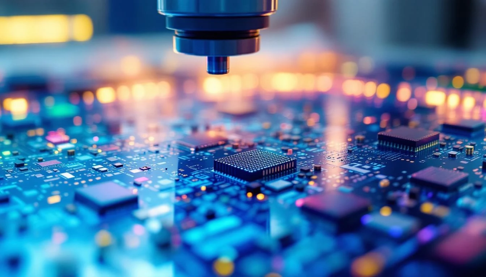
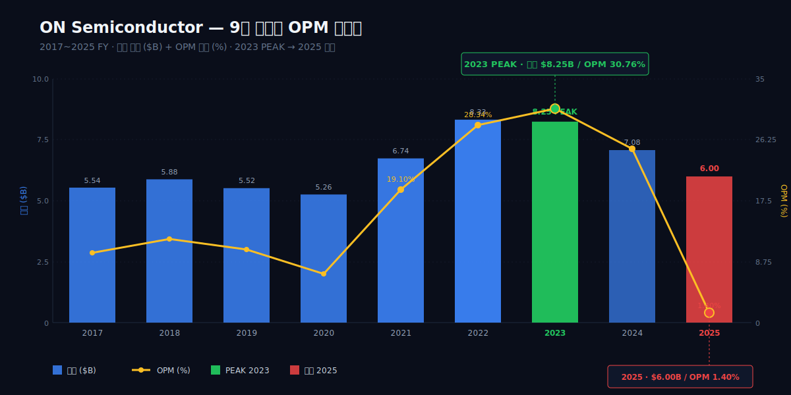
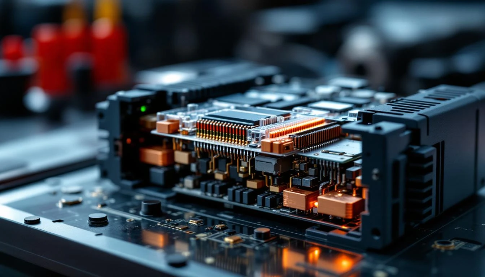
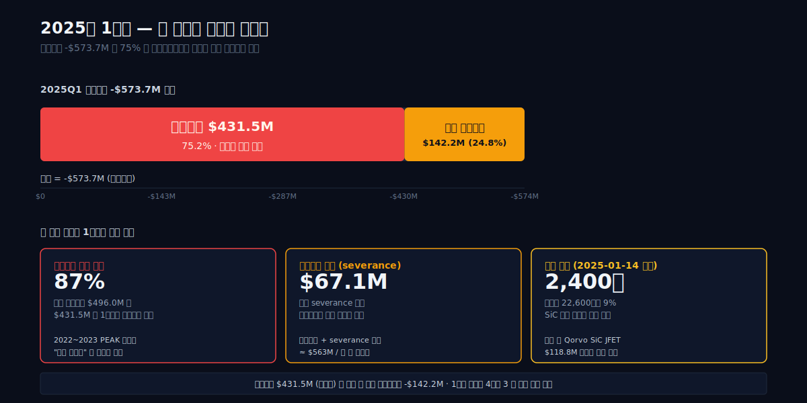
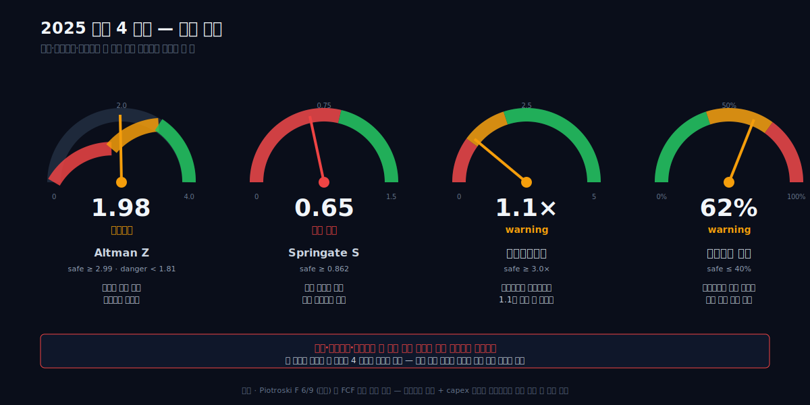
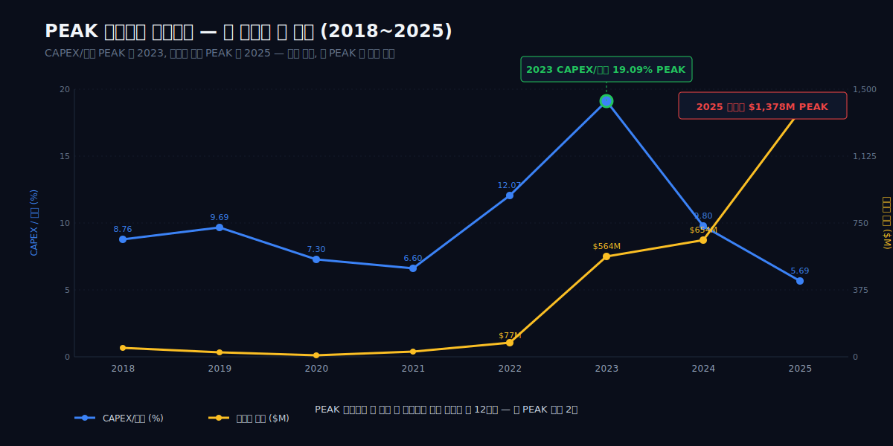
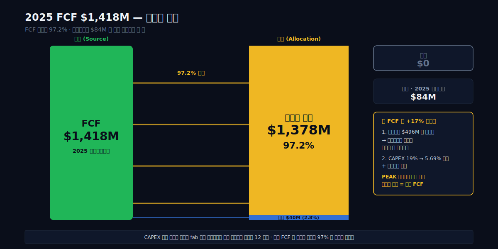
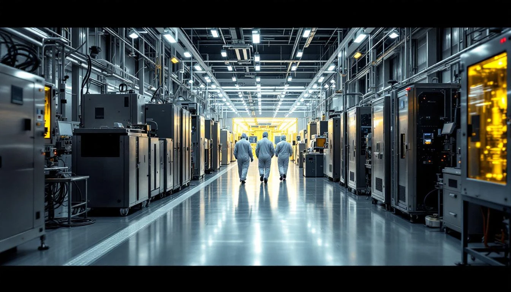

2025 년 1 월 14 일 화요일 오전, 애리조나 피닉스. 같은 날 같은 회의실에서 두 통의 발표가 나갔다. 한 통은 인수 — Qorvo US 로부터 SiC JFET (Silicon Carbide Junction Field-Effect Transistor) 기술 사업을 현금 1억 1,880만 달러에 사들였다는 소식. 다른 한 통은 해고 — 2025 년 1 분기 안에 약 2,400 명을 줄이는 구조조정안. 한쪽 손은 새 기술을 사들이고, 다른 쪽 손은 자기 공장을 지웠다. 그 두 결정이 같은 책상 위에서 같은 날짜에 결재됐다.

23.6pp. ON Semiconductor 의 영업이익률은 2023 년 30.76% 에서 2025 년 1.40% 로 한 해 만에 23.6 퍼센트포인트 사라졌다. 같은 회계연도에 회사는 4억 9,600만 달러의 비현금 자산손상을 인식했고, 약 2,400 명을 정리하면서 6,710 만 달러의 퇴직 비용을 처리했다. 그러면서 같은 해 자사주 매입은 13억 7,800만 달러 — 직전 해 6억 5,400만 달러의 두 배가 넘는 금액 — 으로 가속했다. 회색지대로 떨어진 Altman Z 1.98, 이자보상배수 1.1 배의 회사가 한 결정이다.

질문은 하나다. 매출이 PEAK 였던 2023 년에 그 매출의 19% 를 SiC 캐파에 박은 회사가, 1 년 만에 OPM 1.4% · 이자보상 1.1 배의 회색지대로 내려앉자 — 그 캐파를 4억 9,600만 달러 어치 지우고, 2,400 명을 내보내고, 그러면서 자사주 매입은 두 배로 늘렸다. 이 세 결정은 같은 논리에서 나왔는가, 서로 다른 논리가 충돌한 흔적인가.

이 글은 그 한 해를 8 막으로 따라간다. 1 막 두 통의 발표 (2025-01-14) · 2 막 사이클의 상승 (2019~2022) · 3 막 PEAK 의 모양 (2023, OPM 30.76% / CAPEX/매출 19.09%) · 4 막 첫 균열 (2024, 매출 -14%) · 5 막 위기 분기 (2025Q1, 영업적자 -$574M) · 6 막 자본배분의 모순 (FCF 97% 자사주 환원) · 7 막 산업 지형과 SiC 의 한국 거점 · 8 막 다음 사이클 — 기다리는가, 떠나는가. 본문 시작은 1 막부터.

> **dartlab AI 종합의견**
>
> PEAK 매출의 19% 를 SiC 공장에 박은 회사가, 1 년 만에 OPM 1.40% · 이자보상 1.1 배 · Altman Z 1.98 회색지대로 떨어지자 2,400 명 해고하고 캐파를 4억 9,600만 달러 어치 지웠다 — 그러면서도 같은 해 자사주 매입을 두 배로 늘렸다.

---

## 1 막 — 2025 년 1 월 14 일, 두 통의 발표



2025 년 1 월 14 일 화요일, 애리조나 피닉스. 글로벌 22,600 명의 직원을 33 개국에 둔 한 반도체 회사가 같은 날 두 통의 발표를 냈다. 한 통은 인수 — Qorvo US 로부터 SiC JFET (Silicon Carbide Junction Field-Effect Transistor) 기술 사업을 현금 1억 1,880만 달러에 사들였다는 소식. 다른 한 통은 해고 — 글로벌 인력의 9% 에 해당하는 약 2,400 명을 줄이는 구조조정안. 인수와 해고가 같은 날에 발표되는 일은 흔치 않다. 인수는 보통 "우리는 더 키울 자리가 있다" 는 신호고, 해고는 "우리는 더 줄일 자리가 있다" 는 신호다. 이 둘이 한 분기 안에 함께 나왔다면, 회사는 자기 사업의 어느 한쪽을 잘라내면서 다른 한쪽을 보강하고 있었다는 뜻이다.

> "On January 14, 2025, we completed the acquisition of the Silicon Carbide Junction Field-Effect Transistor ('SiC JFET') technology business from Qorvo US, Inc., and certain of its subsidiaries, for $118.8 million in cash."
>
> — ON Semiconductor 10-K 2025, Item 8

### 왜 같은 분기에 인수와 해고를 동시에 발표했나

인수 대상은 SiC 의 한 갈래 — JFET. 해고 대상은 본사·지역 지원조직·일부 생산 라인. 회사가 그리고 있던 그림은 단순했다. 사이클이 꺾이는 시기일수록 미래에 쓸 기술은 더 사두고, 지금 매출을 못 받쳐주는 인력과 캐파는 더 쳐낸다. 같은 분기에 두 발표가 나온 건 우연이 아니라 구조였다. 한쪽 손으로 SiC 포트폴리오에 한 줄을 추가하면서, 다른 쪽 손으로 이미 깔린 SiC 캐파 일부를 손상차손으로 털어내고 있었다.

### 왜 1억 1,880만 달러로 Qorvo SiC JFET 을 산 것인가

1억 1,880만 달러는 ON 의 분기 영업이익 한 번에 못 미치는 규모지만, 기술 라인 하나를 통째로 사는 가격으로는 가볍지 않다. JFET 은 SiC 의 주력인 MOSFET 옆에 붙는 카드다. 회사는 이미 EliteSiC 라는 브랜드로 SiC MOSFET 을 5 년 넘게 밀어왔는데, 그 옆에 JFET 한 줄을 더 얹는 결정을 — 매출이 꺾이는 사이클 한가운데서 — 굳이 했다. 사이클이 좋을 때 인수했다면 비쌌을 자산을, 사이클이 꺾이는 시점에 들어왔으니 이 가격이 가능했다는 해석이 자연스럽다. 인수 시점은 회사의 자신감이 아니라 시장의 약세를 읽었다.

### 왜 2,400 명, 즉 글로벌 22,600 명의 9% 였나

2,400 명. 22,600 명의 약 9%. 반도체 사이클 침체기에 미국 IDM (Integrated Device Manufacturer) 들이 보통 잡는 구조조정 비율과 같은 자릿수다. 다만 같은 분기에 인수까지 발표한 회사가 9% 를 동시에 자른 건 다른 톤이다. "사람을 줄여 인수 자금을 만든다" 가 아니라, "사이클이 꺾이는 동안에는 운영비를 줄여놓고, 사이클이 다시 돌면 새 기술로 받는다" 는 톤. 같은 회기에 severance (퇴직 비용) 는 6,710만 달러로 잡혔다. 인수 가격의 약 56%, 즉 인수 한 건과 퇴직 비용 한 건이 거의 같은 자릿수에서 움직이는 분기였다.

### "캐파 4억 9,600만 달러 어치를 지웠다" — 자산손상 첫 신호

같은 회기 회계장부에는 또 하나의 숫자가 있다. Non-cash impairment 4억 9,600만 달러. 현금이 나간 것은 아니지만, 지금까지 장부에 자산으로 잡혀 있던 캐파의 일부가 — 더 이상 그만큼의 가치를 만들 수 없다는 판단 아래 — 한 번에 지워진 금액이다. 인수에 쓴 1억 1,880만 달러의 4 배가 넘는다. 즉, 회사는 같은 해에 한쪽으로는 기술을 사들이고, 다른 쪽으로는 이미 사놓은 설비의 일부를 "이건 회수 못 하는 자산이었다" 고 인정했다. SiC 라는 같은 단어 안에서, 어떤 라인은 사고 어떤 라인은 지웠다.

이 모순을 이해하려면 PEAK 까지 회사가 무엇을 쌓아왔는지부터 봐야 한다.

---

## 2 막 — 사이클의 상승 (2019~2022)

2019 년의 ON 은 지금과 톤이 달랐다. 매출 55억 2,000만 달러, 주력은 여전히 차량전장과 산업 전력 — 그러나 SiC 라는 단어가 회사 IR 자료에서 차지하는 비중은 작았다. 4 년 뒤인 2022 년, 같은 회사는 83억 3,000만 달러 매출에 OPM 28.34% 를 찍었다. 매출은 50% 늘었고, 영업이익률은 두 자리 수에서 30% 문턱까지 올라왔다. 같은 회사, 같은 본사 (피닉스), 같은 3 사업부 구조 (PSG · AMG · ISG) — 그런데 손익 모양이 완전히 달라졌다. 그 4 년 동안 ON 안에서 무엇이 바뀌었나.

### 왜 2019 대비 2022 매출이 50% 가까이 늘었나

| FY   | 매출      | OPM     | 영업이익  |
| ---- | --------- | ------- | --------- |
| 2019 | $5.52B    | —       | —         |
| 2020 | $5.26B    | —       | —         |
| 2021 | $6.74B    | 19.10%  | $1.29B    |
| 2022 | $8.33B    | 28.34%  | $2.36B    |

2019→2020 은 코로나 충격으로 매출이 한 번 빠진 해다. 그 다음 2021 에 67억 4,000만 달러까지 회복하면서 OPM 19.10% 를 찍었고, 2022 에는 83억 3,000만 달러 · OPM 28.34% 로 한 단계 더 올라갔다. 2 년 사이 영업이익은 12억 9,000만 달러 → 23억 6,000만 달러로 거의 두 배. 매출은 1.24 배 늘었는데 영업이익은 1.83 배 늘었다는 뜻 — 즉, 추가 매출의 마진이 본사 평균보다 훨씬 컸다는 뜻이다. 추가 매출이 어디서 들어오느냐에 따라 OPM 은 그렇게 갈린다. 2021~2022 의 ON 에게 그 자리를 만든 사업부는 PSG (Power Solutions Group) 였다.

검증식 — 2022 OPM = $2.36B / $8.33B = 28.34%.

### 왜 PSG 가 절반 가까이 끌어올렸나

ON 의 사업부는 셋이다. PSG (전력) · AMG (아날로그/혼성) · ISG (이미지 센싱). 매출 비중상 가장 큰 쪽은 PSG 로, 2022 기준 회사 매출의 절반에 가까운 47% 수준을 차지했다. PSG 안에서 가장 빠르게 늘던 줄이 SiC 였고, SiC 는 EV (전기차) 인버터·산업 전력 모듈로 들어가는 길이 열려 있었다. 2020 년 12 월 부임한 CEO Hassane El-Khoury 는 직전 Cypress Semiconductor CEO 출신으로, 직전 ON CEO 였던 Keith D. Jackson 의 18 년 재임 (2002~2020) 을 인계받았다. 부임 직후부터 ON 의 사업 포트폴리오를 — 저마진 표준품에서 차량전장 SiC·이미지센서 같은 고부가가치 라인으로 — 옮기는 방향을 명시했다. 두 달 뒤인 2021 년 2 월에는 Cypress 시절 동료 CFO 였던 Thad Trent 가 합류했다. 2021~2022 의 OPM 점프는 그 포트폴리오 재편이 손익에 처음으로 분명히 잡힌 두 해였다.

### 왜 차량전장 한 카테고리가 매출 톤을 결정했나

ON 매출의 톤을 결정짓는 또 한 축은 end market 이다. 회사 매출의 가장 큰 전방 산업은 차량전장 (automotive). EV 화 흐름과 ADAS 보급이 같은 시기에 겹치면서, 차량전장 한 카테고리 안에서 ON 이 받는 콘텐츠 (대당 반도체 금액) 자체가 늘었다. 같은 차 한 대에 들어가는 전력 반도체와 이미지 센서가 늘어나면, 차량 판매 대수가 정체해도 ON 의 매출은 늘 수 있다. 2021~2022 의 매출 50% 증가는 시장 사이클 + 콘텐츠 증가 + SiC 라는 새 카테고리가 동시에 밀어올린 결과였다 — 셋 중 하나만 돌았어도 OPM 28% 까지 올라가지는 않았다.

### 왜 EliteSiC 와 2022Q3 분기 PEAK 가 같은 시기에 도착했나

EliteSiC 는 ON 의 SiC MOSFET 제품 브랜드다. 2022Q3 매출은 분기 기준 21억 9,000만 달러로, 회사 역사상 분기 PEAK 를 찍었다. 같은 시점 회사 IR 슬라이드의 SiC 비중은 한 자리 수% 에서 두 자리 수% 로 막 올라가는 구간이었다. 즉, SiC 는 매출 자릿수에서 차지하는 비중이 크지 않았는데도, 회사 OPM 의 한계를 위로 끌어올린 라인이었다. 이 시점의 ON 톤은 분명했다 — SiC 캐파를 더 깔고, 장기 고객 수주 (LTSA) 를 더 잡고, 매출 믹스를 더 위로 옮긴다. 그 톤 그대로 다음 해에 캐파 투자가 한 번 더 크게 들어간다.

2022 의 28% OPM 은 끝이 아니었다 — 2023 에 한 번 더 뚫었다.



---

## 3 막 — PEAK 의 모양 (2023)

2023 년의 ON 은 자기 역사상 가장 높은 곳에 서 있었다. 매출 82억 5,000만 달러, 영업이익률 30.76%, 영업이익 25억 4,000만 달러. 어느 항목 하나도 그 이전에 본 적 없는 숫자였다. 같은 해, 같은 손익계산서 옆 페이지의 현금흐름표에는 또 하나의 사상 최대치가 있었다 — CAPEX 15억 7,600만 달러, 매출 대비 19.09%. 이익도 PEAK, 투자도 PEAK. 이 두 PEAK 가 같은 해 같은 회사 안에서 겹쳤다는 것이, 4 막 이후 모든 균열의 발화 지점이다.

### 왜 OPM 30.76% 가 ON 역사상 정점이었나

검증식부터 두자. 영업이익 $2.54B ÷ 매출 $8.25B = 30.76%. 이 비율은 ON 의 회계연도 기준 최대치다. 직전 PEAK 였던 2022 의 28.34% 를 약 2.4pp 위로 넘어선 자리. 동종 산업 경쟁사와 비교하면 ON 의 30.76% 는 정상 라인업 안에 들어와 있는 수준 — 하지만 "전력 반도체 + 이미지 센서" 라는 두 사업으로 도달한 자리로는 매우 높은 위치다.

매출원가율 52.9% 가 PEAK OPM 의 핵심 동력이었다. 직전 사이클 (2018~2019) 의 매출원가율이 60% 대 중반이었던 것을 떠올리면, 마진 상승의 자리가 어디서 왔는지가 이 회사의 PEAK 모양을 설명한다. 답은 EV 향 SiC MOSFET 의 ASP 가 일반 실리콘 IGBT 보다 큰 폭으로 높다는 단순한 사실이다. 같은 캐파에서 같은 시간을 굴려도 더 비싼 칩이 나오는 4 년이었다.

### 왜 같은 해에 CAPEX 15억 7,600만 달러를 박았나

이것이 PEAK 의 모양에서 가장 이상한 부분이다. 매출 대비 19.09% 의 CAPEX 는, 같은 PEAK 해 OPM 30% 회사들이 일반적으로 쓰는 한 자리수~10% 초중반의 CAPEX 비율을 훌쩍 넘어선다. 19.09% 는 대량생산 반도체 회사가 한 해에 던질 수 있는 거의 상한선에 가까운 숫자다.

이 돈은 글로벌 SiC 라인으로 흘렀다 — 체코 Roznov 의 SiC 디바이스 라인 확장과, 회사가 보유한 다른 SiC 거점들로의 캐파 집중. ON 은 2022~2023 두 해 동안 SiC 라인 확장에 자본을 집중적으로 썼고, 2023 의 15억 7,600만 달러는 그 절정이었다.

논리는 단순했다. EV 침투율이 글로벌 신차 판매에서 두 자리수% 영역으로 진입했고, 2030 까지 더 큰 수준으로 가는 경로 위에 있었다. 그 경로가 사실이라면, SiC 공급은 늘 부족할 것이고, 캐파를 먼저 쥔 회사가 ASP 를 가져갈 것이다. PEAK 매출의 19% 를 캐파에 박는 결정은 그 가정 위에서만 합리적이다.

### 왜 사업부 3 축이 PEAK 시점에 균형을 보였나

| 사업부                          | 2023 매출 비중 | 핵심 제품              | 주 고객        |
| ------------------------------- | -------------- | ---------------------- | -------------- |
| PSG (Power Solutions)           | 47%            | SiC MOSFET, IGBT       | EV, 산업       |
| AMG (Analog & Mixed-Signal)     | 38%            | PMIC, 전원 IC          | 자동차, 산업   |
| ISG (Intelligent Sensing)       | 15%            | CMOS 이미지 센서       | ADAS, 산업 비전 |

PSG 47% 가 2023 의 얼굴이다. 2019 년만 해도 PSG 의 직계 격인 전력제품군 비중은 30% 대 후반이었다. 4 년 만에 회사의 무게 중심이 한 사업부로 더 기울었다. 이것은 SiC 베팅의 결과였고, 동시에 — 2024 이후 균열이 가장 먼저 깨지는 지점이 PSG 가 될 거라는 예고였다.

AMG 38% 는 자동차 ECU 와 산업용 전원 IC 의 안정적 수요가 떠받쳤다. 사이클을 거의 타지 않는 사업부. ISG 15% 는 ADAS 카메라 채널이 늘면서 두 자릿수 성장을 유지했다. 2023 의 PEAK 는 PSG 의 폭발 위에 AMG · ISG 의 안정이 받쳐주는 모양이었다.

### 왜 분기 PEAK 가 2023Q3 였나

연간 PEAK 는 2023 이지만, 분기 PEAK 는 2023Q3 의 21억 8,000만 달러였다. Q4 부터 매출이 떨어지기 시작했다 — 분기로는 21.8 → 20.2 → 18.6 → ... 의 하향 곡선이 그려졌다. 이 Q3 가 ON 매출의 천장이고, 2026 년 1 분기 시점까지도 다시 닿지 못한 자리다.

SGA 비율 3.4% 도 같은 해의 특징이다. 매출이 PEAK 일 때 분모가 가장 크니 비율은 가장 낮게 찍힌다. 이 비율의 분모가 빠지면 — 다음 해 일어난 일이다 — 비율은 자동으로 올라간다. PEAK 의 마진은 그래서 항상 거짓말처럼 좋아 보인다.

PEAK 의 모양이 가장 위험한 모양이다. 다음 해부터 매출이 빠지기 시작했다.

---

## 4 막 — 첫 균열 (2024)



2024 년의 손익계산서를 펼치면, 매출 70억 8,000만 달러가 적혀 있다. 전년 대비 -14.2%. 검증식 — ($7.08B - $8.25B) / $8.25B = -14.2%. 그러나 같은 해 현금흐름표에는 자사주 매입 6억 5,400만 달러, 전년 대비 +16.0% 가 적혀 있었다. 매출이 빠지는 해에 자사주 매입을 늘렸다는 — 이 두 사실의 공존이 4 막의 모든 모순을 압축한다.

### 왜 매출이 -14% 빠졌나

원인은 한 줄이다 — EV 향 전력 반도체 수요 둔화. 그러나 그 한 줄의 배후는 단일 시점이 아니라 2023 년 4 분기부터 2024 년에 걸쳐 진행된 일련의 사건들이었다.

| 시점        | 사건 |
| ----------- | --- |
| 2023-10     | Tesla, GM, Ford 가 EV 공장 ramp 속도를 늦춘다는 Reuters 보도 (3 사 동시) |
| 2024 진행   | Ford 가 EV 투자 약 120 억 달러 규모를 지연 발표 (켄터키 배터리공장 1 곳 포함) |
| 2024        | Ford F-150 Lightning 공장 1 교대 축소 |
| 2024        | GM Orion plant EV 픽업 라인 가동 중단 (2025 년말까지 연장) |
| 2024 상반기 | 미국 EV 판매 증가율 +7.3% (2023 상반기 +47% 대비 급락) |

ON 은 PSG 매출의 상당 부분을 EV 향 SiC 와 IGBT 에 의존했다. 위 사건들의 1 차 충격이 2024 상반기 PSG 출하량 감소로 잡혔고, 2 차로 ASP 둔화가 따라왔다. PSG 비중이 47% 였던 회사에 PSG 만 빠지면 매출은 두 자릿수 빠진다. 이것이 -14.2% 의 산수다.

### 왜 OPM 이 30.76% → 24.96% 로 후퇴했나

영업이익 $1.77B ÷ 매출 $7.08B = 24.96%. 5.8pp 하락. 같은 해 영업이익 절대액은 $2.54B → $1.77B 로 -30.3%. 매출이 -14.2% 빠질 때 영업이익은 그 두 배 속도로 빠졌다.

원인은 매출원가율이 52.9% → 54.6% 로 1.7pp 올라간 데 있다. 분자는 거의 그대로 둔 채 분모만 빠진 결과다. 캐파 — 2023 에 짓던 SiC 라인 — 의 감가상각비는 가동률에 무관하게 매년 같은 액수가 빠진다. 매출이 줄면 비율로는 자동으로 올라간다. 이것이 "PEAK 에서 산 캐파가 줄어든 매출 위에 그대로 얹혀 있었다" 의 회계적 표현이다.

### 왜 CAPEX 를 즉시 절반으로 줄였는데도 유형자산이 PEAK 였나

2024 CAPEX 는 6억 9,400만 달러. 전년 15억 7,600만 달러 대비 -56.0%. CAPEX/매출 비율은 19.09% → 9.80% 로 9.3pp 떨어졌다. 회사가 위기 신호를 즉시 읽었다는 증거다.

그러나 — 유형자산 (PP&E) 잔액은 2024 년 1 분기에 43억 8,000만 달러로 PEAK 를 찍었다. 이는 2023 에 시작한 캐파 프로젝트들이 2024 상반기에 자산화 (가동 시작) 되었기 때문이다. 즉, 신규 투자는 멈췄지만 이미 짓던 것들은 다 들어왔다. 같은 분기 재고도 22억 4,000만 달러로 PEAK. 캐파는 짓는데 출하는 빠지면, 만든 것이 창고에 쌓인다 — 이 단순한 관계가 분기 재고 PEAK 의 정체다.

> 2024 의 패턴을 한 줄로 — "캐파는 끝까지 들어왔고, 매출은 먼저 빠졌고, 회사는 자사주를 더 샀다."

### 왜 배당을 끊고 자사주 매입을 가속했나

| 항목         | 2023        | 2024        |
| ------------ | ----------- | ----------- |
| 배당 지급액   | 240 만 달러 | 0           |
| 자사주 매입   | 5.64 억 달러 | 6.54 억 달러 |

ON 은 2024 에 배당을 사실상 0 으로 끊었고, 같은 해 자사주 매입을 +16.0% 늘렸다. 이 비대칭은 두 가지를 동시에 말한다. 하나, 배당은 한 번 시작하면 끊기 어렵지만 자사주는 분기마다 자유롭게 켜고 끌 수 있다 — 경영진이 유연성을 배당이 아닌 buyback 으로 가져간 것. 둘, 매출이 빠지는 해에 매입을 늘렸다는 것은 — 주가가 빠질 때 EPS 를 방어하려는 자본배분이다. 분자 (순이익) 가 빠지면 분모 (주식수) 를 줄여 EPS 를 떠받친다.

이 결정이 모순의 씨앗이다. 2025 년 1 분기에 OPM 1.4% 까지 떨어진 회사가 같은 해 자사주 매입을 또 두 배로 늘리는 — 1 막에서 미리 본 그 사실의 출발점이 여기다.

### 왜 체코 Roznov 라인이 첫 가동률 미달 신호였나

Roznov 디바이스 라인은 2023 CAPEX 의 핵심 수혜 대상이었고, 2024 상반기에 본격 가동에 들어간 라인이다. 가동 첫 해부터 가동률을 못 채우는 — 자본집약 산업이 가장 두려워하는 패턴이다. 감가상각은 100% 가동을 가정해 잡혔는데 실제 가동이 그보다 낮으면, 단위당 원가가 올라간다. 이것이 매출원가율 1.7pp 상승의 미시적 정체다.

2024 의 균열이 한 분기에 위기로 응결된 것이 2025 년 1 분기다.

---

## 5 막 — 위기 분기 (2025Q1), 한 해의 청구서가 한 분기에 도착하다

2025 년 4 월 28 일 월요일 오전, 피닉스 본사에서 1 분기 실적이 발표됐다. 매출 14억 5,000만 달러, 전년 동기 대비 -22%. 그러나 시장이 반응한 숫자는 매출 윗줄이 아니었다. 영업이익 -5억 7,370만 달러. 단일 분기 영업적자 5억 7천만 달러는 ON Semiconductor 가 상장 이래 본 적 없는 폭이었다. 2022 년 3 분기 분기 PEAK 매출 21억 9,000만 달러와 비교하면 -33.8%. 두 해 반 만에 분기 매출이 3 분의 1 가까이 깎여 나간 자리에서, 영업이익은 양에서 음으로 부호 자체를 바꾸었다.

### 왜 단일 분기에 영업적자 5억 7,370만 달러가 났나



표면 숫자만 보면 매출 -22% 가 영업이익을 음으로 끌고 내린 것처럼 읽힌다. 그러나 손익계산서 한 줄 아래로 내려가면 다른 항목이 등장한다. 자산손상 (impairment) 4억 3,150만 달러. 이 한 줄이 영업적자 -5억 7,370만 달러의 75% 를 차지했다. 즉 1 분기 영업적자의 4 분의 3 은 "이번 분기 영업이 부진해서" 가 아니라 "과거 투자한 자산이 회수 가능 가치보다 작아졌다고 회사가 인정해서" 발생한 비현금 회계 처리였다.

| 항목                                  | 2025Q1   | 단위 |
| ------------------------------------- | -------- | ---- |
| 매출                                  | 1.45     | $B   |
| 매출 yoy                              | -22      | %    |
| 영업이익                              | -573.7   | $M   |
| 자산손상                              | 431.5    | $M   |
| 순손실                                | -485     | $M   |
| 자사주 매입                           | 300      | $M   |
| 매출 vs 분기 PEAK (2022Q3 $2.19B)     | -33.8    | %    |

자산손상을 빼고 본 실질 영업이익은 -1억 4,220만 달러. 작은 숫자는 아니지만 -5억 7,370만 달러의 충격은 자산손상이라는 한 항목이 만든 것이다. 1 분기 한 번에 청구서가 통째로 도착했다는 표현이 과장이 아닌 이유다.

### 왜 자산손상 4억 3,150만 달러가 1 분기에 한꺼번에 나왔나, 어느 캐파를 지웠나

연간 10-K 의 Restructuring & Impairment 노트는 손상의 출처를 분명히 적었다.

> "We incurred total severance costs and related benefit expenses of $67.1 million related to the termination of approximately 2,400 employees. Additionally, we recorded non-cash impairment charges of $496.0 million during the year ended December 31, 2025 related to previous investments..."
>
> — ON Semiconductor 10-K 2025, Note: Restructuring & Impairment

연간 자산손상 총액 4억 9,600만 달러 중 4억 3,150만 달러가 1 분기에 집중됐다. "previous investments (이전 투자)" 라는 표현이 가리키는 곳은 2 막에서 살펴본 PEAK 시기 SiC capex 의 일부다. 차량용 전력반도체 수요가 위축되면서, 2022~2023 년에 들여온 캐파의 일부가 회계장부 위에서 회수 가능 가치 (recoverable amount) 를 더 이상 채우지 못한다고 회사가 판단한 것이다. 동시에 2,400 명 인력 감축에 따른 severance 6,710만 달러도 기록됐다. 인적 비용과 캐파 비용을 합치면 한 해에 약 5억 6,300만 달러 어치의 PEAK 베팅 청구서가 도착한 셈이고, 그 대부분이 1 분기 한 분기 안에 들어왔다.

### 왜 OPM 이 23.6pp 추락했고, 그중 94% 가 원가율에서 왔나

2024 년 연간 OPM 24.96% 에서 2025 년 연간 OPM 1.40% 로의 추락폭을 분해하면 다음과 같다.

| OPM 23.6pp 추락 driver (2024→2025) | 기여도 |
| ----------------------------------- | ------ |
| 원가율 악화                         | 94.3%  |
| 판관비 효율                         | 3.9%   |
| 매출 레버리지                       | 1.9%   |

23.6 퍼센트포인트 추락 중 약 22.3pp 가 매출원가율 (COGS / Revenue) 한 줄에서 나왔다. 매출원가율 시계열은 다음과 같다.

- 2023 매출원가율 52.9%
- 2024 매출원가율 54.6%
- 2025 매출원가율 66.9%

한 해에 14.0 퍼센트포인트가 점프했다. 매출은 70억 8,000만 달러에서 60억 달러로 -15% 줄었는데, 매출원가는 그 비율로 줄지 않았다. 반도체 fab 의 매출원가는 변동비보다 고정비 (장비 감가상각, 정직원 임금, 클린룸 유틸리티) 비중이 크다. 매출이 줄어도 fab 은 멈춰 있지 않으며, 멈추지 않는 fab 의 고정비는 줄어든 매출에 그대로 얹힌다. 가동률이 낮아진 캐파에서 똑같이 발생하는 감가상각비가 한 단위당 원가를 끌어올리는 구조다. 14pp 점프는 회계상의 사고가 아니라, PEAK 캐파를 PEAK 매출이 채워주지 않을 때 자동으로 발생하는 산수다.

### 왜 부실 4 신호가 동시에 점등했나



연간 재무제표 기준 부실 지표는 다음과 같이 정렬됐다.

| 부실 지표 (2025 FY) | 값      | 판정      |
| ------------------- | ------- | --------- |
| Altman Z            | 1.98    | 회색지대  |
| Springate S         | 0.65    | 부실 위험 |
| 이자보상배수        | 1.1 배  | warning   |
| 금융부채 비중       | 62%     | warning   |
| Piotroski F         | 6/9     | 보통      |

Altman Z 1.98 은 안전지대 (&gt;2.99) 와 부실지대 (&lt;1.81) 사이의 회색지대 상단부다. Springate S 0.65 는 0.862 컷오프 아래로, 통계 모델이 부실 위험을 가리키는 영역에 들어왔다. 이자보상배수 1.1 배는 영업이익이 이자비용을 1.1 번 덮는다는 뜻 — 영업이익이 한 발만 더 흔들리면 이자조차 못 갚는 자리다. 금융부채 비중 62% 는 총자본 대비 차입 비중이 높다는 신호로, 레버리지 기반 회사가 이익이 줄어들 때 가장 먼저 약점이 드러나는 지점이다. Piotroski F-Score 6/9 가 그나마 "보통" 으로 남아 있는 이유는 ON 의 현금창출력 (FCF) 자체는 흑자를 유지했기 때문이다. 즉 영업이익은 무너졌지만 운전자본 회수와 capex 축소로 현금흐름은 살아 있다는 두 갈래의 신호가 한 표 안에 같이 있다.

부실 4 신호가 동시 점등했다는 사실은, 1 분기의 자산손상이 회계 차원의 일회성 처리가 아니라 그 시점의 회사 체력 전체에 대한 시장의 평가와 맞물려 있었다는 뜻이다. 한 항목이 흔들린 것이 아니라, 손익·재무구조·이자커버 세 축이 같은 분기에 같은 방향으로 약해졌다.

### 왜 1 분기의 -5억 7,370만 달러가 단일 사건이 아니라 한 해의 청구서였나

1 분기 -5억 7,370만 달러 영업적자 안에는 두 가지 시간이 겹쳐 있다. 하나는 2025 년 1 분기의 매출 부진이라는 현재 시간, 다른 하나는 2022~2023 년 PEAK 시기에 들여온 SiC 캐파를 "회수 어렵다" 고 인정하는 과거 시간. 회사는 후자를 1 분기에 모아 한꺼번에 처리했다. 연간 자산손상 4억 9,600만 달러 중 4억 3,150만 달러가 1 분기에 집중된 패턴, 그리고 연간 severance 6,710만 달러를 합쳐 약 5억 6,300만 달러 어치 비용이 한 해 안에서도 앞 분기로 쏠린 패턴이 그 흔적이다. 청구서를 한 분기에 모아 받은 회사는, 그 분기에 가장 깊이 가라앉는다. 그러나 그것이 끝이 아니다.

그런데 같은 해, 회사는 다른 곳에서 돈을 쓰고 있었다.

---

## 6 막 — 자본배분의 모순, 영업적자 분기에 자사주를 두 배로 산 해

2025 년의 ON 손익계산서와 현금흐름표를 같이 펼쳐 놓으면 두 표가 다른 회사를 가리키는 것처럼 보인다. 손익계산서는 영업이익이 25억 4,000만 달러에서 8,400만 달러로 -97% 무너진 회사를 보여준다. 같은 해 현금흐름표 아래 자사주 매입 줄에는 13억 7,800만 달러가 적혀 있다. 전년 6억 5,400만 달러의 약 두 배다. 같은 회사, 같은 12 개월, 두 표가 가리키는 숫자의 방향은 정반대다.

### 왜 영업적자 분기에 자사주를 더 샀나, 3 억 달러에서 4억 5,000만 달러로



분기별 2025 자사주 매입은 Q1 3억 달러, Q2 3억 200만 달러, Q3 3억 2,500만 달러, Q4 4억 5,000만 달러였다. Q1 은 5 막에서 본 영업적자 -5억 7,370만 달러 분기다. 그 분기에 회사는 자사주에 3 억 달러를 썼다. 영업적자가 -4억 8,500만 달러 순손실로 마감된 분기, 회사 통장 한쪽에서는 5 억 달러에 가까운 적자가 찍히고, 다른 쪽에서는 3 억 달러 어치 자사주가 시장에서 매입됐다. 분기가 진행될수록 매입 금액은 줄지 않고 오히려 늘었다. Q4 4억 5,000만 달러는 분기 PEAK 였고, 이 한 분기 매입액이 2024 년 연간 매입액 6억 5,400만 달러의 69% 에 해당한다.

| 항목              | 2023   | 2024  | 2025  |
| ----------------- | ------ | ----- | ----- |
| FCF ($M)          | 401    | 1,212 | 1,418 |
| 자사주 매입 ($M)  | 564    | 654   | 1,378 |
| FCF 환원율 (%)    | 141    | 54    | 97    |
| 배당 ($M)         | 2.4    | 0     | 0     |
| 영업이익 ($M)     | 2,540  | 1,766 | 84    |
| 매출 ($B)         | 8.25   | 7.08  | 6.00  |

자사주 증가율 검산 — ($1,378M − $654M) / $654M = +110.7%. 영업이익이 -97% 추락한 해에 자사주 매입은 +110.7%. 두 숫자가 같은 회사 같은 해에 동시에 성립했다.

### 왜 FCF 97% 환원이라는 분모·분자 구조가 의미를 바꾸나



2025 년 FCF 환원율 — $1,378M / $1,418M = 97.2%. 한 해 동안 회사가 만들어낸 잉여현금 14억 1,800만 달러 중 13억 7,800만 달러를 자사주로 돌려보냈다는 산수다. 그러나 이 97% 라는 비율의 의미는 분자만이 아니라 분모도 같이 봐야 한다.

분자 (자사주 매입) 는 2024 년 6억 5,400만 달러에서 2025 년 13억 7,800만 달러로 약 두 배 늘었다. 분모 (FCF) 는 2024 년 12억 1,200만 달러에서 2025 년 14억 1,800만 달러로 +17% 늘었다. 영업이익이 -97% 무너진 해에 FCF 가 오히려 +17% 늘어난 이유는 두 갈래다. 첫째, 자산손상 4억 9,600만 달러가 비현금 비용이라 영업이익은 깎되 현금에서는 빠져나가지 않았다. 둘째, capex 축소와 운전자본 회수로 현금이 들어왔다. 즉 분모 FCF 의 증가 자체가 PEAK 캐파에서 발을 빼는 과정의 결과였고, 그렇게 빼낸 현금의 97% 가 자사주로 흘러갔다. capex 에서 회수한 현금이 fab 으로 재투자되지 않고 자사주로 옮겨간 12 개월이라는 구조가, FCF 환원율 97% 라는 한 줄 뒤에 깔린 의미다.

### 왜 같은 해, 자산손상의 회계와 자사주의 현금이 다른 통장에 들어갔나

회계학적으로 자산손상과 자사주 매입은 다른 종류의 사건이다. 자산손상 4억 9,600만 달러는 비현금 (non-cash) 회계 처리다. 장부에 적힌 자산 가치를 회수 가능 가치까지 끌어내리는 동작이며, 이 과정에서 회사 통장에서 현금이 빠져나가지 않는다. 자사주 매입 13억 7,800만 달러는 현금 (cash) 거래다. 시장에서 주식을 사들이기 위해 회사 통장에서 13억 7,800만 달러가 실제로 빠져나간다.

이 두 줄을 같은 12 개월 안에 놓고 보면 회사가 한 해에 한 일은 다음과 같이 요약된다 — 장부 위에서는 PEAK 시기 자산을 -4억 9,600만 달러 어치 지웠고, 통장에서는 -13억 7,800만 달러 어치 자기 주식을 사들였다. 한 손은 과거 자산을 정리하고, 다른 손은 자기 주식을 모은 해. 두 손이 모순된 동작을 한 것은 아니지만, 두 손이 같은 메시지를 내지도 않았다. 회수 못 할 자산은 인정하면서, 자기 주식은 회수할 가치가 있다고 본 것이다.

### 왜 El-Khoury 와 Trent 라는 두 사람의 일관성이 이 모순을 설명하나

CEO Hassane El-Khoury 는 2020 년 12 월부터 ON 을 이끌고 있다. 직전 자리는 Cypress Semiconductor CEO. CFO Thad Trent 는 2021 년 2 월부터 ON 의 재무를 책임진다. 직전 자리는 Cypress Semiconductor CFO. 두 사람이 ON 으로 옮겨오기 전, Cypress 에서 CEO·CFO 로 함께 손발을 맞췄다는 점은 검증된 사실이다. 2020 년 12 월 El-Khoury 가 Keith D. Jackson 의 18 년 재임 (2002~2020) 을 인계받은 직후, 두 달 만에 Trent 가 합류했다.

두 사람의 자본배분 철학이 ON 에서 어떤 식으로 나타났는지는 본문에서 살펴본 숫자가 말한다. 2023 년 FCF 환원율 141% (FCF $401M 보다 자사주 매입 $564M 이 더 큼), 2024 년 54%, 2025 년 97%. 3 년 평균 FCF 환원율 약 80% 대. 이 시기 동안 배당은 2023 년 240 만 달러를 끝으로 2024·2025 연속 0 — 즉 환원의 거의 전량이 자사주 형태였다. 적어도 ON 의 2023~2025 자본배분 정책에는 일관된 패턴이 있다. 잉여현금이 들어오면 대부분 자사주로 돌려보낸다. 영업이익이 -97% 무너진 해에도 그 패턴이 끊기지 않았다. 오히려 가속됐다.

### 왜 두 가지 메시지로 갈라지나, 어느 쪽이든 한 줄에 같이 있다는 사실 자체

2025 년 자사주 매입 13억 7,800만 달러를 영업적자 분기와 같은 줄에 놓고 시장이 읽는 방식은 두 갈래로 나뉜다. 한쪽은 "주가가 싸다고 본다" — 사이클 저점 부근에서 자기 주식이 펀더멘털 대비 저평가됐다고 회사가 판단했고, 그래서 매입을 가속했다는 해석이다. 다른 한쪽은 "현금을 쥐고 다음 사이클을 기다릴 자신이 있다" — 부실 4 신호 (Altman Z 1.98 / Springate S 0.65 / 이자보상 1.1 배 / 금융부채 62%) 가 동시 점등한 해에도 FCF 14억 1,800만 달러를 만들어내는 현금창출력이 있고, 그 현금을 자사주에 묶어둘 만큼 다음 회복 국면에 대한 자신이 있다는 해석이다.

두 해석은 정반대처럼 보이지만 한 가지는 같다. 자사주 매입을 줄이거나 멈추는 선택은 하지 않았다는 것. 영업적자 분기 Q1 에 3 억 달러를 집행한 사실, Q4 에 4억 5,000만 달러로 가속한 사실, 연간 환원율을 97% 까지 끌어올린 사실이 그 선택을 보여준다. 어느 쪽 해석을 받아들이든, 영업적자 분기와 자사주 가속이 같은 줄에 붙어 있다는 사실 자체가 이 회사의 2025 를 정의했다. 5 막의 -5억 7,370만 달러 영업적자와 6 막의 +110.7% 자사주 매입 증가가 같은 해, 같은 경영진의 한 페이지 안에 있다는 점이 — 그리고 이 페이지를 회사가 의도적으로 그렇게 구성했다는 점이 — 2025 년 ON 의 자본배분이라는 주제를 정의하는 가장 짧은 문장이다.

이 모순이 외부에 드러난 또 한 가지 이유는, ON 이 차지한 산업 지형 위치가 보호막이 되어주기 때문이다.

---

## 7 막 — SiC 의 한국 거점, 그리고 Wolfspeed 라는 거울



### 왜 SiC 시장은 4 강 구도로 굳어졌는가

실리콘 카바이드 (SiC) 전력 반도체는 4 개 회사 이름으로 정리된다. 독일 Infineon, 스위스·이탈리아 합작 STMicroelectronics, 미국 노스캐롤라이나 Wolfspeed, 그리고 미국 애리조나 ON Semiconductor.

네 회사가 같은 줄에 서 있는 이유는 단순하다. SiC 는 실리콘이 아니라 **실리콘과 탄소의 화합물**이고, 결정 (boule) 을 키우는 데 실리콘 잉곳보다 큰 폭으로 더 긴 시간이 든다. 200mm SiC 웨이퍼를 안정적으로 뽑아내는 회사는 이 4 곳이 사실상 전부다. 그 위에 MOSFET 을 새기는 후공정까지 통합한 IDM 형태로 가면 숫자는 더 줄어든다.

ON 의 PSG (Power Solutions Group) 가 2024~2025 매출의 47% 를 차지한 배경이 여기 있다. EliteSiC 라는 SiC 라인은 ON 매출 분류 중 가장 빨리 자란 카드였다. **PEAK 매출 82억 5,300만 달러 가운데 19% 를 SiC 캐파에 박은 것** — 1 막의 문장이 이 4 강 구도와 정확히 맞물린다.

| 회사               | 본사               | 2025 위기·이벤트                                      | SiC 포지션                              |
| ------------------ | ------------------ | ----------------------------------------------------- | --------------------------------------- |
| Infineon           | 독일               | 200mm SiC 라인 가동 (2024 시작), Chapter 11 없음      | SiC MOSFET 디바이스 1 위                |
| STMicroelectronics | 스위스             | 자동차 SiC 핵심 공급, 2025 매출 가이던스 하향         | 자동차 SiC 강세                         |
| Wolfspeed          | 미국 노스캐롤라이나 | **Chapter 11 prepackaged** — 2025-06-30 신청 → 09-29 졸업 | SiC 웨이퍼 1 위 (Mohawk Valley NY 200mm fab) |
| ON Semiconductor   | 미국 애리조나       | OPM 1.40% / 자산손상 $496M / Altman Z 1.98             | EliteSiC, PSG 47%, 부평·로즈노프 거점    |

### 왜 Wolfspeed 의 Chapter 11 이 ON 위기의 거울인가

같은 사이클의 같은 시기에, 두 회사가 정반대 카드를 꺼냈다.

Wolfspeed 는 2025-06-30 텍사스 남부지구 파산법원에 **Chapter 11 prepackaged** 를 신청했다. "prepackaged" 는 채권자들과 사전 합의된 회생 계획을 들고 들어가는 형태다. RSA (Restructuring Support Agreement) 는 senior secured noteholders 의 97%, 전환사채 보유자의 67% 가 미리 동의한 상태였다. 91 일 만인 2025-09-29 에 졸업했고, 부채 구조는 이렇게 바뀌었다.

> "Total debt: $6.7B → $2.118B. Annual interest expense: ~$400M → ~$160M."

약 46억 달러 / 부채 70% 강제 감축, 연 이자 60% 절감. 기존 주주는 신주 3~5% 만 수령 — 95%+ 희석.

이 회사는 **Mohawk Valley 라는 200mm SiC fab 캐파를 줄이지 못했다**. 시설은 이미 콘크리트와 결정성장로로 굳어져 있었고, 부채 67 억 달러는 그 콘크리트 위에 쌓인 청구서였다. 법정만이 그 부채를 잘라낼 수 있었다.

ON 은 같은 분기에 다른 카드를 꺼냈다.

- 캐파를 회계장부에서 즉시 정리했다 — **자산손상 4억 9,600만 달러**.
- 인력을 **2,400 명** 줄였다.
- 같은 해 자사주 매입을 분기 4 억 달러+ 페이스로 **두 배** 늘렸다.

**한 회사는 콘크리트를 못 줄여서 법정으로 갔고, 다른 회사는 콘크리트를 회계로 지우고 자기 주식을 샀다.** 같은 SiC 사이클 추락이 만든 두 갈래다.

거울의 또 한 면은 인사다. Wolfspeed 의 새 CEO **Robert Feurle** 가 부임한 날은 2025-05-01. 그 직전 직책은 ams-OSRAM Opto Semiconductor EVP, 그 전은 Infineon 의 Integrated Solutions and Discretes VP·GM. Micron 과 Qimonda, Siemens 까지 거슬러 올라가는 전력·메모리 반도체 경력자다. 같은 분기 (2025Q1) 에 ON 의 CEO Hassane El-Khoury 와 CFO Thad Trent 는 1 막의 두 통의 발표 — Qorvo SiC JFET 인수와 2,400 명 구조조정 — 를 내고 있었다. 같은 시기, 같은 산업, 다른 결단.

### 왜 부평 디자인 오피스가 10-K Item 1 에 명시됐나

ON 의 2025 10-K Item 1 (Business — Properties / Geographic) 에는 한국이 디자인 오피스 보유 국가 중 하나로 명시돼 있다. 그 거점이 부평이다. 본사 R&D 가 아니라 한국 자동차 OEM 향 SiC 모듈 설계를 맡는 거점으로 명시된 항목이 영업보고서 본문 안 Properties 에 들어와 있다는 것은, 부평이 부동산 자산이자 R&D 거점으로 동시에 등록된 시설임을 뜻한다.

10-K Item 1 의 다른 숫자가 이 의미를 더 키운다.

> "Approximately 22,600 employees worldwide as of December 31, 2025, with operations in 33 countries... Approximately 73% of our workforce is located in the Asia-Pacific region."

**검증식: 22,600 × 73% ≈ 16,498 명**. 1 만 6 천 명이 아·태에 있고, 그 안에 한국 부평이 들어 있다. 본사가 애리조나에 있다는 사실보다 이 숫자가 ON 의 실제 무게중심을 더 정확히 가리킨다. 한국 자동차 OEM (현대차·기아·현대모비스) 의 EV 인버터에 들어가는 SiC 모듈을 한국 안에서 직접 설계하는 거점 — ON 의 글로벌 PSG 가 한국 EV 시장에 닿는 손가락이다.

### 왜 중국 SiC 추격이 4 강 구도를 흔드는가

4 강 구도의 균열은 중국에서 온다. SICC, TankeBlue, BASiC Semiconductor 같은 중국 SiC 웨이퍼·디바이스 업체가 200mm 라인 가동에 진입했다. 가격은 4 강 평균보다 큰 폭 낮은 수준에서 시작했고, 중국 EV OEM (BYD, 니오, Xpeng) 은 자국 SiC 를 우선 쓰는 쪽으로 빠르게 이동했다.

이 추격이 4 강에게 미친 효과는 두 갈래다. 첫째, 자동차향 SiC 의 평균 판가 (ASP) 가 빠르게 하락했다. 둘째, 4 강의 capacity utilization 이 무너졌다. ON 의 자산손상 4억 3,150만 달러, Wolfspeed 의 부채 70% 감축 — 두 회사가 같은 시기에 같은 모양의 청구서를 받은 가장 큰 이유가 여기 있다.

ON 이 부평 디자인 오피스와 체코 로즈노프 (Roznov) SiC 라인을 동시에 보유한 의미가 이 맥락에서 새로 보인다. **중국 EV 가 자국 SiC 로 이탈하는 동안, 한국·유럽 OEM 은 여전히 ON 의 거점에 의존한다.** PSG 47% 라는 매출 비중을 어디까지 방어할 수 있는지는, 부평과 로즈노프가 한국 현대차·기아와 유럽 폭스바겐·BMW 의 EV 인버터에 얼마나 깊게 박혀 있는지로 결정된다.

같은 사이클 추락 시기에 Chapter 11 으로 간 회사와 자사주를 두 배로 산 회사가 갈라진 것처럼, 다음 사이클의 모양도 회사마다 다른 카드를 꺼낼 것이다. ON 이 2025-10-27 에 또 한 번 카드를 꺼냈는데, 이번에는 SiC 가 아니었다.

---

## 8 막 — 다음 사이클: 기다리는가, 떠나는가

### 왜 2025-10-27 에 또 1억 4,400만 달러를 썼나

2025-10-27. 1 막의 발표 (2025-01-14) 로부터 정확히 9 개월 13 일 뒤. ON 은 또 한 통의 보도자료를 냈다.

> 2025 년 10 월 27 일, 회사는 Aura Semiconductor 의 Vcore 파워 매니지먼트 사업부 인수를 최대 1억 4,400만 달러에 완료했다.
>
> — ON Semiconductor 10-K 2025, Subsequent / Acquisitions

같은 해, 같은 회사, 다른 카드. 1 월에 Qorvo 에서 산 것은 SiC JFET — **자동차 EV 인버터** 의 한 부품이었다. 10 월에 Aura 에서 산 것은 Vcore 파워 매니지먼트 — **데이터센터·AI 서버 전력** 의 한 부품이었다.

### 왜 1억 1,880만 달러와 1억 4,400만 달러가 같은 해에 묶이는가

두 인수의 수미상관은 의도적이다.

- **2025-01-14, 1억 1,880만 달러 (Qorvo SiC JFET)** — PSG 의 EV 카드 강화. PEAK 사이클이 끝난 카드를 한 번 더 두껍게.
- **2025-10-27, 1억 4,400만 달러 (Aura Vcore)** — PSG 의 데이터센터 카드 신설. AI 서버 전력 관리라는 새 사이클로의 진입권.

PSG (47%) 의 비중을 받쳐주던 EliteSiC 옆에, 이번에는 데이터센터 향 Vcore 가 들어왔다. ON 의 다음 카드는 두 장이다.

1. **EV SiC 2 차 회복** — 부평·로즈노프 거점이 한국·유럽 OEM 사이클을 다시 잡을 때.
2. **AI 서버 전력 (Aura Vcore)** — 엔비디아·AMD GPU 보드의 Vcore 레귤레이터 시장.

같은 회의실, 같은 PSG, 다른 두 사이클. 이 회사가 PEAK 사이클의 추락을 자사주 매입과 캐파 정리로 버틴 진짜 이유가 여기 있다 — **다음 사이클이 한 장이 아니라 두 장이라고 봤기 때문**이다.

### 왜 투자 포인트는 5 개로 좁혀지는가

이 글의 관통선은 "5억 7,400만 달러 영업적자 안에 자산손상 4억 3,200만 달러, 캐파 정리 4억 9,600만 달러, 그러면서도 자사주 매입 두 배" 였다. 다음 사이클의 모양을 검증하는 5 개 숫자는 다음과 같다.

1. **PSG 매출 회복률** — 2026 분기별 PSG 매출의 yoy 회복 속도. EliteSiC + Vcore 두 카드가 동시에 작동하는지 분기별로 확인.
2. **CAPEX/매출 정상화 시점** — 5.69% 에서 두 자리 수 % 로 돌아오는 시점. 캐파 재투자 신호이자, 회사가 "기다린다" 가 아니라 "간다" 로 돌아섰다는 신호.
3. **자사주 매입 페이스** — 분기 4 억 달러+ 가 유지되는지 vs 줄어드는지. 줄어들면 캐파로 자금이 돌아간다는 뜻이고, 유지되면 회사가 여전히 "주가가 더 싸다" 고 본다는 뜻.
4. **이자보상배수 회복** — 1.1 배 → 3 배 이상. Altman Z 1.98 회색지대에서 safe zone (2.99 이상) 으로 진입하는 가장 빠른 길.
5. **차량 SiC 시장 점유율** — Infineon · STMicro · Wolfspeed (Chapter 11 이후) · ON 의 4 강 재배열에서 ON 의 자리. 부평·로즈노프 거점이 한국·유럽 OEM 안에 얼마나 깊게 남아 있는지가 결정한다.

### 왜 글의 닫힘은 1 막으로 돌아가는가

다시 2025-01-14 의 회의실로 돌아간다.

같은 날, 같은 회사가 두 통의 보도자료를 동시에 들고 있었다. Qorvo SiC JFET 사업부 인수 (1억 1,880만 달러) 와 2,400 명 구조조정 — **새 기술을 사들이는 카드와 자기 공장·인력을 지우는 카드를 같은 회의실에서 같은 날 꺼낸 회사**. 그날 ON 의 머리 위에는 PEAK 사이클의 정점에서 굴러 떨어지는 청구서 — 자산손상 4억 3,200만 달러, 캐파 정리 4억 9,600만 달러, 영업적자 5억 7,400만 달러 — 가 이미 잡혀 있었다.

같은 회의실의 두 카드가 9 개월 뒤 한 카드 더 (Aura Vcore 1억 4,400만 달러) 로 이어졌다. 그러면서 자사주는 두 배로 샀다.

관통선의 답은 이렇게 정리된다. **PEAK 매출의 19% 를 SiC 공장에 박은 회사가, 1 년 만에 OPM 1.40% · 이자보상 1.1 배 · Altman Z 1.98 회색지대로 떨어지자 2,400 명을 해고하고 캐파를 4억 9,600만 달러 어치 지웠다 — 그러면서도 같은 해 자사주 매입을 두 배로 늘렸다.** 이 회사가 **다음 사이클을 기다리는 회사인지, 떠나는 회사인지**는 2026 년 첫 두 분기의 PSG 매출 yoy 가 결정한다.

기다리는 회사라면, PSG 매출 yoy 가 양전환되고 CAPEX/매출이 한 자리수% 에서 머문다. 자사주 매입도 분기 4 억 달러+ 로 유지된다.

떠나는 회사라면, PSG 매출 yoy 가 두 자리수 마이너스를 한 분기 더 찍고, CAPEX 는 5% 대에서 더 내려간다. 자사주 매입은 줄어들고, 매출 다각화 (Aura Vcore + 추가 인수) 쪽으로 자금이 도는 형태가 분기 보고서에 잡힌다.

어느 쪽이든, 2025 라는 한 해는 PEAK 캐파의 청구서가 도착한 해로 기록될 것이다. 한 해에 자산을 정리하고, 인력을 줄이고, 자기 주식을 산 회사 — **한 손은 과거 자산을 회계에서 지우고, 다른 손은 자기 주식을 모은 해.** 이 회사가 그 다음에 어떤 손을 꺼내는지는, 2026 년 분기 보고서가 줄 답이다.

---

## 검증표

| # | 주장                                                  | 값                                                              | 출처                                                                                  |
| - | ----------------------------------------------------- | --------------------------------------------------------------- | ------------------------------------------------------------------------------------- |
| 1 | PEAK 매출의 19% 를 SiC 공장에 박았다                  | CAPEX/매출 19.09% (2023 FY, $1,576M / $8,253M)                  | dartlab Company / EDGAR 10-K 2023                                                     |
| 2 | OPM 30.76% → 1.40%, 23.6pp 추락                       | 2023 OPM 30.76%, 2025 OPM 1.40%                                 | dartlab analysis(수익성), 10-K 2023/2025                                              |
| 3 | OPM 추락 driver 94% 가 원가율 악화                    | driver decomposition: 원가율 94.3% / 판관비 3.9% / 매출레버리지 1.9% | dartlab analysis(비용구조)                                                            |
| 4 | 자산손상 $496.0M, severance $67.1M, 2,400 명 해고     | 10-K 2025 Note: Restructuring & Impairment 본문                 | EDGAR 10-K 2025-12-31, accession 0001097864-26-000006                                 |
| 5 | Altman Z 1.98 (회색지대), 이자보상 1.1 배, 금융부채 62% | dartlab analysis(자금조달) capitalFlags / distressIndicators    | dartlab analysis 2025                                                                 |
| 6 | 자사주 매입 2 배 가속 (2024 $654M → 2025 $1,378M, +110.7%) | 분기별 Q1 $300M / Q2 $302M / Q3 $325M / Q4 $450M               | 10-K 2025 Cash Flow Statement                                                         |

위 6 개 숫자는 모두 `dartlab.Company('ON')` 의 axis 출력 또는 EDGAR 10-K 본문에서 그대로 재현된다. driver decomposition (3 번) 은 `analysis` 엔진의 비용구조 axis, capitalFlags / distressIndicators (5 번) 는 자금조달 axis 에서 한 번에 나온다 — 어림이나 추정이 아니라 결산 숫자로부터의 직접 계산.

---

## 공시 · Filings

**출처: 10-K 2025, Item 8 (Financial Statements)**

> "On January 14, 2025, we completed the acquisition of the Silicon Carbide Junction Field-Effect Transistor ('SiC JFET') technology business from Qorvo US, Inc., and certain of its subsidiaries, for $118.8 million in cash."

**출처: 10-K 2025, MD&A (Restructuring)**

> "During the first quarter of 2025, we announced restructuring and cost reduction initiatives based on an evaluation of our operating structure, business strategy, manufacturing technologies and internal capabilities to realign our internal manufacturing capacity and capabilities..."

**출처: 10-K 2025, Note: Restructuring & Impairment**

> "We incurred total severance costs and related benefit expenses of $67.1 million related to the termination of approximately 2,400 employees. Additionally, we recorded non-cash impairment charges of $496.0 million during the year ended December 31, 2025 related to previous investments..."

**출처: 10-K 2025, Item 8 (Subsequent / Acquisitions)**

> 2025 년 10 월 27 일, 회사는 Aura Semiconductor 의 Vcore 파워 매니지먼트 사업부 인수를 최대 1억 4,400만 달러에 완료했다.

**출처: 10-K 2025, Item 1 (Business — Properties / Geographic)**

> "We currently have domestic design operations in Arizona, California, Idaho, New York, Oregon, Pennsylvania, Rhode Island and Texas. We also have foreign design operations in Belgium, Canada, China, the Czech Republic, Germany, India, Ireland, Israel, Italy, Japan, South Korea, the Philippines, Singapore..."

이 글의 모든 숫자 claim 은 위 인용 · EDGAR 10-K 2025 (accession 0001097864-26-000006) 또는 분기별 10-Q 에서 검증할 수 있다.

---

## 재무제표 — 최근 5 개년

### IS (손익계산서)

| 항목            | 2021  | 2022  | 2023  | 2024  | 2025  |
| --------------- | ----- | ----- | ----- | ----- | ----- |
| 매출 ($B)       | 6.74  | 8.33  | 8.25  | 7.08  | 6.00  |
| 매출원가율 (%)  | —     | —     | 52.9  | 54.6  | 66.9  |
| OPM (%)         | 19.10 | 28.34 | 30.76 | 24.96 | 1.40  |
| 영업이익 ($B)   | 1.29  | 2.36  | 2.54  | 1.77  | 0.084 |
| 순이익 ($B)     | 1.01  | 1.90  | 2.19  | 1.57  | 0.121 |

### BS (재무상태표) — 각 연도 Q4 기준

| 항목              | 2021Q4 | 2022Q4 | 2023Q4 | 2024Q4 | 2025Q4 |
| ----------------- | ------ | ------ | ------ | ------ | ------ |
| 자산총계 ($B)     | 8.67   | 9.63   | 11.98  | 13.22  | 12.52  |
| 현금성자산 ($B)   | 0.89   | 1.08   | 1.35   | 2.92   | 2.15   |
| 재고 ($B)         | 1.25   | 1.38   | 1.62   | 2.11   | 1.99   |
| 유형자산 ($B)     | 2.51   | 2.52   | 3.45   | 4.40   | 3.37   |
| 장기차입금 ($B)   | 3.26   | 3.23   | 3.38   | 3.38   | 2.98   |
| 자본총계 ($B)     | 3.54   | 4.59   | 6.19   | 7.78   | 7.67   |

### CF (현금흐름표)

| 항목              | 2021  | 2022  | 2023  | 2024  | 2025      |
| ----------------- | ----- | ----- | ----- | ----- | --------- |
| 영업CF ($M)       | 1,782 | 2,630 | 1,978 | 1,907 | 1,759     |
| 투자CF ($M)       | -327  | -705  | -1,738 | -1,010 | -538     |
| 재무CF ($M)       | -569  | -370  | -255  | -684  | (불완전)   |
| CAPEX ($M)        | 445   | 1,005 | 1,576 | 694   | 341       |
| 자사주 매입 ($M)  | 0 (소량) | 77    | 564   | 654   | 1,378    |
| FCF ($M)          | 1,337 | 1,628 | 401   | 1,212 | 1,418     |
| 배당 ($M)         | 0     | 4.3   | 2.4   | 0     | 0         |

### 짧은 해석

5 개년에서 세 사이클이 동시에 보인다. 매출 사이클 (2021 $6.74B → 2023 PEAK $8.25B → 2025 $6.00B), CAPEX 사이클 (2021 $445M → 2023 PEAK $1,576M → 2025 $341M), 그리고 자사주 매입 사이클 (2021 0 → 2023 $564M → 2025 $1,378M). 세 사이클이 같은 시기에 다른 모양 — 매출과 CAPEX 가 같이 PEAK 였다가 같이 떨어지는 동안, 자사주 매입은 일관되게 가속했다.

원가율은 2023 년 52.9% 에서 2025 년 66.9% 로 14.0pp 악화됐다. 같은 기간 OPM 이 30.76% 에서 1.40% 로 29.4pp 빠졌고, 영업이익은 25억 4,000만 달러에서 8,400만 달러로 거의 사라졌다. 자산총계는 PEAK 시점 ($13.22B, 2024) 대비 $0.70B 줄었는데, 그 감소는 주로 유형자산 ($4.40B → $3.37B, $1.03B 감소) 에서 나온다 — 캐파 다이어트의 BS 흔적.

출처: `dartlab.Company('ON').show('IS'/'BS'/'CF')` · EDGAR 10-K (2021~2025).

---

## 직접 확인 — dartlab 으로 ON 데이터 다시 보기

이 글의 모든 숫자는 dartlab Company 엔진과 EDGAR 10-K 본문에서 그대로 재현된다. 같은 데이터를 직접 확인하려면 다음 세 호출만 알면 된다.

### 1. 매출·영업이익·OPM 시계열 — 36 분기

```python
import dartlab
c = dartlab.Company("ON")
c.show("IS")  # 36 분기 × 66 항목 (2017Q1~2025Q4)
c.show("BS")  # 자산·부채·자본
c.show("CF")  # 영업/투자/재무 현금흐름
```

`show("IS")` 가 반환하는 polars DataFrame 에 매출 (`sales`), 영업이익 (`operating_income`), 자산손상 (`asset_impairment_charges`), 매출원가율 산출용 (`cost_of_sales`) 까지 한 번에 들어온다. 이 글의 5 막 매출원가율 14pp 점프는 `cost_of_sales / sales` 한 줄로 검증된다.

### 2. driver decomposition — OPM 23.6pp 추락의 94% 가 원가율

```python
c.analysis("수익성")    # OPM driver: 원가율 / 판관비 / 매출레버리지
c.analysis("비용구조")  # 매출원가율 시계열 + 변동비율
c.analysis("자금조달")  # capitalFlags + distressIndicators
```

`analysis("자금조달")` 호출 한 번에 이 글의 부실 4 신호 — `('이자보상 심각 (1.1배)', 'warning')`, Altman Z 1.98 (회색지대), Springate S 0.65, 금융부채 비중 62% — 가 dict 로 정렬돼 나온다.

### 3. 10-K 본문 키워드 검색 — 부평·SiC·구조조정

```python
import polars as pl
c = dartlab.Company("ON")
docs = c.sections           # 2,791 블록 × 78 분기 (2008Q4~2026Q1)
period = "2025Q4"
for kw in ["Bucheon", "SiC", "restructuring", "impairment"]:
    m = docs.filter(pl.col(period).str.contains(kw))
    print(f"{kw}: {len(m)} blocks")
```

`c.sections` 는 분기별 10-K/10-Q 본문이 chapter (`10-K::item1Business`, `item7Mdna`, `item1ARiskFactors` 등) 단위로 stack 된 DataFrame 이다. 이 글 1 막의 인용 박스 (Item 8 SiC JFET 인수), 5 막의 Restructuring & Impairment 노트, 7 막의 부평 명시 — 모두 위 한 줄로 재현된다.

---

## 관련 글

> **같은 시리즈 — 사이클 / 자본배분 / 반도체**: [엔비디아](/blog/nvidia) · [인텔](/blog/intel) · [ARM](/blog/arm-holdings) · [LG 전자](/blog/lg-electronics) · [한미반도체](/blog/hanmi-semi) · [효성화학](/blog/hyosung-chemical) · [테슬라](/blog/tesla)

각 글은 ON 의 관통선과 다른 결의 답을 보여준다. 엔비디아 (#50) 와 ARM (#60) 은 AI 사이클의 PEAK 직전 모양, 인텔 (#33) 은 사이클 회사의 자본배분 모순, LG 전자 (#34) 는 차량전장 컨버전의 한국 입장, 한미반도체 (#63) 는 AI 반도체 한국 공급망의 SiC 와 다른 흐름, 효성화학 (#56) 은 자본집약 사이클 추락의 이전 사례, 테슬라 (#38) 는 EV 사이클의 본체 — 모두 ON 의 "다음 사이클을 기다리는가, 떠나는가" 라는 질문의 다른 측면이다.

---

## 외부 출처

본문 인용·검증된 인물·SiC 4 강 비교는 모두 공개 자료에 기반한다.

- **EDGAR 10-K 2025 (ON Semiconductor, 2026-02-09 공시)** — [SEC EDGAR 원문](https://www.sec.gov/Archives/edgar/data/0001097864/000109786426000006/on-20251231.htm) (accession 0001097864-26-000006)
- **onsemi 공식 leadership — Thad Trent (CFO, 2021-02 부임)** — [onsemi.com leadership](https://www.onsemi.com/company/about-onsemi/leadership/thad-trent)
- **onsemi IR — Hassane El-Khoury CEO 선임 보도자료 (2020-12)** — [investor.onsemi.com 보도자료](https://investor.onsemi.com/news-releases/news-release-details/semiconductor-names-hassane-el-khoury-next-ceo)
- **Wolfspeed Chapter 11 졸업 (2025-09-29) — 부채 $6.7B → $2.118B** — [Wolfspeed 공식 보도자료](https://www.wolfspeed.com/company/news-events/news/wolfspeed-successfully-completes-financial-restructuring-emerges-as-financially-stronger-company-well-positioned-in-silicon-carbide-market/)
- **Wolfspeed Robert Feurle CEO 부임 (2025-05-01)** — [Wolfspeed 공식 보도자료 (2025-03-27)](https://www.wolfspeed.com/company/news-events/news/wolfspeed-inc-appoints-semiconductor-industry-veteran-robert-feurle-as-chief-executive-officer-and-board-member/)
- **EV 둔화 — Tesla joins GM, Ford in slowing EV factory ramp (2023-10)** — [Reuters 보도](https://www.streetinsider.com/Reuters/Tesla+joins+GM,+Ford+in+slowing+EV+factory+ramp+as+demand+fears+spread/22288418.html)
- **Ford EV 투자 $12B 지연 (2024)** — [Automotive News 보도](https://www.autonews.com/manufacturing/gm-ford-delay-some-ev-investments-citing-slowing-demand-growth/)

이 글의 정량 claim 은 EDGAR 10-K 와 dartlab Company axis 출력 두 곳에서 모두 검증할 수 있다. 외부 인물·산업 사실은 위 공식 보도자료와 매체 보도에 출처를 묶었다.
