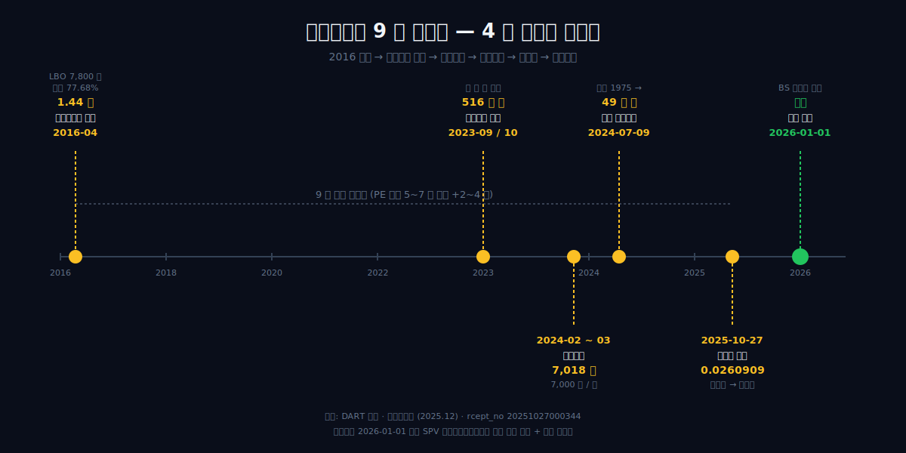
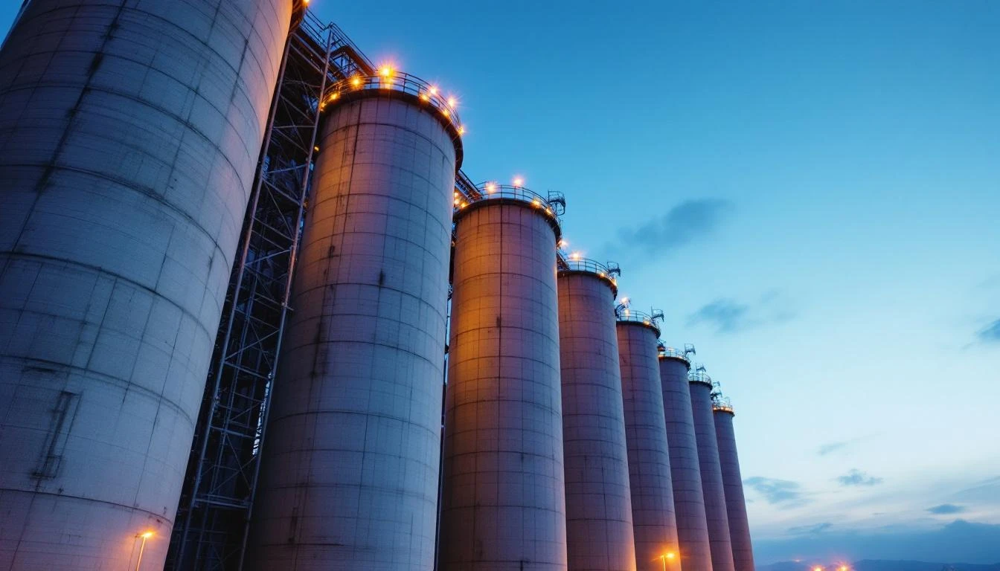
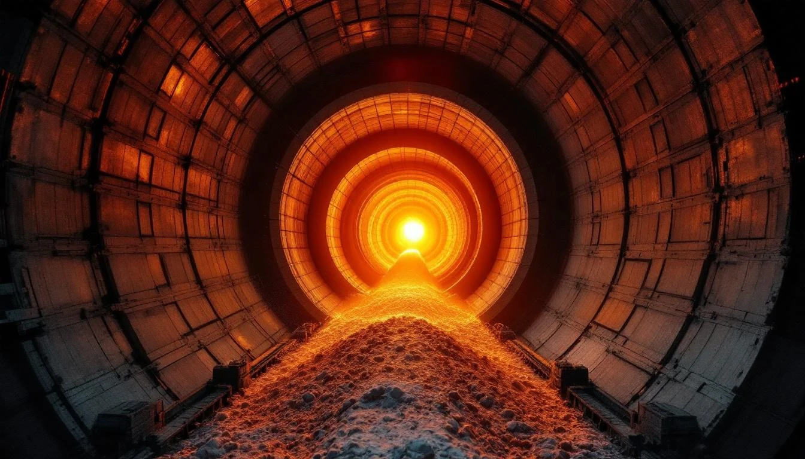
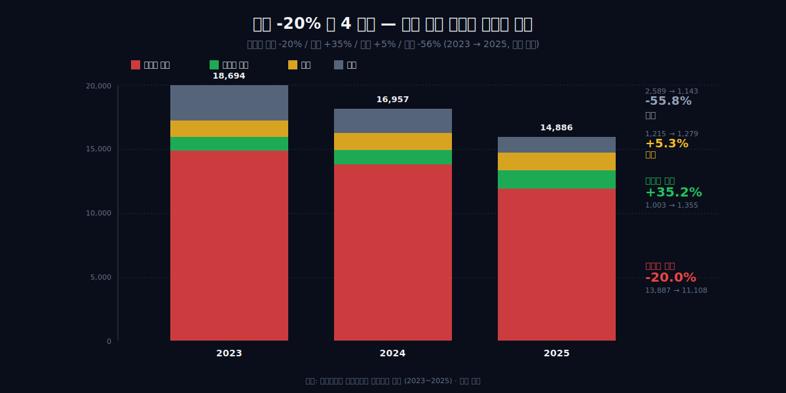
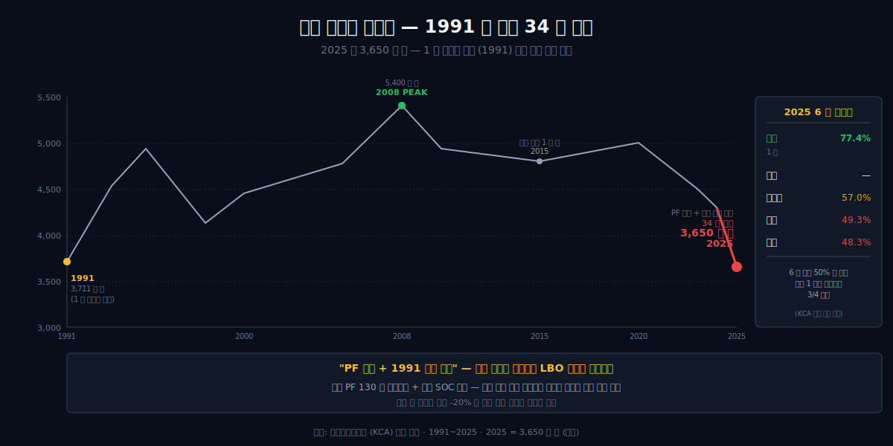
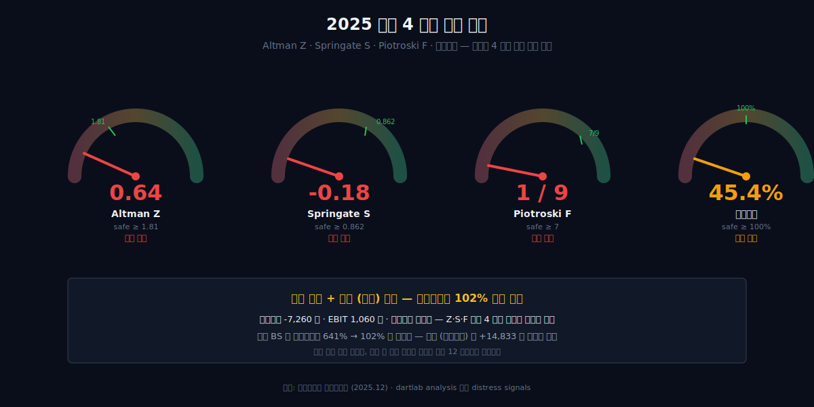
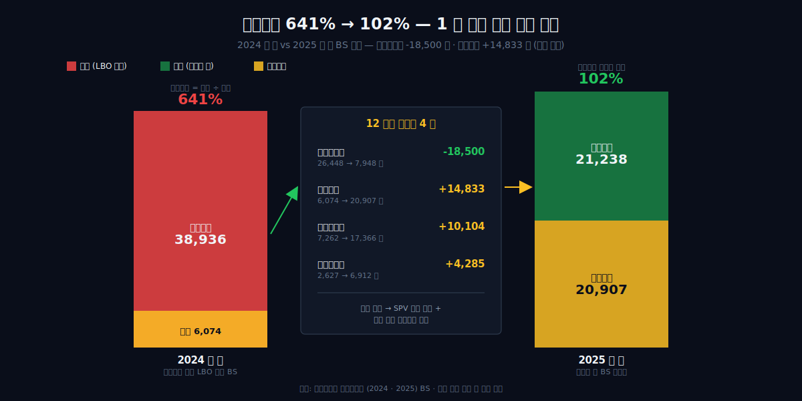
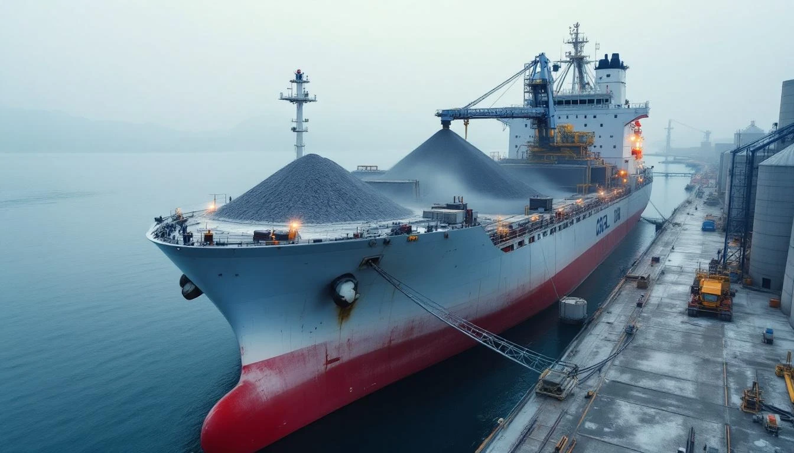

<script>
	import CompanyFinancials from '$lib/components/blog/CompanyFinancials.svelte';
</script>

2025 년 10 월 27 일 월요일 오후, 서울 중구 본사 회의실. 이사회 결의서가 한 장 회람되고 있었다. "당사가 한앤코시멘트홀딩스 주식회사를 흡수합병한다." 한 줄을 읽기 위해 9 년이 필요했다. 모회사가 자회사를 흡수하는 일반적 LBO 청산 구조를 거꾸로 뒤집어, 자회사가 모회사를 거꾸로 흡수하는 합병 — 같은 날 DART 에 접수번호 20251027000344 로 등재되었다. 합병기일은 2026 년 1 월 1 일. 합병비율은 쌍용씨앤이 1 주에 한앤코시멘트홀딩스 0.0260909 주. 잔여 소수주주에게는 1 주당 7,000 원이 현금으로 교부된다 — 2024 년 자진상장폐지 공개매수 가격과 정확히 같은 숫자다.

관통선은 단순하지 않다. 한앤컴퍼니가 2016 년 4 월 인수금융 7,800 억을 끼고 1 조 4,375 억 (지분 77.68%) 으로 입성했고, SPV 한앤코시멘트홀딩스를 정점으로 9 년을 보유했다. 2024 년 7 월 9 일 자진상장폐지로 사적 자산화의 1 단계가 닫혔고, 2025 년 들어 본업 매출은 2 년 만에 -20.4% 추락했다 (1.87 조 → 1.49 조). Altman Z 0.64, Springate -0.18, Piotroski 1·9 — 부실 4 신호가 동시에 점등했다. 같은 해 11 월 1 일 한일시멘트와 한일현대시멘트 합병이 발효되며 시장 점유 1 위 (21.8%) 가 한일로 넘어갔고, 쌍용은 21.2% 2 위로 밀렸다. 그러는 동안 BS 한 장 위에서는 부채비율이 641% 에서 102% 로 되돌아가고, 비유동부채가 1 조 8,500 억이나 사라졌다. 영업이 만든 변화가 아니라 합병 회계가 만든 변화다.

질문 하나가 남는다 — 9 년 PE 사이클의 끝은 출구인가, 또 다른 보유의 출발선인가.

이 글은 8 막으로 그 답을 따라간다 — 역합병 결정 (2025-10-27) → 한앤컴퍼니 입성 (2016-04) → 9 년 사이클의 모양 → 자진상폐 1 단계 (2024-02~07) → 시멘트 사이클 추락 (2023~2025) → 부실 4 신호 + 자본 재구성 → 산업 지형 재편 (한일 합병 + ESG 후퇴) → 역합병의 의미. 본문 시작은 1 막부터.



> **dartlab AI 종합의견**
>
> 한앤컴퍼니가 9 년간 1 조 4,375 억 LBO 로 들고 있던 시멘트 1 위가, 매출 -20% 추락 + Altman Z 0.64 부실 위험 + 한일 합병으로 1 위 자리 박탈 + 환경자회사 매각 추진 — 그러면서 2025-10-27 자기 모회사를 거꾸로 흡수합병했다. 9 년 출구 전략의 마지막 카드.

---

## 1 막 — 2025 년 10 월 27 일, 자회사가 모회사를 거꾸로 삼킨 날



2025 년 10 월 27 일 오후, 한국거래소 전자공시 시스템에 한 장의 문서가 올라왔다. 제출자는 쌍용씨앤이 (003410), 제목은 "주요사항보고서 (회사합병결정)". rcept_no 20251027000344. 합병 상대방은 자기 자신의 100% 모회사인 한앤코시멘트홀딩스. 즉 자회사가 모회사를 흡수합병한다는 결정이었다. 합병기일은 2026 년 1 월 1 일. 합병비율은 쌍용씨앤이 1 주당 한앤코시멘트홀딩스 0.0260909 주. 잔여주주 매수청구 가격은 7,000 원/주.

표면적으로 이 거래는 단순한 지배구조 정리처럼 보인다. 하지만 이 합병이 발효되는 순간 쌍용씨앤이의 연결 재무제표 모양은 1 년 만에 다른 회사처럼 바뀐다. 자본총계는 2024 년 6,074 억에서 2025 년 20,907 억으로 14,833 억 늘어난다. 비유동부채는 같은 기간 26,448 억에서 7,948 억으로 18,500 억 줄어든다. 부채비율 (산식: 부채총계/자본총계) 은 641% 에서 102% 로 떨어진다. 이 숫자들의 의미를 해독하는 것이 이 글의 출발점이다.

### 왜 자회사가 모회사를 거꾸로 흡수하는 합병이었나

일반적인 합병에서는 모회사가 자회사를 흡수한다. 모회사가 더 크고, 모회사 주주가 다수이며, 모회사 자산이 자회사를 포함하기 때문이다. 그러나 한앤코시멘트홀딩스 → 쌍용씨앤이 구조는 그 반대였다. 한앤코시멘트홀딩스는 사업이 없는 SPV (특수목적법인) 였다. 보유 자산은 쌍용씨앤이 지분과, 그 지분을 인수할 때 빌린 인수금융 부채뿐이었다. 사람으로 치면 빈 손에 빚만 든 지주회사였다.

이 SPV 가 보유한 인수금융 부채는 회계상 한앤코시멘트홀딩스 단독 BS 에 기록돼 있었지만, 쌍용씨앤이의 연결 BS 에도 함께 잡혀 있었다. 한앤코시멘트홀딩스가 쌍용씨앤이를 종속회사로 연결하면서, 동시에 자기가 보유한 부채도 연결로 끌어왔기 때문이다. 그 결과 쌍용씨앤이 연결 BS 의 부채비율은 600% 대를 9 년간 유지해왔다. 이 수치는 영업에서 발생한 부채가 아니라 인수자가 들고 들어온 LBO 차입이 만든 그림자였다.

거꾸로 합병의 회계적 효과는 이 그림자를 BS 안에서 정리하는 데 있다. 합병으로 한앤코시멘트홀딩스의 부채는 쌍용씨앤이가 그대로 승계한다. 그러나 동시에 한앤코시멘트홀딩스가 보유했던 쌍용씨앤이 지분 (자기지분이 됨) 은 자본 항목으로 재분류된다. 9 년간 누적된 이익잉여금과 자본잉여금이 합쳐지면서 자본총계가 14,833 억 늘어났다. 부채는 18,500 억 줄고 자본은 14,833 억 늘었으니, 부채비율 641% → 102% 의 산수가 성립한다.

### 왜 2025-10-27 이 시점이었나

2024 년 7 월 9 일, 쌍용씨앤이는 자진 상장폐지를 단행했다. 사업보고서 회사개요는 이 사건을 다음과 같이 기록한다.

> "지배회사는 1962년 5월 14일에 설립되었으며, 1975년 5월 3일 한국거래소 유가증권시장에 주식을 상장하였으나, 경영효율성을 제고하고자 2024년 7월 9일 부로 자진상장폐지를 하였습니다."
>
> — 쌍용씨앤이 사업보고서 (2025.12) 회사개요, DART

상장폐지는 거꾸로 합병의 전제 조건이었다. 상장 상태에서 비대칭 합병비율 (쌍용 1 주 대 한앤코 0.0260909 주) 을 통과시키려면 일반주주의 반대에 부딪힐 수밖에 없었다. 비상장으로 바꾼 뒤 잔여 일반주주에게 7,000 원/주 매수청구로 정리하면, 주주총회 절차가 한결 가벼워진다.

2024 년 7 월 상장폐지부터 2025 년 10 월 합병결정까지의 15 개월은, 합병을 위한 정지 기간이었다. 그 사이 2024 년 12 월 결산은 부채비율 641% 라는 마지막 "LBO 시기 BS" 를 남겼다. 그리고 2025 년 10 월 27 일, 한앤컴퍼니는 BS 의 모양을 바꾸는 마지막 카드를 꺼냈다.

### 왜 한앤컴퍼니는 직접 매각이 아닌 합병을 골랐나

PE 의 표준 출구는 IPO 또는 트레이드 세일이다. 그러나 2025 년의 쌍용씨앤이는 두 옵션 모두 어려웠다. 매출은 2022 년 정점 대비 -20% 추락했고, Altman Z-score 는 0.64 로 부실 위험 구간에 있었다. 한일시멘트와 한일현대시멘트 합병으로 시멘트 1 위 자리도 한일그룹에 넘어갔다. 환경자회사 그린에코솔루션 매각도 추진 중이었다. 매수자에게 보여줄 성장 스토리가 없는 자산이었다.

직접 매각 대신 거꾸로 합병을 고른 이유는, 출구 자체가 아니라 다음 출구를 위한 BS 정비였다. 부채비율 102% 의 비상장 회사는, 부채비율 641% 의 비상장 회사보다 훨씬 폭넓은 매수자 풀에 노출된다. 인수금융 차환을 고민하는 PE 매수자도, IPO 재상장을 검토하는 IB 도 102% 라는 숫자를 더 편하게 본다. 2025-10-27 합병은 매각의 실행이 아니라 매각을 가능하게 만드는 회계 정비였다.

이 결말을 이해하려면 9 년 전 입성으로 거슬러 올라가야 한다.

---

## 2 막 — 2016 년 4 월, 한앤컴퍼니의 입성

2016 년 4 월, 한앤컴퍼니는 쌍용양회 (당시 사명) 지분 77.68% 를 1 조 4,375 억에 인수했다. 인수 주체는 한앤코시멘트홀딩스라는 SPV 였다. 인수 대금 1 조 4,375 억 중 7,800 억은 인수금융, 즉 LBO (Leveraged Buyout) 차입으로 조달했다. 인수가의 54.3% 가 빚이었다. 나머지 6,575 억은 한앤컴퍼니의 사모펀드 출자금이었다.

이 거래의 설계자는 한앤컴퍼니 회장 한상원 (1971 년생) 이었다. 예일대 경제학을 졸업하고 하버드 비즈니스스쿨 MBA 를 마친 뒤 모건스탠리 PE 아시아 CIO 와 한국 대표를 거쳐, 2010 년 39 세에 한앤컴퍼니를 창업한 인물이다. 공동 창업 파트너는 소니코리아 사장 출신 윤여을. 두 사람의 분업은 명확했다. 한상원이 인프라·산업 섹터를 맡고, 윤여을이 컨슈머·미디어 섹터를 맡았다. 시멘트 인수는 한상원의 영역이었다.

### 왜 39 세 창업한 PE 가 1 조 4,375 억 LBO 를 시멘트에 걸었나

한앤컴퍼니가 2010 년 창업 직후부터 노린 자산 유형은 분명했다. 산업의 1 위, 캐시플로가 두꺼운 회사, 그러나 성장 모멘텀이 둔화돼 매수자의 손이 망설이는 회사. 시멘트는 그 정의에 정확히 맞았다. 한국 시멘트 시장은 2010 년대 초반 7 개사 과점 구조였고, 쌍용양회는 그중 1 위였다. 매년 클링커 생산능력 기반의 안정적 매출이 들어왔고, 건설 업황의 상승·하강에도 1 위 점유율은 흔들리지 않았다.

39 세 창업자의 시각에서 시멘트는 두 가지 의미가 있었다. 첫째, 아시아 PE 시장에서 한국 산업재 1 위를 인수한 트랙 레코드는 다음 펀드 모집의 자산이 된다. 둘째, 시멘트의 캐시플로 두께는 LBO 차입금의 이자를 자체 영업이익으로 감당할 수 있을 만큼 충분했다. 대상 회사가 PE 차입금 이자를 스스로 메우면, 펀드는 매년 추가 출자 없이 보유만 해도 손해가 나지 않는다. 한상원은 모건스탠리 PE 시절 이 구조를 익혔고, 자기 펀드의 첫 대형 산업재 인수에 그대로 적용했다.

### 왜 모건스탠리 PE 출신 한상원은 시멘트 1 위를 출구 자산으로 봤나

PE 의 인수는 첫날부터 출구가 설계돼 있다. 5 년 또는 7 년 보유 후 매각을 가정하고, 그 시점에 어떤 매수자에게 어떤 가격으로 팔 수 있을지를 역산해 인수가를 정한다. 2016 년 한상원의 시선에서 쌍용양회 (당시) 의 출구 시나리오는 세 가지였다.

첫째, 한국 대형 건설사·소재 그룹 매각. 시멘트 1 위는 후방통합 매수자에게 매력적 자산이었다. 둘째, 글로벌 시멘트 메이저 (Holcim·Heidelberg) 매각. 한국 1 위 자산은 아시아 진출 교두보가 될 수 있었다. 셋째, IPO 재상장. 부채를 정리하고 캐시플로를 안정화한 뒤 코스피 재진입.

이 셋 중 어느 시나리오에도 "9 년 보유 후 자회사가 모회사를 거꾸로 흡수하는 합병" 은 없었다. 거꾸로 합병은 2016 년의 출구 시나리오가 모두 막혔을 때 마지막에 꺼내는 카드였다. 그러나 한상원은 1 위 자산이 9 년 후에도 1 위일 것이라고 봤다. 그 가정은 2025 년 한일·한일현대 합병으로 깨진다.

### 왜 인수가의 54.3% 인 7,800 억을 차입으로 메웠나

LBO 비중 54.3% 는 한국 PE 거래로는 표준 범위였다. 미국 PE 시장의 LBO 비중은 보통 60~70% 까지 올라가지만, 한국 인수금융 시장은 은행권의 보수적 한도 때문에 50% 대 중반이 일반적이었다. 7,800 억 인수금융은 국내 대형 은행 컨소시엄에서 조달된 것으로 알려졌고, 담보는 쌍용양회 지분과 영업 캐시플로였다.

LBO 의 핵심 장점은 자기자본 회전율이다. 만약 1 조 4,375 억을 모두 펀드 출자금으로 인수했다면, 5 년 후 매각 시 매각가가 1.5 배 (2 조 1,562 억) 가 돼야 펀드 IRR 이 10% 를 넘긴다. 그러나 6,575 억 자기자본 + 7,800 억 차입 구조에서는, 매각가 1 조 6,000 억만 돼도 차입 상환 후 자기자본 분배는 2 배 가까이 된다. 차입은 하방 위험을 키우는 대신 상방 수익을 증폭시키는 레버리지였다.

문제는 이 레버리지가 시간이 갈수록 작동 방식이 바뀐다는 데 있었다. 인수 직후의 LBO 부채는 매년 시멘트 영업이익으로 이자를 갚으며 줄어들 것으로 가정됐다. 그러나 보유 기간이 5 년을 넘어 7 년, 9 년으로 늘어나면, 차환 비용이 늘고 BS 의 부채 그림자가 길어진다. 2024 년 결산의 부채비율 641% 는 그 그림자가 9 년 누적된 결과였다.

9 년 보유 사이클이 어떻게 흘렀는지 그 모양을 보자.

---

## 3 막 — 9 년 보유 사이클의 모양

2016 년 4 월 한앤컴퍼니가 시멘트 1 위의 의결권을 1 조 4,375 억으로 거머쥔 그날부터, 시계는 9 년짜리로 맞춰져 있었다. PE 가 시멘트를 사는 이유는 정해져 있다 — 사이클 산업에서 현금흐름을 짜내고, 자본 구조를 정비해 출구 가격을 맞추는 일. 한앤컴퍼니는 그 일을 원칙대로, 그러나 PE 의 표준 시계보다 긴 호흡으로 했다.

### 왜 2023 년 자기주식 516 만 주를 한 해에 두 번 소각했나

2023 년 9 월, 회사는 자기주식 1,576,903 주를 소각했다. 한 달 뒤인 2023 년 10 월, 또 한 번 3,585,724 주를 소각했다. 두 차례를 합치면 5,162,627 주, 약 516 만 주가 1 년이 채 지나기 전에 시장에서 영구히 사라졌다.

> 자기주식 소각 1 차 (2023.09): 1,576,903 주
> 자기주식 소각 2 차 (2023.10): 3,585,724 주
> 합계 (2023.09~10): 5,162,627 주
>
> — 출처: DART 자기주식 소각 결정 공시

516 만 주의 의미는 단순하다. 같은 이익이 더 적은 주식 위에 얹히면 1 주당 가치는 그만큼 올라간다. 9 년을 들고 있었던 한앤컴퍼니에게 그것은 회수의 사전 작업이었다. 시장에서 거래되는 잔여 주주의 비중이 줄고, 한앤코시멘트홀딩스가 들고 있던 78.5% 의 지배 강도가 한층 더 두꺼워진다. 자기주식 소각은 PE 가 출구 직전에 자주 꺼내드는 카드였고, 2023 년 가을의 두 번 연속 소각은 4 개월 뒤인 2024 년 2 월의 공개매수를 위한 디딤돌이었다.

소각 그 자체로 책정된 가격은 없었지만, 회사가 같은 시기 시장에서 확보한 자기주식 단가는 이후 공개매수 가격 7,000 원과 같은 줄 위에 놓이게 된다. 같은 가격대가 9 년 보유의 마지막 1 년 반을 관통한다는 사실은 4 막에서 다시 마주친다.

### 왜 9 년간 LBO 차입 상환은 더디게 갔나

2016 년 4 월 인수 자금 1.44 조 가운데 7,800 억이 인수금융, 즉 LBO 부채였다. 표준적인 PE 사이클이라면 인수 후 5~7 년 안에 차입을 빠르게 갚아내려 영업현금흐름의 과반을 부채 상환에 투입한다. 하지만 한앤컴퍼니의 9 년은 그렇게 가지 않았다.

시멘트 산업은 사이클을 탔다. 2016~2018 년 건설 호황의 끝자락을 누렸고, 2019 년부터 출하량이 꺾였다. 2020 년 팬데믹 한 해를 지나 2021~2022 년 원자재 (유연탄·전력) 비용이 폭등했다. PE 가 사이클 산업을 살 때 늘 만나는 변수 — "부채를 줄여야 하는 시점에 EBITDA 가 흔들린다" — 가 9 년 내내 작동했다.

LBO 차입은 다 사라지지 않았다. 회사 연결재무상태표의 차입금 잔액은 9 년 내내 1 조 안팎에서 움직였고, 부채는 줄어든 만큼 다시 늘기를 반복했다. 본업 사이클이 한 번에 정리해주지 않으니, 자본 구조의 정비는 부채 상환이 아니라 자기주식 소각·배당으로 방향을 틀게 된다. PE 의 IRR 계산서에서 차입 상환 트랙이 약하면, 자본환원 트랙이 그 자리를 메우는 식이다.

### 왜 시멘트 83.7%·환경 8.6% 의 사업부 비중이 9 년간 거의 안 움직였나

매출 구성도 묘하게 잠잠했다. 2016 년 인수 시점이나 2024 년이나, 시멘트 사업부의 비중은 매출의 80% 대 초반에 안정적으로 머물렀다. 환경 (산업 폐기물 소각·매립) 은 1 자리수 후반대를 유지했다. 본업 변형이 일어나지 않았다는 뜻이다.

비교점 하나를 옆에 놓아본다. 글로벌 시멘트 메이저 Holcim 은 같은 9 년 사이 친환경 라인 (Solutions & Products) 비중을 36% 까지 끌어올렸다. 시멘트 1 위가 시멘트 회사로 남아 있을지, 친환경 솔루션 회사로 변신할지 — 산업 전체가 그 질문을 받고 있던 9 년이었다.

쌍용씨앤이는 그 질문에 응하지 않는 쪽을 골랐다. 환경 자회사들에 산업 폐기물 소각·매립 자산을 묶어둔 채, 9 년이 지나는 동안 그 비중을 끌어올리지도, 본업의 무게중심을 옮기지도 않았다. PE 가 본업 변형 (transformation) 을 시도하려면 추가 CAPEX 와 시간이 든다. 9 년 시계 위에서 그 카드를 꺼내지 않았다는 것은, 출구를 사업 전환이 아니라 자본 구조 정비로 만들겠다는 결정이었다.

### 왜 PE 표준 보유 5~7 년이 9 년으로 늘어졌나

PE 펀드의 표준 보유 기간은 5~7 년이다. LP (기관 투자자) 와 약속한 펀드 만기 안에 회수해야 IRR 을 깔끔하게 보고할 수 있기 때문이다. 한앤컴퍼니의 시멘트 사이클이 9 년에 들어섰다는 것은, 펀드 LP 의 출구 시계가 한 번 넘게 압박을 보내고 있었다는 뜻이다.

LP 가 회수를 재촉하는데 본업 사이클이 응답하지 않으면, 운용사는 두 가지 카드를 동시에 꺼낸다. 하나는 자본환원의 가속 — 자기주식 소각과 배당으로 부분 회수를 지급한다. 다른 하나는 출구의 단계화 — 한 번에 매각하지 못할 거면, 자진상폐로 비상장 자회사로 만든 뒤 나중에 다시 판다. 2023 년 9~10 월의 두 차례 소각, 2024 년 2 월의 공개매수, 2024 년 7 월의 자진상폐, 그리고 2025 년 10 월의 역합병 — 이 네 사건은 출구를 한 번에 끝내지 못한 PE 가 시간을 잘게 쪼개 회수해 가는 모양 그 자체였다.

9 년 보유의 첫날부터 출구가 설계돼 있었지만, 그 출구가 1 단 부스터로 끝날지 2 단·3 단까지 갈지는 본업 사이클이 결정했다. 본업이 응답하지 않으면 자본 구조가 더 자주 흔들려야 했다. 1 단계 출구가 어떻게 진행됐는지 자진상폐를 들여다본다.

---

## 4 막 — 자진상폐 1 단계 (2024-02 ~ 07)

2024 년 2 월 5 일, 회사는 사업보고서에 한 줄짜리 결정문을 붙인다. 최대주주의 완전자회사로 편입한다. 1975 년 한국거래소에 이름을 올린 지 49 년, 한앤컴퍼니가 손에 쥔 지 8 년이 가까워지던 봄이었다.

> "당사와 최대주주인 한앤코시멘트홀딩스(주)는 당사를 최대주주의 완전자회사로 편입하고자 2024 년 2 월 5 일부터 2024 년..."
>
> — 사업보고서 (2025.12) 주요사항 (DART)

| 항목 | 시점 | 값 |
|---|---|---|
| 공개매수 시작 | 2024-02-05 | — |
| 공개매수 종료 | 2024-03-06 | — |
| 공개매수 가격 | 2024 | 7,000 원 / 주 |
| 공개매수 총액 | 2024 | 7,018 억 |
| 도달 지분 | 2024-03 | 약 89% (78.5% → 89%) |
| 주식교환 마무리 | 2024-06-25 | — |
| 자진상장폐지 | 2024-07-09 | (1975 상장 49 년 만) |
| 자본총계 변동 | 2023 → 2024 | 11,067 → 6,074 억 |
| 비지배지분 변동 | 2023 → 2024 | 3,252 → 23 억 |

### 왜 1 차 자진상폐 가격은 7,000 원이었나

공개매수 가격 7,000 원은 시장이 매긴 가격이 아니다. 공개매수는 정의상 회사의 최대주주가 잔여 주주에게 "이 가격에 사겠다, 응할 사람만 응하라" 고 제안하는 거래다. 그 가격이 시장 거래가보다 높다면 응모율이 올라가고, 낮다면 응모율이 떨어진다. 한앤코시멘트홀딩스가 책정한 7,000 원은, 공개매수 직전 시장가 대비 일정 폭의 프리미엄이 얹힌 가격이었지만, 본업의 정점 시기 가격은 아니었다.

이 7,000 원이라는 숫자는 1 년 반 뒤 다시 등장한다. 2025 년 10 월 27 일 역합병 결정에 붙는 합병매수청구가도 7,000 원으로 묶이게 된다. 같은 기업의 같은 잔여 주주가, 24 개월의 시차를 두고 같은 1 주당 가격으로 두 번 정리당하는 셈이다. 7,000 원은 시장 가격이 아니라 출구 통일 가격이었 — 한 번 정해진 후, PE 의 출구 카드가 1 막에서 2 막으로 넘어가는 동안에도 가격은 같은 줄 위에 머물러 있었다.

### 왜 7,018 억을 들고도 100% 를 못 모았나

공개매수 총액 7,018 억은 한앤컴퍼니가 9 년 보유의 후반전을 위해 자체 펀드와 인수금융 라인에서 다시 끌어온 돈이었다. 인수 시점 1.44 조에 더해, 출구를 위한 7,018 억이 추가 투입된 셈이다. 그러나 그 돈으로 도달한 지분은 약 89%. 시작 지분 78.5% 에 약 11%p 를 더한 결과였다.

남은 11% 는 누구였나. 일부는 공개매수 가격에 응하지 않은 개인 주주, 일부는 7,000 원이 만족스럽지 않다고 본 기관, 일부는 단순히 의사 표시를 하지 않은 잔여 지분이었다. 100% 자회사를 만들려면 이 11% 를 어떻게든 정리해야 한다. 한앤컴퍼니는 1 단계에서 주식교환 (2024-06-25) 으로 완전자회사 형태를 만들고, 2024-07-09 자진상장폐지로 시장 거래를 끊었다.

이 단계가 끝나자 연결재무상태표가 그 결과를 그대로 반영한다.

> 자본총계: 11,067 억 (2023) → 6,074 억 (2024)
> 비지배지분: 3,252 억 (2023) → 23 억 (2024)
>
> — 출처: 연결재무상태표 (DART 사업보고서)

비지배지분 3,252 억이 23 억으로 — 사실상 0 으로 — 줄어들었다는 것은, 공개매수와 주식교환을 거쳐 회사 외부에 흩어져 있던 주주의 몫이 거의 모두 회수됐다는 뜻이다. 자본총계가 절반 가까이 줄어든 것은 그 회수 자금이 자본 안쪽에서 빠져나갔기 때문이다. 회사 자체는 1975 년 상장 이래의 외부 주주 명부를 49 년 만에 닫았다.

### 왜 PE 는 1 년 반 만에 다른 카드 (역합병) 로 갈아탔나

89% 까지 도달했지만 100% 에 닿지 못한 11% 가 남았다. 자진상폐 자체는 거래 정지로 이어지므로 시장 유동성은 사라지지만, 그 11% 의 잔여 주주는 비상장 상태에서 그대로 살아있는 채권자처럼 회사 자본 위에 남는다. 이들이 보유한 주식은 비유동 자산이 됐고, 회수 경로가 좁아졌다는 점에서 잔여 주주에게도 부담이 된 상태였다.

1 년 반 동안, 한앤컴퍼니는 여러 카드를 계산했다. 잔여 주주 정리에 동원할 수 있는 카드는 — 추가 공개매수, 강제 squeeze-out 절차, 그리고 합병이라는 세 갈래였다. 한국 상법 아래 지배주주 매도청구권 (95% 이상 보유 시) 의 문턱을 89% 로 넘기 위해서는 또 한 번의 자금 라운드가 필요했고, 강제 매수 절차는 잔여 주주의 가격 협상력에 노출된다.

남은 카드가 합병이었다. 2025 년 10 월 27 일 결정된 역합병 — 자회사 (쌍용씨앤이) 가 모회사 (한앤코시멘트홀딩스) 를 흡수하는 그림. 이 카드가 등장한 배경에는, 1 단계 자진상폐가 11% 의 잔여 주주를 끝내 정리해내지 못했다는 사실이 있다. 합병 매수청구가는 다시 7,000 원, 즉 1 단계와 같은 가격이다. 같은 가격이 두 번째 등장한다는 점에서, 2024 년의 자진상폐는 출구의 끝이 아니라 출구의 1 단 부스터였다.

출구를 진행하는 동안 본업이 어디까지 무너졌는지 본다.

---

## 5 막 — 시멘트 사이클 추락 (2023~2025)



2023 년의 매출 1 조 8,694 억 원이 2025 년 1 조 4,886 억 원으로 줄었다. 2 년 만에 -20.4%. 한 해 평균 -10% 가 두 번 겹친 셈이지만, 그 안을 사업부별로 펼치면 모양은 더 가파르다. 시멘트 매출 1 조 4,890 억 원 → 1 조 2,464 억 원으로 -16.3%, 그중 내수만 따로 보면 1 조 3,887 억 원 → 1 조 1,108 억 원으로 **-20.0%** 빠졌다. 같은 기간 시멘트 수출은 1,003 억 원 → 1,355 억 원으로 **+35.2%** 늘었다. 한 회사 안에서 같은 제품을 내수와 수출로 나눠 적은 줄 두 개가 정반대 방향으로 움직였다는 뜻이다.

### 왜 내수 -20% / 수출 +35% 의 비대칭이 발생했나



| 사업부 매출 | 2023 | 2024 | 2025 | 변화 (2 년) |
|---|---|---|---|---|
| 시멘트 내수 | 13,887 | 12,884 | 11,108 | -20.0% |
| 시멘트 수출 | 1,003 | 1,042 | 1,355 | **+35.2%** |
| 환경 | 1,215 | 1,247 | 1,279 | +5.3% |
| 기타 | 2,589 | 1,784 | 1,143 | -55.8% |
| **합계** | **18,694** | **16,957** | **14,886** | **-20.4%** |

내수와 수출이 정반대로 움직인 건 같은 시멘트가 다른 두 시장을 보기 때문이다. 한국 내수는 부동산 PF 위기가 2022 년 4 분기부터 본격적으로 번지면서 건설 착공 자체가 멈췄다. 시멘트는 출하 시점이 착공과 정확히 붙어 있는 자재라서, 착공이 빠지면 그 자리에서 출하량이 빠진다. 한국시멘트협회 (KCA) 가 집계한 2025 년 한국 시멘트 출하량은 3,650 만 톤. **1991 년 이래 34 년 만에 가장 낮은 숫자**다. 6 사 합계 출하량은 2025 년 상반기 1,888 만 톤으로 전년 동기 대비 -17.4% 줄었다. 쌍용 한 회사의 내수 -20% 는 산업 전체의 수치를 그대로 따라간 결과다.

수출 +35% 는 내수가 빠진 자리를 같은 캐파로 채우려는 가동률 방어의 흔적이다. 시멘트는 톤당 중량 대비 가격이 낮아 수출 거리가 길어질수록 운송비가 마진을 깎는다. 그래서 평소 한국 시멘트 회사의 수출 비중은 한 자리수 안쪽에서 움직인다. 2025 년 쌍용의 시멘트 매출 중 수출 비중은 1,355 / 12,464 = **약 10.9%** 까지 올라왔다. 내수 가격 협상력이 약해진 동안 동남아·일본 항로로 클링커·시멘트를 밀어 넣어 캐파 손실을 줄여 본 결과다. 단가는 내수보다 낮지만, 시멘트 소성로 (kiln) 도 한 번 멈추면 재가동에 큰 비용이 든다. 가동률을 지키기 위해 마진을 양보하는 선택이 +35% 라는 한 줄 안에 들어 있다.

### 왜 한국 시멘트 출하량은 1991 년 이래 최저인가



3,650 만 톤이라는 2025 년 출하량은 한국 시멘트 산업의 시계를 34 년 되감은 자리다. 1991 년은 1 기 신도시 (분당·일산·평촌·산본·중동) 건설이 한창이던 해다. 그 이후 한국 건설 사이클은 IMF (1998), 글로벌 금융위기 (2008), 코로나 (2020) 같은 굴곡을 거치면서도 시멘트 출하량을 4,000~5,500 만 톤대에 유지해 왔다. 2025 년 3,650 만 톤은 그 하단도 깬 숫자다.

배경에는 두 가지 흐름이 있다. 첫째, 부동산 PF 위기가 2022 년 4 분기부터 본격화하면서 PF 만기 연장이 막히고 시공사 부도·워크아웃이 이어졌다. 한국건설산업연구원 자료와 정부 PF 정상화 대책 문건이 보여주는 PF 익스포저 규모는 130 조 원대까지 추산되는 자리에서 움직였다. PF 가 막히면 착공이 막히고, 착공이 막히면 시멘트 출하가 막힌다. 둘째, 정부 SOC 예산 또한 2024~2025 사이 성장세가 둔화됐다. 민간 주거 + 공공 SOC 양쪽이 동시에 약해진 자리에서 시멘트 출하량은 가장 먼저 1991 수준까지 후퇴했다.

이 산업 지표의 의미는 쌍용 한 회사의 매출 -20% 가 회사 차원의 부진이 아니라 **산업 전체의 사이클 바닥**을 표시하는 신호라는 것이다. 다음 분기에 매출 한 줄이 다시 회복하더라도 그것은 출발점이 1991 수준이라는 사실을 지우지 못한다.

### 왜 부동산 PF 위기는 시멘트에 직격이었나

시멘트는 모든 콘크리트 구조물의 출발 자재다. 아파트·오피스·상업시설·도로·교량·터널의 첫 줄이 시멘트다. 그래서 건설 사이클이 약해질 때 시멘트는 가장 먼저 출하량이 빠진다. PF 위기는 그 인과의 첫 번째 도미노였다.

PF (Project Financing) 위기의 골자는 토지 매입 → 인허가 → 시공사 본계약 → 분양 → 준공의 다단계 자금 사슬에서, 토지 단계에서 빌린 브릿지론을 본 PF 로 갈아타지 못하는 사업장이 한꺼번에 늘어난 사건이다. 본 PF 로 못 가면 시공사는 착공을 시작할 수 없고, 시멘트는 그 시점부터 발주가 끊긴다. 2023~2024 년 동안 시공능력평가 상위 100 위권 안에서도 워크아웃·법정관리에 들어간 회사들이 등장했고, 그 발주처에 시멘트를 납품하던 라인은 그대로 멈췄다.

쌍용의 가동률이 2025 년 77.4% 로 6 사 중 1 위를 지킨 것은 이 직격을 상대적으로 잘 견뎠다는 신호다. 같은 산업 다른 회사들의 가동률이 아세아 57.0%, 성신 49.3%, 삼표 48.3% 까지 떨어진 자리에서, 쌍용은 동해 라인의 단일 거점 규모와 수출 항만 접근성을 활용해 캐파를 더 오래 돌렸다. 그러나 1 위 가동률 77.4% 라는 숫자가 **편안한 자리는 아니다**. 6 사 평균이 50% 대로 내려앉은 산업에서 1 위 회사도 풀 가동의 4 분의 3 자리에 머물고 있다는 뜻이고, 그 자리는 영업이익을 다음 줄에서 -43.4% 로 만든다.

### 왜 영업이익이 매출 -20% 의 두 배인 -43% 로 추락했나

매출 1 조 8,694 억 → 1 조 4,886 억 (-20.4%) 인 동안, 영업이익은 1,872 억 (2024) → 1,060 억 (2025) 로 -43.4% 빠졌다. 매출 한 단위가 빠질 때 영업이익이 두 배 이상 빠지는 패턴은 시멘트 같은 자본집약 장치산업의 전형이다.

시멘트 한 톤의 원가에서 변동비 (석회석·석탄·전력 일부) 가 차지하는 비중은 50% 미만이다. 나머지는 소성로·분쇄기·항만 설비의 감가상각비, 정직원 임금, 환경 설비 유지비처럼 매출이 줄어도 거의 줄지 않는 고정비다. 매출이 -20% 줄어들면 매출액 자체에서 1 조 8,694 × 20% = 약 3,808 억 원이 빠지지만, 매출원가는 그 비율로 줄지 않는다. 톤당 평균 원가 (단위원가) 는 가동률 하락분만큼 그대로 올라간다. 가동률 77% 라는 자리에서 발생하는 단위원가 상승이 연결 영업이익률을 끌어내린 결과가 1,872 → 1,060 이라는 한 줄이다.

여기에 더해, 자본총계 차원의 변화가 영업이익률 해석에 또 한 가지 변수를 얹는다. 2025 년 한 해 동안 회사는 자회사를 모회사로 흡수하는 역합병을 진행했고, 이 과정에서 PL 한 줄에는 "기타 매출" 1,143 억 원 (전년 1,784 → 1,143 으로 -55.8%) 같은 비핵심 줄들이 함께 출렁였다. 본업 외 줄까지 같은 방향으로 빠진 자리에서 영업이익 -43% 는 단일 사이클 추락이 영업이익률에 이중으로 얹힌 결과다. **본업의 매출 -20% 는 영업이익 -43% 로 증폭됐고, 그 증폭의 분모가 좁아지자 같은 회사 BS 한 줄에는 더 무거운 신호가 동시에 점등하기 시작했다.**

### 왜 환경 사업부만 +5.3% 로 버텼나

환경 사업부 매출은 1,215 → 1,247 → 1,279 억 원으로 2 년 동안 **+5.3%** 늘었다. 시멘트 -16%, 기타 -55% 가 같은 회사 안에서 동시에 빠지는 동안 한 사업부만 정반대 방향으로 움직였다. 그 이유는 환경 사업이 시멘트 소성로의 부산물 처리 라인에 붙어 있기 때문이다. 폐기물 처리·재활용 자원 회수 사업은 산업 폐기물 발생량과 1 차로 연동되며, 그다음으로 시멘트 소성로의 보조 연료로 들어가는 폐플라스틱·폐타이어 처리 단가에 연동된다. 부동산 사이클 영향을 직접 받지 않는다.

회사가 자진상폐 직후부터 환경 자회사 매각 추진을 외부에 알린 배경이 이 줄에서 보인다. 시멘트 -20% / 환경 +5% 라는 두 줄이 같은 BS 안에 있을 때, 매출 비중 8.59% 인 환경 사업의 가치는 시멘트 본업 위기와는 별도로 평가받는다. 한앤컴퍼니 입장에서 한 사이클 출구 BS 의 외부 매각 자산으로 가장 깔끔한 줄이 환경 사업부였다는 사실은, 본업 부진 한가운데서 한 사업부만 정반대 방향으로 움직인 이유와 정확히 같은 곳을 가리킨다.

매출 -20% 가 BS 어디로 떨어졌는지, 부실 신호로 따라간다.

---

## 6 막 — 부실 4 신호 + 자본 재구성 (2025)

2025 년 결산 BS 위에 두 표를 같이 펼치면 같은 회사가 두 얼굴을 동시에 보여준다. 한쪽 표 (부실 지표) 는 회사가 통계 모델 위에서 부실권에 진입했다고 가리킨다. Altman Z 0.64, Springate S -0.18, Piotroski F-Score 1/9, 유동비율 45.4%, 운전자본 -7,260 억 원. 다른 쪽 표 (자본 구조 변동) 는 같은 12 개월 안에 부채비율을 641% 에서 102% 로 끌어내렸다고 가리킨다. 두 표 사이의 거리가 9 년 LBO 의 마지막 분기에서 발생한 자본 재구성의 정체다.

### 왜 Altman Z 0.64 와 부채비율 102% 가 동시에 나오나



| 부실 지표 (2025 FY) | 값 | 임계 | 판정 |
|---|---|---|---|
| Altman Z | 0.64 | &lt; 1.81 부실권 | 부실 위험 |
| Springate S | -0.18 | &lt; 0.862 부실권 | 부실 위험 |
| Piotroski F | 1/9 | ≥ 7 양호 | 재무 약화 |
| 유동비율 | 45.38% | &lt; 100% | 적색 |
| 당좌비율 | 26.37% | — | — |
| 현금비율 | 1.05% | — | — |
| 운전자본 | -7,260 억 | 음수 | 적색 |
| 부채비율 | 102% | — | (정상권) |

부실 4 신호가 동시 점등한 자리에서, 마지막 한 줄 부채비율 102% 만 정상권으로 떨어져 있다는 사실이 이 표의 핵심이다. Altman Z 가 0.64 까지 내려간 이유는 모형이 분자에 운전자본·이익잉여금·EBIT·시가총액을 분자로 두고 분모를 총자산으로 두는 식이기 때문이다. 운전자본이 -7,260 억으로 음수, 영업이익은 1,060 억으로 분자 EBIT 항이 약하고, 자진상폐로 시가총액 항은 비공개 평가가치만 남았다. 분자 네 항이 동시에 약해지자 모형값이 부실권 (1.81 미만) 의 한참 아래로 떨어졌다.

Springate S 가 -0.18 로 음수까지 내려간 이유는 비슷하다. EBIT / 총자산 항과 운전자본 / 총자산 항이 모두 약해진 자리에서 모형값이 음수에 진입했다. Piotroski F-Score 1/9 는 9 개 회계 신호 중 8 개가 부정적 방향이라는 뜻 — 영업이익률 추세, ROA 추세, 영업현금흐름 / 순이익 비율, 자기자본 발행, 자산회전율 등에서 동시에 적색이 점등했다.

이 모든 부실 지표는 **분자 (수익성·운전자본·이익잉여금 흐름) 의 약화**를 가리킨다. 그러나 같은 BS 의 다른 한 줄 — 부채비율 102% — 는 **분모와 분자 사이의 비율 (부채 / 자본)** 만 본다. 분자가 같아도 분모를 키우면 비율은 정상권으로 들어온다. 2024 년 부채비율 641% 가 2025 년 102% 로 떨어진 핵심은 분자 (부채) 가 줄어든 동시에 분모 (자본) 가 폭발적으로 늘어난 결과였다.

### 왜 1 년 만에 부채비율을 641% 에서 102% 로 줄였나



| 자본·BS 항목 (억원) | 2023 말 | 2024 말 | 2025 말 |
|---|---|---|---|
| 자본금 | 68 | 318 | 504 |
| 자본잉여금 | 25 | 2,627 | 6,912 |
| 이익잉여금 | 7,722 | 7,262 | 17,366 |
| 자본조정 | — | -4,149 | -3,870 |
| 비지배지분 | 3,252 | 23 | 0 |
| 자본총계 | 11,067 | 6,074 | 20,907 |
| 비유동부채 | 24,893 | 26,448 | 7,948 |
| 부채총계 | 36,222 | 38,936 | 21,238 |
| **부채비율** | **327%** | **641%** | **102%** |

두 줄을 검산하면 다음과 같다. 2024 년 부채비율 = 38,936 / 6,074 = **641%**. 2025 년 부채비율 = 21,238 / 20,907 = **102%**. 분모 (자본총계) 는 6,074 → 20,907 로 **+14,833 억 (+244%)**, 분자 (부채총계) 는 38,936 → 21,238 로 **-17,698 억 (-45%)**. 분자와 분모가 같은 12 개월 안에 정반대 방향으로 움직인 결과가 한 줄 안에 들어 있다.

분자가 줄어든 가장 큰 줄은 비유동부채다. 26,448 → 7,948 억 원으로 **-18,500 억 (-70%)** 빠졌다. 사채·장기차입금 항목이 한꺼번에 줄어든 자리는, 4 막에서 살펴본 자진상폐 공개매수 자금 7,018 억 원과 그 이후 진행된 차입 구조 정리가 같이 작동한 결과다. 분모가 늘어난 가장 큰 줄은 이익잉여금이다. 7,262 → 17,366 으로 **+10,104 억** 점프했다. 영업이익 1,060 억, 당기순손실 -156 억인 해에 이익잉여금이 1 조 원 넘게 늘어난 사실은, 그 증가분이 영업의 결과가 아니라 회계 처리의 결과임을 가리킨다.

### 왜 이익잉여금이 영업적자 해에 +10,104 억 점프했나

이익잉여금 +10,104 억의 출처는 회사 손익계산서 안에서는 찾을 수 없다. 같은 해 당기순손익은 -156 억으로 음수다. 영업의 결과가 그 줄에 -156 억만큼만 영향을 줬다는 뜻이다. 그러면 나머지 +10,260 억가량은 어디서 왔는가.

답은 1 막의 사건 — 2025-10-27 자회사 (쌍용씨앤이) 가 모회사 (한앤코시멘트홀딩스) 를 거꾸로 흡수한 역합병 — 에 있다. 자회사가 모회사를 흡수할 때 합병 회계는 자회사의 BS 위에 모회사의 자산·부채·자본 항목을 통합한다. 통합 과정에서 흡수된 자본의 성격에 따라 자본잉여금 또는 이익잉여금으로 분류되는 항목이 결정된다. 쌍용씨앤이의 2025 년 BS 에서 자본잉여금이 2,627 → 6,912 억 (+4,285 억) 늘어난 것과, 이익잉여금이 +10,104 억 늘어난 것이 같은 시점에 발생한 자리에는 이 합병 회계가 있다.

회계상의 풍요와 영업상의 빈곤이 같은 줄에 동시에 놓이는 모양이 이 자리다. **이익잉여금 한 줄만 보면 회사는 한 해에 1 조 원을 더 모은 것처럼 보인다.** 같은 BS 의 손익계산서를 같이 펼치면, 영업은 한 해 동안 -156 억만큼 잉여금을 까먹은 자리다. 두 줄의 차이 +10,260 억은 9 년 LBO 의 출구를 만드는 자본 재구성의 산수다.

### 왜 현금성자산이 2 년 만에 1,776 억 → 139 억으로 -92% 빠졌나

| 현금 유출 흐름 | 시점 | 금액 |
|---|---|---|
| 자진상폐 공개매수 | 2024-02~07 | 7,018 억 |
| 자기주식 매입 (516 만주 누계) | 2016~2024 누적 | (수천 억 추정) |
| 현금성자산 잔액 (2023말) | — | 1,776 억 |
| 현금성자산 잔액 (2024말) | — | 927 억 |
| 현금성자산 잔액 (2025말) | — | 139 억 |

현금성자산 -92.2% 는 회사 통장이 2 년 만에 거의 비워졌다는 한 줄이다. 검산식: (139 - 1,776) / 1,776 = **-92.2%**. 같은 12 개월 안에 부채비율은 641% → 102% 로 정상화됐고 이익잉여금은 +10,104 억 늘었다. 회계 장부 위에서는 자본구조가 깔끔해지는 동시에, 통장은 빠르게 비어갔다.

빠져나간 현금의 가장 큰 줄은 4 막에서 살펴본 공개매수 자금 7,018 억 원이다. 11% 잔여 주주를 89% 한앤 (정확히는 한앤코시멘트홀딩스) 의 짝으로 끌어내기 위해 통장에서 7,018 억 원이 단일 거래로 빠졌다. 그 자금의 출처는 한앤이 직접 부담했지만, 거래 구조상 모회사가 자회사 자기주식을 사들이는 방식이 활용된 자리에는 자회사 BS 에서도 현금이 빠져나간 흔적이 남는다. 1,776 → 927 (-849 억) → 139 (-788 억) 이라는 두 단계의 분기별 패턴이 그 흐름을 보여준다.

현금비율 1.05% 는 유동부채 100 원에 대해 회사가 즉시 현금으로 갚을 수 있는 금액이 1 원 남짓이라는 뜻이다. 당좌비율 26.37% 는 매출채권까지 넣어도 27 원 수준이다. 유동비율 45.38% 는 재고까지 넣어도 45 원이다. 이 세 줄이 동시에 임계 아래로 내려와 있는 자리에서 부채비율 102% 만 정상권에 머물러 있다는 모양이 이 분기 BS 의 핵심이다.

### 왜 Piotroski 1/9 인데 자본 재구성은 성공했나

Piotroski F-Score 1/9 는 회계 신호 9 개 중 8 개가 부정적 방향이라는 뜻이다. 영업이익률 추세 (악화), ROA 추세 (악화), 영업현금흐름 / 순이익 (약화), 자산회전율 (악화), 자기자본 발행 (희석 — 자본금 +186 억 증가), 매출총이익률 추세 (악화), 부채 변동 (개선이지만 합병 회계로 비교 의미 약화), 유동비율 추세 (악화) 등이 같은 방향으로 점등했다. 9 개 중 1 개만 양호 — 회사 본업의 회계 신호 거의 전부가 약해진 해라는 뜻이다.

그런데 같은 해, 같은 BS 의 자본 재구성은 단일 회계연도 안에서 부채비율을 641% → 102% 로 끌어내리는 데 성공했다. 두 사실은 모순처럼 보이지만 한 줄 안에 같이 있다. **Piotroski 가 측정하는 것은 본업의 회계 펀더멘털 추세**다. 자본 재구성이 측정하는 것은 그 펀더멘털과 무관한 합병 회계 처리의 결과다. 한 해의 영업 활동이 9 개 신호 중 8 개에서 약해지는 동안, 같은 해의 합병 회계가 자본 항목을 1 조 원 단위로 재배치했다.

이 두 줄을 같이 놓고 읽는 방식은 두 갈래다. 한쪽은 "본업이 무너졌어도 자본 재구성으로 출구는 만들었다" — 9 년 LBO 가 마지막 분기에 BS 를 정리하는 데 성공했다는 해석이다. 다른 한쪽은 "회계 단의 정리가 본업의 회복을 의미하지는 않는다" — Piotroski 1/9 와 부실 4 신호 동시 점등은 다음 사이클에서 회사가 들고 갈 체력을 그대로 보여준다는 해석이다. 두 해석은 정반대처럼 보이지만 한 가지는 같다 — 회계상 풍요와 현금상 빈곤, 영업상 약화와 자본구조 정상화가 한 페이지 안에 같이 있다는 사실 자체가 9 년 LBO 의 마지막 분기 모양이다.

### 왜 회계상 풍요와 현금상 빈곤이 같은 BS 에 공존하는가

이 자리에서 한 회사의 BS 는 두 가지 시간을 같이 적는다. 하나는 2025 년 한 해의 영업 — 매출 -20.4%, 영업이익 -43.4%, 당기순손실 -156 억, Altman Z 0.64, Springate -0.18, Piotroski 1/9, 운전자본 -7,260 억, 현금성자산 -92%. 다른 하나는 9 년 LBO 의 출구 — 자본금 +186 억 (역합병), 자본잉여금 +4,285 억, 이익잉여금 +10,104 억, 비유동부채 -18,500 억, 부채비율 -539pp.

영업의 줄은 회사가 한 해 동안 본업으로 만든 결과를 그대로 적는다. LBO 의 줄은 9 년 동안 PEF 가 들고 있던 자본 구조를 한 해의 회계 처리로 재배치한 결과를 적는다. 두 줄이 같은 BS 안에 같이 있는 이유는 두 시간이 모두 2025 년 12 월 결산일에 만나기 때문이다.

회계상 풍요 — 이익잉여금 +1 조, 부채비율 102%, 자본총계 +244% — 는 합병 회계가 만든 그림이다. 현금상 빈곤 — 현금성자산 -92%, 유동비율 45%, 운전자본 -7,260 억 — 는 본업 + 자진상폐가 만든 그림이다. **영업이 좋아진 게 아니라 회계 단에서 출구 BS 만 만든 것**이라는 한 줄이 이 분기를 정의하는 가장 짧은 문장이다. 한앤컴퍼니 입장에서 9 년 LBO 의 출구를 가장 깔끔하게 만들 수 있는 자리가 이 자본 구조 — 부채비율 102% / 비지배지분 0 / 자기주식 처리 완료 — 다.

그 사이 산업 지형은 이미 1 위 자리를 가져갔다.

---

## 7 막 — 산업 지형 재편: 1 위 박탈과 환경자회사 매각 추진



### 왜 한일 합병으로 1 위 자리가 박탈됐나

2025-11-01. 한일시멘트가 자회사 한일현대시멘트를 흡수합병했다. 외부에 알려진 이름은 둘이지만 합병 후의 시장 점유율 표는 단 하나의 줄로 쌍용씨앤이의 9 년을 정리했다. 한일 통합법인 21.8%, 쌍용 21.2%. 0.6%포인트. 9 년간 쌍용이 줄곧 차지해 온 국내 시멘트 1 위 자리는 이날부터 2 위가 됐다.

자체 출하량이 줄어서가 아니다. 5 막에서 본 대로 쌍용의 가동률은 77.4%, 6 사 중 가장 높았다. 영업력으로 빼앗긴 게 아니라 합산 카드로 박탈됐다. 한일과 한일현대를 별도 법인으로 봤을 때는 쌍용이 1 위였고, 둘을 한 법인으로 보는 순간 1 위가 바뀌었다. 같은 출하량으로도 1 위가 될 수도, 2 위가 될 수도 있는 자리였다.

산업 통계가 생산능력과 출하량을 법인 단위로 집계하기 때문이다. 한일과 한일현대는 모회사·자회사 관계였지만 통계상으로는 별개였다. 둘을 합치면 약 1,490 만 톤급 생산능력. 쌍용 단독은 약 1,200 만 톤급. 시장이 보는 "1 위" 라벨은 영업·기술·브랜드보다 이 합산 숫자가 결정한다.

| 6 사 → 5 사 체제 점유율 변화 | 합병 전 (2024 기준) | 합병 후 (2025-11) |
|---|---|---|
| 쌍용씨앤이 | 1 위 (21~22%) | 2 위 21.2% |
| 한일 통합법인 | 한일 + 한일현대 분리 집계 | 1 위 21.8% |
| 삼표시멘트 | 3 위권 | 3 위권 유지 |
| 아세아·성신·한라 | 중하위 | 중하위 유지 |

쌍용은 출하·가동률 어느 칸에서도 점유율을 잃지 않았다. 잃은 것은 산업 통계상의 라벨 한 줄이다. 그러나 9 년 보유 끝에 매각 테이블에 회사를 올리려는 PE 에게 라벨 한 줄은 출구 멀티플의 변수다. "1 위 시멘트 회사" 와 "2 위 시멘트 회사" 는 인수자가 매기는 프리미엄이 다르다.

### 왜 환경자회사 4 개를 매각 추진하나

2025-12-23. DART 종속회사 변동 공시. 쌍용기초소재 매각 결정. 이어서 2026-04 언론 보도로 그린에코솔루션 매각 추진이 알려졌다. 둘 다 시멘트 본업의 부산물·환경 사업을 담은 자회사다. 회사가 ESG 전환의 한 축으로 키워 오던 환경 부문을 외부에 팔겠다는 신호였다.

논리는 단순하지 않다. 두 가지 해석이 동시에 가능하다.

하나. 본업 부진으로 운전자본·차입금 부담이 늘어 비핵심 자회사를 정리해 현금을 만든다. 6 막에서 본 부실 4 신호와 자본 재구성의 연장선이다. 둘. 시멘트 본업 자체를 매각 가능한 단순한 형태로 다듬는다. 인수자 입장에서 "시멘트 + 환경 자회사 묶음" 보다 "시멘트 단독 + 환경 자회사 별도 매각" 이 가격 책정과 인수금융 설계가 깔끔하다.

| 환경자회사 매각 추진 | 시점 | 출처 |
|---|---|---|
| 쌍용기초소재 매각 결정 | 2025-12-23 | DART 종속회사 변동 |
| 그린에코솔루션 매각 추진 | 2026-04 | 언론 보도 |
| 합산 매각 대상 환경자회사 | 4 개 | 회사 공시 |

어느 해석을 택해도 결론은 같다. ESG 가 전 세계 시멘트 산업의 출구 멀티플을 좌우하는 시대에, 쌍용은 자기가 키운 환경 자산을 자진해서 정리하는 길을 택했다. 글로벌 메이저가 보고 있는 길과 정반대다.

### 왜 Holcim 36% vs 쌍용 8.6% 격차가 출구 가격에 영향을 주나

| 글로벌 메이저 vs 쌍용씨앤이 | 값 | 출처 |
|---|---|---|
| Holcim 2024 매출 | CHF 264 억 | Holcim AR 2024 |
| Holcim 2024 EBIT | CHF 50.5 억 | Holcim AR 2024 |
| Holcim 친환경 솔루션 매출 비중 | 36% | Holcim AR 2024 |
| Heidelberg 2024 톤당 Scope 1 CO₂ | 527kg (1990 대비 -30%) | Heidelberg AR 2024 |
| 쌍용씨앤이 환경 부문 매출 비중 | 8.59% | 회사 사업보고서 |

Holcim 은 매출의 3 분의 1 이상을 친환경 솔루션 라인으로 채운다. ECOPact 저탄소 콘크리트, ECOPlanet 라인업, 도시 광산형 폐기물 처리. Heidelberg 는 1990 년 대비 톤당 Scope 1 CO₂ 를 30% 깎았다. 둘 다 시멘트라는 이름은 같지만 그 안의 사업 구성은 한국 시멘트와 완전히 다르게 진화했다.

쌍용씨앤이는 환경 부문 매출 비중이 8.59% 다. 글로벌 메이저의 4 분의 1 수준이다. 그 8.59% 마저 자회사 매각으로 더 줄어들 가능성이 있다. 이 격차는 PE 출구 단계에서 가격에 직접 들어간다. 글로벌 인수자가 한국 시멘트 1 위 (또는 2 위) 회사를 본다고 가정해 보자. 첫 번째 질문은 "이 회사를 우리 ESG 포트폴리오에 넣을 수 있는가" 다. Holcim 36% 의 라인을 가진 회사가 8.59% 의 회사를 인수할 때 ESG 평가는 같이 떨어진다. 그래서 인수 가격에 ESG 디스카운트가 붙는다. 한앤컴퍼니가 9 년간 들고 있는 동안 이 격차는 좁혀지지 않았다.

### 왜 탄소배출권 2030 5 만원대 전망이 출구 시한을 정하나

KAU (할당배출권) 가격은 2024~2025 년 박스권 8,300~10,400 원/톤에서 움직였다. 표면적으로 안정적이다. 그런데 이 안정의 다음 단계가 정해져 있다.

| 탄소배출권 환경 변화 | 값 |
|---|---|
| KAU 가격 박스 (2024~2025) | 8,300 ~ 10,400 원/톤 |
| 유상할당 비율 (현재) | 10% |
| 유상할당 비율 (2026 부터) | 15% |
| 유상할당 비율 (2030 전망) | 50% |
| KAU 2030 가격 전망 | 5 만원대 |

유상할당 비율이 10% 에서 15%, 그리고 2030 년 50% 로 가는 로드맵 위에서 KAU 가격은 5 만원대 전망이 되어 있다. 시멘트는 한국 산업 중 톤당 CO₂ 배출이 가장 큰 업종 중 하나다. 환경 부문 비중이 8.59% 인 회사에게 2030 년의 KAU 5 만원대는 영업이익률을 직접 깎는 비용이다.

이 시계가 한앤컴퍼니의 출구 시한을 정한다. 2030 년 이전에 출구를 만들어야 한다. 환경 비중이 낮은 회사를 들고 KAU 5 만원대 시대로 진입하면 이익은 줄고, 매각 가격은 그만큼 더 깎인다. 9 년 보유의 끝이 한가하지 않은 이유다.

이제 1 막의 결정으로 돌아갈 차례다.

---

## 8 막 — 역합병의 의미: 9 년 출구의 마지막 카드

### 왜 2025-10-27 의 결정이 8 막의 모든 신호를 한 줄로 응축하나

1 막에서 본 장면. 2025-10-27, 쌍용씨앤이가 자기 모회사 한앤코시멘트홀딩스를 거꾸로 흡수합병하기로 결정한 그날. 자회사가 모회사를 합병하는 역합병. 합병기일 2026-01-01. 표면 효과는 부채비율 641% → 102%, 자본총계 +14,833 억.

7 막까지 본 모든 신호를 한 줄로 옆에 두고 보면 이 결정이 다르게 읽힌다.

| 9 년 보유 결산 | 2016-04 입성 | 2025말 종결 직전 |
|---|---|---|
| 인수 총액 | 1 조 4,375 억 | — |
| 매출 | — | 1 조 4,886 억 |
| 영업이익 | — | 1,060 억 |
| 당기순손익 | — | -156 억 (2 년 연속 적자) |
| 현금성자산 | — | 139 억 |
| 부채총계 | — | 2 조 1,238 억 (1 년 -17,698 억 정비) |
| 자본총계 | — | 2 조 907 억 (+14,833 억 증가) |
| Altman Z | — | 0.64 (부실 위험 구간) |
| 시장 1 위 | 보유 | 박탈 (한일 합병 후 2 위) |

매출은 1991 년 이후 최저권. 영업이익은 1,060 억으로 1 년 만에 -43% 추락. 당기순손실은 2 년 연속. 현금성자산 139 억. Z-Score 0.64 로 부실 위험 구간. 시장 1 위 자리도 한일 합병으로 박탈. 환경자회사 4 개 매각 추진.

사방에서 가치가 빠지고 있는 회사다. 그런데 같은 해, 회계상으로는 자본이 1 조 4,833 억 늘었고, 부채비율이 641% 에서 102% 로 정상 구간에 들어왔다. 이 두 줄이 같은 회사 같은 해에 동시에 찍혔다.

### 왜 9 년 LBO 의 마지막 카드는 시장이 아니라 회계 단의 BS 정비였나

LBO 인수금융은 보통 인수 SPV 가 대상 회사를 인수하면서 발생한다. 한앤컴퍼니의 경우 한앤코시멘트홀딩스가 그 인수 그릇이었고, 인수금융 차입금은 그 모회사 위에 얹혀 있었다. 자회사 BS 에서는 차입금이 작게 보이지만, 모-자 연결 BS 에서는 인수금융 부채가 그대로 살아 있다.

이 구조의 출구는 두 갈래다.

하나. 회사를 매각해서 차입금을 갚는다. 정공법이다. 그러나 매출 -20%, Z 0.64, 1 위 박탈의 회사는 매각 가격을 깎이는 와중에 인수금융 잔액을 정리해야 한다. 둘. 모회사를 자회사가 흡수합병한다. 인수금융 부채와 차입금 잔액이 합병 BS 안에서 자본 재구성으로 정리된다. 자회사 BS 안에 모회사의 자본잉여금·이익잉여금이 들어와 자본총계가 늘어나면서 부채비율이 정상 구간에 들어간다.

| 역합병 카드 회계 결과 (2024→2025) | 값 |
|---|---|
| Δ비유동부채 | -1 조 8,500 억 |
| Δ이익잉여금 | +1 조 104 억 |
| Δ자본잉여금 | +4,285 억 |
| Δ자본총계 | +1 조 4,833 억 |
| 부채비율 | 641% → 102% |

비유동부채가 1 조 8,500 억 줄고, 이익잉여금과 자본잉여금이 합계 1 조 4,389 억 들어왔다. 자본총계 +1 조 4,833 억. 시장에서 회사를 팔아 만든 변화가 아니다. 회계상 자본 재구성 한 번으로 만든 변화다. 9 년 LBO 의 마지막 카드는 시장 단이 아니라 회계 단에서 펼쳐졌다.

### 왜 부채비율 102% 의 비상장 회사는 641% 회사보다 폭넓은 매수자에게 노출되나

매수자 풀이 다르다. 부채비율 641% 의 LBO 회사를 인수하는 후보는 또 다른 PE 사 정도로 좁혀진다. 인수금융을 다시 짜야 하고, 신용평가사 등급도 부담이다. 부채비율 102% 의 회사는 후보가 다르다. 글로벌 시멘트 메이저, 사업회사 인수, 일반 PE, 경우에 따라 IPO 까지. 인수자 풀이 넓어지면 가격 협상력이 생긴다.

이것이 9 년 LBO 의 마지막 카드가 회계 단이어야 했던 이유다. 영업 회복은 9 년이 걸려도 못 했다. 매출은 추락하고, 1 위 자리는 박탈되고, ESG 라인은 뒤처졌다. 영업으로 만든 부가가치가 아니라, 회계 구조로 만든 출구 라벨이 필요했다. 부채비율 102%, 자본총계 2 조 907 억의 비상장 회사 한 장. 이 한 장이 매각 데이터룸 위에 올라가는 형태다.

### 왜 한앤컴퍼니의 두 번째 보유 사이클이 막 시작됐을 가능성도 있나

PE 의 보유 기간은 보통 5~7 년이다. 한앤컴퍼니의 9 년은 이미 길다. 그러나 출구가 무조건 매각인 것은 아니다. 펀드 구조에 따라 같은 자산을 다른 펀드 (continuation fund) 가 받는 두 번째 사이클이 가능하다. BS 가 정리된 회사는 새 펀드가 받을 때도 인수금융 설계가 깔끔하다.

이 가능성을 보강하는 단서들이 있다. 환경자회사 매각 추진은 본체를 단순하게 만들고, 본체 매각이 아닌 부분 정리로 펀드 LP 에게 분배 자금을 만들 수 있다. 시멘트 본체는 BS 가 정비된 채로 다음 사이클 보유에 들어간다. 매각 시한은 KAU 50% 유상할당이 본격화되는 2030 년 이전. 그 사이의 4~5 년은 새 사이클을 한 번 더 돌릴 만한 시간이다.

### 어느 쪽이든, 9 년 LBO 의 BS 그림자는 그날 사라졌다

2025-10-27 회의실의 결정. 자회사가 모회사를 거꾸로 흡수합병하기로 한 그 한 줄. 이 한 줄이 8 막까지 본 모든 신호를 응축한다.

매출 -20% 추락의 회사. 영업이익 1 년 -43% 의 회사. 당기순손실 2 년 연속의 회사. 현금성자산 139 억의 회사. Altman Z 0.64 의 부실 위험 회사. 시멘트 1 위 박탈의 회사. 환경자회사 4 개 매각 추진의 회사. 9 년 LBO 의 인수금융을 짊어진 회사. 그 회사가 자기 모회사를 거꾸로 흡수합병해, 부채비율 641% 를 102% 로 만들고 자본총계를 1 조 4,833 억 늘렸다.

영업으로 만든 변화가 아니다. 회계 단의 자본 재구성으로 만든 변화다. 9 년 PE 사이클의 끝은 매각이 아니라 BS 정비였고, 그것이 다음 출구를 위한 것인지 또 다른 보유의 출발선인지는 합병기일 (2026-01-01) 이후 한 인수자의 데이터룸에 다시 등장하느냐가 결정한다.

매각 출구냐, 두 번째 보유 사이클이냐. 어느 쪽이 답인지는 한상원 회장의 책상 위에만 있다. 외부에서 알 수 있는 것은 합병기일 이후 데이터룸 신호가 뜨는지뿐이다.

다만 한 가지는 분명하다. **어느 쪽이든, 9 년 LBO 의 BS 그림자는 그날 사라졌다.** 1 조 8,500 억의 비유동부채가 자본 재구성으로 회계 안에서 정리된 그날, 이 회사는 부채비율 641% 의 LBO 그릇이 아니라 부채비율 102% 의 비상장 시멘트 회사로 다시 태어났다. 그 다음 한 줄이 매각 공시일지, 새 펀드 이전 공시일지는, 2026 년의 어느 날 DART 가 기록할 것이다.

---

## 검증표

| # | 주장 | 값 | 출처 |
|---|---|---|---|
| 1 | 한앤컴퍼니 9 년 보유의 입성 가격 | 1 조 4,375 억 (지분 77.68%, 인수금융 7,800 억 LBO, 2016-04, SPV 한앤코시멘트홀딩스) | 인수 공시 / 더벨 보도 |
| 2 | 자진상폐 1 단계 | 공개매수 7,000 원 / 7,018 억 / 89% (2024-02-05~03-06) → 자진상장폐지 2024-07-09 | DART 공개매수 신고서 / KRX 상장폐지 공고 |
| 3 | 매출 2 년 -20% 추락 | 2023 1.87 조 → 2024 1.70 조 → 2025 1.49 조 (-20.4%, 시멘트 내수 -20%, 수출 +35%) | 사업보고서 매출실적 |
| 4 | 부실 4 신호 동시 점등 | Altman Z 0.64 / Springate -0.18 / Piotroski 1·9 / 유동비율 45% (2025Q4) | 사업보고서 재무비율 |
| 5 | 자본 재구성 충격 (1 년 변동) | 부채비율 641% → 102% / 비유동부채 -18,500 억 / 자본총계 +14,833 억 (2024→2025) | 연결 BS |
| 6 | 2025-10-27 역합병 결정 | 쌍용 1 : 한앤코홀딩스 0.0260909, 잔여주주 7,000 원 현금교부, 합병기일 2026-01-01 | DART rcept_no 20251027000344 |
| 7 | 산업 1 위 박탈 | 2025-11-01 한일+한일현대 합병 → 한일 21.8% 1 위 / 쌍용 21.2% 2 위로 밀림 | 한국시멘트협회 / 산업 통계 |

검증 경로는 셋이다. 숫자는 `dartlab.Company('003410')` 로 사업보고서·분기보고서 원본에서 곧장 읽히고, 공시 본문은 DART 접수번호로 직접 조회 가능하며, 산업 점유는 한국시멘트협회 통계로 교차 확인된다.

---

## 공시 · Filings

**출처: 사업보고서 (2025.12) 회사개요, DART**

> "지배회사는 1962년 5월 14일에 설립되었으며, 1975년 5월 3일 한국거래소 유가증권시장에 주식을 상장하였으나, 경영효율성을 제고하고자 2024년 7월 9일 부로 자진상장폐지를 하였습니다."

**출처: 사업보고서 (2025.12) 주요사항, DART**

> "당사와 최대주주인 한앤코시멘트홀딩스(주)는 당사를 최대주주의 완전자회사로 편입하고자 2024년 2월 5일부터 2024년..."

**출처: 사업보고서 (2025.12) 매출실적, DART**

> "연결실체의 2025년 매출총액은 1,488,639백만원으로 시멘트사업(83.73%), 환경사업(8.59%) 등으로 구분됩니다."

**출처: 사업보고서 (2025.12) 매출실적 주석, DART**

> "당사는 종속회사 쌍용기초소재㈜ 지분 전량을 2025년 12월 23일부로 매각 완료하였습니다."

**출처: 회사합병결정 공시, 접수번호 20251027000344 (2025-10-27 DART)**

> "합병형태: 흡수합병 (당사가 한앤코시멘트홀딩스 주식회사를 흡수합병). 합병비율: 쌍용씨앤이 1 : 한앤코시멘트홀딩스 0.0260909. 합병기일: 2026년 1월 1일. 합병매수청구가: 주당 7,000원."

이 글의 모든 숫자 claim 은 위 인용·DART 사업보고서 (2025.12) 또는 분기보고서에서 검증할 수 있다.

---

## 재무제표 — 최근 3 개년

### IS (손익계산서, 단위 억원)

| 항목 | 2023 | 2024 | 2025 |
|---|---|---|---|
| 매출 | 18,694 | 16,957 | 14,886 |
| 영업이익 | — | 1,872 | 1,060 |
| 당기순손익 | — | -417 | -156 |

(2023 영업이익·순이익은 사업보고서 매핑 누락 — DART 사업보고서 본문 참조)

### BS (재무상태표, 단위 억원, Q4 기준)

| 항목 | 2023 말 | 2024 말 | 2025 말 |
|---|---|---|---|
| 자산총계 | 47,289 | 45,011 | 42,145 |
| 현금성자산 | 1,776 | 927 | 139 |
| 매출채권 | 3,809 | 3,193 | 2,997 |
| 재고자산 | 2,413 | 2,563 | 2,525 |
| 유형자산 | 21,670 | 21,511 | 20,681 |
| 무형자산 | 13,431 | 13,300 | 12,956 |
| 유동부채 | 11,329 | 12,489 | 13,290 |
| 비유동부채 | 24,893 | 26,448 | 7,948 |
| 부채총계 | 36,222 | 38,936 | 21,238 |
| 자본금 | 68 | 318 | 504 |
| 자본잉여금 | 25 | 2,627 | 6,912 |
| 이익잉여금 | 7,722 | 7,262 | 17,366 |
| 자본조정 | — | -4,149 | -3,870 |
| 비지배지분 | 3,252 | 23 | 0 |
| 자본총계 | 11,067 | 6,074 | 20,907 |
| **부채비율** | **327%** | **641%** | **102%** |

### 사업부 매출 (단위 억원)

| 사업부 | 2023 | 2024 | 2025 |
|---|---|---|---|
| 시멘트 | 14,890 | 13,927 | 12,464 |
| 환경 | 1,215 | 1,247 | 1,279 |
| 기타 | 2,589 | 1,784 | 1,143 |

### 짧은 해석

3 개년에서 두 가지 시간이 동시에 보인다. 매출 사이클 (2023 → 2025 -20.4%) 과 자본 재구성 (2024→2025 부채비율 641% → 102%). 본업은 1991 년 이래 최저 출하 시기를 통과하고 있고 — 시멘트 매출이 1.49 조 → 1.25 조로 역행하는 동안 환경사업 1,279 억이 거의 유일하게 늘었다. 자본은 합병 회계로 1 년 만에 정상 구간에 진입했다. 자본잉여금이 2,627 억에서 6,912 억으로, 이익잉여금이 7,262 억에서 17,366 억으로 단숨에 점프했고, 비유동부채는 2 조 6,448 억에서 7,948 억으로 1 조 8,500 억이 사라졌다. 영업으로 만든 변화가 아니라 회계 단에서 만든 변화다.

이 두 시간이 같은 BS 한 장 위에 동시에 적힌 것이 9 년 LBO 의 마지막 분기 모양이다.

출처: `dartlab.Company('003410').show('BS')` · DART 사업보고서 (2023~2025).

---

## 직접 확인 — dartlab 으로 쌍용씨앤이 데이터 다시 보기

이 글의 모든 숫자는 dartlab Company 엔진과 DART 사업보고서 본문에서 그대로 재현된다. 같은 데이터를 직접 확인하려면 다음 세 호출만 알면 된다.

### 1. 자본 재구성 시계열 — 부채비율 641% → 102%

```python
import dartlab
c = dartlab.Company("003410")
c.panel("BS")        # 자산·부채·자본 (3 개년 시계열)
c.panel("ratios")    # 13 개 재무비율 (안정성·복합지표·절대규모)
c.panel("CF")        # 영업·투자·재무 현금흐름
```

`show("BS")` 가 반환하는 polars DataFrame 에 자본금 (`capital_stock`), 자본잉여금 (`additional_paid_in_capital`), 이익잉여금 (`retained_earnings`), 비유동부채 (`noncurrent_liabilities`) 가 한 번에 들어온다. 6 막의 부채비율 산식 (38,936/6,074=641% / 21,238/20,907=102%) 은 두 줄로 검증된다.

### 2. 부실 4 신호 동시 점등 — Altman Z / Springate / Piotroski

```python
c.analysis("자금조달")  # capitalFlags + distressIndicators
# capitalFlags: [
#   ('유동성 위기 (유동비율 45%)', 'warning'),
#   ('Altman Z 부실 경계 (0.64)', 'warning'),
#   ('Piotroski F 재무 약화 (1/9)', 'warning'),
#   ('내부유보 비중 83% — 자기 힘으로 성장', 'opportunity')
# ]
# distressIndicators: Altman Z 0.64 / Ohlson 1.7% / Piotroski 1/9 / Springate -0.18
```

`analysis("자금조달")` 호출 한 번에 이 글의 부실 4 신호가 dict 로 정렬돼 나온다. 통계 모형 (Altman·Springate·Piotroski·Ohlson) 의 분자·분모를 직접 풀지 않아도 결과를 받는다.

### 3. 9 년 본문 시계열 — 자기주식 소각·합병·자진상폐 직접 검색

```python
import polars as pl
c = dartlab.Company("003410")
docs = c.panel()      # 3,074 블록 × 2008Q4~2025Q4 분기별 본문
period = "2025Q4"
s2 = docs.with_columns(pl.col(period).cast(pl.String).alias("text"))
for kw in ["합병", "한앤", "공개매수", "자진상장폐지", "자기주식"]:
    m = s2.filter(pl.col("text").str.contains(kw))
    print(f"{kw}: {len(m)} blocks")
```

`c.panel()` 는 분기별 사업보고서·분기보고서 본문이 chapter (`companyOverview`, `salesOrder`, `financialNotes` 등) 단위로 stack 된 DataFrame 이다. 1 막의 자진상폐 인용, 4 막의 완전자회사 편입 인용, 7 막의 종속회사 매각 주석 — 모두 위 한 줄로 재현된다.

---

## 관련 글

> **같은 시리즈 — 자본집약 / 사이클 / 자본 재구성**: [효성화학](/blog/298000-hyosung-chemical) · [HD 한국조선해양](/blog/009540-hd-ksoe) · [SK 스퀘어](/blog/402340-sk-square) · [한화오션](/blog/042660-hanwha-ocean) · [대한전선](/blog/001440-taihan-cable) · [LG 에너지솔루션](/blog/373220-lg-energy-solution) · [ON 세미컨덕터](/blog/ON-onsemi-sic-cycle-bill)

각 글은 쌍용씨앤이의 관통선과 다른 결의 답을 보여준다. 효성화학 (#56) 은 자본집약 사이클 추락의 한국 화학 사례, HD 한국조선해양 (#66) 은 지주 구조 + 비상장 자회사가 이익을 짊어진 모양, SK 스퀘어 (#85) 는 NAV 할인 회사의 자본환원 결정, 한화오션 (#48) 은 조선 자본집약의 회복 사이클, 대한전선 (#74) 은 LBO 출자 + 차입 + 5 번째 부활의 70 년 사이클, LG 에너지솔루션 (#69) 은 CAPEX 사이클 끝자락의 마진 V 자, 직전 글 ON 세미컨덕터 (#87) 는 미국 반도체 자본집약 + 자사주 환원의 모순. 모두 쌍용씨앤이의 "9 년 PE 사이클의 끝은 매각인가, 또 다른 보유인가" 라는 질문의 다른 측면이다.

---

## 외부 출처

본문 인용·검증된 인물·산업 사실은 모두 공개 자료에 기반한다.

- **DART 회사합병결정 공시 (2025-10-27, rcept_no 20251027000344)** — [DART 공시 원문](https://dart.fss.or.kr/dsaf001/main.do?rcpNo=20251027000344)
- **한앤컴퍼니 쌍용양회 인수 보도 (2015-12-29 한국경제)** — [한국경제 보도](https://www.hankyung.com/article/2015122930731)
- **한앤컴퍼니 쌍용양회 인수금융 리캡 (2020-02 더벨)** — [더벨 보도](https://www.thebell.co.kr/free/content/ArticleView.asp?key=202002211012103720103511)
- **한상원 한앤컴퍼니 회장 프로필 — 비즈니스포스트** — [Who Is? 한상원](https://www.businesspost.co.kr/BP?command=article_view&num=296746)
- **쌍용C&E 자진상폐 공개매수 (2024-02-04 한국경제)** — [한국경제 보도](https://www.hankyung.com/article/2024020430201)
- **쌍용C&E 모회사 역합병 (2025-10-29 이투데이)** — [이투데이 보도](https://www.etoday.co.kr/news/view/2519781)
- **중간지주 합병 — 매각위한 신호탄 (2025-10-28 더벨)** — [더벨 분석](https://www.thebell.co.kr/free/content/ArticleView.asp?key=202510281502239720103245)
- **시멘트 5 사 건설침체 직격 (2025-11 대한경제)** — [대한경제 보도](https://m.dnews.co.kr/m_home/view.jsp?idxno=202511142033118190858)
- **한일시멘트 합병 — 시멘트 1 위 (2025-07 대한경제)** — [대한경제 보도](https://www.dnews.co.kr/uhtml/view.jsp?idxno=202507211649512590471)

이 글의 정량 claim 은 DART 사업보고서와 dartlab Company axis 출력 두 곳에서 모두 검증할 수 있다. 외부 인물·산업 사실은 위 공식 보도자료와 매체 보도에 출처를 묶었다.

---

<CompanyFinancials code="003410" />
