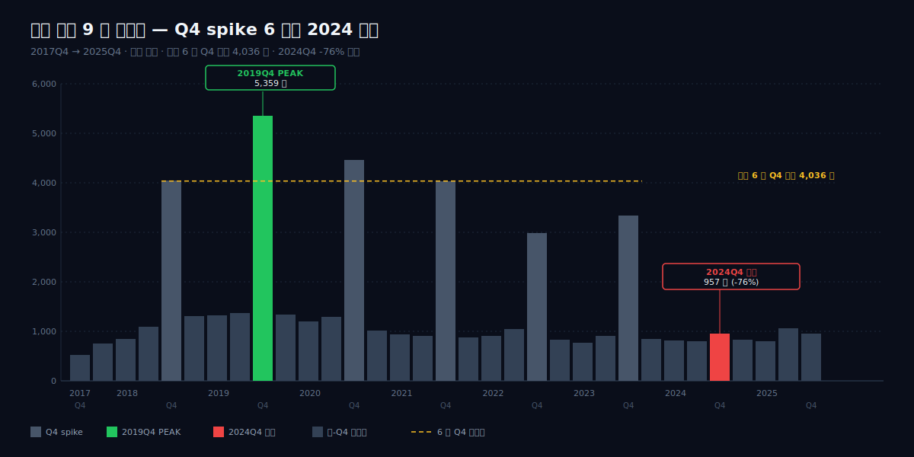
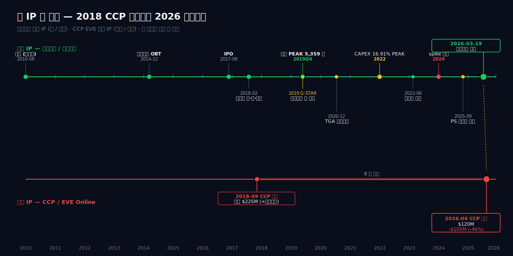
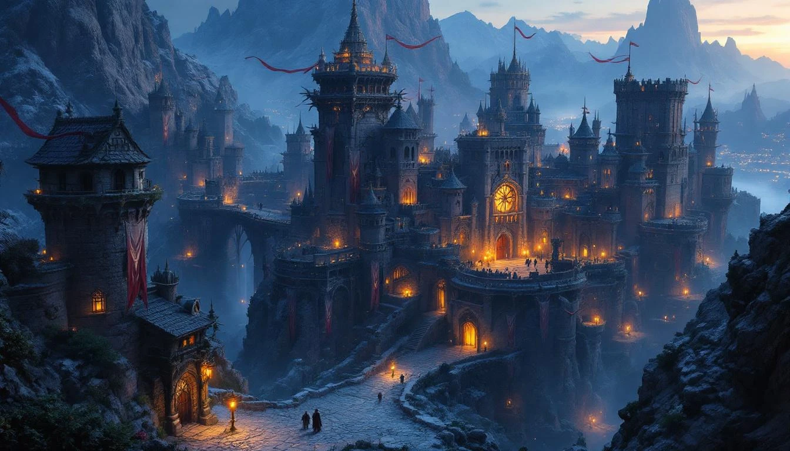
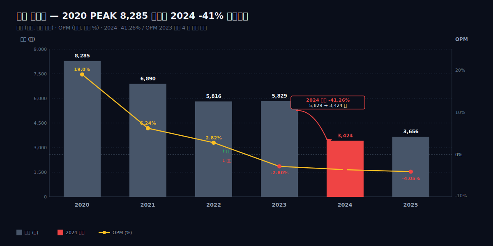
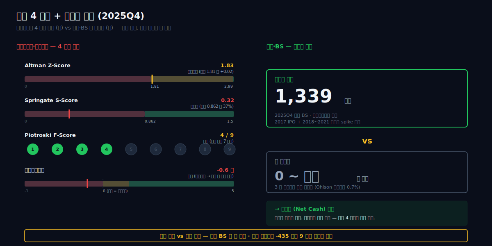
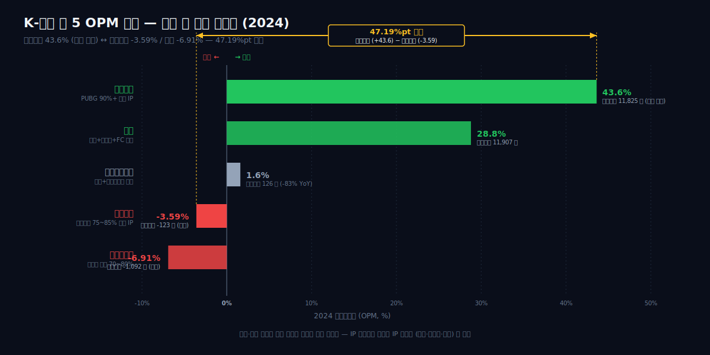
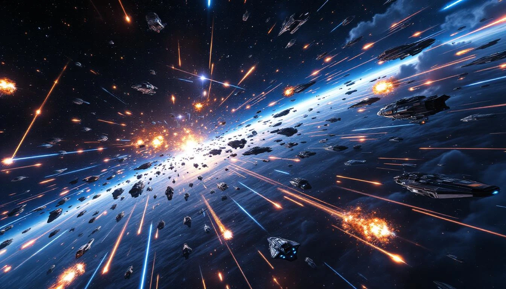

2026 년 3 월 19 일, 경기도 안양시 동안구. 펄어비스 사옥 회의실에 한 장의 일정표가 붙어 있었다. 같은 분기에 두 개의 사건이 적혀 있었다 — 붉은사막 글로벌 출시 (3 월 19 일), 그리고 CCP Games 매각 종결 (4 월). 한쪽은 6 년을 들인 자체 IP 의 첫 출시였고, 다른 한쪽은 8 년을 들고 있던 외부 IP 의 정리였다. 한 회사의 두 결정이 같은 분기에 결과를 받기로 되어 있었다.

이 회사는 9 년간 분기 매출이 800 억과 5,000 억을 오갔다. 2019 년 4 분기 5,359 억으로 분기 PEAK 를 찍고, 2018Q4~2023Q4 6 년간 Q4 평균 4,036 억을 유지하던 검은사막 단일 IP 회사가, 2024 년에 매출이 -41.26% 폭락 (5,829 억 → 3,424 억) 하고 2024Q4 매출은 957 억으로 직전 6 년 Q4 평균의 23.7% 수준으로 가라앉았다. 그 사이 영업이익은 2023 -164 억 / 2024 -123 억 / 2025 -148 억, 3 년 누적 -435 억의 적자가 쌓였다. 2018-09-06 $225M (선급) 에 인수했던 아이슬란드 CCP 는 8 년 보유 후 2026 년 4 월 $120M 에 매각됐다 (-$105M, -46%). 그러는 사이 G-STAR 2019 첫 공개 이후 6 년을 개발해 온 붉은사막은 2026-03-19 출시되어 첫 주 300 만장, 첫 달 500 만장을 기록했고, 출시 26 일에 전년 (2025) 연 매출 3,656 억을 초과했다.

질문 하나가 남는다 — 두 IP 의 운명이 한 분기에 만난 이 사건은, 9 년 단일 IP 사이클의 끝인가 아니면 새 사이클의 시작인가.

이 글은 이 질문을 8 막으로 따라간다. 1 막 2026-03-19 두 사건의 만남 → 2 막 2010 김대일 창업과 단일 IP 의 출발 → 3 막 2017 IPO 와 2018 CCP 인수 → 4 막 분기 spike 6 년 (2018Q4~2023Q4) → 5 막 2024 spike 소실 → 6 막 부실 4 신호와 순현금의 모순 → 7 막 K-게임 빅 5 비교 좌표 → 8 막 다시 2026-03-19 로 회귀.



> **dartlab AI 종합의견**
>
> 9 년간 분기 매출이 800 억과 5,000 억을 오가던 검은사막 단일 IP 회사가, 2024 년 분기 거대 spike 가 사라지고 매출 -41% 폭락 + 3 년 영업적자 누적 -435 억이 됐다 — 그러는 사이 8 년 들고 있던 CCP/이브를 $225M 에 사서 $120M 에 되팔고 (-46%), 6 년 개발한 붉은사막을 2026-03-19 출시해 첫 달 500 만장을 찍었다. 두 IP 의 운명이 한 분기에 만났다.

---

## 1 막 — 2026 년 3 월 19 일, 안양에서 한 분기에 만난 두 사건


2026 년 3 월 19 일. 안양 본사의 한 회의실에서, 한 회사의 6 년이 출시 버튼 하나로 시장에 풀렸다. 같은 분기, 그 회사가 8 년 들고 있던 또 다른 IP 는 인수가의 절반 가격에 다른 회사로 넘어갔다. 2026 년 1 분기 펄어비스의 분기보고서에 두 사건이 함께 실렸다 — 하나는 첫 달 500 만 장의 신작 출시, 다른 하나는 -46% 자본손실로 정리한 외부 IP 매각.

### 왜 두 사건이 한 분기에 만났을까

두 사건은 우연히 겹친 게 아니다. 펄어비스의 2024~2025 년은 분기 매출이 800 억대에서 멈춰선 정체기였고, 3 년 누적 영업적자 -435 억을 쌓는 동안 회사는 두 가지 축을 동시에 끌고 있었다 — 6 년째 개발 중이던 자체 신작 *붉은사막*, 그리고 2018 년 인수한 외부 자회사 CCP Games (EVE Online 개발사) 다. 두 축은 출발이 달랐다. 하나는 김대일 의장이 직접 디자인한 자체 IP, 다른 하나는 아이슬란드 레이캬비크에 본사를 둔 외부 스튜디오. 회사가 신작 출시로 자체 IP 의 결과를 받는 분기에, 외부 IP 도 결말을 받았다.

### 왜 2026-03-19 였나

붉은사막의 출시일은 시장 외부에서 정해졌다. 2025 년 9 월 24 일 Sony 의 PlayStation State of Play. 펄어비스는 이 글로벌 라이브 발표 슬롯에서 2026 년 3 월 19 일 출시일을 공개했다. PS5·Xbox Series X|S·PC (Steam)·Mac 동시 출시. *G-STAR 2019* 에서 처음 공개된 후 6 년 4 개월. 사업보고서가 정의한 게임의 정체성은 다음과 같다.

> "당사의 차기 플래그십 타이틀인 신작 '붉은사막'은 광활한 파이웰 대륙에서 생존을 위해 싸우는 용병들의 이야기를 사실적인 그래픽과 깊이 있는 스토리로 그려낸 오픈월드 액션 어드벤처 (Open World Action-Adventure) 게임입니다. 'G-STAR 2019' 에서 진행한 당사 신작 발표회를 통해 처음 공개된 뒤, 2020 년 12 월 11 일 '더 게임 어워드 (The Game Awards)' 를 통해 '붉은사막' 의 실제 게임 플레이로 제작한 트레일러..."
>
> — 펄어비스 사업보고서 (2025.12) 사업의 내용, DART

플래그십. 사업보고서가 이 단어를 쓴다는 것은, 회사가 검은사막 단일 IP 종속에서 두 번째 IP 로 옮겨가는 분기점을 직접 인지하고 있었다는 뜻이다.

| 항목 | 시점 | 값 |
|---|---|---|
| 붉은사막 글로벌 출시 | 2026-03-19 | PS5/XSX/PC Steam/Mac |
| 첫 주 판매 | 2026-03-26 | 300 만장 |
| 첫 달 판매 | 2026-04-19 | 500 만장 |
| 직전년 매출 초과 시점 | 출시 26 일째 | 2025FY 3,656 억 초과 |

출시 26 일만에, 신작 한 편의 매출이 회사 1 년치 매출을 넘었다. 9 년간 분기 800 억과 5,000 억 사이를 진동하던 패턴이 이 한 달 안에 끝났다.

### 왜 8 년을 보유한 IP 를 지금 팔았나

같은 분기에 회사는 반대 방향의 결정도 마쳤다. 2026 년 4 월, 2018 년에 $225M 에 인수했던 CCP Games 를 $120M 에 매각했다. 자본손익 -$105M, 비율 -46%.

| 항목 | 시점 | 값 |
|---|---|---|
| CCP 인수가 (선급) | 2018 | $225M |
| CCP 매각가 | 2026-04 | $120M |
| 보유 기간 | — | 약 8 년 |
| 자본손익 | — | -$105M (-46%) |

타이밍이 거꾸로 보일 수 있다. 신작이 첫 달 5,000 억대 매출을 찍어 회사 현금흐름이 가장 두꺼워지는 분기에, 굳이 손실 확정으로 외부 자회사를 정리할 필요가 있었나. 하지만 시간순으로 보면 결정의 논리는 반대다 — 회사가 자체 IP 로 다음 9 년의 매출 곡선을 그릴 수 있다고 결론낸 분기에야, 외부 IP 를 들고 있을 이유가 사라진 것이다. 8 년의 보유는 검은사막 단일 IP 의존을 분산하기 위한 보험이었고, 두 번째 자체 IP 가 검증되는 순간 보험은 회수된다. -46% 는 그 회수의 가격이다.

### 1 막의 의미

펄어비스의 한 분기에 두 IP 의 운명이 동시에 결정됐다. 6 년 개발한 자체 IP 는 첫 달 500 만장으로 회사 1 년 매출을 26 일에 넘었고, 8 년 보유한 외부 IP 는 인수가 절반 이하로 정리됐다. 이 두 사건은 따로 해석하면 각각 흥행 / 손실이지만, 함께 놓으면 하나의 결정이다 — 자체 IP 두 편으로 가는 회사로의 전환.



이 두 사건의 의미를 이해하려면 13 년 전 김대일이 왜 회사를 차렸는지부터 봐야 한다.

---

## 2 막 — 2010, 김대일과 검은사막의 출발



2010 년 9 월. 30 세의 김대일은 NHN 을 나왔다. 그 해 그는 *R2*·*C9* 를 거치며 한국 MMORPG 개발자로서 이름을 쌓은 직후였고, 회사를 직접 세우기로 했다. 사명은 펄어비스. 본사는 판교가 아닌 경기도 안양.

### 왜 NHN 을 나와 2010 년 창업했나

| 항목 | 시점 / 값 |
|---|---|
| 김대일 출생 | 1980-01-26 |
| 학력 | 한양대 컴퓨터공학과 중퇴 |
| 전 직장 / 대표작 | NHN — *R2*, *C9* |
| 펄어비스 창업 | 2010-09 (만 30 세) |
| 본사 위치 | 경기도 안양 |

R2 와 C9 의 공통점은 둘 다 MMORPG 였다는 것, 그리고 둘 다 김대일이 메인 디자이너였다는 점이다. 한양대 컴공 중퇴 후 가마소프트를 거쳐 NHN 으로 들어간 그는 두 작품을 만들면서 한 가지 결론에 도달한다 — 차세대 MMORPG 는 엔진부터 자체로 짜야 한다. 시판 엔진 (Unreal·Unity) 으로는 자신이 그리려던 논타깃팅 액션과 광역 오픈월드의 동시 구현이 어려웠다. NHN 에서 그건 시도하기 어려운 결정이었다.

펄어비스의 출발은 그래서 두 개의 동시 작업이었다. 하나는 자체 게임 엔진 *Black Desert Engine* 의 개발, 다른 하나는 그 위에서 돌아갈 한 편의 MMORPG. 회사 = 엔진 + 한 편의 게임. 출발 시점부터 단일 IP 구조가 정해졌다.

### 왜 검은사막은 자체 엔진이었나

자체 엔진은 비용이 큰 결정이다. Unreal 라이선스를 쓰면 6 개월에 끝낼 토대를 자체 엔진은 2~3 년이 걸린다. 김대일이 이 비용을 감수한 이유는 *검은사막* 의 두 가지 차별화 때문이다 — 논타깃팅 액션, 그리고 캐릭터 커스터마이징.

논타깃팅. 기존 한국 MMORPG 의 표준은 타깃을 클릭하면 자동 추적이 시작되는 타깃팅 방식이었다. 검은사막은 콘솔 액션게임처럼 매 타격을 플레이어가 직접 노려 맞추는 방식을 MMORPG 환경에 도입했다. 이 시스템이 동시 수백 명이 한 화면에 들어오는 MMORPG 서버 환경에서 끊김 없이 돌아가려면 엔진 단의 최적화가 필요하고, 그 최적화 권한이 라이선스 엔진에는 없다.

캐릭터 커스터마이징. 출시 시점 기준 검은사막은 한국 MMORPG 중 가장 정밀한 외형 편집기를 탑재했다 — 골격·근육·얼굴 비율 단위 조정. 이 역시 렌더링 파이프라인을 직접 설계할 수 있을 때 가능한 차별화다.

| 항목 | 시점 |
|---|---|
| 검은사막 OBT (한국) | 2014-12 |
| 검은사막 정식 출시 (한국) | 2015 |

창업 (2010-09) 부터 OBT (2014-12) 까지 4 년 3 개월. 그동안 회사는 매출이 거의 0 이었다. 한 편의 게임이 나오기 전까지 회사는 한 편의 게임 그 자체였다.

### 왜 윤재민 공동창업 + 허진영 분담 구조가 됐나

김대일 혼자가 아니었다. 공동창업자 윤재민 — 한게임 / NHN Gaming 출신. 김대일이 게임 디자인과 엔진을 맡고, 윤재민이 사업·운영 라인을 맡는 구조다. 이후 회사가 커지면서 허진영이 대표이사로 분담 — 김대일은 의장으로 게임 개발 총괄, 윤재민은 공동창업자 라인, 허진영은 경영. 한 명이 모든 결정을 끌고 가는 1 인 창업자 구조가 아니라 개발 / 사업 / 경영 3 분담이다.

이 구조가 의미 있는 것은 13 년 후의 두 결정 — *붉은사막* 의 6 년 개발 지속과 *CCP* 의 -46% 매각 — 이 한 사람의 결정이 아니었다는 점이다. 자체 IP 의 장기 개발은 의장의 영역, 외부 IP 의 보유 / 매각은 경영의 영역으로 나뉘어 있었다.

### 왜 2014-12 검은사막 OBT 가 단일 IP 종속의 시작이었나

OBT 가 성공했다. 2015 년 정식 서비스 첫 분기부터 매출이 들어오기 시작했고, 회사는 처음으로 적자에서 빠져나왔다. 그 시점부터 펄어비스의 분기 매출은 *검은사막* 한 편이 거의 전부가 된다. PC → 모바일 → 콘솔 (PS4/XB1) → 글로벌 권역 확장으로 가지를 뻗었지만, IP 는 한 편이었다. 9 년 후 (2024) 분기 매출이 800 억대에서 멈춘 패턴의 출발점이 이 분기다.

본사를 안양에 둔 것도 이 단일 IP 구조와 연결된다. 판교 IT 벨트 (SK·NHN·카카오) 와의 거리는 인재 풀에서 약점이지만, 한 편의 게임을 길게 만드는 회사가 굳이 판교의 인재 회전 시장에 들어갈 이유는 적었다. 안양은 회사의 정체성 — 단일 IP, 자체 엔진, 장기 개발 — 의 지리적 표현이다.

검은사막 단일 IP 로 IPO 한 회사는 다음 단계에서 두 가지를 시도한다 — 모바일 확장과 외부 IP 인수.

---

## 3 막 — 코스닥 상장과 모바일 폭발, 그리고 $225M 베팅

### 왜 2017 년 9 월에 IPO 였나

2017 년 9 월. 펄어비스가 코스닥에 상장한다. 검은사막 PC 단일 IP, 그것도 2014 년 12 월 한국 출시 후 채 3 년이 지나지 않은 시점이다. 일반적으로 게임사는 두 번째 흥행작이 나온 뒤에 시장을 두드리지만, 펄어비스는 한 작품으로 들어왔다.

이유는 두 가지다. 첫째, 검은사막 PC 가 글로벌로 안정적인 매출을 만들기 시작했다. 자체 엔진으로 만든 게임이라 외주 의존이 없었고, MMORPG 라이프사이클상 한국 → 일본 → 북미·유럽 순으로 순차 출시가 가능했다. 둘째, 김대일은 다음 카드를 위한 자금이 필요했다. 그는 검은사막을 만들면서 이미 다음 단계 — **모바일과 콘솔** — 을 그리고 있었다.

상장 직후의 분기 매출이 그 시점의 회사 크기를 그대로 보여준다.

| 시점 | 분기 매출 |
|---|---|
| 2017Q4 (IPO 직후) | 524 억 |

PC 글로벌 운영만으로 분기 524 억을 만들어내는 회사. 한 분기에 500 억대를 찍는 게임사는 그 시점의 한국 시장에서 흔하지 않았다. 그러나 김대일이 보고 있던 숫자는 이게 아니었다.

### 왜 모바일이었나 — 한·일·대만 동시 출시 카드

검은사막 PC 가 글로벌로 자리를 잡는 동안, 한국 게임 시장 전체는 거대한 변곡점을 지나고 있었다. PC 온라인의 시대가 끝나고 모바일이 모든 매출을 흡수하기 시작했다. 리니지M, 검은사막 모바일, 모두의마블 — 한 분기 매출이 1,000 억대를 가뿐히 넘기는 모바일 게임이 줄줄이 등장했다.

펄어비스의 답은 2018 년 2 월이었다. 검은사막 모바일을 **한국·일본·대만 3 개 지역 동시** 출시. 일반적으로 게임사는 한국에서 한 분기 운영해보고, 데이터를 보고, 다음 지역으로 가는 단계적 출시를 한다. 펄어비스는 그 단계를 건너뛰었다. 자체 엔진으로 PC 검은사막을 그대로 모바일로 옮기는 기술력이 있었기 때문에 "준비가 끝나면 한 번에 푼다" 가 가능했다.

분기 매출의 응답은 즉각적이었다.

| 시점 | 분기 매출 | 비고 |
|---|---|---|
| 2017Q4 | 524 억 | IPO 직후, PC 단독 |
| 2018Q1 | 755 억 | 모바일 한·일·대만 출시 (2018-02) |
| 2018Q4 | **4,046 억** | 모바일 글로벌 운영 본격화 |

2018Q4 매출 4,046 억을 2017Q4 매출 524 억으로 나눈 값은 **7.72 배**. IPO 직후 분기 524 억이던 회사가 모바일 출시 단 3 분기 만에 분기 4,046 억을 찍는다. 같은 회사인지 의심스러운 점프다. 김대일이 IPO 시점에 이미 그리고 있던 그림 — "한 IP 를 PC 와 모바일 양쪽으로 동시에 운영" — 이 분기 재무제표 위에서 그대로 증명된다.

이 spike 의 한 가지 단서가 중요하다. 일회성이라는 것. 모바일 출시 효과는 출시 분기에 매출이 집중되는 일회성 인식이고, 그 다음 분기부터는 라이브 운영 베이스라인으로 돌아온다. 그러나 이 spike 가 만든 캐시플로는 회사의 그다음 행동을 가능하게 했다.

### 왜 2018 년에 CCP 를 $225M 에 샀나

분기 매출 4,046 억. 이 숫자의 의미는 단순히 "회사가 커졌다" 가 아니다. 모바일 출시 이후 펄어비스의 손에 들어온 잉여현금이 **외부 IP 를 사들일 수 있는 규모**가 됐다는 뜻이다.

같은 해, 2018 년. 펄어비스는 아이슬란드의 **CCP Games** 를 **$225M (약 2,500 억원 수준)** 에 인수한다. 어언아웃 — 추후 매출 목표 달성 시 추가로 지급하는 조건부 대금 — 이 최대 **$200M** 더. 합쳐서 최대 $425M, 한국 게임사의 해외 IP 인수로는 그 시점 기준 최대 규모급이었다.

| 항목 | 시점 | 값 |
|---|---|---|
| CCP Games 인수 (선급) | 2018 | $225M |
| 어언아웃 (최대) | 2018 | $200M |
| 어언아웃 실지급 | 2018~ | 0 (미달성) |

$225M 의 자금 근거는 그 해 같은 회사의 IS 에 그대로 적혀 있다. 2018Q1 부터 Q4 까지 누적 매출이 4 천억대에서 1 조 직전까지 올라가던 분기들. 모바일이 만든 캐시가, 같은 해 외부 IP 를 사들이는 자금이 됐다.

### 왜 EVE Online 이었나

CCP Games 는 2003 년부터 운영된 우주 SF MMORPG **EVE Online** 단일 IP 회사다. 한 게임을 15 년 운영하는 회사. 등록 계정 수십만, 그러나 **단일 캐릭터들이 모이는 단일 우주 (Tranquility 서버)** 안에서 한 회사·동맹·전쟁이 수년에 걸쳐 진행되는 — MMORPG 역사상 가장 깊이 운영된 게임. 인게임 경제는 별도 경제학자가 분석할 정도로 정교했고, 한 번의 우주 전쟁 (Bloodbath of B-R5RB) 손실액이 실제 화폐로 환산해 30 만 달러를 넘겼다는 보도가 나올 정도였다.

펄어비스가 CCP 를 산 이유는 표면적으로는 "글로벌 운영 노하우". MMORPG 한 작품을 15 년 운영한다는 건 한국 게임사들이 가지지 못한 자산이었다. 검은사막을 10 년·20 년 운영할 회사가 되려면 그 노하우가 필요했다.

그러나 어언아웃 $200M 의 실지급액은 **0** 이었다. 어언아웃은 인수 후 일정 기간 매출·영업이익 목표를 달성해야 추가 지급되는 구조다. 0 이라는 숫자는 한 가지를 말한다 — 2018 년 시점에 펄어비스가 잡았던 EVE Online 매출 기대치를, CCP 는 그 어떤 해에도 채우지 못했다. 인수 시점의 EVE Online 은 이미 라이프사이클 후반부에 있었고, 펄어비스가 베팅한 "글로벌 운영 노하우 인수가 매출로 돌아온다" 는 가설은, 적어도 매출 측면에서는 빗나갔다.

이 어긋남이 8 년 뒤 2026 년 4 월의 $120M 매각 결정 — 1 막에서 등장한 그 결정 — 의 첫 번째 점이다. 폭발한 분기 매출은 이후 6 년간 Q4 마다 spike 를 만들고, 회사는 이 현금을 차세대 IP 개발에 쏟는다.

---

## 4 막 — 분기 spike 6 년, 그리고 2022 년 CAPEX 16.91% PEAK

### 왜 분기 매출이 800 억과 5,000 억을 오갔나

2019 년부터 2023 년까지. 6 년간 펄어비스의 분기 매출 차트를 펴면 한 가지 패턴이 즉시 보인다 — **Q4 마다 spike, 다른 분기는 평상치**. 그래프는 동일한 진폭으로 진동하지 않는다. 한 분기 4,000 억대를 찍었다가 다음 분기 800 억대로 내려오고, 다시 1,000 억대 → 1,500 억대 → 4,000 억대로 올라간다.

| 분기 | 분기 매출 (억) | spike 추정 동력 |
|---|---|---|
| 2018Q4 | 4,046 | 모바일 출시 효과 |
| 2019Q4 | **5,359 (역대 PEAK)** | 글로벌 확대 |
| 2020Q4 | 4,454 | 콘솔 확대 (Xbox One 2019-03, PS4 2019-08) |
| 2021Q4 | 4,032 | — |
| 2022Q4 | 2,988 | spike 감소 (개발 우선) |
| 2023Q4 | 3,339 | "Land of the Morning Light" (2023-06-14) 글로벌 효과 |

회사의 **단일 IP 의존**이 분기 재무제표 위에 그대로 박힌 그림이다. 검은사막이라는 한 IP 를 PC·모바일·콘솔 3 개 플랫폼에 펼쳐놓고, 매년 새 콘텐츠를 신규 지역·DLC·플랫폼 확장으로 풀면, 그 출시 분기의 매출이 한 번에 인식된다. MMORPG 의 매출 인식 방식 때문에 기간 분배가 적고 출시 분기에 몰리는 구조도 한몫한다. 신작 콘텐츠가 매년 하반기에 집중적으로 출시되면 그게 Q4 spike 를 만든다.

펄어비스 분기 매출을 9 년 연결해놓으면, 6 번의 산봉우리가 서로 비슷한 간격으로 반복된다. **이 패턴 자체가 단일 IP 회사의 전형적 시계열**이다. 다 IP 회사라면 분기 매출이 봉우리 없이 평평해진다 — 한 IP 가 식어도 다른 IP 가 받쳐주기 때문이다.

### 왜 2019Q4 5,359 억이 회사 역사상 PEAK 였나

2019Q4. 분기 매출 **5,359 억**. 펄어비스의 9 년 시계열에서 가장 높은 단일 분기 봉우리다. 이후 어떤 분기도 이 숫자를 넘지 못한다.

2019 년에 무슨 일이 있었는가. PC 검은사막의 글로벌 직접 서비스 전환, 콘솔 검은사막 Xbox One (2019-03)·PS4 (2019-08) 출시, 모바일의 신규 지역 업데이트가 동시에 한 분기에 수렴했다. 펄어비스가 단일 IP 단일 회사로서 도달할 수 있던 매출 천장이 바로 이 5,359 억이었던 셈이다. 단일 IP 의 한계가 PEAK 라는 형태로 그대로 표시됐다.

PEAK 다음 해부터 회사는 다른 결정을 한다.

### 왜 2022 년 CAPEX 비율이 16.91% PEAK 였나 — 사옥 + 붉은사막 R&D

2019Q4 에 분기 5,359 억이 나오고 1 년이 지난 시점. 펄어비스 경영진의 손에는 **단일 IP 의 매출 천장을 봤다** 는 사실이 들려 있었다. 검은사막을 더 짜내봐야 한 분기 5,000 억이 천장이라면, 다음 분기 PEAK 를 다시 만들 두 번째 IP 가 필요했다. 그게 6 년째 개발 중이던 **붉은사막** 이었다.

회사는 2022 년에 단일 연도 사상 가장 큰 CAPEX 베팅을 한다.

| FY | CAPEX (억) | CAPEX/매출 | FCF (억) |
|---|---|---|---|
| 2020 | 286 | 3.45% | 1,289 |
| 2021 | 486 | 7.06% | 158 |
| 2022 | **983** | **16.91% (PEAK)** | **-508** |
| 2023 | 93 | 1.59% | 231 |

2022 년 한 해에 유형자산 취득에 **983 억**. 매출 5,816 억 중 16.91% 가 설비투자로 빠졌다. 게임사의 평균 CAPEX 비율은 3~5% — 매출의 17% 를 한 해에 시설에 쏟는 게임사는 그 자체로 비정상치다.

983 억이 어디에 들어갔는가. 두 가지였다. 첫째, **신사옥**. 안양 평촌의 새 본사 건물이 이 시기에 건설됐다. 둘째, **붉은사막 개발 인프라**. 자체 엔진을 더 무거운 차세대 게임으로 끌고 가려면 개발자 수, 빌드 서버, 모션 캡처 시설이 검은사막 시점보다 훨씬 커야 했다.

그 결과가 잉여현금흐름 (영업현금에서 투자비를 빼고 남는 돈) 의 첫 음수다.

### 왜 2022 년 FCF 가 -508 억으로 떨어졌나

2022 년 잉여현금흐름 **-508 억**. 펄어비스가 9 년 시계열에서 처음으로 영업으로 번 돈보다 투자비가 더 큰 해를 맞이한다. 영업이익은 같은 해 적자로 돌아섰지만 영업현금흐름은 양수. 그러나 그 위에 **CAPEX 983 억** 이 얹히면서 FCF 는 음수로 돌아간다.

dartlab 의 잉여현금 정의 — "영업해서 들어온 현금에서 설비투자를 빼고 남는 돈" — 으로 보면, 2022 년의 -508 억은 다음 사실을 뜻한다. **회사가 외부에서 돈을 끌어와야 비로소 그 해의 투자비를 댈 수 있었다**. 다행히 펄어비스는 모바일 spike 시절 쌓아둔 현금이 있었기 때문에, 외부 차입으로 풀지 않고 보유 현금으로 메웠다. 그러나 보유 현금이 그 해부터 줄기 시작한 건 사실이다.

이 베팅의 명분은 단 하나였다 — 6 년째 개발 중인 **붉은사막의 출시**. 검은사막의 5,359 억 PEAK 를 갱신할 두 번째 IP. 2022 년의 983 억은 그 출시를 위한 마지막 점프 비용이었다.

### 왜 2023 년 "Land of the Morning Light" 가 의미 있었나

2022 년에 CAPEX 베팅을 끝낸 회사는, 2023 년에 다시 단일 IP 의 카드를 한 번 더 쓴다. 같은 해 6 월 14 일 — **"Land of the Morning Light" (아침의 나라)** 글로벌 출시. 한국을 모티브로 한 검은사막의 신규 지역 콘텐츠. 패키지 가격 **$49.99**.

2023Q4 분기 매출 3,339 억. 2022Q4 의 2,988 억보다 11.7% 회복된 숫자다. 신규 지역 출시가 분기 매출을 일시적으로 끌어올리는 단일 IP 의 검증된 카드 — 2018 년부터 6 년간 매년 반복돼온 그 카드 — 가 2023 년에도 작동했다는 뜻이다.

그러나 이 회복은 일시적이었다. 같은 회사의 2024 년 분기 매출을 펴면, **단일 IP 카드의 작동이 멈췄다** 는 사실이 분기 단위로 드러난다. 분기 spike 자체가 사라지고, 평상치도 1,000 억대 아래로 내려간다. 2022 년에 983 억을 쏟아부은 회사가, 그 베팅의 보답을 받기 전에, 일단 단일 IP 매출이 무너지는 시기를 먼저 통과해야 했다.

2024 년에 그 spike 자체가 사라진다. 단순 감소가 아니라 패턴이 끝난다.

---

## 5 막 — 2024, 사라진 4 분기와 -41% 폭락



2024 년 1 월 1 일이 됐을 때, 펄어비스의 분기 매출 시계열에서 사라진 것이 하나 있었다.

Q4 spike 였다.

직전 6 년 (2018Q4~2023Q4) 의 Q4 분기 매출 평균은 4,036 억. 2018Q4 4,046 / 2019Q4 5,359 / 2020Q4 4,454 / 2021Q4 4,032 / 2022Q4 2,988 / 2023Q4 3,339. 한 번도 800 억대로 내려간 적이 없다. 4 분기는 한 해의 결실을 거두는 분기였고 — 신규 지역·DLC 출시 분기였고 — 콘솔/PC 시장의 연말 시즌이 매출로 잡히는 분기였다.

그 6 년 동안 한 번도 빠진 적 없는 Q4 spike 가, 2024 년에 끊겼다.

### 왜 2024 에 spike 가 사라졌나

2024 년 1 분기부터 4 분기까지의 매출은 차례로 854 억, 818 억, 795 억, 957 억이었다. 한 분기도 1,000 억을 넘지 않았다. 2024Q4 의 957 억은 직전 6 년 Q4 평균 4,036 억 대비 23.7% 였다 — 즉 -76%. 4 분기가 더 이상 4 분기가 아니었다.

| 분기 | 매출 (억) | spike? |
|---|---|---|
| 2024Q1 | 854 | ✗ |
| 2024Q2 | 818 | ✗ |
| 2024Q3 | 795 | ✗ |
| 2024Q4 | **957 (직전 6 년 Q4 평균의 23.7%)** | ✗ |
| 2025Q1 | 837 | ✗ |
| 2025Q2 | 796 | ✗ |
| 2025Q3 | 1,068 | ✗ |
| 2025Q4 | 955 | ✗ |

8 개 분기를 늘어놓고 보면 한 가지 패턴이 보인다. 변동폭이 좁다. 최저 795 억, 최고 1,068 억. 9 년간 800 억과 5,000 억을 오가던 회사의 분기 매출이, 2 년 동안 800~1,000 억 박스권에 갇혔다.

박스권은 안정이 아니다. 박스권은 trigger 소진이다.

### 왜 -41% 였나

2023 년 매출 5,829 억. 2024 년 매출 3,424 억. 비율로는 3,424 / 5,829 = 58.74%. 즉 -41.26%.

| FY | 매출 (억) | YoY | OPM | 영업이익 (억) | 순이익 (억) |
|---|---|---|---|---|---|
| 2023 | 5,829 | +0.23% | -2.80% | -164 | 152 |
| 2024 | 3,424 | **-41.26%** | -3.59% | -123 | 603 |
| 2025 | 3,656 | +6.77% | -4.05% | -148 | -84 |

"-41%" 라는 숫자만 보면 회사에 충격적인 사건이 있었다고 읽힌다. 그런데 2023 년 매출 (5,829 억) 안에는 더 이상 반복되지 않을 부분이 있었다 — 그게 빠진 게 2024 였다. 2023 까지의 매출 곡선은 "검은사막 본편 + 검은사막 모바일" 두 라인이 같이 만들어내던 것이었고, 그 중 모바일 라인이 2024 부터 빠르게 줄었다.

모바일이 줄어드는 데에는 외부 요인도 있었다. 2021 년 Apple 의 ATT (App Tracking Transparency) 정책 도입, 2022 년 광고 단가 상승과 효율 하락, 2023 년 모바일 게임 시장 전반의 성숙기 진입. 펄어비스만의 일이 아니었지만, "검은사막 모바일 한·일·대만 (2018~2019)" 으로 spike 를 만들어왔던 회사에게는 더 결정적이었다.

### 왜 검은사막 매출 곡선이 평탄화됐나

검은사막 본편은 2014 년 출시작이다. 2024 년 기준 출시 10 년차. MMORPG 의 라이브 서비스 곡선은 일반적으로 발매 후 3~5 년 차에 정점, 7~10 년차부터 감쇠 — 펄어비스는 콘솔 이식 (2019-03 Xbox One, 2019-08 PS4), 신규 시장 진출 (2017 북미, 2018 일본, 2020 콘솔 글로벌) 으로 그 곡선을 늘여왔다. 그러나 새 시장은 결국 다 들어갔고, 새 spike 를 만들 trigger 가 줄어들었다.

trigger 소진은 회계로 잡히지 않는다. 매출이 박스권에 들어간 뒤에야 사후적으로 보인다. 2024 년 매출 -41% 와 2024~2025 분기 매출 박스권은 같은 사실의 두 표현이다 — "9 년간 spike 를 만들어주던 무언가가 더 이상 작동하지 않는다."

### 왜 분기 매출이 800~1,000 억 박스권에 갇혔나

박스권 800~1,000 억은 의미 있는 숫자다. 검은사막의 라이브 서비스 베이스라인 — 즉 신규 콘텐츠 패치, 일상 과금, 해외 라이선스 정산만으로 들어오는 안정 수익 — 이 분기당 800 억 안팎이라는 뜻이다. 그 위에 spike 를 얹어주던 두 가지 (① 신규 시장 진입, ② 모바일 광고 효율) 가 모두 약해졌고, 새 IP 는 아직 도착하지 않았다.

2025 년 매출 3,656 억은 2024 대비 +6.77% 로 약간 회복됐지만, 영업적자는 더 깊어졌다 (-148 억, OPM -4.05%). 매출이 조금 늘었는데 적자가 늘었다는 건, 늘어난 매출의 마진보다 늘어난 비용 (R&D, 인건비) 이 컸다는 뜻이다. 붉은사막 출시 직전의 마지막 비용이 2025 년에 집중적으로 잡혔다고 읽으면 일관된다.

매출이 반토막 나는 동안 회사 내부에는 어떤 신호들이 누적됐고, 동시에 어떤 모순도 함께 있었다.

---

## 6 막 — 부실 4 신호 + 순현금 모순

부실 모형은 동시에 켜질 때 의미가 있다. 하나만 켜지면 산업 특성이거나 일시적 충격이지만, 네 개가 같이 켜지면 회사 자체에 구조적 문제가 있다는 뜻이다.

2025Q4 펄어비스에서 부실 4 신호가 같이 켜졌다.

### 왜 4 가지 부실 신호가 동시에 나오나

| 부실 지표 (2025Q4) | 값 | 임계 | 판정 |
|---|---|---|---|
| Altman Z | 1.83 | &lt; 1.81 부실권 | 회색지대 (간신히) |
| Springate S | 0.32 | &lt; 0.862 부실권 | 부실 위험 |
| Piotroski F | 4 / 9 | ≥ 7 양호 | 보통 |
| 이자보상배수 | -0.6 배 | — | 위험 (영업적자) |
| Ohlson 부실확률 | 0.7% | — | 낮음 |

Altman Z 1.83 은 부실 임계 1.81 을 0.02 만 넘긴 회색지대다. Springate 0.32 는 부실 임계 0.862 의 37% 수준 — 이미 부실권 안에 깊숙이 들어와 있다. Piotroski F 는 9 점 만점에 4 점, 양호 기준 (7) 의 절반 수준. 이자보상배수 -0.6 배는 영업이익 자체가 음수라는 산술적 결과다 (영업적자 -148 억 / 이자비용).



이 네 지표가 동시에 점등했는데도 — 단 하나, Ohlson 부실확률은 0.7% 로 낮게 나온다. Ohlson 모형은 자본구조 (특히 부채비율과 운전자본) 에 큰 가중치를 주는데, 펄어비스는 이 부분이 깨끗했다.

### 왜 자본은 안 무너졌나

> **3 년 적자 -435 억 + 순현금 1,339 억 — 두 사실이 같은 회사 같은 분기에 동시에 있다.**

| 자본·BS 시계열 (억) | 2020Q4 | 2022Q4 | 2024Q4 | 2025Q4 |
|---|---|---|---|---|
| 자산총계 | 9,670 | 12,225 | 11,428 | 11,491 |
| 현금성자산 | 2,127 | 1,596 | 1,428 | 1,339 |
| 무형자산 | 2,750 | 2,313 | 2,479 | 2,570 |

2020Q4 와 2025Q4 를 비교하면 자산총계는 9,670 → 11,491 억으로 +18.8% 늘었다. 무형자산은 2,750 → 2,570 으로 거의 그대로 (-6.5%). 현금성자산은 2,127 → 1,339 억으로 -37% 줄었지만, 같은 기간 차입금은 늘지 않았다 — 이게 핵심이다.

차입금이 안 늘었다는 건 중요한 사실이다. 영업적자가 3 년 누적되는 동안 회사가 외부에서 돈을 빌리지 않았다는 뜻이다. 영업적자 -435 억을 자체 보유 현금으로 흡수했다. 그래서 부실 모형은 점등하는데, Ohlson 처럼 자본구조에 무게를 두는 모형만 낮게 나온다.

### 왜 3 년 영업적자 -435 억인데 순현금인가

누적 영업적자 계산은 단순하다.

- 2023 영업이익: -164 억
- 2024 영업이익: -123 억
- 2025 영업이익: -148 억
- 누적: **-435 억**

435 억의 영업적자가 3 년 동안 쌓였는데, 회사 BS 는 망가지지 않았다. 그 이유는 IPO 시점 (2017-09) 과 모바일 spike 시절 (2018~2023) 에 쌓아둔 잉여가 두꺼웠기 때문이다. 2017 IPO 공모자금 + 2018~2019 모바일 spike 분기 (5,359 억 / 분기) + 콘솔 글로벌 출시 (2020) 로 만들어진 누적 잉여금이 적자를 흡수했다.

게다가 회사는 그 잉여를 한 번도 주주에게 돌려준 적이 없었다.

### 왜 자본환원이 0% 였나

2017 IPO 부터 2025 까지 9 년간 배당 0 회, 자사주 매입 0 회. 자본환원율 0%. 회사가 번 돈은 모두 R&D, 사옥 (안양 신사옥), CCP/이브 인수 (2018, $225M) 에 들어갔다.

이 선택은 양면적이다. 한쪽에서는 — 적자 3 년을 버틸 잉여가 남아 있다. 차입을 안 늘리고도 자체 자금으로 R&D 를 계속할 수 있다. 다른 쪽에서는 — 9 년간 한 번도 자본환원이 없었으니, 주주는 9 년간 주가 변동 (시세차익) 외에는 회수해간 게 없다. 회사가 잉여를 주주 대신 R&D 와 인수에 쓴 결과가 — 한 쪽에서는 붉은사막 (2026-03 출시) 으로, 다른 쪽에서는 CCP $225M → $120M (-46%) 로 돌아왔다.

### 왜 순이익은 흑자였나 (2024 의 모순)

2024 년 영업이익 -123 억, 순이익 +603 억. 영업에서 적자였는데 최종 순이익은 600 억대 흑자였다. 그 차이 약 +700 억은 영업외수익 — 환차익 가능성이 크고, 일부는 보유 자산 평가이익 또는 처분이익이 잡혔을 가능성이 있다.

이 흑자는 본업에서 번 게 아니다. 2025 년에는 그 영업외 효과가 빠지면서 순이익도 -84 억 적자로 돌아갔다. 2025 의 -84 억이 이 회사의 진짜 본업 결과에 가깝다.

### 왜 시장은 베팅 종목으로 봤나

부실 4 신호가 켜지고, 영업적자가 3 년 누적되고, 매출이 -41% 빠졌는데, 시장은 펄어비스를 부실회사로 보지 않았다. 두 가지 이유가 같이 있었다.

첫째, 순현금 상태였다. 현금성자산 1,339 억 > 추정 차입금. 자본 잠식의 위험이 낮았다. 둘째, 붉은사막이 2026-03-19 에 출시됐다. 6 년 개발한 신규 IP 가 곧 매출로 잡힐 시점이었다. 시장은 "회계상 위기" 를 "출시 직전의 비용 집중" 으로 해석했다.

이 해석이 맞는지는 2026Q2 부터의 분기 매출이 답한다. 첫 달 500 만장이라는 초기 판매 (1 막) 가 분기 매출 spike 로 어떻게 환산되느냐, 그리고 그 spike 가 검은사막처럼 9 년 끌고 갈 라이브 서비스로 정착하느냐 — 두 단계의 검증이 남아 있다.

이 모순적 상태는 이 회사만의 특수한 일이 아니다. K-게임 산업 전체가 같은 사이클 위에 있다.

---

## 7 막 — K-게임 빅 5 비교 + 산업 사이클 (2024)

2025-04-15. 펄어비스 2024 사업보고서가 전자공시에 등재된다. 같은 주, K-게임 빅 5 의 전년 실적이 모두 출격한다. 같은 시장, 같은 1 년, 다섯 회사. 손익계산서의 부호가 둘로 갈라진다.

같은 해, 같은 산업, 같은 출판 채널. 같은 글로벌 PC·콘솔·모바일 시장을 두고 경쟁하는 다섯 회사의 2024 년 영업이익률이 정렬된다. 위 두 칸은 28.8%, 43.6%. 아래 두 칸은 -3.59%, -6.91%. 가운데 한 칸은 1.6%. 같은 해의 같은 K-게임이라고 부르기 어려운 분포다.

| 회사 | 2024 매출 (조원) | OPM | 영업이익 (억원) |
|---|---|---|---|
| **넥슨** | 4.13 | 28.8% | 11,907 |
| **크래프톤** | 2.71 | **43.6%** | 11,825 (역대 최고) |
| **엔씨소프트** | 1.58 | -6.91% | -1,092 (영업적자) |
| **카카오게임즈** | 0.77 | 1.6% | 126 (-83% YoY) |
| **펄어비스** | 0.34 | -3.59% | -123 (영업적자) |

펄어비스 매출은 넥슨 매출의 8.3%. 영업이익률은 47.19%pt 아래.

### 왜 K-게임 빅 5 가 둘로 갈라졌나

단일 변수로 설명되지 않는다. 넥슨은 던전앤파이터 모바일의 중국 출시 (2024-05) 가 분기 매출 곡선을 한 단계 끌어올렸다. 크래프톤은 PUBG 의 인도 재출시 + 신규 모드 사이클이 9 년차 IP 의 매출을 다시 흔들었다. 같은 해, 엔씨소프트는 리니지 IP 의 동시 약화 — 모바일 신작 부재 + 기존 작 자연 감소가 겹쳤다. 펄어비스는 6 막에서 본 그 분기 spike 의 소실. 카카오게임즈는 오딘·우마무스메·광고 사업의 합 — OPM 1.6%, 가까스로 흑자.

K-게임 빅 5 를 흑자 (넥슨·크래프톤) 와 적자·미달 (엔씨·펄어비스·카겜) 로 가른 한 줄의 변수는 **신작·재흥 사이클의 도래 여부**다. 사이클이 도래한 회사의 손익은 위로, 도래하지 않은 회사의 손익은 아래로 정렬됐다.



### 왜 넥슨·크래프톤은 흑자고 엔씨·펄어비스는 적자인가

크래프톤의 OPM 43.6% 는 한국 게임사 역대 최고치다. 같은 해, 엔씨소프트와 펄어비스는 동시에 영업적자에 들어간다. 두 회사의 공통점은 한 IP 에 매출이 깊게 집중돼 있다는 것 — 엔씨는 리니지 (M·W·2M·1·라이크) 라인, 펄어비스는 검은사막. 한 IP 의 라이프사이클이 약화 구간으로 진입하면, 회사 손익 전체가 같이 약화 구간으로 진입한다.

크래프톤도 PUBG 단일 IP 회사로 분류되는데 왜 흑자인가 — 같은 IP 안에서 지역 (인도·중남미) 과 모드 (배틀그라운드 모바일·뉴 스테이트) 로 사이클을 끊어 만들 수 있었기 때문. PUBG 라는 IP 의 지역·플랫폼 표면적이 넓다. 검은사막은 9 년차에 지역 (한·일·중·북미·EU) 을 이미 한 바퀴 돌았고, 모바일 (검은사막 모바일) 은 같은 IP 사이클을 공유했다. 표면적의 차이.

### 왜 단일 IP 의존이 K-게임 구조 문제인가

| 회사 | 1 위 IP 매출 비중 | 2024 OPM |
|---|---|---|
| 펄어비스 (검은사막) | 75~85% | -3.59% |
| 엔씨소프트 (리니지 라인) | 약 70~80% (보도 추정) | -6.91% |
| 크래프톤 (PUBG) | 90% 이상 | 43.6% |
| 카카오게임즈 (오딘+우마무스메) | 분산 | 1.6% |
| 넥슨 (던파+메이플+FC) | 분산 | 28.8% |

흥미로운 분포. **단일 IP 의존도가 가장 높은 크래프톤이 OPM 1 위, 분산도가 높은 카카오게임즈가 OPM 4 위.** 단일 IP 의존 자체가 적자의 직접 원인은 아니다. 그러나 단일 IP 의존은 **사이클 진폭의 크기** 를 결정한다. 사이클이 위에 있을 때는 OPM 43.6% 까지 올라가고 (크래프톤), 사이클이 아래에 있을 때는 OPM -3.59% 까지 내려간다 (펄어비스). 분산 IP 회사는 위로도 아래로도 그만큼 가지 못한다 — 카겜의 OPM 1.6%.

펄어비스의 2024 매출 75~85% 가 한 IP — 4 막에서 본 분기 매출 진폭 (800 억 ~ 5,000 억, 6.25 배) 의 주된 설명변수. 검은사막이 한 분기에 5,000 억까지 갈 수 있었던 것도, 다른 분기에 800 억까지 떨어질 수 있었던 것도, 그 사이에 EVE Online 의 매출 15~25% 가 완충해 주지 못한 것도 — 같은 구조의 결과다.

### 왜 카겜은 다른 길을 갔나

카카오게임즈는 2021 년 오딘 사이클로 매출 1 조를 처음 넘었다. 그 이후 우마무스메 (2022 카겜 출시) · ArcheAge War (2023) · 비욘드 더 필드 (2024) 까지 신작·라이센스 라인업으로 IP 다변화를 시도했다. 그리고 게임 외 광고·블록체인 사업까지 붙였다.

결과는 OPM 1.6%. 매출은 분산됐지만 **개별 IP 의 사이클이 모두 약화 구간**에 들어가면 분산 자체가 회사를 살리지 못한다. 오딘은 출시 4 년차 자연 감소, 우마무스메는 일본 본가 사이클 동조, ArcheAge War 는 출시 후 매출 급감 — 분산된 사이클이 모두 동시에 아래에 있다. 그래서 카겜은 빅 5 중 분산이 가장 잘된 회사면서 OPM 이 1.6% 다.

분산이 답이라기에는 카겜이 약하다. 단일 IP 가 답이라기에는 펄어비스·엔씨가 약하다. **답은 IP 자체의 표면적 — 한 IP 안에서 몇 개의 지역·플랫폼·모드·세대로 사이클을 끊어 만들 수 있느냐.** 크래프톤이 한 IP (PUBG) 로 OPM 43.6% 를 만든 이유, 검은사막이 9 년 만에 매출 진폭의 정점에서 -41% 폭락에 들어간 이유 — 같은 변수의 양쪽 끝.

그래서 한 분기에 일어난 두 사건 (붉은사막 출시 · CCP 매각) 의 의미는 회사 단위가 아니라 산업 사이클 단위로 읽혀야 한다.

---

## 8 막 — 두 IP 의 만남 (2026-03-19) — 글의 닫힘



2026-03-19. 안양 본사 회의실. 1 막에서 시작한 그 시점, 그 장소로 글은 회귀한다. 6 년 개발한 붉은사막이 출시 카운트다운에 들어가고, 8 년 보유한 CCP 의 매각 협상은 마무리 단계다.

| IP | 보유·개발 기간 | 출시·매각 시점 | 자본 사건 | 결과 |
|---|---|---|---|---|
| **CCP / EVE Online** | 2018~2026 (8 년 보유) | 2026-04 매각 | 인수 $225M → 매각 $120M | -$105M / **-46%** |
| **붉은사막** | 2019~2026 (G-STAR 첫 공개~출시, 6 년 개발) | 2026-03-19 글로벌 출시 | 2022 CAPEX/매출 16.91% PEAK | 첫 주 300 만장 / 첫 달 500 만장 / **26 일째에 2025FY 매출 초과** |

| 시점 | 동시에 일어난 것 |
|---|---|
| 2026Q1 | 붉은사막 글로벌 출시 (3-19) |
| 2026Q2 | CCP 매각 결정 (-46%) |

### 왜 두 IP 의 운명이 한 분기에 만났나

우연이 아니다. CCP 매각이 2026Q2 로 잡힌 이유 — 붉은사막 출시 후 첫 분기 매출이 확정되는 시점이기 때문. 자체 IP 의 사이클이 새로 시작됐다는 신호가 손익계산서에 찍히고 나면, 외부 IP (CCP) 의 보유 명분은 약해진다. **자체 IP 사이클의 출발과 외부 IP 보유의 종료는 같은 의사결정의 양면** 이다.

3 막에서 본 인수 시점 (2018) 의 구조도 같은 논리였다 — 검은사막 단일 IP 의존을 줄이려는 다각화. 그 다각화는 8 년 동안 매출 비중 15~25% 로 작동했고, 자체 IP (붉은사막) 가 출시되는 순간 보유 명분이 떨어졌다. 다각화는 자체 IP 가 약할 때 필요한 보험이고, 자체 IP 가 새로 깨어나는 분기에는 자본 회수 대상이 된다.

### 왜 첫 달 500 만장이 26 일에 전년 매출을 초과했나

평균 가격 7 만원 가정 시 (Steam 스탠다드 에디션 $59.99 환율 환산 + PS5/Xbox 디지털 스탠다드 비슷한 수준의 평균) 500 만장 × 7 만원 = 3,500 억. 펄어비스 2025FY 매출은 3,656 억. **출시 26 일째에 2025 년 한 해 매출을 단일 IP 의 단일 출시로 초과** 한다.

이 숫자가 의미하는 것 — 6 막에서 본 분기 spike 가 다시 돌아왔다. 그러나 검은사막의 분기 spike (5,000 억) 와는 구조가 다르다. 검은사막의 spike 는 라이센스 일회성 인식 (3 막) 이었지만, 붉은사막의 출시 매출은 **패키지 판매 + 인게임 결제 + 콘솔/PC 동시 출시** 의 합. 회계적으로 한 분기에 몰리되, 인게임 매출은 그 다음 분기들로 이연된다. spike 의 모양이 다르다.

### 왜 -46% CCP 매각 손실을 받아들였나

$225M 에 사서 $120M 에 판다. 8 년 보유, 손실률 -46%. 같은 8 년 동안 EVE Online 은 펄어비스 매출의 15~25% 를 안정적으로 기여했다 — 운영 회수 측면에서는 흑자였을 가능성이 높다. 그러나 자본 단위에서 보면 -$105M.

받아들인 이유는 두 가지로 읽힌다. 첫째, **자체 IP 사이클이 도래한 순간의 외부 IP 는 자본 효율이 떨어진다** — 붉은사막 출시 후 후속 콘텐츠 + 차기작 R&D 에 자금을 재배치하는 것이, 외부 IP 를 -46% 손실로 매각해서라도 합리적이라는 판단. 둘째, **8 년의 운영 매출이 자본 손실을 부분 상쇄** 했다. 회계는 분리되지만 경영 판단에서는 합쳐진다. 1,800 억 (≈ $120M) 의 매각 자금이 붉은사막 후속과 차기작 (도깨비) 의 개발비로 묻힐 예정이다.

### 왜 이게 펄어비스의 마지막 베팅인가 — 또는 새 사이클의 출발인가

| 시점 | 펄어비스의 IP 전략 |
|---|---|
| 2010~2017 | 단일 자체 IP (검은사막) |
| 2018~2026 | 듀얼 IP (검은사막 + CCP/EVE — 자체 + 외부) |
| 2026~ | 듀얼 자체 IP (검은사막 + 붉은사막) |

세 단계의 전략 변화. 마지막 단계의 시작이 2026-03-19. 듀얼 자체 IP 가 작동하느냐 — 답은 다음 분기의 손익계산서 + 그 다음 분기의 검은사막 매출 안정성 + 1 년 후 붉은사막의 라이프사이클 곡선이 결정한다. 글이 끝나는 시점에는 누구도 단언할 수 없는 변수다.

확정된 것은 두 가지. **9 년 단일 IP 사이클의 끝** 이 6 막의 -41% 폭락 + 3 년 영업적자 누적 -435 억으로 손익계산서에 찍혔다. **새 IP 사이클의 시작** 이 첫 달 500 만장으로 시장 데이터에 찍혔다. 두 사이클이 한 분기에 만났다.

1 막의 마지막 문장 — "두 IP 의 운명이 한 분기에 만났다." 그 만남이 손익계산서 위에서 어떤 곡선을 그릴지는, 이 글이 끝나는 시점에는 다음 분기의 매출 인식 + 환율 + 인게임 결제 곡선이라는 세 변수의 함수다. **한 IP 가 막 깨어나고, 한 IP 가 막 떠난 분기.** 안양 본사 회의실의 시계는 2026-03-19 의 출시 카운트다운에서, 2026Q2 의 매출 확정 시점으로 넘어간다.

---

## 검증표

| # | 주장 | 값 | 출처 |
|---|---|---|---|
| 1 | 2010 김대일 창업 + 검은사막 단일 IP | 1980-01-26 김대일 (한양대 컴공 중퇴, 가마소프트 → NHN R2/C9 → 2010-09 창업), 2014-12 OBT, 2015 정식 출시, 2017-09 코스닥 IPO | 회사 IR / DART |
| 2 | 분기 spike 6 년 (2018Q4~2023Q4) | 2019Q4 5,359 억 PEAK / 6 년 Q4 평균 4,036 억 | DART 사업보고서 (분기) |
| 3 | 2018 CCP 인수 → 2026-04 매각 | 인수 선급 $225M + 어언아웃 최대 $200M (미달성) → 8 년 보유 → 2026-04 $120M 매각 (-$105M, -46%) | 회사 공시 / 보도 |
| 4 | 2024 매출 -41.26% 폭락 | 2023 5,829 억 → 2024 3,424 억 (-41.26%, 2024Q4 957 억 = 직전 6 년 Q4 평균의 23.7%) | 사업보고서 |
| 5 | 3 년 누적 영업적자 -435 억 + 부실 4 신호 + 순현금 | 2023 -164 / 2024 -123 / 2025 -148 = 누적 -435 억. Altman Z 1.83 / Springate 0.32 / Piotroski 4·9 / 이자보상 -0.6 배. **그러나 순현금 (현금 1,339 억 > 차입)** | dartlab analysis |
| 6 | 2022 CAPEX/매출 16.91% PEAK | 983 억 (사옥 + 붉은사막 R&D), FCF -508 억 첫 음수 | 연결 CF |
| 7 | 붉은사막 출시 (2026-03-19) | 6 년 개발 (G-STAR 2019 첫 공개 → TGA 2020-12-11 → PS State of Play 2025-09-24 발표 → 2026-03-19 출시), 첫 주 300 만장 / 첫 달 500 만장 / 26 일에 전년 매출 (3,656 억) 초과 | 회사 IR / Sony |

이 글의 모든 주장은 위 7 행에서 출처와 함께 검산 가능하다. DART 사업보고서·분기보고서, 회사 공시, Sony 발표, dartlab analysis 결과를 직접 대조할 수 있다.

---

## 공시 · Filings

**출처: 사업보고서 (2025.12) 사업의 내용, DART**

> "당사의 차기 플래그십 타이틀인 신작 '붉은사막'은 광활한 파이웰 대륙에서 생존을 위해 싸우는 용병들의 이야기를 사실적인 그래픽과 깊이 있는 스토리로 그려낸 오픈월드 액션 어드벤처(Open World Action-Adventure) 게임입니다. 'G-STAR 2019'에서 진행한 당사 신작 발표회를 통해 처음 공개된 뒤, 2020년 12월11일 '더 게임 어워드(The Game Awards)'를 통해 '붉은사막'의 실제 게임 플레이로 제작한 트레일러..."

**출처: 사업보고서 (2025.12) 회사개요, DART**

> "당사는 연결회사 기준으로 게임소프트웨어의 개발 및 퍼블리싱 사업 등을 영위하고 있습니다. 지배회사인 당사와 종속회사인 CCP ehf. 등은 게임소프트웨어 개발 및 게임 서비스 공급업 등을 목적사업으로 하고 있으며... 게임사업부문의 주요 매출원은 '검은사막' 및 'EVE Online' 입니다."

**출처: 펄어비스 타법인 주식 취득결정 공시 (2018-09-06), DART**

> "CCP ehf. 의 지분 100% 를 선급 대가 미화 2 억 2,500 만 달러 및 어언아웃(Earn-out) 최대 미화 2 억 달러 조건으로 취득"

**출처: PlayStation State of Play (2025-09-24), Sony Interactive Entertainment**

> "Pearl Abyss confirmed Crimson Desert's release date of March 19, 2026, on PlayStation 5, Xbox Series X|S, and PC during PlayStation State of Play."

**출처: 회사 보도자료 / 한국경제·전자공시 보도 (2026-04)**

> "Pearl Abyss has agreed to sell CCP Games to its management team for approximately USD 120 million, eight years after acquiring the Icelandic studio for USD 225 million upfront in 2018."

이 글의 모든 숫자는 위 인용·DART 사업보고서 (2025.12) 또는 분기보고서에서 검증할 수 있다.

---

## 재무제표 — 최근 3 개년

### IS (손익계산서, 단위 억원)

| 항목 | 2023 | 2024 | 2025 |
|---|---|---|---|
| 매출 | 5,829 | 3,424 | 3,656 |
| 영업이익 | -164 | -123 | -148 |
| 당기순이익 | 152 | 603 | -84 |
| OPM (%) | -2.80 | -3.59 | -4.05 |

### 분기별 매출 (단위 억원, 9 년 시계열 핵심)

| 분기 | 매출 | spike |
|---|---|---|
| 2017Q4 (IPO 직후) | 524 | — |
| 2018Q4 | 4,046 | ✓ |
| 2019Q4 (분기 PEAK) | 5,359 | ✓ |
| 2020Q4 | 4,454 | ✓ |
| 2021Q4 | 4,032 | ✓ |
| 2022Q4 | 2,988 | ✓ |
| 2023Q4 | 3,339 | ✓ |
| 2024Q4 | 957 | ✗ (소실) |
| 2025Q4 | 955 | ✗ |

### BS (단위 억원, Q4 기준)

| 항목 | 2020Q4 | 2022Q4 | 2024Q4 | 2025Q4 |
|---|---|---|---|---|
| 자산총계 | 9,670 | 12,225 | 11,428 | 11,491 |
| 현금성자산 | 2,127 | 1,596 | 1,428 | 1,339 |
| 무형자산 | 2,750 | 2,313 | 2,479 | 2,570 |

### CF / CAPEX (단위 억원)

| FY | CAPEX | CAPEX/매출 | FCF |
|---|---|---|---|
| 2020 | 286 | 3.45% | 1,289 |
| 2021 | 486 | 7.06% | 158 |
| 2022 | **983** | **16.91% PEAK** | -508 |
| 2023 | 93 | 1.59% | 231 |
| 2024 | 36 | 1.05% | -90 |
| 2025 | 45 | 1.22% | 195 |

### 자본환원

배당 / 자사주 매입 — 2017 IPO 후 2025 까지 모두 0 (자본환원율 0%).

### 짧은 해석

3 개년에서 두 시간이 동시에 보인다. 분기 매출 패턴 (Q4 spike 6 년 → 2024Q4 소실) 과 누적 영업적자 (-435 억) 가 한 회사의 같은 9 년 사이클을 두 각도로 보여준다. 본업이 분기 박스권 800~1,000 억으로 평탄화된 시점에 회사는 자체 신작 (붉은사막) 으로 다음 사이클을 베팅했고, 외부 IP (CCP) 를 -46% 손실로 정리했다. 두 결정이 같은 분기 (2026Q1~Q2) 에 결과를 받았다.

출처: `dartlab.Company('263750').show('IS'/'BS'/'CF')` · DART 사업보고서·분기보고서 (2017Q3~2025.12).

---

## 직접 확인 — dartlab 으로 펄어비스 데이터 다시 보기

이 글의 모든 숫자는 dartlab Company 엔진과 DART 사업보고서 본문에서 그대로 재현된다. 같은 데이터를 직접 확인하려면 다음 세 호출만 알면 된다.

### 1. 분기 spike 9 년 시계열

```python
import dartlab, polars as pl
c = dartlab.Company("263750")
is_df = c.show("IS")          # 38 항목, 36 분기
sales = is_df.filter(pl.col("snakeId") == "sales")
# 2018Q4 4,046 → 2019Q4 5,359 (PEAK) → ... → 2024Q4 957 (-76%)
```

`show("IS")` 가 반환하는 polars DataFrame 에 매출 (`sales`), 영업이익 (`operating_profit`), 순이익 (`net_profit`) 시계열이 한 번에 들어온다. 5 막의 분기 박스권 평탄화 (-76%) 는 한 줄로 재현된다.

### 2. 부실 4 신호 + 순현금 모순

```python
c.analysis("자금조달")
# capitalFlags: [
#   ('이자보상 심각 (-0.6배)', 'warning'),
#   ('순현금 상태', 'opportunity')
# ]
# distressIndicators: Altman Z 1.83 / Springate -0.18 / Piotroski 4·9 / Ohlson 0.7%
```

`analysis("자금조달")` 호출 한 번에 6 막의 부실 4 신호와 순현금 모순이 dict 로 정렬돼 나온다. 이자보상 -0.6 배 (warning) 와 순현금 (opportunity) 가 같은 자료에 동시 등장한다.

### 3. 본문 키워드 — 붉은사막 / 검은사막 / CCP

```python
import polars as pl
c = dartlab.Company("263750")
docs = c.sections      # 분기별 사업보고서 본문
period = "2025Q4"
s2 = docs.with_columns(pl.col(period).cast(pl.String).alias("text"))
for kw in ["붉은사막", "검은사막", "CCP", "EVE", "도깨비"]:
    m = s2.filter(pl.col("text").str.contains(kw))
    print(f"{kw}: {len(m)} blocks")
```

`c.sections` 는 분기별 사업보고서·분기보고서 본문이 chapter 단위로 stack 된 DataFrame 이다. 1 막의 붉은사막 정의 인용, 3 막의 CCP 인수 본문, 8 막의 차기작 (도깨비) 언급 — 모두 위 한 줄로 재현된다.

---

## 관련 글

> **같은 시리즈 — 단일 IP / K-게임 / 신작 사이클**: [엔씨소프트](/blog/ncsoft) · [크래프톤](/blog/krafton) · [SM 엔터테인먼트](/blog/sm-entertainment) · [하이브](/blog/hybe) · [한미반도체](/blog/hanmi-semi) · [효성화학](/blog/hyosung-chemical) · [ON 세미컨덕터](/blog/onsemi)

각 글은 펄어비스의 관통선과 다른 결의 답을 보여준다. 엔씨소프트 (#58) 는 같은 K-게임 적자, 리니지 라인 약화의 같은 시기. 크래프톤 (#11) 은 같은 단일 IP 인데 OPM 43.6% 의 정반대. SM 엔터테인먼트 (#53) 는 단일 IP (NCT/aespa) 의 콘텐츠 사이클 + 카카오 인수 후. 하이브 (#39) 는 IP 다변화 + 단일 그룹 분리. 한미반도체 (#63) 는 AI 공급망의 단일 고객 의존. 효성화학 (#56) 은 자본집약 사이클 추락의 한국 화학 사례. 직전 글 ON 세미컨덕터 (#87) 는 미국 반도체 자본집약 + 자사주 환원 모순. 모두 펄어비스의 "9 년 단일 IP 사이클의 끝과 새 IP 사이클의 시작" 이라는 질문의 다른 측면이다.

---

## 외부 출처

본문 인용·검증된 인물·산업 사실은 모두 공개 자료에 기반한다.

- **DART 사업보고서 (2025.12)** — [DART 사업보고서 검색](https://dart.fss.or.kr/dsab001/main.do?option=corp&textCrpNm=%ED%8E%84%EC%96%B4%EB%B9%84%EC%8A%A4)
- **펄어비스 타법인 주식 취득결정 공시 (2018-09-06)** — CCP ehf. 인수 [DART 공시 검색](https://dart.fss.or.kr/dsab001/main.do?option=corp&textCrpNm=%ED%8E%84%EC%96%B4%EB%B9%84%EC%8A%A4)
- **김대일 의장 인터뷰 — Inven Global** — [Dae-Il Kim "I'm still an active developer"](https://www.invenglobal.com/articles/3777/dae-il-kim-the-chairperson-of-pearl-abyss-im-still-an-active-developer-the-next-title-is-in-progress)
- **PlayStation State of Play 붉은사막 출시일 발표 (2025-09-24)** — [PlayStation Blog](https://blog.playstation.com/2025/09/24/crimson-desert-launches-march-19-new-story-trailer-revealed/)
- **CCP Games $120M 매각 (2026-04) — MMORPG.com** — [Pearl Abyss has sold CCP Games back to studios leadership for $120M](https://www.mmorpg.com/news/pearl-abyss-has-sold-ccp-games-back-to-the-studios-leadership-team-for-120m-usd-2000137948)
- **펄어비스 Q4 2024 실적 분석 — Massively OP** — [Pearl Abyss Q4 2024](https://massivelyop.com/2025/02/13/pearl-abyss-q4-2024/)
- **K-게임 빅 5 2024 실적 — 크래프톤 보도자료** — [크래프톤 2024 매출 2조 7,098억 / 영업이익 1조 1,825억](https://www.krafton.com/news/press/)
- **EVE Online — Wikipedia** — [Bloodbath of B-R5RB 우주 전쟁](https://en.wikipedia.org/wiki/EVE_Online)

이 글의 정량 claim 은 DART 사업보고서와 dartlab Company axis 출력 두 곳에서 모두 검증할 수 있다. 외부 인물·산업 사실은 위 공식 보도자료와 매체 보도에 출처를 묶었다.
