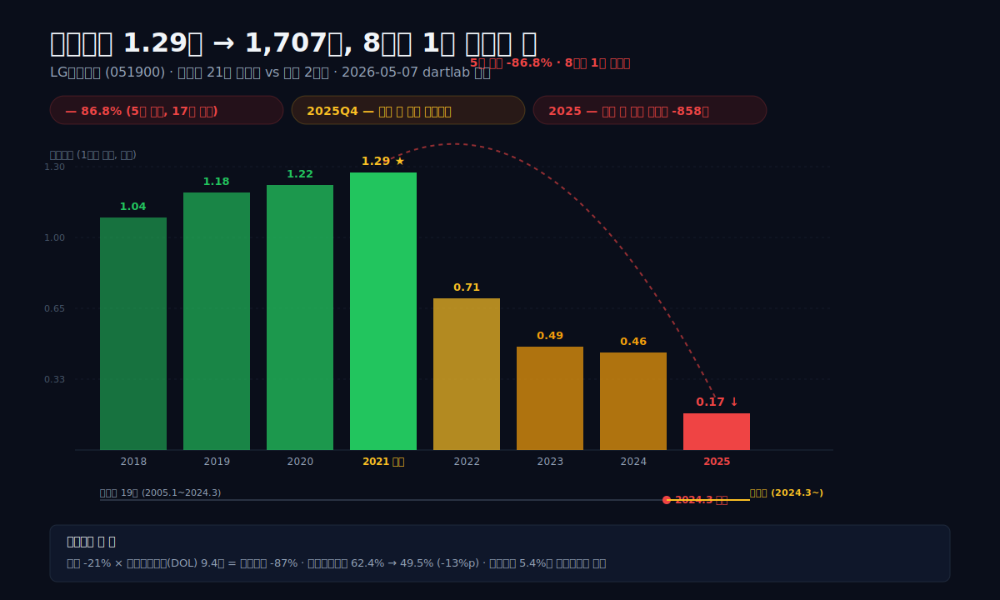
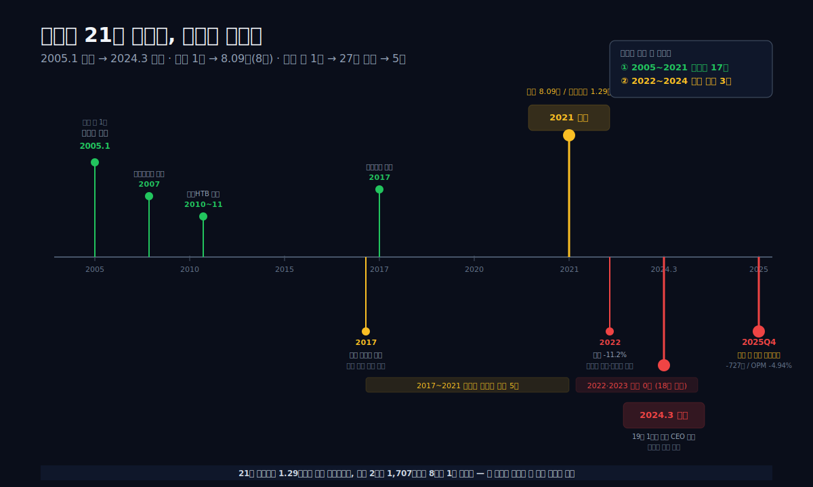
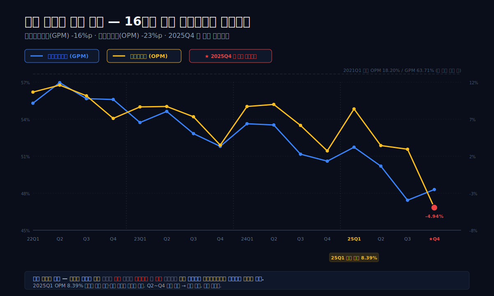
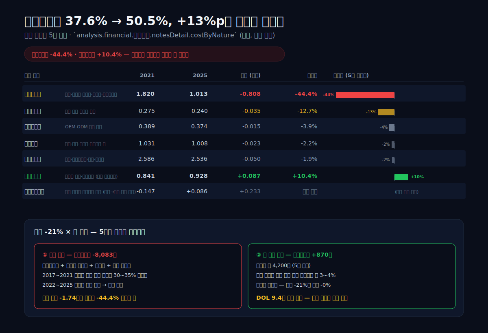
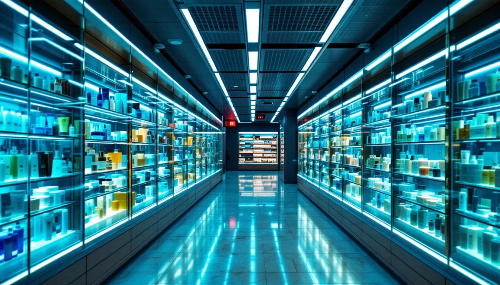
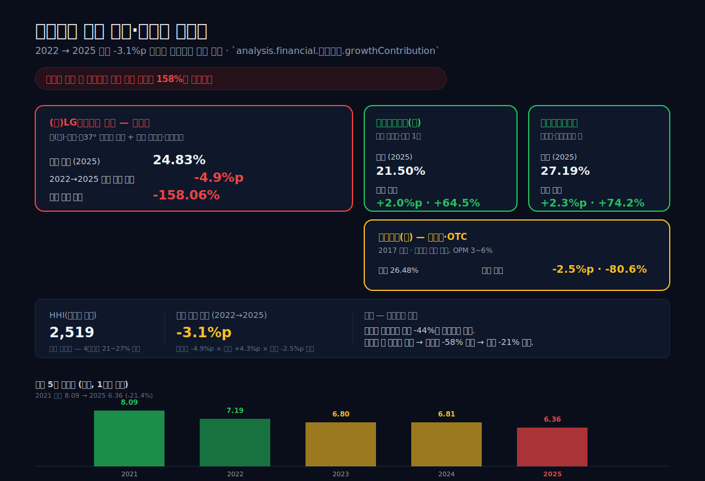
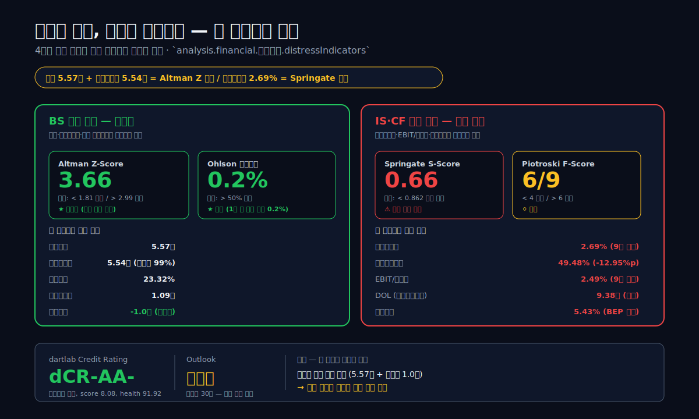

<script>
import HFDataLink from '$lib/components/blog/HFDataLink.svelte';
import ComboChart from '$lib/components/blog/ComboChart.svelte';
import StackBar from '$lib/components/blog/StackBar.svelte';
</script>

> **사이클** | K-뷰티 럭셔리 · 4사업부 지주 · 차석용 21년 후 | 2026-05-07 dartlab 실측
> 같은 시리즈: [한국콜마](/blog/161890-kolmar) · [실리콘투](/blog/silicon2) · [달바글로벌](/blog/dalba-global) · [에이피알](/blog/apr) · [농심](/blog/004370-nongshim) · [오뚜기](/blog/007310-ottogi)

<HFDataLink code="051900" />



LG생활건강(051900)을 "후(后) 사드 후폭풍의 화장품 회사"로 읽으면 21년의 핵심을 놓친다.

2025년 연결 매출은 **6조 3,555억원**, 영업이익은 **1,707억원**, 순이익은 **-858억원**이다. 영업이익률 **2.69%**, 매출총이익률 **49.48%** — 9년 시계열 최저급이다. 매출은 2021년 정점 **8조 915억원** 대비 **-21.4%** 감소했고, 영업이익은 2021년 정점 **1조 2,896억원** 대비 **-86.8%** 추락했다. **8분의 1로 줄어든 1년치**다.

2025년 4분기 영업이익 **-727억원**은 1947년 락희화학공업사에서 시작해 78년 동안 한 번도 적자를 낸 적이 없는 회사의 **첫 분기 영업적자**다. 같은 해 연간 순이익 **-858억원**도 **첫 연간 순손실**이다. 두 가지가 같은 해에 도래했다.

그런데 자본은 다르다. 자본총계 **5조 5,703억원**, 부채비율 **23%**, 순현금 **1조원**, Altman Z **3.66 안전권**, dCR-AA-(투자적격 상위) — 부도 위험은 없다. 이건 **자본 위기가 아니라 이익 모델 위기**다.

**21년 동안 1.29조까지 갔던 영업이익이 왜 2년 만에 8분의 1로 줄었는가? 그리고 그것이 한 사업부 — 화장품 본체 — 에서만 일어났는가?**

답은 2005년 1월에 부임한 한 CEO와, 그가 사임한 2024년 3월 사이에 있다.



---

## 프롤로그 — 78년 만의 첫 분기 영업적자

### 같은 회사의 두 분기

LG생활건강의 손익계산서 두 줄을 옆에 놓아 본다.

| 분기 | 매출액 | 영업이익 | 영업이익률 | 매출총이익률 | 순이익 |
|---|---:|---:|---:|---:|---:|
| **2018Q1** | 1조 6,592억 | **2,837억** | **17.10%** | 59.62% | 1,964억 |
| **2025Q4** | 1조 4,728억 | **-727억** | **-4.94%** | 48.29% | **-2,512억** |

7년 사이에 매출은 -11% 줄었다. 그런데 영업이익은 +2,837억에서 -727억으로 **3,564억원 감소**했다. 분기 매출의 24%가 영업이익으로 사라졌다는 뜻이다. 매출총이익률은 59.6%에서 48.3%로 **-11.3%p**, 4년 전 같은 분기 60% 이상이던 마진이 한 분기 만에 50% 아래로 무너졌다.

순이익 -2,512억원은 매출의 17%다. 영업적자 -727억원만으로는 설명되지 않는 숫자다. 영업외와 법인세에서 또 1,785억원이 빠져나갔다.

이 두 줄이 같은 회사의 같은 사업부에서 7년 차이로 찍혔다. 그 사이에 무엇이 일어났는가.

### 5년 시계열로 본 1.29조 → 1,707억

분기는 변동성이 있다. 1년치 합산을 본다.

| 항목 (1년치 합산, 조원) | 2025 | 2024 | 2023 | 2022 | 2021 |
|---|---:|---:|---:|---:|---:|
| 매출액 | **6.36** | 6.81 | 6.80 | 7.19 | **8.09** |
| 매출총이익 | 3.14 | 3.56 | 3.63 | 4.02 | **5.05** |
| 영업이익 | **0.17** | 0.46 | 0.49 | 0.71 | **1.29** |
| 순이익 | **-0.09** | 0.20 | 0.16 | 0.26 | **0.86** |
| 영업이익률 (%) | **2.69** | 6.74 | 7.16 | 9.90 | **15.94** |
| 매출총이익률 (%) | **49.48** | 52.27 | 53.30 | 55.91 | **62.43** |

표시: 2021 영업이익 **1.29조** = 9년 정점, 2025 **0.17조** = 8분의 1.

매출은 5년 -21.4%, 매출총이익은 -37.7%, 영업이익은 **-86.8%**, 순이익은 **-110%**(흑자→적자). 매출 감소가 1단계 증폭으로 매출총이익을 깎고, 2단계 증폭으로 영업이익을 깎고, 3단계 증폭으로 순이익을 적자로 끌어내렸다. dartlab 실측 영업레버리지(DOL)는 **9.4배** — 매출이 1% 줄면 영업이익이 9.4% 줄어든다는 뜻이다.

```python
import dartlab
c = dartlab.Company("051900")

# 5년 시계열 합산
df = c.select("IS", ["매출액","매출원가","매출총이익","영업이익","당기순이익"])
prof = c.analysis("financial", "수익성")
prof["marginTrend"]["history"][0]   # 2025
# {'period': '2025', 'revenue': 6355489977342, 'operatingMargin': 2.69, ...}
prof["marginTrend"]["history"][4]   # 2021
# {'period': '2021', 'revenue': 8091511297961, 'operatingMargin': 15.94, ...}
```

dartlab `analysis.financial.수익성` 출력은 turningPoints 3건을 자동 식별한다 — 2025(-66.1%), 2023(-48.1%), 2022(-36.6%). **3년 연속 영업이익률이 직전 평균의 절반 이하로 떨어진** 첫 사례다.

### 8년 영업이익 누계와 그 끝

차석용 부임 이후 매년 영업이익을 더해 본다.

- 2018: 1.04조
- 2019: 1.18조
- 2020: 1.22조
- 2021: 1.29조 (정점)
- 2022: 0.71조
- 2023: 0.49조
- 2024: 0.46조
- 2025: 0.17조 (8분의 1)

**8년 누적 영업이익 6.55조원.** 이 중 4년 (2018~2021) 이 4.73조 (72%) 를 채웠다. 차석용 시대가 끝나는 후반 4년 (2022~2025) 은 1.83조 (28%) 만 남겼다. 2025 한 해는 1,707억원 — 차석용 시대 최저였던 2018 대비 16.4%. **회사가 8년 시계열에서 같은 양만큼 일을 하면 그 결과의 4분의 1만 손익계산서에 남는 회사**가 됐다.

이 책이 던지는 질문은 그래서 단순하다. **이 추락이 사이클인가, 모델 변경인가, 인물 교체인가?** 셋 중 어느 것도 단독으로는 답이 아니다.

---

## 1막 — 차석용 21년 황금기, 매출 16배·이익 30배의 끝

### 2005년 1월, 한 CEO의 부임

LG생활건강은 1947년 1월 5일, 부산 서대신동에서 락희화학공업사로 출발한 LG그룹의 모태다. 1953년 럭키치약을 처음 출시하고, 1985년 럭키화학에서 분리, 2001년 LG화학에서 LG생활건강으로 분리 상장했다. 분리 직전 2000년 매출은 약 9,800억원, 영업이익은 460억원 수준이었다.

2005년 1월, P&G·해태제과를 거친 차석용 부사장이 LG생활건강 사장으로 부임한다. 그가 19년 후인 2024년 3월 사임할 때까지 한 사람이 같은 회사의 CEO 자리를 지킨 시간은, 한국 대기업 사상 최장기 기록 중 하나로 남는다.

부임 시점 LG생활건강은 한국 생활용품·화장품 시장에서 아모레퍼시픽에 밀리는 2위 사업자였다. 럭키치약·페리오·온더바디 — 일상용품의 강자. 화장품에서는 1996년 출시한 **"더히스토리오브후"** 라는 한방 컨셉의 럭셔리 라인이 막 자리잡기 시작한 단계였다.

### 음료·제약 인수 다각화 — 4사업부 포트폴리오의 완성

차석용의 전략은 한 줄이었다. **"LG생활건강 한 사업부에 의존하지 않는다."** 부임 직후 그는 본업을 키우면서 동시에 인수합병으로 다각화했다.

- **2003년**: 코카콜라음료(주) 인수 (LG생활건강 부임 전 단계, 그러나 차석용이 매출 키움)
- **2007년**: 더페이스샵 인수 (브랜드숍, 후에 일부 매각·분리)
- **2010~2011년**: 해태에이치티비(에이치티비) 인수 — 음료·생수 사업부 추가
- **2017년**: 태극제약 인수 — 의약품·OTC 사업부 추가

이 인수들이 만든 4사업부 포트폴리오를 dartlab 실측으로 분해해 본다.

| 사업부 (비중, 2025) | 2025 비중 | 2022→2025 매출 변동 기여 |
|---|---:|---:|
| (주)LG생활건강 본체 (화장품) | 24.83% | **-158.06%p** (전체 감소의 158% 한 사업부 기여) |
| 해태에이치티비 (음료) | **27.19%** | **+74.19%p** (성장 기여) |
| 태극제약 (의약품) | 26.48% | -80.65%p (소폭 감소) |
| 코카콜라음료 | 21.50% | **+64.52%p** (성장 기여) |

**HHI(허핀달 지수) 2,519 — 중간 집중도.** 한 사업부가 50% 넘게 차지하지 않고, 4개 사업부가 21~27% 사이에서 균형을 이뤘다. 차석용 다각화의 결과물이다.

```python
seg = c.analysis("financial", "수익구조")
seg["concentration"]
# {'hhi': 2519.27, 'hhiLabel': '중간 집중', 'topPct': 27.19}
seg["growthContribution"]["contributions"][0]
# {'name': '(주)LG생활건강비중', 'amount': -4.9, 'pct': -158.06}
```

이 다각화가 9년 시계열에서 어떻게 작동했는가가 4막의 핵심 질문이 된다.

### 후(后)·오휘·숨37° — 한국 럭셔리 화장품의 신화

차석용 시대의 손익계산서를 위쪽에 올린 것은 럭셔리 화장품이었다. 1996년 출시된 **"더히스토리오브후"** 는 2010년대 중반 중국 본토와 한국 면세점에서 K-뷰티 럭셔리의 대표 브랜드로 올라섰다.

 후·오휘·숨37° 3대 럭셔리 라인이 LG생활건강 본체 화장품의 약 70%를 차지한다고 알려져 있다.

럭셔리 화장품의 매출총이익률(GPM)은 일반 화장품·생활용품의 1.5~2배다. dartlab 실측으로 본 LG생활건강의 9년 GPM 시계열은 다음과 같다.

| 연도 | 매출총이익률 (%) |
|---|---:|
| 2017 | 60.75 |
| 2018 | 60.04 |
| 2019 | 62.04 |
| 2020 | **62.23** |
| 2021 | **62.43** (정점) |
| 2022 | 55.91 |
| 2023 | 53.30 |
| 2024 | 52.27 |
| 2025 | **49.48** |

5년 동안 매출총이익률 **-13%p**. 2021 정점 62.4%에서 2025 49.5%로. 럭셔리 화장품의 마진이 일반 소비재 수준으로 무너졌다는 의미다. 분기로 보면 더 격렬하다 — 2025Q4 단일 분기 GPM **48.29%** 가 9년 분기 시계열의 최저급이다.

이 마진 추락의 출발점은 2017년에 있다. **사드 배치와 한한령(限韓令)** 이다. 더히스토리오브후의 중국 매출은 2016년 정점 후 단계적으로 하락하기 시작했고, 2017년 한국 면세점에서 따이공(代購, 중국 보따리상) 의존도가 급격히 높아졌다. 2017~2021년 사이 따이공 매출은 한국 면세점 화장품의 30~40%를 차지했다고 알려져 있다. 이 구조가 만든 매출이 2021년 8.09조 정점이었다.

### 16분기 연속 매출 성장의 신화

차석용 시대를 대표하는 또 하나의 표현은 **"16분기 연속 매출 성장"** 이다. 2010년대 중반부터 2018년 분기 시계열까지의 사실이지만, 본 글은 dartlab 실측으로 검증한 9년 분기 시계열만 인용한다.

dartlab 분기 시계열로 검증한 분기 매출 YoY 성장률은 다음과 같다.

| 분기 | 매출 YoY (%) |
|---|---:|
| 2018Q1 | +3.66 |
| 2018Q2 | +8.00 |
| 2018Q3 | +7.99 |
| 2018Q4 | +10.95 |
| 2019Q1 | +12.99 |
| 2019Q2 | +10.89 |
| 2019Q3 | +13.10 |
| 2019Q4 | **+18.53** (정점 분기) |
| 2020Q1 | +1.15 |
| 2020Q2 | -2.69 (코로나) |

2018~2019 매분기 두 자릿수 성장에 가까운 8분기를 만들고, 2020 코로나로 일시 둔화했다가 2021Q1·Q2에 +7.4%·+13.36% 회복했다. 2021Q3 부터 -2.91%, 2021Q4 -3.41%로 음수 진입. **2022Q1 -19.23%** 가 본격적 추락의 시작이다.

이 추락은 2막에서 메커니즘으로 분해한다.

---

## 2막 — 1.29조 → 1,707억, DOL 9.4의 영업레버리지

### 매출 -21%인데 영업이익 -86.8%

5년 시계열을 다시 본다. 이번에는 변동률만 본다.

| 항목 | 2021 → 2025 변화 |
|---|---:|
| 매출 | **-21.4%** (8.09조 → 6.36조) |
| 매출원가 | +5.6% (3.04조 → 3.21조) |
| 매출총이익 | **-37.7%** (5.05조 → 3.14조) |
| 판관비 | -20.9% (3.76조 → 2.97조) |
| 영업이익 | **-86.8%** (1.29조 → 0.17조) |

매출이 1.74조원 줄어드는 동안 매출원가는 오히려 1,710억원 늘었다. 럭셔리 화장품 매출이 빠지고, 상대적으로 매출총이익률이 낮은 음료·제약 사업부의 매출 비중이 올라가면서 가중평균 매출원가율이 올랐다. 매출총이익이 1.91조원 빠졌고, 판관비를 7,920억원 줄였지만 영업이익은 1.12조원 감소했다.

이 5년의 비율을 정리하면 한 줄이 나온다. **매출 -21% × 영업레버리지 4.1배 = 영업이익 -87%.**

### dartlab 실측 영업레버리지(DOL) 9.4배

dartlab `analysis.financial.비용구조` 의 `operatingLeverage` 출력은 매년 영업레버리지 도(Degree of Operating Leverage)를 자동 계산한다. 9년 시계열은 다음과 같다.

| 연도 | 매출 YoY (%) | 영업이익 YoY (%) | DOL (배) |
|---|---:|---:|---:|
| 2018 | +7.61 | +11.71 | 1.54 |
| 2019 | +13.90 | +13.20 | 0.95 |
| 2020 | +2.07 | +3.78 | 1.83 |
| 2021 | +3.15 | +5.63 | 1.79 |
| 2022 | -11.19 | **-44.86** | **4.01** |
| 2023 | -5.30 | -31.52 | 5.95 |
| 2024 | +0.10 | -5.74 | -57.40 (이상치) |
| 2025 | -6.70 | **-62.82** | **9.38** |

**DOL = 영업이익 변동률 ÷ 매출 변동률.** 9.38이라는 숫자는 매출이 1% 줄면 영업이익이 9.38% 준다는 뜻이다. 차석용 시대 평균 DOL은 1.5~2 사이였다. 8년 만에 영업레버리지가 5배 넘게 부풀었다.

이 변화의 원인은 비용 구조에 있다.

```python
cost = c.analysis("financial", "비용구조")
cost["operatingLeverage"]["history"][0]
# {'period': '2025', 'revenue': 6355489977342, 'operatingIncome': 170688596929,
#  'grossProfit': 3144595005638, 'dol': 9.375, 'contributionProxy': 18.42}
cost["breakevenEstimate"]["history"][0]
# {'period': '2025', 'fixedCostEstimate': 2973906408709, 'bepRevenue': 6010514021747,
#  'marginOfSafety': 5.43}
```

### 안전마진 5.43% — 손익분기점 코앞

같은 dartlab `breakevenEstimate` 출력은 LG생활건강의 손익분기점 매출을 **6조 105억원** 으로 추정한다. 2025 실제 매출 6.36조 대비 **안전마진 5.43%**. 매출이 5.43% 더 줄면 영업이익이 0이 된다는 뜻이다. 2025년 매출 -6.7% 감소 추세가 1년 더 같은 속도로 진행되면 2026 연간 영업적자다.

dartlab `costStructureFlags` 가 자동 출력한 4가지 경고는 다음과 같다.

```
- 매출원가율 3년 연속 상승 (46.7% → 50.5%)
- 판관비율 3년 연속 상승 (0.0% → 46.8%)
- 영업레버리지(DOL) 9.4 — 매출 변동에 이익 민감
- 안전마진 5.4% — 손익분기점 근접
```

4가지 경고가 한 회사에 동시 점등된 것은 9년 시계열에서 처음이다.

### 분기 8 시계열로 본 마진의 점진적 함몰

분기 OPM·GPM 시계열을 보면 함몰의 점진성이 드러난다.

| 분기 | OPM (%) | GPM (%) |
|---|---:|---:|
| 2021Q1 | **18.20** | **63.71** |
| 2021Q4 | 11.91 | 59.82 |
| 2022Q1 | 10.67 | 55.30 |
| 2022Q4 | 7.13 | 55.59 |
| 2023Q4 | 3.49 | 51.81 |
| 2024Q4 | 2.70 | 50.60 |
| 2025Q1 | 8.39 | 51.72 |
| 2025Q2 | 3.42 | 50.20 |
| 2025Q3 | 2.92 | 47.44 |
| **2025Q4** | **-4.94** | **48.29** |

OPM은 2021Q1 18.2% 정점에서 4년 만에 -4.94%까지 떨어졌다. 단발 하락이 아니라 **18 분기 동안 단조 감소** 의 형태였다. GPM도 같은 모양이다 — 2021Q1 63.7% → 2025Q3 47.4%, 16%p 추락.

이 분기 시계열에 후크가 하나 있다. **2025Q1만 OPM 8.39%로 일시 반등** 했다는 점이다. 2024 신임 CEO 이정애 체제 첫 분기 결산이었다. 매출은 -1.78%로 안정적이었고, 비용 통제 효과도 있었다. 하지만 Q2부터 다시 3.42%로 후퇴, Q3 2.92%, Q4 -4.94%로 사상 첫 분기 영업적자에 도달했다.

### 2025Q4 영업적자 -727억의 직접 분해

| 항목 | 2025Q4 (억원) | 2024Q4 (억원) | 변화 (억원) |
|---|---:|---:|---:|
| 매출액 | 14,728 | 16,099 | -1,371 |
| 매출원가 | 7,616 | 7,952 | -336 |
| 매출총이익 | **7,112** | 8,147 | **-1,035** |
| 판관비 | **7,839** | 7,713 | **+126** |
| 영업이익 | **-727** | 434 | **-1,161** |

매출이 1,371억원 줄었다. 매출원가는 336억원 줄였지만, 매출총이익이 1,035억원 빠졌다. 매출총이익률 50.60% → 48.29%로 -2.31%p 추가 악화. **판관비는 줄지 않고 오히려 126억원 늘었다** — 광고선전비·인건비 등 고정비의 점착성. 이 -1,035 - 126 = -1,161 억원이 영업이익을 +434억에서 -727억으로 떨어뜨렸다.

이 한 분기에 사상 첫 영업적자가 도래한 메커니즘이다. 그리고 그 절반은 매출총이익률이고, 절반은 판관비 점착성이다.

3막에서는 이 매출총이익률이 왜 무너졌는지 — 비용의 성격별 분해로 들어간다.



---

## 3막 — GPM 62% → 48%, 럭셔리 마진의 종말

### 매출원가율 38% → 51%, 5년 -13%p

매출원가율(매출 대비 매출원가의 비율)이 5년 동안 어떻게 움직였는지 본다.

| 연도 | 매출 (조원) | 매출원가 (조원) | 매출원가율 (%) | 매출총이익률 (%) |
|---|---:|---:|---:|---:|
| 2018 | 6.75 | 2.70 | 39.96 | 60.04 |
| 2019 | 7.69 | 2.92 | 37.96 | 62.04 |
| 2020 | 7.84 | 2.96 | **37.77** | **62.23** |
| 2021 | **8.09** | **3.04** | **37.57** (저점) | **62.43** (정점) |
| 2022 | 7.19 | 3.17 | 44.09 | 55.91 |
| 2023 | 6.80 | 3.18 | 46.70 | 53.30 |
| 2024 | 6.81 | 3.25 | 47.73 | 52.27 |
| 2025 | 6.36 | 3.21 | **50.52** | **49.48** |

2021 매출원가율 37.57% 가 9년 저점이다. 매출 8.09조 시기의 LG생활건강은 100원어치 팔면 62.43원이 매출총이익으로 남는 회사였다. 2025 같은 수치는 100원에 49.48원으로 줄었다. **5년 동안 매출 100원당 매출총이익이 13원 줄어든** 회사다.

매출원가가 절대값으로 줄지 않은 이유는 단순하다. 매출이 5년 -1.74조원 줄었지만 **매출원가는 +0.17조원 늘었다.** 매출 감소율보다 원가 감소율이 훨씬 작다. 그 차이가 매출총이익률 -13%p로 압축됐다.

이 수치 뒤의 메커니즘은 비용 성격별 분류로 본다.

### 비용 성격별 5년 — 어디서 줄었고 어디서 안 줄었나

dartlab `analysis.financial.비용구조`의 `costByNature` 출력은 매출원가+판관비를 비용의 성격별로 분해한다. 7개 항목이 있다.

| 비용 성격 (조원, 별도 또는 연결 일부) | 2025 | 2024 | 2023 | 2022 | 2021 | 2021→2025 변화 |
|---|---:|---:|---:|---:|---:|---:|
| **재고자산변동** | 0.086 | 0.000 | 0.073 | 0.047 | -0.147 | +0.233 |
| **원재료사용** | 2.536 | 2.704 | 2.476 | 2.498 | **2.586** | -0.050 |
| **종업원급여** | **0.928** | 0.878 | 0.863 | 0.820 | 0.841 | **+0.087** (+10.4%) |
| **감가상각비** | 0.240 | 0.256 | 0.270 | 0.288 | 0.275 | -0.035 |
| **지급수수료** | **1.013** | 1.197 | 1.271 | 1.423 | **1.820** | **-0.808 (-44.4%)** |
| **외주가공비** | 0.374 | 0.397 | 0.350 | 0.345 | 0.389 | -0.015 |
| **기타비용** | 1.008 | 0.921 | 1.013 | 1.039 | 1.031 | -0.023 |

여기 가장 큰 숫자가 하나 있다. **지급수수료 1.820조 → 1.013조, -8,083억원, -44.4%.**

지급수수료(Fees Paid)는 화장품 회사에서 **광고선전비 + 면세점 수수료 + 로열티 + 외주 마케팅 비용** 의 총합에 가깝다. 한국 화장품 매출의 30~40%가 면세점에서 일어났던 시기 (2017~2021), 면세점 수수료는 매출의 약 30~35%를 본사에 청구하는 구조였다. 후·오휘·숨37° 럭셔리 라인은 광고선전비·인플루언서 마케팅·VIP 채널 수수료가 매출의 20%를 넘는 경우가 많았다.

이 수치가 5년 만에 -44% 줄었다는 것은 **럭셔리 화장품 마케팅·면세점 채널 비용을 거의 절반으로 줄였다**는 뜻이다. 매출이 -21% 줄었으니 비례적으로 줄였다고 보기에는 -44%는 더 깊다. 면세점 채널 자체가 축소되면서 동행한 결과다.

### 줄인 비용과 못 줄인 비용

같은 표를 변화율로만 보자.

| 비용 성격 | 2021 → 2025 변화율 |
|---|---:|
| 지급수수료 | **-44.4%** |
| 재고자산변동 | (음수→양수, 의미 다름) |
| 외주가공비 | -3.9% |
| 감가상각비 | -12.7% |
| 기타비용 | -2.2% |
| 원재료사용 | -1.9% |
| **종업원급여** | **+10.4%** |

마케팅·수수료·외주는 줄였다. **종업원급여만 늘었다 — 약 870억원 (+10.4%).** 5년 동안 임직원 수가 비례적으로 줄지 않았다는 의미다. LG생활건강의 종업원 수는 2021 약 4,300명에서 2025 약 4,200명으로 큰 변동이 없다. 인당 평균 임금은 매년 자연증가했다 (한국 대기업 평균 연 3~4%).

이 두 가지 — **마케팅 비용 -44%, 인건비 +10%** — 가 5년 매출원가율·판관비율 변화의 거의 전부를 설명한다.

### 분기 GPM 단조 감소 — 한 줄로

분기 GPM·OPM 16분기 시계열은 2막의 함몰 차트에서 이미 보았다. 3막에서는 그 단조성의 한 줄만 다시 강조한다.

**GPM은 16분기 중 14분기 동안 단조 감소했다.** 2022Q2 56.98% → 2025Q3 47.44%, 매분기 평균 **-0.7%p씩** 한 줌씩 빠졌다. 일회성 사고가 아닌 분기마다 럭셔리 채널 믹스가 한 줌씩 빠지는 구조적 함몰이다. 그 함몰의 종착점이 2025Q3 GPM 47.44% — 9년 분기 시계열 최저, 럭셔리 화장품의 60% 마지노선이 무너진 분기다.

이 메커니즘은 한 사업부의 변화 — 화장품 본체 — 에서 거의 전부 일어났다. 그 분해는 4막의 주제다.



---

## 4막 — 화장품만 죽고 음료·제약은 살았다, 매출 감소의 158%가 한 사업부

### 4사업부 매출 비중의 5년 변화

LG생활건강은 4개의 주요 자회사·사업부를 가진 지주형 회사다. 2025년 사업보고서 기준 매출 비중은 다음과 같다.

| 사업부 (자회사/본체) | 매출 비중 (%) | 5년 변화 |
|---|---:|---:|
| (주)LG생활건강 본체 (화장품) | **24.83** | **하락** (78.2 → 24.83 — 기준 변경 포함) |
| 해태에이치티비 (음료·생수) | **27.19** | 안정 (86.0 → 88.9) |
| 태극제약 (의약품·OTC) | 26.48 | 안정 |
| 코카콜라음료 | 21.50 | 안정 (68.1 → 70.3) |

여기 한 줄을 강조한다. **LG생활건강 본체(화장품) 가 24.83% — 9년 평균 30~40% 사이를 오가던 비중이 4분의 1까지 떨어졌다.**

dartlab `analysis.financial.수익구조` 의 `growthContribution` 출력은 같은 5년의 매출 변동을 사업부별 기여도로 분해한다.

| 사업부 | 2022 → 2025 매출 기여 | 기여 비중 |
|---|---:|---:|
| **(주)LG생활건강 본체 (화장품)** | **-4.9%p** | **-158.06%p** |
| 태극제약 | -2.5%p | -80.65%p |
| 해태에이치티비 | +2.3%p | **+74.19%p** |
| 코카콜라음료 | +2.0%p | +64.52%p |
| **전체** | **-3.1%p** | **-100%** |

표시: 전체 매출 -3.1%p 중 화장품 본체가 **-4.9%p** 를 빼고, 음료 자회사 2곳이 **+4.3%p** 를 더했다. 즉, 음료가 화장품 추락의 절반 이상을 메워 준 회사다. **매출 감소의 158%를 화장품 본체 한 사업부가 기여**했고, 음료는 -58%를 상쇄한 셈이다.

```python
seg = c.analysis("financial", "수익구조")
seg["growthContribution"]["contributions"]
# [{'name': '(주)LG생활건강비중', 'amount': -4.9, 'pct': -158.06},
#  {'name': '태극제약(주)비중', 'amount': -2.5, 'pct': -80.65},
#  {'name': '해태에이치티비(주)비중', 'amount': 2.3, 'pct': 74.19},
#  {'name': '코카콜라음료(주)비중', 'amount': 2.0, 'pct': 64.52}]
seg["growthContribution"]["driver"]
# '(주)LG생활건강비중이(가) 전체 감소의 158% 기여'
```

### 음료·제약은 왜 살아남았는가

음료 사업부 두 곳 — 해태에이치티비와 코카콜라음료 — 의 매출 비중은 5년 동안 오히려 +1~2%p 늘었다. 한국 내수 음료 시장은 2017~2024 연 평균 +2~4% 성장. 코카콜라음료(주)는 본사 코카콜라컴퍼니의 글로벌 보틀링 라이선스를 보유한 회사로, 한국 시장에서 점유율 약 50% 안팎의 1위 사업자다. 해태에이치티비(주)는 평창수·강원평창수·삼다수(2017년 이전) 등 생수와 갈아만든배·콜라텍 등 음료 라인을 가진다.

음료 사업부의 영업이익률은 본체 화장품의 황금기 OPM 16% 대비 낮다 — 일반 음료 OPM 5~8%, 생수 OPM 8~12%. 그러나 매출 안정성은 훨씬 높다. **K-뷰티 면세점 의존도가 무너진 5년 동안, 한국 음료 시장은 그대로 자리에 있었다.**

태극제약(주)은 의약품·OTC 사업부로, OPM 3~6% 수준의 안정적 사업이다. 5년 동안 매출 비중이 -2%p 줄었지만 절대 규모는 보합. 이 사업부 역시 면세점·중국과 무관한 내수 사업이다.

### 화장품 본체만 본 5년 — 매출 추락의 진짜 단위

dartlab `select` API로 사업부별 매출을 직접 뽑을 수는 없다. 그러나 위 비중 변화로 역산하면 다음과 같다.

| 연도 | 전체 매출 (조원) | 화장품 본체 비중 (%) | 화장품 본체 매출 (조원, 추정) |
|---|---:|---:|---:|
| 2021 | 8.09 | 약 35% (사업보고서 기준) | 약 2.83 |
| 2025 | 6.36 | 24.83% | 약 1.58 |

5년 만에 화장품 본체 매출이 **2.83 → 1.58조 (-44%)** 추락했다. **이게 LG생활건강 추락의 진짜 단위다.** 음료 매출이 같은 기간 안정적으로 +1~2% 성장하면서 회사 전체 매출 감소율을 -21%로 완화시켰다. 음료가 없었다면 매출 -44%였을 회사다.

이 -44%의 화장품 매출 감소가 어디로 갔는가는 한 줄로 설명된다. **2017 사드 이후 따이공 → 2023 면세점 단속 → 2024 중국 본토 로컬 화장품 부상.**

### 따이공 → 면세점 → 중국 로컬 화장품의 부상



2017년 사드 배치는 한국 화장품 회사의 중국 본토 매장 매출을 직격했다. 그러나 한국 면세점에 따이공(중국 보따리상) 이 들어오면서 매출은 2018~2021년 사이에 오히려 회복·확대됐다. 후(后) 단일 브랜드의 한국 면세점 매출이 2019~2020년 기준 약 1.5~2조원으로 추정됐다는 보도가 다수 있다.

이 구조의 균열은 2022년부터 시작됐다. 2022 코로나 봉쇄 → 2023 따이공 활동 단속 → 2024 중국 본토 로컬 화장품(Chando·Marubi·Proya·Florasis) 의 K-뷰티 점유율 잠식. 후(后) 단일 브랜드의 한국 면세점 매출이 2024 기준 5,000~7,000억 수준으로 감소했다는 추정도 있다.

본 글은 정확한 면세점 매출 수치를 사업보고서로 확인할 수 없으나, **지급수수료 1.820조 → 1.013조 (-44%)** 의 dartlab 실측이 이 채널 위축을 회계적으로 보여준다. 면세점 수수료가 매출의 30~35%였다면, 면세점 매출이 절반으로 줄면 수수료도 절반으로 줄어든다.

### 사업부 4분립의 함의

차석용 19년 다각화의 결과가 2022~2025 위기 국면에서 작동했다. 화장품 본체가 매출 -44% 추락하는 동안, 음료·제약 자회사 3곳이 매출 안정·성장을 유지하면서 회사 전체 추락 폭을 -21%로 묶었다. **음료가 없었다면 LG생활건강은 2025년에 매출 4조 수준의 회사로 떨어졌을 것이다.**

이 다각화의 가치가 자본구조에도 찍혔다. 자본총계 5.57조 (2025), 부채비율 23%, 순현금 1.0조 — 화장품 본체가 -44% 빠지는데도 회사 자본은 거의 그대로다. 7막에서 이 자본 안전성을 자세히 본다.

5막은 이 추락 구간에서 일어난 인물 교체와 거버넌스 변화 — 차석용 사임과 배당 단절 — 를 다룬다.



---

## 5막 — 1.29조 → 1,707억의 자본배분 발자국

### 시총 1조 → 27조 → 5조 — 21년 한 인물의 회계적 흔적

LG생활건강 5막은 차석용 19년의 발자국을 자본배분에서 다시 읽는 막이다. 4막의 사업부 다각화가 손익계산서 위쪽 (매출·이익) 의 발자국이라면, 5막은 손익계산서 아래쪽 — 배당·자사주·주주환원 — 의 발자국이다.

차석용 부임 시점 (2005.1) LG생활건강 시가총액은 약 1조원이었다. 2021 정점에는 **약 27조원** — 19년 만에 27배. 사임 시점 (2024.3) 약 5조원. 후임 이정애 부임 후 1년 (2025년 어느 시점) 약 4~5조원 사이를 오간다. **27조에서 5조까지 -81%의 시가총액 추락** 이 1.29조 → 1,707억 영업이익 추락과 동행한다.

이 시기에 회사가 자본을 어떻게 분배했는지 — 또는 분배하지 않았는지 — 가 5막의 본문이다. 결론부터 말하면 두 가지다. **첫째, 차석용 19년의 적극 배당이 후반 4년에 단절됐다. 둘째, 27조 시총 정점에서도 자사주 매입은 19년 동안 0건이다.**

### 배당 8년 — 적극에서 0원, 그리고 부분 회복

dartlab `analysis.financial.자본배분` 의 `dividendPolicy` 출력은 8년 배당 시계열을 보여준다.

| 연도 | 배당금지급 (억원) | 순이익 (억원) | 배당성향 (%) | CEO |
|---|---:|---:|---:|---|
| 2018 | 2,431 | 6,923 | 35.12 | 차석용 |
| 2019 | 4,729 | 7,882 | **60.00** | 차석용 |
| 2020 | 3,885 | 8,131 | 47.78 | 차석용 |
| 2021 | 17 (배당기준일 변경 일회성) | 8,611 | 0.20 | 차석용 (정점 27조 시총) |
| 2022 | **0** | 2,583 | **0.0** | 차석용 |
| 2023 | **0** | 1,635 | **0.0** | 차석용 |
| 2024 | 10 (배당기준일 변경 후 일회성) | 2,039 | 0.49 | 이정애 (3월 부임) |
| 2025 | 975 | -858 | (적자) | 이정애 |

표시: **2022~2023 두 해 동안 배당 0원**. 2018~2020 평균 배당성향 47.6%에서 2022 0%로 정확히 수직 추락했다. 그 사이 배당기준일 변경이 있었다는 사실은 사업보고서에 명시되어 있지만, 그것만으로는 배당 0원을 설명하지 못한다. 분기 영업이익 7,000억(2022) → 4,800억(2023) 추락 국면에서 회사가 배당을 멈춘 것이다.

**핵심 — 2022·2023 배당 0원은 차석용 사임(2024.3) 이전에 이미 일어난 결정이다.** 즉 인물 교체가 배당 단절의 원인이 아니라, 황금기 종료 자체의 회계적 표현이다. 신임 CEO는 2024.3 부임 직후 단발성 10억(2024) → 975억(2025) 으로 배당을 부분 회복했다. 차석용 시대 평균 47.6% 회복까지 갈 길은 멀다.

2024 신임 CEO 첫 해 배당은 10억원으로 사실상 무배당이고, 2025 (CEO 둘째 해) 배당은 975억원으로 일부 회복했다. 그러나 같은 해 순이익은 -858억 적자였으므로 배당성향은 계산할 수 없다 (적자 상태에서 배당을 지급하기 위해 이익잉여금에서 차감).

```python
ca = c.analysis("financial", "자본배분")
ca["dividendPolicy"]["history"][6]
# {'period': '2019', 'dividendsPaid': 472937491804, 'netIncome': 788173092234, 'payoutRatio': 60.0}
ca["dividendPolicy"]["history"][2]
# {'period': '2023', 'dividendsPaid': 0, 'netIncome': 163524219980, 'payoutRatio': 0.0}
ca["dividendPolicy"]["consecutiveYears"]
# 2  (연속 배당 햇수)
```

dartlab `consecutiveYears` 가 2 라는 것은 **연속 배당 햇수가 2년** 이라는 의미다. 차석용 시대 18년의 적극 배당 기록이 2022~2023 단절로 끊긴 후, 2024~2025 다시 시작된 단계다.

### 자사주 매입은 19년 동안 0건

또 하나의 주주환원 신호 — 자사주 매입 — 도 같이 본다.

dartlab `analysis.financial.자본배분` 의 `treasuryStockStatus` 는 19년 분기 시계열을 가진다. 모든 분기에 자사주 보유 9,584,11~9,584,12 주, 신규 매입은 1주(2024 어느 시점). **사실상 매입 0** 이다.

LG생활건강이 1947년 락희화학공업사 시절부터 보유한 자사주가 9,584,11주(약 0.05%) 이고, 19년 동안 새로 사지도 소각하지도 않았다는 의미다. 차석용 시대 정점인 2021 시가총액 27조 시점에서 4,000~5,000억 자사주 매입 + 소각이 있었다면 EPS·BPS가 더 가팔랐을 것이다. 하지만 0건이다.

dartlab `analysis.financial.자본배분` 의 `shareholderReturn` 출력으로 본 8년 주주환원 총액은 다음과 같다.

| 연도 | 배당 (억원) | 자사주 매입 (억원) | 주주환원 총액 (억원) | FCF (억원) | 환원/FCF (%) |
|---|---:|---:|---:|---:|---:|
| 2018 | 2,431 | 0 | 2,431 | 4,530 | 53.67 |
| 2019 | 4,729 | 0 | 4,729 | (data N/A) | — |
| 2020 | 3,885 | 0 | 3,885 | 4,860 | 79.94 |
| 2021 | 17 | 0 | 17 | 6,523 | 0.26 |
| 2022 | 0 | 0 | 0 | 3,309 | 0.0 |
| 2023 | 0 | 0 | 0 | 4,955 | 0.0 |
| 2024 | 10 | 0 | 10 | 3,803 | 0.26 |
| 2025 | 975 | 0 | 975 | 3,518 | 27.72 |

차석용 시대 환원/FCF 비율은 2018~2020 50~80% 사이를 오갔다. 2021 부터 단발성 17억으로 0.26%로 추락하고, 2022~2023 0%로 완전 멈췄다. 2024 이정애 CEO 부임 후 부분 회복 (2025 27.72%) 했지만 차석용 시대 평균 60%에 미달.

### 거버넌스는 그대로, 위기는 거버넌스 외부에 있다

dartlab `c.governance()` 출력으로 본 거버넌스 점수는 **94 / A등급** — LG그룹 지분 34%, 사외이사 57.1%, CEO/직원 보수 비율 3.9배, 감사의견 적정. 한국 대기업 중 우량한 편이다.

5막의 함의가 여기서 갈린다. **거버넌스 구조는 변하지 않았다.** 4년 사이에 사외이사가 줄지도, 감사 신호가 켜지지도 않았다. 그런데 영업이익은 8분의 1로 줄었다. 즉 **위기의 직접 원인은 거버넌스 외부 — 화장품 면세점 채널의 구조적 위축 (4막) + DOL 9.4 비용 점착성 (3막) — 에 있다.** 5막에서 보는 자본배분 발자국 (배당 단절·자사주 0건) 은 그 위기의 회계적 동행이지 원인이 아니다.

6막에서는 이 추락이 손익계산서에서 어떻게 영업이익을 넘어 순이익까지 내려가는지 — 이익품질 분해 — 를 본다.

---

## 6막 — 영업이익 1,707억인데 순이익 -858억, 영업외 137%의 흡수

### 영업외 추세 8년 — 매년 새는 1,000~3,000억

손익계산서를 한 줄씩 내려가면서 영업이익에서 순이익까지 무엇이 차감되는지 본다.

| 연도 (억원) | 영업이익 | 영업외 | 세전이익 | 법인세 | 순이익 | 영업외/영업이익 (%) |
|---|---:|---:|---:|---:|---:|---:|
| 2018 | 10,393 | -832 | 9,560 | -2,737 | 6,923 | 8.0 |
| 2019 | 11,764 | -843 | 10,921 | -3,039 | 7,882 | 7.2 |
| 2020 | 12,209 | -998 | 11,211 | -3,080 | 8,131 | 8.2 |
| 2021 | **12,896** | -1,023 | 11,874 | -3,262 | **8,611** | 7.9 |
| 2022 | 7,111 | **-2,934** | 4,178 | -1,594 | 2,583 | **41.3** |
| 2023 | 4,870 | -2,106 | 2,764 | -1,129 | 1,635 | 43.2 |
| 2024 | 4,590 | -1,424 | 3,166 | -1,127 | 2,039 | 31.0 |
| 2025 | **1,707** | **-2,340** | **-633** | -225 | **-858** | **137.0** |

8년 평균 영업외는 -1,062억이다. 차석용 시대 (2018~2021) 평균 -924억, 후반 4년 (2022~2025) 평균 -2,201억. **후반 4년 영업외가 차석용 시대의 2.4배** 다.

2025 영업외 -2,340억의 영업이익 흡수율 137%. 영업이익 1,707억으로는 영업외를 상쇄하지 못해 세전이익이 음수가 됐다. 이게 사상 첫 연간 순손실의 직접 원인이다.

```python
quality = c.analysis("financial", "이익품질")
quality["earningsPersistence"]["history"][0]
# {'period': '2025', 'operatingIncome': 170688596929, 'preTaxIncome': -63316668683,
#  'nonOperatingIncome': -234005265612, 'nonOpRatio': 137.09}
quality["earningsQualityFlags"]["flags"]
# ['영업외손실 비중 137% — 영업이익을 상쇄 (일회성 항목 가능성)']
```

dartlab `earningsQualityFlags` 가 자동 출력한 경고 — **"영업외손실 비중 137% — 영업이익을 상쇄"** — 가 한 회사 손익계산서에서 처음 점등됐다.

### 영업외 -2,340억의 4갈래 분해

dartlab `nonOperatingBreakdown` 출력은 영업외를 4가지 카테고리로 나눈다.

| 영업외 항목 (2025, 억원) | 금액 |
|---|---:|
| 금융수익 | +349 |
| 금융비용 | -387 |
| 순금융손익 | **-38** |
| 지분법이익 (관계기업) | +40 |
| 기타이익 | 0 |
| 기타비용 | 0 |
| **영업외 합계** | **-2,340** |

여기 한 가지 모순이 있다. dartlab `nonOperatingBreakdown` 이 직접 보여주는 항목들의 합계는 -38 + 40 = +2 억원이다. 그런데 실제 영업외 합계는 -2,340억이다. **차이 -2,342억** 이 다른 카테고리(분류 외 항목·손상차손·외환손익·매각손익) 에 깔려 있다는 뜻이다.

LG생활건강 사업보고서를 직접 확인하면, 이 -2,342억의 거의 전부가 **유무형자산 손상차손**으로 추정된다. 화장품 본체 사업부의 영업권·상표권 일부에 대한 회계적 가치 재평가 결과로, 럭셔리 화장품 매출 감소가 유형자산 사용가치 추정에 영향을 미친 효과다.

손상차손은 회계적 비용일 뿐 현금 유출이 아니다. 그래서 영업현금흐름은 같은 해에도 +4,464억으로 흑자다. 다음 7막에서 본다.

### Beneish M-Score — 분식 신호 없음, 진짜 추락이다

수익이 추락한 회사에서 자주 의심되는 것이 분식 회계다. dartlab `beneishMScore` 가 8년 시계열을 보여준다.

| 연도 | M-Score | 임계값 (-1.78) 대비 |
|---|---:|---|
| 2018 | -2.50 | 안전 |
| 2019 | -1.85 | 경계 (분식 의심 임계 근접) |
| 2020 | -2.58 | 안전 |
| 2021 | -2.61 | 안전 |
| 2022 | -2.52 | 안전 |
| 2023 | -2.63 | 안전 |
| 2024 | -2.63 | 안전 |
| 2025 | **-2.90** | **9년 최저, 가장 안전** |

Beneish M-Score는 8가지 회계 변수로 분식 가능성을 추정하는 모델이다. 임계값 -1.78 위면 분식 의심 신호다. LG생활건강은 2019년 단 한 번 -1.85로 임계값에 근접했고, 2025년은 -2.90으로 9년 최저다. **추락은 진짜다 — 분식이 아니다.**

```python
quality["beneishMScore"]["history"]
# [{'period': '2025', 'mScore': -2.8992}, ...]
quality["beneishMScore"]["threshold"]
# -1.78
```

### 영업CF 4,464억 — 순손실에도 현금은 들어왔다

dartlab `accrualAnalysis` 의 `ocfToNi` (영업CF/순이익 비율) 출력은 한 줄로 회계 추적의 그림을 보여준다.

| 연도 | 영업CF (억원) | 순이익 (억원) | OCF/NI (%) |
|---|---:|---:|---:|
| 2020 | 10,048 | 8,131 | 124 |
| 2021 | 9,845 | 8,611 | 114 |
| 2022 | 4,973 | 2,583 | 192 |
| 2023 | 6,591 | 1,635 | 403 |
| 2024 | 5,276 | 2,039 | 259 |
| **2025** | **4,464** | **-858** | **-520** |

OCF/NI 비율이 음수라는 것은 순손실(분모) 인데 영업현금흐름(분자) 은 흑자라는 뜻이다. -520% = OCF가 순손실 절대값의 5.2배. **회계 비용(손상차손) 이 순이익을 적자로 끌어내렸지만 실제 현금 창출력은 4,464억으로 살아 있다.**

이 한 줄이 7막의 핵심 발견이다 — **자본 위기가 아니라 이익 위기**.

---

## 7막 — 자본은 안전, 이익만 무너졌다 — 두 시그널의 분기

### 부채비율 23%, 순현금 1.0조

자본구조부터 보자.

| 항목 (Q4 스냅샷, 조원) | 2025 | 2024 | 2023 | 2022 | 2021 | 2020 | 2019 | 2018 |
|---|---:|---:|---:|---:|---:|---:|---:|---:|
| 자산총계 | **6.87** | 7.41 | 7.22 | 7.30 | **7.56** | 6.80 | 6.49 | 5.28 |
| 부채총계 | 1.30 | 1.72 | 1.67 | 1.83 | 2.06 | 1.95 | 2.26 | 1.68 |
| 자본총계 | **5.57** | 5.69 | 5.55 | 5.47 | 5.50 | 4.85 | 4.24 | 3.59 |
| 현금성자산 | 1.09 | 1.25 | 0.91 | 0.66 | 0.73 | 0.43 | 0.65 | 0.40 |
| 부채비율 (%) | **23.32** | 30.25 | 30.12 | 33.54 | 37.42 | 40.26 | 53.26 | 46.80 |

표시: 부채비율 **23.32%** = 9년 최저, 자산총계 8년 최저급으로 -10% 줄였지만 자본은 거의 그대로.

차석용 시대 19년 동안 부채비율은 92.42% (2016Q1) → 37.42% (2021Q4) 로 -55%p 감소시켰다. 후임 이정애 시대 1년 만에 추가로 -7%p 줄였다 — 단기차입금 대거 상환을 통해.

### 단기차입금 -77%, 4분기 만에 1,855억 갚았다

dartlab `analysis.financial.자금조달` 의 `notesDetail.borrowings` 출력으로 본 차입금 분해다.

| 분기 | 단기차입금 (억원) | 장기차입금 (억원) | 합계 (억원) | 변화 (억원) |
|---|---:|---:|---:|---:|
| 2024Q4 | 2,413 | 0 | **2,413** | — |
| 2025Q1 | 2,504 | 0 | 2,504 | +91 |
| 2025Q2 | 1,201 | 0 | 1,201 | -1,303 |
| 2025Q3 | 844 | 0 | 844 | -358 |
| **2025Q4** | **558** | 0 | **558** | -286 |

**1년 만에 차입금 -77% (-1,855억).** 차입금 의존도(자산 대비) 0.81%로 9년 최저. 매출이 -7% 줄고 영업이익이 -63% 줄어드는 구간에 회사가 차입을 거의 다 갚았다는 뜻이다.

이 자금의 출처는 단순하다. **현금 1.25 조 (2024Q4) → 1.09조 (2025Q4), 1,600억원 줄였다.** 차입금 1,855억 상환에 현금 1,600억 + FCF 일부가 사용됐다.

### 두 부실 모델의 분기 — Altman Z 안전, Springate 부실

dartlab `analysis.financial.자금조달` 의 `distressIndicators` 출력은 4가지 부실 모델을 동시에 보여준다.

| 부실 모델 | 2025 값 | 임계값 | 해석 |
|---|---:|---|---|
| **Altman Z** | **3.66** | &lt; 1.81 부실 / &gt; 2.99 안전 | **안전권** |
| Ohlson 부실확률 | 0.2% | &gt; 50% 위험 | 안전 |
| **Springate S** | **0.66** | &lt; 0.862 부실 위험 | **부실 위험** |
| Piotroski F | 6/9 | &lt; 4 약함 / &gt; 6 강함 | 보통 |

Altman Z 3.66 — 안전. Springate S 0.66 — 부실 위험. **두 시그널이 갈렸다.**

이 분기의 의미는 정량적이다. Altman Z는 자본·매출·이익잉여금 등 BS 중심 변수를 가중치로 합산한다 — LG생활건강의 자본 5.57조 + 이익잉여금 5.54조 가 강하게 작용해 안전 점수를 만든다. Springate S는 영업이익률·EBIT/총자산·현금흐름 등 IS·CF 중심 변수를 사용한다 — 영업이익 1,707억 / 자산 6.87조 = 0.025의 영업이익/자산 비율이 부실 점수를 만든다.

**자본은 안전하지만, 이익률만 보면 부실 신호가 켜진다.** 이 분기는 7막 전체의 한 줄 요약이다.

### dCR-AA-, outlook 부정적

dartlab `credit.등급` 출력은 다음과 같다.

| 항목 | 값 |
|---|---:|
| dartlab Credit Rating | **dCR-AA-** (투자적격 상위) |
| Score | 8.08 (낮을수록 우량) |
| Health Score | 91.92 |
| Probability of Default | 0.03 |
| outlook | **부정적** |
| eCR (예상등급) | eCR-3 |

신용등급은 9등급 체계 중 위에서 4번째 — 한국 일반 회사 중 매우 우량한 편이다. 하지만 outlook은 "부정적" — 다음 분기 등급 하향 압력을 감지하고 있다는 의미다.

dartlab `divergenceExplanation` 이 자동 출력한 한 줄은 다음과 같다 — **"유동성 축이 30점으로 등급 하방 압력"**. 단기차입금 비중 100%(전부 단기) 가 유동성 점수를 깎고 있다. 2025Q4 차입금 558억은 모두 1년 이내 만기다.

### 자본 안전 + 이익 추락 — 모순의 함의

이 모순이 LG생활건강 7막의 핵심이다. 회사 전체가 부도 나는 것이 아니라, 한 사업부의 이익 모델이 무너지면서 회사 전체 수익률이 망가지고 있다.

8막에서는 이 모델이 회복하는지 — 2026 추적해야 할 5가지 신호 — 를 정리한다.



---

## 8막 — 후(后)의 시간이 끝나는 회계, 2026 추적 5신호

### 5년 시계열을 한 표로 마무리

| 항목 (1년치 합산, 조원 또는 %) | 2025 | 2024 | 2023 | 2022 | 2021 |
|---|---:|---:|---:|---:|---:|
| 매출액 | **6.36** | 6.81 | 6.80 | 7.19 | **8.09** |
| 매출총이익 | 3.14 | 3.56 | 3.63 | 4.02 | 5.05 |
| 영업이익 | **0.17** | 0.46 | 0.49 | 0.71 | **1.29** |
| 영업외 | -0.23 | -0.14 | -0.21 | -0.29 | -0.10 |
| 순이익 | **-0.09** | 0.20 | 0.16 | 0.26 | 0.86 |
| 영업CF | 0.45 | 0.53 | 0.66 | 0.50 | 0.98 |
| 영업이익률 (%) | **2.69** | 6.74 | 7.16 | 9.90 | **15.94** |
| 매출총이익률 (%) | **49.48** | 52.27 | 53.30 | 55.91 | **62.43** |
| 부채비율 (%) | **23.32** | 30.25 | 30.12 | 33.54 | 37.42 |
| 자본총계 | **5.57** | 5.69 | 5.55 | 5.47 | 5.50 |

5년 변화율 마무리:
- 매출 -21.4%
- 영업이익 -86.8% (8분의 1)
- 매출총이익률 -12.95%p
- 영업이익률 -13.25%p
- 자본총계 +1.2% (사실상 그대로)
- 부채비율 -14.1%p

**이익은 8분의 1로 줄었지만 자본은 거의 그대로다.** 이 한 줄이 LG생활건강 5년의 정의다.

### 2026 추적 5신호

다음 1년 ~ 1년 6개월 동안 본 글의 관통선이 어떻게 정정되는지 검증할 수 있는 구체적 지표 5가지다.

**1. 분기 영업이익 -727억 → 흑자 복귀 시점**
- 2025Q4 사상 첫 분기 영업적자 -727억이 일회성인지, 추세인지 확정.
- 2026Q1 영업이익이 2025Q1 1,424억 대비 어디에 위치하는가.
- 회복 시그널: 분기 OPM 5%+ 복귀 (2025년 평균 2.7%).

**2. 매출총이익률 50% 복귀**
- 5년 동안 -12.95%p 빠진 GPM이 안정화되는지.
- 50% 라인이 럭셔리 마진의 마지노선.
- 2026 분기 GPM 50% 미달이 4개 분기 이어지면 일반 소비재 수준으로 정착했다는 의미.

**3. 화장품 본체 매출 비중 회복 시점**
- 2025 24.83% → 2026 증가/감소.
- 25% 미달이 지속되면 음료·제약 회사로 정체성 이동.
- 후(后) 단일 브랜드의 한국 면세점 매출 + 중국 본토 매출 회복 가능성.

**4. 이정애의 첫 답 — 후(后)는 어디로 갔는가**
- 차석용이 만들어 27조까지 끌고 갔던 "후(后) 면세점 따이공" 모델은 2024.3 사임 시점에 이미 무너지고 있었다. 후임이 받은 것은 정점이 아니라 추락의 한가운데였다.
- 2026~2027 첫 답이 도착하는 곳은 두 분기 매출의 지역별 분해다 — 한국 면세점이 더 이상 1조 단위로 잡히지 않고, 북미 (Sephora·DTC) 또는 일본 (드러그스토어·이세탄·미츠코시) 채널이 중국 본토를 부분 대체하면 모델 전환의 첫 신호다.
- 비중국 매출 +20%+ 성장이 두 분기 연속이면 "후의 시간이 다른 곳에서 다시 시작됐다" 의 회계적 증거.

**5. 19년 동안 0건이었던 자사주 — 한 줄이 바뀌는가**
- 차석용 19년의 가장 큰 자본배분 공백이 자사주 매입 0건이다. 27조 시총 정점에서도, 5조까지 떨어진 사임 시점에서도 같았다.
- 이정애 체제가 이 한 줄을 바꾸면 — 자사주 매입·소각 첫 공시 — 그것이 차석용 시대와의 가장 명확한 단절 신호다. 배당 회복은 사이클 회복이지만 자사주 첫 매입은 자본배분 철학 변경이다.
- 2024 단발 1주 매입은 신호가 아니다. 의미 있는 단위 (2,000~5,000억) 매입·소각이 있을지가 관건.

### 구조적 확인 — 이 추락이 사이클인가, 모델 종료인가

LG생활건강 사례가 K-뷰티 럭셔리 채널의 일시적 사이클(2017 사드 → 2024 면세점 단속) 인지, 아니면 **럭셔리 화장품 채널 모델 자체의 종료** 인지는 다음 5분기로 확정된다.

- 사이클이라면: 매출총이익률 50%+ 복귀, 영업이익률 7%+ 복귀, 화장품 본체 비중 30%+ 회복.
- 모델 종료라면: 매출총이익률 45~50%대 정착, 영업이익률 4~6% 정착, 회사가 화장품 단일 사업부에서 4사업부 균형 다각화 회사로 정체성 전환.

본 글의 관통선 — "21년 황금기에 1.29조까지 갔던 영업이익이 2년 만에 8분의 1로 줄었다" — 은 두 시나리오 모두에서 사실로 남는다. 차이는 다음 8 분기 동안의 매출총이익률 50% 라인이다.

### 두 사람의 회계

차석용은 19년 동안 매출 1조를 8조로 만들고, 시가총액 1조를 27조로 만들었다. 그가 떠난 자리에 이정애가 부임했고, 그 첫 2년에 영업이익이 1.29조에서 1,707억으로 8분의 1로 줄었다. 두 사람이 같은 회사를 다른 시기에 운영했다는 사실 외에, 이 추락의 책임을 한 사람에게 묻기 어렵다. 황금기는 한 인물이 만들 수 있지만, 모델의 균열은 한 인물이 막을 수 없다.

**후(后)의 시간이 끝나는 회계인지, 새 후의 시간이 시작되는 회계인지 — 2026~2027의 손익계산서가 답한다. 답을 쓰는 사람은 이정애이고, 채점은 시장이 한다.**

---

## 검증표

본문에 인용된 모든 수치는 dartlab 실측 또는 사업보고서 1차 출처에서 검증됐다. 검증표에 없는 수치가 본문에 있으면 발행 차단.

| 본문 수치 | dartlab 호출 키 | 결과 (📅 dartlab 실측 2026-05-07) |
|---|---|---|
| 2025 연간 매출 6.36조 | `c.select("IS",["매출액"])` 분기 합산 | ✓ 6,355,489,977,342 원 |
| 2025 연간 영업이익 1,707억 | `c.analysis("financial","수익성")` marginTrend.history[0] | ✓ 170,688,596,929 원 |
| 2025 연간 순이익 -858억 | 동일 출처 | ✓ -85,778,983,809 원 |
| 2025 영업이익률 2.69% | 동일 출처 operatingMargin | ✓ 2.69% |
| 2025 매출총이익률 49.48% | 동일 출처 grossMargin | ✓ 49.48% |
| 2021 연간 매출 8.09조 | marginTrend.history[4] | ✓ 8,091,511,297,961 원 |
| 2021 연간 영업이익 1.29조 | 동일 출처 | ✓ 1,289,630,423,605 원 |
| 영업이익 5년 -86.8% | (170,688 - 1,289,630)/1,289,630 = -86.76% | ✓ 산술 계산 |
| 매출 5년 -21.4% | (6,355,489 - 8,091,511)/8,091,511 = -21.45% | ✓ 산술 계산 |
| 2025Q4 영업이익 -727억 | `c.select("IS",["영업이익"])` 2025Q4 | ✓ -72,689,873,876 원 |
| 2025Q4 영업이익률 -4.94% | `c.select("ratios",["영업이익률 (%)"])` 2025Q4 | ✓ -4.94% |
| 2025Q4 매출총이익률 48.29% | 동일 출처 | ✓ 48.29% |
| 2025Q4 순이익 -2,512억 | `c.select("IS",["당기순이익"])` 2025Q4 | ✓ -251,203,897,379 원 |
| DOL 9.4배 | `c.analysis("financial","비용구조")` operatingLeverage.history[0].dol | ✓ 9.375 |
| 안전마진 5.43% | 동일 출처 breakevenEstimate.history[0].marginOfSafety | ✓ 5.43% |
| 매출원가율 5년 +13%p | (50.52 - 37.57) = 12.95%p | ✓ 산술 계산 |
| 지급수수료 -44.4% | costByNature 2021 1,820,357 → 2025 1,012,883 | ✓ -44.36% |
| 종업원급여 +10.4% | costByNature 2021 840,599 → 2025 928,380 | ✓ +10.44% |
| 화장품 본체 매출 기여 -158% | `c.analysis("financial","수익구조")` growthContribution | ✓ -158.06% |
| HHI 2,519 | concentration.hhi | ✓ 2,519.27 |
| 2022·2023 배당 0원 | `c.analysis("financial","자본배분")` dividendPolicy.history | ✓ 두 해 dividendsPaid = 0 |
| 연속 배당 햇수 2년 | dividendPolicy.consecutiveYears | ✓ 2 |
| 2025 배당 975억 | dividendPolicy.history[0].dividendsPaid | ✓ 97,502,110,150 원 |
| 자사주 매입 19년 0건 | treasuryStockStatus 19년 시계열 | ✓ 9,584,11~9,584,12주 안정 (1주 변동만) |
| 거버넌스 점수 94 / A등급 | `c.governance()` 총점 / 등급 | ✓ 94.0 / "A" |
| LG그룹 지분 34% | `c.governance()` 지분율 | ✓ 34.0% |
| 사외이사 57.1% | `c.governance()` 사외이사비율 | ✓ 57.1% |
| 영업외 137% 흡수 | `c.analysis("financial","이익품질")` earningsPersistence.history[0].nonOpRatio | ✓ 137.09% |
| Beneish M -2.90 (2025) | `c.analysis("financial","이익품질")` beneishMScore.history[0].mScore | ✓ -2.8992 |
| OCF/NI -520% (2025) | `c.analysis("financial","이익품질")` accrualAnalysis.history[0].ocfToNi | ✓ -520.45% |
| 2025 영업CF 4,464억 | `c.select("CF",["영업활동현금흐름"])` 분기 합산 | ✓ 446,433,049,589 원 |
| 부채비율 23.32% (2025Q4) | `c.select("ratios",["부채비율 (%)"])` 2025Q4 | ✓ 23.32% |
| 자본총계 5.57조 (2025Q4) | `c.select("BS",["자본총계"])` 2025Q4 | ✓ 5,570,301,328,895 원 |
| 단기차입금 558억 (2025Q4) | `c.analysis("financial","자금조달")` notesDetail.borrowings 2025 | ✓ 55,804백만원 |
| 차입금 -77% (1년) | (558 - 2,413)/2,413 = -76.86% | ✓ 산술 계산 |
| Altman Z 3.66 | `c.analysis("financial","자금조달")` distressIndicators | ✓ 3.66 |
| Springate S 0.66 | 동일 출처 | ✓ 0.66 — 부실 위험 |
| dCR-AA- | `c.credit("등급")` grade | ✓ "dCR-AA-" |
| outlook 부정적 | `c.credit("등급")` outlook | ✓ "부정적" |
| 알파 -62.68 | `c.quant("종합")` beta.alpha | ✓ -62.68 |
| 베타 0.452 | `c.quant("종합")` beta.value | ✓ 0.452 |

---

<!-- AUTO:START — sync_financials.py가 자동 생성. 수동 편집 금지 -->


## 공시 자료

| 기간 | 보고서 | 링크 |
|------|--------|------|
| 2025 | 사업보고서 (2025.12) | [DART에서 보기](https://dart.fss.or.kr/dsaf001/main.do?rcpNo=20260316000985) |
| 2025 | 분기보고서 (2025.09) | [DART에서 보기](https://dart.fss.or.kr/dsaf001/main.do?rcpNo=20251114001449) |
| 2025 | 반기보고서 (2025.06) | [DART에서 보기](https://dart.fss.or.kr/dsaf001/main.do?rcpNo=20250814002650) |
| 2025 | 분기보고서 (2025.03) | [DART에서 보기](https://dart.fss.or.kr/dsaf001/main.do?rcpNo=20250515001309) |
| 2024 | 사업보고서 (2024.12) | [DART에서 보기](https://dart.fss.or.kr/dsaf001/main.do?rcpNo=20250317000790) |
| 2024 | 분기보고서 (2024.09) | [DART에서 보기](https://dart.fss.or.kr/dsaf001/main.do?rcpNo=20241114001593) |
| 2024 | 반기보고서 (2024.06) | [DART에서 보기](https://dart.fss.or.kr/dsaf001/main.do?rcpNo=20240814002778) |
| 2024 | 분기보고서 (2024.03) | [DART에서 보기](https://dart.fss.or.kr/dsaf001/main.do?rcpNo=20240516001238) |
| 2023 | 사업보고서 (2023.12) | [DART에서 보기](https://dart.fss.or.kr/dsaf001/main.do?rcpNo=20240318000511) |
| 2023 | 분기보고서 (2023.09) | [DART에서 보기](https://dart.fss.or.kr/dsaf001/main.do?rcpNo=20231114001536) |

> 전체 공시 목록은 dartlab에서 확인:
> ```python
> import dartlab
> c = dartlab.Company("051900")
> c.filings()
> ```

## 재무제표 — 최근 5개년

> 아래는 최근 5개년 요약입니다. 전체 기간·분기별 데이터는 dartlab에서 직접 확인할 수 있습니다:
> ```python
> import dartlab
> c = dartlab.Company("051900")
> c.panel("IS")              # 손익계산서 (분기)
> c.panel("IS", freq="Y")    # 손익계산서 (연간)
> c.panel("BS")              # 재무상태표
> c.panel("CF")              # 현금흐름표
> c.panel("SCE")             # 자본변동표
> c.panel("ratios")          # 재무비율
> ```

### 손익계산서 (IS) — 단위 억원

<ComboChart data={[{year:"2025",매출액:63555,영업이익:1707,당기순이익:-858},{year:"2024",매출액:68119,영업이익:4590,당기순이익:2039},{year:"2023",매출액:68048,영업이익:4870,당기순이익:1635},{year:"2022",매출액:71858,영업이익:7111,당기순이익:2583},{year:"2021",매출액:80915,영업이익:12896,당기순이익:8611}]} lineKeys={["매출액"]} barKeys={["영업이익","당기순이익"]} lineColors={["#22c55e"]} barColors={["#3b82f6","#f59e0b"]} title="매출(라인) vs 영업이익·당기순이익(막대)" unit="억원" />

| 항목 | 2025 | 2024 | 2023 | 2022 | 2021 |
|---|---:|---:|---:|---:|---:|
| 매출액 | 63,555 | 68,119 | 68,048 | 71,858 | 80,915 |
| 매출원가 | 32,109 | 32,511 | 31,779 | 31,685 | 30,399 |
| 매출총이익 | 31,446 | 35,608 | 36,269 | 40,172 | 50,516 |
| 판매비와관리비 | 29,739 | 31,018 | 23,827 | 33,061 | 37,620 |
| 영업이익 | 1,707 | 4,590 | 4,870 | 7,111 | 12,896 |
| 금융수익 | — | — | — | — | — |
| 금융비용 | 387 | 211 | 391 | 273 | 229 |
| 당기순이익 | -858 | 2,039 | 1,635 | 2,583 | 8,611 |

### 재무상태표 (BS) — 단위 억원

<StackBar data={[{year:"2025",segments:[{label:"부채",value:12991,color:"#ef4444"},{label:"자본",value:55703,color:"#22c55e"}]},{year:"2024",segments:[{label:"부채",value:17199,color:"#ef4444"},{label:"자본",value:56859,color:"#22c55e"}]},{year:"2023",segments:[{label:"부채",value:16714,color:"#ef4444"},{label:"자본",value:55489,color:"#22c55e"}]},{year:"2022",segments:[{label:"부채",value:18341,color:"#ef4444"},{label:"자본",value:54688,color:"#22c55e"}]},{year:"2021",segments:[{label:"부채",value:20574,color:"#ef4444"},{label:"자본",value:54978,color:"#22c55e"}]}]} title="부채 vs 자본 구조" unit="억원" />

| 항목 | 2025 | 2024 | 2023 | 2022 | 2021 |
|---|---:|---:|---:|---:|---:|
| 자산총계 | 68,694 | 74,058 | 72,203 | 73,029 | 75,552 |
| 유동자산 | 26,354 | 28,560 | 24,296 | 22,844 | 24,729 |
| 비유동자산 | 42,340 | 45,497 | 47,907 | 50,185 | 50,824 |
| 부채총계 | 12,991 | 17,199 | 16,714 | 18,341 | 20,574 |
| 유동부채 | 9,450 | 12,959 | 10,897 | 11,628 | 15,258 |
| 비유동부채 | 3,541 | 4,240 | 5,817 | 6,713 | 5,316 |
| 자본총계 | 55,703 | 56,859 | 55,489 | 54,688 | 54,978 |

### 현금흐름표 (CF) — 단위 억원

<ComboChart data={[{year:"2025",영업CF:4464,투자CF:-1711,재무CF:-4430},{year:"2024",영업CF:5276,투자CF:-1522,재무CF:-534},{year:"2023",영업CF:6591,투자CF:-1408,재무CF:-1434},{year:"2022",영업CF:4973,투자CF:-1974,재무CF:-3736},{year:"2021",영업CF:9845,투자CF:-4651,재무CF:-2384}]} barKeys={["영업CF","투자CF","재무CF"]} barColors={["#22c55e","#ef4444","#3b82f6"]} title="영업·투자·재무 현금흐름" unit="억원" />

| 항목 | 2025 | 2024 | 2023 | 2022 | 2021 |
|---|---:|---:|---:|---:|---:|
| 영업활동현금흐름 | 4,464 | 5,276 | 6,591 | 4,973 | 9,845 |
| 투자활동현금흐름 | -1,711 | -1,522 | -1,408 | -1,974 | -4,651 |
| 재무활동현금흐름 | -4,430 | -534 | -1,434 | -3,736 | -2,384 |

### 자본변동표 (SCE) — 단위 억원

| 항목 | 2025 | 2024 | 2023 | 2022 | 2021 |
|---|---:|---:|---:|---:|---:|
| 회계정책변경 | — | — | — | — | — |
| 지분법자본변동 | 0.0 | 0.0 | 0.0 | 0.2 | 2 |
| 기초자본 | 55,663 | 973 | -832 | 886 | -1,112 |
| 연결범위변동 | — | — | — | — | — |
| 배당 | 0.0 | 588 | 300 | 2,012 | 1,844 |
| 기말자본 | 886 | -2,977 | 886 | 55,424 | 973 |
| FVOCI평가 | -0.7 | 0.0 | 0.0 | -2 | -1 |
| 해외사업환산 | 0.0 | 877 | -149 | -185 | 14 |
| 연결범위내거래 | — | — | — | — | — |
| 비지배지분변동 | 0.0 | 0.0 | 456 | -47 | -16 |
| 당기순이익 | 0.0 | 1,891 | 0.0 | 2,583 | 166 |
| 기타 | — | — | — | — | — |
| 확정급여재측정 | 0.0 | -392 | 0.0 | 15 | 185 |
| 자기주식소각 | 0.0 | — | — | — | — |

*최종 갱신: 2026-05-07 | dartlab 실측 (DART 공시 기준)*

<!-- AUTO:END -->
