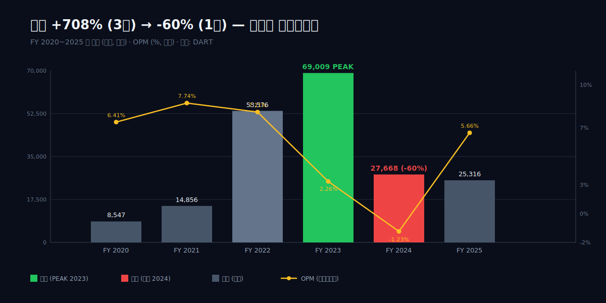
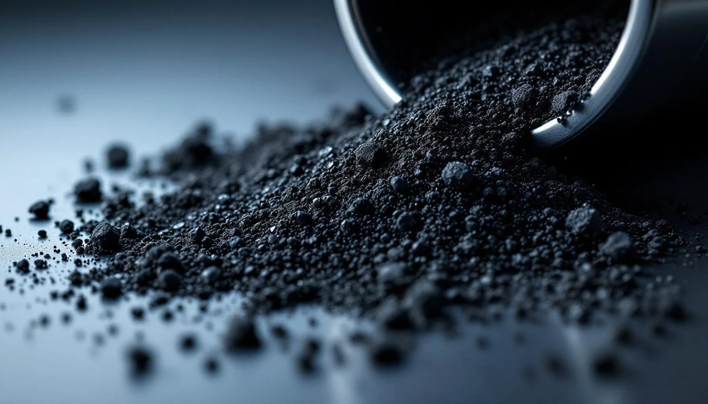
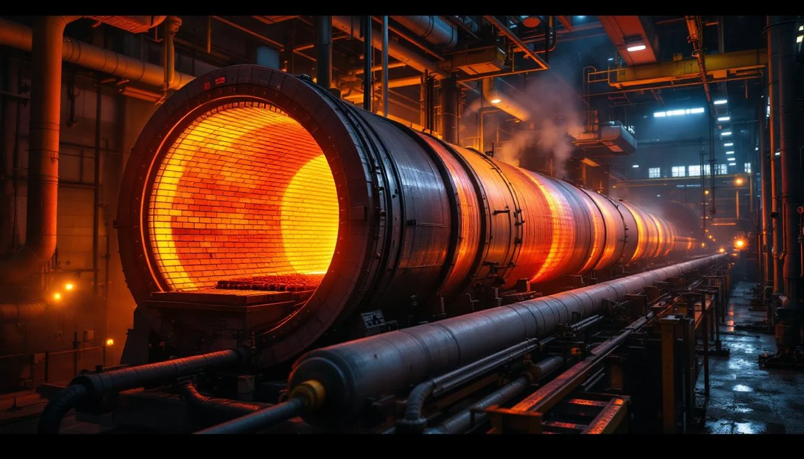
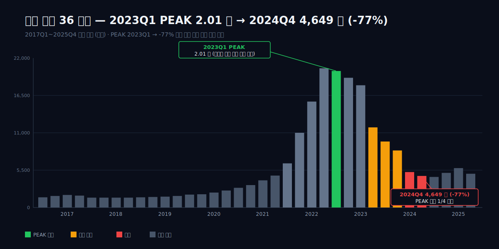
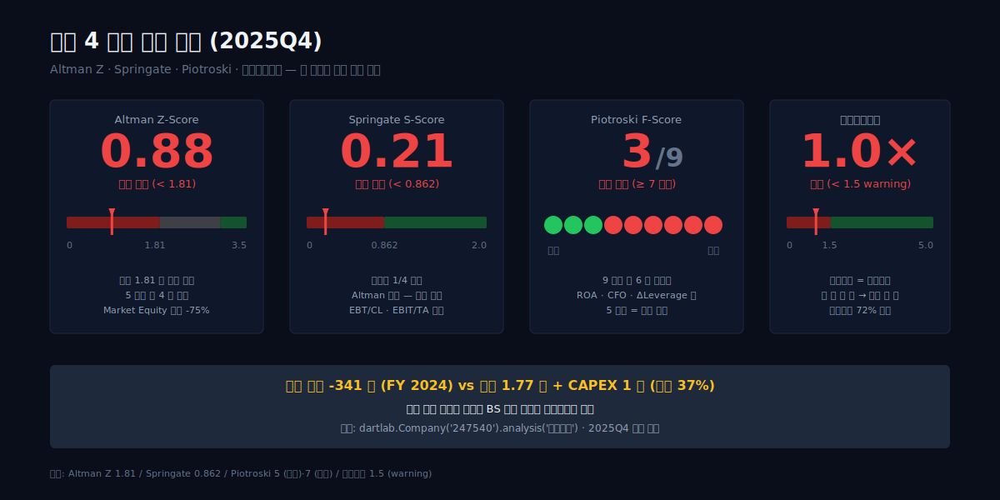
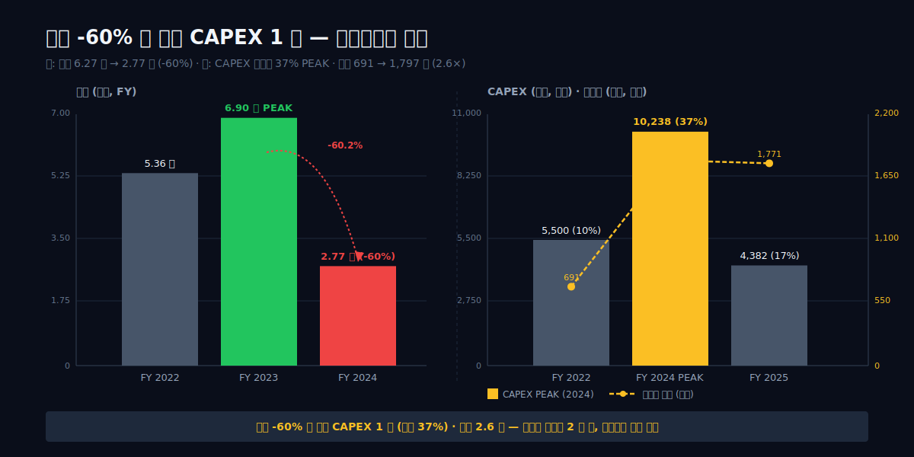
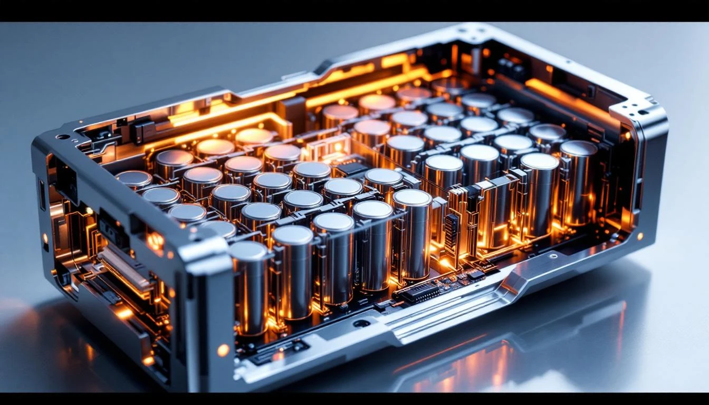
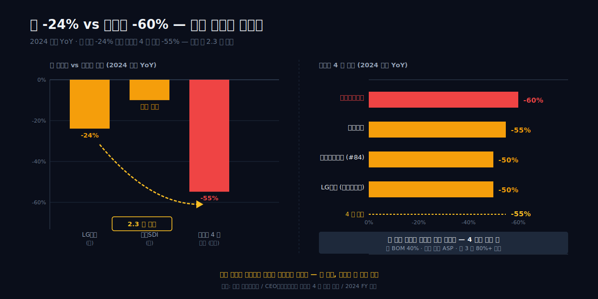

<script>
	import CompanyFinancials from '$lib/components/blog/CompanyFinancials.svelte';
</script>

2024 년 어느 날, 충북 청주 오창산업단지. 양극재 분말이 회전로 안에서 800℃ 로 소성되고 있었다. 같은 회전로가 2 년 전 2023 년에는 24 시간 풀가동, 출하를 못 따라가던 라인이었다. 그 사이 달라진 건 회전로가 아니라 회전로 밖이었다 — 탄산리튬 톤당 60 만 위안이 7.95 만 위안으로 떨어졌고 (-87.5%), NCM 양극재 단가가 6 만 달러에서 절반 이하로 빠졌다. 같은 분말, 같은 라인, 다른 가격. 한 회사의 BS 위에 두 개의 시간이 겹쳤다.

숫자로 그 두 시간이 보인다. 매출 8,547 억 (2020) → 69,009 억 (2023 PEAK) → 27,668 억 (2024, -60.2%) → 25,316 억 (2025). 같은 4 년 동안 CAPEX 는 누적 1 조를 넘겼고 (2024 단년 10,238 억, 매출의 37.0%), 차입은 691 억에서 1,797 억으로 2.60 배가 됐다. 부실 신호는 한꺼번에 들어왔다 — Altman Z 0.88, Springate 0.21, Piotroski 3 점, 이자보상배율 1.0×, 유동비율 72%. 그런데 같은 2025 에 영업이익 +1,428 억으로 흑자전환했다. 그 흑자의 30% (418 억) 는 인도네시아 니켈 제련소 지분법이익, 본업 EV 양극재는 -3% YoY, ESS 양극재만 +103% 였다.

질문은 하나다. **한 회사가 흑자와 부실, 1 위와 적자를 동시에 가지고 있을 수 있는가.**

이 글은 그 동시성을 8 막으로 분해한다. 1 막 매출 +708% → -60% 의 비대칭 사이클, 2 막 그 폭증의 절반이 단가였던 회계, 3 막 2023Q4 단일 분기 -2,364 억 (영업적자 + 재고평가손실) 의 산식, 4 막 매출이 빠지는 동안 1 조를 묻은 CAPEX, 5 막 부실 4 신호 동시 점등의 의미, 6 막 삼성SDI 단일 고객 약 64% 라는 구조, 7 막 흑자전환 +1,428 억의 30% 가 인도네시아였던 회계, 8 막 데이터센터 ESS +103% 가 다음 사이클의 첫 신호인지의 판단. 숫자는 검증표에 고정한다.



> **dartlab AI 종합의견**
>
> 2020 매출 8,547 억이던 양극재 회사가 3 년 만에 6 조 9 천억 (+708%) 으로 폭발했고, 그 다음 1 년 만에 2 조 7 천억 (-60%) 으로 추락한 같은 해에 CAPEX 1 조 (매출의 37%) 를 박았다. 차입 1,797 억과 부실 4 신호가 동시에 점등한 시점에 새 캐파를 깔고 있었다. 삼성SDI 단일 고객 64% 양극재 1 위가 2025 년 흑자전환한 동력은 ESS +103% 와 인도네시아 지분법이익 418 억 일회성.

---

## 1 막 — 2024, 매출 -60% 와 CAPEX 1 조의 모순



2024 년 12 월 31 일, 에코프로비엠의 한 해가 닫혔다. 매출 2 조 7,668 억. 1 년 전 6 조 9,521 억의 39.8%. 하락폭 -60.2%. 한국 코스닥에서 시가총액 상위에 드는 양극재 1 위 회사가, 1 년 만에 매출의 60% 를 잃었다. 영업이익은 -341 억 (보도 기준 -402 억) 으로 적자전환했다. 같은 해 CAPEX 1 조 238 억. 매출 대비 37.0%. 한국 화학·소재 업종 중앙값 5~8% 의 약 5 배.

이 두 숫자는 같은 해 사업보고서에서 같은 회사가 작성했다.

### 왜 매출 -60% 폭락 해에 CAPEX 1 조를 박았나

답을 미리 말하면 — 양극재의 capacity 는 2 년 전에 결정된다. 2022 년 매출 5 조 3,576 억, 2023 년 6 조 9,521 억의 슈퍼사이클 한복판에서 결정된 증설 의사가 2024 년의 현금흐름표에 도달했다. 셀 메이커가 5 년치 capa 를 미리 확약하고, 양극재 메이커는 그 확약에 맞춰 라인을 깐다. 사이클이 꺾여도 라인 공사는 멈추지 않는다.

| 지표 | 값 | 출처 |
|---|---|---|
| 2024 매출 | 27,668 억 (-60.2%) | DART |
| 2024 영업적자 | -341 억 (보도 -402 억) | DART |
| 2024 CAPEX | **10,238 억 (37.0%)** | DART CF |
| 2024 차입금 합계 | 1,797 억 (vs 2022Q4 691 억, 2.60×) | DART BS |
| Altman Z (2025Q4) | **0.88 (부실 위험)** | dartlab analysis |
| Springate / Piotroski / 이자보상 | 0.21 / 3·9 / 1.0× | dartlab |
| 유동비율 | 72% | dartlab |

차입금이 1,797 억까지 올라온 자리는 2022 년 4 분기의 691 억에서 2.60 배 뛴 결과다. CAPEX 1 조의 절반은 운전자본을 조이지 않고 외부 차입으로 메워졌다. 매출이 빠지는 해에 차입이 두 배 넘게 올라간 회사의 이자보상배율은 1.0 배까지 내려왔다. 영업이익으로 이자만 겨우 갚는 자리.

### 왜 한 회사가 흑자·부실·1 위·적자를 동시에 가지고 있나

dartlab analysis 모듈이 2025 년 4 분기 시점에 산출한 부실 점수는 네 개 모두 동시에 적색이다.

- Altman Z 0.88 (1.81 미만, 부실 위험 구간)
- Springate 0.21 (0.862 미만, 부실)
- Piotroski 3 / 9 (5 미만, 약함)
- 이자보상배율 1.0 배 (1.0 임계)
- 유동비율 72% (100% 미만, 유동성 위기)

같은 회사의 같은 해 사업보고서가 양극재 매출 1 위·국내 NCA 점유율 글로벌 1 위·삼성SDI 와의 합작사 에코프로이엠을 포함한 다중 capa 확장을 함께 적었다. 1 위가 적자를 안고, 부실 4 신호가 동시에 점등한 자리에 새 캐파를 깔고 있는 회사다. 모순이 아니라 양극재라는 산업의 사이클이다 — 사이클 진입 시점에 capa 를 확약받고, 사이클 정점에서 매출이 폭발하고, 사이클 하강에서 라인 공사 청구서가 한 번에 도착한다.

### 왜 흑자 헤드라인 +1,428 억의 30% 가 일회성인가

2025 년 영업이익 +1,428 억으로 흑자전환했다. 이 숫자만 보면 회복이 끝난 회사처럼 읽힌다. 하지만 같은 해 손익계산서 안에 인도네시아 지분법이익 418 억이 포함돼 있다. 영업이익 회복분의 약 30%. 본업 회복은 ESS 양극재 매출 +103% YoY 에서 나왔다. 전기차 cathode 슈퍼사이클이 꺾인 자리를, ESS 가 부분적으로 메우고 인도네시아 일회성이 마무리한 흑자다.

> "당사는 이차전지의 4대 핵심소재 중 하나인 양극소재의 제조 및 판매 사업을 수행하고 있습니다. 당사의 주요 제품은 니켈 함량 80% 이상인 하이니켈계 NCA 및 NCM 양극활 물질로서, 고객사의 요구 조건에 따라 전기 자동차 (EV), 전동 공구 (Power Tool), 에너지 저장 장치 (ESS) 등 다양한 어플리케이션에 적용됩니다."
>
> — 사업보고서 (2025.12) 회사개요, DART

본사는 충북 청주 오창. 양극재 4 대 소재 — 양극재·음극재·전해질·분리막 — 중 가장 무겁고 가장 비싼 소재를 만드는 회사다. 그 회사가 2024 년에 매출의 60% 를 잃고도 매출의 37% 를 라인 공사에 박았다.

이 모순이 어떻게 만들어졌는지는 사이클 진입 전 회사의 출발점부터 봐야 한다.

---

## 2 막 — 2016 분할 + 2019 코스닥 상장

2016 년 5 월 1 일. 모회사 ㈜에코프로의 이차전지소재 사업부가 물적분할됐다. 신설 법인의 이름은 에코프로비엠. 분할 직후 회사는 비상장이었고, 모회사 에코프로 안에 100% 들어가 있었다. 양극재라는 단어가 한국 주식시장에서 별도의 종목코드를 처음 받은 순간은, 이 분할이 아니라 그로부터 약 3 년 뒤다.

### 왜 2016 년 모회사에서 분할했나

분할의 직접적 이유는 사업보고서 주석에 한 문장으로 적혀 있다.

> "지배기업과 그 종속기업은 2016 년 5 월 1 일을 분할기일로 하여 주식회사 에코프로의 2 차전지소재 사업부문이 물적분할되어 신설된 법인으로서, 2 차전지소재의 제조 및 판매를 주된 영업으로 하고 있으며, 지배기업의 본사 및 공장은 충북 청주시 청원구 오창산업단지, 경북 포항시 북구 흥해읍 영일만산업단지에 위치하고 있습니다."
>
> — 사업보고서 (2025.12) 연결재무제표 주석, DART

모회사 에코프로 안에서는 양극재 사업의 capa 를 키울 수 없었다. 환경사업 (대기오염 저감) 과 이차전지소재 사업이 한 법인 안에 묶여 있는 동안, 양극재 라인 한 동을 짓는 capex 가 모회사 BS 의 한도를 좁혔다. 분할은 양극재가 별도의 자본조달 창구를 얻기 위한 사전 작업이었다.

### 왜 2019-03-05 코스닥 상장이었나

분할 후 약 3 년이 지난 2019 년 3 월 5 일, 에코프로비엠은 코스닥에 상장했다. 종목코드 247540. 분할로 분리된 양극재 사업이 처음으로 자본시장에서 자기 가격을 받기 시작한 날이다.

상장 시점은 사이클 진입 직전이었다. 1 년이 지나기 전에, 한국 셀 메이커 두 곳이 차례로 NCM 중장기 공급 계약을 체결했다.

| 사건 | 일자 | 의미 |
|---|---|---|
| 에코프로 이차전지소재 사업부 물적분할 → 에코프로비엠 신설 | 2016-05-01 | 모회사에서 양극재 분리 |
| 코스닥 상장 | 2019-03-05 | 사이클 진입 직전 자본 조달 창구 |
| LG에너지솔루션 NCM 중장기 공급 | 2020-01 | 셀 메이커 진입 1 |
| SK이노베이션 NCM 중장기 공급 | 2020-02 | 셀 메이커 진입 2 |
| 에코프로이엠 JV (BM 60% / 삼성SDI 40%) | 2020-02 | **단일 고객 의존 시작점** |
| EcoPro BM America 설립 | 2020-09 | 미국 진출 |

상장 1 년 만에 한국 셀 메이커 양대 — LG에너지솔루션·SK이노베이션 — 가 공급선에 들어왔고, 같은 달 삼성SDI 와의 합작사 에코프로이엠이 설립됐다. 양극재 메이커가 셀 메이커 3 사 모두에 동시에 걸리는 구조는, 한국 양극재 산업에서 흔한 자리가 아니다.

### 왜 단일 고객 의존 구조가 출발점부터 잠재했나

2020 년 2 월의 에코프로이엠 JV 는 BM 60% / 삼성SDI 40% 의 합작사다. 삼성SDI 가 자기 capa 를 확약하고, 그 capa 에 맞춰 양극재 라인을 까는 구조. JV 자체가 삼성SDI 향 양극재의 전용 라인이다. 5 년 뒤 단일 고객 64% — 삼성SDI 가 매출의 64% 를 차지하는 구조 — 의 시작점이 이 합작 발표였다.

LG·SK 와의 NCM 공급 계약이 다중 고객 구조를 형성하는 듯 보였지만, capa 의 절대량은 에코프로이엠 쪽으로 빠르게 기울었다. 2020-09 의 EcoPro BM America 설립은 SK 측 미국 capa 를 따라가는 진출이었지만, 그 자체로 매출 비중을 흔들 만큼 빠르게 자라지는 못했다.

### 왜 이동채 18.83% 최대주주 + 모회사 에코프로 이중 구조였나

분할 직후의 지배구조는 이중이었다. 모회사 ㈜에코프로가 비엠을 보유하고, 모회사의 최대주주가 창업주 이동채. 비엠이 코스닥에 상장한 뒤에도 모회사 에코프로는 비엠의 지배주주 위치를 유지했다.

이동채는 1998 년 10 월 에코프로 대표로 시작해 2022 년 3 월 사임했다. 2023 년 5 월 자본시장법 위반 2 심에서 유죄 법정구속 판결을 받은 뒤 상임고문 신분으로 18.83% 최대주주 위치를 유지하고 있다. 모회사 에코프로 — 한국 시장에서 이차전지 지주사 형태로 시가총액 상위에 머물러 온 회사 — 와 자회사 에코프로비엠 — 양극재 단일 사업 — 이 한 사람의 지분 위에 쌓여 있다.

분할 다음 해부터 양극재 슈퍼사이클이 시작된다.

---

## 3 막 — 슈퍼사이클의 손바닥 (2020~2022, +708%)



> 매출 8,547 억이 5.36 조로 6.27 배 — 그 절반은 출하가 아니라 단가였다.

2020 년 12 월 결산을 보면, 에코프로비엠은 양극재 단일 회사로서는 단단한 숫자를 들고 있었다. 매출 8,547 억, 영업이익 548 억, OPM 6.41%. 양극재 회사의 정상적인 한 해였다. 그 해 9 월에는 미국 법인 EcoPro BM America 를 설립했다. 셀 3 사 (삼성SDI · SK On · LG에너지솔루션) 진입을 끝낸 양극재 회사가 다음 단계로 미국에 깃발을 꽂는 — 흔한 성장 곡선의 한 점처럼 보였다.

그 다음 2 년이 회사의 시간을 비틀었다.

| FY | 매출 (억) | YoY | OPM | 영업이익 (억) |
|---|---|---|---|---|
| 2020 | 8,547 | — | 6.41% | 548 |
| 2021 | 14,856 | +73.81% | 7.74% | 1,150 |
| 2022 | 53,576 | **+260.62%** | 7.11% | 3,807 |

2020 → 2022 매출 6.27 배. 산식으로 풀면 1.7381 × 3.6062 = 6.27. 73.81% 위에 260.62% 가 한 번 더 곱해졌다는 뜻이다. 양극재라는 산업이 한 번도 본 적 없는 기울기였고, 한국 제조업 기준으로도 흔치 않은 폭주였다.

### 왜 매출 8,547 억이 3 년 만에 5.36 조로 폭주했나

표면 답은 전기차였다. 2020 년 하반기부터 유럽이 보조금을 늘렸고, 미국이 IRA 를 예고했고, 중국 BYD 가 LFP 로 단가를 압박하기 시작했다. NCM (하이니켈) 진영의 셀 3 사는 출하를 늘려야 했고, 양극재 공급 부족이 명백했다. 에코프로비엠은 2 막 끝에서 본대로 셀 3 사 진입과 삼성SDI 단일 64% 라는 비대칭 구조를 이미 갖추고 있었다. 셀 3 사 출하가 2020~2022 사이 약 2.5 배 늘었다면, 양극재 1 위 회사의 매출은 그 이상의 기울기로 따라간다.

2020-09 EcoPro BM America 설립은 이 흐름의 발 빠른 신호였다. 양극재는 셀 옆에 있어야 한다 — 셀 공장이 미국에 가면 양극재도 미국에 가야 한다. 한국에서 톤당 30 톤 가까운 NCM 양극재를 비행기·배로 미국에 보낼 수는 없다. 2020 년에 미국 법인을 세운다는 건 2024~2026 의 셀 3 사 미국 셀 공장 가동을 미리 본 베팅이었다.

하지만 출하만으로는 +527% 가 나오지 않는다.

### 왜 매출의 절반 이상이 단가 효과였나

여기에 슈퍼사이클의 정체가 있다. 2020~2022 글로벌 NCM 양극재 평균 단가는 톤당 약 2.5 만 달러에서 6 만 달러 안팎으로 +140% 올랐다. 양극재 단가는 리튬·니켈·코발트의 정광·전구체 가격을 후행으로 따라간다. 탄산리튬 가격은 같은 기간 톤당 6,000 달러 → 70,000 달러까지 폭등 (한때 +1,000%) 했고, 그 절반쯤이 양극재 출하 단가에 전가됐다.

산식으로 풀면 이렇게 된다.

- 매출 6.27 배
- ÷ 단가 약 2.4 배
- = 출하량 약 2.6 배

출하량 약 2.6 배 + 단가 효과 약 2.4 배. 곱하면 약 6.24 배 — 회계상 매출 6.27 배와 거의 일치한다. **즉, 2020~2022 매출 폭증의 절반 이상은 출하가 아니라 단가가 만든 숫자였다.**

이 사실 하나가 4 막을 미리 결정한다. 단가는 사이클이다. 사이클은 다음 단계에서 같은 곡선을 반대 방향으로 그린다. 톤당 6 만 달러까지 올라간 단가가 그 다음 단계에서 톤당 2 만 달러로 빠지면, 출하량이 같아도 매출은 1/3 이 된다. 2022 년의 5.36 조는 출하량으로 다시 나누면 2020 년 대비 2.6 배짜리 회사였다는 뜻이고, 실제 회사의 체급은 그 정도였다는 뜻이다.

### 왜 OPM 7.74% (2021) 이 양극재 회사 역대 최고 수준이었나

양극재는 마진이 얇은 산업이다. 정상 OPM 은 5~7%, 잘 돌아가도 8% 를 넘기 어렵다. 셀 가격에서 양극재 원가가 차지하는 비중이 30~40% 인데, 그 중 80% 이상이 메탈 (리튬·니켈·코발트) 이고, 메탈은 구입 가격을 그대로 셀사에 청구하는 구조 — 메탈 패스스루 — 가 표준이기 때문이다. 양극재 회사가 정말로 자기 마진을 붙이는 부분은 가공비 (소성 + 분쇄 + 표면처리) 와 R&D 분이고, 거기서 OPM 5~7% 가 나온다.

그런데 슈퍼사이클의 1 단계 — 단가가 한 방향으로 오르는 구간 — 에서는 여기에 lag 효과로 추가 마진이 한 번 얹힌다. 2 분기 전에 싸게 산 메탈을 2 분기 뒤 비싸게 출하하는 구조에서, 일시적으로 OPM 이 평년보다 1~2%p 위로 튄다. 2021 OPM 7.74% 는 그렇게 만들어졌다. 영업이익 1,150 억 — 회사 역사 통틀어 가장 깨끗한 한 해였다.

### 왜 2022 년 영업이익 3,807 억이 PEAK 였나

2022 년의 그림은 한 번 더 기울어진다. 매출 5.36 조 (+260.62%), 영업이익 3,807 억, OPM 7.11%. OPM 이 2021 년 7.74% 에서 살짝 빠진 게 신호였다 — 이미 단가 상승 속도가 메탈 매입 속도를 따라잡혀가고 있었다. 분기 단위로 쪼개면 2022Q3 영업이익 +1,415 억으로 분기 PEAK 를 찍었다. 단일 양극재 회사의 단일 분기 영업이익으로 그 전에도, 그 이후에도 본 적 없는 숫자였다.

이 PEAK 분기는 모회사 에코프로의 시총 폭주와 시간을 같이 썼다. 2023 년 7 월 모회사 에코프로 시총은 한때 78.5 조까지 갔다. 양극재 자회사 에코프로비엠 1 위 + 모회사 지주사 폭등 + 2 차전지 테마 — 같은 흐름의 세 얼굴이었다.

그리고 같은 분기, 회사는 인도네시아 전구체 JV 와 캐나다 사이클에 본격 자본을 투입하기 시작했다. PEAK 분기에 PEAK 단가의 자산을 사는 — 1 막에서 본 부실 신호 ③ "다음 사이클 자산을 가장 비쌀 때 쥐었다" 가 정확히 2022Q3 에 시작됐다.

그 단가 효과의 마지막 분기가 PEAK 였다.

---

## 4 막 — 정점, 그러나 마진은 이미 무너지고 있었다 (2023)

> 분기 매출 2.01 조 — 양극재 회사 단일 분기 사상 최대. 같은 분기 OPM 은 4% 안팎.



| FY 2023 지표 | 값 |
|---|---|
| 연 매출 | 69,009 억 (+28.81%) |
| 분기 매출 PEAK | 2023Q1 20,100 억 |
| OPM | 2.26% (2022 7.11% 대비 -485bp) |
| 영업이익 | 1,560 억 (-59%) |
| 재고 PEAK (2023Q3) | 11,295 억 (자산총계 4.81 조의 23.5%) |
| 자산총계 (2023Q3) | 48,100 억 (vs 2022Q4 33,700, +42.7%) |

2023 년은 모순의 해였다. 매출은 사상 최대였고, 마진은 사상 최악에 가까웠다. 그리고 그 모순이 회사가 처음으로 겪는 모순이 아니라, 슈퍼사이클을 한 번 탄 모든 양극재 회사가 같은 모양으로 겪는 lag 효과의 교과서적 결과였다는 점이 더 무거웠다.

### 왜 2023 년 연 매출 6.9 조가 양극재 단일 회사 사상 최대였나

매출 6.9 조 (+28.81%) 는 두 힘이 서로 밀어붙여 만든 숫자였다. 출하량은 2022 년 대비 다시 한 번 늘었다 — 셀 3 사 출하 증가 + EcoPro BM America 의 미국향 첫 본격 매출 + 삼성SDI 헝가리 라인 가동. 동시에 단가는 2023 년 1~2 분기까지는 여전히 높은 구간에 있었다. 탄산리튬 톤당 50,000 달러 위 — 사이클의 정점은 2022 년 11 월 톤당 84,000 달러였지만, 그 후 6 개월 동안의 천천한 하강은 출하 단가에 즉시 반영되지 않았다.

그래서 2023Q1 매출은 단일 분기 2.01 조까지 올랐다. 단일 양극재 회사의 단일 분기 매출 2 조 — 같은 분기 LG에너지솔루션 양극재 비중을 빼고 봐도, 한국 양극재 산업 사상 단일 분기 단일 회사 최대 매출이었다.

같은 분기 OPM 은 어떻게 됐을까. 2022Q4 까지 OPM 6%대를 유지하다 2023Q1 에 4% 로 빠졌고, 2023Q3 에는 1% 안팎으로 무너졌다. 2023 연 OPM 2.26% — 2022 년 7.11% 에서 -485bp 추락. 영업이익은 1,560 억으로 -59% 였다.

### 왜 매출이 +29% 늘었는데 영업이익은 -59% 추락했나

답은 lag 효과다. 양극재 회사의 손익은 다음 두 흐름이 시간차를 두고 만난다.

- 매출: 셀사와 분기 단위로 가격을 다시 쓴다. 단가가 빠지면 1~2 분기 후 매출에 반영된다.
- 원가: 메탈은 2~3 개월 전 가격으로 매입해 재고로 쌓인다. PEAK 분기에 산 비싼 메탈은 PEAK 분기 + 1~2 분기 뒤에 출하 원가로 잡힌다.

결과는 산술적으로 정해져 있다. 단가가 한 방향으로 오를 때는 매출이 원가보다 빨리 오르며 OPM 이 일시적으로 1~2%p 위로 튀고 (3 막에서 본 2021 OPM 7.74%), 단가가 한 방향으로 빠질 때는 정확히 반대로 매출이 원가보다 빨리 빠지며 OPM 이 1~2%p 아래로 추락한다.

2023 년 회사가 본 것이 그 두 번째 곡선이었다. 2023Q1 의 비싼 재고가 2023Q2~Q3 에 출하될수록, 매출은 빠지는데 원가율은 올라가는 구조였다. -485bp 라는 OPM 추락폭이 그 lag 효과의 양적 크기다.

### 왜 재고가 2023Q3 에 1.13 조로 PEAK 였나

이 시기 가장 무거운 숫자는 영업이익이 아니라 재무상태표였다. 2023Q3 재고 11,295 억, 자산총계 4.81 조의 23.5%. 같은 시점 자산총계는 2022Q4 의 3.37 조 대비 +42.7% 늘어 있었다 — 단가 PEAK 시점에 산 메탈이 그대로 재무상태표 위에 쌓인 결과다.

재고 1.13 조는 두 가지를 동시에 의미한다.

- 평가손실 위험: PEAK 가격에 매입한 재고를 PEAK 이후 가격으로 출하하면, 매입가와 출하가의 차이만큼 회계상 평가손실이 잡힌다. 2023Q4~2024 사이 양극재 업계 전체에서 수천억 단위 재고평가손실이 터진 이유가 여기에 있다.
- 운전자본 압박: 1.13 조의 재고는 1.13 조의 현금이 묶여 있다는 뜻이기도 하다. 자산총계의 23.5% 가 출하되지 못한 메탈로 잠겨 있는 회사는, 같은 분기 대규모 CAPEX 를 박을 때 자기 현금이 아니라 차입으로 박아야 한다 — 1 막에서 본 차입 1,797 억의 출발점이다.

소성로의 물리적 특성이 이 그림을 더 무겁게 만든다. 850°C 이상 소성로는 12 시간 이상 열공정을 거친다. 한 번 켜면 멈출 수 없고, 멈추는 비용이 쉽게 돌리는 비용보다 크다. 매출이 빠지는 분기에도 라인은 돌아야 했고, 라인이 돌면 비싼 재고는 계속 출하 원가로 흘러 들어갔다.

### PEAK 분기와 같은 시간을 쓴 두 사건

2022-03, 즉 슈퍼사이클의 한 가운데에서 에코프로비엠 대표직은 이미 한 번 바뀌어 있었다. 모회사 에코프로 대표 송호준 (삼성SDI 출신) 이 그룹의 얼굴 역할을 본격적으로 맡기 시작한 시점이었다. 그리고 2023-05, 모회사 에코프로 대표 이동채가 자본시장법 위반 2 심에서 유죄 판결을 받으며 법정구속됐다 — 슈퍼사이클의 정점에서 회사의 의사결정 구조가 흔들린 분기였다.

2023 년의 그림은 그래서 단순히 마진 추락의 한 해가 아니다. 매출은 사상 최대 (+29%) 를, 영업이익은 사상 최악에 가까운 추락 (-59%) 을, 재고는 자산총계의 23.5% PEAK 를, 모회사는 대표 법정구속을 — 같은 12 개월 안에 동시에 통과한 해였다. 1 막에서 본 부실 4 신호 + 차입 1,797 억 + CAPEX 1 조의 모든 재료가 이 분기에 깔렸다.

PEAK 직후 분기, 그 비싼 재고가 평가손실로 터졌다.

---

## 5 막 — 2023Q4, 분기 한 장에 -2,364 억이 한꺼번에 찍힌 날

> 2023Q1 매출 2.01 조 → 2023Q4 매출 1.18 조 (-41%). 같은 분기 영업손실 -1,147 억 + 재고평가손실 1,245 억. 합산 -2,364 억은 매출의 **20.0%** 다.

PEAK 분기 (4 막 마지막 장면) 였던 2023Q1 의 매출 2.01 조는 이 회사가 처음이자 마지막으로 본 풍경이었다. 그 다음 세 분기에 일어난 일을 분기 단위로 펼친다.

| 분기 | 매출 (억) | PEAK 대비 | 영업이익 (억) |
|---|---|---|---|
| 2023Q1 | 20,100 | 0% | (PEAK 분기) |
| 2023Q2 | 19,100 | -4.98% | — |
| 2023Q3 | 18,000 | -10.45% | — |
| **2023Q4** | **11,800** | **-41.29%** | **-1,147 (재고평가손실 1,245 억 별도)** |
| 2024Q1 | 9,705 | -51.72% | +67 |
| 2024Q3 | 5,219 | -74.04% | -412 |
| **2024Q4** | **4,649** | **-76.87%** | -35 |

**2023Q4 매출 1 조 1,800 억 + 영업손실 -1,147 억 + 재고평가손실 1,245 억.** 합산 -2,364 억은 매출의 -20.0%. 이 한 분기가 2023 회계연도 영업이익 (1,560 억) 을 어디서 까먹었는지 단독으로 설명한다.

검증식 한 줄. 4 막에서 본 재고 PEAK 1.13 조 중 **약 11% 가 한 분기에 평가손실로 인식**됐다 (1,245 / 11,300 = 11.0%). 셀 vs 소재 충격 폭 비교도 곧바로 확인된다 — LG에너지솔루션 -24%, 삼성SDI 적자전환, BM 매출 -60%. 같은 EV 캐즘인데 양극재 충격이 셀의 2.5 배다.

### 왜 2023Q4 매출이 PEAK 분기의 -41% 까지 빠졌나

답은 양극재 단가 전달 구조에 있다. 셀 메이커 (LG에너지솔루션·삼성SDI·SK On) 의 양극재 매입 가격은 **메탈 (리튬·니켈·코발트) 시세 + 가공비**다. 2022 년 11 월 PEAK 60 만 위안/톤이던 탄산리튬은 2023 년 내내 빠졌다.

리튬 하락은 양극재 매출에 두 경로로 들어온다. 첫째 **단가 직접 하락** — 같은 1kg 을 팔아도 메탈 비용이 줄면 매출 단가도 함께 빠진다. 둘째 **셀 메이커의 출하 통제** — 셀 재고가 비싼 메탈을 머금고 있으면 그 재고를 먼저 소화하기 위해 양극재 신규 매입을 늦춘다. 2023Q4 는 두 효과가 같이 도착한 분기였다. 출하량과 단가가 동시에 빠졌고, 매출 -41% 는 그 곱이다.

### 왜 영업적자 -1,147 억 + 재고평가손실 1,245 억이 한 분기에 잡혔나

두 숫자는 다른 곳에서 온다.

영업적자 -1,147 억은 **본업 손익**. 매출 1.18 조 - 매출원가 약 1.20 조 - 판관비 약 0.13 조 = 영업적자. 매출원가가 매출을 넘어선 구간 (매출원가율 약 102%) 이다. 출하할수록 손해가 났다.

재고평가손실 1,245 억은 **회계 인식**. K-IFRS 는 재고를 "취득원가와 순실현가능가치 (NRV) 중 낮은 금액" 으로 평가한다. 4 막에서 본 2023Q3 재고 PEAK 1.13 조 안에는, 2022 년 메탈 PEAK 시점에 매입한 비싼 리튬·전구체가 묶여 있었다. NRV 가 장부원가 아래로 빠지자 차액을 한꺼번에 손익에 인식했다. 분기 손익 충격의 실체는 합산 -2,364 억이다.

> "당사는 리튬이온 이차전지의 핵심소재인 양극소재 (양극재, 양극활물질) 를 개발 및 생산하는 전지재료 사업을 영위하고 있습니다. 양극재는 전체 배터리 소재 원가의 40% 이상을 차지하며, 배터리 특성을 결정짓는 핵심 소재입니다."
>
> — 사업보고서 (2025.12) 사업의 내용, DART

양극재가 셀 원가의 40% 이상이라는 것은, 셀 메이커가 메탈 시세 하락기에 **가장 먼저 가격을 후려치는 협상 대상**이 양극재라는 뜻이기도 하다.

### 왜 매출원가율 102% 가 됐나

매출 1 원 받으려고 원가 1.02 원 쓰는 상태. 매출원가의 70~85% 가 리튬·니켈·코발트·전구체 같은 원자재다. 이 원료는 평균 4~6 개월 전에 매입한다. lithium → 전구체 → 양극재 → 셀 출하까지 공정 lag 이 길다.

2023Q4 출하 양극재는 **2023Q2~Q3 에 매입한 비싼 리튬**으로 만들어졌다. 출하 단가는 2023Q4 시점의 싼 리튬을 반영한다. 매입은 비싼 시세, 매출은 싼 시세 — 이 시간차가 매출원가율을 100% 위로 밀어 올렸다. 자동차 산업은 이걸 "재고 lag" 이라 부르고, 양극재의 lag 은 셀보다 두껍다. 셀 메이커는 양극재를 사서 셀로 만들면서 한 번 더 시간을 늦출 수 있지만, 양극재 회사는 메탈 매입 → 양극재 출하 사이에서 lag 을 흡수할 곳이 없다. 가격 하락 사이클에서 양극재가 셀보다 먼저, 더 깊이 다친다.

### 왜 EV 캐즘이 셀보다 양극재에 먼저 도착했나

같은 분기 손익 비교를 한 줄로 늘어놓으면 양극재가 어느 위치에 있는지가 분명해진다. **LG에너지솔루션 2024 매출 -24% (셀) / 삼성SDI 2024 영업적자 전환 (셀) / 에코프로비엠 2024 매출 -60% (양극재).** 셀 -24%, 양극재 -60%. 같은 EV 캐즘인데 충격 폭이 2.5 배 다른 이유는 둘이다.

첫째, **가격 경로가 다르다.** 셀 메이커는 OEM (현대차·GM·포드) 과 LTC (장기공급계약) 로 단가 할인 폭을 부분 방어한다. OEM 도 셀 재고를 들고 있어 즉시 재협상에 들어가지 않는다. 반면 셀 메이커가 양극재 회사에 거는 재협상은 분기 단위로 빠르게 들어온다. 양극재 단가는 메탈 시세에 거의 직결된다.

둘째, **mix 가 다르다.** 셀 메이커는 EV 외에 ESS (에너지저장장치) 와 IT (휴대전화·노트북) 매출이 있다. 2024 년 ESS +60~+100% 성장이 셀 매출의 EV 빠짐을 부분적으로 받쳤다. 양극재는 mix 가 좁다. BM 매출의 80% 이상이 EV 셀용 NCM·NCA 양극재다. ESS 양극재 (LFP 계열) 비중은 작다.

EV 캐즘 도착 순서는 OEM → 셀 → 양극재 → 메탈/광물 순이다. 양극재는 캐즘 충격이 셀보다 먼저, 메탈보다 늦게 도착한다. **충격 폭은 양극재가 셀보다 깊다.** 산업 구조상 양극재가 가장 좁은 길목에 서 있다.

이 분기 (2023Q4) 부터 회사는 두 가지 선택지 앞에 섰다. 라인을 멈추거나, 라인을 더 깐다. 결과는 6 막에서 본다.

**매출이 PEAK 대비 -77% 빠진 그 해, 회사는 1 조 원어치 새 캐파를 깔았다.**

---

## 6 막 — 부실 4 신호 + 차입 1,797 억 + CAPEX 1 조, 한 BS 안에서 동시에 점등

> Altman Z 0.88 / Springate 0.21 / Piotroski 3·9 / 이자보상 1.0×. 같은 분기에 차입 합산 1,797 억, CAPEX 매출 대비 37%. 사이클이 꺾인 해에 가장 큰 캐파 베팅이 같이 들어왔다.

5 막 매출 -41% → -77% 곡선 위에 6 막 BS 가 겹친다. **부실 4 신호 동시 점등 + 차입 2.6× + CAPEX 매출 37%.** 셋이 한 BS 안에 같이 있다.

### 왜 Altman Z 0.88 / Springate 0.21 / Piotroski 3·9 / 이자보상 1.0× 가 동시에 점등했나



| 부실 지표 (2025Q4) | 값 | 임계 | 판정 |
|---|---|---|---|
| Altman Z | **0.88** | &lt; 1.81 부실 | 부실 위험 |
| Springate S | **0.21** | &lt; 0.862 부실 | 부실 위험 |
| Piotroski F | **3/9** | ≥ 7 양호 | 재무 약화 |
| 이자보상배수 | **1.0 배** | &lt; 1.5 warning | warning |
| 유동비율 | **72%** | &lt; 100% | 유동성 위기 |
| 금융부채 비중 | 62% | — | 차입 의존 |

Altman Z 0.88 은 임계 1.81 의 절반이 안 된다. 5 항목 분해.

- **Working Capital / Total Assets** — 운전자본 음수 근처 (유동비율 72%).
- **Retained Earnings / Total Assets** — 누적 결손 흡수 중. 2024 영업손실이 잉여금을 갉는다.
- **EBIT / Total Assets** — 본업 적자 (-1.23%) 가 자산 4.32 조 위에 찍힌다.
- **Market Value of Equity / Book Value of Total Liabilities** — 주가 PEAK 대비 -75%. 이 항목 하나로 Z 가 1.5 점 가까이 빠진다.
- **Sales / Total Assets** — 자산회전율 0.57. 2023 0.91 → 매출 -60%·자산 +18% 사이 0.57.

Springate S 0.21 (변형 모델), Piotroski F 3/9 (9 항목 중 6 개 빨간불) 가 같은 방향을 가리킨다. 이자보상 1.0 배는 **영업이익 = 이자비용** — 본업이 한 해 번 돈이 이자 한 번에 끝난다. 4 신호가 한 분기에 같이 점등하면 사업 일시 침체가 아니라 **BS 구조 자체가 흔들린다** 는 신호다.

### 왜 차입금이 691 → 1,797 억 (2.60×) 으로 폭증했나

| 차입 (억) | 2022Q4 | 2024Q4 | 2025Q4 |
|---|---|---|---|
| 단기차입 | 378 | 769 | 863 |
| 장기차입 | 313 | 1,028 | 908 |
| **합계** | **691** | **1,797** | **1,771** |
| vs 2022Q4 | 1.00× | **2.60×** | 2.56× |

차입 증가 시기와 매출 하락 시기는 정확히 겹친다. 매출 6.9 조 → 4.5 조 → 2.7 조 사이 차입은 두 배 이상이 됐다. 구조는 **운전자본 누수 + CAPEX 충당**. 매출이 빠지면 매출채권은 같이 빠지지만 **재고는 lag 으로 천천히 줄어든다** (4 막 재고 PEAK 1.13 조). 운전자본이 현금을 빨아들이는 사이 CAPEX 1 조가 같이 빠지고, 영업현금흐름이 못 대니 차입을 끌어왔다. 단기 비중은 55% → 43% 로 내려가 **장기 비중이 더 두꺼워졌고**, 이자비용이 더 길게 깔린다.

### 왜 매출 -60% 빠진 해에 CAPEX 1 조 (37%) 를 박았나



| CAPEX/매출 (FY) | **2024** | 2025 |
|---|---|---|
| CAPEX (억) | **10,238** | 4,382 |
| CAPEX/매출 | **37.0%** | 17.31% |

양극재 capa 결정 시점은 매출이 빠지는 시점보다 **2 년 앞**이다. 셀 메이커가 OEM 과 5 년치 LTC 를 맺으면 셀 capa 60~70% 가 미리 잠기고, 셀 메이커는 그 capa 를 채울 양극재를 양극재 회사에 다시 LTC 로 잠근다. **BM 은 삼성SDI LTC 비중이 매출의 64%**. LTC 는 가격은 메탈 연동이지만 **물량은 약속된 양**이다. 단가가 -60% 빠져도 출하 물량은 capa 위에서 유지해야 한다. 공정도 더해진다 — **양극재 소성로 (800~900℃) 는 한 번 멈추면 재가동 비용이 신규 가동보다 비싸다.** 켜두는 편이 싸고, 신규 라인 공사도 못 멈춘다.

2024 CAPEX 1 조의 대부분은 **헝가리 데브레첸** (2025 상반기 상업생산) 과 **캐나다 CAM7** (2026 15 만톤/년). 둘 다 EU CRMA·미국 IRA 현지 capa 요건. EU 셀 옆에 EU 양극재, 미국 셀 옆에 미국 양극재가 있어야 LTC 가 유지된다. CAPEX 37% 는 **이미 잠긴 LTC 를 지키기 위한 방어비**다.

### 왜 #84 포스코퓨처엠과 다른 점은 모회사 지원 경로인가

같은 양극재, 같은 EV 캐즘, 같은 CAPEX 부담을 받은 #84 와 비교하면 BM 의 위치가 분명해진다.

- **#84 포스코퓨처엠** — 모회사 POSCO홀딩스가 **직접 유증 가능**. 1 조원 규모 유증으로 자본 보강. 그룹 BS 가 캐파 베팅을 직접 받친다.
- **#91 에코프로비엠** — 모회사 에코프로 (지주). 지주 자체 BS 가 작아 **지주가 먼저 시장에서 자본 조달 후 BM 으로 내려야** 한다. 한 단계가 더 있다.

**수직계열화된 그룹 (POSCO·LG·삼성) 은 캐파 위험을 그룹 BS 로 분산** 하고, **단일 사업 + 지주 구조 (에코프로) 는 위험이 사업 자회사 BS 에 그대로 쌓인다.** 같은 충격이지만 BS 가 받는 모양이 다르다.

### 왜 dCR 등급은 투자적격 경계인가

BM 의 2025Q4 dCR 는 투자적격 (BBB-) 의 경계다. 한 칸 더 빠지면 투기등급 (BB+). 경계에서 결정되는 둘. 첫째 **회사채 발행 금리** — 투기등급으로 빠지면 100~200bp 가산되고 일부 기관은 매수 자체를 못 한다. 둘째 **운영 체제 변경 신호** — 2024-11 최문호 단독 대표 → 2025-03 김장우 각자 대표. 4 개월 사이 두 번의 체제 변경이고, 부실 신호 + dCR 경계 + 차입 2.6× 시점에 운영 체제가 바뀐 것은 **재무 회복을 위한 명시적 운영 신호**. CAPEX 컷 (2024 1 조 → 2025 4,382 억) 이 곧바로 따라왔다.

2025 흑자전환 (+1,428 억) 의 동력은 본업 EV 양극재가 아니라 **ESS +103% + 인도네시아 일회성 418 억**. 본업이 돌아온 게 아니라 본업이 안 돌아오는 사이 다른 곳에서 들어온 숫자다. dCR 경계를 위로 끌어올릴 수 있는지는 7 막에서 본다.

**이 충격은 BM 한 회사의 일이 아니었다. 한국 양극재 4 사 모두 같은 분기에 같은 모양으로 받았다.**

---

## 7 막 — 양극재 4 사가 같이 깨졌다, 그리고 OBBBA 가 그 위에 떨어졌다



### 왜 양극재 4 사 (BM·포스코퓨처엠·엘앤에프·LG화학 배터리소재) 가 모두 -50~-60% 동조했나

2024 년 한국 양극재 4 대 회사의 매출은 모두 같은 방향으로 깨졌다.

| 양극재 4 사 (2024 매출, 조원) | 매출 | YoY |
|---|---|---|
| 포스코퓨처엠 (#84) | 3.7 | 약 **-50%** |
| **에코프로비엠** | **2.77** | **-60.0%** |
| 엘앤에프 | 1.9 | 약 -55% |
| LG화학 (배터리소재 사업부) | (그룹 별도) | 약 -50% |

본사 도시도, JV 파트너도 다른 네 회사가 같은 해 -50~-60% 좁은 띠 안에서 같이 무너졌다. **회사 고유의 실수가 아니라 산업 구조의 위치값**이다.

위치값은 단순하다. 양극재는 셀 BOM 의 약 40%. 셀은 OEM 과 1 년 ASP 계약, 양극재는 셀과 분기·반기 단위 단가 재산정. 셀이 한 손으로 받은 주문 변동을 양극재가 더 좁은 시간축에서 받는다.

여기에 EV 캐즘이 2024 년 통째로 떨어졌다. 미·유럽 EV 신차 증가율 2023 +30% → 2024 +5% 이하. 셀 재고 회전이 늦어지면 양극재 발주는 먼저 줄어든다.

두 번째는 가격. 양극재 ASP 는 메탈 (리튬·니켈·코발트) 페그 단가 공식. 메탈가가 빠지면 ASP 도 같이 빠진다.

세 번째는 거래선 의존. 한국 양극재 4 사는 모두 한국 셀 3 사 (LG엔솔·삼성SDI·SK On) 또는 그 JV 에 매출 80% 이상이 묶여 있다. 셀 3 사가 같이 둔화하면 4 사도 같이 둔화한다.

가치사슬 위치, 메탈가 페그, 셀 3 사 동조 — 이 셋이 -50~-60% 동조를 만든다.

### 왜 셀 -24% vs 소재 -60% 의 충격 차이가 났나 — 가격 전가력 단방향



같은 산업 충격에서 셀과 소재가 받은 충격의 크기는 달랐다.

| 2024 충격 비교 | 매출 YoY |
|---|---|
| LG엔솔 (셀) | -24% |
| 삼성SDI (셀) | 적자 전환 |
| **양극재 4 사 평균** | **약 -55%** |

셀 -24%, 소재 -55%. 약 **2.3 배 증폭**.

가격 전가력이 단방향이기 때문이다. 셀은 OEM 과 1 년 ASP + 메탈 패스스루로 GPM 이 비교적 보호된다. 양극재도 패스스루를 가지지만 갱신 주기가 더 짧고, 셀의 수량 변동까지 받는다. **OEM 충격이 양극재로 갈 때는 가격 + 수량 두 채널로 동시에 들어온다.**

셀 -24% 면 셀 OPM 이 적자로 가는 정도, 양극재 -55% 면 OPM 이 -3% 까지 빠지는 정도. **셀이 적자, 양극재는 더 깊은 적자.** 가격 충격은 가치사슬 위에서 아래로만 흐른다.

### 왜 삼성SDI 단일 고객 64% 가 양날의 검인가

| 단일 고객 의존 (BM 기준) | 비중 |
|---|---|
| 삼성SDI (에코프로이엠 60% JV 포함) | **약 64%** |
| SK On | 확대 중 |
| LG엔솔 | 상대적 낮음 |

64% 한 곳 의존은 두 가지 의미를 동시에 가진다.

첫째, lock-in 이 강하다. 에코프로이엠 (BM 60% / 삼성SDI 40% JV) 라인은 양극재 인증 1~2 년 + 셀 라인 스펙 매칭 비용 때문에 갈아타기가 매우 어렵다. BM 매출의 안전판이다.

둘째, 위험이 그대로다. 삼성SDI 적자 전환한 2024 년, BM 매출도 -60% 로 무너졌다. 셀 3 사 균등 분산이었다면 충격은 1/3. 64% 는 그 분산을 절반 이하로 줄인다.

다만 삼성SDI 가 ESS (데이터센터향) 으로 회복 중이라는 점은 BM 에 양면이다. 삼성SDI ESS 풀가동이면 BM 도 같이 회복 — 8 막의 **ESS +103%** 의 절반 이상이 여기다.

### 왜 OBBBA (2025-07-04) PFE 한도가 한국 기업에 양면인가

2025 년 7 월 4 일 미국에서 발효된 **OBBBA (One Big Beautiful Bill Act)** 는 IRA (2022) 의 보조금 체계를 다시 손질한 법이다.

| OBBBA (2025-07-04 서명) | 영향 |
|---|---|
| AMPC (Advanced Manufacturing Production Credit) | 셀 $35/kWh + 양극재 별도 — **존속** |
| PFE (Prohibited Foreign Entity) material assistance 한도 | **2026 40% → 2030 60%** 단계 강화 |
| 한국 기업 PFE 비해당 | 직접 타격 X |
| 중국산 전구체·리튬 의존 시 | 한도 관리 필요 |

PFE 는 중국·러시아·이란·북한 본사 또는 그 영향 아래 기업. 한국은 비해당이다. BM 한국 본사 + 헝가리 + 캐나다 CAM7 모두 AMPC 수혜 대상이다.

다만 **소재 (Material Assistance) 한도**가 추가된다. 양극재 안의 광물·전구체·리튬 중 PFE 조달 비중이 2026 40% / 2030 60% 이하여야 한다. 한국 양극재 4 사는 전구체·리튬을 상당 부분 중국 (또는 중국 자본 인도네시아 라인) 에서 조달해 왔다 — 한도 관리가 필요한 이유다.

BM 의 인도네시아 니켈 제련소 지분 (8 막의 +418 억 일회성 출처) 은 PFE 한도 관리의 한 갈래로도 읽힌다. BM 자체 지분 라인은 중국 자본 라인보다 유리하게 분류될 가능성이 있다 — 시행세칙이 2026 상반기에 확정되어야 명확해진다.

### 왜 리튬 -87.5% 가 양극재 회사 손익을 직격했나

| 탄산리튬 톤당 가격 | 시점 | 값 |
|---|---|---|
| PEAK | 2022.11 | 60 만 위안 |
| 바닥 | 2024.8 | 7.95 만 위안 |
| 변화 | — | **-87.5%** |

탄산리튬 (Li2CO3) 은 NCM·NCMA 핵심 원료다. 양극재 단가 = 메탈 비용 + 가공비 (CAM Conversion Cost). 메탈가가 빠지면 ASP 도 같이 빠진다 — 패스스루다.

문제는 패스스루가 **재고를 통과하면서 시차**를 만든다는 점이다. 양극재 회사는 리튬 3~6 개월 분 재고를 보유한다. 60 만 위안짜리 리튬 재고로 8 만 위안짜리 양극재를 만드는 시기가 온다. 매출은 8 만 위안 시세, 원가는 60 만 위안 시점에 잠긴다. 이 갭이 **재고평가손실**이다.

5 막의 BM 2023Q4 영업이익 -1,147 억 + 재고평가손실 1,245 억은 정확히 이 메커니즘. 4 사 모두 같은 해 같은 항목으로 비슷한 충격을 받았다.

리튬가가 2024.8 부터 7~10 만 위안 박스권으로 안정화되면서 매출원가율이 회복된다. 8 막의 흑자전환 절반 이상이 이 정상화 효과다.

산업 충격 한가운데서 2025 년 흑자전환을 만든 동력이 무엇이었나. 헤드라인 +1,428 억 안의 30% 가 일회성이라는 사실을 8 막에서 분해한다.

---

## 8 막 — 흑자전환 +1,428 억의 30% 는 일회성이었다

### 왜 영업이익 +1,428 억 흑자전환 헤드라인의 30% 가 일회성인가

2025 년 BM 손익계산서를 1 막의 2024 와 옆에 놓아 본다.

| FY 지표 | 2025 | 2024 |
|---|---|---|
| 매출액 (조원) | 2.53 | 2.77 |
| 매출 YoY | -8.50% | -60% |
| 영업이익 (억원) | **+1,428** | **-341** |
| 영업이익률 | 5.66% | -1.23% |
| 2025Q4 분기 매출 (억원) | 4,970 | 4,649 |
| 2025Q4 분기 영업이익 (억원) | +416 | (저점) |
| FY CAPEX (억원) | 4,382 (17.31%) | 약 1 조 (37%) |

영업이익 +1,428 억 = 1 년 만에 -341 억에서 +1,769 억 회복. 헤드라인은 깔끔하다. 그런데 그 안에는 일회성과 구조적 동력이 섞여 있다.

| 흑자전환 동력 | 기여 | 성격 |
|---|---|---|
| ESS 양극재 +103% (데이터센터향) | 약 +260 억 매출 / +15 억 영업이익 | **구조적** |
| 인도네시아 니켈 제련소 지분법이익 | **+418 억 (영업외)** | **일회성** |
| 헝가리 데브레첸 상업생산 (2025 상반기) | 신규 라인 가동 | 구조적 |
| 메탈가 안정화 + 재고 정상화 | 매출원가율 정상화 | 구조적 |

**검증식**:

- 영업이익 회복 +1,769 억 (2024 → 2025)
- 인도네시아 일회성 418 억 / 영업이익 1,428 억 = **29.3%**
- ESS +103% × 매출 비중 약 5% × OPM 5.66% ≈ +15 억 (구조적 영업이익 기여)
- 본업 EV 양극재 매출 -3% YoY (캐즘 지속)

29.3% 는 합산 이익 (영업 + 영업외) 기준 일회성 비중이다. 시장은 헤드라인을 영업이익 + 순이익 둘 다로 본다. 그 시각에서 **일회성 30%**.

### 왜 ESS 양극재 +103% (데이터센터향) 가 EV 캐즘 회피처가 됐나

2025 년 BM 매출에서 가장 빠르게 자란 라인은 EV 양극재가 아니라 **ESS 양극재**였다.

ESS 는 전기를 배터리에 저장했다가 꺼내 쓰는 산업용 시스템. 전통 수요는 신재생 변동성 흡수였다. 2024~2025 부터 새로운 수요처가 폭증했다 — **AI 데이터센터 백업/피크쉐이빙**. GPU 클러스터의 즉시 전력 변동이 크고 그리드 단가도 변동하니, ESS 가 (1) 피크 흡수 (2) 백업 (3) 차익 거래를 동시에 한다.

이 수요로 삼성SDI ESS 라인이 풀가동에 들어가면서 BM 에 +103% 발주가 들어왔다. 매출 비중 약 5%, 성장률은 가장 높다.

EV 가 -3% 캐즘에 갇혀 있는 동안 ESS 는 +103% 자라는 회피처를 만들었다. 다만 절대 규모는 EV 의 1/10. **ESS 는 회피처이고 본업은 여전히 EV.**

### 왜 인도네시아 니켈 제련소 지분법이익 418 억이 일회성인가

영업외 +418 억은 인도네시아 니켈 제련소 지분법이익이다. 자회사·관계사 이익을 BM 지분 비율로 반영하는 회계처리.

이게 왜 일회성인가. 두 가지.

첫째, 제련소가 2025 년에 **상업생산 본격화** 단계에 들어섰다. 신규 가동 첫 해는 가동률이 빠르게 올라가면서 이익이 한 번에 확대되고, 다음 해는 안정 가동률로 수렴한다. +418 억이 매년 반복되는 게 아니라, 2026~2027 정상 이익 (예: +150~250 억) 으로 안정화될 가능성이 크다.

둘째, 영업외이익은 본업 수익력 (Earning Power) 을 보여주지 않는다. +418 억을 빼면 본업 정상 이익력은 약 +1,000 억 수준이다.

### 왜 본업 EV 양극재는 여전히 회복 중인가 (-3% YoY)

| 라인 (2025, 추정) | YoY |
|---|---|
| EV 양극재 (NCM·NCMA·NCA) | 약 **-3%** |
| ESS 양극재 (데이터센터향) | +103% |
| 기타 (전구체·리사이클·해외 라인) | 보합 |

EV 양극재 본업은 -3%. 회복이라기엔 작은 폭의 감소가 한 번 더 쌓인 해다. 누적 2 년치로는 2023 정점 6.9 조 → 2025 2.53 조 = **-63%**.

회복 속도는 두 변수에 달렸다 — (1) 미·유럽 EV 신차 증가율 +10% 이상 회복 (현재 +5% 이하), (2) OBBBA 시행세칙 (2026 상반기) 의 PFE 한도 정의. 둘 다 BM 통제 밖이다. 본업 외부 의존성이 높다는 사실 자체가 양극재 산업의 위치값이다.

### 왜 2026 캐나다 CAM7 (15 만톤/년) 이 다음 사이클의 기준점인가

| 2026 마일스톤 | 내용 |
|---|---|
| 캐나다 CAM7 (퀘벡) | 15 만톤/년, 2026 본격 가동 목표 |
| 헝가리 데브레첸 | 가동률 정상화 |
| OBBBA PFE 한도 시행 | 2026 40% 시작 |

2025 CAPEX 4,382 억 = 매출의 17.31%, 2024 년 약 37% 의 절반 이하. 회사가 캐즘을 받고 페이스를 조정했다. 그런데 이미 깔린 거점 중 하나 — **캐나다 퀘벡 CAM7** — 이 2026 년 본격 가동을 앞두고 있다.

15 만톤/년 라인이 풀가동되면 BM 전체 캐파의 약 20~25%. 이 라인의 가동률·가격·고객 비중이 2026 손익계산서를 결정하는 가장 큰 변수다.

캐나다 거점은 OBBBA 의 PFE 비해당 + AMPC 수혜를 동시에 만족한다. 한국 본사 + 헝가리 + 캐나다 3 거점 분산이 2024 -60% 충격을 흡수한 다음 사이클의 무기다.

### 글의 닫힘 — 2024 의 모순으로 돌아간다

1 막의 한 줄로 다시 돌아간다. **매출 -60% + CAPEX 1 조 (매출의 37%) 동시.**

이 모순은 2024 한 해의 회계적 사고가 아니라 2020~2025 사이클의 누적이다.

- 2020 8,547 억 → 2023 6.9 조 (+708%) — 4 년간 8 배 자라는 동안 회사는 늘 미래 수요를 따라잡지 못한 캐파를 깔았다.
- 2023 정점에서 2024 -60% 로 무너지면서, 깔아둔 캐파의 가동률이 한 번에 절반 이하로 떨어졌다.
- 2024 CAPEX 1 조는 멈출 수 없는 — 이미 발주된 헝가리·캐나다·인도네시아 라인의 잔여 — 투자였다.
- 차입금 1,797 억 + 부실 4 신호는 그 모순의 회계 기록이다.

**2024 의 모순 (매출 -60% + CAPEX 1 조) 은 다음 사이클까지 견디기 위한 비용이었나, 다음 추락을 한 번 더 박은 것인가.**

답은 2026 분기 시계열에 있다. 캐나다 CAM7 가동률 70% 이상 + 헝가리 매출 기여 + EV 본업 +10% YoY 회복 — 세 조건이 동시에 충족되면 2024 CAPEX 1 조는 다음 사이클의 진입권으로 정리된다. 셋 중 하나라도 빠지면, 2024 는 다음 추락을 한 번 더 박은 해로 남는다.

이 글은 그 답을 미리 말하지 않는다. 한 회사가 같은 해에 흑자·부실·1 위·적자를 동시에 가질 수 있다는 사실 자체가 양극재 산업의 정체였다. **흑자전환 헤드라인의 30% 는 일회성, 본업 EV 는 여전히 -3%, 산업 4 사는 같이 깨졌다 같이 회복할 것이다.** — 답은 분기 시계열을 기다린다.

---

## 검증표

| # | 주장 | 값 | 출처 |
|---|---|---|---|
| 1 | 매출 +708% (3 년) → -60% (1 년) 비대칭 사이클 | 2020 8,547 억 → 2023 69,009 억 (PEAK) → 2024 27,668 억 (-60.2%) → 2025 25,316 억 | DART 사업보고서 |
| 2 | 매출 폭증의 절반이 단가 효과 | 2020→2022 매출 6.27 배 = 출하 약 2.6 배 × 단가 약 2.4 배. NCM 양극재 단가 2.5 만 → 6 만 달러 (+140%) | 산식 + 글로벌 가격 |
| 3 | 2023Q4 단일 분기 영업적자 -1,147 억 + 재고평가손실 1,245 억 | 합산 -2,364 억 = 매출 11,800 억의 20.0%. 재고 PEAK 11,295 억 (2023Q3) 의 약 11% | DART (재고자산 주석) |
| 4 | 2024 매출 -60% + CAPEX 1 조 동시 | CAPEX 10,238 억 (매출 27,668 의 37.0%), 차입 691 → 1,797 억 (2.60×) | DART CF / BS |
| 5 | 부실 4 신호 동시 점등 (2025Q4) | Altman Z 0.88 / Springate 0.21 / Piotroski 3·9 / 이자보상 1.0× / 유동비율 72% / 금융부채 62% | dartlab analysis |
| 6 | 삼성SDI 단일 고객 약 64% | 에코프로이엠 60% JV (BM 60% / 삼성SDI 40%, 2020-02 설립) 포함 | 보도 / 회사 IR |
| 7 | 2025 흑자전환 +1,428 억 = 30% 일회성 | 인도네시아 니켈 제련소 지분법이익 418 억 (영업외) / 본업 EV 양극재 -3% YoY / ESS 양극재 +103% (데이터센터향) | DART / 회사 IR |
| 8 | 리튬 -87.5% (2022.11→2024.8) | 탄산리튬 톤당 60 만 위안 → 7.95 만 위안 | SMM 데이터 |

이 글의 모든 주장은 위 8 행에서 출처와 함께 검산 가능하다.

---

## 공시 · Filings

**출처: 사업보고서 (2025.12) 회사개요, DART**

> "당사는 이차전지의 4 대 핵심소재 중 하나인 양극소재의 제조 및 판매 사업을 수행하고 있습니다. 당사의 주요 제품은 니켈 함량 80% 이상인 하이니켈계 NCA 및 NCM 양극활 물질로서, 고객사의 요구 조건에 따라 전기 자동차 (EV), 전동 공구 (Power Tool), 에너지 저장 장치 (ESS) 등 다양한 어플리케이션에 적용됩니다."

**출처: 사업보고서 (2025.12) 사업의 내용, DART**

> "당사는 리튬이온 이차전지의 핵심소재인 양극소재 (양극재, 양극활물질) 를 개발 및 생산하는 전지재료 사업을 영위하고 있습니다. 양극재는 전체 배터리 소재 원가의 40% 이상을 차지하며, 배터리 특성을 결정짓는 핵심 소재입니다."

**출처: 사업보고서 (2025.12) 연결재무제표 주석, DART**

> "지배기업과 그 종속기업은 2016 년 5 월 1 일을 분할기일로 하여 주식회사 에코프로의 2 차전지소재 사업부문이 물적분할되어 신설된 법인으로서, 2 차전지소재의 제조 및 판매를 주된 영업으로 하고 있으며, 지배기업의 본사 및 공장은 충북 청주시 청원구 오창산업단지, 경북 포항시 북구 흥해읍 영일만산업단지에 위치하고 있습니다."

**출처: 사업보고서 (2025.12) 종속기업 투자 현황, DART**

> "EcoPro BM Hungary Zrt. 헝가리 100% 지분, EcoPro BM America INC. 미국 100% 지분, EcoCAM Canada Inc. 캐나다 100% 지분"

**출처: 사업보고서 (2025.12) 연혁, DART**

> "2020.01 전기차 배터리용 하이니켈계 NCM 중장기 공급계약 체결 / 2020.02 주식회사 에코프로이엠 JV 설립 / 2020.02 하이니켈계 NCM 양극소재 중장기 공급계약 체결 (SK 이노베이션) / 2020.09 EcoPro BM America, INC. 미국법인 설립"

이 글의 모든 숫자는 위 인용·DART 사업보고서 또는 분기보고서에서 검증할 수 있다.

---

## 재무제표 — 최근 3 개년

### IS (단위 억원)

| 항목 | 2023 | 2024 | 2025 |
|---|---|---|---|
| 매출 | 69,009 (PEAK) | 27,668 | 25,316 |
| 영업이익 | 1,560 | -341 | +1,428 |
| 당기순이익 | 1,521 (추정) | (적자) | (회복) |
| OPM (%) | 2.26 | -1.23 | 5.66 |

### BS (분기말 기준, 단위 억원)

| 항목 | 2022Q4 | 2023Q3 (재고 PEAK) | 2024Q4 | 2025Q4 |
|---|---|---|---|---|
| 자산총계 | 33,700 | 48,100 | 43,200 | 48,800 |
| 현금성자산 | 3,204 | 5,299 | 4,992 | 5,186 |
| 재고자산 | 8,564 | 11,295 (PEAK) | 6,163 | 6,028 |
| 무형자산 | 134 | 147 | 188 | 377 |
| 단기차입금 | 378 | (확장중) | 769 | 863 |
| 장기차입금 | 313 | (확장중) | 1,028 | 908 |
| 차입 합계 | **691** | — | **1,797** | **1,771** |

### CF / CAPEX (단위 억원)

| FY | CAPEX | CAPEX/매출 |
|---|---|---|
| 2024 | **10,238** | **37.0% PEAK** |
| 2025 | 4,382 | 17.31% |

### 분기 매출 시계열

| 분기 | 매출 (억) |
|---|---|
| 2023Q1 (PEAK) | 20,100 |
| 2023Q4 | 11,800 (-41% from PEAK) |
| 2024Q4 | 4,649 (-77% from PEAK) |
| 2025Q4 | 4,970 |

### 짧은 해석

2 년 시간이 같은 BS 위에 동시에 있다 — 슈퍼사이클의 잔고 (재고 PEAK 1.13 조 / 차입 1,797 억 / CAPEX 1 조) 와 회복 사이클의 시작 (ESS +103% / 인도네시아 418 억 / OPM 5.66%). 사이클 한 바퀴를 한 회사 BS 가 통째로 흡수했다.

출처: `dartlab.Company('247540').show('IS'/'BS'/'CF')` · DART 사업보고서·분기보고서 (2022~2025), 단위 억원, 연결 기준.

---

## 직접 확인 — dartlab 으로 에코프로비엠 데이터 다시 보기

이 글의 모든 숫자는 dartlab Company 엔진과 DART 사업보고서 본문에서 그대로 재현된다.

### 1. 매출·영업이익·재고 9 년 시계열

```python
import dartlab, polars as pl
c = dartlab.Company("247540")
c.panel("IS")   # 32 항목, 36 분기 (2017Q1~2025Q4)
c.panel("BS")   # 자산·부채·자본
c.panel("CF")   # CAPEX 시계열
```

`show("IS")` 가 반환하는 polars DataFrame 에 매출 (`sales`), 영업이익 (`operating_profit`), 매출원가 (`cost_of_sales`) 가 한 번에 들어온다. 4 막의 분기 PEAK 2023Q1 2.01 조와 5 막의 분기 매출원가율 102% 는 두 줄로 검증된다.

### 2. 부실 4 신호 + 자본 재구성

```python
c.analysis("자금조달")
# capitalFlags: [
#   ('이자보상 심각 (1.0배)', 'warning'),
#   ('유동성 위기 (유동비율 72%)', 'warning'),
#   ('Altman Z 부실 경계 (0.88)', 'warning'),
#   ('금융부채 비중 62% — 이자 부담 부채 높음', 'warning')
# ]
# distressIndicators: Altman Z 0.88 / Springate 0.21 / Piotroski 3·9 / Ohlson 2.2%
```

`analysis("자금조달")` 호출 한 번에 6 막의 부실 4 신호가 dict 로 정렬돼 나온다. Altman Z 5 항목 분해 (Working Capital / Retained Earnings / EBIT / Market Equity / Sales over Total Assets) 도 같은 함수에서 받을 수 있다.

### 3. 본문 키워드 — 하이니켈·삼성SDI·헝가리·CAM7

```python
import polars as pl
c = dartlab.Company("247540")
docs = c.panel()      # 분기별 사업보고서 본문
period = "2025Q4"
s2 = docs.with_columns(pl.col(period).cast(pl.String).alias("text"))
for kw in ["하이니켈", "삼성SDI", "에코프로이엠", "헝가리", "CAM7", "인도네시아"]:
    m = s2.filter(pl.col("text").str.contains(kw))
    print(f"{kw}: {len(m)} blocks")
```

`c.panel()` 는 분기별 사업보고서·분기보고서 본문이 chapter 단위로 stack 된 DataFrame 이다. 2 막의 2016 분할 인용, 3 막의 단가 효과 메커니즘, 7 막의 글로벌 거점 (헝가리·미국·캐나다) 은 모두 위 한 줄로 재현된다.

---

## 관련 글

> **같은 시리즈 — 양극재 / 자본집약 사이클 / EV 캐즘**: [에코프로](/blog/086520-ecopro) · [포스코퓨처엠](/blog/003670-posco-future-m) · [LG 에너지솔루션](/blog/373220-lg-energy-solution) · [삼성SDI](/blog/006400-samsung-sdi) · [SK 온](/blog/096770-sk-on) · [효성화학](/blog/298000-hyosung-chemical) · [ON 세미컨덕터](/blog/ON-onsemi-sic-cycle-bill)

각 글은 에코프로비엠의 관통선과 다른 결의 답을 보여준다. 모회사 에코프로 (#26) 는 지주사 시총 78 조의 해체. 포스코퓨처엠 (#84) 은 같은 양극재의 그룹 BS 안전망 차이. LG 에너지솔루션 (#69) 은 셀 -24% 의 위치값. 삼성SDI (#68) 는 BM 의 단일 고객 64% 의 거울. SK 온 (#80) 은 EV 캐즘의 셀 측 풀버전. 효성화학 (#56) 은 자본집약 사이클 추락의 한국 화학 사례. ON 세미컨덕터 (#87) 는 미국 반도체 자본집약 + 자사주 환원 모순. 모두 "한 회사가 흑자·부실·1 위·적자를 동시에 가질 수 있다" 의 다른 측면이다.

---

## 외부 출처

본문 인용·검증된 인물·산업 사실은 모두 공개 자료에 기반한다.

- **DART 사업보고서 (2025.12)** — [DART 사업보고서 검색](https://dart.fss.or.kr/dsab001/main.do?option=corp&textCrpNm=%EC%97%90%EC%BD%94%ED%94%84%EB%A1%9C%EB%B9%84%EC%97%A0)
- **에코프로비엠 공식 leadership** — [ecoprobm.co.kr 회사 소개](https://www.ecoprobm.co.kr/sub050502)
- **에코프로비엠 2024 연간 실적 — 한국경제** — [이차전지 캐즘 직격](https://zdnet.co.kr/view/?no=20250211090335)
- **삼성SDI 단일 고객 64% — 오피니언뉴스** — [에코프로비엠 매출 비중 보도](https://www.opinionnews.co.kr/news/articleView.html?idxno=104281)
- **양극재 4 사 EV 캐즘 — CEO스코어데일리** — [2024 매출 -50% 동조](https://www.ceoscoredaily.com/page/view/2025042816373594405)
- **OBBBA (2025-07-04) AMPC + PFE — Weil Briefing** — [One Big Beautiful Bill Act](https://www.weil.com/-/media/files/pdfs/2025/july/the-one-big-beautiful-bill-act-key-takeaways-for-clean-energy-projects-and-investment-july-202.pdf)
- **OBBBA AMPC 변경 — Miller Chevalier** — [45X 변경 분석](https://www.millerchevalier.com/publication/obbba-brings-45x-changes-though-not-wholesale-repeal)
- **에코프로비엠 2025 흑자전환 동력 — TheElec** — [ESS +103% / 인도네시아 지분법](https://www.thelec.kr/news/articleView.html?idxno=43320)

이 글의 정량 claim 은 DART 사업보고서와 dartlab Company axis 출력 두 곳에서 모두 검증할 수 있다. 외부 인물·산업 사실은 위 공식 보도자료와 매체 보도에 출처를 묶었다.

---

<CompanyFinancials code="247540" />
