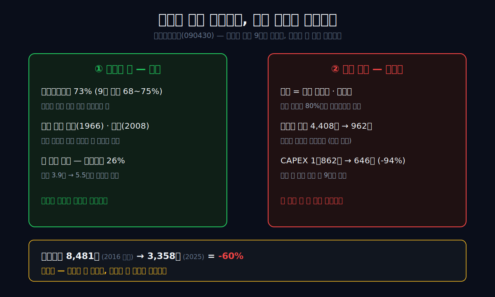
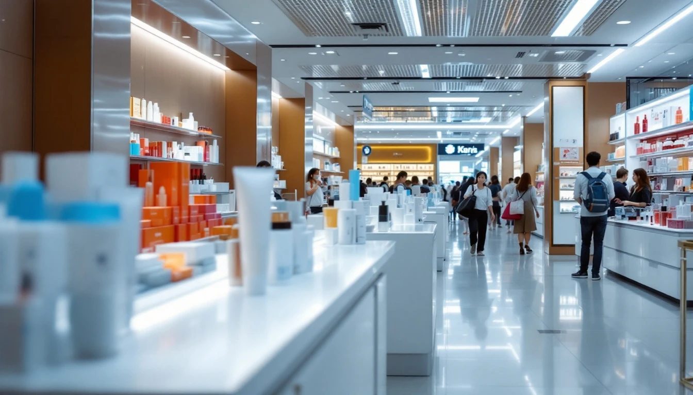
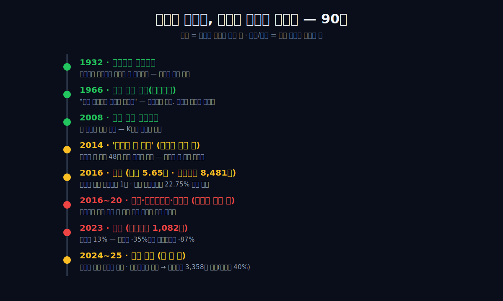
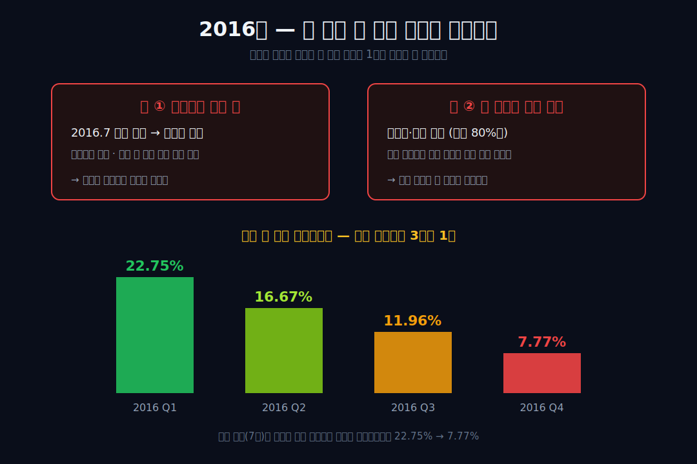
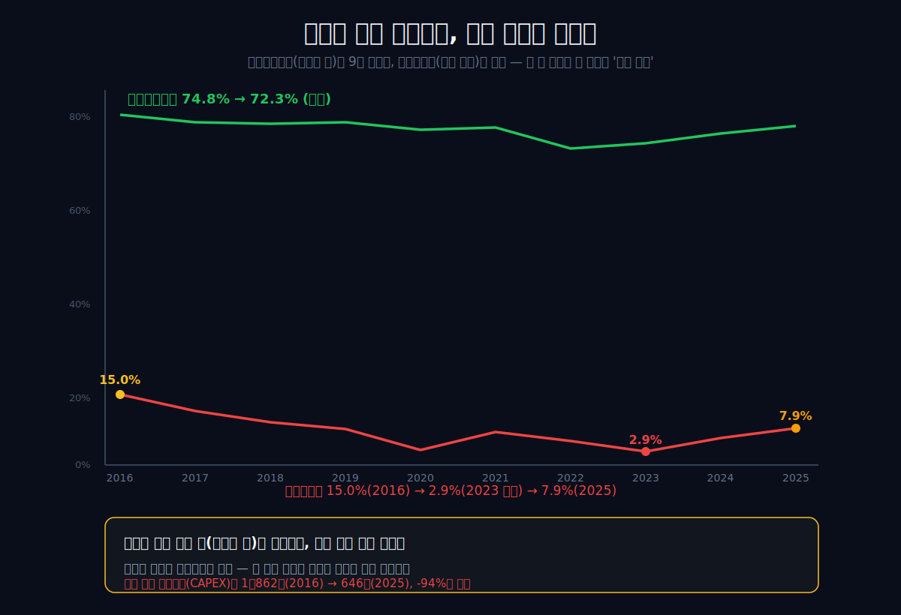
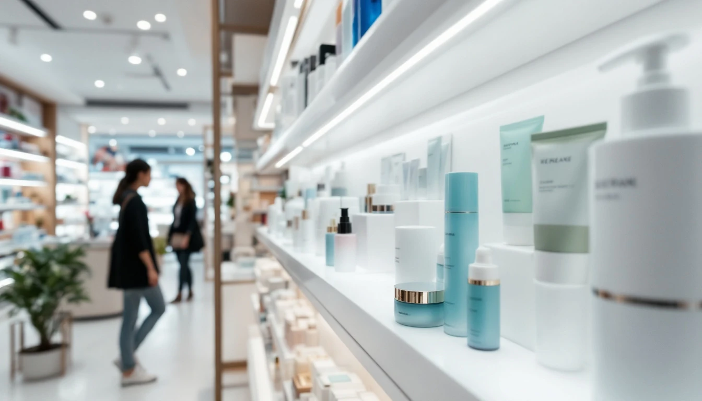
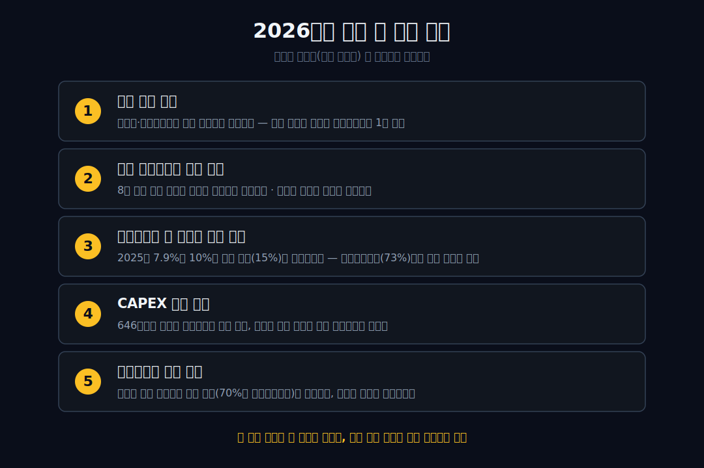

<script>
	import CompanyFinancials from '$lib/components/blog/CompanyFinancials.svelte';
</script>

> **데이터 기준**: 2026-06-13 dartlab 실측 — 아모레퍼시픽(090430) **연결 재무제표(CFS)** 기준. 090430 연결에는 설화수·라네즈·헤라 본체와 2023년 인수한 코스알엑스(COSRX)가 포함된다. 지주회사 **아모레퍼시픽그룹(002790)** (이니스프리·에뛰드 등 별도 자회사 포함)과는 **다른 실체**다. 본문에서 그룹 단위 숫자는 반드시 "그룹"으로 따로 표기한다.
>
> **핵심 숫자**: 매출 **4.25조** · 영업이익 **3,358억** (2016 정점 8,481억의 **40%**) · 매출총이익률 **72.3%** (2025) · 부채비율 **26%** · 영업활동현금흐름 **5,838억**
>
> **이 글의 용어**: 매출총이익률 = 물건을 팔고 원가를 빼면 남는 비율 (높을수록 제품 자체가 돈을 잘 번다) · 영업이익률 = 거기서 판매비·관리비까지 빼고 남는 비율 · 따이공(代購) = 한국 면세점에서 화장품을 대량으로 사 중국에 되파는 보따리상 · 면세 채널 = 공항·시내 면세점 매출 · CAPEX = 이 글에서는 현금흐름표의 유형자산 취득, 즉 공장·매장 같은 설비에 들어가는 투자 · 궈차오(国潮) = 중국 소비자가 자국 브랜드를 선호하는 흐름.

---

## 프롤로그 — 1932년 개성, 손으로 짠 동백기름

1932년, 개성의 한 여인이 손으로 동백기름을 짰다. 보부상에게 사들인 동백 열매를 빻아 기름틀로 누르고 베로 걸렀다. 여인의 이름은 윤독정. 그가 짠 머릿기름이 입소문을 타면서 1939년 '창성상점'이라는 간판이 걸렸고, 1945년 그 가게는 '태평양화학공업사'라는 회사가 된다. 90년 뒤, 이 회사는 한국 화장품 산업 전체를 상징하는 이름이 되고, 그 손자뻘 경영자는 2015년 한 해 동안 **한국에서 주식으로 가장 부유한 사람**에 오른다.

여기까지는 동화다. 문제는 그다음이다.

이 회사는 세상에 없던 것을 **두 번** 처음 만들었다. 한 번은 한방 화장품(1966년 세계 최초), 또 한 번은 쿠션 파운데이션(2008년 세계 최초). 둘 다 세계가 따라 한 발명이다. 그런데 두 번 다, 정작 그 열매는 회사 바깥에서 결정됐다. 한방은 발명한 지 **50년이 지나서야** 드라마 한 편(2014년 '별에서 온 그대')이 터뜨려 줬고, 쿠션의 거대한 중국 시장은 그것을 베낀 현지 브랜드들이 차지했다.

그리고 가장 잘나가던 2016년, 아모레퍼시픽의 영업이익은 **8,481억 원**이었다. 9년이 지난 2025년, 그 숫자는 **3,358억 원** — **60%가 사라졌다**. 망한 게 아니다. 같은 기간 빚은 거의 없었고(부채비율 26%), 자본은 오히려 3.9조에서 5.5조로 불었다. 무엇보다 제품 원가 구조는 영업이익만큼 무너지지 않았다. **물건을 팔아 원가를 빼고 남는 비율(매출총이익률)은 2022~23년 68% 안팎까지 내려갔지만 2025년 72.3%로 돌아왔다.** 제품은 버텼다. 그런데 이익은 반토막 났다.

관통선은 하나다. **"제품 원가 구조는 영업이익만큼 무너지지 않았는데, 왜 영업이익은 60%나 잃었는가?"**

답을 먼저 쓴다. 무너진 것은 *만드는 능력*이 아니라 *파는 길*이었다. 그리고 그 길은 아모레가 스스로 닦은 길이 아니라, 2014~2016년 중국이 잠깐 열어 준 길(따이공과 면세점)이었다. 문을 열어 준 것도 밖이었고, 닫은 것도 밖이었다. 이 글은 1932년 동백기름부터 2025년 미국 세포라 매대까지, **발명은 늘 안에서 일어났고 명운은 늘 밖에서 결정된** 한 회사의 90년을 추적한다.



---

## 1막 — 1932년, 회사의 진짜 시작은 어머니였다

**왜 1932년부터 시작하는가.** 아모레퍼시픽의 공식 창립연도는 1945년(태평양화학공업사)이다. 회사의 70주년·80주년 기념도 1945년을 기준으로 센다. 그런데 창업주 서성환은 평생 다르게 말했다. "우리 회사의 진짜 시작은 1932년, 어머니가 동백기름을 짜던 때"라고. 공식 기록(정사)과 창업주의 구술이 **13년이나 어긋난다.**

### "우리 회사의 모태는 나의 어머니다"

서성환은 이렇게 말했다. **"우리 회사의 모태는 나의 어머니다. 우리 회사는 여성이 키운 기업이다."** 남성 창업 신화가 흔한 한국 대기업사에서, 이 회사는 스스로를 *어머니가 손으로 짠 기름에서 시작된 기업*으로 규정했다. 1932년 윤독정이 개성에서 동백기름을 만들어 팔기 시작했고, 1939년 '창성상점' 간판을 달면서 머릿기름·미안수·크림(당시 표현으로 '구리무')·가루분으로 품목을 넓혔다. 열여섯의 서성환은 개성과 서울 사이 180리 길을 자전거로 오가며 원료를 조달했다.

화장품을 "잘 만들 줄 알아서" 시작한 게 아니다. 팔 수 있는 게 그것뿐이라 시작했고, 그 손기술이 회사가 됐다. **이 회사의 DNA에는 처음부터 '없던 물건을 손으로 만들어 낸다'는 발명의 기질이 박혀 있었다** — 그 기질이 90년 뒤 2025년 매출총이익률 72.3%라는 숫자로 남는다.

### 1945년, '태평양'이라는 이름

1945년 회사는 '태평양화학공업사'로 정식 출범한다. 상호 '태평양'은 "지구에서 가장 큰 바다"에서 따왔다. 손으로 기름을 짜던 가게가, 이름만큼은 가장 큰 바다를 품었다. 이 야망과 실제 규모의 낙차가 — 작은 손기술과 거대한 바깥 세계 사이의 거리 — 이 회사 이야기의 첫 복선이다.

> **여기서 멈칫**: 회사의 공식 역사는 1945년인데, 창업주는 죽을 때까지 "진짜 시작은 1932년 어머니의 동백기름"이라고 우겼다. 회사가 자기 정사보다 13년을 더 거슬러 올라가 *여성이 키운 기업*임을 고집한 것이다.

이 막의 끝에서 다음 막의 질문이 열린다. 손으로 기름을 짜던 회사는, 어떻게 '세계 최초'를 만드는 회사가 됐는가?

---

## 2막 — 최초를 만드는 손버릇, 그리고 높은 마진의 뿌리

**왜 이 막이 필요한가.** 2025년의 매출총이익률 72.3%를 이해하려면, 이 회사가 *어떻게 돈을 버는 손*을 갖게 됐는지를 봐야 한다. 그 손은 1940~60년대에 만들어졌다.

### 1948 메로디크림, 1951 ABC포마드 — '최초'의 연속

해방 직후 한국 화장품은 대부분 밀수품이거나 조악한 사제품이었다. 태평양화학은 1948년 **메로디크림**으로 국내 최초의 '브랜드' 화장품을 내놓는다. 이름 없는 크림이 아니라 *이름을 가진* 제품을 처음 판 것이다. 1951년에는 **ABC포마드** — 국내 최초의 순식물성 포마드. 6·25 피란 시절 부산에서 남성들에게 선풍적으로 팔렸다. 전쟁 통에도 "남들이 못 만드는 걸 만들어 판다"는 패턴이 이미 작동하고 있었다.

### 1964년 "인삼 화장품을 만들어 봅시다" — 세계 최초 한방의 시작

1964년, 서성환은 연구진에게 한마디를 던진다. **"한국인 몸에 맞는 원료는 역시 한방 원료입니다. 인삼 화장품을 만들어 봅시다."** 당시 세계 어느 화장품 회사도 인삼을 화장품에 쓰지 않았다. 2년 뒤인 1966년, 태평양화학은 **ABC 인삼크림** — 세계 최초의 한방(인삼) 화장품을 내놓는다. 훗날 설화수로 이어지는 효시다.


이 결정이 중요한 이유는 단순히 '최초'여서가 아니다. **한방이라는 콘셉트는 남이 쉽게 베낄 수 없는 가격 결정력을 만든다.** 똑같은 보습 크림이라도 "인삼·한방"이라는 이야기가 붙으면 더 비싸게 팔 수 있다. 원가는 비슷한데 가격은 높다 — 이것이 70% 안팎의 높은 매출총이익률을 설명하는 뿌리다. 1973년 인터뷰에서 서성환은 그 비결을 이렇게 설명했다. **"판매보다 기술 개발에 더 힘을 쏟아 소비자가 제품을 신뢰하고 있기 때문인 것 같습니다."**

### 만드는 능력은 강했다 — 문제는 '그다음'이었다

1990년대 들어 회사는 브랜드를 쏟아낸다. 마몽드(1991), 라네즈(1994), 헤라(1995), 아이오페(1996). 1997년에는 마침내 **설화수**가 출시되고, 같은 해 서른넷의 **서경배가 대표이사 사장**에 오른다. 2000년 자연주의 브랜드 이니스프리, 2005년 로드숍 에뛰드하우스. 2006년에는 61년간 써 온 '태평양' 사명을 버리고 지주회사 체제로 전환하며 **'아모레퍼시픽'**으로 다시 태어난다. 그리고 2008년, **세계 최초의 에어쿠션 파운데이션**. 콤팩트 스펀지에 액체 파운데이션을 머금게 한 이 발명은 'K뷰티 혁신'의 상징이 된다.

여기까지만 보면 완벽한 성공 서사다. 발명의 손은 한 번도 무뎌지지 않았다. 세계 최초가 두 개, 1조를 향하는 브랜드 포트폴리오, 젊은 오너의 승계. 그런데 — **발명을 마쳤는데도, 시장이 없었다.** 1966년에 만든 한방이 진짜로 폭발하기까지는 무려 *반세기*가 더 걸린다. 무엇이 이 발명을 그토록 오래 잠재웠고, 무엇이 끝내 깨웠는가. 그 방아쇠는 회사 안에 없었다.

---

## 3막 — 50년을 기다린 발명

**왜 한방이 그렇게 오래 잠들었나.** 1966년에 세계 최초 한방 화장품을 만들었지만, '설화수'라는 브랜드가 정식으로 자리 잡은 건 1997년이다. 발명과 브랜드화 사이에만 30년, 그 브랜드가 *세계 시장에서 폭발*하기까지는 거기서 또 17년이 더 걸린다. 발명은 1966년에 끝났는데, 폭발은 2014년에야 온다 — 그 사이 **48년의 잠복기**다.

### 만든 사람은 그 폭발을 못 봤다

이유는 단순하다. 한방·인삼이라는 '한국적 가치'를 1960~90년대의 세계는 사 주지 않았다. 국내에서는 1위였지만, 세계 무대에서 "동양의 약초가 든 비싼 크림"을 살 소비자층 자체가 형성돼 있지 않았다. 발명은 시대를 앞섰고, 시장은 한참 뒤에 도착했다.

창업주 서성환은 2003년 1월 세상을 떠난다. 그가 평생을 걸어 만든 한방 화장품이 진짜로 터지는 건, 그가 죽고 **11년 뒤**의 일이다. **발명의 가치가 발명자의 생애를 넘어선 것이다.** 좋게 말하면 시대를 앞선 비전이고, 냉정하게 말하면 — 회사는 자기 발명을 스스로 시장으로 만들 힘이 없었다. 발명은 안에서 했지만, 그것을 팔아 줄 무대는 회사 밖에서 와야 했다.

무엇이 그 무대를 깔았는가? 화장품 회사도, R&D 연구소도 아니었다. 드라마 한 편이었다.

---

## 4막 — 2014년, 밖에서 열린 문

**왜 2014년이 변곡점인가.** 2014년, 한 편의 한국 드라마가 중국에서 신드롬을 일으킨다. '별에서 온 그대'. 극 중 전지현이 바르던 한국 화장품이 중국 소비자들의 욕망에 불을 붙였다. 48년을 잠들어 있던 한방·K뷰티가, 회사가 한 일이라고는 아무것도 없는데, 드라마 한 편으로 깨어났다.

### 폭발의 좌표는 전부 회사 밖에 있었다

이 폭발이 *아모레의 실력*이 아니었다는 증거는 숫자에 있다. 2016년 기준 아모레퍼시픽그룹의 성장은 철저히 바깥으로 쏠려 있었다 — 그룹 해외 매출 **+35%**, 그중 아시아 **+38%**인 데 비해 국내는 **+12%**였다(그룹 단위 기준). 회사 안에서 일어난 일(국내 영업)로는 설명되지 않는 가속이, 회사 밖(중국 수요)에서 밀려들었다.

그 수요가 들어오는 통로는 더 위태로웠다. **따이공(보따리상)**이었다. 한국 면세점에서 화장품을 박스째 사 중국에 되파는 보따리상이, 한국 면세 매출의 약 **44%(2019년)**, 코로나 이후엔 **80%대**를 차지하게 된다. 성장 엔진이 자국 소비자도, 자사 직영 채널도 아닌 *회색 중간상*이었던 셈이다. 2012~2016년 한국의 대(對)중국 화장품 수출은 연평균 **+63%**로 불었다 — 산업 전체를 들어 올린 거대한 바깥 파도였다.



### 정점의 숫자들

파도의 정점에서 모든 기록이 갈아치워졌다. 2015년 설화수는 한 해 매출이 **+110%** 뛰며 국내 뷰티 단일 브랜드 최초로 연매출 1조를 넘겼고, 같은 해 7월 서경배 회장은 보유 주식 가치로 **한국에서 가장 부유한 사람**에 올랐다(그룹 시가총액 약 23조). 본체 아모레퍼시픽(090430)도 2016년 매출 **5.65조**, 영업이익 **8,481억** — 둘 다 사상 최대였다. 분기로 보면 2016년 1분기 영업이익률은 **22.75%**, 창사 이래 최고치였다.



> **여기서 멈칫**: 고급 한방 화장품 회사의 성장 엔진이, 알고 보니 면세점 매출의 80%를 나르던 *보따리상*이었다. 가장 화려한 정점의 토대가 가장 허술했다.

이 막의 끝에서 다음 막의 질문이 정해진다. 밖에서 열린 문은 — 밖에서 닫힐 수도 있다. 그리고 정확히 그렇게 됐다.

---

## 5막 — 같은 해, 두 길이 동시에 무너지다

**왜 2016년에 천국과 지옥이 같이 있었나.** 영업이익률 22.75%로 사상 최고를 찍은 바로 그 2016년, 7월에 한국 정부는 사드(THAAD) 배치를 결정한다. 중국은 한한령으로 보복했다. 단체관광이 끊기고, 중국 내 한국 제품 소비가 얼어붙었다. **중국으로 가는 길이 막혔다.** 그리고 동시에, 그 길로만 팔던 방식 — 따이공·면세 의존 — 이 약점으로 드러났다.

한 해에 두 가지가 같이 무너졌다. **중국으로 가는 길(사드), 그리고 그 길로만 팔던 방식(따이공).** 그 충격은 같은 회계연도 안에서 분기 단위로 찍혔다.



```python
import dartlab
c = dartlab.Company("090430")
c.select("ratios", ["영업이익률 (%)"])   # 2016년 분기 추이
```

| 2016년 분기별 (영업이익률, %) | 2016Q1 | 2016Q2 | 2016Q3 | 2016Q4 |
|---|---:|---:|---:|---:|
| 영업이익률 | **22.75** | 16.67 | 11.96 | **7.77** |

표시: **22.75 → 7.77** = 사드 발표(7월)를 전후로, 같은 해 안에서 영업이익률이 3분의 1로. 외부 충격이 손익에 박히는 데 걸린 시간은 1년이 아니라 한 분기였다.

### 충격은 매출보다 이익에 더 깊게 박힌다

연간으로 펼치면 더 분명하다. 매출은 정점(2016년 5.65조)에서 바닥(2023년 3.67조)까지 약 **-35%** 빠졌는데, 영업이익은 같은 구간에 8,481억에서 1,082억으로 **-87%** 무너졌다. 충격이 매출보다 이익에 두 배 이상 깊게 박혔다는 뜻이다. 이 격차에 진짜 이야기가 있다 — 그리고 그 이야기는 사드가 아니라, *회사가 그 호황의 정점에서 미래에 못 박아 둔 비용 구조*가 절반을 만들었다.

| 영업이익률 (연간, %) | 2025 | 2024 | 2023 | 2022 | 2021 | 2020 | 2019 | 2018 | 2017 | 2016 |
|---|---:|---:|---:|---:|---:|---:|---:|---:|---:|---:|
| 영업이익률 | 7.9 | 5.7 | **2.9** | 5.2 | 7.1 | 3.2 | 7.7 | 9.1 | 11.6 | **15.0** |

표시: **15.0 → 2.9(2023 바닥) → 7.9** = 정점·바닥·회복이 한 줄에. 그런데 *제품의 마진*은 이렇게 무너지지 않았다 — 다음 막의 핵심이다.

---

## 문은 한 번이 아니라 세 번 닫혔다

2016년 사드만으로 이 이야기를 끝내면 너무 쉽다. 사드는 방아쇠였지만, 아모레퍼시픽이 기대던 문은 그 뒤로도 두 번 더 닫혔다. 첫 번째는 정치였다. 중국 단체관광이 끊기고, 한국 화장품을 사러 오는 발길이 얼었다. 두 번째는 규제였다. 2019년 중국 전자상거래법이 시행되며 보따리상에게 사업자등록과 세금 신고 의무가 붙었다. 면세점에서 대량으로 사서 중국에 되파는 길이 더 이상 예전처럼 느슨하지 않았다. 세 번째는 무대 전환이었다. 코로나 이후 중국 소비자는 백화점·면세점보다 더우인 라이브커머스와 자국 브랜드로 이동했다.

세 문은 서로 다른 이름을 가졌지만, 재무제표에는 같은 상처를 남겼다. **잘 만든 제품을 대량으로 넘기던 통로가 줄어들고, 그 통로를 유지하던 비용은 천천히 빠졌다.** 매출은 2016년 5.65조에서 2023년 3.67조로 줄었고, 영업이익은 같은 기간 8,481억에서 1,082억으로 거의 사라졌다. 제품이 갑자기 나빠졌다면 매출총이익률부터 무너졌어야 한다. 그런데 매출총이익률은 2023년에도 68.6%를 지켰다. 바뀐 것은 제품의 질이 아니라, 그 제품이 지나가던 길의 폭이었다.

이 순서가 중요하다. 한 번 닫힌 문은 다시 열릴 수 있다. 세 번 닫힌 문은 구조가 바뀐 것이다. 정치 충격은 시간이 지나면 풀릴 수 있지만, 규제와 소비 무대 전환은 예전 회색 채널이 그대로 돌아오기 어렵다는 신호다. 그래서 2024~2025년 회복을 볼 때도 단순히 "중국이 돌아오나"가 아니라, **중국 없이도 팔 수 있는 길이 생겼나**를 봐야 한다. 다음 막의 숫자는 바로 그 질문을 겨냥한다.

---

## 6막 — 손은 멀쩡한데 다리가 부러졌다

**왜 같은 회사에서 매출총이익률은 버티고 영업이익률만 크게 녹았나.** 여기가 이 글의 심장이다. 9년 손익계산서를 펼치면, 두 줄이 정반대로 움직인다.

```python
import dartlab
c = dartlab.Company("090430")
c.select("IS", ["매출액", "매출원가", "매출총이익", "영업이익", "당기순이익"], freq="Y")
```

| 항목 (1년치 합산, 억원) | 2025 | 2024 | 2023 | 2022 | 2021 | 2020 | 2019 | 2018 | 2017 | 2016 |
|---|---:|---:|---:|---:|---:|---:|---:|---:|---:|---:|
| 매출액 | 42,528 | 38,851 | 36,740 | 41,349 | 48,631 | 44,322 | 55,801 | 52,778 | 51,238 | **56,454** |
| 매출원가 | 11,767 | 11,384 | 11,551 | 13,375 | 13,626 | 12,654 | 14,972 | 14,349 | 13,797 | 14,248 |
| 매출총이익 | 30,761 | 27,467 | 25,189 | 27,974 | 35,005 | 31,668 | 40,829 | 38,430 | 37,441 | 42,207 |
| 영업이익 | 3,358 | 2,205 | **1,082** | 2,142 | 3,434 | 1,430 | 4,278 | 4,820 | 5,964 | **8,481** |
| 당기순이익 | 2,473 | 6,016 | 1,739 | 1,293 | 1,809 | 219 | 2,238 | 3,348 | 3,980 | 6,457 |

표시: 매출총이익률(매출총이익÷매출)은 2016~2025년 **67.7~74.8%** 범위였다. 2022~23년에 68% 안팎까지 내려갔지만 2025년에는 72.3%로 회복했다. 같은 기간 영업이익률은 **15.0% → 2.9% → 7.9%**. *원가를 빼고 남는 돈(제품의 힘)*은 영업이익만큼 무너지지 않았는데, *판매·관리비까지 빼고 남는 돈*은 크게 녹았다. 무너진 지점은 매출총이익 아래, 즉 **잘 만든 물건을 시장에 가져다 파는 구간**이다. (※ 2024년 당기순이익 6,016억은 영업외 일회성 항목이 더해진 수치다 — 영업의 회복은 영업이익 라인으로만 읽어야 한다.)



### 사라진 5,123억은 어디서 증발했나

영업이익 감소를 더 쪼개면 오해가 줄어든다. 2016년에서 2025년 사이 영업이익은 **8,481억 → 3,358억**, 즉 **5,123억** 줄었다. 이 감소는 "비용을 전혀 줄이지 못했다"는 이야기가 아니다. 오히려 매출총이익 아래의 부담, 즉 `매출총이익 - 영업이익`으로 계산한 판관비성 부담은 **3조3,726억 → 2조7,402억**으로 **6,323억 줄었다**. 회사는 비용을 줄였다.

문제는 줄어든 속도다. 같은 기간 매출총이익은 **4조2,207억 → 3조761억**으로 **1조1,446억** 줄었다. 제품 1개당 남는 비율은 버텼지만, 팔 수 있는 총량이 줄어 매출총이익 원액이 먼저 빠졌다. 그리고 판관비성 부담 절감 6,323억은 그 감소분을 다 메우지 못했다. 차이가 바로 영업이익 감소 5,123억이다.

| 2016→2025 영업이익 감소 브리지 (억원) | 변화 |
|---|---:|
| 매출총이익 감소 | **-11,446** |
| 판관비성 부담 감소 (`매출총이익 - 영업이익`) | **+6,323** |
| 영업이익 감소 | **-5,123** |

이 표가 6막의 결론이다. 아모레퍼시픽은 비용을 안 줄인 회사가 아니다. **사라진 매출총이익의 속도를 판관비 축소가 따라잡지 못한 회사**다. 제품의 마진은 살아 있었고, 조직은 비용을 덜어냈지만, 중국 채널이 만들던 매출총이익 원액이 빠지는 속도가 더 빨랐다. 그래서 "손은 멀쩡한데 다리가 부러졌다"는 말은 비유가 아니라 손익계산서의 구조다.

### 매출 100원 중 64원이 파는 길에서 사라진다

판관비성 부담을 매출로 나누면 더 차갑다. 2016년에는 매출 100원 중 약 **59.7원**이 매출총이익 아래에서 빠졌고, 2025년에는 **64.4원**이 빠졌다. 바닥이었던 2023년에는 **65.6원**까지 올라갔다. 매출총이익률이 70% 안팎이면 이론상 제품은 충분히 비싸게 팔리고 있다. 그런데 그중 64~66원이 판매·관리·채널 유지 비용으로 흘러나가면, 영업이익률은 한 자릿수에 갇힌다.

따라서 앞으로 봐야 할 숫자도 단순 매출 회복이 아니다. 매출이 늘어도 판관비성 부담률이 64%대에 머물면, 아모레는 계속 "제품은 강한데 이익은 약한" 회사로 남는다. 반대로 매출총이익률 70%대를 지키면서 판관비성 부담률이 60% 아래로 내려오면, 그때는 파는 길이 실제로 회복됐다고 말할 수 있다.

### 무너진 것은 '파는 길'이었다

제품이 안 팔리게 된 게 아니라, *팔던 길*이 사라졌다. 설화수의 중국 매출은 2021년 약 4,408억에서 2024년 약 962억으로 줄어든 것으로 알려졌고(설화수 브랜드 단위·외부 추정), 자연주의 로드숍 이니스프리의 중국 매장은 한때 607개에서 약 300개 이하로 줄었다. 채널이 통째로 사라진 것이다.

### 닫힌 문 앞에 멈춰 선 1조

가장 또렷한 지문은 설비투자(CAPEX)다. 여기서 CAPEX는 현금흐름표의 **유형자산의 취득** 기준이다. 코스알엑스 인수 같은 M&A나 브랜드 마케팅 투자는 이 표에 들어가지 않는다.

```python
import dartlab
c = dartlab.Company("090430")
c.select("CF", ["영업활동현금흐름", "유형자산의 취득"], freq="Y")
```

| 항목 (1년치 합산, 억원) | 2025 | 2024 | 2023 | 2022 | 2021 | 2020 | 2019 | 2018 | 2017 | 2016 |
|---|---:|---:|---:|---:|---:|---:|---:|---:|---:|---:|
| 영업활동현금흐름 | 5,838 | 3,345 | 3,482 | 1,510 | 6,914 | 5,544 | 4,883 | 6,467 | 2,169 | 1,295 |
| 유형자산의 취득(CAPEX) | 646 | 810 | 1,345 | 993 | 912 | 1,830 | 1,893 | 4,055 | 6,634 | **10,862** |

표시: 2016년 호황의 정점에서 유형자산 취득에 **1조862억**을 쏟았다가, 2025년엔 **646억** — **-94%**. 설비 확장 속도는 크게 꺾였다. 돈이 없어서가 아니다. 같은 기간 영업활동현금흐름은 계속 들어왔고(2025년 5,838억), 자본총계는 2016년 3.90조에서 2025년 5.50조로 **불었으며**, 부채비율은 26%로 빚이 거의 없다. **현금은 남아 있는데 새 설비를 크게 늘릴 확신은 약해진 9년.** 닫힌 문 앞에서 유형자산 투자가 멈칫했다. 제품 원가 구조는 버티는데 이익만 사라지는 이 패턴은 매출을 2배로 키우고도 영업이익이 반토막 난 [이마트](/blog/139480-emart)와 닮았다 — 다만 이마트는 인수·리스 부채가, 아모레는 사라진 채널이 원인이다.

이 대목은 오해하면 안 된다. CAPEX 축소가 "아모레가 아무 투자도 하지 않았다"는 뜻은 아니다. 코스알엑스 인수처럼 연결 실적의 지형을 바꾸는 거래는 따로 있었고, 브랜드 마케팅·디지털 채널·해외 영업망에도 돈은 들어간다. 다만 유형자산 취득은 경영진이 *미래 수요를 얼마나 물리적 용량으로 믿고 있는가*를 보여 주는 숫자다. 공장, 물류, 매장, 설비는 한 번 늘리면 되돌리기 어렵다. 그래서 이 숫자가 1조대에서 600억대로 내려왔다는 사실은 단순 비용 절감보다 더 강한 신호다. 회사가 망해서 돈이 없는 것이 아니라, 중국 문이 닫힌 뒤 어느 시장을 기준으로 다음 용량을 깔아야 하는지 아직 확신이 약하다는 뜻에 가깝다.

반대로 말하면 회복의 확인도 여기서 시작된다. 북미 매출이 커지고 코스알엑스가 연결 안에서 안정적으로 돈을 벌어도, 유형자산 취득이 계속 바닥권이면 회사는 여전히 "가볍게 팔아 보는" 단계에 머문다. 판관비성 부담률이 내려가고 영업이익률이 두 자릿수로 돌아오며, 동시에 유형자산 투자가 다시 올라와야 한다. 그래야 아모레가 새 채널을 기사 속 성장률이 아니라 재무제표 위의 장기 용량으로 믿기 시작했다고 볼 수 있다.

망한 회사가 아니다. 만드는 능력(2025년 매출총이익률 72.3%)도, 현금(영업현금흐름)도, 재무 체력(부채비율 26%)도 멀쩡하다. 무너진 단 하나는 — **잘 만든 물건을 누구에게 어떤 길로 파느냐**였다. 그리고 그 길은 회사가 닦은 길이 아니었다.

---

## 7막 — 발명만으로는 유통권이 되지 않았다

**왜 발명이 보호막이 되지 못했나.** 2008년, 아모레는 세계 최초로 **에어쿠션 파운데이션**을 만들었다. 콤팩트에 스펀지를 넣어 액체 파운데이션을 두드려 바르는 이 형식은 전 세계 화장품 회사가 따라 했다. K뷰티 혁신의 상징이었다.

그런데 정작 가장 큰 쿠션 시장 — 중국 — 은 그 발명을 베낀 현지 브랜드들이 차지했다. 중국 로컬 화장품의 자국 시장 점유율은 2022년 처음 **50%**를 넘었고 2024년 **55%**까지 올랐다. 토종 브랜드 프로야(珀莱雅)는 광군절에서 로레알을 제치고 1위에 올랐으며, 중국 화장품 회사 최초로 매출 **10억 달러**를 넘겼다.

여기서 정직하게 선을 긋는다. 이것이 "중국 로컬이 아모레의 시장을 *빼앗았다*"는 인과인지, 아니면 아모레의 가격·유통·현지화 대응이 늦은 *내부 실패*인지, 공시 데이터만으로는 가를 수 없다. 분명한 것은 **관찰된 아이러니** 하나다 — 세계 최초로 그 카테고리를 *발명한* 회사가, 정작 그 카테고리의 가장 큰 시장에서는 주인공이 아니었다. 발명은 또 안에서 일어났고, 과실은 또 밖에서 결정됐다. 한국 화장품의 '만드는 힘' 자체는 [콜마](/blog/161890-kolmar) 같은 위탁생산(ODM) 기업이 세계에 증명하고 있다 — 약했던 것은 늘 만드는 힘이 아니라 그것을 자기 이름으로 파는 길이었다.

### 거울 — 같은 파도, 두 번 뒤집힌 운명

같은 중국 파도를 탄 경쟁사 LG생활건강과 비교하면 외생성이 더 선명해진다. 사드 이전 압도적 1위였던 아모레는 **2018년, 74년 만에** 국내 화장품 1위 자리를 LG생활건강에 내줬다. 그런데 2024~25년에는 시가총액·이익에서 다시 아모레가 앞선다. 두 회사의 운명을 가른 결정적 변수는 자체 역량이라기보다 *중국 노출도*라는 외부 좌표였고, 그 좌표는 6년 사이에 두 번이나 방향을 바꿨다. 중국이라는 외부 좌표에 흔들린 한국 소비재는 아모레만이 아니다 — 같은 중국 의존을 안고도 길을 달리 간 사례로 [오리온](/blog/271560-orion)이 있다.

이 막의 끝에서 마지막 질문이 열린다. 밖에서 열고 닫히는 문에 90년을 휘둘린 회사는, 이제 자기 손으로 문을 열 수 있는가?

---

## 산업 패턴 — 한 채널에 올라탄 K뷰티 전체의 취약성

**왜 아모레만의 이야기가 아닌가.** 아모레의 추락을 아모레만의 실패로 읽으면 절반만 보는 것이다. 2010년대 K뷰티 산업 전체가 *같은 하나의 외부 문* — 중국 따이공·면세 채널 — 에 올라타 있었다. 한국의 대(對)중국 화장품 수출은 2012~2016년 연평균 **+63%**로 불었고, 그 수요의 상당 부분이 면세점을 거쳐 보따리상의 손으로 중국에 넘어갔다. 산업 전체가 단 하나의 회색 채널에 매출의 토대를 의존한 것이다.

### 회색 채널은 정치·규제에 즉각 반응한다

따이공·면세 채널의 치명적 약점은 *외부 변수에 즉각 노출*된다는 데 있다. 2016년 사드(정치), 2019년 중국 전자상거래법(규제), 2020년 코로나(보건)가 차례로 이 채널을 때렸다. 특히 2019년 중국이 보따리상에게 사업자등록·관세신고를 의무화하자, 면세를 통한 우회로마저 좁아졌다. 공장도, 제품도, 브랜드도 그대로인데 *파는 통로*만 외부 사건 한 번에 막히는 구조 — 이것이 K뷰티 산업이 공유한 덫이었다.

### 중국 로컬은 다른 무대(더우인)에서 이겼다

같은 기간 중국 토종 브랜드는 한국이 잘 쓰지 못한 무대에서 성장했다. 더우인(중국판 틱톡) 라이브커머스와 가성비, 그리고 현지 트렌드에 맞춘 빠른 출시였다. 중국 로컬 화장품의 자국 시장 점유율은 2022년 처음 **50%**를 넘어 2024년 **55%**까지 올랐고, 토종 브랜드 프로야는 광군절에서 로레알을 제치며 중국 화장품 회사 최초로 매출 **10억 달러**를 넘겼다. 한국은 중국 화장품 수입시장 1위(2018년)에서 3위(2019년 이후)로 밀려 프랑스·일본에 자리를 내줬다. (이 승부의 원인이 한국의 대응 실패인지 중국의 약진인지는 단정하지 않는다 — 분명한 것은 *무대가 바뀌었다*는 관찰이다.)

### 그래서 이것은 산업 패턴이다

외부가 열어준 단일 채널에 산업 전체가 올라탔고, 그 채널이 닫히자 산업 전체가 함께 흔들렸다. 아모레와 LG생활건강의 운명이 같은 파도에 번갈아 뒤집힌 것도, 두 회사의 역량 차이라기보다 *중국 노출도*라는 산업 공통 변수의 작동이었다. 그렇다면 탈출도 개별 회사의 묘수가 아니라 산업 공통의 과제가 된다 — 단일 채널 의존을 깨고, 운명을 결정하는 외부 좌표 자체를 분산시키는 것. 그 분산의 첫 시도가 향한 곳이 다음 막의 무대, 북미다.

---

## 8막 — 새 문, 북미 — 이번엔 다른가?

**왜 미국인가.** 중국이라는 단 하나의 문에 운명을 걸었던 회사가, 2024년부터 다른 벽에 문을 내기 시작했다. 라네즈는 미국 세포라 등 핵심 뷰티 채널에서 접점을 넓혔고, 아마존 연말 대목(블랙프라이데이~사이버먼데이) 매출이 전년 대비 **+127%** 뛰었다. 북미에서 K뷰티 브랜드들을 실어 나르는 유통 플랫폼 [실리콘투](/blog/257720-silicon2)의 부상도 같은 흐름의 다른 얼굴이다.

 2021년부터 단계적으로 사들인 미국 스킨케어 브랜드 **코스알엑스(COSRX)**는 2023년 누적 약 9,350억 원을 들여 지분 93.2%로 자회사에 편입됐다 — 본체(090430) 연결 실적에 미국 매출이 본격적으로 더해지기 시작한 것이다.

### 북미는 중국의 반복인가, 아니면 구조 변화인가

여기서 중요한 질문이 생긴다. 북미가 커진다는 사실만으로는 충분하지 않다. 2014~2016년 중국도 컸다. 더 빨랐고, 더 뜨거웠고, 재무제표를 더 크게 밀어 올렸다. 하지만 그 성장의 상당 부분은 면세·따이공이라는 느슨한 외부 통로 위에 있었다. 회사가 브랜드를 만들었더라도, 최종 수요와 가격 질서를 장악한 것은 회색 유통과 중국 소비 사이클이었다. 그래서 매출이 클수록 오히려 단일 문에 더 깊이 기대는 구조가 됐다.

북미가 다른 이야기로 남으려면 세 가지가 달라야 한다. 첫째, 매출이 특정 중개 통로가 아니라 브랜드·플랫폼·리테일의 복수 접점에서 나와야 한다. 둘째, 코스알엑스처럼 연결 안에 들어온 브랜드가 단순 매출 덧셈이 아니라 마진을 해치지 않는 조합이어야 한다. 셋째, 라네즈와 코스알엑스의 성장이 판관비성 부담률을 더 높이는 방식이어서는 안 된다. 미국에서 팔기 위해 광고비와 플랫폼 수수료를 계속 더 태워야 한다면, 매출은 커져도 영업이익률은 다시 한 자릿수에 갇힌다.

그래서 이 글은 북미 매출 기사보다 손익계산서의 두 줄을 더 믿는다. 매출총이익률이 70%대를 지키면서 판관비성 부담률이 64%대에서 내려오면, 북미는 중국 이후의 새 구조가 된다. 반대로 매출은 늘지만 판관비성 부담률이 그대로라면, 북미도 또 하나의 외부 무대일 뿐이다. 무대가 중국에서 미국으로 바뀌었을 뿐, 명운이 밖에서 결정되는 구조는 크게 달라지지 않는다.

코스알엑스 인수도 같은 기준으로 봐야 한다. 인수 자체는 "문을 샀다"에 가깝다. 하지만 산 문을 자기 집의 복도로 연결하는 일은 별개다. 재고, 가격, 채널, 마케팅, 물류가 연결 실적 안에서 안정적으로 맞물려야 한다. 그 결과가 매출 증가와 동시에 부담률 하락으로 나타날 때, 비로소 아모레는 남이 열어 준 문을 통과하는 회사에서 자기 문을 설계하는 회사로 바뀐다.

결과는 영업이익 라인에 찍혔다. 바닥이었던 2023년 1,082억에서 2024년 2,205억, 2025년 **3,358억**으로 3년 연속 회복했다. 중국에서 8개 분기 만에 분기 흑자도 돌아왔다.

하지만 이 회복을 "예전으로 돌아갔다"로 읽으면 안 된다. 2025년 매출 4.25조는 2016년 5.65조보다 여전히 작고, 영업이익 3,358억도 정점의 40%다. 더 중요한 것은 회복의 모양이다. 2024년 당기순이익 6,016억처럼 영업외 항목이 섞인 숫자는 화려해 보일 수 있지만, 반복 가능한 힘은 영업이익과 부담률에서만 확인된다. 그래서 2024~2025년의 좋은 신호는 "순이익이 컸다"가 아니라, 영업이익이 1,082억에서 3,358억으로 올라오는 동안 매출총이익률이 72.3%로 회복했다는 점이다.

다음 단계의 질문도 같다. 아모레가 정말 달라졌다면 회복은 매출 기사보다 비용 구조에 먼저 남아야 한다. 북미와 코스알엑스가 커질수록 광고비, 플랫폼 수수료, 재고 부담이 같이 커진다면 새 시장은 또 다른 비용의 문이 된다. 반대로 매출총이익률은 유지되고 판관비성 부담률이 내려가면, 그때는 유통 구조가 실제로 정리되고 있다는 뜻이다. 아모레의 다음 1년은 성장률보다 이 두 숫자의 간격을 보는 싸움이다.

### 그러나 — 영업이익은 여전히 정점의 40%

후련한 해피엔딩으로 닫으면 거짓이다. 2025년 영업이익 3,358억은 2016년 정점 8,481억의 **40%** 수준이다. 회복은 진짜지만, 회사는 아직 가장 잘나가던 시절의 절반에도 못 미친다. 그리고 더 중요한 질문이 남는다 — 이 북미의 박수는, 누가 보내고 있는가?

중국이 떠날 때 한국이 할 수 있는 일은 많지 않았다. 이번 미국의 환호도, 결정하는 것은 미국 소비자다. **발명은 여전히 안에서, 명운은 여전히 밖에서.** 다만 이번에는 검증할 숫자가 더 선명하다. 북미 매출이 커졌다는 기사보다 중요한 것은 매출 100원당 판관비성 부담이 64원대에서 내려오는지, 영업이익률이 10%를 넘는지, 유형자산 취득 기준 CAPEX가 646억 바닥권에서 다시 올라오는지다. 세 숫자가 같이 움직여야 "새 문"이 아니라 "자기 손으로 연 문"이라고 부를 수 있다.

외부 사이클에 운명을 맡긴 회사가 모두 무너지는 건 아니다 — [SK하이닉스](/blog/000660-skhynix)는 다섯 번의 메모리 사이클을 맞고도 매번 더 강해졌다. 차이는 사이클이 돌아올 때 그 자리에 남아 있느냐다. 아모레도 이제 같은 시험대에 섰다. 중국 한 곳이 아니라 미국·일본·동남아로 채널을 쪼개고, 코스알엑스 같은 인수 브랜드를 연결 안에 넣고, 라네즈를 북미 핵심 채널에서 직접 키운다면 명운의 일부를 자기 손 안으로 끌어올 수 있다. 하지만 그것은 선언으로 증명되지 않는다. 판관비성 부담률과 두 자릿수 영업이익률로만 증명된다.

세상에 없던 걸 두 번이나 처음 만들고도, 정작 그 열매는 두 번 다 바깥 문이 열릴 때 커졌다. **세 번째 발명이 있다면, 그것은 새 크림도 새 쿠션도 아니라 — 잘 만든 물건을 남이 열어 준 문 없이 팔 수 있는 길이어야 한다.** 1932년 어머니가 손으로 짠 동백기름은 만드는 손이 강한 회사를 만들었다. 다음 90년의 질문은 그 손이 파는 길까지 쥘 수 있느냐다.

---

## 2026년에 봐야 할 다섯 가지

이 회사를 보는 사람이 다음 분기·1년에 확인해야 할 체크포인트다. 결론을 닫는 대신, *무엇이 깨지면 이 이야기가 바뀌는지*를 남긴다.

1. **판관비성 부담률** — `매출총이익 - 영업이익`이 매출의 64%대에서 내려오는가. 이 숫자가 내려와야 "파는 길"이 실제로 회복된다.
2. **중국 영업손익의 흑자 지속** — 8개 분기 만에 돌아온 중국 흑자가 반등인지 반짝인지. 설화수의 중국 매출이 바닥을 다지는지.
3. **영업이익률의 두 자릿수 복귀 여부** — 2025년 7.9%가 10%를 넘어 정점(15%)에 다가가는가. 매출총이익률 72.3%와의 격차가 줄어드는 게 곧 '파는 길'의 회복이다.
4. **유형자산 투자 재개** — 646억까지 줄어든 유형자산 취득이 다시 늘기 시작하면, 회사가 미래 수요를 다시 확신한다는 신호다. 코스알엑스 인수 같은 M&A와 브랜드 마케팅 투자는 이 숫자에 들어가지 않는다.
5. **북미·코스알엑스의 질** — 라네즈·코스알엑스가 연결 매출에서 차지하는 몫이 커지는 동시에 본체 수준의 70%대 매출총이익률을 유지하는가.



---

## 검증표

본문의 모든 인용 수치를 dartlab 호출과 결과로 검증한다. 외부 출처 수치는 "외부 인용"으로 분리한다. 📅 dartlab 실측 2026-06-13 · 아모레퍼시픽(090430) 연결(CFS) 기준.

| 본문 수치 | 출처 / dartlab 호출 | 결과 |
|---|---|---|
| 영업이익 2016 8,481억 → 2025 3,358억 (-60%) | `c.select("IS",["영업이익"],freq="Y")` 분기 합산 | ✓ 실측 |
| 매출 2016 5.65조(56,454억), 2023 바닥 3.67조 | `c.select("IS",["매출액"],freq="Y")` | ✓ 실측 |
| 매출총이익률 2016~2025: 74.8→73.1→72.8→73.2→71.4→72.0→67.7→68.6→70.7→72.3% | 매출총이익÷매출액 `c.select("IS",["매출총이익","매출액"],freq="Y")` | ✓ 실측 |
| 매출총이익 2016 4조2,207억 → 2025 3조761억 (-1조1,446억) | `c.select("IS",["매출총이익"],freq="Y")` | ✓ 실측 |
| 판관비성 부담 2016 3조3,726억 → 2025 2조7,402억 (-6,323억) | `매출총이익 - 영업이익` | ✓ 실측 파생 |
| 판관비성 부담률 2016 59.7% → 2023 65.6% → 2025 64.4% | `(매출총이익 - 영업이익) ÷ 매출액` | ✓ 실측 파생 |
| 영업이익 감소 브리지: 매출총이익 -1조1,446억 + 부담 절감 6,323억 = 영업이익 -5,123억 | `c.select("IS",["매출액","매출총이익","영업이익"],freq="Y")` | ✓ 실측 파생 |
| 영업이익률 15.0%(2016)/2.9%(2023)/7.9%(2025) | 영업이익÷매출액 | ✓ 실측 |
| 2016 분기 영업이익률 22.75→16.67→11.96→7.77 | `c.select("ratios",["영업이익률 (%)"])` | ✓ 실측 |
| 유형자산 취득 기준 CAPEX 2016 1조862억 → 2025 646억 (-94%), M&A·마케팅 제외 | `c.select("CF",["유형자산의 취득"],freq="Y")` | ✓ 실측 |
| 영업활동현금흐름 2025 5,838억 | `c.select("CF",["영업활동현금흐름"],freq="Y")` | ✓ 실측 |
| 자본총계 2016 3.90조 → 2025 5.50조 · 부채비율 33%→26% | `c.select("BS",["자본총계","부채총계"],freq="Y")` | ✓ 실측 |
| 영업이익 2023 1,082억(바닥)→2024 2,205억→2025 3,358억 | `c.select("IS",["영업이익"],freq="Y")` | ✓ 실측 |
| 2024 당기순이익 6,016억 (영업외 일회성 포함, 영업이익은 2,205억) | `c.select("IS",["당기순이익","영업이익"],freq="Y")` | ✓ 실측 (비영업 주의) |
| 설화수 중국 매출 4,408억(2021)→962억(2024 추정) | 브랜드 단위·언론 추정 | 외부 인용 |
| 이니스프리 중국 매장 607→~300개 | 언론 | 외부 인용 |
| 그룹 해외 +35%·아시아 +38% vs 내수 +12% (2016) | 그룹(002790) IR·언론 | 외부 인용(그룹) |
| 따이공이 면세 매출의 44%(2019)→80%대 | 한국무역협회·언론 | 외부 인용 |
| 서경배 2015 한국 주식부호 1위 (그룹 시총 약 23조) | 언론 | 외부 인용(그룹) |
| 별그대(2014)·궈차오 점유율 50%(2022)→55%(2024)·프로야 광군절 1위 | 언론 | 외부 인용 |
| 라네즈 미국 핵심 채널 확대·아마존 +127%·코스알엑스 누적 9,350억(지분 93.2%) | 회사 공시·언론 | 외부 인용 |
| 2018 LG생활건강에 국내 1위 추월 (74년 만) | 언론 | 외부 인용 |

본문의 숫자 중 이 표에 없는 것은 발행 차단 대상이다.

---

<CompanyFinancials code="090430" />

