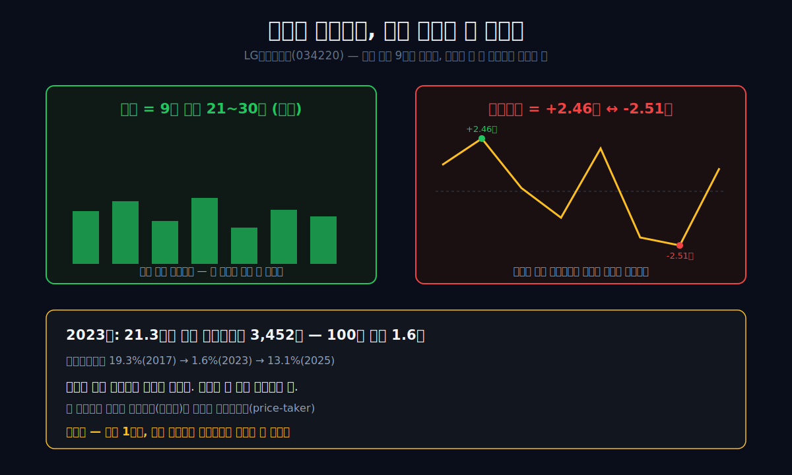
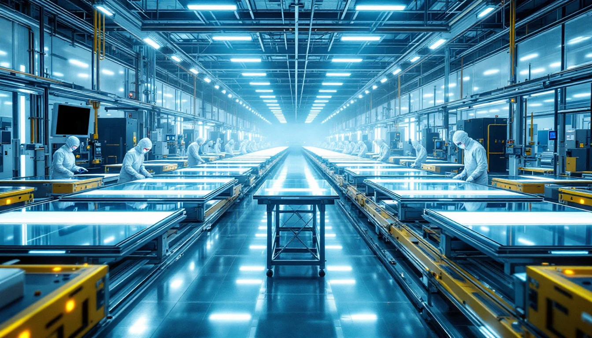
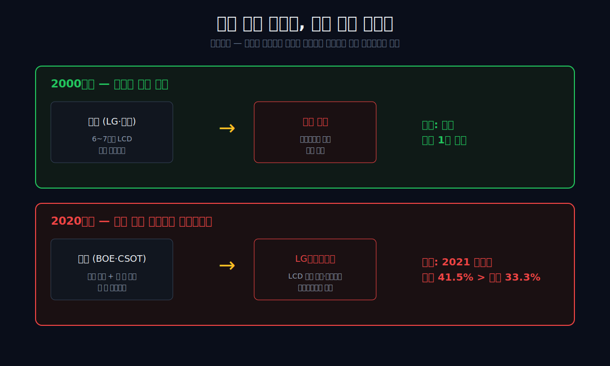
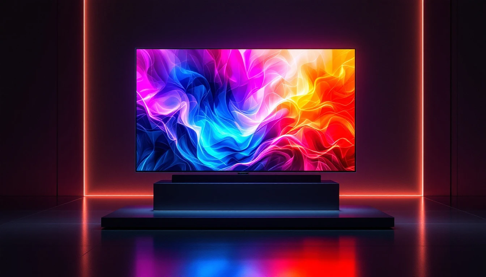
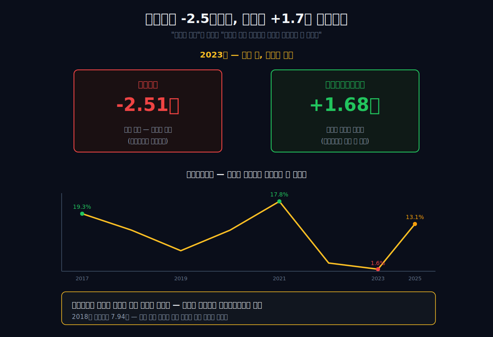
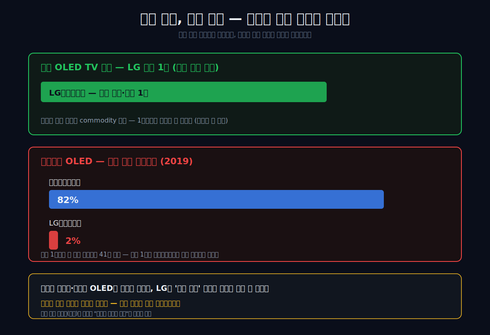
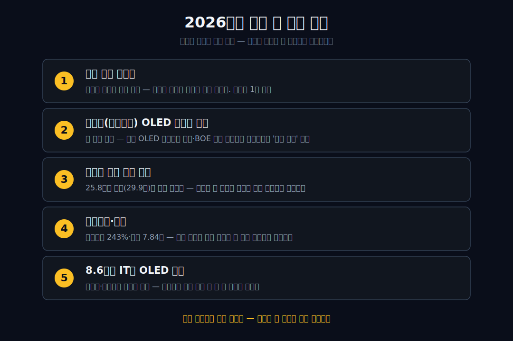

<script>
	import CompanyFinancials from '$lib/components/blog/CompanyFinancials.svelte';
</script>

> **데이터 기준**: 2026-06-13 dartlab 실측 — LG디스플레이(034220) **연결 재무제표(CFS)** 기준.
>
> **핵심 숫자**: 매출 **25.81조** · 영업이익 **+5,170억** (2023 바닥 -2.51조에서 흑전) · 매출총이익률 **13.1%** (2023 **1.6%** 바닥) · 부채비율 **243%** · 자본총계 **7.84조** (2021 14.76조의 절반)
>
> **이 글의 용어**: 매출총이익률 = 물건을 팔고 원가를 빼면 남는 비율 · 영업이익률 = 거기서 판매·관리비까지 빼고 남는 비율 · 감가상각 = 과거에 지은 공장·설비 값을 매년 조금씩 비용으로 깎는 것 (패널 공장은 이 비용 덩어리가 매우 크다) · 가격수용자(price-taker) = 값을 자기가 못 정하고 시장이 정하는 대로 받아야 하는 위치 · 치킨게임 = 적자를 감수하고 물량을 쏟아부어 경쟁사를 먼저 쓰러뜨리는 전략 · commodity = 차별화가 어려워 결국 가격으로만 경쟁하게 되는 범용품.

---

## 프롤로그 — 같은 회사, 같은 기술, 정반대 성적표

2013년, LG디스플레이는 세계 최초로 55인치 OLED TV 패널을 양산했다. 삼성보다 먼저였다. 그리고 12년 뒤, 스마트폰에 들어가는 OLED 시장에서 LG디스플레이의 점유율은 한 자릿수다. 같은 시장에서 삼성은 80%대를 쥐고 있다. 같은 나라, 같은 기술, 거의 같은 시기에 출발했는데 — 한쪽 화면(대형 TV)에선 세계 1등, 다른 화면(스마트폰)에선 거의 0이다.

성적표의 반대편을 숫자로 보면 더 이상하다. 2023년, LG디스플레이는 **21조 3천억 원어치**를 팔았다. 그런데 물건을 팔아 원가를 빼고 남은 돈(매출총이익)은 **3,452억 원**뿐이었다. 100원어치를 팔아 1.6원이 남은 셈이다. 나머지 98.4원은 만드는 데 다 들어갔다.

여기까지만 보면 "안 팔려서 망한 회사"처럼 들린다. 그런데 아니다. **매출은 9년 내내 21조에서 30조 사이로 멀쩡했다.** 무너진 것은 매출(파는 양)이 아니라, 그 매출에서 *얼마를 남기느냐*였다. 영업이익은 2017년 **+2조 4,616억**에서 2023년 **-2조 5,102억**으로, 부호 자체가 뒤집혔다 — 매출은 거의 그대로인데.

이 지점이 LG디스플레이의 가장 이상한 장면이다. 기술이 없어서 무너진 회사라면 이야기가 쉽다. 제품이 안 팔려서 무너진 회사라면 더 쉽다. 그런데 LG디스플레이는 세계 최초 OLED TV 패널을 만들었고, 여전히 20조원이 넘는 매출을 낸다. 화면을 만드는 능력은 사라지지 않았다. 사라진 것은 그 화면에서 돈을 남기는 권리다.

그래서 이 회사는 "제조 경쟁력이 약해졌다"보다 더 정확한 문장이 필요하다. LG디스플레이는 잘 만들었지만, 값을 정하지 못했다. 패널 가격은 고객과 중국 공급량과 사이클이 정했고, 회사는 거대한 공장을 돌리기 위해 그 가격을 받아들여야 했다. 기술 1등과 가격결정권은 같은 말이 아니었다.

관통선은 하나다. **"세계 최초 기술까지 만든 회사가, 21조를 팔든 30조를 팔든 그 해 흑자일지 적자일지를 왜 스스로 정하지 못하는가?"**

답을 먼저 쓴다. LG디스플레이는 '대형 패널'이라는 commodity 좌표에 거대한 공장을 박아 넣었다. 그 좌표에서는 **가격을 회사가 아니라 시장(중국 경쟁사·대형 고객)이 정한다.** 회사가 할 수 있는 건 다 지어놓은 공장의 감가상각(고정비)을 떠안고, 그 가격을 받아들이는 것뿐이다. 더 쓰린 건 — 회사를 세계 1위로 올려준 무기(치킨게임)가, 정확히 그 회사를 끌어내린 무기였다는 점이다.



---

## 1막 — 빌려온 시작 (1999)

**왜 1999년부터 시작하는가.** LG디스플레이는 자기 돈만으로 태어난 회사가 아니다. 1999년, LG전자의 LCD 사업은 네덜란드 필립스와 50:50 합작회사 **LG.Philips LCD**로 출범했다. 필립스가 약 16억 달러를 댔다. 패널 공장은 한 번 지을 때 조 단위가 드는 장치산업이라, 외부 파트너의 자본 없이는 판을 키울 수 없었다.



초대 사령탑 구본준은 사내 인사말을 **"일등합시다"**로 바꿨다. 1등을 향한 의지는 분명했다. 그런데 질문이 남는다 — 남의 돈으로 시작한 회사가 '일등'을 외칠 때, 그 일등은 어디서부터가 자기 것인가? 이 물음이 이 회사 30년을 따라다닌다.

2000년 LG는 세계 최초로 IPS 패널을 양산한다. 넓은 시야각이 강점인 이 기술은 훗날 애플 아이패드·아이폰의 화면으로 선택받는 결정적 무기가 된다. 2004년 LG.Philips LCD는 뉴욕증시와 한국거래소(034220)에 동시 상장하며 독립 회사의 외형을 갖춘다.

이 막의 끝에서 다음 막의 질문이 열린다. 빌려온 자본으로 시작한 회사는, 무엇으로 세계 1위까지 올라갔는가?

---

## 2막 — 빈자리를 채우다: 일본을 끌어내린 칼 (2000년대)

**왜 한국이 1위가 됐나.** TV가 브라운관(CRT)에서 평면(LCD)으로 넘어가던 2000년대, 디스플레이 패권은 일본(샤프 등)에서 한국·대만으로 넘어왔다. 그 이동을 만든 것은 더 좋은 기술이라기보다 **물량**이었다.

한국 패널사들은 6~7세대 LCD 라인에 막대한 설비를 깔고, 적자를 감수하면서까지 패널을 쏟아냈다. 가격이 떨어지면 자본이 약한 경쟁사가 먼저 쓰러진다 — 이른바 **치킨게임**이다. 일본 샤프가 이 소모전에서 고사했고, 그 빈자리를 LG디스플레이와 삼성이 채웠다. 노트북·모니터 패널에서 세계 1·2위에 올랐다.

여기서 기억해 둘 점이 있다. **LG디스플레이를 정상에 올린 무기는 '차별화된 제품'이 아니라 '남보다 크게 짓고 싸게 파는 능력'이었다.** 이 무기는 효과적이지만 위험하다 — 더 큰 자본을 가진 후발주자가 나타나면, 똑같은 칼이 이번엔 나를 향하기 때문이다. 그 후발주자는 10년쯤 뒤에 나타난다. 중국이었다.

치킨게임은 이기는 순간에는 전략처럼 보인다. 공장을 크게 지어 원가를 낮추고, 가격을 낮춰 경쟁사를 밀어낸다. 살아남은 회사는 점유율을 얻고, 시장은 그 회사를 "세계 1위"라고 부른다. 그런데 이 승리에는 숨은 조건이 있다. 내가 가장 큰 자본을 가진 동안에만 통한다는 조건이다. 더 큰 자본이 들어오면, 내가 했던 방식이 그대로 나를 공격한다.

일본 샤프를 밀어낼 때 한국 업체가 얻은 것은 기술 우위만이 아니었다. 더 큰 라인, 더 높은 가동률, 더 낮은 단가였다. 이 조합은 LCD라는 제품이 표준화될수록 더 강해진다. 고객은 "누가 더 좋은 화면을 만들었나"보다 "누가 같은 품질을 더 싸게, 더 안정적으로 주나"를 본다. 그 순간 패널은 브랜드 상품이 아니라 부품이 된다.

LG디스플레이의 장기 리스크는 여기서 시작됐다. 한 번 공장을 크게 짓고 나면 회사는 가동률의 포로가 된다. 설비는 매년 감가상각비를 만든다. 라인을 멈추면 고정비가 더 무겁게 느껴진다. 그래서 가격이 낮아져도 공장을 돌려야 하고, 공장을 돌리면 다시 공급이 늘어 가격을 누른다. 치킨게임은 승자에게도 같은 습관을 남긴다.

이 습관은 2010년대 중반까지는 강점이었다. 세계 수요가 늘고, 애플 같은 고객이 물량을 가져가고, TV가 커질 때는 대형 설비가 돈을 벌었다. 그러나 중국이 같은 방식으로 더 큰 설비를 깔기 시작하면, 과거의 강점은 취약점으로 바뀐다. LG디스플레이가 일본을 이길 때 썼던 "큰 공장과 낮은 가격"은, 중국이 LG디스플레이를 밀어낼 때도 그대로 쓰인 문법이었다.



이 막의 끝에서 다음 막으로 넘어간다. 정상에 오른 회사를, 한동안은 외부의 거대한 수요가 떠받쳐 준다.

---

## 3막 — 세계가 키운 정상 (2010~2021)

**왜 정상이 화려했나.** 2010년대, LG디스플레이의 호황은 회사가 만든 것이라기보다 *밖에서 들어온* 것이었다. 애플이 아이패드와 아이폰에 LG의 IPS·LCD 패널을 대량으로 채택했다. 한때 아이폰 LCD 물량의 약 40%를 LG디스플레이가 댔다. 세계에서 가장 큰 고객이 회사를 끌어올렸다.

기술 자존심도 세웠다. 2013년 세계 최초 55인치 OLED TV 패널 양산. 대형 OLED는 지금도 LG디스플레이가 세계에서 거의 유일하게 양산하는 영역이다.

 당시 한상범 사장은 **"UHD OLED에 올인하겠다. 시점의 문제이지 반드시 시장이 열리고 우리가 1등을 할 것"**이라고 공언했다.

호황의 정점은 두 번 찍혔다. 2017년 영업이익 **2조 4,616억**, 그리고 2021년 — 코로나로 집에서 일하고 공부하는 비대면 수요가 폭발하면서 매출 **29조 8천억**, 영업이익 **2조 2,306억**. 외부 수요가 밀려들 때 이 회사는 분명 거대한 이익을 냈다.

> **여기서 멈칫**: 호황의 트리거가 전부 회사 밖에 있었다 — 애플의 채택, 코로나의 비대면 수요. 회사가 수요를 *창출*한 게 아니라 들어온 수요를 *받았다*. 밖에서 들어온 호황은, 밖에서 빠져나갈 수도 있다.

이 막의 끝에서 다음 막의 질문이 정해진다. 그렇다면 그 수요가 빠지고, 자기가 썼던 그 칼을 더 큰 손이 쥐면 어떻게 되는가?

---

## 4막 — 거울에 비친 가해자 (2021~)

**왜 똑같은 일이 반복됐나.** 중국의 BOE와 CSOT가, 정확히 LG디스플레이가 일본 샤프에게 했던 그 일을 — 더 큰 규모로 — 되풀이했다. 국가 보조를 등에 업고 LCD 라인을 대규모로 깔고, 적자를 감수하며 패널을 쏟아냈다. LCD 가격이 폭락했다. 2021년 중국은 세계 디스플레이 점유율 41.5%로 1위에 올랐고, 한국은 33.3%로 2위로 밀렸다.

LG디스플레이는 이 구조에서 **가격수용자**가 됐다. 패널 가격은 중국의 공급량이 정하고, 회사는 그 가격을 받아들이는 것 외에 할 수 있는 게 없다. 자기가 일본을 끌어내릴 때 휘둘렀던 칼에, 이번엔 자기가 베였다.

가격수용자가 된다는 것은 단순히 가격이 낮아진다는 뜻이 아니다. 회사가 열심히 해도 손익계산서의 맨 위와 중간을 스스로 통제하지 못한다는 뜻이다. 매출은 고객 주문과 패널 단가가 정한다. 매출원가는 원재료와 감가상각과 가동률이 정한다. 회사가 할 수 있는 것은 비용을 줄이고, 라인을 조정하고, 제품 믹스를 바꾸는 것뿐이다. 그러나 시장 가격이 크게 무너지면 그 노력은 손익계산서 전체를 구하기에 부족하다.

중국 업체의 진입은 공급량만 늘린 것이 아니다. 고객의 협상력도 키웠다. TV 세트 업체와 글로벌 IT 고객은 더 이상 한두 공급자에게 의존하지 않아도 된다. BOE, CSOT 같은 공급자가 늘어날수록 고객은 가격을 더 세게 누를 수 있다. 패널 업체가 "이 가격으로는 어렵다"고 말해도, 고객은 다른 공급자를 찾을 수 있다. 이 순간 기술이 있어도 가격은 고객과 경쟁사가 정한다.

그래서 LG디스플레이의 위기는 "중국이 나쁘다"로 끝나지 않는다. 중국은 사건이고, 구조는 더 깊다. 대형 패널이라는 좌표 자체가 표준화되기 쉬웠고, 표준화된 제품은 더 큰 자본과 더 낮은 가격에 약했다. LG디스플레이는 이 좌표에서 세계 1위까지 갔지만, 그 좌표가 commodity가 되는 순간 가격결정권을 잃었다.

이 장면은 LG디스플레이가 왜 매출을 유지하면서도 이익을 잃었는지 설명한다. 고객은 여전히 화면을 샀다. 회사는 여전히 화면을 만들었다. 그러나 화면 한 장당 남는 돈이 사라졌다. 매출액은 거대한데 매출총이익률이 1.6%까지 내려간 2023년은, 수요가 사라진 해가 아니라 가격결정권이 사라진 해였다.

이 막의 끝에서 다음 막으로 넘어간다. 가격을 못 정하는 회사의 손익계산서는, 어떻게 생겼는가?

---

## 5막 — 만드는 것이 값을 못 정하는 순간 (2022~2023)

**왜 21조를 팔고 3,452억밖에 못 남겼나.** 여기가 이 글의 심장이다. 9년 손익계산서를 펼치면, 매출은 거의 평평한데 이익만 부호를 바꾼다.

```python
import dartlab
c = dartlab.Company("034220")
c.select("IS", ["매출액", "매출원가", "매출총이익", "영업이익", "당기순이익"], freq="Y")
```

| 항목 (1년치 합산, 억원) | 2025 | 2024 | 2023 | 2022 | 2021 | 2020 | 2019 | 2018 | 2017 | 2016 |
|---|---:|---:|---:|---:|---:|---:|---:|---:|---:|---:|
| 매출액 | 258,101 | 266,153 | 213,308 | 261,518 | 298,780 | 242,301 | 234,756 | 243,366 | 277,902 | 265,041 |
| 매출원가 | 224,336 | 240,399 | 209,856 | 250,277 | 245,729 | 215,875 | 216,073 | 212,513 | 224,246 | 227,543 |
| 매출총이익 | 33,765 | 25,754 | **3,452** | 11,241 | 53,051 | 26,426 | 18,683 | 30,853 | 53,656 | 37,498 |
| 영업이익 | 5,170 | -5,606 | **-25,102** | -20,850 | 22,306 | -291 | -13,594 | 929 | **24,616** | 13,114 |
| 당기순이익 | 3,038 | -15,702 | -25,767 | -31,956 | 13,335 | -706 | -28,721 | -1,794 | 19,371 | 9,315 |

표시: 매출은 21조~30조 사이를 오갈 뿐인데 영업이익은 **+2.46조(2017) → -2.51조(2023)**로 부호가 뒤집혔다. 2023년 매출총이익률(매출총이익÷매출)은 **1.6%** — 21.3조를 팔아 3,452억. 매출(수요)이 아니라 *가격*이 모든 손익을 결정한다는 뜻이다. 브랜드 마진(매출총이익률 73%)은 지켰지만 채널이 무너진 [아모레퍼시픽](/blog/090430-amorepacific)과는 정확히 반대 부위의 골절이다 — 아모레는 양을 잃었고, LG디스플레이는 단가를 빼앗겼다.

이 표에서 가장 무서운 줄은 매출액이 아니다. 매출총이익이다. 2017년에는 매출총이익 5조 3,656억원, 영업이익 2조 4,616억원이었다. 2021년에도 매출총이익 5조 3,051억원, 영업이익 2조 2,306억원이었다. 두 해 모두 회사는 5조원대 매출총이익을 만들었다. 그런데 2023년 매출총이익은 3,452억원이다. 5조원대가 3천억원대로 줄었다.

매출이 0이 된 것이 아니다. 2023년 매출은 21조 3,308억원이다. 문제는 21조원어치를 팔면서 원가를 빼고 남은 돈이 3,452억원뿐이었다는 점이다. 매출총이익률 1.6%는 패널 회사가 사실상 원가 근처에서 팔았다는 뜻이다. 이 상태에서는 판매관리비를 아무리 줄여도 영업이익을 지키기 어렵다.

반대로 2025년의 흑자전환도 같은 경로로 봐야 한다. 2025년 매출은 25조 8,101억원, 매출총이익은 3조 3,765억원, 영업이익은 5,170억원이다. 매출은 2021년 정점보다 낮지만, 매출총이익이 회복되면서 영업이익이 돌아왔다. 즉 이 회사의 손익은 매출량보다 매출총이익률에 더 민감하다. 2025년 흑자를 볼 때도 "얼마나 팔았나"보다 "얼마를 남겼나"를 먼저 봐야 한다.

### "원가에 판다"가 아니라 "공장값을 못 건진다"

여기서 정확히 짚어야 할 게 있다. 매출총이익률 1.6%를 보고 "원가에 거의 그냥 팔았다"고 읽으면 절반만 맞다. 패널 제조에서 매출원가의 큰 덩어리는 **감가상각** — 이미 지어놓은 거대한 공장 값을 매년 비용으로 깎는 것이다. 이 비용은 패널이 비싸게 팔리든 싸게 팔리든 *똑같이* 찍힌다. 그래서 가격이 떨어지면 매출총이익률이 폭락한다. 변동비가 매출을 넘어서가 아니라, **비싸게 지은 공장을 싼값에 돌려 고정비를 못 건지는 것**이다.

증거는 현금흐름에 있다. 2023년 영업이익은 -2조 5,102억으로 사상 최악이었는데, 같은 해 영업활동현금흐름은 **+1조 6,827억**으로 플러스였다. 손익을 갉아먹은 감가상각이 실제 현금이 나가는 비용이 아니기 때문이다. 즉 LG디스플레이의 병은 "만들수록 현금이 샌다"가 아니라 **"다 지어놓은 공장의 값을, 떨어진 패널 가격으로는 회수하지 못한다"**는 것이다. 그리고 그 패널 가격을 회사는 정하지 못한다.

이 차이는 중요하다. 영업이익이 적자라고 해서 회사가 매일 현금을 태우는 것은 아니다. 감가상각은 과거 투자비를 현재 비용으로 나누어 인식하는 회계 비용이다. 2023년에 현금흐름이 플러스였다는 사실은, 회사가 당장 제품을 만들 때마다 현금을 잃는 구조까지는 아니었다는 뜻이다. 그러나 그것이 안전하다는 뜻도 아니다. 이미 쓴 돈을 회수하지 못한다는 것은 자본총계가 줄어드는 문제로 나타난다.

장치산업에서 감가상각은 과거의 선택이 현재 손익계산서에 보내는 청구서다. 과거에 공장을 크게 지은 회사는 매년 그 공장값을 비용으로 떠안는다. 호황기에는 이 비용이 레버리지가 된다. 가동률이 올라가고 가격이 좋으면 고정비가 매출에 흩어져 이익률이 폭발한다. 불황기에는 정반대다. 가격이 낮아지고 물량이 줄면 같은 고정비가 매출총이익률을 짓누른다.

LG디스플레이의 2022~2023년은 이 고정비 디레버리지의 교과서다. 2022년 영업손실 -2조 850억원, 2023년 영업손실 -2조 5,102억원. 두 해 모두 매출은 20조원을 넘었다. 그런데 공장값을 충분히 회수하지 못하자 손익계산서가 무너졌다. 기술이 무너진 것이 아니라, 자본집약 산업의 비용 구조가 가격 하락을 버티지 못한 것이다.

이 대목에서 [LG전자](/blog/066570-lg-electronics)와의 차이도 보인다. LG전자는 완제품 브랜드와 유통, 서비스, 제품 믹스를 통해 가격을 일부 조정할 수 있다. LG디스플레이는 부품 공급자다. 고객이 가격을 누르면 받아들여야 하고, 중국 공급량이 늘면 시장 가격이 내려간다. 같은 LG 이름을 달아도 가격결정권의 위치가 다르다.

감가상각을 이기는 방법은 세 가지뿐이다. 첫째, 패널 가격이 오른다. 같은 공장을 돌려도 매출총이익률이 올라가면 고정비가 흩어지고 손익이 좋아진다. 둘째, 공장의 제품 믹스가 바뀐다. 낮은 가격의 LCD 비중을 줄이고, OLED·IT용 고부가 제품 비중을 높이면 같은 설비라도 매출총이익률이 달라진다. 셋째, 설비 자체를 줄이거나 판다. 2024년 광저우 LCD 공장 매각은 바로 이 세 번째 방식이다. 돈을 더 잘 벌어서 이긴 것이 아니라, 더 이상 값을 못 받는 설비를 장부에서 덜어낸 것이다.

이 세 방법 중 가장 강한 것은 둘째다. 가격 상승은 외부가 허락해 줘야 하고, 설비 매각은 한 번 쓰면 끝나는 카드다. 지속 가능한 회복은 제품 믹스가 바뀔 때 나온다. LG디스플레이가 정말로 "가격을 못 정하는 회사"에서 벗어나려면, 대형 OLED TV의 기술 상징만으로는 부족하다. 스마트폰·태블릿·노트북처럼 고객 인증과 품질 장벽이 더 높은 영역에서 비중을 늘려야 한다. 그래야 감가상각이라는 과거의 비용을 현재의 높은 매출총이익으로 덮을 수 있다.

그래서 2023년의 영업활동현금흐름 +1조 6,827억원을 너무 안심해서 읽으면 안 된다. 현금흐름이 플러스였다는 것은 회사가 당장 문을 닫을 구조는 아니었다는 뜻이다. 그러나 손익계산서가 계속 적자라면 자본은 줄고, 투자 여력은 약해지고, 다음 기술 전환의 타이밍을 놓칠 수 있다. 장치산업에서 손익 적자는 단순 회계 문제가 아니라 다음 공장을 지을 권리의 문제다.



이 막의 끝에서 다음 막으로 넘어간다. 값을 못 정하는 회사는, 무엇으로 버티는가?

---

## 6막 — 곳간을 헐다 (2024)

**왜 자산을 팔고 주주를 희석했나.** 영업으로 이익을 못 내니, 회사는 *가진 것을 팔아* 버텼다.

```python
import dartlab
c = dartlab.Company("034220")
c.select("BS", ["자산총계", "부채총계", "자본총계"], freq="Y")
```

| 항목 (Q4 스냅샷, 억원) | 2025 | 2024 | 2023 | 2022 | 2021 | 2019 | 2017 | 2016 |
|---|---:|---:|---:|---:|---:|---:|---:|---:|
| 자산총계 | 269,167 | 328,596 | 357,593 | 356,860 | 381,545 | 355,746 | 291,597 | 248,843 |
| 부채총계 | 190,775 | 247,868 | 269,888 | 243,668 | 233,920 | 230,863 | 141,782 | 114,219 |
| 자본총계 | 78,392 | 80,728 | 87,705 | 113,192 | **147,625** | 124,883 | 149,815 | 134,624 |

표시: 누적 적자가 자본을 갉아먹어 자본총계는 2021년 **14조 7,625억**에서 2025년 **7조 8,392억**으로 거의 절반이 됐다. 부채비율(부채÷자본)은 2025년 **243%**, 2023년에는 **308%**까지 올랐다. 빚 없이 자본을 쌓던 아모레퍼시픽(부채비율 26%)과 정확히 반대편의 재무구조다.

버티기 위해 회사는 두 가지를 했다. 첫째, 2024년 **상장 이후 처음으로 유상증자 1조 2,924억**을 단행했다 — 기존 주주의 지분 가치를 희석하면서까지 현금을 끌어왔다. 둘째, 같은 해 **중국 광저우 LCD 공장을 중국 TCL 계열(CSOT)에 약 2조 원에 매각**하고 LCD 사업에서 사실상 철수했다. 자기를 적자로 몰아넣은 그 LCD 사업을, 자기를 적자로 몰아넣은 그 중국 회사에게 판 것이다.

이 막의 끝에서 마지막 질문이 열린다. 그런데 — 똑같은 한국 회사인 삼성은, 같은 중국 환경에서 왜 멀쩡한가?

---

## 7막 — 삼성 82% vs LG 2%: 외부 탓만은 아니다

**왜 같은 나라 회사는 살았나.** "중국에 밀려서 졌다"는 서사에는 결정적 반례가 있다. 같은 한국, 같은 시기에 삼성은 살아남았다. [삼성전자](/blog/005930-samsung)는 메모리 반도체에서 중국을 따돌렸고, 삼성디스플레이는 스마트폰용 중소형 OLED로 무게중심을 옮겨 그 시장을 장악했다. 2019년 기준 스마트폰 OLED 점유율은 **삼성 82% vs LG 2%**였다.


이 비대칭이 중요한 이유는, 그것이 "외부 탓"이라는 변명을 깨기 때문이다. 중국 공급과잉이라는 같은 환경에서 한 회사(삼성)는 다른 좌표(메모리·모바일 OLED)로 갈아타 살아남았고, LG디스플레이는 '대형 패널'이라는 좌표에 공장을 박은 채 남았다. **무너진 진짜 원인은 환경이 아니라, 회사가 어떤 좌표에 몸을 실었느냐였다.** LG디스플레이는 대형 OLED TV를 세계 최초로 만든 1등이었지만, 정작 돈이 되는(차별화가 유지되는) 중소형 OLED 좌표에서는 후발에 밀렸다.

세계 최초의 기술이 있었는데도 마진을 못 지켰다는 것 — 이것은 "기술로 차별화하면 산다"는 통념을 LG디스플레이 자신이 반증한 셈이다. 기술 1위가 가격결정력으로 자동 번역되지 않는다.

대형 OLED TV와 스마트폰 OLED는 같은 OLED라는 이름을 쓰지만 경제성이 다르다. TV 패널은 크고, 고객은 소수의 TV 세트 업체이며, 최종 소비자 가격은 경기와 TV 교체 사이클의 영향을 크게 받는다. 패널 하나가 크기 때문에 공장 가동률과 수율이 중요하고, 라인을 한 번 깔면 고정비 부담이 무겁다. 대형 OLED에서 기술 1등을 해도, TV 수요가 약하거나 고객이 가격을 누르면 이익률은 쉽게 흔들린다.

스마트폰 OLED는 다르다. 화면은 작지만 수량이 많고, 프리미엄 스마트폰에서는 화면 품질과 전력 효율, 얇기, 납품 안정성이 제품 경험과 직결된다. 특히 애플 같은 고객은 한 번 공급망에 들어가면 긴 기간 높은 품질 기준을 요구하고, 공급자는 그 기준을 통과하는 동안 진입장벽을 얻는다. 이 좌표에서는 단순 대형 설비보다 고객 인증과 수율, 기술 세대 전환 속도가 더 중요하다.

삼성디스플레이는 이 좌표를 먼저 잡았다. 스마트폰 OLED가 프리미엄 기기의 표준이 되는 동안 삼성은 고객과 수율과 양산 경험을 쌓았다. LG디스플레이는 대형 OLED TV에서 기술 상징을 얻었지만, 돈이 더 오래 남는 중소형 OLED에서는 후발이었다. 이 차이는 2019년 스마트폰 OLED 점유율 삼성 82% vs LG 2%라는 숫자로 드러난다. 기술의 이름은 같지만, 이익이 남는 장소가 달랐다.

이 장면은 LG디스플레이를 더 냉정하게 보게 만든다. 회사가 틀린 기술을 고른 것은 아니다. OLED TV는 분명 어려운 기술이고, LG디스플레이는 그 분야에서 중요한 회사다. 문제는 그 기술이 회사 전체의 손익을 방어할 만큼 높은 가격결정권으로 번역되지 않았다는 점이다. 기술은 있었지만, 고객 구조와 제품 좌표와 공장 고정비가 이 기술의 경제성을 제한했다.

그래서 "중국 때문에 졌다"는 말은 절반만 맞다. 중국은 LCD 가격을 무너뜨렸고 대형 패널의 수익성을 눌렀다. 하지만 같은 환경에서 삼성은 더 높은 가격결정권이 남는 좌표로 갔다. LG디스플레이의 약점은 중국이 나타났다는 사실보다, 중국이 나타났을 때 피할 좌표가 충분히 강하지 않았다는 사실이다.



이 막의 끝에서 산업 전체로 시야를 넓힌다.

---

## 산업 패턴 — 디스플레이는 왜 commodity로 끝나는가

**왜 아무리 앞서도 따라잡히나.** 디스플레이 산업에는 반복되는 패턴이 있다. 새로운 기술(LCD, 그다음 OLED)이 처음 나오면 차별화로 높은 값을 받지만, 그 기술이 표준이 되는 순간 — 더 큰 자본을 가진 후발주자가 더 큰 공장을 지어 물량으로 가격을 끌어내린다. 차별화가 사라지고 *가격으로만 경쟁하는 범용품(commodity)*이 되면, 이기는 쪽은 가장 싸게, 가장 많이 짓는 자다.

일본 샤프가 LCD에서 그렇게 한국에 졌고, 한국 LG디스플레이가 같은 방식으로 중국에 졌다. 메모리 반도체에서 같은 사이클을 다섯 번 겪고도 살아남은 [SK하이닉스](/blog/000660-skhynix)와 비교하면, 디스플레이는 차별화가 유지되는 다음 좌표로 옮기기가 더 어려웠다. 이것이 LG디스플레이만의 불운이 아니라 *디스플레이라는 산업의 형태*다. 그래서 진짜 질문은 "어떻게 1등을 하느냐"가 아니라 **"commodity가 되기 전에 차별화가 유지되는 다음 좌표로 옮길 수 있느냐"**다 — 삼성디스플레이는 중소형 OLED로 옮겼고, LG디스플레이는 대형에 남았다. 직접 거대한 공장을 짓는 종합반도체(IDM)가 같은 commodity 함정에 빠지는 모습은 [인텔](/blog/INTC-intel)에서도 보이고, 공장 없이 설계만 해 가격결정력을 쥔 [엔비디아](/blog/NVDA-nvidia)는 그 정반대 좌표에 서 있다.

commodity가 되는 과정은 대체로 세 단계다. 첫째, 기술이 희소할 때는 선도 업체가 높은 가격을 받는다. 둘째, 기술이 표준이 되면 고객은 품질보다 가격과 공급 안정성을 더 많이 본다. 셋째, 국가 자본이나 대형 후발주자가 들어오면 공급량이 늘고 가격은 원가 근처까지 내려간다. 이때 살아남는 회사는 둘 중 하나다. 원가가 압도적으로 낮거나, commodity가 되기 전에 다음 고부가 좌표로 옮긴 회사다.

LG디스플레이는 첫 번째 단계에서 강했다. LCD 확산기에는 큰 설비와 양산 능력으로 시장을 잡았다. 대형 OLED 초기에도 기술 상징을 만들었다. 그러나 두 번째와 세 번째 단계에서 약했다. 대형 패널이 표준화되고 중국 공급이 늘자 가격을 지키지 못했고, 중소형 OLED라는 다음 고부가 좌표에서는 삼성만큼 빠르게 지배력을 만들지 못했다.

이 구조를 이해하면 2025년 흑자도 과하게 해석하지 않게 된다. 적자를 내던 LCD를 줄이고, 자산을 팔고, 패널 가격이 회복되면 손익은 좋아질 수 있다. 하지만 그것이 곧 commodity 탈출은 아니다. 진짜 탈출은 "가격이 돌아왔다"가 아니라 "가격을 내가 더 많이 정할 수 있게 됐다"에서 시작한다. 2025년의 흑자가 어느 쪽인지 확인해야 한다.

이 막의 끝에서 마지막 막으로 넘어간다. 그렇다면 2025년의 흑자전환은, 마침내 옮겨탄 신호인가?

---

## 8막 — 2025년의 흑자, 누구의 페이지인가

**왜 흑자가 돌아왔나.** 2025년 LG디스플레이는 4년 만에 영업이익 **+5,170억**으로 흑자전환했다. 바닥이었던 2023년(-2.51조)에서 보면 분명한 반등이다. 그러나 이 흑자를 "실력 회복"으로 단정하면 거짓이 된다. 이 흑자는 세 가지가 겹친 결과다 — ① 적자를 내던 LCD 사업에서 철수했고(적자원 제거), ② 광저우 공장 등 자산을 매각해 몸을 가볍게 했으며, ③ 패널 가격 사이클이 반등했다.

세 가지 중 회사가 직접 통제한 것은 ①②(철수와 매각)이고, ③(가격)은 여전히 외부가 정한다. 매출은 25.8조로 정점(29.9조)에 못 미친 채 정체돼 있다. 매출을 키워 번 흑자가 아니라, *덜어내고 가격이 돌아와* 난 흑자다.

그래서 프롤로그의 질문이 다시 선다. 중국이 LCD를 밀어붙일 땐 한국이 할 수 있는 게 없었다. 이번 흑자도 — 애플이 OLED를 채택해 주고, 중국 업체들이 LCD 증설을 멈춰 가격이 돌아온 덕이 크다면 — 과연 **LG디스플레이가 직접 쓴 페이지일까, 아니면 또 누군가 쥐여 준 페이지일까?**

세계 최초로 OLED TV를 만든 회사가, 자기가 일본을 끌어내린 바로 그 방법으로 중국에 끌어내려졌다. 스마트폰 화면 점유율이 삼성 82%일 때 LG는 2%였다. **30년 동안 이 회사가 직접 쓴 페이지를 찾기는, 의외로 어렵다.** 다음 페이지를 누가 쓰느냐 — 그것이 이 회사의 진짜 시험이다.

2025년의 손익을 더 차갑게 보면 두 가지가 동시에 보인다. 좋은 점은 매출총이익률이 2023년 1.6%에서 2025년 13.1%로 돌아왔다는 것이다. 이 정도 회복은 단순 비용 절감만으로 만들기 어렵다. LCD 적자 축소, OLED 믹스 개선, 패널 가격 반등이 함께 들어왔을 가능성이 크다. 영업활동현금흐름도 2025년 2조 3,521억원으로 양수다. 회사가 완전히 멈춘 것은 아니다.

나쁜 점은 이 회복이 가격결정권 회복인지 아직 증명되지 않았다는 것이다. 2025년 매출 25.81조원은 2021년 29.88조원보다 낮다. 자본총계는 2021년 14.76조원에서 2025년 7.84조원으로 줄었다. 부채비율은 243%다. 흑자는 돌아왔지만, 과거 적자가 깎아낸 자본의 빈자리는 아직 크다. 흑자전환은 생존의 신호이지, 지배력 회복의 증거는 아니다.

이 회사가 다음 페이지를 직접 쓰려면 두 가지가 필요하다. 첫째, 대형 OLED에서 단순 생존이 아니라 지속 가능한 매출총이익률을 만들어야 한다. 둘째, 중소형·IT용 OLED에서 고객 인증과 수율을 통해 가격결정권이 남는 좌표를 넓혀야 한다. 둘 중 하나가 약하면 2025년 흑자는 단지 사이클 반등과 구조조정 효과로 해석될 수 있다.

따라서 LG디스플레이의 2026년은 "흑자가 유지되는가"보다 더 어려운 질문으로 봐야 한다. 흑자가 유지되더라도 매출총이익률이 패널 가격에 따라 흔들리면 회사는 여전히 가격수용자다. 흑자가 유지되면서 중소형 OLED 비중이 커지고, 8.6세대 IT용 OLED 투자가 고객 수주로 이어지고, 자본이 다시 쌓이기 시작해야 "가격을 못 정하는 회사"라는 프레임이 약해진다.

마지막 판단은 냉정하다. LG디스플레이는 기술 실패 회사가 아니다. 가격결정권 실패 회사다. 이 차이를 놓치면 2025년 흑자전환을 과하게 좋아하거나, 2023년 적자를 과하게 절망하게 된다. 이 회사의 진짜 시험은 화면을 더 잘 만드는 것이 아니라, 그 화면에서 남길 돈을 스스로 정하는 좌표로 옮기는 것이다.

여기서 투자자가 조심해야 할 착시는 두 가지다. 첫째, "흑자전환했으니 끝났다"는 착시다. 2025년 흑자는 분명 좋은 변화지만, 그 안에는 LCD 철수와 자산 매각, 패널 가격 반등이 섞여 있다. 구조조정은 적자 원인을 줄이지만, 가격결정권을 자동으로 만들지는 않는다. 패널 가격이 다시 내려가도 버틸 만큼 제품 믹스가 바뀌었는지를 봐야 한다.

둘째, "세계 최초 OLED TV 기술이 있으니 언젠가 이긴다"는 착시다. 기술은 필요조건이지 충분조건이 아니다. 기술이 가격결정권으로 바뀌려면 고객이 그 기술을 대체하기 어렵고, 공급자가 제한되어 있고, 제품이 표준화되기 전이어야 한다. 대형 OLED TV에서 LG디스플레이가 기술적으로 앞서 있어도, 최종 TV 수요와 고객 협상력이 약하면 손익계산서는 흔들린다. 스마트폰 OLED에서 삼성디스플레이가 강했던 이유는 기술뿐 아니라 고객 인증, 수율, 공급 안정성, 시장 좌표가 함께 맞았기 때문이다.

따라서 LG디스플레이의 다음 페이지는 "OLED를 더 한다"가 아니라 "어떤 OLED를, 누구에게, 어떤 가격으로, 얼마나 안정적으로 파는가"다. 이 네 질문이 답을 얻어야 2025년 흑자가 단순 회복이 아니라 구조 전환으로 읽힌다.

---

## 2026년에 봐야 할 다섯 가지

이 회사를 보는 사람이 다음 분기·1년에 확인해야 할 체크포인트다.

1. **패널 가격 사이클** — 흑자의 절반은 외생 가격이다. LCD/OLED 패널 단가가 꺾이면 흑자도 같이 꺾인다. 회사가 통제 못 하는 이 변수가 여전히 손익의 1번 변수다.
2. **중소형 OLED(스마트폰) 점유율 회복** — 돈이 되는 좌표다. 애플 아이폰 OLED 물량에서 삼성·BOE 사이 점유율이 오르는지가 '좌표 이동'의 1차 신호.
3. **매출의 정체 탈출 여부** — 25.8조가 정점(29.9조)을 다시 넘는가. 덜어내서 난 흑자가 아니라 키워서 나는 이익으로 바뀌는지.
4. **부채비율·자본** — 243%, 자본 7.84조. 추가 적자가 나면 자본이 더 줄어 재무 안전판이 얇아진다. 유상증자 추가 여부도.
5. **8.6세대 IT용 OLED 투자** — 노트북·태블릿용 차세대 라인. 경쟁사가 먼저 깔면 또 한 번 좌표를 놓친다. 자금 제약 속에서 이 투자를 집행하는지.

이 다섯 가지는 모두 같은 질문으로 모인다. **흑자가 회사 안에서 만들어지는가, 아니면 시장이 잠깐 허락해 준 것인가.** 패널 가격이 오르면 흑자는 돌아올 수 있다. 하지만 가격결정권이 없으면 다음 가격 하락기에 다시 같은 문제가 반복된다. 그래서 첫 번째 체크포인트는 매출이 아니라 매출총이익률이다. 2025년 13.1%가 유지되는지, 다시 한 자릿수로 밀리는지가 가장 빠른 신호다.

두 번째는 중소형 OLED다. 대형 OLED TV에서 기술 상징을 유지하는 것과, 스마트폰·IT용 OLED에서 돈을 남기는 것은 다르다. 애플과 프리미엄 고객의 물량에서 LG디스플레이 비중이 올라가야 한다. 여기서 점유율이 오르지 않으면, 회사는 여전히 대형 패널 중심의 가격수용자 구조에 머문다.

세 번째는 감가상각을 이기는 매출총이익의 크기다. 2023년에는 매출총이익이 3,452억원에 불과해 판관비와 감가상각 부담을 버티지 못했다. 2025년에는 3조 3,765억원으로 회복했다. 이 숫자가 다시 2조원 아래로 내려오면 손익계산서는 빠르게 취약해진다. LG디스플레이는 매출 1조원의 증감보다 매출총이익 1조원의 증감이 훨씬 중요하다.

네 번째는 자본 회복이다. 자본총계 7.84조원은 2021년 14.76조원의 절반 수준이다. 2025년에 흑자를 냈다고 해서 과거 적자의 흔적이 사라진 것은 아니다. 자본이 다시 쌓이고 부채비율이 내려와야 다음 투자 여력이 생긴다. 그렇지 않으면 회사는 차세대 OLED 투자를 해야 할 때마다 재무 부담과 주주 희석의 압박을 받는다.

다섯 번째는 "누가 다음 페이지를 쓰는가"다. 2010년대에는 애플의 채택과 코로나 비대면 수요가 회사를 밀어 올렸다. 2022~2023년에는 중국 공급과 가격 하락이 회사를 끌어내렸다. 2025년에는 LCD 철수와 가격 반등이 흑자를 만들었다. 이 흐름을 보면 LG디스플레이는 자주 외부 페이지 위에서 움직였다. 2026년 이후에는 회사가 직접 쓴 페이지가 필요하다. 고객 믹스, 제품 믹스, 투자 성과가 그 증거가 된다.

이 이야기가 틀리는 조건도 분명하다. 매출총이익률이 13% 안팎에서 버티고, 중소형 OLED 고객 비중이 올라가고, 자본총계가 다시 늘고, 부채비율이 내려오고, 8.6세대 IT용 OLED 투자가 실제 매출로 연결된다면 "가격수용자"라는 결론은 약해진다. 반대로 매출은 유지되는데 매출총이익률이 다시 한 자릿수로 내려가고, 영업이익은 흑자와 적자를 오가고, 자본이 더 줄어든다면 2025년은 구조 전환이 아니라 사이클 반등으로 남는다.

마지막으로 비교 대상을 잘 골라야 한다. LG디스플레이를 단순히 중국 패널사와만 비교하면 가격 경쟁 이야기로 끝난다. 삼성디스플레이와 비교하면 좌표 선택의 문제가 보인다. LG전자와 비교하면 브랜드와 부품의 가격결정권 차이가 보인다. SK하이닉스와 비교하면 commodity 사이클 안에서도 다음 기술 좌표를 잡는 능력이 왜 중요한지 보인다. 이 네 비교가 함께 있어야 LG디스플레이의 본질이 보인다.

숫자로 닫으면 기준은 더 단순하다. 2026년 이후 첫 번째 방어선은 매출총이익률 두 자릿수 유지다. 두 번째 방어선은 연간 영업이익 흑자 지속이다. 세 번째 방어선은 영업활동현금흐름이 설비투자와 차입 부담을 버틸 만큼 남는지다. 네 번째 방어선은 자본총계가 7.84조원에서 다시 쌓이는지다. 이 네 줄이 동시에 개선되어야 "흑자전환"이라는 단어가 "회복"으로 바뀐다. 하나만 좋아지면 반등이고, 네 줄이 같이 좋아지면 구조 변화다.

이 글의 제목으로 돌아가면 답은 분명하다. LG디스플레이가 자기 흑자를 못 정했던 이유는 화면을 못 만들어서가 아니다. 화면을 너무 큰 공장과 너무 낮은 가격의 세계에서 만들었기 때문이다. 그 세계에서는 잘 만드는 회사도 가격수용자가 된다. 앞으로 이 회사가 바꿔야 하는 것은 화면의 품질만이 아니라, 그 화면이 팔리는 좌표다.

그래서 이 회사의 회복은 손익계산서 한 줄로 판정하면 안 된다. 2025년 영업이익 +5,170억원은 출발점이고, 자본총계 7.84조원은 아직 남은 상처다. 매출총이익률이 버티고, 현금흐름이 투자를 감당하고, 자본이 다시 쌓이는 순서가 확인되어야 한다. 그때서야 "흑자가 났다"는 말은 "가격결정권을 되찾고 있다"는 말에 가까워진다.

읽는 순서도 이와 같다. 먼저 흑자 여부를 보고, 다음에 그 흑자가 매출총이익률에서 왔는지 비용 절감에서 왔는지 나누고, 마지막에 자본이 실제로 복구되는지 확인해야 한다. LG디스플레이는 한 해 흑자보다 여러 해의 방어력이 더 중요한 회사다.



---

## 검증표

본문의 모든 인용 수치를 dartlab 호출과 결과로 검증한다. 외부 출처 수치는 "외부 인용"으로 분리한다. 📅 dartlab 실측 2026-06-13 · LG디스플레이(034220) 연결(CFS) 기준.

| 본문 수치 | 출처 / dartlab 호출 | 결과 |
|---|---|---|
| 영업이익 +2.46조(2017) ↔ -2.51조(2023), 매출 9년 21~30조 | `c.select("IS",["영업이익","매출액"],freq="Y")` | ✓ 실측 |
| 2023 매출총이익 3,452억 (매출총이익률 1.6%, 21.3조 판매) | `c.select("IS",["매출총이익","매출액"],freq="Y")` | ✓ 실측 |
| 2023 영업이익 -2.51조인데 영업활동현금흐름 +1.68조 (고정비 디레버리지) | `c.select("CF",["영업활동현금흐름"],freq="Y")` + IS | ✓ 실측 |
| 자본총계 2021 14.76조 → 2025 7.84조 · 부채비율 243%(2025)·308%(2023) | `c.select("BS",["자본총계","부채총계"],freq="Y")` | ✓ 실측 |
| 2025 영업이익 +5,170억 흑자전환 | `c.select("IS",["영업이익"],freq="Y")` | ✓ 실측 |
| 2025 매출 25.81조·매출총이익 3.38조·매출총이익률 13.1% | `c.select("IS",["매출액","매출총이익"],freq="Y")` | ✓ 실측 |
| 2021 매출 29.88조·영업이익 2.23조 | `c.select("IS",["매출액","영업이익"],freq="Y")` | ✓ 실측 |
| 2017 매출총이익 5.37조·2021 매출총이익 5.31조·2023 매출총이익 0.35조 | `c.select("IS",["매출총이익"],freq="Y")` | ✓ 실측 |
| 2025 영업활동현금흐름 2.35조 | `c.select("CF",["영업활동현금흐름"],freq="Y")` | ✓ 실측 |
| CAPEX 2018 7.94조 등 거대 설비투자 | `c.select("CF",["유형자산의 취득"],freq="Y")` | ✓ 실측 |
| 1999 LG.Philips LCD 합작 (필립스 약 16억 달러) | 회사 연혁·언론 | 외부 인용 |
| 애플 아이폰 LCD 물량 ~40% (LCD 시기) | 언론 | 외부 인용 |
| 2013 세계 최초 55인치 OLED TV 패널 양산 | 언론·회사 | 외부 인용 |
| 중국 디스플레이 점유율 41.5%(2021, 한국 33.3%) | 언론 | 외부 인용 |
| 2024 광저우 LCD공장 중국 TCL(CSOT)에 약 2조 매각·LCD 철수 | 회사 공시·언론 | 외부 인용 |
| 2024 상장 이후 첫 유상증자 1조 2,924억 | 회사 공시·언론 | 외부 인용 |
| 스마트폰 OLED 점유율 삼성 82% vs LG 2% (2019) | 언론 | 외부 인용 |

본문의 숫자 중 이 표에 없는 것은 발행 차단 대상이다.

---

<CompanyFinancials code="034220" />
