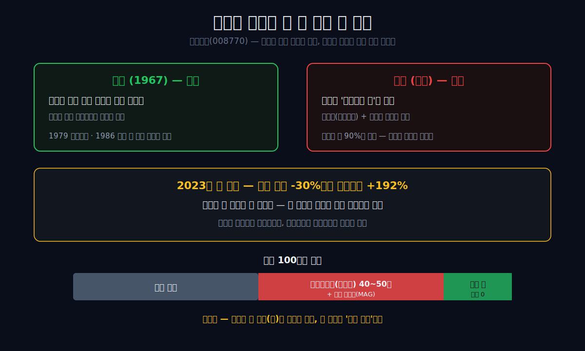
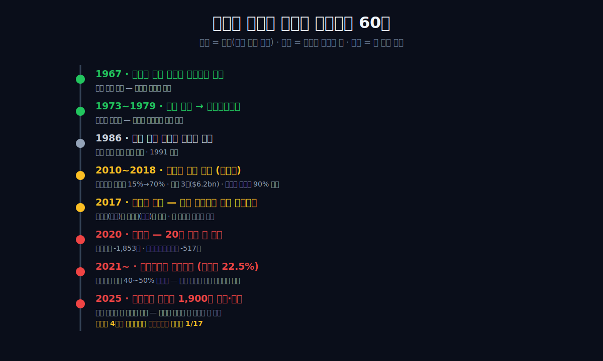
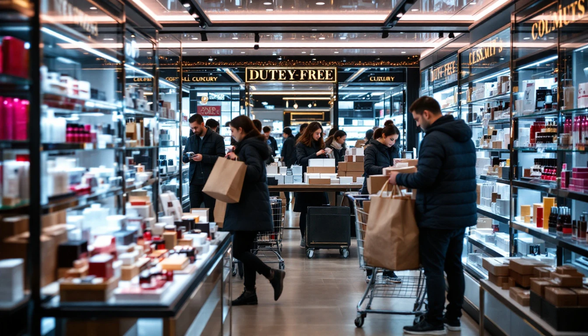
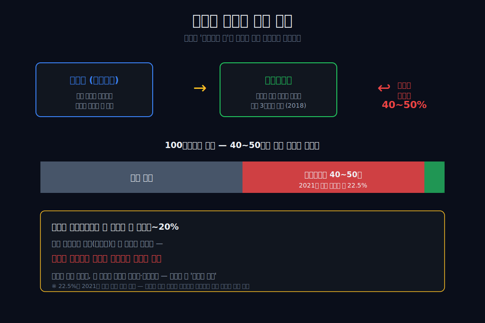
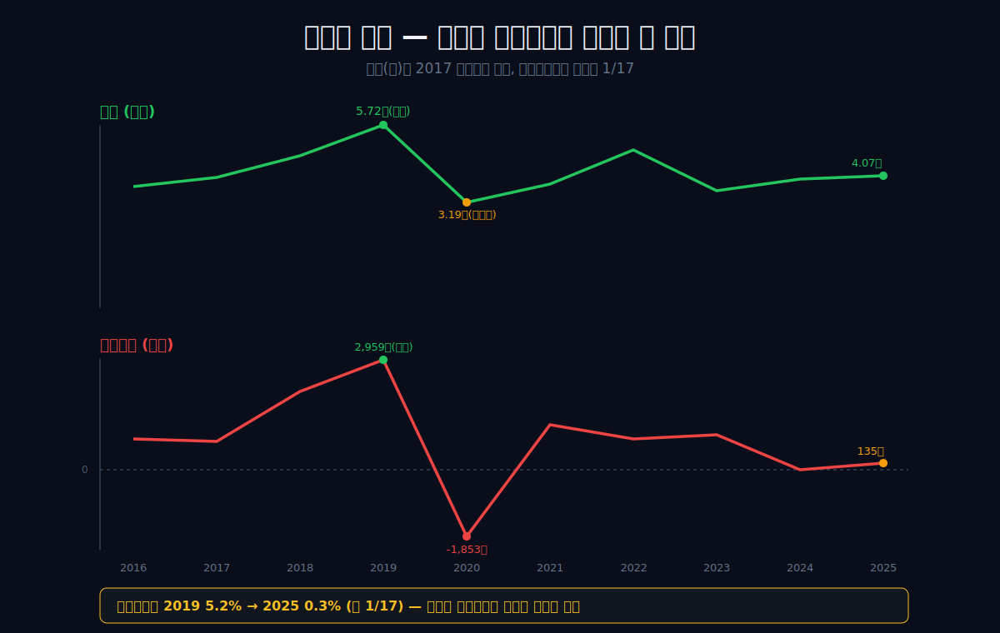
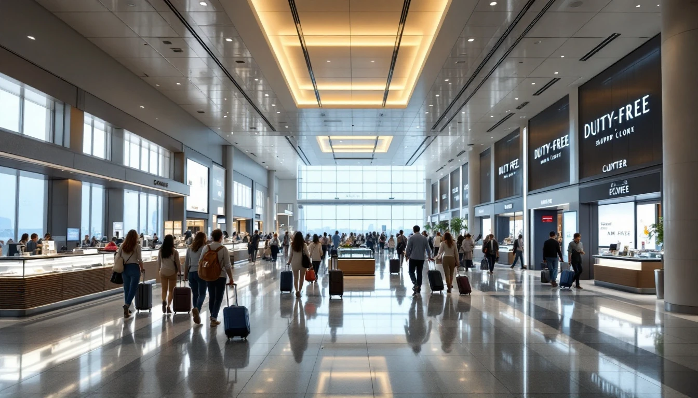
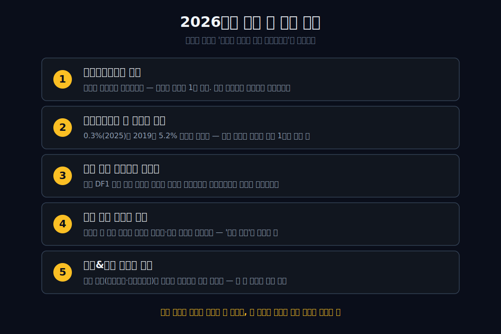

<script>
import ComboChart from '$lib/components/blog/ComboChart.svelte';
import StackBar from '$lib/components/blog/StackBar.svelte';
</script>

> **데이터 기준**: 2026-06-13 dartlab 실측 — 호텔신라(008770) **연결 재무제표(CFS)** 기준. 매출의 약 90%가 면세(TR) 부문, 나머지가 호텔&레저(신라호텔·신라스테이).
>
> **핵심 숫자**: 매출 **4.07조** (2019 정점 5.72조 미회복) · 영업이익 **+135억** (2019 정점 2,959억의 **1/17**) · 2025 당기순이익 **-1,728억** · 부채비율 **220%**
>
> **이 글의 용어**: 면세(TR) = 공항·시내 면세점 사업 · 따이공(代購) = 한국 면세점에서 물건을 대량으로 사 중국에 되파는 보따리상 · 송객수수료 = 따이공·여행사가 손님을 데려오면 면세점이 매출의 일정 비율을 떼어 주는 커미션 · MAG(최소보장임대료) = 공항 면세 자리를 빌리며 매출과 무관하게 내는 고정 임대료 · 영업이익 = 본업에서 번 이익 · 당기순이익 = 영업외 손익·세금까지 다 합친 최종 이익.

---

## 프롤로그 — 손님이 줄었는데 더 벌었다

2023년, 신라면세점의 어느 분기 매출은 전년보다 **30% 줄었다**. 그런데 그 분기 면세 부문 영업이익은 오히려 **세 배 가까이(약 +192%)** 뛰었다. 장사가 안 됐는데 더 벌었다. 오타가 아니다. 이 회사는 어느새 **손님이 많을수록 가난해지고, 손님이 사라질수록 부유해지는** 이상한 가게가 되어 있었다.

시작은 정반대였다. 1967년, 박정희 정부는 외국 귀빈을 맞으려고 **영빈관**을 지었다. 손님을 환대하기 위해 태어난 건물이다. 그 건물을 삼성이 인수해 1979년 신라호텔이 됐고, 1986년 호텔 안에 면세점 카운터 하나가 생겼다. 그리고 56년 뒤, 그 후예인 회사는 손님이 *안 와야* 웃었다.

어떻게 손님 맞으려 태어난 회사가, 손님이 줄어야 돈을 버는 회사가 됐을까?

관통선은 하나다. **"매출은 자기 장부에 멀쩡히 남았는데, 왜 이익은 손님과 함께 남의 손으로 떠났는가?"**

답을 먼저 쓴다. 호텔신라의 매출은 약 90%가 면세점에서 나온다. 그리고 그 면세점은 손님을 *직접* 맞지 않는다. 손님을 *데려오는 자* — 따이공(보따리상)과 공항 — 이 그 사이에 있다. 따이공에게는 정가의 절반에 가까운 송객수수료를, 공항에는 매출과 무관한 고정 임대료를 낸다. 그래서 매출은 신라의 장부에 찍히지만, 그 매출에서 남아야 할 이익은 손님을 데려온 자들의 주머니로 흘러간다. **매출(양)을 빼앗긴 회사도, 단가를 빼앗긴 회사도 아니다 — 매출에서 누가 이익을 가져가느냐, 그 귀속을 빼앗긴 회사다.**



---

## 1막 — 국가가 손님 맞으려 지은 집 (1967~1979)

**왜 영빈관에서 시작하나.** 호텔신라의 출생증명서는 호텔이 아니라 *국가의 환대*다. 1967년, 정부는 외국 국빈을 맞을 숙소로 장충동에 영빈관을 지었다. 1973년 7월 국세청이 이 국유 영빈관 매각을 결정하자 삼성이 인수했고, 같은 해 11월 회사 이름을 '㈜호텔신라'로 바꿨다. '신라'는 천년 왕조의 찬란한 문화에서 따온 이름이다.

1979년 3월, 창업주 이병철의 지시로 서울신라호텔이 문을 열었다. 손님을 맞이하는 것 — 그것이 이 회사의 본업이자 DNA였다. 1973년에 인수한 한옥 영빈관은 지금도 호텔의 연회장으로 남아 있다(이부진 대표의 취임식도 이 영빈관 에메랄드홀에서 열렸다).


이 막의 끝에서 다음 막의 씨앗이 심긴다. 손님을 맞이하던 호텔 안에, 작은 카운터 하나가 생긴다.

---

## 2막 — 카운터 하나 (1986~2009)

**왜 면세점이 중요해지나.** 1986년, 서울신라호텔 안에 신라면세점이 문을 열었다. 처음엔 호텔에 묵는 외국 손님을 위한 부대시설, 환대 본업 곁의 작은 사업이었다. 1991년 호텔신라는 한국거래소에 상장한다 — 지금도 국내에서 거의 유일하게 상장된 호텔 회사다.

이 작은 면세 카운터가 훗날 호텔 본체를 통째로 삼킬 것이라고는, 당시엔 아무도 몰랐다. 씨앗이 자라려면 거대한 외부의 비가 필요했다. 그 비는 2010년대에 중국에서 내린다.

이 막의 끝에서 다음 막으로 넘어간다. 중국이 문을 열어 준다.

---

## 3막 — 중국이 열어 준 문 (2010~2018)

**왜 면세가 호텔을 삼켰나.** 2010년대 중국 관광객과 한류가 한국 면세 시장을 폭발시켰다. 시내 면세점에서 중국인이 차지하는 비중은 2011년 약 15%에서 2014년 약 70%로 뛰었다. 2010년 한국은 영국을 제치고 세계 1위 면세 시장에 올랐다. 한류 스타가 면세점 광고 모델이 되고, K뷰티가 그 매대를 채웠다. 그 매대를 채운 K뷰티의 글로벌 유통은 [실리콘투](/blog/257720-silicon2), 제조는 [콜마](/blog/161890-kolmar) 같은 기업이 받쳤다.

신라면세점은 이 파도를 타고 글로벌로 나갔다. 2014년 싱가포르 창이공항 향수·화장품 사업권을 따내며(기존 사업자를 제치고) 해외 성년식을 치렀고, 2018년에는 매출 약 62억 달러로 **세계 3위** 면세 사업자에 올랐다. 1986년 호텔 안 카운터 하나가, 약 30년 만에 세계 톱3가 된 것이다.

### 자리를 차지하는 전쟁, 손님을 사오는 전쟁

이 성장은 거저 온 게 아니라 두 개의 전쟁 위에 있었다. 하나는 *자리*를 차지하는 전쟁이었다. 2014년 신라는 싱가포르 창이공항 향수·화장품 사업권을 기존 사업자를 제치고 따내며 해외 무대에 올랐고, 2015년에는 국내 시내면세점 특허 전쟁이 벌어졌다. 신라는 현대산업개발과 손잡은 합작사(HDC신라)로 서울 용산 아이파크몰 특허를 따냈고, 같은 해 말 두산·신세계가 새로 진입하고 롯데 월드타워점과 SK워커힐이 탈락하면서, 면세 시장은 롯데·신라 양강 구도에서 여러 사업자가 다투는 구도로 재편됐다.

다른 하나는 *손님*을 사오는 전쟁이었다. 자리가 늘어날수록 그 자리를 채워 줄 중국 손님은 한정돼 있었고, 그 손님을 데려오는 따이공의 몸값(송객수수료)은 경쟁이 격해질수록 함께 뛰었다. 두 전쟁은 같은 동전의 양면이었다 — 자리를 얻는 비용과 손님을 얻는 비용이 동시에 오르면서, 매출은 커졌지만 그 매출에서 남길 몫은 점점 얇아졌다.

그 사이 무게중심이 완전히 넘어갔다. **호텔신라 매출의 약 90%가 면세(TR)에서 나오게 됐다.** '호텔 회사'가 사실상 '면세 회사'가 된 것이다. 2010년 12월, 이건희 회장의 장녀 이부진이 대표이사 사장에 취임했다(취임식은 그 영빈관 에메랄드홀에서 열렸다). 그는 훗날 신규 면세점 입찰을 앞두고 직원들에게 이렇게 말한다 — **"사업 선정이 잘되면 다 여러분 덕이고, 떨어지면 내 탓이니 걱정하지 말라."**

> **여기서 멈칫**: 고급 호텔의 정체성을 가진 회사가, 알고 보니 매출의 90%를 면세점에서 — 그것도 상당 부분을 보따리상에게 — 의존하고 있었다.



이 막의 끝에서 다음 막의 질문이 정해진다. 중국이 열어 준 문은, 중국이 닫을 수도 있다.

---

## 4막 — 사드의 역설 (2017)

**왜 위기에도 매출이 사상 최대였나.** 2017년 사드 배치에 중국이 단체관광 판매를 막았다. 관광버스를 타고 오던 요우커(중국 단체관광객)가 사라졌다. 그런데 그해 한국 면세 매출은 오히려 **+20.7%, 약 128억 달러로 사상 최대**였다. 외국인 매출 비중은 85.9%까지 올랐다.

방한 중국인은 사드 직후 800만 명대에서 400만 명대로 거의 반토막 났는데도 면세 매출은 오히려 늘었다 — 사람(관광객)과 매출(따이공 물량)이 따로 노는 구조가 이때 굳어졌다.

비밀은 따이공이었다. 단체관광객(사람)이 사라진 자리를, 한국 면세점에서 물건을 대량으로 사 중국에 되파는 **전문 보따리상(따이공)**이 메웠다.

 위기처럼 보였던 사드는, 사실 더 위험한 모델로의 전환을 가린 장막이었다. 회사는 *손님을 맞이하는* 사업에서 *물량을 사 가는 중간상에 의존하는* 사업으로 조용히 옮겨갔다.

이 막의 끝에서 다음 막으로 넘어간다. 그 중간상에게, 회사는 얼마를 내야 했나?

---

## 5막 — 절반을 남에게 주는 가게

**왜 팔아도 남지 않나.** 따이공은 공짜로 물건을 사 가지 않았다. 면세점들은 따이공과 그들을 데려오는 여행사에 **송객수수료**를 줬다 — 손님을 데려오면 매출의 일정 비율을 떼어 주는 커미션이다. 경쟁이 과열되면서 이 수수료는 정가의 **40~50%**까지 치솟았다. 100원어치를 팔면 4~50원을 손님 데려온 자에게 주는 셈이다.



이게 왜 치명적인가. 면세업의 영업이익률은 잘 나와야 한 자릿수~20% 수준이다. 손님을 데려오는 비용(수수료)이 그 마진을 넘어서면, **매출을 늘릴수록 이익이 줄어드는** 구조가 된다. 한 보도에 따르면 2021년 송객수수료는 면세 매출의 약 **22.5%**까지 차지했다(특정 시점의 외부 인용 수치이며, 회사가 비용 항목을 분기별로 공개하지 않아 추세는 단정하기 어렵다).

분명한 것은 매출과 이익 사이에 *구멍*이 생겼다는 것이다. 매출은 신라의 장부에 찍히지만, 그 매출에서 남아야 할 돈은 손님을 데려온 따이공과 자리를 빌려준 공항으로 샌다. 이것이 관통선이 말한 **'마진의 귀속'을 빼앗긴** 상태다.

게다가 그 '갑'은 시간이 갈수록 더 강해졌다. 2019년 중국이 전자상거래법을 시행해 따이공에게 사업자 등록과 관세 신고를 의무화하자, 개인 보따리상은 줄고 그 자리를 소수의 *기업형 따이공*이 차지했다. 면세점이 상대해야 할 따이공의 수가 줄고 덩치가 커질수록, 협상의 칼자루는 더욱 따이공 쪽으로 넘어갔다. 손님을 데려오는 자가 적어질수록 그들에게 줘야 할 몫은 오히려 커지는 — 또 하나의 역설이다.

이 막의 끝에서 다음 막으로 넘어간다. 그 구멍은 손익계산서에서 어떤 모양으로 보이는가?

---

## 6막 — 숫자의 가위

**왜 매출은 돌아왔는데 이익은 안 돌아오나.** 9년 손익을 펼치면, 매출선과 이익선이 점점 벌어지는 *가위* 모양이 보인다. (매출은 키웠는데 이익이 사라지는 패턴은 유통의 [이마트](/blog/139480-emart)에서도 봤지만, 신라는 원인이 인수·부채가 아니라 채널 수수료다.)

```python
import dartlab
c = dartlab.Company("008770")
c.select("IS", ["매출액", "영업이익", "당기순이익"], freq="Y")
```

| 항목 (1년치 합산, 억원) | 2025 | 2024 | 2023 | 2022 | 2021 | 2020 | 2019 | 2018 | 2017 | 2016 |
|---|---:|---:|---:|---:|---:|---:|---:|---:|---:|---:|
| 매출액 | 40,683 | 39,476 | 35,685 | 49,220 | 37,791 | 31,881 | **57,173** | 47,137 | 40,115 | 37,153 |
| 영업이익 | 135 | -52 | 912 | 783 | 1,188 | **-1,853** | **2,959** | 2,091 | 731 | 790 |
| 당기순이익 | **-1,728** | -615 | 1,223 | -308 | 414 | -2,833 | 1,694 | 1,103 | 253 | 278 |

표시: 매출은 2025년 **4조 683억**으로 2017년(4조 115억) 수준으로 돌아왔다. 그런데 영업이익은 2019년 정점 **2,959억**에서 2025년 **135억** — 1/22로 쪼그라들었다. 영업이익률로 보면 2019년 **5.2%**에서 2025년 **0.3%**, 약 1/17이다. 매출(양)은 돌아왔는데 이익은 안 돌아온 것이다. (2019년 정점 5.72조에는 매출조차 아직 못 미친다.)



코로나가 가린 진실도 여기 있다. 2020년 영업손실 **-1,853억**, 영업활동현금흐름마저 **-517억**으로 무너진 것은 누구나 "코로나 탓"으로 읽는다. 그러나 외부 충격이 끝나고 매출이 4조로 돌아온 **2024년(-52억)·2025년(영업 +135억, 순손실 -1,728억)**에도 이익이 안 나는 것은, 사건이 아니라 *구조*가 만든 결과다.

### 영업이익과 당기순이익은 따로 읽어야 한다

2025년 숫자를 정직하게 나눠 보자. **영업이익은 +135억으로 흑자**다 — 본업(면세+호텔)은 손익분기 부근에서 진동한다. 그런데 **당기순이익은 -1,728억 적자**다. 이 큰 차이는 본업이 아니라 영업외 손익·구조조정에서 왔다(뒤에 볼 인천공항 면세 자리 철수 같은). 그래서 "호텔신라가 체질적으로 적자 회사"라고 단정하면 거짓이다. 정확히는 — **본업은 거의 못 벌고, 거기에 발을 빼는 비용까지 겹쳤다.** 게다가 호텔과 면세점은 모두 막대한 임차료를 떠안는 사업이라(부채비율 약 220%), 매출이 흔들려도 임대료·인건비 같은 고정비는 그대로 나간다. 이익이 얇은 회사가 고정비까지 무거우면, 작은 매출 변동도 손익을 크게 흔든다.

이 막의 끝에서 가장 이상한 장면으로 넘어간다. 이 회사는, 매출을 *줄여야* 돈을 번다.

---

## 7막 — 매출을 버려야 돈 버는 가게

**왜 매출을 줄이는 게 전략인가.** 프롤로그의 그 분기로 돌아가자. 2023년 어느 분기, 신라면세점 매출은 30% 줄었는데 그 부문 영업이익은 세 배 가까이(약 +192%) 뛰었다. (단일 분기의 비율이라 전년 기저가 낮았던 효과가 섞여 있다 — 추세로 과장하면 안 된다.) 그럼에도 이 한 분기가 드러낸 진실은 분명하다. **따이공에게 주는 송객수수료를 줄이면 — 즉 그 매출을 포기하면 — 이익이 늘었다.** 그 매출이 이익을 깎고 있었다는 자백이다.

전략은 더 극단으로 간다. 2025년 호텔신라는 인천공항 면세 사업장(DF1) 자리를 지키기 위해 냈던 **보증금 약 1,900억 원을 포기**하고 철수를 택했다. 공항의 고정 임대료(MAG)가 그 자리에서 나올 매출의 가치보다 컸기 때문이다.

 매출이 찍히는 자리를, *돈을 버리면서까지* 떠난 것이다 — 매출을 늘리는 게 아니라 *줄이는* 게 생존이 된 회사.

이 막의 끝에서 산업 전체로 시야를 넓힌다.

---

## 산업 패턴 — 한국 면세업은 왜 다 같이 아픈가

**왜 호텔신라만의 문제가 아닌가.** 따이공·송객수수료·공항 임대료(MAG)에 이익을 빼앗기는 구조는 신라만의 일이 아니다. 롯데면세점·신세계면세점도 같은 덫에 걸려 있다. 손님을 *데려오는 자*에게 매출의 절반 가까이를 내고, 자리를 *빌려주는 자*(공항)에게 고정비를 내는 구조는 한국 면세 산업 전체가 공유한다. 그 결과 국내 면세 시장 규모는 2019년 약 24.85조에서 2022년 약 17.7조로 7년 만에 반토막 났다.

그래서 면세업의 진짜 문제는 "중국 손님이 줄어서"가 아니다. 손님이 돌아와도 그 손님을 *데려오는 비용*이 마진을 넘으면 이익이 안 난다. 채널(따이공·공항)이 '갑'인 한, 매출은 면세점 장부에 찍혀도 이익은 채널이 가져간다.

그렇다면 호텔신라만의 고유함은 어디 있나. **출생(국가의 영빈관, 환대)과 생존(무인에 가까운 따이공 중개)의 정반대 좌표**, 그리고 **호텔(환대 본업)과 면세(중개)가 한 회사 안에 동거한다는 점**이다. 롯데·신세계에는 이 출생 신화도, 이 한 몸 동거도 없다. 중국이라는 같은 외부 변수에 운명이 묶인 회사로는 중국이 *고객*이었던 [아모레퍼시픽](/blog/090430-amorepacific)과 중국이 *경쟁자*였던 [LG디스플레이](/blog/034220-lg-display)가 있다 — 셋 다 마진이 무너졌지만 무너진 길은 다르다(아모레는 양, LGD는 단가, 신라는 이익의 귀속에서).

이 막의 끝에서 마지막 막으로 넘어간다.

---

## 8막 — 손님 받을 자리값마저 버리다

**그래서 이 회사는 무슨 회사가 됐나.** 2025년의 성적표를 다시 보자. 본업(영업이익)은 +135억으로 간신히 흑자지만, 최종 손익(당기순이익)은 -1,728억 적자다. 그 적자의 큰 부분은 인천공항 면세 자리에서 발을 빼며(보증금 1,900억 포기) 치른 비용에서 왔다. 손님이 사라질수록 이익이 나던 그 '마법' — 매출을 줄이고 수수료를 끊어 이익을 지키던 방식 — 은 결국 한계에 부딪혔다. 줄일 매출도, 떠날 자리도 비용이 들기 때문이다.

국가가 손님을 맞으려 지은 영빈관에서 태어난 회사가, 이제 손님을 받을 자리값마저 버리고 있다. 이부진 대표가 입찰을 앞두고 했던 말 — **"잘되면 여러분 덕, 떨어지면 내 탓"** — 은 이 적자의 계절에 다시 떠오른다. 잘되던 시절의 매출은 따이공이 만들어 줬고, 그 매출의 이익도 따이공이 가져갔다. 그리고 그 모델이 꺾이자, 책임은 회사에 남았다.

역설적이게도, 이 회사가 처음 시작한 그 본업 — 손님을 직접 맞는 호텔 — 은 여전히 조용히 돌아가고 있다. 신라호텔과 비즈니스호텔 신라스테이는 면세만큼 폭발하지도, 면세만큼 무너지지도 않았다. 따이공도 송객수수료도 없이 방값을 받고 손님을 직접 맞는 사업이기 때문이다. 면세가 중국 한 채널의 출렁임에 통째로 흔들리는 동안, 환대 본업은 그 변동성을 받쳐 주는 작은 닻이었다. 한 회사 안에 환대(직접)와 중개(간접)가 동거한다는 것 — 그것이 호텔신라의 약점이자, 어쩌면 마지막 보루다.

**매출은 자기 장부에 남았으나, 이익은 손님과 함께 남의 손으로 떠났다.** 손님을 맞이하려 태어난 회사가, 손님을 *데려오는 자*에게 운명을 맡긴 대가다. 호텔신라의 다음 시험은 매출을 늘리는 게 아니라 — **그 매출의 이익을 자기 손으로 되찾을 수 있느냐**다. 직접 맞는 손님(내국인·자체 채널·호텔 본업)을 얼마나 키우느냐에, 영빈관에서 시작한 이 회사의 다음 장이 달려 있다.

---

## 2026년에 봐야 할 다섯 가지

1. **송객수수료율의 방향** — 따이공에게 주는 커미션이 줄어드는가. 이 비용이 면세업 이익의 1번 변수다. 업계 공동의 수수료 자제 움직임이 실제 마진으로 돌아오는지.
2. **영업이익률의 한 자릿수 회복** — 0.3%(2025)가 2019년 5.2% 쪽으로 돌아가는가. 매출 규모가 아니라 *매출 1원당 남는 돈*이 핵심이다.
3. **공항 면세의 구조조정 마무리** — 인천 DF1 철수 같은 일회성 비용이 끝나고 본업 손익만 남는 시점. 영업이익과 당기순이익의 격차가 좁혀지는지.
4. **중국 단체관광·내국인·해외 채널의 균형** — 따이공 한 채널 의존을 줄이고 직접 맞는 손님을 늘리는가. '마진 귀속'을 되찾는 유일한 길.
5. **호텔&레저 부문의 비중** — 환대 본업(신라호텔·신라스테이)이 면세의 변동성을 얼마나 받쳐 주는가. 한 몸 동거의 다른 쪽 다리.



---

## 검증표

본문의 모든 인용 수치를 dartlab 호출과 결과로 검증한다. 외부 출처 수치는 "외부 인용"으로 분리한다. 📅 dartlab 실측 2026-06-13 · 호텔신라(008770) 연결(CFS) 기준.

| 본문 수치 | 출처 / dartlab 호출 | 결과 |
|---|---|---|
| 매출 2019 5.72조(정점) · 2025 4.07조(2017 4.01조 수준) | `c.select("IS",["매출액"],freq="Y")` | ✓ 실측 |
| 영업이익 2019 2,959억(정점) → 2025 135억 (영업이익률 5.2%→0.3%) | `c.select("IS",["영업이익","매출액"],freq="Y")` | ✓ 실측 |
| 2020 영업손실 -1,853억 · 영업활동현금흐름 -517억 | `c.select("IS",["영업이익"]) + c.select("CF",["영업활동현금흐름"],freq="Y")` | ✓ 실측 |
| 2025 영업이익 +135억(흑자) vs 당기순이익 -1,728억(영업외·구조조정) | `c.select("IS",["영업이익","당기순이익"],freq="Y")` | ✓ 실측 |
| 부채비율 약 220% (부채 24,352억 / 자본 11,062억, 2025) | `c.select("BS",["부채총계","자산총계"],freq="Y")` | ✓ 실측 |
| 1967 영빈관 · 1979 서울신라호텔 · 1986 신라면세점 · 1991 상장 | 회사 연혁·백과 | 외부 인용 |
| 중국인 시내면세 비중 15%(2011)→70%(2014) · 2010 한국 세계1위 면세시장 | 언론 | 외부 인용 |
| 신라면세점 세계 3위 ($6.2bn, 2018) · 2014 창이공항 수주 | 언론 | 외부 인용 |
| 사드(2017) 단체관광 차단에도 면세 +20.7% $12.8bn · 외국인 85.9% | 언론 | 외부 인용 |
| 송객수수료 따이공 정가 40~50% · 면세 매출의 22.5%(2021, 단일 시점) | 언론 | 외부 인용 |
| 2023 한 분기 면세 매출 -30%인데 영업익 +192% (단일 분기·기저효과) | 언론 | 외부 인용 |
| 2025 인천공항 DF1 보증금 약 1,900억 포기·철수 | 회사 공시·언론 | 외부 인용 |
| 국내 면세 시장 2019 24.85조 → 2022 17.7조 | 언론 | 외부 인용 |
| 이부진 2010.12.14 대표 취임(영빈관 에메랄드홀)·발언 인용 | 언론 | 외부 인용 |

본문의 숫자 중 이 표에 없는 것은 발행 차단 대상이다.

---

<!-- AUTO:START — sync_financials.py가 자동 생성. 수동 편집 금지 -->


## 공시 자료

| 기간 | 보고서 | 링크 |
|------|--------|------|
| 2026 | 분기보고서 | [DART에서 보기](https://dart.fss.or.kr/dsaf001/main.do?rcpNo=20260515002154) |
| 2025 | 사업보고서 | [DART에서 보기](https://dart.fss.or.kr/dsaf001/main.do?rcpNo=20260311004398) |
| 2025 | 분기보고서 | [DART에서 보기](https://dart.fss.or.kr/dsaf001/main.do?rcpNo=20251114002871) |
| 2025 | 반기보고서 | [DART에서 보기](https://dart.fss.or.kr/dsaf001/main.do?rcpNo=20250814003355) |
| 2025 | 분기보고서 | [DART에서 보기](https://dart.fss.or.kr/dsaf001/main.do?rcpNo=20250515002537) |
| 2024 | 사업보고서 | [DART에서 보기](https://dart.fss.or.kr/dsaf001/main.do?rcpNo=20250515002269) |
| 2024 | 사업보고서 | [DART에서 보기](https://dart.fss.or.kr/dsaf001/main.do?rcpNo=20250312000909) |
| 2024 | 분기보고서 | [DART에서 보기](https://dart.fss.or.kr/dsaf001/main.do?rcpNo=20241114003025) |
| 2024 | 반기보고서 | [DART에서 보기](https://dart.fss.or.kr/dsaf001/main.do?rcpNo=20240814003792) |
| 2024 | 분기보고서 | [DART에서 보기](https://dart.fss.or.kr/dsaf001/main.do?rcpNo=20240516001732) |

> 전체 공시 목록은 dartlab에서 확인:
> ```python
> import dartlab
> c = dartlab.Company("008770")
> c.filings()
> ```

## 재무제표 — 최근 5개년

> 아래는 최근 5개년 요약입니다. 전체 기간·분기별 데이터는 dartlab에서 직접 확인할 수 있습니다:
> ```python
> import dartlab
> c = dartlab.Company("008770")
> c.show("IS")              # 손익계산서 (분기)
> c.show("IS", freq="Y")    # 손익계산서 (연간)
> c.show("BS")              # 재무상태표
> c.show("CF")              # 현금흐름표
> c.show("SCE")             # 자본변동표
> c.show("ratios")          # 재무비율
> ```

### 손익계산서 (IS) — 단위 억원

<ComboChart data={[{year:"2026Q1",매출액:10535,영업이익:204,당기순이익:60},{year:"2025",매출액:40683,영업이익:135,당기순이익:-1728},{year:"2024",매출액:39476,영업이익:-52,당기순이익:-615},{year:"2023",매출액:35685,영업이익:912,당기순이익:1223},{year:"2022",매출액:49220,영업이익:783,당기순이익:-308}]} lineKeys={["매출액"]} barKeys={["영업이익","당기순이익"]} lineColors={["#22c55e"]} barColors={["#3b82f6","#f59e0b"]} title="매출(라인) vs 영업이익·당기순이익(막대)" unit="억원" />

| 항목 | 2026Q1 | 2025 | 2024 | 2023 | 2022 |
|---|---:|---:|---:|---:|---:|
| 매출액 | 10,535 | 40,683 | 39,476 | 35,685 | 49,220 |
| 매출원가 | — | — | — | — | — |
| 매출총이익 | — | — | — | — | — |
| 판매비와관리비 | — | — | — | — | — |
| 영업이익 | 204 | 135 | -52 | 912 | 783 |
| 금융수익 | — | — | — | — | — |
| 금융비용 | 130 | 573 | 618 | 20 | 850 |
| 당기순이익 | 60 | -1,728 | -615 | 1,223 | -308 |

### 재무상태표 (BS) — 단위 억원

<StackBar data={[{year:"2026Q1",segments:[{label:"부채",value:22520,color:"#ef4444"},{label:"자본",value:0,color:"#22c55e"}]},{year:"2025",segments:[{label:"부채",value:24352,color:"#ef4444"},{label:"자본",value:0,color:"#22c55e"}]},{year:"2024",segments:[{label:"부채",value:25295,color:"#ef4444"},{label:"자본",value:0,color:"#22c55e"}]},{year:"2023",segments:[{label:"부채",value:23980,color:"#ef4444"},{label:"자본",value:0,color:"#22c55e"}]},{year:"2022",segments:[{label:"부채",value:23988,color:"#ef4444"},{label:"자본",value:0,color:"#22c55e"}]}]} title="부채 vs 자본 구조" unit="억원" />

| 항목 | 2026Q1 | 2025 | 2024 | 2023 | 2022 |
|---|---:|---:|---:|---:|---:|
| 자산총계 | 33,667 | 35,414 | 38,139 | 30,065 | 29,385 |
| 유동자산 | 12,506 | 14,011 | 14,109 | 13,802 | 14,788 |
| 비유동자산 | 21,161 | 21,403 | 24,030 | 16,263 | 14,597 |
| 부채총계 | 22,520 | 24,352 | 25,295 | 23,980 | 23,988 |
| 유동부채 | 13,878 | 12,980 | 11,500 | 11,885 | 13,060 |
| 비유동부채 | 8,641 | 11,373 | 13,796 | 12,096 | 10,928 |
| 자본총계 | — | — | — | — | — |

### 현금흐름표 (CF) — 단위 억원

<ComboChart data={[{year:"2026Q1",영업CF:536,투자CF:576,재무CF:-2035},{year:"2025",영업CF:1036,투자CF:-1036,재무CF:-301},{year:"2024",영업CF:687,투자CF:-953,재무CF:-298},{year:"2023",영업CF:2425,투자CF:-2314,재무CF:-1379},{year:"2022",영업CF:2205,투자CF:-807,재무CF:1460}]} barKeys={["영업CF","투자CF","재무CF"]} barColors={["#22c55e","#ef4444","#3b82f6"]} title="영업·투자·재무 현금흐름" unit="억원" />

| 항목 | 2026Q1 | 2025 | 2024 | 2023 | 2022 |
|---|---:|---:|---:|---:|---:|
| 영업활동현금흐름 | 536 | 1,036 | 687 | 2,425 | 2,205 |
| 투자활동현금흐름 | 576 | -1,036 | -953 | -2,314 | -807 |
| 재무활동현금흐름 | -2,035 | -301 | -298 | -1,379 | 1,460 |

*최종 갱신: 2026-06-13 | dartlab 실측 (DART 공시 기준)*

<!-- AUTO:END -->
