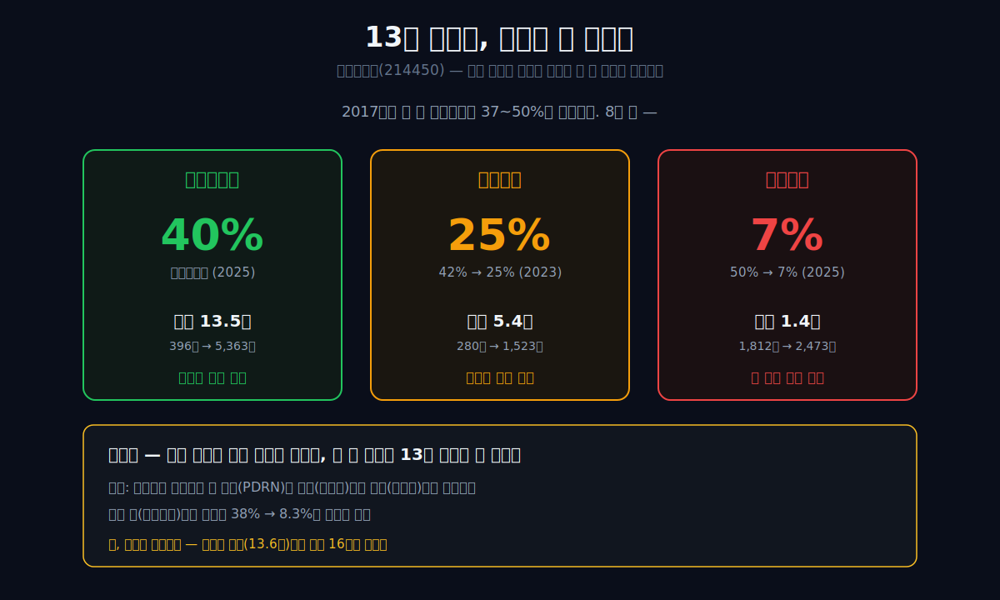
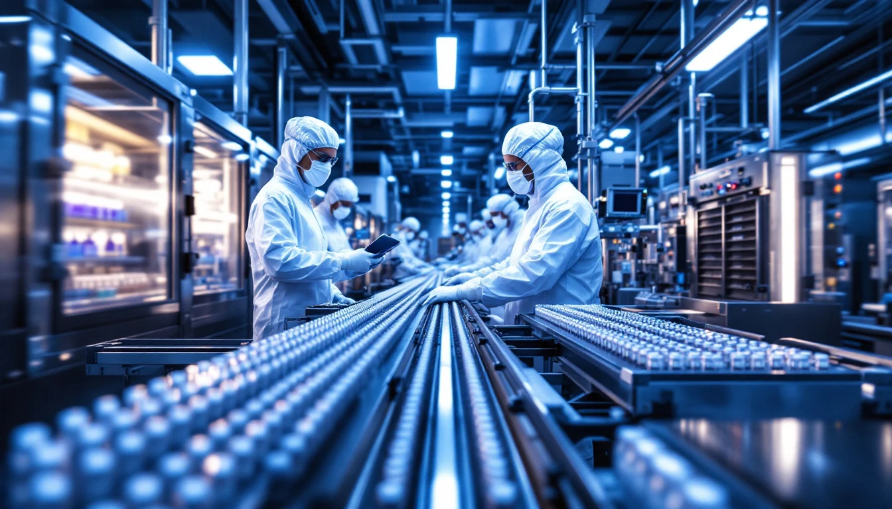
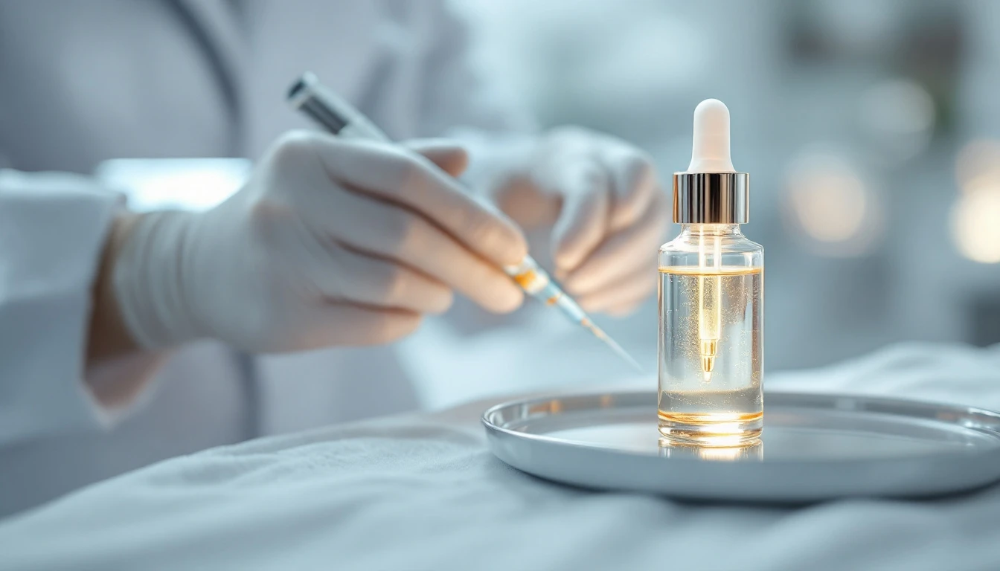
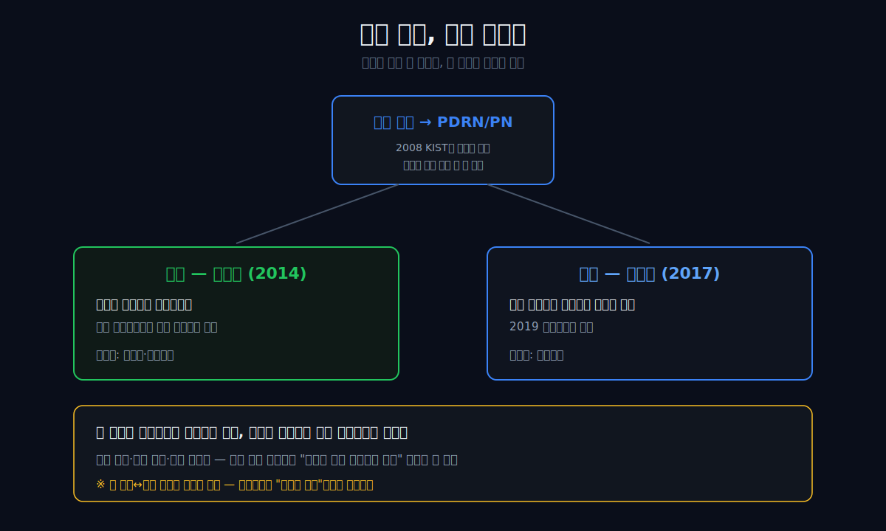
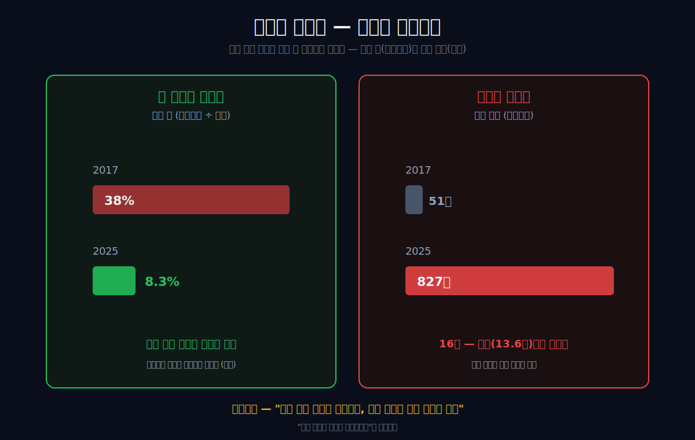
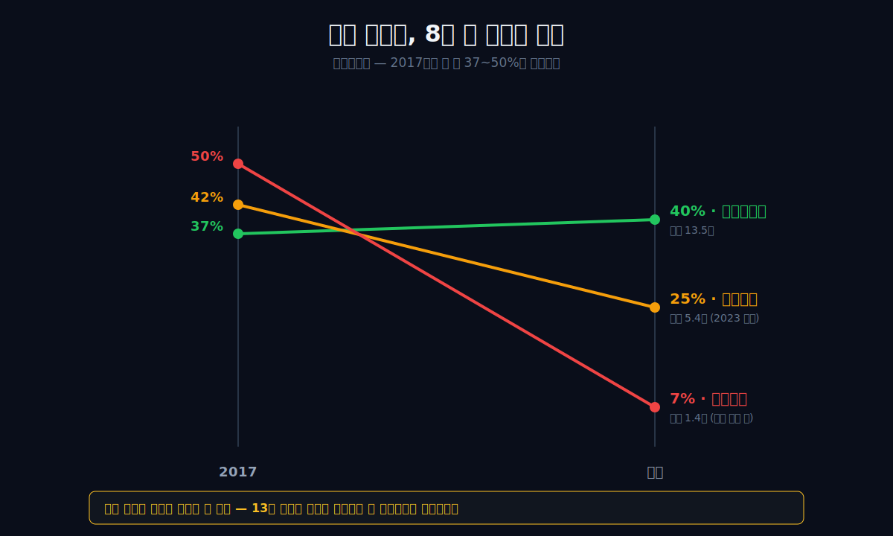
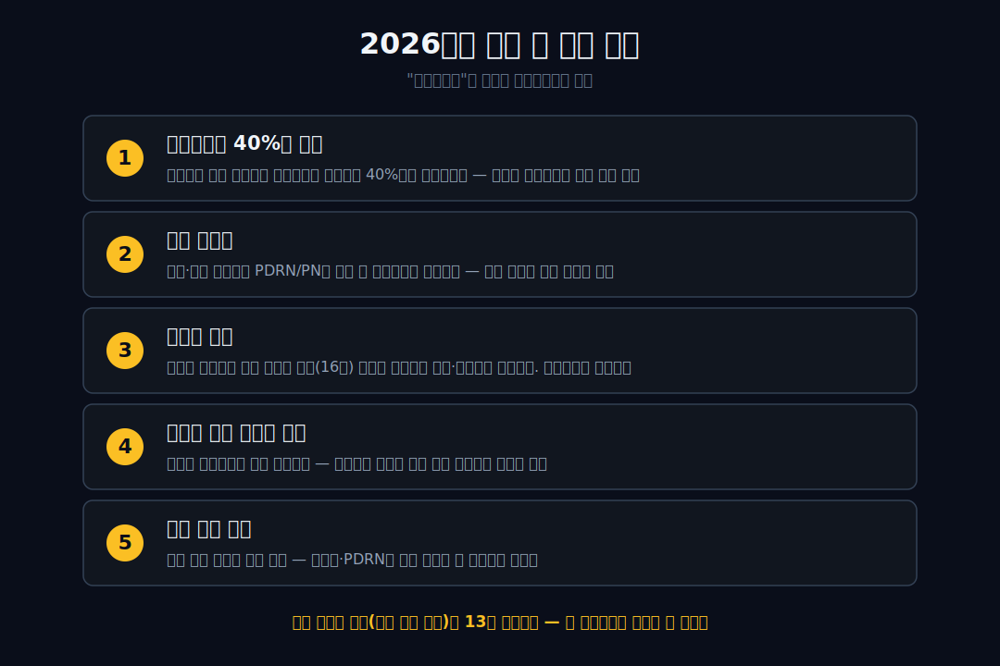

<script>
	import CompanyFinancials from '$lib/components/blog/CompanyFinancials.svelte';
</script>

> **데이터 기준**: 2026-06-13 dartlab 실측 — 파마리서치(214450) **연결 재무제표(CFS)** 기준. 비교사 휴메딕스(200670)·메디톡스(086900) 동일 기준. ※2017~2019년은 상장사 본체가 지주·투자회사 형태로 운영된 시기라 매출·마진 지표가 왜곡돼 있어, 제품 회사로 본격 가동한 2020년 이후를 깨끗한 비교 구간으로 본다.
>
> **핵심 숫자**: 매출 **5,363억** (2017 396억의 13.5배) · 영업이익 **2,144억** (영업이익률 40.0%) · 매출채권/매출 **8.3%** (2017 38%) · 영업현금흐름 **1,832억** · 자본총계 **7,239억**
>
> **이 글의 용어**: 영업이익률 = 매출에서 원가·판관비까지 빼고 남는 비율 · 매출총이익률 = 원가만 빼고 남는 비율 · 매출채권 = 팔았지만 아직 못 받은 돈(외상) · 운전자본 = 영업에 묶이는 돈(재고+매출채권-매입채무) · PDRN/PN = 연어 정소(이리)의 DNA에서 뽑은 조직재생 성분 · 스킨부스터 = 피부에 주사해 재생·보습을 돕는 미용 시술.

---

## 프롤로그 — 연어 한 마리에서 시작한 회사

연어가 강을 거슬러 오른다. 그 격렬한 여정을 견디려 제 몸에 미리 저장해 둔 것이 있다 — 상처를 빨리 아물게 하는 성분이, 비린내 나는 정소(이리) 속에. 2008년, 한 약사가 이 생선 부산물을 들여다보며 생각한다. *이탈리아의 어느 회사는 송어로 비슷한 걸 만들었다는데, 우리 연어로 만들면 어떨까.* 그는 완제품을 수입해 팔 수도 있었다. 대신 KIST와 함께 그 물질을 직접 만들기로 한다 — 빌리지 않고, 쥐기로.

17년 뒤, 그 한 줌의 물질은 연 매출 **5,363억 원**짜리 회사가 됐다. 매출은 2017년 396억에서 **13배**로 불었다. 그런데 같은 미용·고마진 바닥의 형제들을 옆에 세우면 이상한 일이 보인다. 휴메딕스는 매출이 5배 크는 동안 영업이익률(매출에서 원가·판관비 빼고 남는 비율)이 **42%에서 25%로** 내려갔고, 메디톡스는 **50%에서 7%로** 무너졌다. 빨리 크려면 가격을 깎고 외상을 떠안는 게 이 바닥의 법칙이기 때문이다. 그런데 파마리서치만은 13배로 크는 내내 영업이익률을 30~40%대로 *지켰고*, 받을 돈(매출채권)조차 매출의 38%에서 8%로 줄였다. 성장의 청구서가 한 장도 안 날아온 것처럼.

관통선은 하나다. **"미용 회사는 크면 마진을 잃는 게 법칙인데, 왜 이 회사만 13배로 크면서 안 잃었는가?"**

답을 먼저 쓴다. 답은 연어 한 마리를 *어디에 쓸지를 계속 바꾼* 데 있다. 파마리서치는 '제품'을 판 게 아니라, 연어에서 국산화한 한 분자(PDRN)를 쥔 채 같은 소재를 미용(리쥬란)에서 정형(콘쥬란)으로 갈아끼웠다. 한 시장이 가격경쟁에 들어가기 전에 인접한 진료실로 매출 무게중심을 옮길 수 있으면, 단일 제품 회사처럼 "가격을 깎아 점유율을 사는" 압력에 덜 노출된다. 단 — 뒤에서 보겠지만, 그 대가가 0이었던 것은 아니다.

이 회사의 숫자가 이상한 이유는 두 가지가 동시에 일어났기 때문이다. 첫째, 매출이 커졌다. 둘째, 그 매출을 만들기 위해 받아야 할 돈이 같이 커지지 않았다. 보통 고성장 소비재·미용 회사는 매출채권이 먼저 불어난다. 병의원과 대리점에 밀어 넣고, 나중에 돈을 받는다. 매출은 빨리 커지지만 장부 아래에는 받을 돈이 쌓인다. 파마리서치의 표는 반대로 움직였다. 매출은 13배로 커졌는데 매출채권/매출 비율은 38%에서 8.3%로 내려왔다. 성장했지만 외상을 덜 깔았다.

셋째, 그렇다고 청구서가 완전히 사라진 것도 아니다. 재고는 51억에서 827억으로 16배 늘었다. 받을 돈은 줄였지만 만들 물건은 더 많이 쌓았다. 이 글의 결론은 그래서 단순한 찬사가 아니다. 파마리서치는 성장 비용을 없앤 회사가 아니라, 성장 비용의 위치를 바꾼 회사다. 외상으로 성장하지 않았고, 재고와 자본정책으로 위험이 이동했다.

이 구분이 중요하다. "마진 40%"만 보면 완벽한 회사처럼 보인다. 그러나 좋은 블로그는 숫자의 빛나는 면보다 숫자의 이동 경로를 봐야 한다. 이 회사의 질문은 "마진이 높다"가 아니라 "왜 마진이 무너지지 않았고, 무너지지 않은 대가가 어디에 쌓였나"다.



---

## 1막 — 송어를 보고 연어를 떠올린 사람

**왜 이 회사는 제조가 아니라 '허가'에서 시작했나.** 창업자 정상수는 중앙대 약대를 나와 대웅제약에서 의약품 인허가를 담당했다. 1993년 그가 세운 파마리서치는 화장품 공장도, 제약 연구소도 아니었다 — **국내 최초의 의약품·의료기기 인허가 컨설팅 회사**였다. 출발점이 "물건을 만드는 손"이 아니라 "허가의 길을 아는 머리"였다는 사실이, 훗날 이 회사가 남들과 다르게 움직인 첫 단서다.

그 머리가 2000년대에 한 생선 부산물에 닿는다. 이탈리아 회사 마스텔리(Mastelli)가 송어에서 뽑은 조직재생 물질(PDRN)을 보고, 정상수는 "우리 연어로 만들자"고 착안한다. 발명의 0번지는 거대한 R&D가 아니라, *남이 송어로 한 걸 우리 자원으로 옮기자*는 한 줄의 생각이었다.


이 장면을 창업 미담으로만 읽으면 약하다. 더 중요한 것은 정상수가 처음부터 공장을 가진 사람이 아니라 허가의 길을 아는 사람이었다는 점이다. 미용·의료기기·의약품은 좋은 원료만으로 팔리지 않는다. 병원에서 쓰려면 허가가 필요하고, 원료를 등록해야 하며, 품목을 나누고, 사용처를 설계해야 한다. 파마리서치의 초기 능력은 "무엇을 만들까"보다 "무엇을 어떤 허가 경로로 시장에 올릴까"에 가까웠다.

그래서 연어는 단순한 원료가 아니다. 허가를 아는 사람이 자기 손에 쥔 플랫폼이다. 같은 물질도 어느 서류와 어느 진료실에 올리느냐에 따라 제품 이름, 가격, 경쟁자, 시장 크기가 달라진다. 파마리서치는 이 지점을 일찍 알았다. 송어를 보고 연어를 떠올렸다는 말은, 원료의 국산화뿐 아니라 허가 경로의 국산화를 뜻한다.

이 관점에서 보면 이후 리쥬란과 콘쥬란은 별개 제품이라기보다 같은 문법의 다른 문장이다. 한 문장은 피부과에서 읽히고, 다른 문장은 정형외과에서 읽힌다. 회사가 쥔 것은 한 제품의 성공이 아니라 같은 소재를 다른 규제·진료 맥락으로 옮기는 능력이었다.

이 막의 끝에서 다음 막의 갈림길이 열린다. 그는 그 물질을 *빌릴* 수도, *쥘* 수도 있었다.

---

## 2막 — 원료를 빌리지 않고 쥐기로 한 결정

**왜 수입해 팔지 않고 직접 만들었나.** 가장 쉬운 길은 마스텔리의 완제품을 수입해 파는 것이었다. 실제로 파마리서치는 2007년 마스텔리와 독점판매계약을 맺고 2008년 완제품(플라센텍스)을 허가받았다. 여기서 멈췄다면 평범한 수입 판매상이 됐을 것이다.

그런데 같은 해, 회사는 **KIST와 함께 연어 기반 PDRN을 국산화하는 연구**에 착수한다. 2009년 국내 최초로 해양자원 기반 PDRN 제조기술을 완성하고, 2013년 강릉에 GMP 공장을 지어 제조업 허가를 받았으며, 2014년 원료(DMF)를 등록했다.

 "도입"에서 "내가 만든다"로의 전환이다.

이 결정이 왜 중요한가. 미용·바이오 업계에서 *소재를 쥔다*는 것 자체는 드물지 않다 — 휴메딕스는 히알루론산(HA)을, 메디톡스는 보툴리눔 독소를 쥐었다. 자체 기술 플랫폼을 쥐고 큰 K-bio로는 [알테오젠](/blog/196170-alteogen)·[셀트리온](/blog/068270-celltrion)도 있다. 파마리서치의 차이는 그 소재를 **국산화로 새로 쥐었다**는 것, 그래서 그 위에 무엇을 올릴지를 스스로 정할 수 있었다는 데 있다. 빌린 원료로는 갈아끼우기를 할 수 없다.

공식 연혁도 이 흐름을 그대로 확인시켜 준다. 파마리서치 [회사 연혁](https://pharmaresearch.com/sub/about.html)은 2008년 PDRN 국산화 연구(KIST 협력), 2013년 강릉 GMP 공장 준공 및 제조업 허가, 2014년 PDRN DMF 등록과 리쥬란 발매, 2019년 콘쥬란 신의료기술 인증을 한 줄로 이어 놓는다. 이 네 줄은 제품 연표가 아니라 권리의 이동표다. 수입해 팔던 물질이, 제조 허가와 원료 등록을 거쳐, 미용 제품과 정형 제품으로 갈라진다.

이 차이가 손익계산서에 왜 중요할까. 원료를 빌려 쓰는 회사는 제품을 바꾸려 할 때마다 원료 공급자와 조건을 다시 맞춰야 한다. 원료를 직접 쥔 회사는 같은 물질을 다른 제품으로 설계할 여지가 크다. 물론 이것이 비용을 0으로 만든다는 뜻은 아니다. 공장, 품질관리, 임상·허가, 영업비가 모두 든다. 하지만 무엇을 먼저 시도할지, 어느 시장에 먼저 넣을지, 어떤 브랜드를 붙일지를 회사 안에서 정할 수 있다.

파마리서치의 13배 성장은 이 "선택권"에서 나온다. 리쥬란이 잘 팔린 뒤 리쥬란만 더 많이 판 회사가 아니라, 같은 PDRN/PN 계열을 리쥬란, 콘쥬란, 점안액, 화장품, 의료기기 주변으로 넓혔다. 재무제표는 제품별 매출을 충분히 쪼개 보여주지 않는다. 그래서 본문은 제품별 비중을 단정하지 않는다. 대신 손익표가 증명하는 범위만 말한다. 매출은 커졌고, 마진은 지켜졌고, 그 과정에서 회사가 쥔 물질과 허가 경로가 계속 중심에 있었다.

이 막의 끝에서 다음 막으로 넘어간다. 그런데 재무제표를 펴 보면, 정작 그 무렵 회사의 매출은 *사라진다.*

---

## 3막 — 껍데기로 보였던 2년 (먼저 치우는 가짜 미스터리)

**왜 2018년 매출이 12억인가.** 독자가 파마리서치의 9년 손익을 펴면 곧장 함정을 만난다. 매출이 2017년 396억에서 **2018년 약 12억**으로 사실상 소멸했다가 2019년 말 다시 살아난다. 사업이 망한 것처럼 보인다.

아니다. 결정적 증거가 하나 있다 — **매출이 12억이던 2018년에도 당기순이익은 +42억 흑자**였다. 장사로 번 게 아니라 자회사 배당·지분법으로 번 손익이다. 이 시기 상장사 본체(214450)는 *장사하는 몸*이 아니라 *돈을 받는 지주·투자회사 껍데기*로 운영됐다(파마리서치바이오 인수와 별도→연결 재편 과정에서 생긴 회계 구조다). 그래서 2017~2019년의 매출·마진 숫자는 회사의 실력이 아니라 회계 형태를 비춘다.

이 막의 임무는 단순하다 — **진짜 미스터리를 만들기 전에, 가짜 미스터리부터 치우는 것.** 그래서 이 글의 마진 비교는 회사가 제품 회사로 본격 가동한 **2020년 이후**를 깨끗한 구간으로 본다.

이 구간 정리가 없으면 글 전체가 흔들린다. 2017년과 2025년만 나란히 놓으면 13.5배 성장이 보인다. 그러나 2018년 12억 매출을 그대로 사업 실력으로 읽으면, 갑자기 회사가 사라졌다가 돌아온 것처럼 보인다. 그것은 좋은 반전이 아니라 회계 착시다. 좋은 반전은 재무제표가 보여준 이상한 점을 정확히 설명해야지, 회계 구조를 사업 서사로 오독하면 안 된다.

그래서 이 글은 두 개의 시간을 나눠 쓴다. 첫 번째 시간은 2017~2019년, 상장사 본체의 회계 형태가 정리되는 시간이다. 두 번째 시간은 2020~2025년, 제품 회사로서 매출과 마진이 본격적으로 움직이는 시간이다. 독자가 봐야 할 것은 두 번째 시간이다. 첫 번째 시간은 미스터리가 아니라 주석이다.

이 명확한 선 긋기가 오히려 글의 힘을 키운다. 왜냐하면 파마리서치의 이야기는 "밑바닥에서 기적처럼 치솟았다"가 아니기 때문이다. 정확한 이야기는 "제품 회사로 본격 가동한 뒤 6년 동안 매출을 5배 가까이 키우면서도 30~40%대 영업이익률을 지켰다"다. 이 버전이 덜 극적이지만 더 강하다. 검증 가능한 숫자만 남기기 때문이다.

이 막의 끝에서 진짜 엔진이 켜진다.

---

## 4막 — 코로나 바닥에서 다시 켜진 엔진 (단조상승이라는 거짓말 막기)

**왜 마진이 "계속 올랐다"고 쓰면 거짓인가.** 2020년 매출 1,087억으로 엔진이 본격 점화한다. 이후 1,541(2021)→1,948(2022)→2,610(2023)→3,501(2024)→**5,363억(2025)**의 6년 가속. 여기서 가장 흔한 거짓말을 미리 막아야 한다.

"성장과 함께 영업이익률이 꾸준히 올랐다"는 서사는 **코로나 바닥(2020)을 기점으로 골라 만든 착시**다. 실제로 영업이익률은 2020년 오히려 **30.7%로 떨어졌다**(2017년은 이미 37%였다). 9년 전체로 보면 30%에서 43% 사이를 *진동*했다. 진실은 "마진이 단조 상승했다"가 아니라 — **"진동은 했지만, 형제들처럼 *추세적으로 무너지지는* 않았다"**는 것이다. 이 차이가 이 글의 전부다.

여기서 "유지"라는 단어를 조심해야 한다. 유지란 매년 같은 숫자를 찍었다는 뜻이 아니다. 2020년 30.7%, 2025년 40.0% 사이에는 원가율, 판관비율, 매출 구성, 재고 축적, 해외 진출 비용이 섞여 있다. 파마리서치가 대단한 지점은 매년 같은 마진을 찍었다는 데 있지 않다. 성장 과정에서 마진이 구조적으로 아래로 무너지지 않았다는 데 있다.

미용 시장에서 이건 쉽지 않다. 피부과 시술과 의료기기 시장은 한 제품이 뜨면 후발 제품이 따라온다. 병원은 새 제품을 테스트하고, 소비자는 가격과 후기를 비교한다. 유통 채널은 더 높은 할인이나 더 긴 결제를 요구한다. 그래서 고마진 회사가 커질수록 마진이 내려가는 일이 흔하다. 작은 시장에서는 프리미엄을 받지만, 큰 시장으로 가면 경쟁과 채널 비용이 따라온다.

파마리서치의 표는 그 일반 법칙을 정면으로 거스른다. 매출이 커졌는데도 원가와 판관비가 매출을 잡아먹지 못했다. 그 이유가 무엇인지, 그리고 얼마나 지속 가능한지는 다음 막에서 한 분자와 여러 진료실의 문제로 좁혀진다.

이 막의 끝에서, 왜 안 무너졌는지의 메커니즘으로 들어간다.

---

## 5막 — 같은 분자, 다른 진료실

**왜 마진이 안 깎였나(가설).** 파마리서치는 하나의 PDRN/PN 위에서 제품을 *갈아끼웠다*. 2014년 **리쥬란**(피부에 주사하는 스킨부스터, 미용) → 2017년 **콘쥬란**(무릎 관절강에 주사하는 골관절 치료, 정형, 2019년 신의료기술 인정). 제품 라인업이 늘어난 게 아니라, **한 소재가 미용에서 정형으로 가지를 친** 구조다.



이 적층이 마진 방어와 어떻게 연결되는가 — 여기서는 *가설*로만 말한다(재무제표는 "원가가 낮다"까지만 보여줄 뿐, "한 분자를 복제해 비용을 면제받았다"는 인과를 증명하지 못한다). 가설은 이렇다: 한 시장(예: 미용 스킨부스터)이 후발 경쟁으로 가격경쟁에 들어가기 전에, 인접한 진료실(정형 관절)로 매출 무게중심을 옮길 수 있으면, 단일 제품 회사처럼 "가격을 깎아 점유율을 방어해야 하는" 압력에 덜 노출된다. 같은 공장, 같은 원료, 다른 진료실.



이 구조의 힘은 제품 수가 많아서가 아니다. 제품이 많아도 같은 고객, 같은 채널, 같은 가격 전쟁 안에 있으면 마진은 같이 무너진다. 파마리서치가 흥미로운 것은 한 소재가 다른 진료실로 넘어간다는 점이다. 피부과에서 스킨부스터로 쓰이는 리쥬란과 정형외과에서 관절강 주사로 쓰이는 콘쥬란은 소비자, 의사, 보험·비급여 맥락, 경쟁 제품이 다르다. 같은 PDRN/PN 계열이지만 돈을 버는 장소가 다르다.

물론 이 말도 과장하면 위험하다. 파마리서치가 모든 진료실을 자유롭게 넘나들 수 있다는 뜻은 아니다. 의료기기와 의약품은 허가, 임상, 안전성, 영업조직이 필요하다. 같은 물질이라고 해서 규제 비용이 자동으로 면제되지 않는다. 그래서 이 글은 "복제 비용이 거의 없다"고 쓰지 않는다. 정확히는 "소재를 쥐고 있기 때문에 제품·진료실 조합을 설계할 선택권이 있다"다.

선택권은 재무제표에서 두 가지 모습으로 나타난다. 첫째, 매출총이익률이 높다. 원가가 매출을 크게 갉아먹지 않는다. 둘째, 영업이익률이 경쟁사처럼 추세적으로 무너지지 않는다. 이 두 숫자가 같이 움직일 때, 소재 소유와 제품 전이가 손익에 의미를 갖는다. 원가만 낮고 판관비가 폭증하면 마진은 사라진다. 제품 전이가 있어도 채널 비용이 커지면 이익은 남지 않는다. 파마리서치는 적어도 2025년까지는 이 두 줄을 동시에 지켰다.

그래서 이 막의 결론은 찬양이 아니라 조건부다. 파마리서치의 마진은 한 분자에서 나왔다기보다, 한 분자를 여러 쓰임으로 옮기는 능력에서 나왔다. 그 능력이 계속되려면 다음 진료실이 필요하고, 후발 경쟁이 기존 진료실의 가격을 얼마나 깎는지 봐야 한다. 소재를 쥐었다는 사실은 출발점이지, 영구 방패가 아니다.

이 막의 끝에서, 그 성장이 정말 공짜였는지 청구서를 확인한다.

---

## 6막 — 성장의 청구서 (반쪽씩 있는 그대로)

**무엇은 안 날아왔고, 무엇은 날아왔나.** 빨리 크는 회사는 보통 두 가지 청구서를 받는다 — 받을 돈(매출채권)이 늘고, 쌓아둘 물건(재고)이 는다. 파마리서치의 청구서는 *반쪽만* 면제됐다.

이 막이 가장 중요하다. 좋은 성장과 나쁜 성장은 손익계산서에서만 갈리지 않는다. 손익계산서는 매출과 이익을 보여준다. 그러나 그 매출을 만들기 위해 회사가 얼마나 많은 돈을 미리 묶었는지는 재무상태표와 현금흐름표에 남는다. 매출채권이 늘면 팔았지만 아직 못 받은 돈이 쌓인다. 재고가 늘면 아직 팔리지 않은 물건에 돈이 묶인다. 둘 다 성장이지만, 둘 다 현금에는 부담이다.

파마리서치의 이상한 점은 매출채권이 아니다. 매출이 커질수록 받을 돈 비율이 내려갔다. 이건 강한 신호다. 병원과 대리점에 무리하게 밀어 넣어 매출을 만든 회사라면 매출채권 비율이 올라가기 쉽다. 파마리서치는 적어도 장부상으로는 그런 방식이 아니었다. 돈을 더 늦게 받으며 성장하지 않았다.

```python
import dartlab
c = dartlab.Company("214450")
c.select("IS", ["매출액", "매출총이익", "영업이익", "당기순이익"], freq="Y")
```

| 항목 (1년치 합산, 억원) | 2025 | 2024 | 2023 | 2022 | 2021 | 2020 |
|---|---:|---:|---:|---:|---:|---:|
| 매출액 | **5,363** | 3,501 | 2,610 | 1,948 | 1,541 | 1,087 |
| 매출총이익 | 4,112 | 2,512 | 1,903 | 1,415 | 1,083 | 729 |
| 영업이익 | 2,144 | 1,261 | 923 | 659 | 525 | 334 |
| 당기순이익 | 1,683 | 889 | 773 | 434 | 468 | 325 |

표시: 영업이익률은 2020년 30.7% → 2025년 **40.0%**, 매출총이익률은 2025년 **76.7%**(단일 연도 — 2020~2024년은 67~73%였다). 매출이 1,087억에서 5,363억으로 4.9배 커지는 동안 마진율이 깎이기는커녕 올랐다.

**안 날아온 청구서**: 받을 돈이다. 매출채권은 매출 대비 비율이 2017년 약 38%에서 2025년 **8.3%**로 추세적으로 줄었다. 받을 돈을 늘려 매출을 부풀리지 않으며 컸다는 *관찰*이다(이걸 "복제 비용을 면제받았다"는 인과로 단정하지는 않는다 — 2025년 마진 점프의 직접 동인은 판매·관리비가 매출총이익에서 차지하는 비율이 53%에서 38%로 떨어진 효율 개선이다).

**날아온 청구서**: 재고다. 재고자산은 2017년 51억에서 2025년 **827억으로 16배** 늘었다 — 매출 성장(13.6배)보다 *빠르다.* 그래서 "성장 비용을 통째로 면제받았다"는 과장이고, 정확히는 **"받을 돈은 늦추지 않으면서, 만들 물건은 미리 쌓으며 컸다"**가 맞다.



재고가 늘어난 것을 무조건 나쁘게 볼 필요는 없다. 고성장 회사는 원료와 완제품을 미리 확보해야 한다. 해외 진출과 제품군 확대가 진행되면 재고는 자연스럽게 는다. 특히 의료기기·의약품·화장품이 섞인 회사는 품질관리와 공급 안정성이 중요하다. 재고가 없는 성장은 오히려 공급 차질을 만들 수 있다.

문제는 속도다. 재고가 매출보다 빠르게 늘면, 어느 순간 질문이 바뀐다. "잘 팔려서 미리 쌓았나"에서 "안 팔려서 쌓였나"로 넘어간다. 2025년까지의 숫자만으로는 후자를 단정할 수 없다. 하지만 2026년에 반드시 봐야 할 체크포인트는 된다. 재고회전이 느려지고, 매출 성장률이 둔화되고, 마진이 내려가면 재고는 성장의 준비물이 아니라 성장의 청구서가 된다.

이 막에서 파마리서치의 고유성이 가장 선명해진다. 회사는 매출채권을 늘리지 않고 성장했다. 이것은 강점이다. 동시에 재고는 빠르게 늘었다. 이것은 리스크다. 좋은 글은 강점만 박제하지 않는다. 강점과 리스크가 서로 다른 계정에 숨어 있음을 보여줘야 한다. 파마리서치는 손익계산서의 아름다움과 재무상태표의 부담이 같이 있는 회사다.

영업현금흐름 1,832억도 여기서 다시 읽어야 한다. 본업은 현금을 만든다. 그러나 그 현금이 재고, 설비, 지배구조, 자본정책으로 어디에 쓰이는지는 별개 문제다. 파마리서치의 다음 국면은 "돈을 버는가"보다 "번 돈을 어디에 묶는가"로 넘어가고 있다.

이 막의 끝에서, 이 회사의 진짜 고유성을 형제 옆에 세워 확인한다.

---

## 7막 — 형제 옆에 세워보면

**왜 이게 파마리서치만의 이야기인가.** "소재를 쥔 고마진 미용 회사"라는 라벨은 휴메딕스(HA)와 메디톡스(독소)에도 그대로 붙는다. 그래서 그 라벨로는 이 회사를 설명할 수 없다. 차이는 *크면서 마진을 지켰느냐*에 있다.

```python
import dartlab
hm = dartlab.Company("200670")   # 휴메딕스
md = dartlab.Company("086900")   # 메디톡스
hm.select("IS", ["매출액", "영업이익"], freq="Y")
md.select("IS", ["매출액", "영업이익"], freq="Y")
```

| 영업이익률 비교 (%) | 2017 | 최근 | 같은 기간 매출 |
|---|---:|---:|---|
| **파마리서치** | 37.4 | **40.0** (2025) | 396억 → 5,363억 (**13.5배**) |
| 휴메딕스 | 42.5 | 24.5 (2023) | 280억 → 1,523억 (5.4배) |
| 메디톡스 | 49.8 | 6.9 (2025) | 1,812억 → 2,473억 (1.4배) |

표시: 2017년엔 셋 다 영업이익률 37~50%로 비슷했다. 그런데 휴메딕스는 매출이 5배 크는 동안 마진이 절반으로(42→25%), 메디톡스는 거의 못 크면서(1.4배) 마진이 50%에서 7%로 무너졌다(메디톡스는 보툴리눔 균주 분쟁·소송이라는 별도 요인도 컸다). 같은 미용·소비 결에서도 중국이라는 외부 변수에 운명이 흔들린 [아모레퍼시픽](/blog/090430-amorepacific)과 달리, 파마리서치는 채널이 아니라 소재를 쥐고 흔들리지 않았다. 같은 8년, 파마리서치만 매출을 13배로 키우면서 마진을 오히려 끌어올렸다.



> **여기서 멈칫**: 빨리 크려면 가격을 깎고 외상을 떠안는 게 이 바닥의 법칙인데, 13배로 크면서 마진을 안 내준 회사는 셋 중 하나뿐이었다.

휴메딕스와 메디톡스는 단순한 들러리가 아니다. 둘은 파마리서치의 결론을 시험하는 반례다. 휴메딕스는 히알루론산이라는 좋은 소재를 갖고도 매출 확대 과정에서 마진이 내려갔다. 메디톡스는 보툴리눔 독소라는 강한 무기를 갖고도 분쟁과 경쟁 속에서 수익성이 흔들렸다. 즉 "소재를 쥐었다"만으로는 충분하지 않다. 소재를 쥔 뒤 어떤 시장으로 옮기고, 어떤 가격 질서를 유지하고, 어떤 채널 비용을 감당하느냐가 더 중요하다.

파마리서치가 다른 점은 한 소재가 단일 카테고리에 갇히지 않았다는 데 있다. 리쥬란은 미용의료 소비재처럼 읽히지만, 콘쥬란은 정형외과 치료재에 가깝다. 화장품과 점안액, 의료기기 주변까지 확장되면 같은 물질이 여러 구매 이유를 갖는다. 이것이 마진 방어의 진짜 후보 메커니즘이다. 한 시장에서 가격이 눌려도 다른 시장에서 가격 질서를 유지할 여지가 있다.

다만 이 비교도 공정해야 한다. 메디톡스의 마진 하락에는 소송과 규제 이슈가 섞여 있고, 휴메딕스의 사업 포트폴리오는 파마리서치와 다르다. 그래서 이 표는 "파마리서치가 무조건 더 좋은 회사"라는 결론이 아니다. 이 표가 말하는 것은 하나다. 같은 고마진 미용·바이오 출발선에서, 커지는 동안 마진을 지킨 사례는 흔하지 않다. 그러니 파마리서치를 읽을 때는 매출 성장률보다 마진 방어의 질을 먼저 봐야 한다.

이 비교는 투자자에게도 실용적이다. 미용의료 회사는 신제품 뉴스가 많다. 그러나 신제품이 많다고 마진이 유지되는 것은 아니다. 신제품이 같은 채널에서 할인 경쟁을 반복하면 오히려 비용만 늘 수 있다. 중요한 질문은 "다음 제품이 있나"가 아니라 "다음 제품이 기존 제품의 가격 압박을 피해 다른 진료실·다른 지불 이유를 만드는가"다. 파마리서치는 지금까지 이 질문에 좋은 답을 냈지만, 앞으로도 같은 답을 낼지는 공시로 확인해야 한다.

살아남는 고유성은 단 하나다 — "크면 마진을 잃는 게 정상인 바닥에서, 혼자 안 잃었다." 이것만은 다른 회사에 복붙되지 않는다.

이 막의 끝에서, 그러나 이 회사도 9년 만에 처음 겪는 변화 하나로 닫는다.

---

## 8막 — 빚 없이 큰 회사가 빚을 진 날

**무엇이 바뀌고 있나.** 파마리서치는 2017년까지 사실상 무차입이었다(부채총계 69억, 그중 비유동부채 0). 9년 내내 본업이 만든 현금으로 컸다(2025년 영업활동현금흐름 1,832억, 현금성자산 1,757억). 빚을 질 이유가 없는 회사였다.

그런데 2024년부터 비유동부채가 **2,034억**으로 등장한다(2025년 2,095억). 본업 성장 때문이 아니라 자본정책(지분·자사주 관련으로 추정)에서 온 것으로 보인다. 그리고 2025년 6월, 회사는 인적분할로 지주사 체제(파마리서치홀딩스/파마리서치)로 전환하겠다고 발표했다가 — 7월에 철회했다.

이 대목은 사업보다 지배구조의 문제다. 회사는 2025년 6월 13일 [인적분할 결의](https://pharmaresearch.com/sub/press/view.html?idx=343)를 발표하며 투자 담당 존속법인과 에스테틱 사업 신설법인을 나누겠다고 했다. 그리고 7월 8일 [인적분할 철회](https://www.pharmaresearch.com/sub/press/view.html?curpage=7&idx=351)를 결정했다. 공식 보도자료는 시장 신뢰와 주주 소통을 철회 이유로 설명한다. 즉, 숫자가 좋은 회사도 자본구조를 바꾸는 순간에는 다른 종류의 신뢰 시험을 받는다.

이 사건이 왜 글의 마지막에 와야 하나. 파마리서치의 앞부분은 "사업이 어떻게 돈을 벌었나"를 설명한다. 8막은 "그 돈을 담는 그릇을 어떻게 바꾸려 했나"를 묻는다. 성장 회사가 성숙기로 넘어가면 제품만의 문제가 아니다. 지주사, 투자 기능, 자사주, 부채, 해외 법인, M&A가 등장한다. 좋은 사업이 좋은 주주 결과로 이어지려면 자본정책도 설득돼야 한다.

인적분할 철회는 실패로만 볼 수도 없다. 시장의 반응을 듣고 접은 결정이기 때문이다. 그러나 투자자 입장에서는 질문이 남는다. 회사가 왜 그 구조를 필요로 했는가. 투자 기능과 사업 기능을 분리하려 한 이유는 무엇인가. 철회 이후에도 같은 필요가 사라졌는가, 아니면 방식만 바뀔 것인가. 이 질문은 아직 재무제표에 답이 없다. 그래서 2026년에 봐야 할 것은 제품 매출만이 아니라 자본정책의 다음 언어다.

빚 없이, 받을 돈도 안 늘리며 성장하던 회사가 처음으로 *자본의 문제*와 씨름하기 시작한 것이다. 연어 한 분자를 미용에서 정형으로 갈아끼우며 13배를 키운 손은, 이제 *회사를 어떻게 담을 것인가*라는 다른 질문 앞에 섰다. 그 답은 아직 재무제표에 찍히지 않았다.

세상에서 가장 흔한 미용 회사의 운명은 "크면서 마진을 잃는 것"이다. 파마리서치는 그 운명을 13년간 거슬렀다 — 연어가 강을 거슬러 오르듯. 다음 질문은, 그 거스름을 *지주사라는 새 그릇*에 담고도 이어갈 수 있느냐다.

---

## 산업 패턴 — 미용의료 회사가 마진을 잃는 네 가지 길

**왜 이 산업은 커질수록 어려워지나.** 미용의료 회사의 첫 성공은 보통 제품에서 온다. 한 가지 성분, 한 가지 시술, 한 가지 브랜드가 병원과 소비자 사이에서 입소문을 탄다. 초기에는 경쟁자가 적고, 가격을 크게 깎지 않아도 팔린다. 그래서 영업이익률이 높다. 문제는 성공이 보이는 순간부터 시작된다. 후발 제품이 들어오고, 병원은 여러 제품을 비교하고, 대리점과 해외 파트너는 더 좋은 조건을 요구한다.

첫 번째 길은 가격 경쟁이다. 시술 시장은 의사가 제품을 고르지만 소비자 가격도 중요하다. 같은 효능을 주장하는 제품이 많아지면 병원은 원가가 낮은 제품을 찾는다. 회사는 할인, 프로모션, 장기 결제 조건을 제공한다. 매출은 늘지만 마진이 내려간다.

두 번째 길은 채널 비용이다. 국내 병의원 영업, 해외 총판, 전시회, 교육, 마케팅은 모두 비용이다. 제품이 작은 시장에서 잘 팔릴 때는 영업비가 작다. 해외로 나가고 병원을 넓히면 판관비가 커진다. 매출총이익률이 높아도 판관비가 더 빨리 늘면 영업이익률은 내려간다.

세 번째 길은 외상 성장이다. 매출을 빨리 만들려면 결제 조건을 느슨하게 할 수 있다. 매출채권이 늘면 손익계산서에는 매출이 찍히지만 현금은 늦게 들어온다. 고성장 회사가 자주 빠지는 함정이다. 파마리서치가 강했던 지점은 이 길을 크게 타지 않았다는 점이다. 매출채권/매출 비율이 내려온 것은 성장의 질을 보여준다.

네 번째 길은 재고 부담이다. 제품군이 늘고 해외 인증이 늘면 SKU가 늘어난다. 생산을 미리 해두고, 원료를 확보하고, 국가별 허가와 유통을 맞추려면 재고가 필요하다. 재고는 미래 매출의 준비물이지만, 매출이 둔화하면 곧 비용과 손상 위험이 된다. 파마리서치의 827억 재고는 이 네 번째 길을 계속 감시해야 한다는 신호다.

이 네 길을 놓고 보면 파마리서치의 강점과 리스크가 동시에 보인다. 가격 경쟁은 아직 이익률을 크게 무너뜨리지 못했다. 채널 비용도 영업이익률 40%를 깨지 못했다. 외상 성장은 오히려 줄었다. 그러나 재고와 자본정책은 커졌다. 그러니 이 회사는 "마진이 높다"로 끝낼 수 없다. 어느 길에서 압력이 생기는지 계속 봐야 한다.

산업 패턴을 알면 2026년 체크포인트도 자연스럽다. 리쥬란 후발 경쟁이 가격을 깎는지, 콘쥬란 이후 다음 진료실이 나오는지, 해외 매출이 판관비를 얼마나 요구하는지, 재고가 매출보다 빠르게 쌓이는지, 지배구조 변경이 다시 나오는지를 봐야 한다. 이 다섯 가지가 파마리서치의 마진 방어력을 시험한다.

---

## 이 이야기가 틀리는 조건

**강한 결론은 깨지는 조건을 가져야 한다.** 이 글의 결론은 "파마리서치는 13배 성장하면서도 마진을 지킨 드문 미용의료 회사이고, 그 힘은 한 소재를 여러 진료실로 옮긴 선택권에 있다"는 것이다. 이 결론은 다음 조건에서 약해진다.

첫째, 영업이익률이 40%대에서 의미 있게 내려가야 한다. 한두 분기 변동은 중요하지 않다. 여러 분기 또는 연간 기준으로 판관비율이 올라가고, 매출총이익률이 내려가고, 영업이익률이 30% 초반 이하로 밀리면 "마진 방어"라는 결론은 약해진다. 특히 리쥬란 후발 경쟁이 가격을 누르는지가 핵심이다.

둘째, 매출채권/매출 비율이 다시 올라가야 한다. 파마리서치의 좋은 성장 품질은 받을 돈 비율이 내려왔다는 데 있었다. 매출을 유지하기 위해 결제 조건을 느슨하게 하고, 병의원·대리점 외상이 커지면 성장의 질이 바뀐다. 그때는 매출 성장률이 높아도 장부 아래 현금 품질은 나빠진다.

셋째, 재고가 매출보다 계속 빠르게 쌓이면 결론은 흔들린다. 지금까지 재고 증가는 성장 준비물로 설명 가능하다. 하지만 매출 성장률이 둔화되는데 재고가 계속 늘면, 그 재고는 다음 매출의 씨앗이 아니라 팔리지 않은 기대가 된다. 재고자산 회전과 재고 평가손실을 같이 봐야 한다.

넷째, 다음 진료실이 나오지 않으면 갈아끼우기 가설은 약해진다. 리쥬란과 콘쥬란 이후에도 PDRN/PN이 새 카테고리로 이동해야 한다. 같은 제품을 더 많이 파는 것만으로는 후발 경쟁을 영원히 피할 수 없다. 새로운 사용처가 공시와 매출로 확인되어야 한다.

다섯째, 자본정책이 주주 신뢰를 해치면 사업의 좋은 숫자가 할인받는다. 2025년 인적분할 발표와 철회는 이 회사가 더 이상 단순한 제품 성장 회사만은 아니라는 신호다. 지배구조, 부채, M&A, 자사주 정책이 사업 가치와 충돌하면, 높은 영업이익률도 시장에서 낮게 평가될 수 있다.

반대로 이 조건들이 확인되지 않으면 이 글의 결론은 강해진다. 영업이익률이 유지되고, 매출채권 비율이 낮고, 재고가 매출과 함께 소화되고, 다음 진료실이 나오며, 자본정책이 주주와 충돌하지 않는다면 파마리서치는 "크면 마진을 잃는다"는 미용의료 법칙을 계속 거스르는 회사로 남는다.

---

## 투자자 시각 — 마진보다 재현성을 봐야 한다

**이 회사를 보는 사람은 40%라는 숫자에 먼저 취하면 안 된다.** 높은 마진은 결과다. 중요한 것은 그 마진이 어떻게 재현되는지다. 파마리서치의 2025년 영업이익률 40.0%는 강하다. 그러나 2026년 투자자가 물어야 할 질문은 "40%가 높다"가 아니라 "40%가 왜 가능했고, 같은 이유가 다음에도 남아 있나"다.

재현성의 첫 조건은 소재의 확장성이다. PDRN/PN이 리쥬란과 콘쥬란을 넘어 다른 의료·미용 카테고리로 갈 수 있어야 한다. 같은 원료에서 여러 제품이 나오는 것은 좋지만, 그 제품들이 같은 고객과 같은 가격 경쟁 안에 있으면 방어력이 약하다. 서로 다른 진료실, 서로 다른 지불 이유, 서로 다른 규제 경로가 있어야 한다.

두 번째 조건은 채널의 절제다. 매출을 키우기 위해 할인과 외상을 늘리면 성장률은 좋아 보일 수 있다. 그러나 매출채권이 다시 늘고 판관비가 매출보다 빨리 늘면 이익의 질은 떨어진다. 파마리서치의 강점은 외상 성장에 기대지 않았다는 데 있다. 이 장점이 유지되는지 확인해야 한다.

세 번째 조건은 재고의 소화다. 재고가 많다는 것은 미래 매출을 준비한다는 뜻일 수도 있고, 수요를 과신했다는 뜻일 수도 있다. 둘은 몇 분기 뒤 현금흐름에서 갈린다. 영업현금흐름이 영업이익을 따라오고, 재고가 매출과 함께 회전하면 괜찮다. 영업이익은 좋은데 현금흐름이 약해지고 재고만 쌓이면 위험하다.

네 번째 조건은 자본배분이다. 성장 회사가 번 돈을 어디에 쓰는지는 시간이 지날수록 중요해진다. 공장, 연구소, 해외 법인, M&A, 자사주, 지주사 전환은 모두 다른 결과를 낳는다. 2025년 인적분할 철회는 시장이 파마리서치의 자본정책을 보기 시작했다는 신호다. 이제 제품만 좋아서는 부족하다. 돈을 담는 구조도 설득돼야 한다.

그래서 파마리서치의 다음 공시는 손익계산서 한 장으로 읽으면 안 된다. 매출과 영업이익률을 보고, 바로 재무상태표의 매출채권과 재고로 내려가고, 현금흐름표의 영업현금흐름으로 확인한 뒤, 공시에서 자본정책을 봐야 한다. 이 네 장이 같이 맞아야 "좋은 성장"이다.

이 글의 독법을 한 문장으로 줄이면 이렇다. 파마리서치는 연어 한 분자를 판 회사가 아니라, 그 분자를 여러 진료실로 옮기는 선택권을 판 회사다. 그 선택권이 계속 살아 있으면 40% 마진은 설명된다. 선택권이 막히면 40% 마진은 과거의 숫자가 된다.

---

## 2026년에 봐야 할 다섯 가지

1. **영업이익률 40%의 지속** — 리쥬란이 후발 경쟁으로 가격경쟁에 들어가도 40%대가 유지되는가. 마진이 깎이기 시작하면 "갈아끼우기"의 약발이 떨어진 신호다.
2. **다음 진료실** — 미용(리쥬란)·정형(콘쥬란) 다음으로 PDRN/PN을 옮길 새 카테고리가 나오는가. 갈아끼우기는 인접 시장이 계속 있어야 작동한다.
3. **재고의 속도** — 재고가 매출보다 계속 빠르게 늘면(16배) 언젠가 운전자본 부담·진부화로 돌아온다. 재고회전이 꺾이는지.
4. **지주사 전환 재추진 여부** — 철회한 인적분할을 다시 꺼내는가. 지배구조 변경은 일반 주주에게 유불리가 갈리는 사안이다.
5. **해외 매출 비중** — 국내 미용 시장은 결국 좁다. 리쥬란·PDRN의 해외 진출이 새 성장축이 되는지. 해외로 나가는 K-bio·K-뷰티 제조로는 CDMO의 [삼성바이오로직스](/blog/207940-samsung-biologics), 화장품 ODM의 [콜마](/blog/161890-kolmar)가 길을 먼저 냈다.

이 다섯 가지는 같은 질문의 다른 표현이다. "마진이 지켜지는가"를 보려면 영업이익률만 보면 부족하다. 영업이익률은 결과이고, 그 결과를 만든 압력은 다른 계정에 있다. 다음 진료실은 성장의 원천이고, 재고는 성장의 대가이며, 지주사 전환은 자본의 그릇이고, 해외 매출은 국내 시장의 천장을 넘는 방법이다.

첫째, 영업이익률은 반드시 매출총이익률과 같이 봐야 한다. 매출총이익률이 유지되는데 영업이익률만 내려가면 채널·마케팅 비용 문제다. 매출총이익률까지 내려가면 가격 또는 원가 문제다. 둘은 처방이 다르다. 파마리서치의 마진이 어디서 흔들리는지 보려면 이 둘을 분리해야 한다.

둘째, 다음 진료실은 제품 이름보다 중요하다. 새 제품이 나왔다는 보도자료는 많을 수 있다. 그러나 그 제품이 기존 리쥬란 고객을 나눠 먹는지, 완전히 다른 의학적 사용처를 여는지에 따라 의미가 다르다. 후자는 마진 방어에 도움이 되고, 전자는 카니발라이제이션일 수 있다.

셋째, 재고는 숫자의 방향보다 매출과의 속도 차이를 봐야 한다. 재고가 늘어도 매출이 더 빨리 늘면 문제가 아니다. 재고가 더 빨리 늘고 매출이 둔화하면 신호가 바뀐다. 특히 해외 진출과 제품군 확대가 진행되는 회사라면 재고가 먼저 늘 수 있으니, 단일 연도만 보고 단정하지 말고 여러 분기를 이어 봐야 한다.

넷째, 지배구조는 이제 부수 이슈가 아니다. 인적분할 발표와 철회는 경영진이 회사의 그릇을 바꾸려 했고, 시장이 그 그릇을 문제 삼았다는 뜻이다. 다음 자본정책은 제품 뉴스만큼 중요하다. 자사주 소각, M&A, 해외 법인 투자, 지주사 재추진 여부가 모두 주주 결과에 영향을 준다.

마지막으로 해외 매출은 성장의 필요조건이지만 충분조건은 아니다. 해외로 나가면 시장은 커지지만 인증, 영업, 교육, 유통, 재고 비용도 커진다. 해외 매출이 영업이익률을 지키며 늘어나는지 봐야 한다. 매출만 늘고 판관비와 재고가 더 빨리 늘면 해외는 성장축이 아니라 비용축이 된다.

그래서 다음 공시를 여는 순서는 정해져 있다. 먼저 매출과 영업이익률을 본다. 바로 매출총이익률과 판관비율로 원인을 나눈다. 그 다음 매출채권과 재고를 확인한다. 마지막으로 현금흐름과 자본정책 공시를 본다. 이 순서가 파마리서치를 가장 짧게 읽는 지도다.

파마리서치가 계속 강하려면 연어 한 분자의 이야기가 계속 새 진료실로 이동해야 한다. 이동이 멈추면 경쟁은 한 시장 안에서 벌어진다. 한 시장 안의 경쟁은 결국 가격과 채널 비용으로 내려온다. 이 회사의 힘은 물질 그 자체보다 이동 능력에 있었다. 2026년의 공시는 그 이동 능력이 아직 살아 있는지를 확인하는 시험지다.

마지막 판단은 단순하다. 파마리서치는 성장했기 때문에 좋은 회사가 아니다. 성장하면서도 외상을 늘리지 않았고, 마진을 잃지 않았고, 소재를 다른 쓰임으로 옮겼기 때문에 흥미로운 회사다. 다만 이제 리스크는 제품보다 재고와 자본정책 쪽으로 이동했다. 다음 장은 연어가 아니라 그 연어를 담는 그릇의 이야기다.



---

## 검증표

본문의 모든 인용 수치를 dartlab 호출과 결과로 검증한다. 타사·외부 출처는 분리 표기. 📅 dartlab 실측 2026-06-13 · 파마리서치(214450) 연결(CFS) 기준.

| 본문 수치 | 출처 / dartlab 호출 | 결과 |
|---|---|---|
| 매출 396억(2017) → 5,363억(2025), 13.5배 | `c.select("IS",["매출액"],freq="Y")` | ✓ 실측 |
| 영업이익률 2020 30.7% → 2025 40.0% (전 구간 30~43% 진동) | 영업이익÷매출 `c.select("IS",["영업이익","매출액"],freq="Y")` | ✓ 실측 |
| 매출총이익률 2025 76.7% (2020~24는 67~73%) | 매출총이익÷매출 | ✓ 실측(단일연도 병기) |
| 매출채권/매출 약 38%(2017) → 8.3%(2025) | `c.select("BS",["매출채권"]) ÷ 매출` | ✓ 실측 |
| 재고자산 51억(2017) → 827억(2025), 약 16배 | `c.select("BS",["재고자산"],freq="Y")` | ✓ 실측 |
| 영업활동현금흐름 2025 1,832억 · 현금성자산 1,757억 | `c.select("CF/BS",...,freq="Y")` | ✓ 실측 |
| 부채 2017 69억(비유동부채 0) → 2024 비유동부채 2,034억 | `c.select("BS",["부채총계","비유동부채"],freq="Y")` | ✓ 실측 |
| 자본총계 1,822억(2017) → 7,239억(2025) | `c.select("BS",["자본총계"],freq="Y")` | ✓ 실측 |
| 휴메딕스 영업이익률 42.5%(2017) → 24.5%(2023 최신), 매출 5.4배 | `Company("200670").select("IS",...,freq="Y")` | ✓ 실측(타사) |
| 메디톡스 영업이익률 49.8%(2017) → 6.9%(2025), 매출 1.4배 | `Company("086900").select("IS",...,freq="Y")` | ✓ 실측(타사) |
| 2018 매출 약 12억인데 당기순이익 +42억 (지주·투자회사 시기) | `c.select("IS",...,freq="Y")` 별도 | ✓ 실측(회계 시기) |
| 정상수 1993 인허가 컨설팅 창업 · 마스텔리 송어→연어 착안 | 회사 연혁·언론 | 외부 인용 |
| 2008 KIST PDRN 국산화 · 2014 리쥬란 · 2017 콘쥬란 | 회사 연혁·언론 | 외부 인용 |
| 2025.6 인적분할 지주사 전환 발표 → 7월 철회 | 회사 공시·언론 | 외부 인용 |

본문의 숫자 중 이 표에 없는 것은 발행 차단 대상이다.

---

## 공시 / Filings

본문의 외부 사실은 자동 공시 목록과 별도로 확인 가능한 공식 출처를 붙인다. 제품·연혁 사실은 회사 연혁, 지배구조 이벤트는 회사 보도자료와 DART 공시를 우선한다.

| 구분 | 확인한 사실 | 링크 |
|---|---|---|
| 회사 연혁 | 1993년 제약 컨설팅 창업, 2008년 KIST 협력 PDRN 국산화 연구, 2014년 PDRN DMF·리쥬란, 2019년 콘쥬란 신의료기술 인증 | [파마리서치 회사 연혁](https://pharmaresearch.com/sub/about.html) |
| 인적분할 발표 | 2025년 6월 13일 이사회 결의로 파마리서치홀딩스/파마리서치 인적분할 추진 발표 | [회사 보도자료](https://pharmaresearch.com/sub/press/view.html?idx=343) |
| 인적분할 철회 | 2025년 7월 8일 인적분할 추진 계획 철회 결정 | [회사 보도자료](https://www.pharmaresearch.com/sub/press/view.html?curpage=7&idx=351) |
| 최근 사업보고서 | 2025년 연결 재무제표와 사업 내용 | [DART 2025 사업보고서](https://dart.fss.or.kr/dsaf001/main.do?rcpNo=20260319001417) |

아래 자동 공시 목록은 dartlab 동기화 산출물이며, 최근 분기·반기·사업보고서 원문으로 이어진다.

---

<CompanyFinancials code="214450" />
