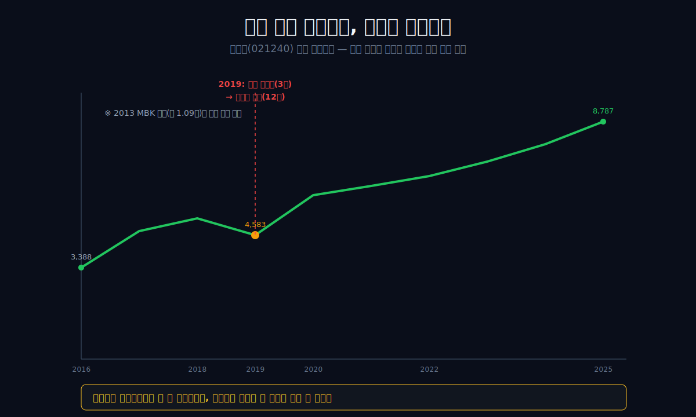
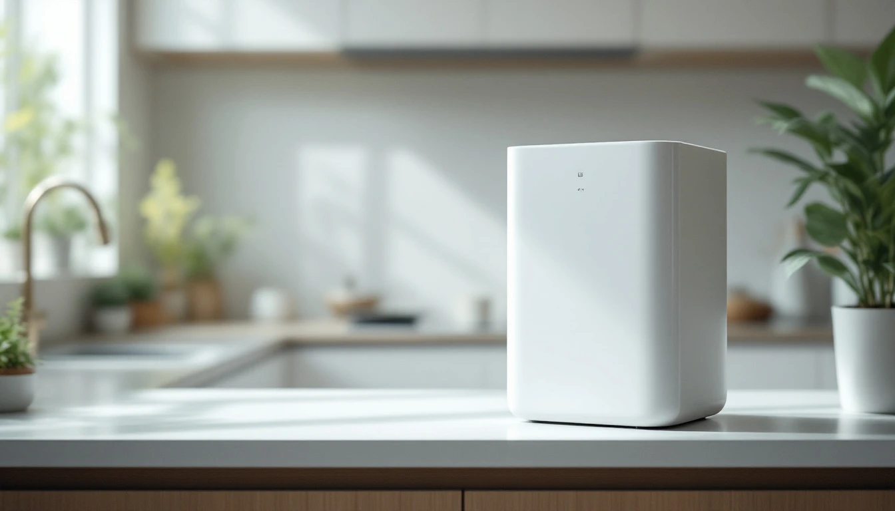
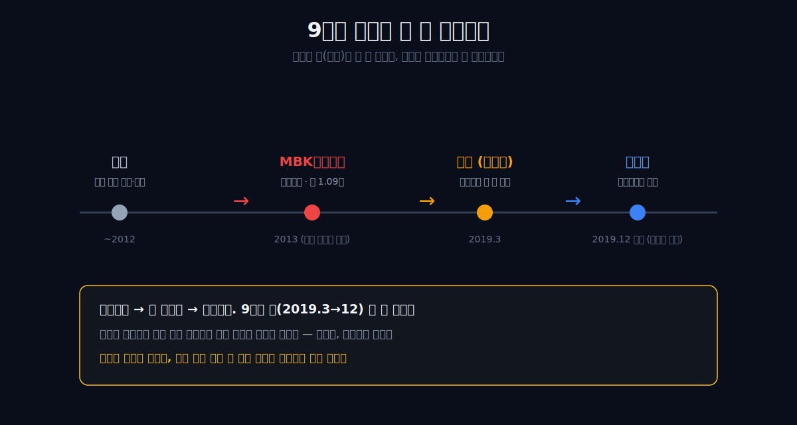
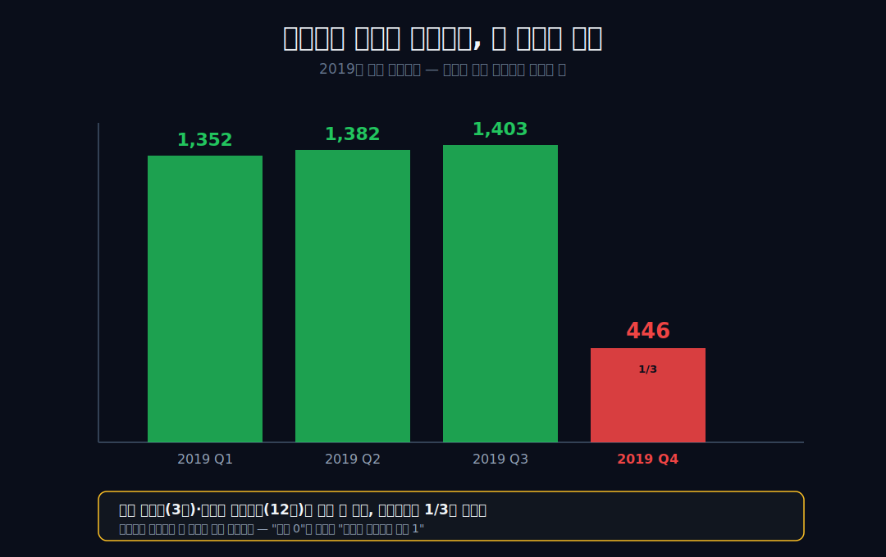
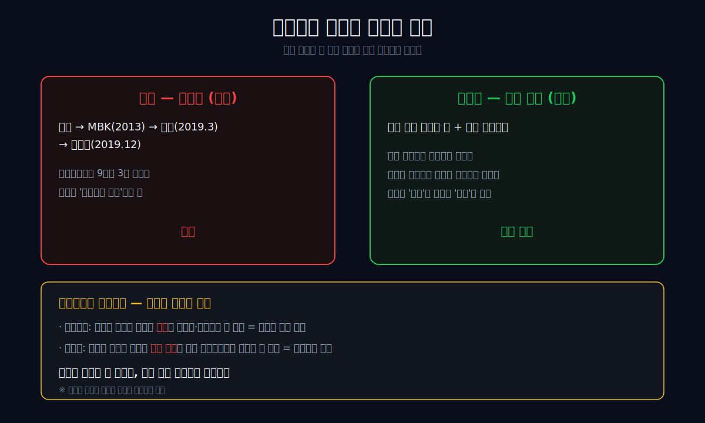
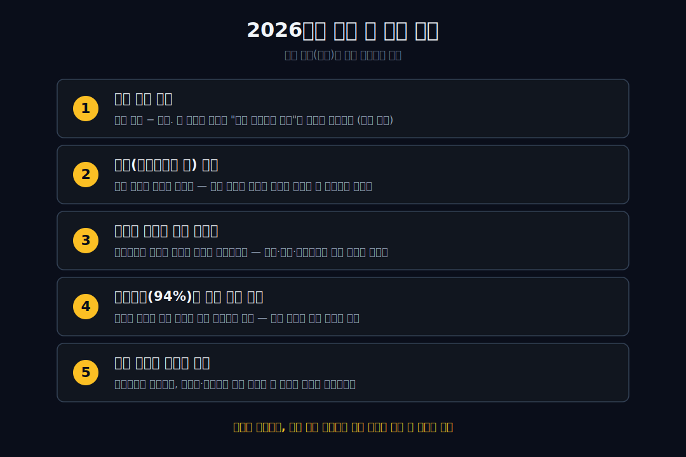

<script>
	import CompanyFinancials from '$lib/components/blog/CompanyFinancials.svelte';
</script>

> **데이터 기준**: 2026-06-13 dartlab 실측 — 코웨이(021240) **연결 재무제표(CFS)** 기준. ※렌탈 사업은 판매 대신 약정·채권으로 잡혀 연간 영업활동현금흐름의 변동이 크다 — 본문은 매출·영업이익을 중심 지표로 본다.
>
> **핵심 숫자**: 매출 **4.96조** (2016 2.38조의 2.1배) · 영업이익 **8,787억** (2016 3,388억의 2.6배) · 영업이익률 **17.7%** (2016 14.3%) · 부채비율 **94%** · 9년간 소유권 3회 거래
>
> **이 글의 용어**: 렌탈(구독) = 기계를 팔지 않고 빌려주고 매달 사용료를 받는 모델 · 코디 = 정기적으로 가정을 방문해 필터 교체·관리를 하는 코웨이 방문관리 인력 · 영업이익 = 본업에서 번 이익 · 부채비율 = 부채÷자본(렌탈 자산을 깔려면 자본·차입이 필요해 높아짐) · 사모펀드(PE) = 회사를 사서 가치를 키운 뒤 되파는 투자 주체.

---

## 프롤로그 — 가장 자주 사고팔린 회사, 그런데 손익은 조용하다

1998년, 아무도 정수기를 사지 못하던 해에 한 회사가 거꾸로 된 결정을 내렸다. **"팔지 말고, 빌려주자."** 목돈이 없는 사람들에게 매달 몇만 원씩 받고 기계를 맡긴 뒤, 한 달에 한 번 사람을 보내 필터를 갈아주기로 했다. 기계를 *파는* 사업이 사람을 *보내는* 사업으로 바뀐 순간이었다. 27년이 지난 지금 그 회사의 매출은 **4조 9,636억**, 영업이익률은 18% 안팎에서 자리를 잡았고, 한국 사람이라면 누구나 이름을 안다. 코웨이다.

그런데 이 멀쩡하고 평온해 보이는 회사에는, 연간 재무제표가 좀처럼 입을 열지 않는 사실이 하나 있다. **지난 9년 동안 이 회사의 주인은 세 번 바뀌었다.** 사모펀드(MBK)에서 옛 모회사(웅진)로, 그리고 다시 게임회사(넷마블)로. 정수기 한 대를 빌려 쓰는 당신은 그 사실을 느낀 적이 없다. 당신 집의 코디 선생님도 그대로였고, 매달 빠져나가는 렌탈료도 그대로였다. 한국에서 가장 자주 사고팔린 회사 중 하나인데, 정작 그 매매의 흔적은 연간 손익계산서 어디에서도 거의 보이지 않는다.

관통선은 하나다. **"가장 자주 사고팔린 회사인데, 왜 그 매매가 손익 곡선에는 거의 안 비쳤는가?"**

답을 먼저 쓴다(단, 이건 입증된 인과가 아니라 곡선의 침묵이 가리키는 *정황*이다). 코웨이는 "빌려주고 매달 받는" 약정을 사용자 수백만 명과 누적시켰다. 그래서 회사의 *소유권*이 자본시장에서 거래되는 동안에도, 회사의 *현금 엔진*은 주인이 아니라 코디와 계약에 묶여 돌았다 — **소유권 시장과 현금 엔진이 분리된 회사.**



이 분리를 정확히 잡아야 한다. 코웨이의 주식은 한 번에 수조 원짜리 거래 대상이 됐다. 하지만 가정의 렌탈 약정은 한 달에 몇만 원짜리 작은 반복 결제다. 자본시장의 거래 단위와 현장의 현금 단위가 완전히 다르다. 주인이 바뀌는 날에도 고객은 정수기를 쓰고, 필터는 교체되고, 계좌에서는 렌탈료가 빠져나간다. 회사의 이름표는 바뀌지만 수백만 개의 작은 약정은 같은 리듬으로 돈을 만든다.

그래서 이 글의 질문은 "누가 코웨이를 더 잘 경영했나"가 아니다. 더 좁은 질문이다. **왜 회사 자체는 반복해서 거래됐는데, 본업 손익은 그렇게 천천히 움직였나.** 이 질문에 답하려면 렌탈 계정, 코디 방문관리, 렌탈 자산, 부채비율, 영업현금흐름을 함께 봐야 한다. 매출과 영업이익만 보면 너무 평온하고, 현금흐름만 보면 너무 요란하다. 두 표를 같이 놓아야 코웨이의 구조가 보인다.

---

## 1막 — 못 사던 시대의 거꾸로 된 결정

**왜 빌려주는 모델이 위기에서 태어났나.** 코웨이의 뿌리는 1989년 한국 최초의 정수기 사업이지만, 진짜 모델 혁신은 1998년 IMF 외환위기에서 나왔다. 목돈이 마른 가정에 정수기를 *팔* 수가 없자, 회사는 발상을 뒤집었다 — 팔지 말고 매달 사용료를 받고 빌려주자. 위기가 만든 모델이었다.



빌려주기만 했다면 평범했을 것이다. 핵심은 2001년 도입한 **코디**(방문관리)였다. 한 달에 한 번 사람이 직접 가정을 찾아 필터를 갈고 기계를 점검한다. 이 방문이 단순 A/S가 아니라 *해약을 막는 끈*이자 *추가 판매의 접점*이 됐다. 기계가 아니라 관계를 파는 사업. 남이 안 하던 방식으로 자기 시장을 만든 회사로는 연어 분자로 미용 카테고리를 연 [파마리서치](/blog/214450-pharmaresearch)도 있다. 창업주가 아니라 *모델을 발명한 사람*으로 불려야 할 윤석금의 웅진이 이 구조를 키웠다.

이 막의 끝에서 다음 막으로 넘어간다. 이 모델이 그려낸 9년 곡선부터 보자.

---

## 2막 — 평온한 9년 곡선을 먼저 본다

**얼마나 매끄러운가.** 코웨이의 연간 실적은 흠을 찾기 어려운 우상향이다.

```python
import dartlab
c = dartlab.Company("021240")
c.select("IS", ["매출액", "영업이익", "당기순이익"], freq="Y")
```

| 항목 (1년치 합산, 억원) | 2025 | 2024 | 2023 | 2022 | 2021 | 2020 | 2019 | 2018 | 2017 | 2016 |
|---|---:|---:|---:|---:|---:|---:|---:|---:|---:|---:|
| 매출액 | **49,636** | 43,101 | 39,665 | 38,561 | 36,643 | 32,374 | 30,189 | 27,073 | 25,168 | 23,763 |
| 영업이익 | **8,787** | 7,954 | 7,313 | 6,774 | 6,402 | 6,064 | 4,583 | 5,198 | 4,727 | 3,388 |
| 당기순이익 | 6,175 | 5,655 | 4,710 | 4,578 | 4,655 | 4,047 | 3,322 | 3,498 | 3,256 | 2,433 |

표시: 매출은 9년간 2.38조→4.96조로 **2.1배**, 영업이익은 3,388억→8,787억으로 **2.6배** 커졌다. 영업이익률도 2016년 14.3%에서 17~19%대로 *올라가 자리잡았다*(9년 내내 18%였던 게 아니라, MBK가 인수해 정상화한 구간을 거쳐 안착한 것이다). 정수기 한 대씩 빌려주는 약정이 수백만 건 쌓이면, 매출은 이렇게 *계단처럼* 누적된다.

이 막의 끝에서, 이 매끄러운 곡선 위에 다른 그림을 겹쳐 본다.

## 렌탈 한 대가 장부에 남는 방식

코웨이를 그냥 "정수기를 파는 회사"로 보면 숫자가 헷갈린다. 기계를 한 번 팔고 매출을 끝내는 구조가 아니라, 기계를 먼저 설치하고 사용 기간 동안 매달 렌탈료를 받는다. 고객은 목돈을 내지 않아도 되고, 회사는 매월 반복 매출을 얻는다. 대신 회사는 기계와 관리 인프라를 먼저 깔아야 한다. 이 구조가 코웨이의 안정성과 자본 부담을 동시에 만든다.

판매 모델에서는 고객이 정수기를 산 날 매출이 크게 잡히고, 그 뒤에는 A/S나 소모품 매출만 남는다. 렌탈 모델에서는 첫날의 매출은 작아 보이지만, 약정 기간 동안 매달 반복된다. 그래서 신규 판매가 갑자기 줄어도 기존 약정이 매출을 받쳐 준다. 반대로 신규 판매가 늘어도 기계를 먼저 깔아야 하므로 렌탈 자산과 운전자본이 커진다. 코웨이의 매출 곡선은 부드럽지만, 현금흐름은 더 거칠 수밖에 없는 이유다.

이 차이는 2025년 숫자에서 잘 보인다. 매출은 4조 9,636억, 영업이익은 8,787억으로 기록적이다. 그런데 영업활동현금흐름은 355억에 그친다. 2024년 영업현금흐름 3,303억, 2023년 4,489억과 비교하면 매우 낮다. 이걸 곧바로 "본업이 나빠졌다"고 읽으면 틀릴 수 있다. 렌탈 회사의 현금흐름은 매출채권, 렌탈자산, 선수금, 재고, 설치비와 회수 시점에 크게 흔들린다. 손익계산서가 약정의 안정성을 보여준다면, 현금흐름표는 그 약정을 새로 깔기 위해 들어가는 선투자와 회수 시차를 보여준다.

그래서 코웨이의 품질을 볼 때는 매출·영업이익·계정 순증·현금흐름을 따로 떼지 말아야 한다. 매출이 늘고 영업이익률이 유지되며 계정이 순증하면 엔진은 돌아간다. 다만 영업현금흐름이 계속 낮게 머문다면, 성장의 질과 렌탈 자산 회전을 다시 물어야 한다. 이 회사는 "현금이 매달 들어오는 회사"이지만, 동시에 "매달 들어올 현금을 만들기 위해 자산을 먼저 깔아야 하는 회사"다.

## 손익은 부드럽고, 현금흐름은 거칠다

코웨이의 손익계산서는 안정적으로 보인다. 매출은 2016년 2조 3,763억에서 2025년 4조 9,636억으로 한 해도 크게 꺾이지 않고 커졌다. 영업이익도 2019년을 제외하면 계단식으로 올라왔다. 이 표만 보면 회사는 거의 흔들리지 않는 기계처럼 보인다.

하지만 현금흐름표는 다르다. 2023년 영업현금흐름은 4,489억, 2024년은 3,303억, 2025년은 355억이다. 2026년 1분기는 60억이다. 손익계산서의 매끄러운 곡선과 현금흐름표의 요동이 동시에 존재한다. 여기서 코웨이를 잘못 읽는 두 가지 길이 생긴다. 하나는 손익만 보고 "완벽하게 안정적인 회사"라고 쓰는 길이다. 다른 하나는 현금흐름만 보고 "현금이 말랐다"고 쓰는 길이다. 둘 다 절반만 본다.

렌탈 회사는 고객 약정을 쌓아 매출을 안정화하지만, 그 약정을 만들기 위해 제품·설치·관리 자산을 먼저 넣는다. 계정이 늘어나는 좋은 시기일수록 현금이 먼저 나갈 수도 있다. 그래서 영업현금흐름이 낮아진 해에는 두 가지 질문을 해야 한다. 첫째, 신규 렌탈과 렌탈 자산 증가 때문에 생긴 일시적 회수 시차인가. 둘째, 할인·프로모션·채권 회수 지연 때문에 반복 현금의 질이 약해진 것인가. 이 둘은 완전히 다른 이야기다.

2025년 숫자는 바로 이 질문을 만든다. 매출과 영업이익은 역대 최대인데, 영업현금흐름은 낮다. 2026년 1분기도 매출 1조 3,297억, 영업이익 2,509억으로 강하지만 영업현금흐름은 60억이다. 이 글의 결론은 "문제다"가 아니라 "계속 봐야 한다"다. 코웨이의 손익 안정성은 이미 검증됐다. 다음 검증은 그 안정성이 현금으로 얼마나 빠르게 회수되는가다.

그래서 2026년의 첫 번째 관찰 항목은 매출 증가율이 아니라 현금흐름 회복이다. 영업이익이 계속 늘고 계정 순증이 이어지는데 현금흐름도 회복되면, 2025년의 낮은 영업CF는 성장 과정의 시차로 읽을 수 있다. 반대로 영업이익은 좋은데 현금흐름이 계속 약하면, 렌탈 자산 회전과 채권 회수, 프로모션 질을 다시 봐야 한다. 렌탈은 안정적인 모델이지만 공짜 안정성은 아니다.

---

## 3막 — 그 곡선 위에 주인 셋을 겹친다

**무슨 일이 있었나.** 같은 9년 동안, 회사의 *소유권*은 세 번 거래됐다. 2013년 웅진그룹이 유동성 위기(극동건설 등)로 코웨이를 사모펀드 **MBK파트너스에 약 1.09조 원**에 팔았다. 2019년 3월 웅진이 다시 사들였다가, 같은 해 12월 빚을 감당 못 하고 게임회사 **넷마블**에 매각 계약을 맺었다(이듬해 거래 완료).

 9년 새 사모펀드 → 옛 모회사 → 게임회사로 주인이 세 번 바뀐 것이다.



이제 2막의 매끄러운 곡선 위에 이 매각 사건들을 핀으로 꽂아 보자. 핵폭탄 세 발이 떨어지는데, 연간 곡선은 거의 미동이 없다. 매출은 한 해도 빠짐없이 늘었고, 영업이익도 *딱 한 해(2019)*를 빼면 계속 올랐다. 회사의 주인이 두 번 바뀌는 동안, 마치 아무 일도 없었다는 듯 숫자는 흘렀다.

> **여기서 멈칫**: 한국에서 가장 자주 사고팔린 회사 중 하나인데, 그 매매가 매출·이익 곡선에는 거의 안 비친다.

이 막의 끝에서, 그 "딱 한 해"를 분기로 확대해 본다.

## 소유권 타임라인과 손익 타임라인은 속도가 다르다

소유권 거래는 날짜가 선명하다. 2013년 1월 매각, 2019년 3월 재인수, 2019년 12월 재매각 계약, 2020년 2월 거래 완료. 자본시장 이벤트는 하루에 찍힌다. 반면 손익은 월별 약정과 분기별 회계로 천천히 흘러간다. 이 속도 차이가 코웨이의 핵심이다.

MBK가 들어온 뒤 코웨이의 영업이익률은 2016년 14.3%에서 2018년 19.2%까지 올라갔다. 웅진이 되사던 2019년에는 연간 영업이익이 4,583억으로 꺾였다. 넷마블 체제가 시작된 2020년에는 6,064억으로 회복했다. 2025년에는 8,787억이다. 주인이 바뀌는 순간마다 손익이 즉각 방향을 바꾼 게 아니다. 오히려 기존 약정 기반 위에 영업 전략과 제품군 변화가 몇 년에 걸쳐 누적됐다.

여기서 소유권의 역할을 지워서는 안 된다. 주인은 투자와 배당, 신사업과 해외 전략을 바꿀 수 있다. MBK 시기의 배당 정책, 웅진의 재무 부담, 넷마블 이후 비렉스·해외 확장은 모두 소유권의 선택과 관련이 있다. 다만 그 선택이 당월 렌탈료를 즉시 끊어 버리지는 못했다. 코웨이는 소유권에 영향을 받지만, 소유권만으로 움직이지 않는 회사다.

이 차이는 투자자에게 중요하다. 소유권 이벤트만 보고 매수·매도를 결정하면 너무 빠른 시계를 보는 것이고, 손익 곡선만 보고 주인의 자본 배분을 무시하면 너무 느린 시계를 보는 것이다. 코웨이는 두 시계를 같이 봐야 한다. 빠른 시계는 주식 거래와 지배구조이고, 느린 시계는 계정·방문관리·해외법인·렌탈 자산이다. 이 두 시계가 서로 어긋난 덕분에 주인은 바뀌어도 손익은 조용했다.

---

## 4막 — 확대하면 딱 한 군데 떨린 자국이 있다

**흔적이 정말 0인가.** 아니다. 연간으로 뭉개면 사라지지만, 분기로 줌인하면 딱 한 군데 떨림이 보인다.

```python
import dartlab
c = dartlab.Company("021240")
c.select("IS", ["영업이익"])   # 분기, 2019년
```

| 2019년 분기별 영업이익 (억원) | 2019Q1 | 2019Q2 | 2019Q3 | 2019Q4 |
|---|---:|---:|---:|---:|
| 영업이익 | 1,352 | 1,382 | 1,403 | **446** |

표시: 2019년 1~3분기는 1,350억대로 평소와 똑같은데, **4분기만 446억으로 다른 분기의 약 1/3**로 꺼졌다. 시점이 절묘하다 — 웅진의 재인수(3월)와 넷마블로의 매각 결정(12월)이 겹친, 바로 그 해 그 분기다. 주인이 가장 어지럽게 바뀌던 순간, 회사는 단 한 분기 비틀거렸고, 연간으로 합산하니 그 비틀거림은 거의 사라졌다.



그래서 정확한 표현은 "흔적이 전혀 없다"가 아니라 — **"연간으로 뭉개면 사라지는 한 번의 떨림이, 분기엔 있다."**

이 막의 끝에서, 그렇다면 왜 *거의* 안 흔들렸는지로 들어간다.

## 2019년 4분기 — 한 번의 떨림을 어떻게 읽어야 하나

2019년 4분기 446억을 지나치게 크게 해석하면 안 된다. 이 숫자는 "소유권 변화가 손익에 아무 영향도 없었다"는 문장을 부정한다. 하지만 동시에 "소유권 변화가 사업을 망가뜨렸다"는 문장도 증명하지 않는다. 2019년 1~3분기 영업이익은 각각 1,352억, 1,382억, 1,403억이었다. 4분기만 꺼졌고, 2020년 연간 영업이익은 다시 6,064억으로 올라왔다. 즉 떨림은 있었지만 오래가지는 않았다.

이 지점에서 인과를 낮춰 써야 한다. 웅진의 재인수와 넷마블 매각 결정이 겹친 분기라 거래 비용, 조직 불확실성, 일회성 비용, 회계 처리 등이 손익에 영향을 줬을 가능성은 있다. 그러나 공개 자료만으로 그 446억을 특정 원인 하나에 배분할 수는 없다. 그래서 이 글은 "2019년 4분기의 흔적"이라고 쓰지, "웅진 재인수가 영업이익을 900억 깎았다"고 쓰지 않는다. 좋은 글은 원인을 세게 말하는 글이 아니라, 증거가 허용하는 만큼만 말하는 글이다.

오히려 더 중요한 건 회복 속도다. 2020년부터 매출과 영업이익은 다시 우상향한다. 넷마블 체제가 시작된 뒤에도 정수기·비데·공기청정기 약정은 유지됐고, 이후 비렉스와 해외 법인이 새 성장축으로 붙었다. 만약 코웨이가 일회성 제품 판매 회사였다면 2019년의 소유권 혼란은 영업망과 신제품 판매에 더 큰 상처를 냈을 수 있다. 하지만 렌탈 약정이 쌓인 회사에서는 기존 계정이 매출을 받쳐 줬고, 코디 방문망이 고객 접점을 유지했다. 그 구조가 한 번의 떨림을 연간 곡선 속으로 흡수했다.

---

## 5막 — 왜 거의 안 흔들렸나: 엔진의 정체

**현금은 무엇에 묶여 있었나.** 답은 렌탈 약정과 코디다. 정수기를 한 번 빌려준 가정은 매달 사용료를 낸다. 그 약정이 수백만 건 쌓여 있으면, 회사의 현금은 *이번 분기 영업을 얼마나 잘했느냐*보다 *이미 깔려 있는 약정의 합*에 따라 들어온다. 소유주가 바뀌어도 우리 집 코디 선생님도, 매달 빠지는 렌탈료도 그대로였다 — 현금은 '주식'이 아니라 '계약'에 묶여 있었다.


여기서 흔한 과장 하나를 막아야 한다. "이익이 매출보다 빨리 늘었다(2.6배 vs 2.1배)"는 구독 모델의 *마진 레버리지*인데, 이건 코웨이만의 특별함이 아니라 고정 비용(코디망) 위에 약정이 누적되는 **모든 흑자 구독사의 공통 증상**이다(넷플릭스도 통신사도 그렇다). 코웨이의 진짜 특이점은 그 안정성이 *소유권 격변과 무관하게* 유지됐다는 데 있다.

단, 이 '매달 들어오는 현금'에는 함정도 있다. 렌탈은 기계를 *먼저 사서 깔아야* 매달 사용료가 들어오는 구조라, 성장할수록 렌탈 자산에 현금이 묶인다. 그래서 코웨이의 부채비율은 2025년 94%까지 올랐고(빚 없이 자본만 쌓는 회사와 정반대다), 회계상 영업활동현금흐름은 렌탈 채권 변동에 따라 해마다 출렁인다(2025년 355억). 매달 들어오는 현금은 이미 깔린 약정의 합에서 나오지만, 그 약정을 새로 깔기 위한 투자가 먼저 나간다 — 안정과 자본 부담이 한 몸인 모델이다.

이 막의 끝에서, 그 분리가 무엇을 의미하는지로 넘어간다.

## 코디망은 해자인가 비용인가

코디망은 코웨이의 가장 유명한 해자다. 하지만 해자라는 말은 늘 절반만 맞다. 방문관리 조직은 고객 해지를 막고, 필터 교체와 점검으로 제품 경험을 유지하며, 추가 렌탈과 교체 판매의 접점이 된다. 정수기는 한 번 설치하면 부엌과 욕실 안쪽에 들어간다. 고객이 매일 쓰지만 관리가 번거로운 제품이다. 그 번거로움을 사람이 대신 해결해 주는 순간, 제품은 단순 가전이 아니라 서비스가 된다.

동시에 코디망은 비용이다. 사람을 교육하고, 지역망을 운영하고, 방문 일정을 짜고, 품질을 관리해야 한다. 렌탈 계정이 늘면 방문관리의 생산성도 중요해진다. 방문이 너무 잦으면 비용이 커지고, 방문 가치가 낮아지면 고객은 자가관리나 저가 경쟁사로 이동할 수 있다. 그래서 코웨이의 해자는 "코디가 있다"가 아니라 **코디망이 해지를 낮추고 추가 판매를 만들 만큼 생산적으로 운영되는가**에 달려 있다.

2026년 1분기 회사 보도자료가 흥미로운 이유가 여기에 있다. 국내 렌탈 계정 순증은 전년 동기 대비 81.8% 늘어난 18.8만 대로 제시됐다. 이 숫자는 단순 매출보다 앞선 신호다. 계정이 순증하면 다음 분기의 매출 기반이 넓어진다. 동시에 그 계정을 관리할 비용도 따라온다. 코디망이 해자인지 비용인지는 순증, 해약률, 관리비, 영업이익률이 함께 말한다.

여기서 비대면·자가관리 흐름도 봐야 한다. 필터 교체가 쉬워지고, 고객이 방문을 덜 원하고, 온라인 채널이 커지면 방문관리의 의미는 바뀐다. 코디가 반드시 모든 제품을 관리해야 하는 시대에서, 고객군과 제품군에 따라 방문관리와 자가관리를 나눠야 하는 시대로 간다. 이 전환을 잘하면 코디망은 프리미엄 서비스가 되고, 못하면 고정비가 된다. 코웨이의 다음 10년은 이 균형을 얼마나 잘 잡느냐에 달려 있다.

---

## 6막 — 소유권과 현금이 갈라선 자리

**무엇이 갈라졌나.** 주인들은 코웨이를 *사고파는 자산*으로 봤다. MBK는 사서 정상화한 뒤 되팔았고, 웅진은 되샀다가 다시 팔았고, 넷마블은 새 성장동력으로 사들였다. 그러나 그 거래들이 도는 동안, 회사의 현금 엔진은 *사용자와의 약정*에 묶여 주인을 거의 인식하지 못했다.

[호텔신라](/blog/008770-hotel-shilla)와 비교하면 차이가 선명하다. 호텔신라는 매출은 자기 장부에 남았는데 *이익*이 따이공·공항으로 흘러가 — '이익의 귀속'을 빼앗겼다. 코웨이는 정반대 종류의 분리다 — *이익*은 멀쩡히 회사에 남는데, *회사 자체*가 반복해서 거래됐는데도 그 거래가 현금 곡선에 거의 안 비쳤다. 한쪽은 이익이 새 나갔고, 다른 쪽은 소유권이 겉돌았다.



이 막의 끝에서, 그렇다면 그 매끄러움의 과실은 누가 가졌는지를 묻는다.

---

## 7막 — 매끄러움의 대가는 누가 가졌나

**발명한 쪽은 끝내 못 가졌다.** 렌탈 모델을 발명하고 코웨이를 키운 웅진은, 정작 그 회사를 오래 갖지 못했다. 2013년 빚 때문에 사모펀드에 넘겼고, 2019년 어렵게 되샀지만 다시 빚을 못 견디고 9개월 만에 게임회사에 팔았다. 모델을 만든 손이 자기가 만든 걸 잠깐 되찾았다가 다시 놓친 셈이다. 정상화와 성장의 과실은 사모펀드(MBK)와 새 주인(넷마블)에게로 갔다. 사모펀드가 인수한 뒤 배당으로 현금을 거둬간 [한온시스템](/blog/018880-hanon-systems), 오너 그룹이 무리한 인수로 흔들린 [이마트](/blog/139480-emart)도 '회사를 가진 자'의 결정이 실적에 남긴 자국을 보여준다.

단, 데이터는 "회사가 슬펐다"고 말하지 않는다 — 오히려 회사는 주인이 바뀌는 내내 *번성*했다. 매출도 이익도 계속 늘었다. 그래서 이건 '발명가의 비극'이라는 감상으로 닫을 이야기가 아니다. 더 차가운 사실에 가깝다 — **현금 엔진은 주인을 가리지 않는다.** 약정을 갱신한 사용자와 매달 문을 두드린 코디가 가치를 만드는 한, 그 위에 누구의 이름이 적혀 있든 엔진은 돌았다.

이 막의 끝에서, 마지막 질문으로 닫는다.

## 주인별 셈법 — MBK, 웅진, 넷마블은 무엇을 봤나

소유권 거래를 하나로 묶으면 세부가 사라진다. MBK, 웅진, 넷마블이 본 코웨이는 서로 달랐다. MBK에게 코웨이는 현금흐름이 반복되는 좋은 바이아웃 자산이었다. 웅진에게 코웨이는 한때 팔 수밖에 없었던 핵심 회사를 되찾는 거래였다. 넷마블에게 코웨이는 게임 외부의 반복 매출 플랫폼이자 생활가전 구독망이었다. 같은 회사지만, 각 주인이 본 효용은 달랐다.

김앤장 거래 설명에 따르면 웅진그룹은 2013년 재무건전성 문제로 코웨이를 MBK파트너스에 매각했고, 2019년 3월 다시 인수했지만 같은 해 12월 넷마블에 매각하는 계약을 체결해 2020년 2월 거래를 완료했다. 이 타임라인은 코웨이의 역설을 잘 보여준다. 회사 자체는 좋은 자산이었지만, 좋은 자산을 갖기 위해 쓴 돈이 주인의 재무를 흔들 수 있었다. 자산의 질과 소유자의 재무 체력은 별개의 문제다.

웅진의 재인수는 이 차이를 가장 선명하게 보여준다. 좋은 회사를 되찾았지만, 인수금융과 그룹 재무 부담이 커지자 오래 버티지 못했다. 반대로 코웨이의 손익은 그 기간에도 완전히 무너지지 않았다. 주인이 흔들려도 회사의 약정 기반은 그대로였고, 회사가 좋아도 주인의 재무가 약하면 소유는 유지되지 못했다. 그래서 코웨이는 "좋은 회사는 누가 가져도 좋다"가 아니라 "좋은 회사라도 어떤 자본구조로 갖느냐가 중요하다"는 사례다.

넷마블 체제에서는 질문이 바뀌었다. 게임회사가 생활가전 렌탈 회사를 사면 무엇을 할 수 있는가. 2025년 이후 답은 비렉스와 해외 확장 쪽으로 나타난다. 게임과 정수기의 시너지를 찾기보다, 넷마블은 코웨이를 독립적인 반복 매출 플랫폼으로 키운 쪽에 가깝다. 2025년 비렉스 연결 매출 7,199억, 해외법인 매출 1조 8,899억은 이 해석을 지지한다. 새 주인이 본업을 흔든 게 아니라, 본업의 형식을 다른 제품군과 해외 시장으로 복제한 것이다.

---

## 산업 패턴 — 한국이 '구독경제의 실험실'이 된 이유

**왜 빌려 쓰는 문화가 한국에서 유독 컸나.** 코웨이가 1998년 외환위기에서 만든 '정수기 렌탈'은 한 회사의 사업 모델로 끝나지 않았다. 이후 25년 동안 한국에서는 안마의자·매트리스·침대·의류관리기, 심지어 자동차까지 *빌려 쓰는* 방식이 소비의 표준 가운데 하나가 됐다. 목돈을 내고 사는 대신 매달 사용료를 내고, 정기적으로 사람이 방문해 관리해 주는 구조 — 이른바 '구독(렌탈) 경제'다.

이 모델이 한국에서 유독 빠르게 퍼진 데는 몇 가지 토양이 있다. 첫째, 목돈 부담을 매달로 쪼개려는 수요(외환위기 이후의 가계 환경). 둘째, 가정을 직접 방문해 서비스하는 인력 인프라 — 코디로 대표되는, 야쿠르트 배달처럼 한국에 일찍 자리 잡은 방문 조직 문화. 셋째, 한 번 들이면 바꾸기 번거로운 '집 안의 기계'라는 제품 특성이 만든 높은 잔존율. 코웨이는 이 셋을 *렌탈 + 코디 방문관리*라는 하나의 형식으로 묶은 원형을 만들었고, SK매직·LG·청호나이스·바디프랜드 같은 후발 주자들이 그 형식을 따라왔다.

그래서 코웨이를 '정수기 1등'으로만 보면 절반만 본 것이다. 이 회사의 진짜 발명은 제품이 아니라 *모델*이었다 — '한 번 팔고 끝'이 아니라 '매달 받고 계속 관리하는' 관계의 형식. 한 회사가 만든 모델 하나가 한 나라의 소비 방식을 바꾼 셈이다. 그리고 바로 그 형식이, 다음 막에서 보듯, 회사를 *주인으로부터* 떼어 놓았다.

---

## 두 번째 코웨이 — 비렉스와 말레이시아는 같은 모델인가

2025년 실적에서 가장 중요한 새 단어는 비렉스와 해외다. 회사 보도자료 기준 2025년 비렉스 연결 매출은 7,199억이다. 국내 침대 사업 매출만 3,654억으로 전년 대비 15.4% 늘었다. 정수기 렌탈로 만든 "기계를 빌려주고 관리한다"는 형식이 침대와 안마의자, 수면·힐링케어로 옮겨간 것이다. 제품은 다르지만 질문은 같다. 고객이 목돈을 내고 사기보다 매달 쓰고 관리받을 이유가 있는가.

비렉스가 중요한 이유는 국내 정수기 시장이 이미 성숙했기 때문이다. 정수기·비데·공기청정기만으로는 영원히 같은 성장률을 유지하기 어렵다. 코웨이가 다음 성장축을 만들려면 집 안의 다른 고관여 제품으로 렌탈 모델을 확장해야 한다. 침대와 안마의자는 가격이 높고, 체험과 관리가 중요하며, 교체 주기가 길다. 렌탈 모델이 붙을 여지가 있다. 다만 정수기처럼 필수 관리가 반복되는 제품은 아니므로, 해지율과 재구매율은 별도로 확인해야 한다.

해외는 또 다른 복제 실험이다. 2025년 해외법인 연간 매출은 1조 8,899억으로 전년 대비 22.3% 늘었다. 말레이시아 법인 매출만 1조 4,095억이다. 2026년 1분기에도 해외법인 매출은 5,370억, 말레이시아 법인은 4,062억을 기록했다. 이제 코웨이는 한국 정수기 렌탈 회사가 아니라, 말레이시아를 중심으로 해외 렌탈 모델을 키운 회사다.

하지만 해외 확장은 "한국에서 됐으니 어디서나 된다"가 아니다. 물 사용 습관, 방문관리 인력, 결제 신용, 주거 형태, 필터 관리 문화가 모두 달라진다. 말레이시아에서 성공한 모델이 태국과 인도네시아에서 같은 속도로 복제될지도 검증해야 한다. 그래서 해외 매출은 좋은 숫자지만, 해외 영업이익률과 계정 유지율이 함께 공개될수록 더 강한 증거가 된다. 코웨이의 두 번째 코웨이는 국내 비렉스일 수도 있고, 말레이시아 이후의 해외 법인일 수도 있다. 아직 둘 다 관찰 중이다.

## 현재 숫자 — 조용한 회사가 다시 빨라지는 구간

2025년과 2026년 1분기 숫자는 이 글의 오래된 서사에 새 질문을 붙인다. 코웨이는 이미 안정적인 렌탈 회사인데, 최근에는 다시 성장률이 빨라졌다. 2025년 연간 매출은 전년 대비 15.2% 늘어난 4조 9,636억, 영업이익은 10.5% 늘어난 8,787억이다. 2026년 1분기 매출은 1조 3,297억으로 전년 동기 대비 13.2%, 영업이익은 2,509억으로 18.8% 늘었다. 이 정도면 "조용한 현금 엔진"이라는 표현만으로는 부족하다. 조용하지만 커지는 엔진이다.

성장축은 세 갈래다. 첫째, 국내 렌탈 계정 순증. 2026년 1분기 국내 렌탈 계정 순증은 18.8만 대다. 둘째, 비렉스. 2025년 비렉스 연결 매출은 7,199억으로 정수기 밖의 렌탈 확장을 보여준다. 셋째, 해외. 2025년 해외법인 매출은 1조 8,899억이고, 2026년 1분기에도 5,370억이다. 이 세 축이 동시에 움직이면 코웨이는 더 이상 "정수기 렌탈 회사"로만 설명되지 않는다.

다만 성장률이 빨라지는 구간은 늘 검증이 필요하다. 국내 순증이 프로모션에 의존한 것인지, 비렉스가 낮은 해지율과 반복 관리를 만들 수 있는지, 해외법인의 수익성이 국내만큼 단단한지 아직 더 봐야 한다. 특히 말레이시아는 이미 큰 축이 됐지만, 해외 매출이 커질수록 환율과 현지 경쟁, 인력 운영, 채권 회수 리스크도 커진다. 한국에서 안정적이었던 렌탈 공식이 해외에서 같은 품질로 반복되는지는 별개의 문제다.

그래서 현재 코웨이는 두 얼굴이다. 하나는 1998년 렌탈 모델이 만든 안정적인 반복 매출 회사. 다른 하나는 비렉스와 해외로 다시 성장률을 올리는 확장 회사. 첫 번째 얼굴은 주인이 바뀌어도 손익을 조용하게 만들었다. 두 번째 얼굴은 앞으로 주인의 전략과 자본 배분을 더 중요하게 만든다. 안정만 보던 독자는 성장의 기회를 놓치고, 성장만 보던 독자는 렌탈 자산과 현금흐름의 부담을 놓친다.

## 이 이야기가 틀리는 조건

좋은 서사는 반례를 품고 있어야 한다. 코웨이의 서사가 틀리는 첫 조건은 계정 순증 둔화다. 렌탈 모델은 기존 약정이 매출을 받쳐 주지만, 신규 계정이 둔화되면 몇 분기 뒤 성장률이 낮아진다. 특히 국내 정수기·비데·공기청정기 시장이 성숙한 상태라면, 순증은 가격 프로모션이나 제품군 확장에 더 의존할 수 있다. 순증이 줄어드는데 매출만 오른다면 가격 인상, 제품 믹스, 해외 환율 효과를 분리해 봐야 한다.

둘째 조건은 해약률 상승이다. 이 글은 계정이 안정적으로 남아 있다는 가정 위에 서 있다. 만약 자가관리, 저가 경쟁, 온라인 렌탈 플랫폼, 소비 둔화가 해약률을 높이면 코디망은 해자가 아니라 비용으로 바뀐다. 방문관리가 고객에게 충분한 가치를 주지 못하면, 매달 들어오는 렌탈료도 더 이상 당연하지 않다. 그래서 계정 순증만큼 중요한 게 해약과 재약정이다.

셋째 조건은 현금흐름 약화의 장기화다. 2025년 영업현금흐름 355억은 설명이 필요한 숫자다. 성장 투자와 렌탈 자산 증가에 따른 회수 시차라면 시간이 지나며 회복될 수 있다. 하지만 채권 회수 지연, 과도한 프로모션, 수익성 낮은 신규 계정이 원인이라면 문제다. 손익계산서가 좋더라도 현금흐름이 계속 따라오지 않으면 렌탈 모델의 질을 다시 봐야 한다.

넷째 조건은 해외 복제 실패다. 말레이시아가 크다고 해서 태국, 인도네시아, 미국이 모두 같은 속도로 커지는 것은 아니다. 해외는 현지 규제, 결제 신용, 방문관리 인력, 제품 선호가 다르다. 해외법인 매출이 늘어도 수익성과 현금 회수가 따라오지 않으면 외형 성장에 머문다.

다섯째 조건은 주인의 자본 배분이다. 코웨이는 주인이 바뀌어도 본업이 조용했던 회사지만, 앞으로도 항상 그럴 거라고 보장할 수는 없다. 배당, 자사주, 인수합병, 해외 투자, 신제품 투자 중 어디에 돈을 쓰느냐에 따라 렌탈 엔진의 방향이 바뀐다. 소유권은 손익을 즉시 흔들지 못했지만, 장기 자본 배분은 결국 손익에 남는다.

이 반례들을 통과하면 코웨이의 이야기는 강해진다. 주인이 세 번 바뀌어도 조용했던 회사가, 이제 비렉스와 해외로 두 번째 성장 곡선을 만드는 회사가 된다. 반대로 반례가 현실화되면 이 글의 제목은 바뀐다. "주인이 바뀌어도 조용한 회사"가 아니라 "조용해 보였지만 현금 회수와 계정 유지에서 균열이 생긴 회사"가 된다.

---

## 8막 — 회사는 누구의 것인가

가장 자주 거래된 회사인데, 그 거래가 거의 비치지 않는 회사. 이 모순이 던지는 질문은 단순하지 않다. 지난 9년간 코웨이의 가치를 실제로 만든 것은 무엇이었나 — 회사를 사고판 사모펀드와 대주주였나, 아니면 매달 가정을 찾아간 코디와 약정을 갱신한 수백만 명의 사용자였나.

소유권은 자본시장에서 세 번 손바뀜했지만, 현금은 한 번도 끊기지 않고 매달 같은 자리에서 들어왔다. **'회사의 주인'과 '회사를 굴리는 손'이 다를 수 있다** — 코웨이의 9년 곡선이 조용히 가리키는 것은 그 사실이다. 1998년 "팔지 말고 빌려주자"는 거꾸로 된 결정이, 25년 뒤 회사의 운명을 *주인으로부터* 떼어 놓았다. 다음 주인이 누가 되든, 그 분리가 코웨이의 진짜 해자다. 같은 '자기 모델을 만든 돌파자' 계열로, 국세청 의무의 길목을 쥐고 정점에서 매각된 [더존비즈온](/blog/012510-douzone)의 이야기도 함께 읽을 만하다.

다만 마지막 문장은 조금 차갑게 고쳐 써야 한다. 회사가 주인으로부터 완전히 독립했다는 뜻은 아니다. 주인은 배당, 투자, 신사업, 해외 확장, 자본구조를 바꿀 수 있다. 2019년 4분기처럼 손익에 흔적을 남길 수도 있다. 다만 코웨이의 본업 엔진은 소유권 거래보다 훨씬 느리게 움직인다. 주식은 하루에 거래되지만, 렌탈 약정은 매달 쌓이고, 코디망은 수년 동안 형성된다. 이 시간차가 코웨이의 장점이다.

그래서 이 회사의 결론은 철학이 아니라 체크리스트다. 누가 주인이냐보다 계정이 늘고 있는가. 렌탈 자산이 과도하게 불어나지 않는가. 해외와 비렉스가 정수기 모델의 반복성을 재현하는가. 영업이익은 늘지만 영업현금흐름이 계속 약해지는 건 아닌가. 이 네 질문이 맞으면 소유권 변화는 배경으로 물러난다. 틀리면 소유권과 전략이 다시 전면으로 나온다.

## 마지막 판정 — 코웨이는 주인보다 약정이 먼저다

코웨이를 한 문장으로 줄이면 "주인은 바뀌어도 약정은 남는 회사"다. 더 정확히 쓰면, 소유권은 한 번에 거래됐지만 매출은 수백만 개 약정에서 매달 흘러나왔다. 그래서 회사의 주식은 사모펀드, 웅진, 넷마블 사이를 오갔지만, 고객의 집 안에 놓인 정수기와 매트리스, 코디 방문, 자동이체는 훨씬 느린 속도로 움직였다. 이 느린 속도가 코웨이의 안정성을 만들었다.

하지만 이 안정성은 낭만이 아니다. 렌탈 모델은 자산을 먼저 깔고, 사람을 운영하고, 채권을 회수해야 한다. 그래서 손익은 부드럽지만 현금흐름은 거칠다. 2025년 매출 4조 9,636억과 영업이익 8,787억은 강한 숫자다. 동시에 영업현금흐름 355억은 질문을 남긴다. 좋은 렌탈 회사는 매출과 이익만 아니라 현금 회수까지 설명해야 한다.

따라서 코웨이의 핵심 판단은 세 단계다. 첫째, 기존 렌탈 계정이 유지되는가. 둘째, 비렉스와 해외가 두 번째 계정 기반을 만드는가. 셋째, 그 성장의 현금 회수가 따라오는가. 이 세 가지가 맞으면 주인이 세 번 바뀐 역사는 오히려 해자의 증거가 된다. 소유권이 흔들려도 현금 엔진은 계속 돌았기 때문이다. 셋 중 하나가 깨지면 이야기는 달라진다. 그때는 조용한 회사가 아니라, 조용해 보였던 비용 구조를 다시 뜯어봐야 하는 회사가 된다.

이 관점으로 보면 코웨이의 매각사는 단순한 지배구조 사건이 아니다. 반복 매출 회사의 본질을 보여주는 실험에 가깝다. 소유권이 바뀌어도 고객의 물 사용 습관, 필터 교체 주기, 렌탈 약정, 방문관리 일정은 하루아침에 바뀌지 않는다. 그래서 코웨이는 주인이 바뀌어도 매출이 먼저 흔들리지 않았다. 대신 시간이 지나며 새 주인의 선택이 제품군, 해외, 배당, 자본구조에 천천히 스며든다. 빠른 소유권과 느린 약정의 시간차, 그 사이가 코웨이의 진짜 읽을거리다.

따라서 다음 실적에서 먼저 볼 숫자는 주가나 대주주 뉴스가 아니다. 국내 렌탈 계정 순증, 비렉스 매출, 해외법인 매출, 영업현금흐름, 부채비율이다. 이 다섯 숫자가 같은 방향이면 "주인보다 약정이 먼저"라는 결론은 더 단단해진다. 반대로 매출은 늘어도 계정 순증이 약해지고 현금흐름이 계속 낮다면, 소유권보다 강해 보였던 약정의 힘도 다시 검증해야 한다.

코웨이가 흥미로운 이유는 바로 이 양면성이다. 소비자는 정수기와 매트리스를 빌려 쓰지만, 투자자는 약정의 지속성과 자본 회수를 함께 산다. 주인은 바뀔 수 있다. 하지만 약정이 유지되고 회수가 따라오면, 회사의 가치는 천천히 계속 쌓인다.

그 느린 축적이 9년의 소유권 소음을 거의 흡수했다.

그래서 코웨이는 빠른 뉴스보다 느린 지표가 더 중요하다. 약정은 뉴스보다 늦게 깨지고, 늦게 쌓인다.

느린 지표가 유지되는 한, 소유권 이벤트는 배경음에 가깝다. 느린 지표가 꺾이는 순간, 그때는 주인보다 사업 모델을 먼저 의심해야 한다.

코웨이의 답은 결국 계정과 현금에 있다.

그 둘이 유지되면 주인의 이름은 두 번째 줄로 내려간다.

코웨이의 핵심은 결국 반복성의 품질이다.

그 품질은 매 분기 숫자로만 검증된다.

숫자가 답이다.

끝까지 숫자로 본다.

---

## 2026년에 봐야 할 다섯 가지

1. **렌탈 계정 순증** — 신규 약정에서 해약을 뺀 순증가다. 2026년 1분기 국내 렌탈 계정 순증 18.8만 대가 이어지는지, 일회성 프로모션 효과인지 확인해야 한다.
2. **영업현금흐름 회복** — 2025년 영업현금흐름은 355억으로 낮았다. 렌탈 자산·채권 회수 시차인지, 구조적 현금 약화인지 다음 분기 현금흐름이 말해준다.
3. **해외(말레이시아 등) 비중** — 2025년 해외법인 매출 1조 8,899억, 2026년 1분기 5,370억. 같은 모델을 해외에 이식한 매출이 새 성장축이 되는지.
4. **비렉스의 반복성** — 2025년 비렉스 연결 매출 7,199억은 강하다. 침대·안마의자 렌탈이 정수기처럼 낮은 해지와 반복 관리를 만들 수 있는지 봐야 한다.
5. **부채비율(94%)과 렌탈 자산 회전** — 렌탈은 자산을 먼저 깔아야 하는 자본집약 사업이다. 성장 속도와 재무 부담의 균형.
6. **코디 조직의 디지털 전환** — 방문관리가 해자인데, 비대면·자가관리 흐름 속에서 그 방문의 가치가 유지되는지.



---

## 공시 / 외부 검증

- [코웨이 2025년 경영실적 발표](https://company.coway.com/newsroom/press/911): 2025년 연간 매출 4조 9,636억, 영업이익 8,787억, 국내·비렉스·해외법인 매출 확인.
- [코웨이 2026년 1분기 경영실적 발표](https://company.coway.com/newsroom/press/963): 2026년 1분기 매출 1조 3,297억, 영업이익 2,509억, 국내 렌탈 계정 순증 18.8만 대, 해외법인 매출 확인.
- [2025년 사업보고서(DART)](https://dart.fss.or.kr/dsaf001/main.do?rcpNo=20260323000924): 연결 재무제표와 렌탈 사업 관련 재무 항목 확인.
- [2026년 1분기보고서(DART)](https://dart.fss.or.kr/dsaf001/main.do?rcpNo=20260515001011): 2026년 1분기 연결 재무제표 확인.
- [김앤장 거래 사례](https://www.kimchang.com/ko/insights/detail.kc?idx=22246&sch_section=2): 웅진→MBK→웅진→넷마블 소유권 거래 타임라인 확인.
- [연합뉴스 2019-12-27 보도](https://www.yna.co.kr/view/AKR20191227158300030): 웅진 재인수 금액, 인수금융 부담, 재매각 배경 확인.

## 검증표

본문의 모든 인용 수치를 dartlab 호출과 결과로 검증한다. 외부 출처는 분리 표기. 📅 dartlab 실측 2026-06-13 · 코웨이(021240) 연결(CFS) 기준.

| 본문 수치 | 출처 / dartlab 호출 | 결과 |
|---|---|---|
| 매출 2.38조(2016) → 4.96조(2025), 2.1배 | `c.select("IS",["매출액"],freq="Y")` | ✓ 실측 |
| 영업이익 3,388억(2016) → 8,787억(2025), 2.6배 | `c.select("IS",["영업이익"],freq="Y")` | ✓ 실측 |
| 영업이익률 2016 14.3% → 2025 17.7% (17~19% 안착) | 영업이익÷매출 | ✓ 실측 |
| 영업이익 2019 한 해만 dip (2018 5,198 → 2019 4,583 → 2020 6,064) | `c.select("IS",["영업이익"],freq="Y")` | ✓ 실측 |
| 분기 2019 Q1 1,352·Q2 1,382·Q3 1,403·Q4 446억 (Q4가 1/3) | `c.select("IS",["영업이익"])` 분기 | ✓ 실측 |
| 부채비율 약 94%(2025, 부채 33,864억/자본 36,137억) | `c.select("BS",["부채총계","자본총계"],freq="Y")` 또는 자산-부채 산출 | ✓ 실측 |
| 자산총계 1.97조(2016) → 7.0조(2025) · 당기순이익 2025 6,175억 | `c.select("BS/IS",...,freq="Y")` | ✓ 실측 |
| 2025 영업현금흐름 355억, 2024 3,303억, 2023 4,489억 | `c.select("CF",["영업활동현금흐름"],freq="Y")` | ✓ 실측 |
| 2026년 1분기 매출 1조 3,297억·영업이익 2,509억 | `c.select("IS",["매출액","영업이익"],freq="Q")` + 회사 보도자료 | ✓ 실측/외부 |
| 2025 국내 사업 매출 2조 8,656억·비렉스 연결 매출 7,199억·해외법인 매출 1조 8,899억 | 회사 2025년 경영실적 발표 | 외부 인용 |
| 2026년 1분기 국내 렌탈 계정 순증 18.8만 대·해외법인 매출 5,370억·말레이시아 4,062억 | 회사 2026년 1분기 경영실적 발표 | 외부 인용 |
| 1989 한국 최초 정수기 · 1998 IMF 렌탈 모델 · 2001 코디 | 회사 연혁·언론 | 외부 인용 |
| 웅진 → MBK 매각(2013, 약 1.09조) → 웅진 재인수(2019.3) → 넷마블 매각계약(2019.12) | 회사 공시·언론 | 외부 인용 |

본문의 숫자 중 이 표에 없는 것은 발행 차단 대상이다.

---

<CompanyFinancials code="021240" />
