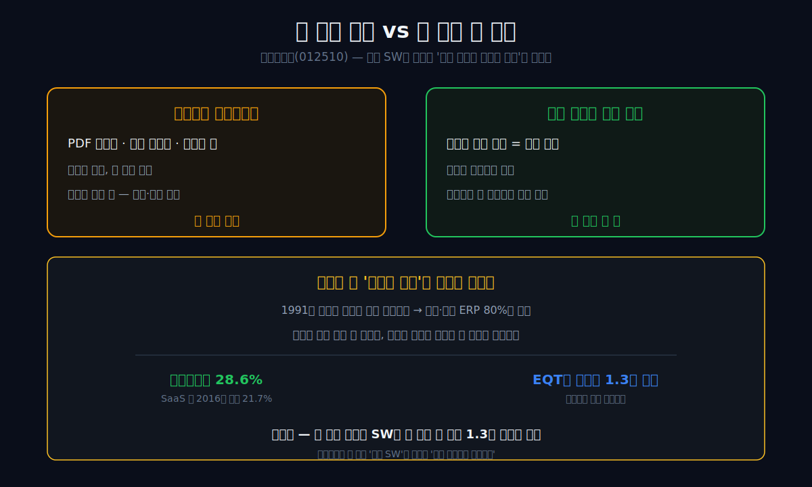
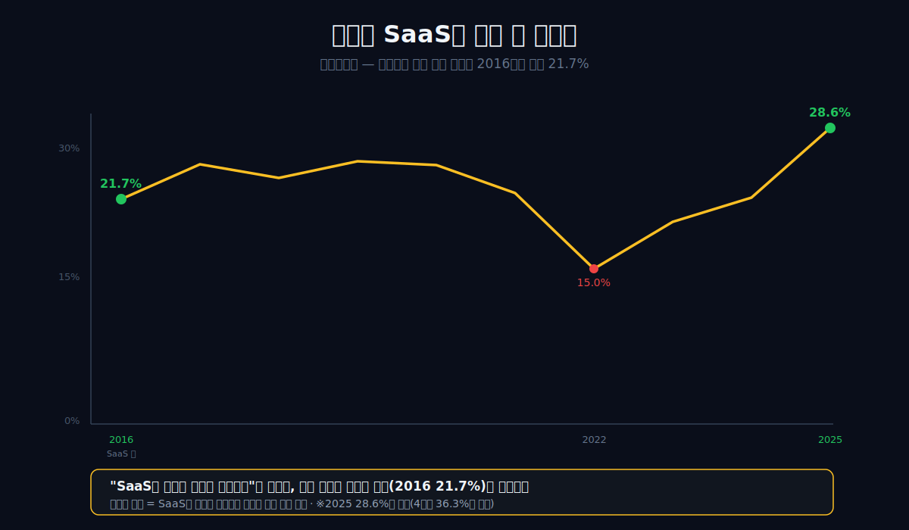
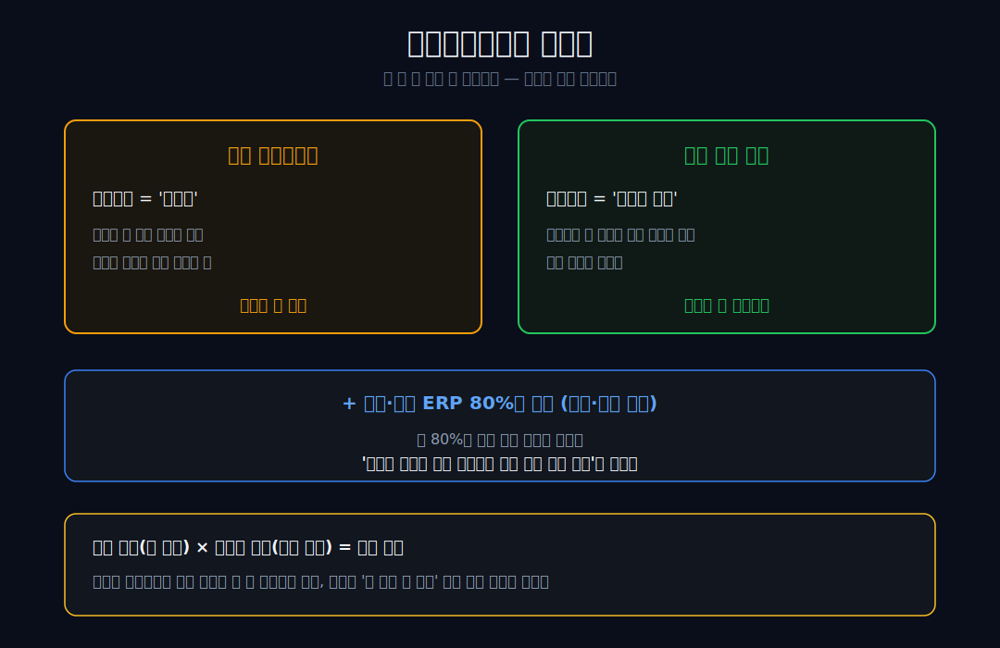
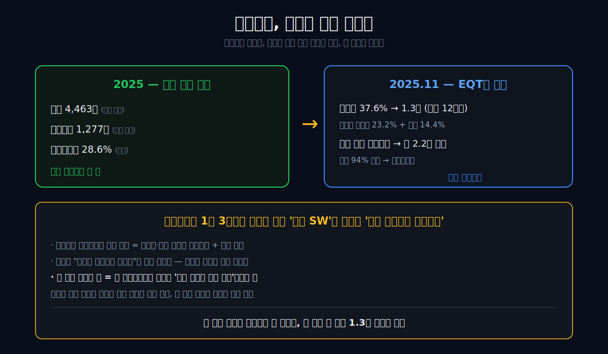
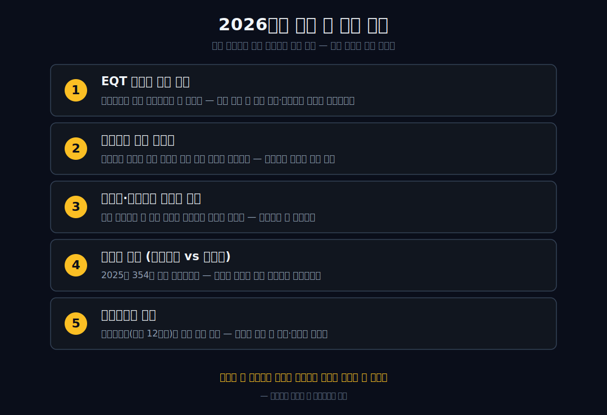

<script>
import ComboChart from '$lib/components/blog/ComboChart.svelte';
import StackBar from '$lib/components/blog/StackBar.svelte';
</script>

> **데이터 기준**: 2026-06-13 dartlab 실측 — 더존비즈온(012510) **연결 재무제표(CFS)** 기준. EQT 인수·자진 상장폐지·지분율은 회사 공시·언론 교차확인.
>
> **핵심 숫자**: 매출 **4,463억** (역대 최대) · 영업이익 **1,277억** (영업이익률 **28.6%**, 연간) · 당기순이익 **923억** · 부채비율 **79%** · 2025.11 EQT 경영권 인수(1.3조)→자진 상장폐지
>
> **이 글의 용어**: ERP = 회계·인사·재고를 통합 관리하는 기업용 소프트웨어 · SaaS = 설치 없이 매달 구독료를 내고 클라우드로 쓰는 방식 · 락인(lock-in) = 한 번 쓰면 갈아타기 어려운 상태 · 규제 샌드박스 = 기존 규제를 한시적으로 면제해 신사업을 허용하는 제도 · 공개매수·자진 상장폐지 = 대주주가 시장의 주식을 사들여 회사를 증시에서 내리는 것.

---

## 프롤로그 — 정점에서, 스스로 문을 닫는다

2026년, 더존비즈온이 주식시장에서 스스로 사라지기로 했다. 망해서가 아니다. 매출 **4,463억**, 영업이익 **1,277억**으로 *역대 최대 실적*을 낸 바로 그 해, 영업이익률 28.6%(연간)를 찍은 정점에서, 회사는 창업주와 신한금융의 지분을 스웨덴 사모펀드 **EQT**에 넘겼다 — 주당 12만 원, 경영권 지분 37.6%에 약 **1조 3천억 원**. 그리고 잔여 주식까지 공개매수(약 2.2조 원 추가 투입)해 완전자회사로 만든 뒤 증시에서 내리기로 했다.

잘나가는 회사가, 그것도 정점에서, 왜 자기를 파는가? 이 질문을 손에 쥔 채 30년을 되감아 보자.

답은 '좋은 소프트웨어'가 아니라 '안 쓰면 안 되는 의무'에 있다. 어도비의 PDF는 안 써도 살 수 있고 한컴 문서도 그렇지만, 한국 기업의 세무·회계 장부만은 다르다 — **국세청 신고 의무 때문에 법적으로 반드시 존재해야 한다.** 1991년 세무사 사무실 책상마다 깔리던 작은 회계 프로그램에서 출발한 더존은, 누구도 눈치채지 못한 사이 그 '반드시 존재해야 하는 장부'의 단말을 중견·중소기업 곳곳에 점유했다. 시장을 새로 만든 게 아니라, 국가가 법으로 이미 강제해 둔 *의무의 길목*에 올라탄 것이다.

관통선은 하나다. **"안 써도 그만인 소프트웨어 회사가, 왜 영업이익률 29%에 1조 3천억짜리 매각 대상이 됐는가?"**

답을 먼저 쓴다. 더존은 제품을 판 게 아니라, 모든 한국 기업이 법으로 *반드시* 갖춰야 하는 장부의 단말을 쥐었다 — 안 쓰면 그만인 SW를 **안 쓰면 안 되는 길목**으로 바꾼 것이다. 그 길목이 만든 예측가능한 현금흐름이, 정점에서 사모펀드를 불러들였다.



---

## 1막 — 안 써도 그만인 것들의 예외

**왜 회계 장부는 다른가.** 세상 대부분의 소프트웨어는 '안 써도 사는' 것이다. PDF 편집기도, 문서 작성기도, 그래픽 툴도 결국 대안이 있거나 안 쓰면 그만이다. 그런데 한국 기업의 세무·회계 장부는 예외다 — 국세청에 신고할 의무가 법으로 정해져 있어, 그 장부는 *반드시 존재해야 한다.* 좋아서 쓰는 게 아니라 안 쓰면 안 되는 것이다.


더존이 올라탄 자리가 바로 그 의무의 길목이었다. 흥미로운 사실 하나 — 회사의 모태인 더존소프컴(1991년 설립)의 원조 설립자는 훗날 [엔씨소프트](/blog/036570-ncsoft)를 세운 김택진이다. 지금의 더존비즈온을 ERP·클라우드 기업으로 키운 사실상의 창업주는 2003년 이후 회사를 이끈 김용우 회장이다. 게임으로 간 사람과 회계 장부에 남은 사람 — 같은 뿌리에서 갈라진 두 길이다.

이 막의 끝에서 다음 막으로 넘어간다. 그 '길목'이 재무제표에 남긴 첫 신호를 보자.

---

## 2막 — 21.7%라는 이상 신호

**왜 마진이 처음부터 두꺼웠나.** 더존의 손익을 펴면 시작점부터 이상하다.

```python
import dartlab
c = dartlab.Company("012510")
c.select("IS", ["매출액", "매출총이익", "영업이익", "당기순이익"], freq="Y")
```

| 항목 (1년치 합산, 억원) | 2025 | 2024 | 2023 | 2022 | 2021 | 2020 | 2019 | 2018 | 2017 | 2016 |
|---|---:|---:|---:|---:|---:|---:|---:|---:|---:|---:|
| 매출액 | **4,463** | 4,023 | 3,536 | 3,043 | 3,187 | 3,065 | 2,627 | 2,269 | 2,056 | 1,768 |
| 매출총이익 | 2,238 | 1,840 | 1,528 | 1,199 | 1,424 | 1,693 | 1,493 | 1,271 | 1,215 | 1,050 |
| 영업이익 | **1,277** | 881 | 691 | 455 | 712 | 767 | 668 | 540 | 517 | **384** |
| 당기순이익 | 923 | 780 | 343 | 231 | 544 | 579 | 510 | 425 | 406 | 282 |

표시: 2016년 영업이익 384억 ÷ 매출 1,768억 = 영업이익률 **21.7%**. *클라우드 구독(SaaS) 전환을 본격화하기 전*인데도 이미 21.7%였다. 흔히 "SaaS로 바꿔서 마진이 좋아졌다"고 말하지만, 더존 자신의 시작점 숫자가 그 서사를 반증한다. 마진의 뿌리는 SaaS가 아니라, *갈아타기 어려운 의무 단말을 일찍 쥐었다*는 데 있다. (2025년 영업이익률은 연간 28.6%다 — 일부 보도의 36.3%는 4분기 단일 분기 수치이니 혼동하면 안 된다.)



이 막의 끝에서, 왜 그 단말이 그토록 안 빠지는지로 들어간다.

---

## 3막 — 회계기간이라는 자물쇠

**왜 갈아타지 못하나.** 일반 소프트웨어는 마음에 안 들면 바꾸면 된다. 그런데 회계 장부는 다르다 — 한 번 깔면 회계연도 중간에 *바꾸기가 거의 불가능*하다. 신고의 연속성이 깨지기 때문이다. 일반 SW의 전환비용이 '귀찮음'이라면, 회계 단말의 전환비용은 '법적 신고의 단절 위험'이다. 차원이 다른 자물쇠다.

여기에 점유율이 더해진다. 더존은 중견·중소기업 ERP에서 압도적 점유(업계·언론은 80%대로 본다)를 쥐었다. 이 80%는 단순한 '시장 점유율'이 아니라, *국가가 강제한 의무 데이터가 매일 거쳐 가는 단말의 점유율*로 읽어야 한다. [카카오](/blog/035720-kakao)가 트래픽 독점으로도 마진 독점에는 이르지 못한 것과 달리, 더존은 '안 쓰면 안 되는' 의무 위에 단말을 깔아 락인을 만들었다.



이 막의 끝에서, 그 길목 밑에 깐 물리적 토대로 넘어간다.

---

## 4막 — 2011년, 길목 밑에 깐 인프라

**왜 클라우드 붐 전에 데이터센터를 지었나.** 2011년, 클라우드가 유행하기 한참 전에 더존은 강원도 춘천에 자체 데이터센터(D-클라우드)를 구축했다. 의무 단말이 모으는 장부 데이터가 매일 *한 곳을 거쳐 가게* 만든 물리적 토대였다.


이 고정 인프라 위에 구독을 얹은 것이 이후 마진의 한 요인일 수 있다. 다만 여기서 단정은 보류한다 — dartlab 실측에는 매출원가·구독 비중의 세부가 없어 "클라우드라 한계비용이 0이다" 같은 SaaS 교과서식 인과를 증명할 수 없다. 확실한 건 *의무 데이터가 한 곳에 모이는 구조*를 일찍 만들었다는 사실까지다.

이 막의 끝에서, 그 위에서 회사가 내린 역설적 결정으로 넘어간다.

---

## 5막 — 잘 팔리던 도구를 스스로 죽이다

**왜 멀쩡한 제품을 단종했나.** 더존은 설치형 회계 프로그램 '스마트A'를 클라우드 구독형 '위하고(WEHAGO)'로 옮기고, 2023년 말 스마트A를 단종했다. 잘 팔리던 제품을 자기 손으로 끝낸 것이다.

핵심은 길목은 그대로 둔 채 *과금 방식만 바꿨다*는 데 있다. 한 번 사고 끝나는 단발 판매 단말을, 매달 구독료가 걷히는 반복 단말로 교체했다.

 의무의 길목(회계 장부)은 손대지 않았다 — 그 위를 흐르는 돈의 형태만 일회성에서 반복으로 바꿨다. '도구를 데이터로 바꿨다'는 흔한 IT 수사보다, '의무 단말의 과금을 구독으로 전환했다'가 정확하다.

이 막의 끝에서, 그 의무 데이터가 새 사업을 연 순간으로 넘어간다.

---

## 6막 — 의무 데이터가 금융을 연 순간

**왜 SW 회사가 금융에 손댔나.** 2019년 5월, 더존은 금융위원회의 혁신금융서비스(규제 샌드박스)에 지정됐다. 기업들의 실시간 세무·회계 데이터로 중소기업의 신용을 평가하고, 같은 해 8월 미래에셋캐피탈과 매출채권 유동화(팩토링) 사업 협약을 맺었다.

여기서 두 가지를 정직하게 짚는다. 첫째, 주체 정정 — 더존이 '제도를 자기에게 맞춰 연' 게 아니라 *금융위 샌드박스에 신청해 승인받은* 것이다. 둘째, 정직 가드 — 이 핀테크·팩토링이 매출 4,463억 중 얼마인지는 공개 데이터로 확인되지 않는다. 그러니 "정체성이 금융으로 넘어갔다"고 단정하지 않는다. 남길 수 있는 인과는 하나다 — **의무가 강제로 모아 준 데이터였기에, 그것이 신용평가의 원료가 될 수 있었다.** 길목을 쥐면, 그 길로 흐르는 데이터까지 쥐게 된다.

이 막의 끝에서, 그 길목이 만든 숫자의 두께를 확인한다.

---

## 7막 — 두 점으로 그린 곡선, 그 너머의 두께

**얼마나 두꺼운가, 그리고 어디서 새는가.** 9년간 매출은 1,768억에서 4,463억으로 **2.5배**, 영업이익은 384억에서 1,277억으로 **3.3배** 커졌다. 이익이 매출보다 빨리 자란 것은 마진율이 올랐다는 뜻이지만 — 여기에 흔한 함정이 있다.

이익 배수(3.3배)가 매출 배수(2.5배)보다 큰 것은 *마진율 상승의 산술적 그림자*일 뿐, "왜 두꺼운가"의 증명이 아니다(어떤 성공 SW도 마진율이 오르면 이렇게 보인다). 진짜 두께는 영업이익률 28.6%(연간)라는 수준 자체에 있고, 그 수준의 뿌리는 2막에서 본 의무 단말 락인이다.

그리고 두께에는 새는 곳도 있다. 2025년 당기순이익은 **923억**으로, 영업이익 1,277억보다 약 **354억(28%)** 적다. 이 차이는 본업이 아니라 영업외(금융·기타)에서 빠진 것이다. "바닥까지 두껍다"가 아니라 — **본업은 두껍고, 영업외에서 일부가 샌다**가 정확한 방향이다.

이 막의 끝에서, 그 두꺼운 본업을 회사가 정점에서 통째로 넘긴 장면으로 닫는다.

---

## 8막 — 정점에서 길목을 통째로 넘기다

**왜 가장 잘나갈 때 팔았나.** 2025년 11월 7일, 창업주 김용우 회장(지분 23.2%)과 신한금융 계열(14.4%)은 보유 지분 합계 37.6%를 EQT에 주당 12만 원, 약 **1조 3천억 원**에 넘기는 계약을 맺었다. 이듬해 EQT는 잔여 유통주식까지 공개매수(약 2.2조 원 추가)해 지분 94%를 확보하고, 회사를 완전자회사로 만들어 증시에서 내리기로 했다. 역대 최대 실적(매출 4,463억·영업이익 1,277억)을 발표한 바로 그 정점에서다.

여기서 인과를 단정하지 않는다. "데이터 자산이라서 팔렸다"는 사후 합리화일 수 있다 — 사모펀드 바이아웃은 데이터 가치보다 *안정적이고 예측 가능한 현금흐름·높은 마진*을 표준 타깃으로 삼는다. 사모펀드가 인수해 배당으로 현금을 거둬간 [한온시스템](/blog/018880-hanon-systems)이 그 셈법의 다른 사례다. 그러니 데이터가 없어도 더존은 PE의 좋은 먹잇감이다. 단 한 가지, 그 예측가능성의 *원천*만은 이 회사 고유다 — **법이 모든 기업에 강제하는 의무 매출.** 경기가 좋든 나쁘든 기업은 세금 신고를 해야 하고, 그 장부의 단말은 더존이 쥐고 있다. 사모펀드가 1조 3천억을 베팅한 것은 '좋은 소프트웨어'가 아니라 *법이 보증하는 현금흐름*이었다.



안 써도 그만인 프로그램 한 자루가, 안 쓰면 안 되는 1조 3천억짜리 길목으로 변했다. 그리고 그 길목은 이제 증시 밖에서, 새 주인의 손으로 넘어간다. 같은 '자기 시장·모델을 만든 돌파자' 계열로, 연어 분자로 카테고리를 연 [파마리서치](/blog/214450-pharmaresearch), 렌탈 모델을 발명하고 주인이 세 번 바뀐 [코웨이](/blog/021240-coway)가 있다 — 셋 다 '무엇을 쥐었느냐'가 운명을 갈랐다. 잘나가는 회사가 정점에서 스스로 문을 닫는 이 역설의 답은 — *길목을 쥔 자에게는 시장의 박수보다 안정된 현금이 더 값지다*는 사모펀드의 셈법에 있다.

---

## 2026년에 봐야 할 다섯 가지

> ※ 자진 상장폐지가 마무리되면 일반 투자자는 주식으로 접근할 수 없게 된다. 아래는 회사(또는 비상장 이후의 사업)를 이해하기 위한 관전 포인트다.

1. **EQT 체제의 과금 전략** — 사모펀드는 보통 현금흐름을 더 짜낸다. 의무 단말 위 구독 단가·갱신율을 어떻게 끌어올리는가.
2. **클라우드 구독 전환율** — 설치형을 단종한 만큼, 위하고 구독 매출 비중이 계속 오르는지. 전환이 정체되면 '길목'의 현금화 속도가 둔해진다.
3. **핀테크·매출채권 사업의 실체** — 의무 데이터가 연 금융 사업이 매출에서 얼마나 자라는가. 꼬리인지 새 몸통인지.
4. **영업외 누수(영업이익 vs 순이익 격차)** — 2025년 354억 갭이 좁혀지는지. 본업의 두께가 최종 이익까지 내려오는가.
5. **상장폐지의 조건** — 공개매수가(주당 12만 원)와 잔여 주주 보호. 비상장 전환 후 배당·재상장 가능성.



---

## 검증표

본문의 모든 인용 수치를 dartlab 호출과 결과로 검증한다. 외부 출처는 분리 표기. 📅 dartlab 실측 2026-06-13 · 더존비즈온(012510) 연결(CFS) 기준.

| 본문 수치 | 출처 / dartlab 호출 | 결과 |
|---|---|---|
| 매출 1,768억(2016) → 4,463억(2025), 2.5배 | `c.select("IS",["매출액"],freq="Y")` | ✓ 실측 |
| 영업이익 384억(2016) → 1,277억(2025), 3.3배 | `c.select("IS",["영업이익"],freq="Y")` | ✓ 실측 |
| 영업이익률 2016 21.7%(SaaS 전 이미 두꺼움) → 2025 28.6%(연간) | 영업이익÷매출 | ✓ 실측 |
| 당기순이익 2025 923억 — 영업이익 1,277억 대비 약 354억 영업외 누수 | `c.select("IS",["당기순이익","영업이익"],freq="Y")` | ✓ 실측 |
| 부채비율 약 79%(2025, 부채 4,982억/자본 6,318억) | `c.select("BS",["부채총계","자본총계"],freq="Y")` | ✓ 실측 |
| 영업활동현금흐름 2025 1,296억 | `c.select("CF",["영업활동현금흐름"],freq="Y")` | ✓ 실측 |
| 영업이익률 36.3%는 4분기 단일 분기치 — 연간은 28.6% | 분기 vs 연간 구분 | ✓ 정정(혼동 금지) |
| 1991 더존소프컴 원조 설립자=김택진(NCSOFT) · 김용우 2003~ 사실상 창업주 | 언론·연혁 | 외부 인용 |
| 2011 춘천 데이터센터 · 2019 규제샌드박스(매출채권 핀테크) · 2023 스마트A 단종 | 회사·언론 | 외부 인용 |
| 2025.11.7 EQT 경영권 37.6% 인수 약 1.3조(주당 12만원) + 잔여 공개매수 약 2.2조 → 자진 상장폐지 | 회사 공시·언론 | 외부 인용 |

본문의 숫자 중 이 표에 없는 것은 발행 차단 대상이다.

---

<!-- AUTO:START — sync_financials.py가 자동 생성. 수동 편집 금지 -->


## 공시 자료

| 기간 | 보고서 | 링크 |
|------|--------|------|
| 2026 | 분기보고서 | [DART에서 보기](https://dart.fss.or.kr/dsaf001/main.do?rcpNo=20260515002089) |
| 2025 | 사업보고서 | [DART에서 보기](https://dart.fss.or.kr/dsaf001/main.do?rcpNo=20260318001198) |
| 2025 | 분기보고서 | [DART에서 보기](https://dart.fss.or.kr/dsaf001/main.do?rcpNo=20251114001969) |
| 2025 | 반기보고서 | [DART에서 보기](https://dart.fss.or.kr/dsaf001/main.do?rcpNo=20250814003371) |
| 2025 | 분기보고서 | [DART에서 보기](https://dart.fss.or.kr/dsaf001/main.do?rcpNo=20250515002754) |
| 2024 | 사업보고서 | [DART에서 보기](https://dart.fss.or.kr/dsaf001/main.do?rcpNo=20250317001028) |
| 2024 | 분기보고서 | [DART에서 보기](https://dart.fss.or.kr/dsaf001/main.do?rcpNo=20241114002682) |
| 2024 | 반기보고서 | [DART에서 보기](https://dart.fss.or.kr/dsaf001/main.do?rcpNo=20240814004151) |
| 2024 | 분기보고서 | [DART에서 보기](https://dart.fss.or.kr/dsaf001/main.do?rcpNo=20240516001771) |
| 2023 | 사업보고서 | [DART에서 보기](https://dart.fss.or.kr/dsaf001/main.do?rcpNo=20240313001285) |

> 전체 공시 목록은 dartlab에서 확인:
> ```python
> import dartlab
> c = dartlab.Company("012510")
> c.filings()
> ```

## 재무제표 — 최근 5개년

> 아래는 최근 5개년 요약입니다. 전체 기간·분기별 데이터는 dartlab에서 직접 확인할 수 있습니다:
> ```python
> import dartlab
> c = dartlab.Company("012510")
> c.show("IS")              # 손익계산서 (분기)
> c.show("IS", freq="Y")    # 손익계산서 (연간)
> c.show("BS")              # 재무상태표
> c.show("CF")              # 현금흐름표
> c.show("SCE")             # 자본변동표
> c.show("ratios")          # 재무비율
> ```

### 손익계산서 (IS) — 단위 억원

<ComboChart data={[{year:"2026Q1",매출액:1166,영업이익:350,당기순이익:228},{year:"2025",매출액:4463,영업이익:1277,당기순이익:923},{year:"2024",매출액:4023,영업이익:881,당기순이익:780},{year:"2023",매출액:3536,영업이익:691,당기순이익:343},{year:"2022",매출액:3043,영업이익:455,당기순이익:231}]} lineKeys={["매출액"]} barKeys={["영업이익","당기순이익"]} lineColors={["#22c55e"]} barColors={["#3b82f6","#f59e0b"]} title="매출(라인) vs 영업이익·당기순이익(막대)" unit="억원" />

| 항목 | 2026Q1 | 2025 | 2024 | 2023 | 2022 |
|---|---:|---:|---:|---:|---:|
| 매출액 | 1,166 | 4,463 | 4,023 | 3,536 | 3,043 |
| 매출원가 | 561 | 2,225 | 2,183 | 2,008 | 1,844 |
| 매출총이익 | 604 | 2,238 | 1,840 | 1,528 | 1,199 |
| 판매비와관리비 | 254 | 960 | 959 | -107 | 73 |
| 영업이익 | 350 | 1,277 | 881 | 691 | 455 |
| 금융수익 | — | — | — | — | — |
| 금융비용 | 36 | 236 | 202 | 169 | 97 |
| 당기순이익 | 228 | 923 | 780 | 343 | 231 |

### 재무상태표 (BS) — 단위 억원

<StackBar data={[{year:"2026Q1",segments:[{label:"부채",value:5173,color:"#ef4444"},{label:"자본",value:6307,color:"#22c55e"}]},{year:"2025",segments:[{label:"부채",value:4982,color:"#ef4444"},{label:"자본",value:6318,color:"#22c55e"}]},{year:"2024",segments:[{label:"부채",value:4828,color:"#ef4444"},{label:"자본",value:5548,color:"#22c55e"}]},{year:"2023",segments:[{label:"부채",value:4380,color:"#ef4444"},{label:"자본",value:4453,color:"#22c55e"}]},{year:"2022",segments:[{label:"부채",value:3944,color:"#ef4444"},{label:"자본",value:4385,color:"#22c55e"}]}]} title="부채 vs 자본 구조" unit="억원" />

| 항목 | 2026Q1 | 2025 | 2024 | 2023 | 2022 |
|---|---:|---:|---:|---:|---:|
| 자산총계 | 11,480 | 11,300 | 10,376 | 8,833 | 8,329 |
| 유동자산 | 2,841 | 2,600 | 2,159 | 1,256 | 1,439 |
| 비유동자산 | 8,640 | 8,699 | 8,217 | 7,577 | 6,890 |
| 부채총계 | 5,173 | 4,982 | 4,828 | 4,380 | 3,944 |
| 유동부채 | 4,871 | 4,735 | 2,043 | 4,155 | 1,377 |
| 비유동부채 | 302 | 247 | 2,785 | 225 | 2,567 |
| 자본총계 | 6,307 | 6,318 | 5,548 | 4,453 | 4,385 |

### 현금흐름표 (CF) — 단위 억원

<ComboChart data={[{year:"2026Q1",영업CF:224,투자CF:64,재무CF:0},{year:"2025",영업CF:1296,투자CF:-1000,재무CF:0},{year:"2024",영업CF:1036,투자CF:-345,재무CF:0},{year:"2023",영업CF:1012,투자CF:-685,재무CF:0},{year:"2022",영업CF:773,투자CF:304,재무CF:0}]} barKeys={["영업CF","투자CF","재무CF"]} barColors={["#22c55e","#ef4444","#3b82f6"]} title="영업·투자·재무 현금흐름" unit="억원" />

| 항목 | 2026Q1 | 2025 | 2024 | 2023 | 2022 |
|---|---:|---:|---:|---:|---:|
| 영업활동현금흐름 | 224 | 1,296 | 1,036 | 1,012 | 773 |
| 투자활동현금흐름 | 64 | -1,000 | -345 | -685 | 304 |
| 재무활동현금흐름 | — | — | — | — | — |

*최종 갱신: 2026-06-13 | dartlab 실측 (DART 공시 기준)*

<!-- AUTO:END -->
