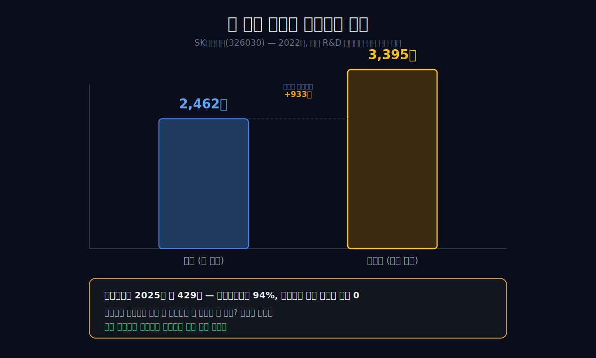
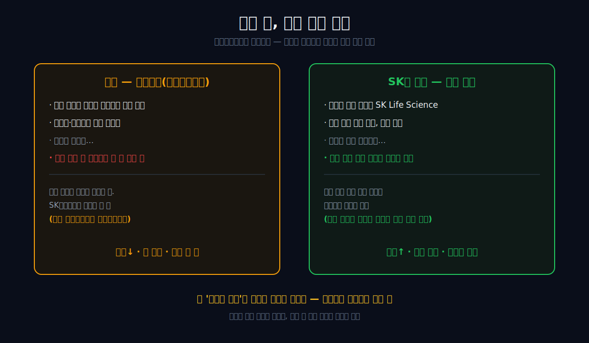
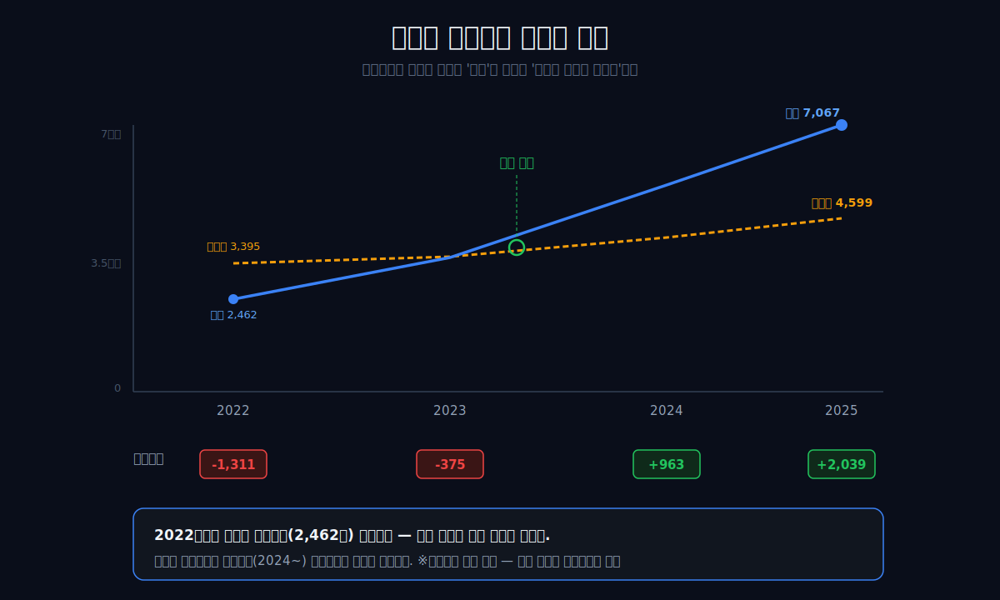
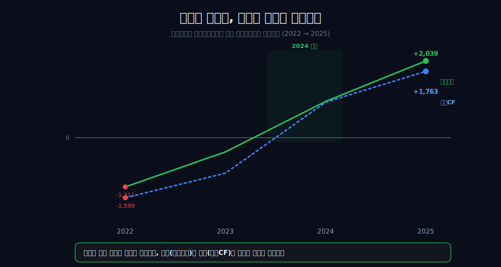
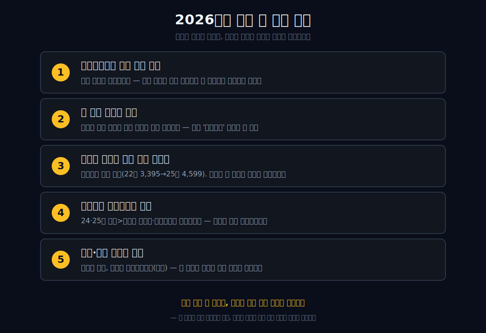

<script>
import ComboChart from '$lib/components/blog/ComboChart.svelte';
import StackBar from '$lib/components/blog/StackBar.svelte';
</script>

> **데이터 기준**: 2026-06-13 dartlab 실측 — SK바이오팜(326030) **연결 재무제표(CFS)** 기준. 미국 직판(SK Life Science)·FDA 승인·유럽 라이선스아웃은 회사 공시·언론 교차확인.
>
> **핵심 숫자**: 매출 **7,067억** · 영업이익 **2,039억** (영업이익률 **28.9%**) · 당기순이익 **2,533억** · 매출총이익률 **94%** (2025년 단년) · 부채비율 **45%** · 2022년 판관비 **3,395억** > 그해 매출 **2,462억**
>
> **이 글의 용어**: 신약 = 새 성분으로 처음 허가받은 약 · 라이선스아웃(기술수출) = 약의 판매 권리를 다른 회사에 넘기고 계약금·로열티를 받는 것 · 직판 = 자기 영업조직으로 직접 파는 것 · 판관비(판매비와관리비) = 파는 데·운영하는 데 드는 비용 · 매출원가 = 약을 만드는 데 든 원가 · 영업레버리지 = 고정비를 매출이 넘어설 때 이익이 빠르게 늘어나는 효과.

---

## 프롤로그 — 약 파는 비용이 약값보다 컸던 해

2022년, SK바이오팜이 약을 *파는 데* 쓴 비용이 그해 약을 *판* 돈보다 컸다. 판매비와관리비 **3,395억**, 매출 **2,462억**. 오타가 아니다. '신약 R&D 회사'라는 간판을 단 회사가, 그해 만들어 판 약값보다 더 많은 돈을 '파는 일'에 쓴 것이다.

보통 신약회사의 손익은 연구비가 무겁다고들 한다. 그런데 이 회사의 매출원가는 2025년 기준 단 **429억**이다. 매출 7,067억에 견주면 원가율은 한 자릿수, 매출총이익률 **94%**. 약값에서 공장 원가는 거의 0에 가깝다. 그렇다면 2022년에 매출보다 컸던 그 거대한 판관비로 이 회사가 산 것은 무엇이었나?

답은 분자가 아니다. **미국 의사에게 처방전을 받아내는 영업 인프라**다.



한국 신약사 대부분은 약을 임상 중간에 글로벌 제약사에 팔아넘기고(라이선스아웃) 로열티를 받는다. SK바이오팜도 유럽은 그렇게 넘겼다(아벨 테라퓨틱스). 그런데 가장 큰 시장 미국만은 직판 자회사 **SK Life Science**를 깔고 끝까지 직접 들고 갔다. 약을 만든 게 아니라, 약을 파는 미국 조직을 만든 것이다.

그래서 관통선은 하나다. **"신약 R&D 회사가 왜 약값보다 큰 돈을 파는 데 썼고, 그 적자는 어떻게 흑자가 됐는가?"** 답을 먼저 쓴다. SK바이오팜의 흑자전환은 '약이 좋아져서'가 아니라 *깔아둔 영업비를 매출이 추월해서* 왔다. 비용에 답이 있었다.

이 문장을 조금 더 좁혀야 한다. "약이 좋아져서가 아니다"라는 말은 약의 효능이나 시장성을 부정하는 말이 아니다. 약이 팔릴 수 있어야 직판망도 의미가 있다. 다만 재무제표에서 흑자전환의 스위치를 누른 항목은 연구개발비가 아니라 판관비였다는 뜻이다. 이 회사는 실험실에서 끝난 이야기가 아니라, 미국 처방 시장에서 반복적으로 약을 팔아야 완성되는 이야기다.

그래서 이 글은 파이프라인 가치를 평가하는 글이 아니다. 세노바메이트의 임상 우월성을 논하는 글도 아니다. 더 좁고 회계적인 질문 하나만 잡는다. **2022년에 매출보다 컸던 판관비는 낭비였나, 아니면 나중에 매출이 타고 넘을 비용선이었나.** 이 질문에 답하려면 매출액, 판관비, 영업이익, 영업현금흐름을 같은 표에 놓고 봐야 한다. 순이익은 잠시 뒤로 미룬다. 2024년 이후 순이익에는 영업외·세금효과가 섞여 있어, 직판 모델의 본업 체력을 읽는 첫 줄로 쓰기에는 너무 화려하기 때문이다.

---

## 1막 — 한국 신약사의 정석을 거부한 선택

**왜 약을 끝까지 직접 들고 갔나.** 세노바메이트(미국 제품명 엑스코프리/XCOPRI)는 한국에서 후보물질부터 출발한 뇌전증(간질) 치료 신약이다. 신약을 손에 쥔 한국 회사 앞에는 보통 두 갈래 길이 있다. 하나는 임상 도중 큰 글로벌 제약사에 권리를 넘기고 계약금과 로열티를 챙기는 '정석'이다. 위험을 덜고 돈을 일찍 받는 대신, 그 약이 시장에서 버는 돈의 대부분은 사 간 회사가 가져간다.

SK바이오팜은 미국에서 그 정석을 거부했다. 미국에 직판 자회사 SK Life Science를 세우고 영업 조직을 직접 고용해, FDA 승인(2019년 11월)을 받은 뒤 2020년 미국 시장에 자기 손으로 약을 깔았다. 한국 기업이 발굴한 신약을 미국에서 *직접 판매*한 사례다.

[SK Life Science의 회사 소개와 연혁](https://www.sklifescienceinc.com/about-us/)은 이 대목을 매우 직접적으로 보여준다. 회사는 자신을 SK바이오팜의 미국 자회사로 설명하고, 세노바메이트가 2019년 FDA 승인을 받고 2020년 미국에서 판매 가능해진 흐름을 적고 있다. 또 SK바이오팜을 "후보물질 발굴부터 FDA 승인과 상업화까지 파트너링이나 라이선스아웃 없이 진행한 첫 한국 기반 회사"라는 취지로 소개한다. 이 표현은 투자자에게 중요하다. 단순히 신약을 만든 회사가 아니라, 미국에서 처방을 만들어내는 상업화 기능까지 손익계산서 안에 들고 들어온 회사라는 뜻이기 때문이다.


여기서 정확히 한정한다. SK바이오팜은 '혼자 다 직판'한 게 아니다. 유럽은 아벨 테라퓨틱스에 라이선스아웃했다. 즉 *가장 큰 시장 미국만* 가치사슬 끝까지 소유하기로 한 선택이다. 이 한정이 중요하다 — 직판은 모든 시장에서 한 게 아니라, 가장 크고 가장 비싼 시장 하나에 집중한 베팅이었다.



## 산업 패턴 — 왜 보통 권리를 팔고, 왜 미국은 남겼나

신약회사가 권리를 파는 이유는 겁이 많아서가 아니다. 합리적이라서다. 미국 판매는 허가만 받는다고 끝나지 않는다. 보험 등재, 도매 유통, 환자 지원, 의사 대상 영업, 처방 데이터 추적, 약가 할인과 리베이트 관리, 규제 준수 비용이 동시에 붙는다. 연구개발 회사가 이 모든 기능을 자기 손익에 안으면 약이 팔리기 전부터 비용이 먼저 나온다. 그래서 작은 바이오텍은 보통 임상 중간이나 허가 전후에 큰 제약사에 권리를 넘긴다. 계약금과 마일스톤을 받아 생존 시간을 벌고, 이후 매출의 일부를 로열티로 받는다.

그 선택은 재무제표를 가볍게 만든다. 대신 성공했을 때의 위쪽도 남에게 준다. 약이 블록버스터가 되면, 매출과 영업마진의 대부분은 판매 권리를 가진 회사의 손익계산서에 남는다. 원개발사는 "좋은 약을 만든 회사"로 인정받지만, 가치사슬의 마지막 줄인 처방과 매출은 자기 장부에 온전히 들어오지 않는다.

SK바이오팜의 미국 직판은 반대다. 2022년처럼 비용이 먼저 나오는 구간을 스스로 떠안는다. 대신 2025년처럼 매출이 올라온 뒤에는 총매출과 판관비, 영업이익이 모두 자기 손익계산서에 남는다. 이 차이가 이 회사를 일반적인 기술수출 바이오와 갈라놓는다. 같은 세노바메이트라도 유럽은 라이선스아웃이라 수익의 모양이 다르고, 미국은 직판이라 수익과 비용이 모두 굵게 잡힌다. 그래서 이 회사의 본질은 "신약을 만들었다"보다 "가장 큰 시장의 판매 손익을 직접 소유했다"에 더 가깝다.

이 선택은 재무제표에 비정상으로 나타난다. 그게 2막이다.

---

## 2막 — 2022년의 적자는 실패가 아니었다

**왜 매출이 있는데도 적자였나.** 2022년 SK바이오팜의 영업이익은 **-1,311억**, 영업활동현금흐름은 **-1,599억**이었다. 그해에도 매출은 있었다(2,462억). 그런데 적자였다. 이유는 앞에서 본 한 줄에 있다 — 판관비 3,395억이 매출보다 컸기 때문이다.

```python
import dartlab
c = dartlab.Company("326030")
c.select("IS", ["매출액", "판매비와관리비", "영업이익"], freq="Y")
```

| 항목 (1년치, 억원) | 2025 | 2024 | 2023 | 2022 | 2021 |
|---|---:|---:|---:|---:|---:|
| 매출액 | **7,067** | 5,476 | 3,549 | 2,462 | 4,186 |
| 판매비와관리비 | 4,599 | 4,082 | 3,583 | **3,395** | 3,014 |
| 영업이익 | **+2,039** | +963 | -375 | **-1,311** | +950 |

표시: 2022년 판관비 3,395억은 그해 매출 2,462억보다 약 933억 크다. 이건 '망해서 난 적자'가 아니라 *매출이 따라오기 전에 비용을 먼저 깔아둔* 적자다. 직판 조직은 약이 본격적으로 팔리기 전부터 영업사원·마케팅·유통 비용이 든다. 미래의 매출을 위해 현재의 비용을 먼저 쓴 구간이었다.


여기서 중요한 건 판관비가 단순히 "낭비"라는 한 단어로 처리되지 않는다는 점이다. 미국 직판망은 제품이 팔리는 순간에만 발생하는 비용과, 매출이 아직 작아도 먼저 깔아야 하는 비용이 섞여 있다. 영업 인력, 본사 조직, 환자 지원 시스템, 마케팅, 유통 채널, 보험 대응은 매출 2,000억대에도 필요하고 매출 7,000억대에도 필요하다. 그래서 초기에는 이 비용이 매출보다 커 보인다. 하지만 제품 처방이 누적되고 같은 조직이 더 많은 처방을 감당하면, 매출은 비용선을 넘기 시작한다.

2022년의 숫자를 다시 보면 구조가 선명해진다. 매출 2,462억에서 매출원가를 빼면 매출총이익은 이미 꽤 두껍다. 문제는 그 아래 판관비가 더 컸다는 것이다. 즉 SK바이오팜의 적자는 "약을 팔수록 원가 때문에 손해"가 아니라 "약은 고마진이지만, 미국 직판 조직을 먹여 살릴 만큼 아직 많이 팔지 못한 상태"였다. 이 차이는 크다. 첫 번째라면 제품 경제성이 나쁜 것이고, 두 번째라면 매출 규모가 임계점을 넘는지가 핵심이다.

또 하나 조심할 점은 2021년이다. 2021년 영업이익 950억만 떼어놓고 보면 이미 흑자 회사처럼 보인다. 하지만 그해 매출 4,186억에는 기술료와 마일스톤 성격의 일회성 수익이 섞였을 가능성이 높다. 그래서 2021년은 "직판 모델이 안정적으로 돈을 번 해"가 아니라 "기술수출 성격의 수익이 손익을 띄운 해"로 따로 둬야 한다. 직판 모델의 진짜 시험대는 일회성이 빠진 뒤, 미국 엑스코프리 매출이 자기 힘으로 판관비를 넘기 시작한 2024년 이후다.

여기서 단조성장의 거짓말을 피한다. 매출은 21년 4,186억에서 22년 2,462억으로 *줄었다.* 21년이 높았던 데는 본업의 성숙이 아니라 일회성 요인(기술료·계약금 등 라이선스 마일스톤)이 끼었을 가능성이 크다. 그러니 21년 영업흑자 950억은 24년 이후의 본업 흑자와 분리해 읽어야 한다 — 22년의 매출 감소는 그 일회성이 빠진 자리다.

그렇다면 깔아둔 그 비용은 언제 돌아왔나?

---

## 3막 — 매출이 선투자선을 추월한 순간

**무엇이 적자를 흑자로 뒤집었나.** 흔히 "매출이 늘어 흑자전환했다"고 말한다. 그런데 그 말은 이 회사에선 틀렸다. 2022년에도 매출은 있었지만 적자였기 때문이다. 진짜 변수는 매출의 *크기*가 아니라, **깔아둔 비용을 매출이 넘느냐**였다.

```python
c.select("IS", ["매출액", "영업이익"], freq="Y")
c.select("CF", ["영업활동현금흐름"], freq="Y")
```

| 항목 (1년치, 억원) | 2022 | 2023 | 2024 | 2025 |
|---|---:|---:|---:|---:|
| 매출액 | 2,462 | 3,549 | 5,476 | **7,067** |
| 영업이익 | -1,311 | -375 | +963 | **+2,039** |
| 영업활동현금흐름 | -1,599 | -942 | +949 | **+1,763** |

매출이 22년 2,462억에서 24년 5,476억, 25년 7,067억으로 가속하자 — 영업이익은 -1,311억에서 +963억, +2,039억(영업이익률 **28.9%**)으로, 영업현금흐름은 -1,599억에서 +949억, +1,763억으로 *부호가 통째로 뒤집혔다.* 손익과 현금이 동시에 마이너스에서 플러스로 넘어갔다.

2025년의 매출 7,067억은 단순한 전체 매출 숫자보다 더 좁게 봐야 한다. [2025년 4분기·연간 실적발표 목록](https://www.skbp.com/eng/invest/presentationList.do)과 이를 인용한 보도에 따르면, 2025년 세노바메이트의 미국 매출은 **6,303억**(약 **4.432억 달러**)까지 올라왔다. 전체 매출 7,067억 중 대부분이 미국 엑스코프리에서 나온 셈이다. 그러니 이 회사의 흑자전환을 설명하는 첫 변수는 "여러 제품 포트폴리오가 골고루 컸다"가 아니다. 미국 직판으로 판 단일 핵심 제품이 비용선을 넘어설 만큼 커졌다는 것이다.

이 숫자는 2026년 1분기에도 이어진다. 2026년 1분기 연결 매출은 **2,279억**, 영업이익은 **898억**이다. 분기 영업이익률만 보면 39%대까지 올라간다. 물론 한 분기를 연간으로 곱해 장기 이익률을 단정하면 안 된다. 다만 2022년에는 매출보다 판관비가 컸던 회사가, 2026년 1분기에는 한 분기에 900억 가까운 영업이익을 냈다는 대비는 모델의 방향을 보여준다. 손익의 병목은 제조 원가가 아니라 미국 판매 규모였고, 그 규모가 커지자 손익이 빠르게 바뀌었다.



다만 이걸 '순수 영업레버리지가 터졌다'고 단정하진 않는다. 판관비도 22년 3,395억에서 25년 4,599억으로 함께 늘었다 — 비용이 고정된 채 매출만 넘어선 교과서적 고정비 효과는 아니다. 정확히는 *깔아둔 비용을 매출이 추월하며 손익의 부호가 뒤집힌 구조*다. 매출과 이익이 같이 움직인 건 1차적으로 관찰이지, '레버리지가 폭발했다'는 단정이 아니다.

## 비용선 해부 — 무엇이 고정비이고, 무엇이 다시 커질 비용인가

직판 모델을 좋게만 읽으면 또 틀린다. 판관비는 한 번 깔면 그대로 유지되는 콘크리트 비용이 아니다. 매출이 커질수록 함께 커지는 비용도 있다. 미국 의사 대상 마케팅은 경쟁 상황에 따라 더 세질 수 있고, 환자 지원과 보험 대응 비용도 처방 규모가 커질수록 늘 수 있다. SK Life Science가 2025년에 미국 내 소비자 대상 캠페인을 넓혔다는 사실도 비용이 계속 움직인다는 신호다. 그래서 2025년 판관비 4,599억을 영구 고정비처럼 놓고, 매출 증가분이 모두 영업이익으로 떨어진다고 계산하면 과하다.

반대로 판관비가 계속 늘어난다고 해서 직판 모델이 무의미한 것도 아니다. 이미 미국 영업망, 유통, 규제 대응, 처방 데이터 운영의 기본 골격이 깔린 상태라면 다음 매출 1,000억을 만들 때 필요한 추가 비용은 초기 1,000억을 만들 때와 다를 수 있다. 2022년에는 조직을 세우는 비용이 먼저 나왔고, 2025년에는 같은 조직이 더 큰 매출을 처리했다. 이때 생기는 차이가 영업이익률을 만든다.

그래서 앞으로 봐야 할 항목은 매출 성장률 하나가 아니다. **미국 엑스코프리 매출 증가율과 판관비·R&D 증가율의 격차**다. 회사가 2026년에 미국 세노바메이트 매출 가이던스를 5.5억~5.8억 달러 범위로 제시하고, 동시에 R&D와 판매 투자를 늘린다면 질문은 이렇게 바뀐다. 매출이 늘어나는 속도가 새 투자비를 다시 앞지를 수 있는가. 2022년의 비용선은 한 번 넘었다. 2026년의 새 비용선도 넘을 수 있는지가 다음 시험이다.

---

## 매출총이익률 94%의 의미 — 약값은 남고, 판매망이 먹는다

2025년 SK바이오팜의 매출원가는 429억, 매출은 7,067억이다. 단순 계산으로 매출총이익률은 약 94%다. 제조업 회사라면 이 숫자는 거의 말이 안 되는 수준이다. 자동차, 배터리, 화학, 유통 기업의 손익에서는 원재료와 생산 원가가 첫 번째 전쟁터다. 그런데 이 회사의 전쟁터는 원가가 아니라 원가 아래다. 약을 만든 뒤 남는 돈은 많지만, 그 돈이 판관비와 R&D를 지나 영업이익으로 남느냐가 핵심이다.

이 구조는 신약회사의 매력을 보여준다. 성공한 약은 단위당 원가가 낮고, 가격은 높다. 판매량이 늘수록 매출총이익이 빠르게 쌓인다. 2025년 매출총이익 6,638억은 이 회사가 미국에서 약을 팔 때 얼마나 두꺼운 총이익 풀을 만들 수 있는지 보여준다. 그래서 세노바메이트가 충분히 팔리기 시작하면 손익이 빠르게 좋아진다. 2022년에는 이 총이익 풀보다 직판 조직과 운영비가 더 컸고, 2025년에는 총이익 풀이 판관비를 넘었다.

하지만 94%라는 숫자만 보고 "완벽한 사업"이라고 쓰면 안 된다. 약가가 높고 원가가 낮을수록, 시장 접근과 처방 확대의 비용도 중요해진다. 미국에서는 의사가 처방해도 환자가 실제로 약을 받기까지 보험 승인, 본인부담, 환자 지원, 유통 재고, 약가 할인과 리베이트가 끼어든다. 매출총이익률은 공장 문 앞의 경제성을 보여주지만, 미국 처방 시장의 마찰 비용은 판관비와 순매출에 나타난다. 그래서 이 회사의 질문은 "원가율이 낮은가"에서 끝나지 않는다. **낮은 원가율로 만든 총이익이 미국 판매 비용을 충분히 덮는가**까지 가야 한다.

이 점에서 2025년 영업이익률 28.9%는 더 의미가 있다. 매출총이익률 94%가 제품 경제성의 가능성을 보여준다면, 영업이익률 28.9%는 그 가능성이 판관비와 R&D를 지나 실제 이익으로 남기 시작했다는 증거다. 아직 완성된 결론은 아니다. 판관비와 연구개발비는 다시 커질 수 있다. 다만 2025년 숫자는 "신약은 고마진이지만 직판비에 먹힌다"는 구간에서 "직판비를 먹고도 이익이 남는다"는 구간으로 넘어왔음을 보여준다.

또 하나의 함정은 매출총이익률을 다른 바이오 회사와 단순 비교하는 것이다. 위탁생산 회사는 매출원가가 높아도 가동률과 장기계약이 장점일 수 있고, 기술수출 회사는 매출원가가 낮아 보여도 매출 자체가 일회성일 수 있다. SK바이오팜은 그 중간이 아니다. 미국 판매 권리를 직접 들고 가는 신약 상업화 회사다. 그래서 이 회사의 94%는 "원가율 낮은 바이오"라는 일반론보다, "직판 비용을 뚫으면 영업이익이 두꺼워질 수 있는 구조"라는 뜻으로 읽어야 한다.

---

## 숫자 타임라인 — 비용선이 답을 얻는 과정

이 글의 숫자는 한 해씩 따로 읽으면 의미가 흐려진다. 2022년은 적자였고, 2023년도 적자였고, 2024년에 흑자로 돌아섰고, 2025년에 이익이 커졌다. 이렇게만 쓰면 흔한 성장주 서사가 된다. 핵심은 각 해가 같은 질문에 답하고 있다는 점이다. **미국 직판 비용선을 매출이 넘었는가.**

| 시점 | 손익 상태 | 읽어야 할 질문 |
|---|---|---|
| 2022 | 매출 2,462억, 판관비 3,395억, 영업이익 -1,311억 | 직판망을 먼저 깔았지만 매출이 아직 비용선을 넘지 못했다 |
| 2023 | 매출 3,549억, 영업이익 -375억 | 매출이 올라오며 손실 폭이 줄었지만, 비용선 돌파 전이다 |
| 2024 | 매출 5,476억, 영업이익 +963억, 영업CF +949억 | 본업 손익과 현금이 동시에 플러스로 돌아선 첫 구간이다 |
| 2025 | 매출 7,067억, 영업이익 +2,039억, 영업CF +1,763억 | 직판 비용선을 넘어 이익률이 두꺼워진 해다 |
| 2026Q1 | 매출 2,279억, 영업이익 +898억 | 최근 분기에서도 비용선 위에 머물고 있는지 확인하는 중간 점검이다 |

이 타임라인은 2022년을 다시 보게 만든다. 2022년 적자는 결론이 아니라 시작점이었다. 그해 판관비가 매출보다 컸기 때문에, 회사의 질문은 "적자가 끝날 수 있는가"가 아니라 "매출이 어느 시점에 판관비를 넘어설 만큼 커지는가"였다. 2023년에는 손실 폭이 줄었고, 2024년에 영업이익과 영업현금흐름이 동시에 플러스로 돌아섰다. 2025년에는 그 전환이 일시적 반등이 아니라 연간 이익 체력으로 확인됐다.

이런 식으로 보면 2021년 흑자도 제자리를 찾는다. 2021년 숫자는 타임라인의 시작점으로 삼기 어렵다. 기술료 성격의 수익이 섞였을 가능성이 크기 때문이다. 그래서 2021년 흑자와 2024년 흑자는 이름은 같아도 질이 다르다. 2021년은 일회성 수익이 손익을 띄운 해에 가깝고, 2024년은 미국 직판 매출이 비용선을 넘으며 본업 손익을 바꾼 해에 가깝다. 이 둘을 구분하지 않으면 "이미 흑자였다가 다시 적자, 다시 흑자"라는 들쭉날쭉한 표면만 남는다.

투자자가 이 타임라인에서 봐야 할 건 기울기다. 2022년에서 2025년까지 매출은 2,462억에서 7,067억으로 늘었다. 같은 기간 영업이익은 -1,311억에서 +2,039억으로 바뀌었다. 매출 증가분 4,605억이 영업이익 변화 3,350억으로 이어졌다는 점은, 비용선을 넘은 뒤 이익이 얼마나 빠르게 붙을 수 있는지 보여준다. 물론 이 계산은 단순한 차분일 뿐이고, 비용 구조와 일회성 요인을 모두 설명하진 않는다. 그래도 방향은 분명하다. 이 회사의 손익은 매출이 일정 임계점을 넘기 전과 후가 완전히 다르다.

그래서 2026년의 질문은 "성장주인가, 가치주인가" 같은 넓은 분류가 아니다. 더 실무적인 질문이다. 미국 세노바메이트 매출이 비용선을 얼마나 더 벌리는가. 그 과정에서 R&D와 판관비가 새 비용선을 얼마나 높이는가. 영업이익이 현금흐름으로 따라오는가. 이 세 가지가 맞으면 2025년의 흑자는 구조가 된다. 하나라도 어긋나면 2025년의 숫자는 강한 한 해였지만, 아직 반복성을 더 확인해야 하는 숫자가 된다.

---

## 4막 — 영업의 힘과 순이익은 다르다

**왜 순이익이 영업이익보다 컸나.** 여기서 한 박자 멈춘다. 숫자를 곧이곧대로 읽으면 오해하기 쉬운 지점이라서다.

2024년 SK바이오팜의 당기순이익은 **2,270억**으로, 그해 영업이익 963억보다 *훨씬* 컸다. 2025년도 순이익 2,533억이 영업이익 2,039억보다 컸다. 보통 순이익은 영업이익에서 이자·세금 등을 빼고 남는 것이라 영업이익보다 작은데, 여기선 반대다.

이 차이는 *영업의 힘*이 아니다. 영업이익 아래의 영업외·세금효과(흑자전환에 따른 이연법인세 자산 인식 등)가 더해진 결과로 보는 게 합리적이다. 그러니 순이익을 '영업을 잘해서 번 돈'으로 읽으면 안 된다. **본업이 진짜 흑자로 돌아선 기준은 영업이익이고, 그 시점은 2024년부터다.** (모든 수치는 연결 기준이며, 위 해석은 영업외·세금효과에 따른 추정임을 밝힌다.)

이 구분을 분명히 해두는 이유는 단순하다 — 이 회사의 이야기는 '순이익이 컸다'가 아니라 '깔아둔 비용을 매출이 넘었다'이기 때문이다. 그렇다면 그 직판으로 산 자산은 1회용인가, 아니면 다시 쓸 수 있는 무엇인가?

순이익과 영업이익을 분리하면 투자자의 질문도 달라진다. 순이익이 영업이익보다 큰 해는 회계상으로 보기 좋지만, 반복 가능한 영업 체력의 증거로 쓰기에는 한계가 있다. 반면 영업이익과 영업현금흐름이 함께 플러스로 돌아선 것은 더 단단한 신호다. 2024년 영업이익 +963억과 영업CF +949억, 2025년 영업이익 +2,039억과 영업CF +1,763억은 같은 방향을 가리킨다. 이 구간부터는 "손익은 흑자인데 현금은 빠지는 회사"가 아니라 "영업으로 번 돈이 현금으로도 들어오는 회사"로 읽을 수 있다.

---

## 2026년 1분기 착시 — 좋은 숫자지만, 연간화하면 안 된다

2026년 1분기 숫자는 강하다. 매출 2,279억, 영업이익 898억, 당기순이익 1,027억. 2022년 연간 영업손실 -1,311억을 떠올리면, 한 분기에 900억 가까운 영업이익을 낸 변화는 크다. 2026년 1분기 매출만 봐도 2022년 연간 매출 2,462억에 거의 닿는다. "비용선을 넘었다"는 이 글의 주장을 가장 선명하게 보여주는 최근 분기다.

그럼에도 이 숫자를 네 배 해서는 안 된다. 제약 매출은 분기마다 재고, 도매 출하, 보험·할인 정산, 환율, 비용 집행 시점에 흔들릴 수 있다. 특히 R&D와 마케팅 비용은 분기별 집행이 고르지 않을 수 있다. 1분기 영업이익률이 높았다고 해서 연간 영업이익률이 같은 수준으로 고정된다고 쓰면, 2022년 판관비를 단순 낭비로 읽는 것만큼이나 거친 해석이다.

좋은 사용법은 따로 있다. 2026년 1분기는 "미국 직판 모델이 이미 규모의 경제 구간에 들어왔는가"를 확인하는 증거로 쓰면 된다. 연간 실적을 예언하는 계산기가 아니라, 2022년의 비용선과 2025년의 흑자전환 사이에 놓인 최근 관측치다. 이 관측치는 두 가지를 말한다. 첫째, 세노바메이트 미국 매출은 여전히 커지고 있다. 둘째, 회사는 판매와 연구개발 투자를 늘리면서도 분기 손익을 크게 남길 수 있는 구간에 들어왔다.

다만 2026년 전체를 판단하려면 2분기 이후를 봐야 한다. 미국 세노바메이트 매출 가이던스가 실제 순매출로 이어지는지, 판관비와 R&D가 어느 속도로 올라오는지, 영업현금흐름이 영업이익을 따라가는지까지 확인해야 한다. 2026년 1분기는 결론이 아니라 중간 점검이다. 강한 중간 점검이지만, 아직 한 해의 답안지는 아니다.

---

## 5막 — 직판이라는 선택의 양면

**직판은 공짜로 좋은 선택이었나.** 아니다. 양면이 있다.

한쪽 면은 자산이다. 직판 조직은 한 번 깔아두면 *다시 쓸 수 있는 인프라*에 가깝다. 미국 의사·병원과 연결된 영업망은 세노바메이트 하나만 실어 나르는 길이 아니라, 이론적으로는 다음 제품도 같은 길로 흐를 수 있다. 다만 이건 *가설*로만 적는다 — SK바이오팜의 다음 상업화 제품이 무엇이 될지는 아직 확정되지 않았고, '채널이 다음 약을 실어 나른다'는 명제는 별도 검증이 필요하다.


다른 한쪽 면은 비용과 위험이다. 그 인프라가 매출에 추월당하기 전까지, 회사는 수년간의 적자와 음(-)의 현금흐름을 자기 돈으로 떠안아야 했다. 2022년 한 해만 봐도 영업이익 -1,311억, 영업현금흐름 -1,599억의 현금 출혈이다. 만약 약이 시장에서 충분히 팔리지 않았다면, 이 선투자는 회수되지 못한 채 회사를 짓눌렀을 것이다. 이 베팅을 버틸 수 있었던 건 부채비율 **45%**라는 재무 체력, 그리고 SK그룹 계열·2020년 상장으로 확보한 자본이 받쳐 줬기 때문이다.

요컨대 직판은 '안전한 정석'을 버리고 *고위험·고소유*를 택한 베팅이었다. 위험을 먼저 떠안는 대신, 약이 버는 돈을 남에게 나눠주지 않고 끝까지 자기가 가져가는 구조다.

## 직판 채널의 다음 시험 — 두 번째 약이 실릴 수 있는가

직판망을 인프라라고 부르려면 조건이 있다. 한 제품만 팔고 끝나는 비용이면 인프라가 아니라 캠페인 비용에 가깝다. 하지만 같은 의사군, 같은 신경계 질환 영역, 같은 보험·유통·환자 지원 체계를 통해 다음 제품도 팔 수 있다면 그때는 진짜 인프라가 된다. SK바이오팜이 투자자에게 보여줘야 할 다음 증거는 바로 이 지점이다. 세노바메이트로 만든 미국 상업화 조직이 두 번째, 세 번째 제품에도 쓰일 수 있는가.

현재까지 검증된 것은 세노바메이트 하나다. 회사는 CNS를 넘어 RPT(방사성의약품치료제), TPD(표적단백질분해) 같은 새 성장축을 말한다. 하지만 이들 파이프라인이 바로 미국 뇌전증 영업망에 실리는 제품은 아니다. RPT와 TPD는 의사군, 병원 채널, 규제·제조·유통 난도가 다르다. 따라서 "미국 직판망이 있으니 모든 신약이 쉽게 팔린다"는 결론은 금물이다. 직판망의 재사용성은 제품군이 얼마나 겹치느냐, 처방 의사군이 얼마나 겹치느냐, 보험 접근성이 얼마나 비슷하냐에 달려 있다.

그래서 두 번째 약의 성격이 중요하다. 세노바메이트와 같은 신경계 영역에서 후기 임상 또는 도입 제품이 붙는다면 기존 영업망의 효율을 더 잘 검증할 수 있다. 반대로 완전히 다른 모달리티와 다른 병원 채널로 가면, 그건 새 직판망을 또 만드는 일에 가까울 수 있다. 2022년의 판관비가 "미국 직판망을 산 비용"이었다면, 2026년 이후의 관찰 포인트는 그 직판망이 하나의 약을 넘어선 플랫폼으로 진화하는지다.

---

## 6막 — 신약회사가 아니라, 미국에 직접 파는 회사

**그래서 이 회사의 정체는 무엇인가.** 비용에 답이 있었다. 판관비가 매출보다 컸던 해(2022년)가 모든 것을 설명한다 — 그 비용은 미국 직판이라는 선투자였고, 매출이 그 선을 넘어선 순간(2024년~) 손익의 부호가 뒤집혔다.



SK바이오팜은 약을 발명한 회사라기보다, 한국 기업으로서는 드물게 *미국에서 자기 약을 직접 판* 영업회사에 가깝다. 2025년 영업이익률 28.9%, 매출 7,067억, 영업이익 2,039억은 그 베팅이 현재까지 돌아온 성적표다. 같은 '자기 자산의 정체를 다시 본' 계열로, 연어 분자(PDRN)를 미용에서 정형외과로 갈아끼우며 마진을 사수한 [파마리서치](/blog/214450-pharmaresearch), 복제약을 신약급 수익으로 끌어올린 [셀트리온](/blog/068270-celltrion)이 있다. 정반대 길을 택한 거울도 있다 — 약의 권리를 *팔아서* 돈을 버는 [알테오젠](/blog/196170-alteogen)의 기술수출 모델, 신약 렉라자의 글로벌 권리를 넘긴 [유한양행](/blog/000100-yuhan), 남의 약을 *대신 만들어 주는* [삼성바이오로직스](/blog/207940-samsung-biologics)의 위탁생산이 그렇다. 같은 바이오라도 '가치사슬의 어디를 소유하느냐'가 손익의 모양을 가른다 — 정점에서 길목을 통째로 판 [더존비즈온](/blog/012510-douzone)과는 또 다른 결이다.

미래는 단정하지 않는다. 25년의 성적표는 베팅이 지금까지 돌아온 결과일 뿐, 다음 제품의 성공이나 향후 성장을 약속하지 않는다. 다만 이 회사를 읽는 법은 분명하다 — 매출의 *크기*가 아니라, 깔아둔 비용을 매출이 얼마나 넘어서느냐를 봐야 한다.

## 마지막 판정 — 이 회사는 비용선으로 읽어야 한다

SK바이오팜을 한 문장으로 줄이면 "한국 신약사가 미국 직판 손익을 직접 떠안은 드문 사례"다. 더 짧게 줄이면 "비용선을 산 회사"다. 2022년 판관비 3,395억은 보기 흉한 숫자였지만, 그 숫자 없이는 2025년 매출 7,067억과 영업이익 2,039억도 같은 모양으로 나오기 어렵다. 미국 시장에서 약을 직접 팔려면 먼저 조직을 깔아야 하고, 조직을 깔면 매출보다 비용이 먼저 온다. 이 순서를 견딘 뒤 매출이 올라오면 손익은 빠르게 바뀐다.

그래서 이 회사의 강점은 단순히 "신약이 있다"가 아니다. 신약을 미국에서 직접 팔아본 장부가 있다는 점이다. 약의 후보물질부터 FDA 승인, 미국 판매, 영업현금흐름 플러스까지 이어진 경험은 쉽게 복제되지 않는다. 반대로 약점도 같은 곳에서 나온다. 직판망은 매출이 커질 때는 레버리지처럼 보이지만, 성장률이 둔화되면 다시 비용 부담으로 보인다. 한 제품 의존도가 높을수록 이 양면성은 더 커진다.

따라서 이 글의 결론은 매수나 매도가 아니다. 회사를 읽는 프레임이다. 세노바메이트 미국 매출이 비용선을 계속 벌리는지, 새 R&D와 판매 투자가 다시 비용선을 높이는지, 두 번째 제품이 직판망을 함께 쓰는지. 이 세 질문에 대한 답이 좋아지면 2025년 흑자는 구조가 된다. 답이 약해지면 2025년은 훌륭한 한 해였지만, 아직 반복성을 더 증명해야 하는 숫자가 된다.

특히 이 회사는 "매출 성장"이라는 쉬운 말로 끝내면 안 된다. 매출이 커져도 판관비와 연구개발비가 더 빨리 커지면 비용선은 다시 올라간다. 반대로 비용이 늘어도 미국 매출이 더 빠르게 벌어지면 이익률은 유지될 수 있다. 그래서 매 분기 확인할 문장은 하나다. **미국 직판이 만든 매출총이익이, 다음 성장을 위해 다시 쓰는 비용을 덮고도 남는가.** 이 문장에 답하면 SK바이오팜의 숫자는 훨씬 덜 흔들린다.

그 문장이 유지되는 동안에는 직판이 프리미엄이다. 그 문장이 깨지는 순간에는 직판이 부담이다. SK바이오팜의 장점과 위험은 같은 줄에 있다.

그래서 이 글의 숫자는 모두 그 한 줄을 검증하기 위한 재료다. 매출, 판관비, 영업이익, 현금흐름은 따로 놀지 않는다.

네 숫자가 같은 방향을 가리킬 때만 직판 서사는 설득력을 얻는다.

그때 비로소 비용은 부담이 아니라 자산이 된다.

핵심은 반복성이다.

## 이 이야기가 틀리는 조건

좋은 투자 서사는 반례를 품고 있어야 한다. SK바이오팜의 서사가 틀리는 첫 조건은 엑스코프리의 미국 성장 둔화다. 미국 매출이 2025년 6,303억까지 올라왔더라도, 처방 성장률이 빠르게 꺾이면 직판망의 고정성은 장점이 아니라 부담으로 바뀐다. 판관비와 R&D는 쉽게 줄지 않는데 매출만 둔화되면, 2022년에 봤던 비용선 문제가 다른 모습으로 돌아온다.

둘째 조건은 약가와 총매출-순매출 차이다. 미국 제약 매출은 처방 수만으로 결정되지 않는다. 보험 할인, 리베이트, 환자 지원, 도매 재고, 환율이 순매출을 바꾼다. 처방 수가 늘어도 순매출 증가율이 낮아질 수 있고, 분기별 재고 조정이 매출을 흔들 수 있다. 따라서 "처방 증가 = 매출 증가 = 이익 증가"라는 직선은 위험하다. 실적발표에서 처방 지표와 순매출이 같이 움직이는지를 확인해야 한다.

셋째 조건은 새 투자비다. 회사가 RPT, TPD, 후속 파이프라인을 키우면 연구개발비와 조직 비용이 다시 커질 수 있다. 이건 나쁜 일이 아니다. 신약회사가 다음 성장동력을 준비하는 건 필수다. 문제는 투자비 증가 속도가 세노바메이트 현금창출력을 넘어설 때다. 그러면 2025년의 높은 영업이익률은 일시적으로 낮아질 수 있다. 즉 SK바이오팜은 "비용선을 한 번 넘은 회사"이지만, "앞으로 비용선이 다시 생기지 않는 회사"는 아니다.

넷째 조건은 제품 집중도다. 2025년 전체 매출 7,067억 중 미국 세노바메이트 매출 6,303억이 차지하는 비중은 매우 높다. 한 제품이 회사를 흑자로 만들었다는 것은 강점이지만, 동시에 한 제품이 흔들리면 회사 전체가 흔들릴 수 있다는 뜻이다. 직판망의 다음 시험이 중요한 이유가 여기에 있다.

## 투자자 시각 — 버릴 질문과 남길 질문

SK바이오팜을 볼 때 버릴 질문부터 정리해야 한다. 첫째, "신약회사는 R&D비가 크니까 적자일 수밖에 없다"는 일반론이다. 이 회사의 2022년 적자는 연구비만으로 설명되지 않는다. 매출보다 큰 판관비가 핵심이었다. 둘째, "2021년에 이미 흑자였으니 2022년 적자는 후퇴"라는 단순 비교다. 2021년에는 일회성 기술료 성격의 수익이 있었고, 2024년 이후의 흑자는 미국 직판 매출이 커지며 나온 본업 흑자다. 셋째, "순이익이 크니 영업도 그만큼 좋다"는 착시다. 이 회사는 영업이익과 영업현금흐름으로 봐야 한다.

남길 질문은 더 구체적이다. 첫 번째는 매출이 아니라 **미국 엑스코프리 순매출**이다. 전체 매출 7,067억이라는 숫자는 크지만, 이야기의 중심은 그중 6,303억을 차지한 미국 세노바메이트 매출이다. 이 숫자가 늘어야 직판망의 회수 기간이 짧아진다. 두 번째는 판관비와 R&D다. 회사가 새 파이프라인 투자를 늘리면 비용선은 다시 올라간다. 그때도 미국 매출이 더 빠르게 올라야 한다. 세 번째는 영업현금흐름이다. 매출채권, 재고, 리베이트, 환자 지원 비용이 커지면 손익과 현금이 달라질 수 있다.

네 번째는 제품 집중도다. 세노바메이트가 너무 잘 팔릴수록 역설적으로 다음 제품 질문은 더 중요해진다. 한 제품이 회사를 먹여 살리는 동안에는 숫자가 좋아 보이지만, 그 제품의 성장률이 둔화될 때를 대비하려면 두 번째 제품이 필요하다. 직판망이 정말 자산이라면, 다음 제품이 그 길을 함께 써야 한다. 그렇지 않다면 직판망은 세노바메이트 하나에 최적화된 비싼 조직으로 남는다.

마지막 질문은 가치사슬 소유의 대가다. SK바이오팜은 미국 직판으로 위쪽을 더 많이 가져갈 수 있게 됐다. 하지만 그 대신 아래쪽 비용도 자기 책임이다. 기술수출 모델은 실패 위험을 일부 넘기고 수익도 나눈다. 직판 모델은 실패 위험을 직접 안고 성공의 몫도 직접 가져간다. 이 회사의 투자 판단은 결국 이 교환이 앞으로도 유리한가에 달려 있다. 2025년까지의 답은 "유리했다"에 가깝다. 2026년 이후의 답은 미국 매출, 비용선, 다음 제품이 함께 써 내려갈 것이다.

---

## 2026년에 봐야 할 다섯 가지

1. **세노바메이트 미국 매출의 추세** — 직판 베팅의 회수가 계속되는지. 2025년 미국 매출 6,303억 이후, 회사가 제시한 2026년 미국 세노바메이트 가이던스(5.5억~5.8억 달러)를 실제 순매출이 따라가는지가 첫 줄이다.
2. **판관비·R&D 증가율 대비 매출 증가율** — 판관비도 함께 늘고 있다(22년 3,395억→25년 4,599억). 2026년에 판매 투자와 연구개발 투자가 늘어도, 매출이 그 비용선을 더 빠르게 벌려야 이익률이 유지된다.
3. **두 번째 상업화 제품** — 깔아둔 직판 채널이 세노바메이트 외 다음 제품을 실어 나르는지. 채널의 '재사용성' 가설이 사실로 확인되는 첫 신호다.
4. **영업이익과 영업현금흐름의 동행** — 24·25년에는 영업이익과 영업CF가 같이 플러스로 돌아섰다. 이 동행이 깨지면 재고, 리베이트, 운전자본을 다시 봐야 한다.
5. **순이익과 영업이익의 격차** — 24·25년 순이익이 영업이익보다 컸던 영업외·세금효과가 일회성인지, 이어지는지. 본업의 힘은 영업이익으로 봐야 한다.
6. **유럽·기타 시장의 회수** — 미국은 직판, 유럽은 라이선스아웃(아벨)이다. 직판과 라이선스 두 경로의 수익이 각각 어떻게 들어오는지.



---

## 공시 / 외부 검증

- [SK바이오팜 IR Presentation 목록](https://www.skbp.com/eng/invest/presentationList.do): 2025년 4분기·연간 실적발표, 2026년 1분기 실적발표 확인.
- [SK바이오팜 공식 손익계산서 페이지](https://www.skbp.com/eng/invest/fn_income.do): 회사 공식 재무정보 메뉴 확인.
- [SK Life Science 회사 소개/연혁](https://www.sklifescienceinc.com/about-us/): 미국 자회사, FDA 승인·미국 판매 개시, 글로벌 환자 수 및 미국 캠페인 이력 확인.
- [2025년 사업보고서(DART)](https://dart.fss.or.kr/dsaf001/main.do?rcpNo=20260318000773): 연결 재무제표와 사업 설명 확인.
- [2026년 1분기보고서(DART)](https://dart.fss.or.kr/dsaf001/main.do?rcpNo=20260515001253): 2026년 1분기 연결 재무제표 확인.
- [AJU PRESS 2026-03-25 보도](https://www.ajupress.com/view/20260325182770699): 2025년 미국 세노바메이트 매출 6,303억, 2026년 미국 매출 가이던스, 직판 조직 관련 보도 확인.
- [Seoul Economic Daily 2026-05-08 보도](https://en.sedaily.com/finance/2026/05/08/sk-biopharmaceuticals-q1-operating-profit-jumps-250-percent-20260508): 2026년 1분기 매출 2,279억·영업이익 898억 및 미국 세노바메이트 매출 보도 확인.

---

## 검증표

본문의 모든 인용 수치를 dartlab 호출과 결과로 검증한다. 외부 출처는 분리 표기. 📅 dartlab 실측 2026-06-13 · SK바이오팜(326030) 연결(CFS) 기준.

| 본문 수치 | 출처 / dartlab 호출 | 결과 |
|---|---|---|
| 2022년 판관비 3,395억 > 그해 매출 2,462억 | `c.select("IS",["매출액","판매비와관리비"],freq="Y")` | ✓ 실측 |
| 매출원가 429억·매출총이익률 94%(2025 단년) | `c.select("IS",["매출액","매출원가"],freq="Y")` | ✓ 실측 |
| 매출 22년 2,462억 → 25년 7,067억 | `c.select("IS",["매출액"],freq="Y")` | ✓ 실측 |
| 영업이익 22년 -1,311억 → 24년 +963억 → 25년 +2,039억(OPM 28.9%) | `c.select("IS",["영업이익"],freq="Y")` | ✓ 실측 |
| 영업활동현금흐름 22년 -1,599억 → 24년 +949억 → 25년 +1,763억 | `c.select("CF",["영업활동현금흐름"],freq="Y")` | ✓ 실측 |
| 당기순이익 24년 2,270억>영업이익 963억, 25년 2,533억>2,039억 (영업외·세금효과) | `c.select("IS",["당기순이익","영업이익"],freq="Y")` | ✓ 실측 |
| 부채비율 약 45%(2025, 부채 3,720억/자본 8,263억) | `c.select("BS",["부채총계","자본총계"],freq="Y")` | ✓ 실측 |
| 21년 영업흑자 950억은 일회성 기술료 영향 가능 — 본업 흑자(24년~)와 분리 | 분기·연간 교차 + 언론 | 해석/주의 |
| 세노바메이트=엑스코프리(미국)/온투즈리(유럽), 뇌전증 신약 · FDA 2019.11 · 미국 출시 2020 | 회사·언론 | 외부 인용 |
| 미국 직판 자회사 SK Life Science · 유럽은 아벨 테라퓨틱스 라이선스아웃 | 회사·언론 | 외부 인용 |
| 2025년 세노바메이트 미국 매출 6,303억(약 4.432억 달러) | 회사 실적발표·언론 | 외부 인용 |
| 2026년 1분기 연결 매출 2,279억·영업이익 898억 | `c.select("IS",["매출액","영업이익"],freq="Q")` + 회사 실적발표·언론 | ✓ 실측/외부 |
| 2026년 미국 세노바메이트 매출 가이던스 5.5억~5.8억 달러 | 회사 실적발표·언론 | 외부 인용 |

본문의 숫자 중 이 표에 없는 것은 발행 차단 대상이다.

---

<!-- AUTO:START — sync_financials.py가 자동 생성. 수동 편집 금지 -->


## 공시 자료

| 기간 | 보고서 | 링크 |
|------|--------|------|
| 2026 | 분기보고서 | [DART에서 보기](https://dart.fss.or.kr/dsaf001/main.do?rcpNo=20260515001253) |
| 2025 | 사업보고서 | [DART에서 보기](https://dart.fss.or.kr/dsaf001/main.do?rcpNo=20260318000773) |
| 2025 | 분기보고서 | [DART에서 보기](https://dart.fss.or.kr/dsaf001/main.do?rcpNo=20251114001570) |
| 2025 | 반기보고서 | [DART에서 보기](https://dart.fss.or.kr/dsaf001/main.do?rcpNo=20250814001203) |
| 2025 | 분기보고서 | [DART에서 보기](https://dart.fss.or.kr/dsaf001/main.do?rcpNo=20250515000904) |
| 2024 | 사업보고서 | [DART에서 보기](https://dart.fss.or.kr/dsaf001/main.do?rcpNo=20250318001091) |
| 2024 | 분기보고서 | [DART에서 보기](https://dart.fss.or.kr/dsaf001/main.do?rcpNo=20241114000937) |
| 2024 | 반기보고서 | [DART에서 보기](https://dart.fss.or.kr/dsaf001/main.do?rcpNo=20240814001260) |
| 2024 | 분기보고서 | [DART에서 보기](https://dart.fss.or.kr/dsaf001/main.do?rcpNo=20240516000464) |
| 2023 | 사업보고서 | [DART에서 보기](https://dart.fss.or.kr/dsaf001/main.do?rcpNo=20240318000296) |

> 전체 공시 목록은 dartlab에서 확인:
> ```python
> import dartlab
> c = dartlab.Company("326030")
> c.filings()
> ```

## 재무제표 — 최근 5개년

> 아래는 최근 5개년 요약입니다. 전체 기간·분기별 데이터는 dartlab에서 직접 확인할 수 있습니다:
> ```python
> import dartlab
> c = dartlab.Company("326030")
> c.show("IS")              # 손익계산서 (분기)
> c.show("IS", freq="Y")    # 손익계산서 (연간)
> c.show("BS")              # 재무상태표
> c.show("CF")              # 현금흐름표
> c.show("SCE")             # 자본변동표
> c.show("ratios")          # 재무비율
> ```

### 손익계산서 (IS) — 단위 억원

<ComboChart data={[{year:"2026Q1",매출액:2279,영업이익:898,당기순이익:1027},{year:"2020Q4",매출액:221,영업이익:-1744,당기순이익:-1808},{year:"2025",매출액:7067,영업이익:2039,당기순이익:2533},{year:"2024",매출액:5476,영업이익:963,당기순이익:2270},{year:"2023",매출액:3549,영업이익:-375,당기순이익:-354}]} lineKeys={["매출액"]} barKeys={["영업이익","당기순이익"]} lineColors={["#22c55e"]} barColors={["#3b82f6","#f59e0b"]} title="매출(라인) vs 영업이익·당기순이익(막대)" unit="억원" />

| 항목 | 2026Q1 | 2020Q4 | 2025 | 2024 | 2023 |
|---|---:|---:|---:|---:|---:|
| 매출액 | 2,279 | 221 | 7,067 | 5,476 | 3,549 |
| 매출원가 | 143 | 16 | 429 | 431 | 341 |
| 매출총이익 | 2,136 | 205 | 6,638 | 5,045 | 3,208 |
| 판매비와관리비 | 1,238 | 1,949 | 4,599 | 4,082 | 3,583 |
| 영업이익 | 898 | -1,744 | 2,039 | 963 | -375 |
| 금융수익 | — | — | — | — | — |
| 금융비용 | 142 | 52 | 506 | 449 | 353 |
| 당기순이익 | 1,027 | -1,808 | 2,533 | 2,270 | -354 |

### 재무상태표 (BS) — 단위 억원

<StackBar data={[{year:"2026Q1",segments:[{label:"부채",value:3884,color:"#ef4444"},{label:"자본",value:9321,color:"#22c55e"}]},{year:"2020Q4",segments:[{label:"부채",value:1212,color:"#ef4444"},{label:"자본",value:3791,color:"#22c55e"}]},{year:"2025",segments:[{label:"부채",value:3720,color:"#ef4444"},{label:"자본",value:8263,color:"#22c55e"}]},{year:"2024",segments:[{label:"부채",value:4628,color:"#ef4444"},{label:"자본",value:5740,color:"#22c55e"}]},{year:"2023",segments:[{label:"부채",value:4022,color:"#ef4444"},{label:"자본",value:3210,color:"#22c55e"}]}]} title="부채 vs 자본 구조" unit="억원" />

| 항목 | 2026Q1 | 2020Q4 | 2025 | 2024 | 2023 |
|---|---:|---:|---:|---:|---:|
| 자산총계 | 13,204 | 5,002 | 11,983 | 10,368 | 7,232 |
| 유동자산 | 7,769 | 4,346 | 6,832 | 6,514 | 4,887 |
| 비유동자산 | 5,435 | 656 | 5,151 | 3,854 | 2,344 |
| 부채총계 | 3,884 | 1,212 | 3,720 | 4,628 | 4,022 |
| 유동부채 | 3,122 | 706 | 2,952 | 3,963 | 2,416 |
| 비유동부채 | 762 | 506 | 768 | 666 | 1,606 |
| 자본총계 | 9,321 | 3,791 | 8,263 | 5,740 | 3,210 |

### 현금흐름표 (CF) — 단위 억원

<ComboChart data={[{year:"2026Q1",영업CF:179,투자CF:-71,재무CF:-82},{year:"2020Q4",영업CF:-732,투자CF:-2370,재무CF:-2023},{year:"2025",영업CF:1763,투자CF:-354,재무CF:-1567},{year:"2024",영업CF:949,투자CF:-109,재무CF:-11},{year:"2023",영업CF:-942,투자CF:2253,재무CF:66}]} barKeys={["영업CF","투자CF","재무CF"]} barColors={["#22c55e","#ef4444","#3b82f6"]} title="영업·투자·재무 현금흐름" unit="억원" />

| 항목 | 2026Q1 | 2020Q4 | 2025 | 2024 | 2023 |
|---|---:|---:|---:|---:|---:|
| 영업활동현금흐름 | 179 | -732 | 1,763 | 949 | -942 |
| 투자활동현금흐름 | -71 | -2,370 | -354 | -109 | 2,253 |
| 재무활동현금흐름 | -82 | -2,023 | -1,567 | -11 | 66 |

*최종 갱신: 2026-06-13 | dartlab 실측 (DART 공시 기준)*

<!-- AUTO:END -->
