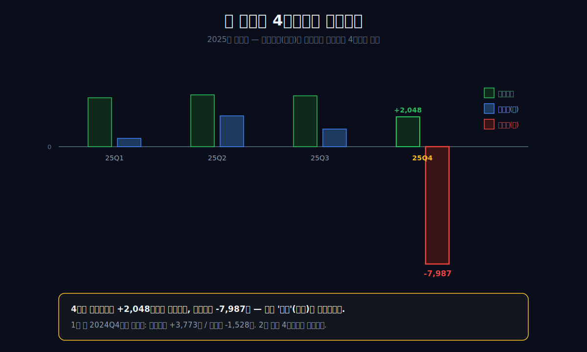
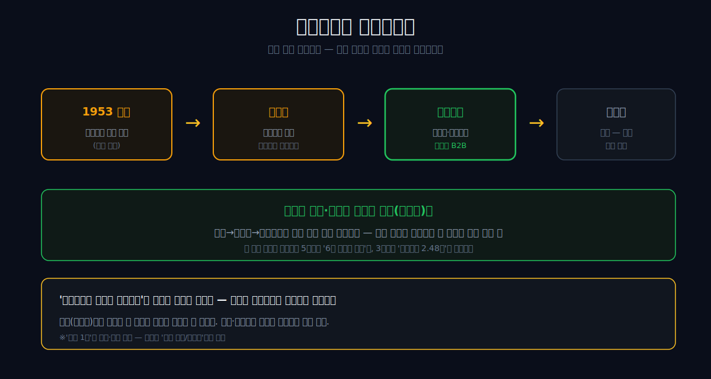
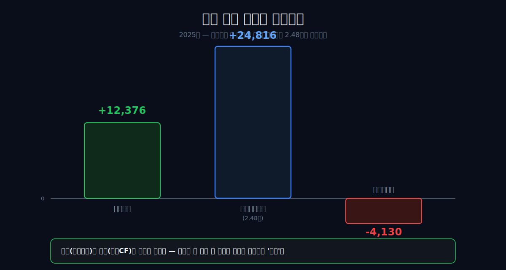
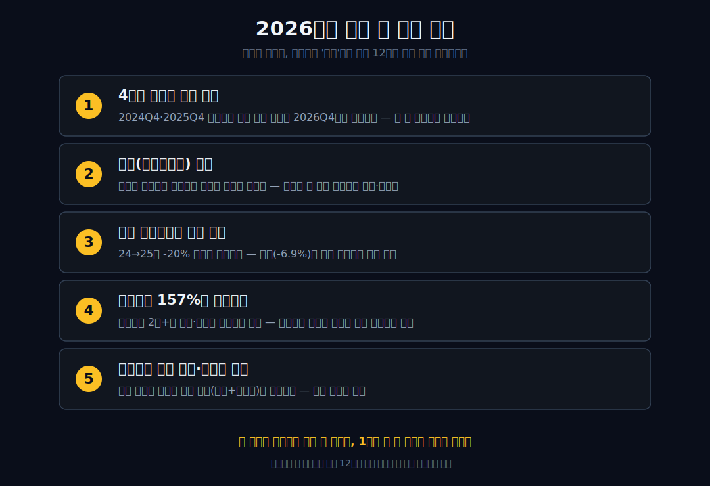

<script>
	import CompanyFinancials from '$lib/components/blog/CompanyFinancials.svelte';
</script>

> **데이터 기준**: 2026-06-13 dartlab 실측 — CJ제일제당(097950) **연결 재무제표(CFS)** 기준. 분기 순손익·발효 부문 실적·그린바이오 매각 철회·F&C 중단영업은 회사 공시·언론 교차확인. ※연결매출엔 **CJ대한통운(물류)**이 포함돼 있다.
>
> **핵심 숫자**: 연결매출 **27.3조** · 영업이익 **1조2,376억** (영업이익률 **4.5%**) · 당기순손실 **4,130억** (사실상 전액 4분기 집중) · 영업현금흐름 **2조4,816억** · 부채비율 **157%**
>
> **이 글의 용어**: 발효 = 미생물로 원료를 분해·합성하는 공정(조미료·아미노산·사료첨가제) · 그린바이오 = 발효 기반 식품·사료 소재 사업 · 라이신 = 사료용 아미노산(CJ가 세계 상위) · 영업이익 = 본업으로 번 이익 · 당기순이익 = 영업외(이자·손상·세금)까지 반영한 맨 밑줄 · 손상(손상차손) = 자산 가치가 떨어졌다고 장부에서 깎는 것(현금 유출 없음) · 중단영업 = 팔거나 접기로 한 사업을 따로 떼어 표기하는 것.
>
> **제목 주의**: 여기서 "거짓말"은 회계 부정이라는 뜻이 아니다. 순이익 한 줄이 그해 본업의 상태를 제대로 설명하지 못한다는 뜻이다. 이 글은 부정 의혹이 아니라, 영업이익·현금흐름·손상차손이 서로 다른 이야기를 하는 구조를 읽는다.

---

## 프롤로그 — 1.24조를 벌고 4,130억을 잃다

2025년 CJ제일제당은 영업이익 **1조2,376억**을 벌고도 당기순손실 **4,130억**을 냈다. 사업이 망해서가 아니다. 그 적자는 1년 중 단 한 분기, **4분기**에 통째로 들어 있었다.

```python
import dartlab
c = dartlab.Company("097950")
c.select("IS", ["영업이익", "당기순이익"], freq="Q")
```

2025년 4분기 순손실은 **-7,987억**. 그런데 같은 분기 영업이익은 **+2,048억**으로 멀쩡했다. 본업은 그 분기에도 돈을 벌었는데, 맨 밑줄만 무너졌다는 뜻이다. 그리고 이건 처음이 아니다. 1년 전 2024년 4분기에도 영업이익은 **+3,773억**인데 순이익은 **-1,528억**으로 꺾였다.

영업으로 번 돈과 장부 맨 밑줄이, 매년 똑같이 4분기에만 갈라선다.

이 장면이 강한 이유는 숫자의 방향이 서로 반대이기 때문이다. 보통 적자는 매출이 줄고, 원가가 늘고, 영업이익이 무너지면서 생긴다. 그런데 CJ제일제당의 2025년 4분기는 그렇지 않다. 영업이익은 플러스다. 제품은 팔렸고, 공장은 돌았고, 현금도 들어왔다. 그런데 당기순이익만 깊게 음수로 내려갔다. 손익계산서의 위쪽과 아래쪽이 다른 회사를 보여주는 순간이다.

그래서 연간 순손실 -4,130억만 보고 "본업이 망했다"고 말하면 틀린다. 반대로 영업현금흐름 2.48조만 보고 "아무 문제 없다"고 말해도 틀린다. 이 회사는 두 문장이 동시에 참일 수 있는 구조다. 본업은 현금을 만들지만, 과거에 쌓아 둔 자산과 사업 선택이 결산 때마다 맨 밑줄을 때린다. 이 글은 그 갈라진 두 줄 사이를 따라간다.



관통선은 하나다. **"식품회사가 영업이익 1.24조를 벌고도 왜 순손실을 냈고, 왜 그 적자는 매년 4분기에만 들어 있는가?"** 이 회사의 정체를 알려면 비비고 광고도, '연결매출 30조'라는 덩치도 아니라, *영업이익 아래에서 매년 12월에 무슨 일이 벌어지는지*를 봐야 한다.

여기서 독자가 붙잡아야 할 단어는 "12월"이다. 12월은 제품이 갑자기 안 팔리는 달만이 아니다. 회계적으로는 한 해 동안 들고 있던 자산의 가치를 다시 따지는 시점이다. 공장, 브랜드, 인수로 생긴 영업권, 개발비, 투자자산은 모두 장부에 남아 있다. 장부에 남은 값이 앞으로 벌 돈보다 크다고 판단되면 손상차손이 난다. 현금이 바로 빠져나가는 것은 아니지만, 과거에 쓴 돈을 회수하지 못했다는 사실이 손익계산서에 들어온다. CJ제일제당의 미스터리는 바로 여기서 시작한다.

---

## 1막 — 30조라는 착시: 절반은 남의 택배

**왜 '연결매출 30조'를 곧이곧대로 읽으면 안 되나.** 먼저 덩치부터 정리하고 본론으로 가자.

```python
c.select("IS", ["매출액", "영업이익"], freq="Y")
```

| 항목 (1년치, 억원) | 2025 | 2024 | 2023 | 2022 | 2019 | 2016 |
|---|---:|---:|---:|---:|---:|---:|
| 연결매출 | 273,426 | 293,591 | 290,235 | **300,795** | 223,525 | 145,633 |
| 영업이익 | 12,376 | 15,530 | 12,916 | 16,647 | 8,969 | 8,436 |

매출은 2016년 14.6조에서 2022년 30조로 두 배가 됐다. 그런데 이 곡선엔 두 개의 착시가 있다. 하나는 2019년의 점프(18.7조→22.4조)인데, 이는 미국 냉동식품 회사 **Schwans 인수**로 매출이 연결에 편입된 효과다. 다른 하나는 더 크다 — 이 연결매출의 상당 부분이 자회사 **CJ대한통운(물류)** 매출이다. 매출 30조의 절반 가까이가 사실은 '식품'이 아니라 '택배'인 것이다.

물류 연결이 만든 덩치 착시는 이미 [CJ대한통운](/blog/000120-cj-logistics) 편에서 따로 다뤘으니 여기선 한 문단으로 끝낸다. 핵심은 이거다 — *매출의 크기로 이 회사를 읽으면 안 된다.* 게다가 매출은 22년 30조에서 25년 27.3조로 오히려 줄었다. 그럼 진짜 이야기는 매출이 아니라 어디에 있나?

연결매출은 그룹이 얼마나 큰지를 보여주지만, 회사가 어떤 방식으로 돈을 버는지는 흐리게 만든다. 식품은 브랜드와 원가, 유통이 중요하다. 바이오는 발효 공정과 원재료 가격, 글로벌 공급과 수요가 중요하다. 물류는 택배 단가와 물동량, 인건비와 자동화가 중요하다. 이 세 사업이 한 손익계산서에 합쳐지면 "매출 30조"라는 숫자는 웅장하지만, 해석에는 둔하다. 크다는 말은 맞지만, 무엇이 좋아졌고 무엇이 나빠졌는지는 말해주지 않는다.

CJ제일제당을 읽을 때 가장 먼저 해야 할 일은 덩치를 걷어내는 것이다. 연결매출이 커졌다고 식품 브랜드가 모두 좋아진 것은 아니다. 연결매출이 줄었다고 발효 엔진이 모두 나빠진 것도 아니다. 대한통운이 들어오면 매출은 커 보이고, Schwans가 들어오면 해외 식품 매출은 커 보인다. 그러나 순이익을 무너뜨린 2025년의 핵심은 이 매출 곡선 자체가 아니다. 문제는 영업이익 아래, 특히 자산 가치 평가와 중단사업 처리에서 생긴다.

이 구분을 놓치면 글이 흔한 소비재 실적 요약으로 내려앉는다. "비비고가 잘 팔리나", "햇반이 어떠냐", "미국 냉동식품이 성장하나"는 모두 필요한 질문이지만, 이 글의 중심 질문은 아니다. 중심 질문은 더 좁다. 이렇게 큰 연결 장부 안에서 왜 맨 밑줄만 4분기에 한 번씩 무너지는가. 매출 착시를 걷어내야 그 질문이 보인다.


---

## 2막 — 설탕솥에서 발효조까지: 진짜 엔진은 식품이 아니다

**CJ제일제당을 '식품회사'로만 보면 무엇을 놓치나.** 1953년, [삼성](/blog/005930-samsung)의 모태인 제일제당이 설탕을 정제하며 시작했다. 그 설탕 정제 설비는 곧 조미료(글루탐산 발효)로, 다시 사료용 아미노산(라이신·트립토판)으로 번졌다. 설탕→조미료→아미노산은 모두 *같은 발효 화학공학*이다.

그래서 이 회사의 척추는 라면이나 만두가 아니라 **발효**다. 미생물로 아미노산을 길러 전 세계 사료·식품 회사에 파는 그린바이오 사업에서 CJ제일제당은 라이신 등 사료용 아미노산의 세계적 B2B 사업자다. 비비고 만두는 그 발효 계보의 가장 바깥 껍질일 뿐, 손에 잡히는 간판이다.



오해는 막자. '식품회사가 아니라 발효회사'라는 건 정체성을 새로 규정하는 단정이 아니라, *이익의 무게중심*을 가리키는 배경이다. 이 발효 엔진이 왜 중요한지는 뒤(3막의 현금, 5막의 매각 철회)에서 숫자로 증명된다. ('세계 1위'는 회사·업계 주장으로, 본문은 '세계 상위/세계적'으로 적는다.)

발효 사업이 흥미로운 이유는 소비자 눈에 보이지 않는다는 점이다. 비비고 만두는 마트 진열대에서 보인다. 햇반은 편의점에서 보인다. 하지만 라이신과 트립토판은 사료 배합표 안에 들어간다. 최종 소비자는 그 이름을 모른다. 그런데 이 보이지 않는 소재가 훨씬 산업적이다. 가격은 글로벌 수급과 곡물 가격, 중국 경쟁사, 축산 사이클에 영향을 받는다. 마진은 브랜드 광고보다 공정 효율과 원가, 제품 믹스에 민감하다.

이 차이는 CJ제일제당의 손익을 두 갈래로 만든다. 한쪽에는 소비재 브랜드가 있다. 브랜드는 소비자 취향과 유통 채널, 마케팅 비용의 싸움이다. 다른 한쪽에는 발효 소재가 있다. 발효는 생산능력과 원가, 글로벌 고객사의 구매 사이클 싸움이다. 둘 다 CJ제일제당 안에 있지만, 돈을 버는 방식은 다르다. 그래서 이 회사는 단순 식품주처럼 읽으면 안 된다. 식품 브랜드와 발효 소재, 물류 자회사가 동시에 연결 손익을 만든다.

그리고 바로 이 복합성이 4분기 손상을 이해하는 배경이 된다. 여러 사업을 사고, 키우고, 묶고, 일부는 접고, 일부는 계속 들고 가면 장부에는 과거 선택의 흔적이 쌓인다. 인수로 생긴 무형자산과 영업권, 바이오 관련 투자, 중단사업으로 분류되는 자산은 모두 결산 때 다시 평가된다. 발효 엔진이 강하다는 말과 특정 바이오 자산이 손상된다는 말은 동시에 가능하다. 좋은 사업이 있어도, 모든 자산이 좋은 것은 아니다.

---

## 3막 — 영업이익은 멀쩡하다, 현금이 증명한다

**'2025 순손실'을 곧장 '실적 악화'로 읽으면 왜 안 되나.** 순손실 4,130억이라는 맨 밑줄만 보면 회사가 휘청인 것 같다. 그런데 그 위를 보면 그림이 다르다.

```python
c.select("CF", ["영업활동현금흐름"], freq="Y")
```

| 항목 (1년치, 억원) | 2025 | 2024 | 2023 |
|---|---:|---:|---:|
| 영업이익 | 12,376 | 15,530 | 12,916 |
| 영업활동현금흐름 | **24,816** | 22,553 | 24,448 |

영업이익은 +1.24조, 영업활동현금흐름은 **+2.48조**다. 순손실을 낸 바로 그 해에 현금은 오히려 2조 4천억 넘게 들어왔다. *현금 찍는 공장은 멀쩡히 돌아간다는* 뜻이다. 무너진 건 영업 그 자체가 아니다.



다만 한쪽으로 과장하진 않는다. 영업이익 자체도 24년 15,530억에서 25년 12,376억으로 **-20.3%**, 매출도 -6.9% 줄었다. 본업이 '망한 건' 아니지만 *둔화는 진짜*다. 이 둔화와 별개로, 순이익을 무너뜨린 진짜 범인은 영업이익 *아래*에 있다. 그게 4막이다.

현금흐름표는 순이익보다 덜 극적이지만 더 고집이 세다. 손상차손은 당기순이익을 낮추지만 현금 유출은 아니다. 감가상각과 무형자산 상각도 마찬가지로 현금이 바로 나가는 항목은 아니다. 그래서 손상과 상각이 큰 해에는 순이익보다 영업현금흐름이 훨씬 좋아 보일 수 있다. CJ제일제당의 2025년이 그렇다. 손익계산서의 맨 밑줄은 적자지만, 현금흐름표는 본업이 여전히 돈을 만든다고 말한다.

그러나 여기에도 함정이 있다. 현금흐름이 좋다고 해서 손상이 무의미한 것은 아니다. 손상은 "지금 현금이 나갔다"가 아니라 "과거에 쓴 돈을 앞으로 회수하기 어렵다"는 선언에 가깝다. 현금 유출이 없는 회계상 손실이라는 설명은 맞지만, 그 손실이 아무 의미 없다는 뜻은 아니다. 공장이나 브랜드, 인수 자산이 기대만큼 돈을 못 벌면 장부는 언젠가 그 값을 깎는다. 깎이는 순간은 비현금이지만, 깎이는 이유는 과거의 현금 사용과 연결돼 있다.

따라서 이 회사를 읽는 순서는 이렇게 가야 한다. 첫째, 영업이익이 아직 플러스인지 확인한다. 둘째, 영업현금흐름이 실제로 들어오는지 본다. 셋째, 순손실을 만든 항목이 반복되는지 분리한다. 첫째와 둘째가 버티면 회사는 당장 흔들리는 구조가 아니다. 하지만 셋째가 매년 반복되면, 과거 투자와 사업 포트폴리오의 질에 대한 질문은 계속 남는다.

---

## 4막 — 1년에 한 번, 4분기에만 거짓말하는 맨 밑줄

**왜 적자가 1년 전체가 아니라 4분기에만 들어 있나.** 분기별로 펴면 패턴이 선명하다.

```python
c.select("IS", ["영업이익", "당기순이익"], freq="Q")
```

| 분기 (억원) | 25Q1 | 25Q2 | 25Q3 | **25Q4** | 24Q4 |
|---|---:|---:|---:|---:|---:|
| 영업이익 | 3,332 | 3,531 | 3,465 | **+2,048** | +3,773 |
| 당기순이익 | 574 | 2,091 | 1,192 | **-7,987** | -1,528 |

2025년 순손실 -4,130억은 사실상 전부 4분기에서 나왔다(1~3분기 순이익은 모두 플러스, 합계 약 3,857억 → 4분기 -7,987억이 통째로 끌어내렸다). 그런데 같은 4분기 영업이익은 +2,048억으로 멀쩡하다. 영업 *위*가 아니라 영업 *아래*(유·무형자산 평가에 따른 영업외손실)가 매년 12월 결산에 터진다는 뜻이다.

결정적인 건 이게 일회성이 아니라는 점이다. 2024년 4분기에도 영업이익 +3,773억에 순이익 -1,528억으로 *똑같은 일*이 일어났다. 두 해 연속, 4분기에만 맨 밑줄의 부호가 갈린다 — 일종의 **결산 손상의 계절성**이다.


회사는 이를 '현금 유출이 없는 회계상 손실'로 설명한다(외부 인용). 영업현금흐름이 멀쩡한 것(3막)이 그 설명과 맞물린다. 다만 '회계상 손실이라 괜찮다'는 안도는 *2년 연속 반복* 앞에서는 재검증 대상으로 남겨둔다 — 이것이 한 해 사고인지, 자산을 매년 조금씩 털어내는 구조인지는 더 지켜봐야 한다. (분기 순이익은 dartlab 실측값이며, 손상의 구체 대상 자산은 회사 공시로 확인해야 한다.) 그렇다면 이 손상은 *무엇*에 대한 손상인가?

4분기에 손상이 몰리는 것은 회계적으로 이상한 일이 아니다. 많은 회사가 연말 결산 때 자산 손상검사를 한다. 앞으로 벌 돈을 다시 추정하고, 그 추정치가 장부가보다 낮으면 손상차손을 잡는다. 문제는 손상이 났다는 사실 자체보다, 어떤 자산이 왜 반복해서 손상되는가다. 일회성 구조조정이면 다음 해에는 줄어야 한다. 하지만 비슷한 성격의 손상이 여러 해 반복되면, 그 사업 또는 인수 자산의 수익력이 애초 기대보다 낮았다는 의미가 된다.

CJ제일제당의 경우 위험한 오해가 두 개 있다. 첫째, "현금 유출이 없으니 괜찮다"는 오해다. 현금 유출이 없는 것은 맞지만, 자산 가치가 낮아졌다는 신호는 남는다. 둘째, "순손실이 났으니 본업이 무너졌다"는 오해다. 영업이익이 플러스이고 영업현금흐름이 강하면 본업은 아직 돌아간다. 이 둘 사이에서 균형을 잡아야 한다. 이 글의 결론은 낙관도 비관도 아니다. 순손실은 본업 붕괴의 증거가 아니지만, 반복 손상은 장부 품질을 계속 의심하게 만든다는 것이다.

그래서 4분기 숫자는 한 해의 마지막 성적표가 아니라, 과거 선택을 한꺼번에 검사하는 창구다. Schwans 인수처럼 큰 거래, 바이오 관련 자산, 중단사업 처리, 무형자산 평가는 모두 시간이 지나야 진짜 성과가 드러난다. 영업이익은 현재의 장사다. 손상차손은 과거 선택의 평가다. CJ제일제당의 손익계산서는 2025년에 이 두 이야기를 같은 표 안에 동시에 넣었다.

---

## 회계 해부 — 현금이 안 나가도 왜 무거운가

**손상차손은 현금 유출이 없는데 왜 투자자가 신경 써야 하나.** 답은 간단하다. 손상은 오늘 돈이 나가는 사건이 아니라, 어제 돈을 잘못 썼을 가능성을 인정하는 사건이다. 회사가 과거에 공장, 브랜드, 지분, 개발자산, 영업권을 장부에 올렸다면 그 자산은 미래에 돈을 벌어야 한다. 그런데 미래 현금흐름이 기대보다 낮아지면 장부가는 너무 높아진다. 그 차이를 손익계산서에 비용으로 넣는 것이 손상이다.

그래서 손상차손은 두 얼굴을 갖는다. 현금흐름표에서는 비교적 가볍다. 이미 나간 돈을 회계적으로 다시 평가하는 것이므로 영업활동현금흐름이 그대로 좋게 보일 수 있다. 하지만 재무상태표에서는 무겁다. 자산이 줄고, 순이익이 줄고, 자본이 얇아진다. 주주에게 남는 장부가치가 줄어드는 것이다. "현금 유출이 없다"는 설명은 절반만 맞다. 현금은 안 나가지만 자본은 다친다.

중단영업도 비슷하다. 사업을 팔거나 접기로 하면 손익계산서에서 계속영업과 분리해 보여준다. 이 표시는 독자에게 도움도 되고 혼란도 준다. 도움은 본업과 정리 대상 사업을 나눠 볼 수 있다는 점이다. 혼란은 연간 매출과 순이익이 갑자기 달라 보일 수 있다는 점이다. CJ제일제당처럼 사료 사업을 덜어내는 회사에서는, 어느 매출이 계속될 매출이고 어느 손실이 정리될 손실인지 나눠야 한다.

영업외손실도 마찬가지다. 이름 그대로 영업 밖에서 생긴 손실이다. 이자, 외환, 지분법, 손상, 처분손익처럼 제품을 팔고 원가를 뺀 본업 이익과는 다른 항목들이 들어온다. 그래서 영업이익이 플러스인데 순이익이 마이너스가 될 수 있다. 2025년 CJ제일제당의 4분기는 바로 이 구조다. 위쪽 장사는 흑자인데, 아래쪽에서 손실이 들어와 맨 밑줄을 뒤집었다.

이 회계 해부가 필요한 이유는 독자의 판단을 늦추기 위해서다. 순손실을 보면 나쁘다고 말하기 쉽고, 비현금 손실이라는 설명을 들으면 괜찮다고 말하기 쉽다. 그러나 좋은 재무제표 독해는 둘 다 하지 않는다. 먼저 영업이익을 보고, 다음에 현금흐름을 보고, 그 다음에 손상과 중단영업의 반복성을 본다. CJ제일제당의 2025년은 이 순서를 강제한다.

결국 핵심은 반복성이다. 손상차손이 한 번이면 과거를 정리하는 청소일 수 있다. 같은 성격이 계속 나오면 자산 품질 문제다. 중단영업이 한 번이면 포트폴리오 정리일 수 있다. 정리가 계속 이어지면 그동안 여러 사업을 너무 넓게 들고 있었던 흔적일 수 있다. 영업외손실도 한 번이면 사고지만, 매년 4분기에 반복되면 결산 때마다 장부가 흔들리는 회사가 된다. CJ제일제당을 보는 기준은 이 반복성에 있다.

---

## 5막 — 안 판 것이 진짜 엔진이었다

**'그린바이오 매각=값진 엔진 처분'이라는 통념은 왜 틀렸나.** 2024년 11월, CJ제일제당은 글로벌 투자은행을 주관사로 세워 발효 사업(그린바이오) 매각을 추진했다. 매각가 추정치는 약 **6조 원**, MBK파트너스와 중국 광신·매화그룹까지 인수 후보로 붙었다(외부 인용). 안 보이는 발효 엔진의 가치가 시장에서 *조 단위*로 매겨진 것이다.

그런데 회사는 2025년 4월 매각을 **철회**했다. '안 팔고 키운다'로 노선을 틀었다(외부 인용). 발효 사업의 가치가 글로벌 정세 변화로 오히려 재조명됐다는 이유였다 — 2024년 이 바이오 부문은 매출 약 4.21조, 영업이익 약 3,376억으로 이익을 내는 사업이었다(외부 인용). 2026년 3월에는 관련 바이오 자산(Batavia)을 완전 인수하며 오히려 발효 쪽에 더 힘을 실었다.


그러니 통념은 뒤집힌다. 회사가 *판* 게 아니라 *안 판* 것이 진짜 엔진이었다. 정작 중단영업으로 잘라낸 건 저마진 사료(F&C) 쪽이었다(외부 인용 — 2025년 4분기 매출이 다른 분기보다 약 1,700억 적은 것도 이 사료 사업이 중단영업으로 빠진 영향으로 보인다). 그리고 4막에서 본 4분기 손상도 값진 발효 엔진을 떼어 파는 비장미가 아니라, 회사 설명에 따르면 *바이오제약(신약개발) 부진과 유·무형자산 평가*에서 나온 것이다 — 돈 버는 발효(그린바이오)와 손실을 낸 바이오제약은 다른 사업이다. (매각 철회·F&C 중단영업·손상 사유는 모두 외부 공시·언론 인용이며, 경영 의도는 단정하지 않는다.)

이 구분은 아주 중요하다. "바이오"라는 단어 하나로 발효 소재와 바이오제약을 뭉개면, 이 글은 틀린다. 발효 소재는 사료·식품 산업의 원재료에 가깝고, 바이오제약은 신약개발과 CDMO 쪽의 장기 투자 성격이 강하다. 둘 다 미생물과 생명공학의 언어를 쓰지만, 손익 구조와 리스크는 다르다. 발효 소재는 원가와 수급, 제품 믹스의 사업이다. 바이오제약은 개발 기간, 기술 위험, 자산 평가의 사업이다. 같은 "바이오" 안에서도 현금을 만드는 축과 손상을 만든 축을 나눠야 한다.

그린바이오 매각 철회는 그래서 단순한 M&A 뉴스가 아니다. 회사가 장부를 가볍게 만들기 위해 모든 바이오를 팔아치운 것이 아니라, 팔 것과 쥘 것을 다시 고른 사건이다. 저마진 사료는 덜어내고, 발효 기반 소재는 남긴다. 이 선택이 맞는지는 앞으로 숫자로 검증해야 한다. 발효 업황이 돌아오고 바이오 부문 이익이 유지되면 "안 판 것"은 진짜 엔진이었다는 해석이 강해진다. 반대로 발효 가격과 수요가 흔들리면, 안 판 결정은 다시 부담이 된다.

여기서 순손실과 매각 철회가 연결된다. 순손실은 회사가 과거 자산을 깎는 장면이고, 매각 철회는 앞으로 어떤 자산을 계속 들고 갈지 고르는 장면이다. 하나는 과거 선택의 청소이고, 다른 하나는 다음 선택의 고집이다. CJ제일제당을 강하게 읽으려면 이 둘을 분리하면서도 같이 봐야 한다. 장부는 과거를 깎고, 전략은 발효를 쥔다. 이 모순이 이 회사의 2025년이다.

---

## 6막 — 매년 12월, 자기 장부를 한 번씩 청소하는 회사

**그래서 CJ제일제당은 무엇인가.** 간판(비비고 30조)도, 덩치(연결)도 아니다. 이 회사의 정체는 *맨 밑줄이 4분기에만 거짓말하는 구조*에 있다 — 영업으로 번 현금(매년 2조+)으로 1년에 한 번 자기 장부의 손상을 몰아서 털어내는 회사다. 맨 밑줄이 거짓말을 하는 게 아니라, 1년에 한 번 진실을 몰아서 말하는 것에 가깝다.

진짜 위험은 사양 산업이라서가 아니다. 두 가지다. ① 영업이익(본업)이 24→25년 -20% 둔화한 흐름이 이어지면 '현금 찍는 공장'이라는 전제 자체가 흔들린다. ② 4분기 손상이 한 해 사고가 아니라 매년 반복되면, '회계상 손실이라 괜찮다'는 말의 무게가 달라진다. 정점에서 사업을 통째로 판 [더존비즈온](/blog/012510-douzone)이나 직판 베팅으로 손익의 부호를 바꾼 [SK바이오팜](/blog/326030-sk-biopharm)과 달리, CJ제일제당은 *쥔 것을 지키며 매년 장부를 청소하는* 쪽이다. 같은 식품 계열 [농심](/blog/004370-nongshim)·[오뚜기](/blog/007310-ottogi)가 라면이라는 단일 본업으로 읽히는 것과도 결이 다르다.


이 회사를 계속 볼 사람은 매출이 아니라 — 매년 4분기에 영업이익 *아래*가 또 터지는지, 발효 엔진의 업황이 도는지, 부채비율 157%와 영업현금 2조+의 균형이 유지되는지를 봐야 한다. (위 위험은 조건부 시나리오이지 예측이 아니다.)

이 회사의 장점은 분명하다. 본업에서 영업이익을 만들고, 영업활동현금흐름이 두껍고, 발효라는 보이지 않는 B2B 엔진이 있다. 소비재 브랜드만 가진 회사보다 사업의 층이 두껍다. 국내 식품, 해외 냉동식품, 발효 소재, 물류 연결이 모두 장부 안에 있다. 그래서 경기나 원재료, 물류, 환율이 한 축을 흔들어도 다른 축이 버틸 여지가 있다.

하지만 바로 그 두께가 단점이기도 하다. 여러 축이 있으면 어떤 축이 돈을 벌고 어떤 축이 자본을 까먹는지 흐려진다. 연결매출은 크지만 해석은 복잡해진다. 영업현금은 좋지만 순손실이 난다. 발효는 값지지만 바이오제약 자산은 손상될 수 있다. 사료는 접지만 바이오는 더 쥔다. CJ제일제당은 하나의 단순한 사업보다, 여러 사업의 선택과 청소가 반복되는 포트폴리오에 가깝다.

따라서 "CJ제일제당은 좋은 회사인가 나쁜 회사인가"라는 질문은 너무 넓다. 더 좋은 질문은 "이 회사의 현금창출력이 반복 손상과 부채 부담을 충분히 덮는가"다. 이 질문으로 바꾸면 숫자의 순서가 달라진다. 매출액보다 영업이익, 영업이익보다 영업현금흐름, 영업현금흐름보다 4분기 영업외손실의 반복 여부가 중요해진다. 가장 맨 아래 줄을 보되, 그 아래 줄이 왜 생겼는지 위아래로 다시 올라가야 한다.

그래서 제목의 "거짓말"은 냉소가 아니다. 순이익 한 줄이 회사 전체를 대표하지 못하는 순간에 대한 표현이다. 순이익은 중요하다. 주주에게 남는 돈은 결국 맨 밑줄에서 출발하기 때문이다. 하지만 그 순이익이 비현금 손상과 중단영업 처리로 크게 흔들릴 때는, 그 한 줄만으로 본업을 평가하면 안 된다. CJ제일제당의 2025년은 이 기본기를 다시 가르치는 사례다.

---

## 산업 패턴 — 식품회사라기보다 연결 포트폴리오다

**왜 이 회사의 비교 대상은 단순 식품주 하나로 끝나지 않나.** 농심과 오뚜기는 비교적 읽기 쉽다. 라면·소스·즉석식품이라는 주력 제품이 있고, 원재료와 판가, 해외 확장이 손익의 큰 축이다. 물론 그 회사들도 복잡하지만, 핵심 질문은 제품과 가격, 해외 매출에 모인다. CJ제일제당은 다르다. 식품 브랜드, 해외 인수 자산, 발효 소재, 물류 연결, 바이오 관련 자산이 한 장부에 들어온다.

이런 회사는 좋은 해에도 해석이 어렵고, 나쁜 해에는 더 어렵다. 특정 제품이 잘 팔려도 전체 손익이 덜 좋아 보일 수 있다. 물류가 붙어 매출이 커져도 식품 본업의 마진이 보이지 않을 수 있다. 바이오 소재가 좋아도 바이오제약 자산 손상이 순이익을 누를 수 있다. 즉 연결 포트폴리오 회사의 위험은 "사업이 많다"가 아니라 "각 사업의 질이 순이익 한 줄에서 섞인다"는 것이다.

산업 패턴으로 보면 CJ제일제당은 세 가지 싸움을 동시에 한다. 식품은 브랜드와 유통의 싸움이다. 해외 식품은 현지화와 인수 자산 효율화의 싸움이다. 발효 소재는 글로벌 원가와 수급의 싸움이다. 여기에 물류 연결까지 붙으면 손익계산서가 한 산업의 표준 곡선을 따르지 않는다. 그래서 이 회사는 업종 평균 PER이나 매출 성장률 하나로 읽기 어렵다. 사업별 이익의 질을 분리해야 한다.

이 점이 오히려 블로그 관점에서는 좋다. 재무제표의 "왜?"가 많기 때문이다. 왜 연결매출은 큰데 순이익은 약한가. 왜 영업현금은 강한데 순손실인가. 왜 발효 사업은 안 팔고 사료는 덜어내는가. 왜 4분기에만 순이익이 무너지는가. 이 질문들은 모두 한 줄로 모인다. CJ제일제당은 식품회사라는 이름보다, 연결 포트폴리오의 자산 품질을 보는 회사다.

---

## 과거~현재 패턴 — 4분기 청소가 반복되는지 봐야 한다

**이번 일이 처음인지 반복인지가 핵심이다.** 2025년만 보면 한 해의 큰 손실이다. 그러나 2024년 4분기에도 영업이익 플러스와 순이익 마이너스가 동시에 나타났다. 규모는 2025년이 훨씬 크지만 방향은 같다. 영업으로는 돈을 벌고, 결산 아래에서 손실이 들어온다. 한 번이면 사고일 수 있다. 두 번이면 패턴을 의심해야 한다. 세 번이면 구조로 봐야 한다.

이 반복은 투자자에게도, 회사를 공부하는 독자에게도 중요하다. 순손실의 성격이 일회성이면 시장은 시간이 지나면서 영업이익과 현금흐름을 다시 본다. 하지만 매년 4분기마다 손상이 반복되면, "올해도 회계상 손실이니까 괜찮다"는 설명은 약해진다. 같은 설명이 반복될수록 그 설명은 방어가 아니라 질문이 된다. 왜 매년 손상할 자산이 남아 있는가. 어떤 사업의 기대수익이 계속 낮아지는가. 다음에는 무엇이 깎일 수 있는가.

반대로 이 이야기가 틀리는 조건도 분명하다. 2026년에 영업이익이 회복되고, 영업활동현금흐름이 계속 두껍고, 4분기 순손실이 반복되지 않고, 발효 부문이 실제 이익을 유지한다면 2025년은 큰 청소를 한 해로 정리될 수 있다. 그때는 "매년 장부를 청소하는 회사"라는 해석이 약해진다. 그러나 영업이익 둔화가 이어지고, 4분기마다 영업외손실이 반복되고, 발효와 바이오의 구분이 더 흐려지면 이 글의 결론은 강해진다.

결국 CJ제일제당의 과거~현재 패턴은 한 문장이다. 위쪽 손익은 버티는데 아래쪽 손익이 결산 때 흔들린다. 이 패턴이 멈추는지, 아니면 계속되는지가 2026년 이후의 핵심이다. 매출 30조 회복보다 중요한 것은 순손익의 계절성이 사라지는지다.

---

## 투자자 시각 — 순손실을 어디까지 용서할 수 있나

**순손실은 언제 무시해도 되고, 언제 무시하면 안 되나.** 이 질문이 CJ제일제당을 보는 핵심이다. 회계상 손실이라는 말은 투자자를 안심시키기도 하고, 때로는 위험한 일을 가리기도 한다. 둘을 구분하는 기준은 간단하다. 현금이 들어오고 있는지, 본업 이익이 버티는지, 손상의 대상이 정리되고 있는지, 같은 일이 반복되는지다.

CJ제일제당은 첫 번째 기준에서는 강하다. 2025년에 순손실을 냈지만 영업활동현금흐름은 2.48조였다. 영업이익도 플러스다. 이 조합은 "회사가 당장 현금을 못 만드는 구조"는 아니라는 뜻이다. 만약 영업이익도 적자이고 영업현금흐름도 마이너스였다면 이야기는 훨씬 단순했을 것이다. 그때는 장부 청소가 아니라 본업 붕괴로 봐야 한다. 그러나 여기서는 본업과 순손익이 갈라져 있다.

두 번째 기준에서는 노란불이다. 본업이 버틴다는 말과 본업이 좋아진다는 말은 다르다. 2025년 영업이익은 여전히 1조를 넘지만, 2024년보다 줄었다. 매출도 줄었다. 그러면 순손실을 전부 "회계상이라 괜찮다"고 덮을 수 없다. 손상차손은 비현금이지만, 본업 둔화는 현금창출력의 방향과 연결된다. 본업이 회복되는 상황의 손상과, 본업이 둔화되는 상황의 손상은 투자자가 다르게 봐야 한다.

세 번째 기준은 손상의 성격이다. 한 번 큰 손상을 잡고 나서 관련 자산이 정리되면, 다음 해부터는 이익의 질이 좋아질 수 있다. 하지만 손상을 잡고도 비슷한 항목이 계속 남아 있다면, 매년 4분기마다 새로운 청소가 필요해진다. 투자자는 여기서 "손상 금액"만 볼 것이 아니라 "손상이 끝났는지"를 봐야 한다. 장부 청소의 핵심은 크기가 아니라 종료 여부다.

네 번째 기준은 자본과 부채다. 부채비율 157%라는 숫자는 단독으로 공포를 만들지는 않는다. 영업현금흐름이 충분하면 버틸 수 있다. 하지만 순손실이 반복되면 자본이 얇아지고, 자본이 얇아지면 같은 부채도 더 무겁게 느껴진다. 손상은 현금 유출이 아니지만 자본에는 상처를 남긴다. 그래서 순손실을 볼 때는 현금흐름과 자본총계를 같이 봐야 한다.

따라서 CJ제일제당의 순손실을 "용서"하려면 조건이 필요하다. 영업이익이 회복되어야 한다. 영업현금흐름이 계속 두꺼워야 한다. 4분기 손상이 반복되지 않아야 한다. 발효 사업이 실제 이익을 보여야 한다. 이 네 조건이 맞으면 2025년 순손실은 큰 장부 청소로 읽힌다. 조건이 깨지면 순손실은 과거 투자 실패의 반복 신호가 된다.

이 기준은 독자에게도 유용하다. 재무제표를 읽을 때 순손실이 나오면 겁을 먹기 쉽다. 반대로 "비현금"이라는 설명을 들으면 대수롭지 않게 넘기기 쉽다. 둘 다 빠른 결론이다. 좋은 독해는 느리다. 손익계산서 위에서 영업이익을 보고, 아래에서 순이익을 보고, 현금흐름표에서 실제 현금을 보고, 재무상태표에서 자본이 줄었는지 확인한다. CJ제일제당은 이 네 장을 모두 열어야 보이는 회사다.

---

## 이 이야기가 틀리는 조건

**강한 결론은 깨지는 조건을 가져야 한다.** 이 글의 결론은 "CJ제일제당은 본업이 망한 회사가 아니라, 매년 4분기 장부 아래를 확인해야 하는 연결 포트폴리오 회사"라는 것이다. 이 결론은 다음 조건에서 틀린다.

첫째, 2026년에 4분기 순손실이 재발하지 않으면 틀린다. 2024년과 2025년의 패턴이 끊기면, 2025년은 구조가 아니라 큰 일회성 정리였을 가능성이 커진다. 이 경우 독자는 4분기 계절성보다 본업 회복과 발효 사업의 성장성을 더 크게 봐야 한다.

둘째, 영업이익이 다시 회복되면 틀린다. 2025년의 문제는 순손실만이 아니라 영업이익 둔화와 같이 왔다. 만약 2026년에 영업이익이 회복되고 매출 둔화가 멈추면, 손상은 과거의 비용이고 현재 본업은 다시 좋아지는 그림이 된다. 그때는 "맨 밑줄의 거짓말"보다 "위쪽 손익의 회복"이 더 중요한 제목이 된다.

셋째, 발효 사업이 확실히 이익을 만들면 틀린다. 회사가 그린바이오를 팔지 않고 들고 가기로 한 선택이 숫자로 증명되면, 이 회사의 핵심은 손상보다 발효 엔진의 재평가로 옮겨간다. 이 경우 2025년의 손실은 발효를 지키기 위해 주변을 정리한 해로 읽힐 수 있다.

넷째, 손상 대상과 중단영업 처리가 공시에서 명확히 종료되면 틀린다. 같은 종류의 손상이 반복되지 않고, 사료 사업 정리 이후 연결 구조가 단순해지고, 바이오제약 관련 자산 평가가 안정되면 이 글의 의심은 약해진다. 그때는 "매년 장부를 청소한다"가 아니라 "청소가 끝났다"가 맞는 해석이 된다.

반대로 이 네 조건이 하나도 확인되지 않으면 결론은 더 강해진다. 4분기 손상이 또 나오고, 영업이익 둔화가 이어지고, 발효 사업의 이익이 확인되지 않고, 자본이 줄면 CJ제일제당은 매출 큰 식품회사가 아니라 복잡한 장부를 매년 다시 봐야 하는 회사로 남는다. 그래서 이 글은 예측이 아니라 관찰 순서다. 다음 공시에서 무엇을 보면 이 결론이 깨지는지까지 적어 두는 것이 안전하다.

---

## 2026년에 봐야 할 다섯 가지

1. **4분기 영업외·중단사업 손상의 재발 여부** — 2024Q4·2025Q4 연속으로 터진 결산 손상이 2026Q4에도 반복되는지. 한 해 사고인지 구조인지가 여기서 갈린다.
2. **발효(그린바이오) 업황** — 매각을 철회하고 끌어안은 엔진이 실제로 도는지. 라이신 등 사료 아미노산 가격·가동률.
3. **본업 영업이익의 둔화 멈춤** — 24→25년 -20% 흐름이 멈추는지. 매출(-6.9%)과 함께 영업이익 바닥을 확인.
4. **부채비율 157%와 이자보상** — 영업현금 2조+가 이자·차입을 감당하는 균형. 부채비율 단독이 아니라 현금 창출력과 함께 봐야 한다.
5. **대한통운 제외 식품·바이오 부문 이익** — 연결 덩치를 걷어낸 진짜 본업(식품+바이오)의 영업이익. 부문 공시로 확인.

첫 번째 체크포인트가 가장 중요하다. 2026년 1~3분기 숫자가 좋아도, 4분기 결산에서 같은 일이 반복되면 이야기는 끝나지 않는다. 이 글의 핵심은 연간 실적이 아니라 연말 결산의 반복성이다. 그래서 2026년에는 매출보다 4분기 순손익, 영업외손실, 중단영업손익, 손상차손의 주석을 먼저 봐야 한다.

두 번째는 발효다. 회사가 매각을 철회하고 쥐기로 한 사업이면, 앞으로 숫자로 증명해야 한다. "값지다"는 말은 매각 후보가 붙었다는 이야기만으로는 부족하다. 매출과 영업이익, 제품 믹스, 글로벌 가격이 따라와야 한다. 발효가 실제로 이익을 만들면 CJ제일제당은 식품 브랜드 이상의 포트폴리오를 가진 회사로 읽힌다. 그렇지 않으면 안 판 결정은 기회비용이 된다.

세 번째는 본업 둔화다. 2025년 순손실을 손상으로 설명하더라도, 영업이익이 줄었다는 사실은 남는다. 영업이익이 다시 회복되면 손상은 과거 청소에 가까워진다. 영업이익이 계속 줄면 손상은 미래 현금창출력 약화의 증상처럼 보인다. 이 둘은 전혀 다른 이야기다.

네 번째는 현금과 부채의 균형이다. 부채비율 157%는 숫자 하나만으로 위험하다고 단정할 정도는 아니지만, 큰 연결 포트폴리오에서는 항상 같이 봐야 한다. 영업활동현금흐름이 두껍게 유지되면 차입과 이자 부담을 견딜 수 있다. 그러나 영업현금이 줄고 손상이 반복되면 자본 여력과 신용 여력은 동시에 약해진다.

마지막은 연결을 걷어낸 부문 이익이다. CJ대한통운이 들어간 연결매출은 회사의 크기를 보여주지만, 식품과 바이오의 질을 바로 보여주지는 않는다. 독자가 다음 공시에서 확인해야 하는 것은 "연결 30조 회복"이 아니라, 물류를 걷어낸 식품·바이오의 영업이익과 그 안에서 발효가 얼마나 버티는지다.

숫자로 닫으면 기준은 단순하다. 2026년에 4분기 순손익이 정상화되고, 연간 영업이익이 회복되고, 영업현금흐름이 계속 두껍고, 발효 사업의 이익이 확인되면 이 회사는 큰 장부 청소 뒤 다시 본업으로 읽힌다. 반대로 4분기 손상이 반복되고 영업이익이 더 줄면, CJ제일제당은 비비고의 브랜드 회사가 아니라 매년 장부 아래를 다시 봐야 하는 포트폴리오 회사로 남는다.

이 글의 답은 그래서 한쪽으로 닫히지 않는다. CJ제일제당은 망가진 회사가 아니다. 2025년에도 본업은 영업이익을 냈고 현금도 만들었다. 그러나 순손실도 가벼운 해프닝이 아니다. 반복 손상은 과거 투자와 사업 선택이 아직 손익계산서에 남아 있다는 신호다. 이 회사의 다음 평가는 2026년 4분기 결산에서 다시 시작된다.

읽는 순서도 정해진다. 먼저 연간 매출을 보지 말고 4분기 손익계산서를 본다. 그다음 영업이익과 당기순이익의 간격을 본다. 그 간격이 커졌다면 영업외손실과 중단영업손익, 손상 주석을 찾아야 한다. 그 다음 현금흐름표로 내려가 영업현금이 실제로 들어왔는지 확인한다. 마지막으로 재무상태표에서 자본이 줄었는지 본다. 이 다섯 장면을 순서대로 봐야 "비현금 손실이라 괜찮다"와 "순손실이니 망했다" 사이의 빠른 결론을 피할 수 있다.

그래서 CJ제일제당의 다음 공시는 특별히 4분기가 중요하다. 1분기와 2분기는 본업의 방향을 보여준다. 3분기는 연말을 앞둔 체력을 보여준다. 하지만 4분기는 장부의 진실성을 다시 묻는다. 그때 손상이 줄고 순이익이 정상화되면 2025년은 큰 청소로 끝난다. 그때 같은 패턴이 반복되면 이 글의 제목은 더 강해진다. 비비고의 브랜드보다, 발효의 업황보다, 연결매출의 덩치보다 먼저 봐야 할 것은 그 한 줄이다. 12월의 맨 밑줄.

이 회사는 숫자가 크기 때문에 오히려 느리게 읽어야 한다. 큰 매출은 이야기를 덮고, 큰 현금흐름은 손실을 가볍게 보이게 하며, 큰 손상은 본업을 더 나쁘게 보이게 만든다. 세 숫자 모두 일부만 말한다. 연결매출은 규모를 말하고, 영업현금흐름은 현재 체력을 말하고, 순손실은 과거 선택의 부담을 말한다. 셋을 한 줄로 합치면 혼란스럽고, 셋을 나눠 읽으면 회사가 보인다.

그래서 최종 판단은 보류가 아니라 조건부다. CJ제일제당은 현금이 있는 회사다. 동시에 장부 아래를 믿고 지나치면 안 되는 회사다. 2026년에 이 두 문장 중 어느 쪽이 더 강해지는지는 4분기 공시가 결정한다.

독자가 이 글에서 가져가야 할 것은 종목 의견이 아니라 읽는 습관이다. 큰 회사일수록 한 줄로 결론을 내리면 틀리기 쉽다. 매출은 규모를, 영업이익은 현재 장사를, 현금흐름은 실제 체력을, 손상차손은 과거 선택의 평가를 보여준다. CJ제일제당은 이 네 줄이 서로 다른 방향을 가리킨 해였다. 그래서 이 회사의 재무제표는 빠르게 요약할수록 약해지고, 천천히 분해할수록 선명해진다.

마지막으로, 순손실은 결론이 아니라 질문이다. 왜 손실이 났는지, 어디에서 났는지, 현금이 나갔는지, 같은 일이 반복되는지 묻지 않으면 숫자는 독자를 속인다. CJ제일제당의 2025년은 그 질문을 가장 노골적으로 던진 해다. 영업이익과 현금흐름이 버티는 동안에도 맨 밑줄은 무너질 수 있다. 그때 좋은 독자는 놀라는 데서 멈추지 않고, 손익계산서 아래와 현금흐름표, 재무상태표를 다시 연결한다.

그 연결을 할 때 비로소 "큰 식품회사"라는 익숙한 이름 뒤에 숨어 있던 진짜 질문이 나온다.

그리고 그 질문은 다음 공시에서 다시 검산할 수 있어야 한다. 좋은 재무제표 독해의 결론은 멋진 단정이 아니라, 독자가 숫자를 열어 직접 확인할 수 있는 순서다.



---

## 검증표

본문의 모든 인용 수치를 dartlab 호출과 결과로 검증한다. 외부 출처는 분리 표기. 📅 dartlab 실측 2026-06-13 · CJ제일제당(097950) 연결(CFS) 기준.

| 본문 수치 | 출처 / dartlab 호출 | 결과 |
|---|---|---|
| 2025 영업이익 12,376억, 순손실 -4,130억 | `c.select("IS",["영업이익","당기순이익"],freq="Y")` | ✓ 실측 |
| 2025Q4 영업이익 +2,048억, 순이익 -7,987억 | `c.select("IS",["영업이익","당기순이익"],freq="Q")` | ✓ 실측 |
| 2024Q4 영업이익 +3,773억, 순이익 -1,528억 | `c.select("IS",[...],freq="Q")` | ✓ 실측 |
| 2025 1~3분기 순이익 모두 플러스(574·2,091·1,192) | `c.select("IS",["당기순이익"],freq="Q")` | ✓ 실측 |
| 연결매출 16년 14.6조 → 22년 30.1조 → 25년 27.3조 | `c.select("IS",["매출액"],freq="Y")` | ✓ 실측 |
| 영업이익 24년 15,530억 → 25년 12,376억(-20.3%), 매출 -6.9% | `c.select("IS",[...],freq="Y")` | ✓ 실측 |
| 영업활동현금흐름 2025 24,816억(매년 2조+) | `c.select("CF",["영업활동현금흐름"],freq="Y")` | ✓ 실측 |
| 부채비율 약 157%(2025, 부채 181,936억/자본 115,512억) | `c.select("BS",["부채총계","자본총계"],freq="Y")` | ✓ 실측 |
| 1953 제일제당(삼성 모태) · 발효 라이신 등 사료 아미노산 세계 상위 | 회사·업계 | 외부 인용 |
| 2019 미국 Schwans 인수로 매출 연결 편입 · 연결매출에 CJ대한통운 포함 | 회사 공시 | 외부 인용 |
| 그린바이오 매각 발표(2024.11, 약 6조 추정) → 철회(2025.4) · 2024 바이오부문 영익 약 3,376억 | 회사 공시·언론 | 외부 인용 |
| 2025 순손실 원인=바이오제약 부진+유·무형자산 손상 · 사료(F&C) 중단영업 | 회사 발표 | 외부 인용 |

본문의 숫자 중 이 표에 없는 것은 발행 차단 대상이다.

---

<CompanyFinancials code="097950" />
