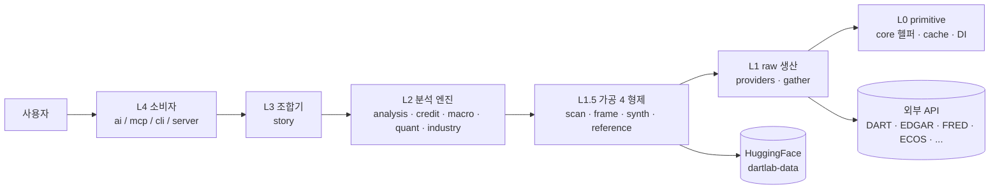
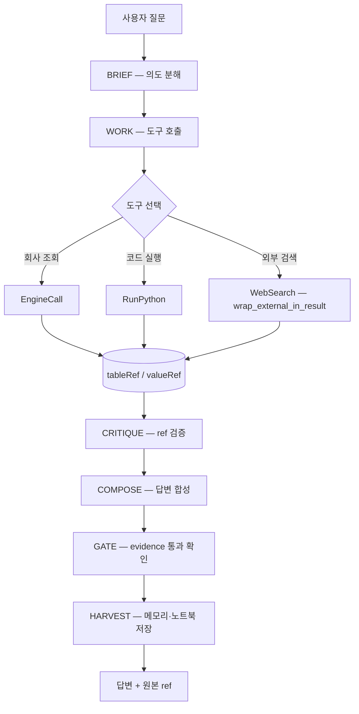

# API 진입 Flowchart — "어디서 시작?"

> dartlab 의 진입점 분기 시각화. README 의 "세 가지 시작점" 비교표를 *의사결정 흐름* 으로 표현.
> Mermaid 형식 — GitHub / VSCode / 대부분 markdown viewer 에서 렌더링.

---

## 의사결정 — 어느 진입점으로 갈까?

```mermaid
flowchart TD
    Start([dartlab 사용 시작]) --> Q1{무엇을 하고 싶나?}

    Q1 -->|자연어 질문<br/>"삼성전자 분석"| AI[AI Workbench<br/>dartlab.ask]
    Q1 -->|특정 데이터·계산| Q2{어떤 데이터?}
    Q1 -->|자동화·CLI 파이프라인| CLI[CLI<br/>dartlab show / list / analyze]

    Q2 -->|단일 회사 재무·공시| Company[Company facade<br/>dartlab.Company '005930']
    Q2 -->|전종목 스크리닝| Scan[Scan engine<br/>dartlab.scan recipe]
    Q2 -->|섹터·매크로·신용| Engine[분석 엔진<br/>analysis / credit / macro / quant]
    Q2 -->|회사 분석 보고서| Story[Story 8 막<br/>dartlab.Story '005930']

    AI --> Result[결과 + ref 검증]
    Company --> Result
    Scan --> Result
    Engine --> Result
    Story --> Result
    CLI --> Result

    Result --> Next{다음 단계?}
    Next -->|숫자 검산| Refs[ref.toDict — 원본 추적]
    Next -->|차트·시각화| Viz[viz / compileVisual]
    Next -->|외부 공유| Channel[channel — 블로그·SNS·차트 export]
    Next -->|다른 회사·기간| Loop[Loop — 같은 인터페이스 반복]
```

---

## API 진입점 표 (flowchart 의 텍스트 등가)

| 진입점 | 시그니처 | 첫 결과 | 대상 |
|--------|----------|---------|------|
| `dartlab.ask` | `ask(question: str) -> Answer` | ~1 분 | 자연어 질문 → AI 워크벤치 5 패스 |
| `dartlab.Company` | `Company(code: str)` | ~3 분 | 단일 종목 facade — show / show / diff |
| `dartlab.scan` | `scan(recipe: str, **params)` | ~3 분 | 전종목 스크리닝 / 횡단면 분석 |
| `dartlab.Story` | `Story(code: str)` | ~5 분 | 8 막 인과 + ref 조합 (story 엔진) |
| `dartlab.analysis` | `analysis.cashflow.* / ratios.* / ...` | ~3 분 | L2 분석 엔진 직접 호출 |
| `dartlab.credit` | `credit.altmanZScore() / trend()` | ~2 분 | 신용 점수 + zone |
| `dartlab.macro` | `macro.cycle() / sectorRotation()` | ~3 분 | 거시 사이클 + 섹터 로테이션 |
| `dartlab.quant` | `quant.foreignFlowFactor() / ...` | ~5 분 | 퀀트 factor / alpha |
| `dartlab.industry` | `industry.sectorMomentumLeadership()` | ~3 분 | 섹터 / peer 매트릭스 |
| `dartlab help` (CLI) | `dartlab help <query>` | ~1 분 | 관련 API 검색 + docstring summary |
| `dartlab list` (CLI) | `dartlab list <category>` | ~1 분 | recipe 인덱스 |
| `dartlab show` (CLI) | `dartlab show <code> <topic>` | ~2 분 | Company.show CLI 등가 |
| `dartlab analyze` (CLI) | `dartlab analyze <code> --aspect <name>` | ~3 분 | 분석 엔진 CLI 진입 |
| `dartlab mcp` (CLI) | `dartlab mcp` (server start) | ~30 초 | MCP server 외부 LLM 도구 등록 |

---

## 4 계층 단방향 흐름 (사용자 관점)



위 화살표 방향은 *호출 방향*. 의존성 화살표는 *역방향* (L0 ← L1 ← L1.5 ← L2 ← L3 ← L4 사용자).

---

## evidence flow (AI Workbench 안)



---

## 관련

- [DEVELOPMENT.md](DEVELOPMENT.md) — 첫 수정 10분 가이드 (개발자 진입)
- [CASE_STUDIES.md](CASE_STUDIES.md) — 3 실무 시나리오
- [../README.md](../README.md) — 세 가지 시작점 비교표 (사용자 진입)
- [../src/dartlab/skills/specs/start/](../src/dartlab/skills/specs/start/) — Skill OS 첫 진입 spec
- [../src/dartlab/skills/specs/runtime/workbenchEvidenceFlow.md](../src/dartlab/skills/specs/runtime/workbenchEvidenceFlow.md) — evidence flow 본문 SSOT
