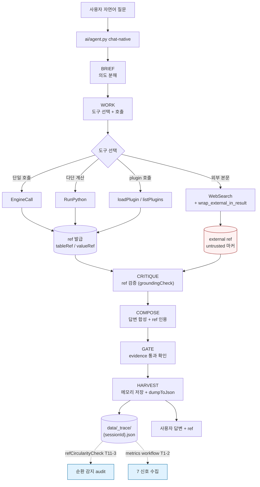
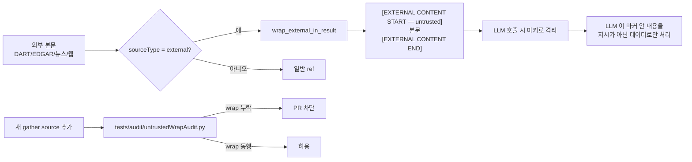
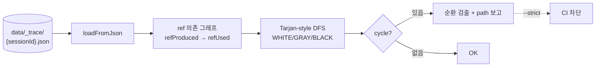

# AI Evidence Flow — workbench 5 패스 + ref 추적

> 워크벤치 추론 흐름. 외부 본문 untrusted 가드 + ref 검증 + trace dump.

---

## 5 패스 + ref/evidence flow

---

## untrusted 본문 처리 흐름

---

## ref circularity 검사 (T11-3)

---

## 룰

- **본체는 `ai/agent.py`** — chat-native + 자율 tool calling. 5 패스 노드 *class 신설 금지* (T11-5 audit).
- **외부 본문 untrusted** — `wrap_external_in_result` 마커 강행 (T2-5 audit).
- **trace 항상 dump 가능** — `AuditCollector.dumpToJson()` (T11-4).
- **ref 순환 0** — `refCircularityCheck.py` (T11-3).
- **graph 강박 회귀 금지** — `checkAgentBoundary.py` 가 5 패스 노드 식별자 12 패턴 차단.

---

## 관련

- [ARCHITECTURE.md](ARCHITECTURE.md) — 4 계층 + 워크벤치 sequence
- [DATA_PIPELINE.md](DATA_PIPELINE.md) — 데이터 흐름
- [../../src/dartlab/ai/agent.py](../../src/dartlab/ai/agent.py)
- [../../src/dartlab/ai/trace.py](../../src/dartlab/ai/trace.py) (T11-4)
- [../../tests/audit/refCircularityCheck.py](../../tests/audit/refCircularityCheck.py) (T11-3)
- [../../tests/audit/untrustedWrapAudit.py](../../tests/audit/untrustedWrapAudit.py) (T2-5)
- [../../tests/audit/checkAgentBoundary.py](../../tests/audit/checkAgentBoundary.py) (T11-5)
