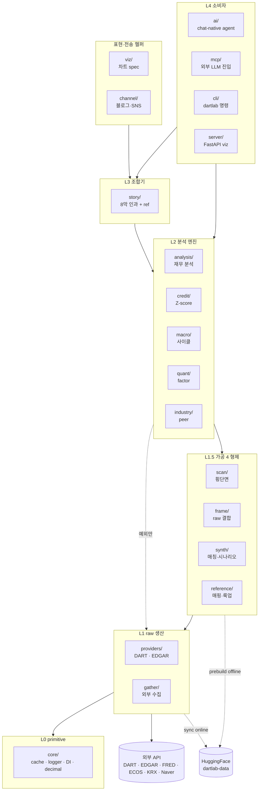
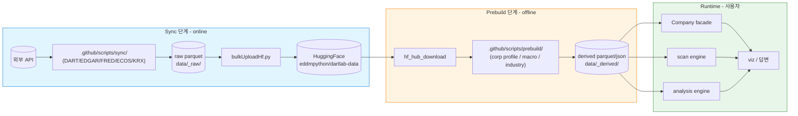
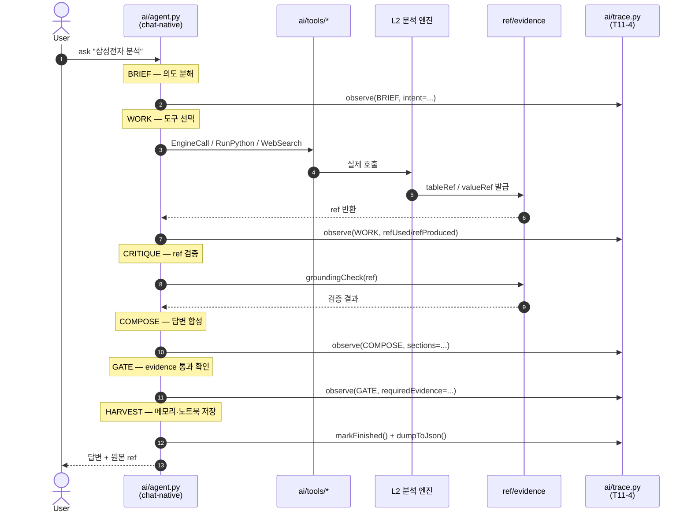

# Architecture Diagrams — 3 도식

> dartlab 아키텍처를 *세 시각* 으로 보는 다이어그램 세트. Mermaid 텍스트 — GitHub / VSCode / 대부분 markdown viewer 가 직접 렌더링.
> SVG export 가 필요한 경우: VSCode 의 Markdown Preview Mermaid Support 또는 `mmdc -i ARCHITECTURE.md -o output.svg`.

---

## 1. 전체 아키텍처 — 4 계층 단방향 + 14 sub-namespace

룰:
- 화살표 = 호출 방향. 의존성은 *역방향*.
- L1.5 4 형제 **cross import 금지** (강제: `tests/architecture/test_l15_no_cross_import.py`).
- L2 5 엔진 **상호 import 0** (강제: importlinter).
- L2 → L1 직접 import 는 *L1.5 에 없는 raw 필요 시 예외만*.

---

## 2. Data Flow — XBRL → Polars → 분석 ready

룰:
- **Sync = online** (외부 API 호출 허용)
- **Prebuild = offline only** (HF 다운로드만, `enforceOffline()` 강제)
- 3 층 가드: 런타임 `core/offlineGuard.py` + AST `test_prebuild_offline.py` + main entry lint
- DART 원본 zip 은 *로컬 임시 보관* (HF 비공개, .gitignore + skip + artifact 제외)

---

## 3. AI Workbench Flow — 5 패스 + evidence/ref

룰:
- 본체는 **`ai/agent.py` chat-native** (LLM 자율 tool calling).
- 5 패스는 *옵션 sub-agent* — workbench/loop.py 만 직접 호출.
- **새 5 패스 노드 클래스 추가 금지** (`tests/audit/checkAgentBoundary.py` 가 차단 — T11-5).
- 외부 본문은 **untrusted** — `wrap_external_in_result` 마커 강제.
- 모든 trace 는 `data/_trace/{sessionId}.json` 저장 가능 (T11-4) → ref circularity 검사 (T11-3).

---

## 관련

- [API_FLOWCHART.md](../API_FLOWCHART.md) — 사용자 진입점 의사결정 흐름
- [DEVELOPMENT.md](../DEVELOPMENT.md) — 첫 수정 10분 가이드
- [../../src/dartlab/skills/specs/operation/architecture.md](../../src/dartlab/skills/specs/operation/architecture.md) — Skill OS 아키텍처 SSOT
- [../../src/dartlab/skills/specs/runtime/workbenchEvidenceFlow.md](../../src/dartlab/skills/specs/runtime/workbenchEvidenceFlow.md) — evidence flow 본문
- [../../TODO.md](../../TODO.md) T10-1 트랙
