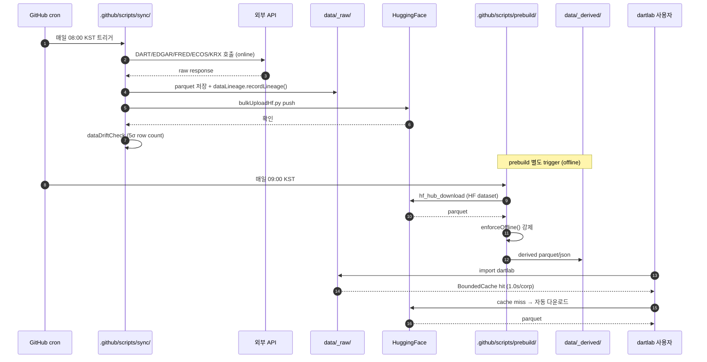
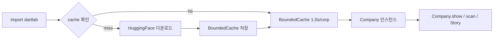

# Data Pipeline — sync ↔ HF ↔ prebuild ↔ runtime

> dartlab 데이터 흐름의 *시간 순서* 표현. ARCHITECTURE.md 의 정적 구조와 짝.

---

## 일간 cron 흐름

---

## 사용자 첫 호출 (cold)

---

## 사고 차단 가드

| 단계 | 가드 | 정합 |
|------|------|------|
| sync 단계 | online API 호출 정상 | sync vs prebuild 분리 |
| prebuild 단계 | `enforceOffline()` monkey-patch | T7-2 dataAudit |
| HF 업로드 | dataDriftCheck 5σ | T7-5 |
| HF 보관 | DART 원본 zip 3층 가드 | CLAUDE.md "DART 원본 zip 비공개" |
| 사용자 다운로드 | BoundedCache 메모리 안전 | T3-4 profileCall |

---

## 관련

- [ARCHITECTURE.md](ARCHITECTURE.md) — 정적 구조
- [../../src/dartlab/core/dataAudit.py](../../src/dartlab/core/dataAudit.py) (T7-2)
- [../../.github/scripts/sync/dataDriftCheck.py](../../.github/scripts/sync/dataDriftCheck.py) (T7-5)
