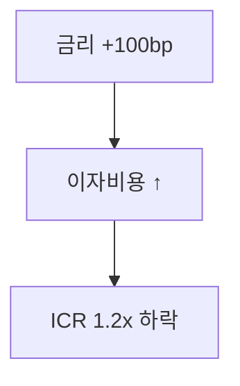
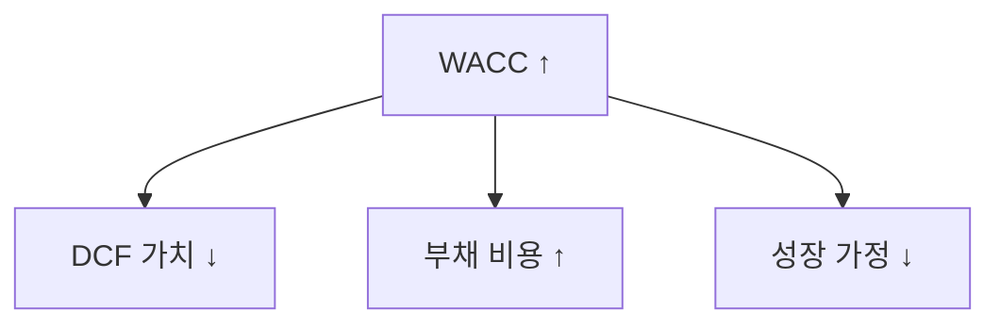
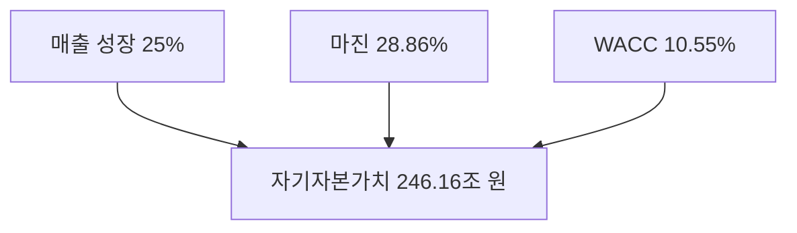
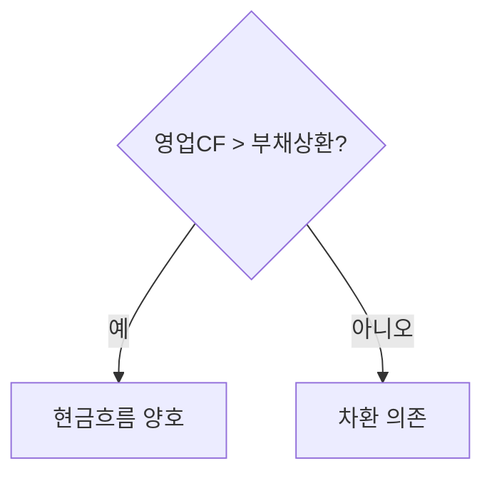
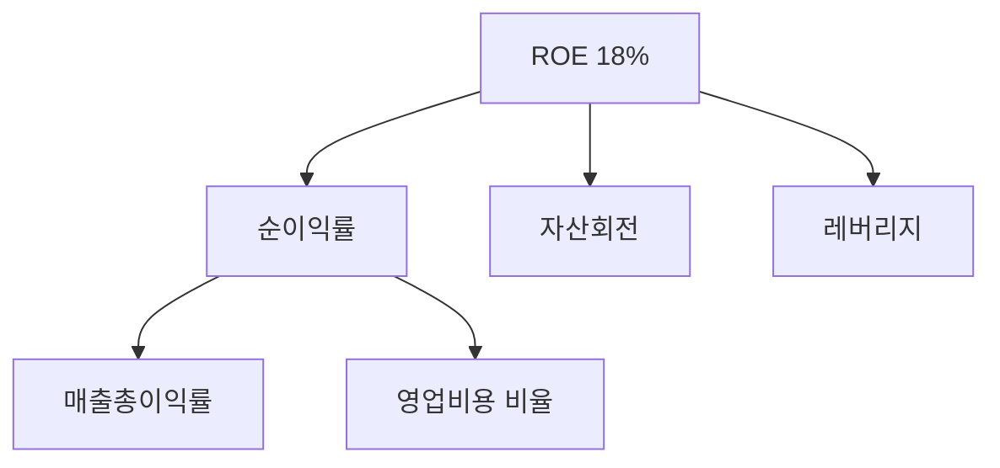

## 양식 선택 — 데이터 모양 → 다이어그램 모양

**먼저 본문에 그릴 내용의 구조를 분류한다. 구조가 적합 다이어그램을 결정한다.**

### A. 선형 인과 사슬 (A → B → C, 3-4 단계)
양식: `flowchart TD` (세로). 시간/논리 순서가 자연스럽게 위→아래로 흐른다.

- 노드 3~4 개. 단방향 화살표.
- LR 양식 안 쓴다 (채팅 폭 절약).

### B. 한 원인 → 여러 결과 (분기, fan-out)
양식: `flowchart TD` 루트 1 개 + 자식 2-4 개.

- 루트 위, 자식 아래 펼침.
- 자식 4 개 초과면 그룹화 (subgraph) 또는 본문 bullet 으로.

### C. 여러 요인 → 한 결과 (수렴, fan-in)
양식: `flowchart TD` 자식 위 → 루트 아래.

- 단순 합산·집계·valuation 결론 양식.

### D. 결정 분기 (조건 → 갈래)
양식: `flowchart TD` + 다이아몬드 노드 `{}`.

- 다이아몬드 = 결정. 화살표 라벨 = 분기 조건.
- 결정 ≤ 2 개. 다중 결정은 의사결정 트리 → 별도 비주얼.

### E. 트리 분해 (계층, 부 → 자 → 손)
양식: `flowchart TD`. 최대 3 레벨, 레벨당 자식 ≤ 4.

- DuPont, Piotroski, 회계 분해 양식.

### F. 네트워크 (방향성 약함, 상호 관계)
양식: `graph` (방향 생략 가능) + subgraph 로 클러스터.
- 지배구조, 거래 네트워크 등. 채팅 양식 안 거의 안 씀 — viz 의 NetworkChart 가 더 적합.

## 노드 / 라벨 양식

| 노드 종류 | 모양 | 라벨 양식 | 예 |
|---|---|---|---|
| 상태/지표 | `[X]` 사각형 | "지표명 값" | `[WACC 10.55%]` |
| 액션/단계 | `(X)` 둥근 | "동사형 단어" | `(데이터 검증)` |
| 결정 | `{X?}` 다이아몬드 | "조건? 양식" | `{ICR ≥ 1.5?}` |
| 결론/출력 | `[[X]]` 이중 | "결론 한 줄" | `[[고평가 판정]]` |

라벨 규칙:
- 12 자 이하. 단어 1-2 개 + 숫자/단위.
- 동사 + 명사 (액션) 또는 명사 + 값 (지표).
- 긴 설명·근거·해석은 본문 텍스트에. 다이어그램은 **포인터** 역할.
- 마침표 / 줄바꿈 안 쓴다 (`<br/>` 도 가급적 피함).

## 방향 선택 결정 규칙

- **기본**: `flowchart TD` (세로, 위→아래).
- `flowchart LR` 허용 조건: 노드 ≤ 4 AND 시간/공정 순서가 명백히 좌→우 인 경우만 (예: "원료 → 가공 → 출하").
- 그 외 모든 경우 TD. 채팅 양식 (폭 720 px) 에 가장 안전.

## 채팅 폭 가이드 (web ask 모드)

- 메시지 폭 ≈ 720 px (`max-w-3xl`). 다이어그램 자연 폭이 이 안에 들어가야 가로 스크롤 / 글씨 찌그러짐 없음.
- TD + 6 노드 + 12 자 라벨 → 자연 폭 약 200~280 px, 높이 자라남 → 안전.
- LR + 5 노드 + 12 자 라벨 → 자연 폭 약 600~700 px → 한계.
- LR + 노드 6 개 이상 → 폭 1000 px 이상 → 절대 안 됨. UI 자동 TD 회전 fallback 있지만 일관성 손상 → 처음부터 TD 로 그릴 것.

## 절차 (작성 순서)

1. 본문에 어떤 구조 (위 A~F) 를 보여줄지 분류.
2. 해당 양식 + 라벨 양식 적용.
3. edge 마다 근거 ref 부여 (`evidenceBinding` 또는 본문 인용).
4. 노드 수 / 라벨 길이 / 방향 self-check.
5. 채팅에서 잘릴 위험 있으면 부 다이어그램 2 개로 쪼개거나 본문 bullet 으로 강등.

## 공개 호출 방식

```python
from dartlab.viz import emit_diagram

source = "graph LR\n  A[금리 +100bp] --> B[이자비용 증가]\n  B --> C[ICR 하락]"
emit_diagram("mermaid", source)
```

## 호출 동작

- 입력 view 또는 rows 를 검산 가능한 ChartSpec 으로 변환한다.
- `evidenceBinding` 또는 `evidenceIds` 가 없으면 emit 하지 않는다.
- 데이터가 부족하면 값을 추정하지 않고 표, coverage note, 또는 bullet path 로 낮춘다.

## 대표 반환 형태

- `dict` ChartSpec: `chartType`, `title`, `series` 또는 `data`, `categories`, `evidenceBinding`, `meta`.
- Mermaid 계열은 diagram source 와 node/edge evidence refs 를 함께 남긴다.

## 기본 검증

- diagram 의 모든 edge 가 answer claim 또는 evidence ref 로 되짚어져야 한다.
- Mermaid 는 설명을 대체하지 않고 메커니즘 섹션에만 배치한다.
