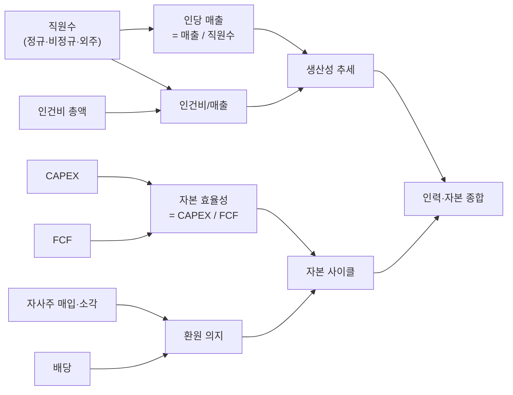

## 공개 호출 방식

```python
import dartlab

target = "005930"
c = dartlab.Company(target)

workforce = c.workforce()
capital = c.capital()
workforce_peer = c.workforce("all")
capital_peer = c.capital("all")
allocation = c.analysis("financial", "자본배분")

def firstRow(df):
    if df is None or getattr(df, "height", 0) == 0:
        return {}
    return df.head(1).to_dicts()[0]

def pick(row, *names):
    for name in names:
        if name in row and row[name] not in (None, ""):
            return row[name]
    return None

def asNumber(value):
    if value is None:
        return None
    try:
        return float(str(value).replace(",", "").replace("%", ""))
    except (TypeError, ValueError):
        return None

w = firstRow(workforce)
k = firstRow(capital)

metrics = {
    "employeeCount": asNumber(pick(w, "직원수", "employees", "employee_count")),
    "avgTenure": asNumber(pick(w, "평균근속", "avgTenure", "tenure")),
    "revenuePerEmployee": asNumber(pick(w, "1인당매출", "인당매출", "revenuePerEmployee")),
    "avgSalary": asNumber(pick(w, "평균급여", "avgSalary", "salary")),
    "dividendYield": asNumber(pick(k, "배당수익률", "dividendYield")),
    "payoutRatio": asNumber(pick(k, "배당성향", "payoutRatio")),
    "buyback": asNumber(pick(k, "자사주매입", "buyback", "treasuryStockPurchase")),
    "totalReturnYield": asNumber(pick(k, "총환원율", "totalReturnYield")),
    "capitalClass": pick(k, "분류", "class", "capitalClass"),
}

flags = []
if metrics["revenuePerEmployee"] is None:
    flags.append("인당 매출 부재 — 직원수 단독 해석 금지")
if metrics["totalReturnYield"] is None and metrics["payoutRatio"] is None:
    flags.append("환원율 부재 — 배당/자사주 판단 보류")
if metrics["buyback"] and not metrics["totalReturnYield"]:
    flags.append("자사주 매입은 있으나 총환원율 검산 불가 — 소각 여부 별도 확인")

table = [
    {"axis": "workforce", "metric": "employeeCount", "value": metrics["employeeCount"]},
    {"axis": "workforce", "metric": "revenuePerEmployee", "value": metrics["revenuePerEmployee"]},
    {"axis": "workforce", "metric": "avgSalary", "value": metrics["avgSalary"]},
    {"axis": "capital", "metric": "payoutRatio", "value": metrics["payoutRatio"]},
    {"axis": "capital", "metric": "totalReturnYield", "value": metrics["totalReturnYield"]},
    {"axis": "capital", "metric": "capitalClass", "value": metrics["capitalClass"]},
]

emit_result(
    table=table,
    values=metrics | {"flags": flags},
    date=str(pick(w, "기간", "year", "date") or pick(k, "기간", "year", "date") or "latest"),
)
```

## 호출 동작 — 5 단 분석 구조

답변은 분석 5 단 (결론 / 근거 / 메커니즘 / 반례·한계 / 후속 모니터링) 매핑. 인력·자본 사이클 결합 결과를 5 단으로 정리.

### 1. 결론 도출

회사의 *인력 효율성 (인당 매출·인당 영업이익) + 자본 효율성 (CAPEX/FCF) + 자본배분 의지* 한 문장 정량 결론.

좋은 결론 예시:
- "005930 (삼성전자) 5 년 — 직원수 11.4 만 → 12.6 만 (+10%), 인당 매출 25.4 억 → 23.8 억 (-6.3%, *생산성 둔화*), 인건비 14.5 조 (매출 4.8%, 산업 평균 6.2% 대비 우위). 자본 — 자사주 매입 5 년 12 조 + 소각 8 조 (소각 비중 67%), CAPEX 5 년 평균 35 조 (FCF 60 조의 58%, *재투자 + 환원 균형*). **인력 효율 둔화 watch + 자본 효율 양호**."
- "OOOOOO 직원수 -8% (구조조정), 인당 매출 +12% (*생산성 회복*), CAPEX -30% (FCF 회복 + 신규 투자 보류), 자사주 매입 0 (5 년 모두). **인력 축소 + 자본 보수** — cycle late stage 또는 사업 정체."

금지 — 직원수 변동 *단독* 으로 회사 전망 단정. 반드시 *인당 매출 + 인건비 비중 + 자본 사이클* 결합.

### 2. 핵심 근거 수집

`requiredEvidence: skillRef + tableRef + valueRef + dateRef` 4 종 명시.

- **skillRef**: `engines.scan` (직원수·인건비 횡단), `engines.scan` (자본 변동 횡단), `engines.analysis` (배분 우선순위), `engines.company.workforce()` + `engines.company.capital()` (개별 회사).
- **sourceRef**: DART 사업보고서 — 종업원 명세 (정규/비정규/외주 분리), 임원 보수, 인건비 시계열. 자사주 변동 보고. 분기·연간.
- **tableRef** (3 표):
  1. workforce — year × (직원수, 인건비 총액, 인당 매출, 인당 영업이익, 인건비/매출)
  2. capital — year × (자사주 매입, 자사주 소각, 자사주 잔액, 신주 발행, 배당총액)
  3. capital allocation — year × (배당%, 자사주%, CAPEX%, R&D%, M&A%, 차입상환%)
- **valueRef**: 5 년 직원수 변화 · 인당 매출 변화 · 인건비/매출 비중 · 자사주 소각 비중 · CAPEX/FCF 비율.
- **dateRef**: 5 년 사업연도.

도구: `EngineCall` (workforce·capital·allocation) + `RunPython` (5 년 시계열 + 산업 평균 ±σ).

### 3. 메커니즘 분석

인력·자본 사이클 = *생산성 + 자본 효율성 양 축 합의*:



**인력 신호 해석**:
- **인당 매출 ↑** = 생산성 우위 (자동화·디지털·M&A 효율).
- **인당 매출 ↓** = 인력 과잉 또는 매출 둔화. 산업 cycle 동반 확인.
- **인건비/매출 산업 분위**: 제조 < 10%, IT 15-25%, 컨설팅·금융 30%+ 정상.
- **정규/비정규 분리**: 비정규직 비중 ↑ = 단기 유연성 (위험 시 회수 가능), 정규직 ↑ = 장기 quality (이직 비용).

**자본 신호 해석**:
- **CAPEX/FCF**: < 30% = 보수 (cycle late·rights 부재), 50-70% = 균형, > 100% = 차입 의존 (cycle early).
- **자사주 매입 vs 소각**: 매입 만 + 소각 0 = quality 약함. 소각 비중 50%+ = 진짜 환원.
- **신주 발행 = 희석**: 발행주식수 +X% → EPS -X%. 빈번 발행 = 자본 부족 신호.

### 4. 반례·한계

- **Falsifier**: 직원수 변동만으로 회사 전망 단정 금지 — 인당 매출·인건비 비중·자본 사이클 *모두 검토* 후에만 결론.
- **정규·비정규·외주 분리**: 사업보고서에 별도 명세. 비정규 비중·외주비 별도 추적 필요.
- **인건비 정의**: 총액 (`employee_benefits`) vs 인당 (`/headcount`) — 답변에 정의 명시.
- **자사주 종류 정확**: 매입 (treasury) vs 소각 (cancel) vs 처분 (resell) 효과 다름. 소각만 EPS 영구 제거.
- **신주 발행 영향**: 자본 증가 + 발행주식수 증가 + EPS 희석. 자사주 매입과 *반대 효과* — 같은 분석에서 net 환원율 계산 필수.
- **연결 vs 별도 직원수**: 자회사·해외법인 합산 차이 큼. 본 recipe 연결 기준.
- **산업별 정상 비중**: 인건비/매출 비중 IT 25% 정상, 제조 5% 정상. 산업 ±σ 위치 동반.
- **사업보고서 시점 차이**: 연간 정기 vs 임시 (구조조정·M&A) 변동. 시점 명시.
- **failureModes** — 정규/비정규 분리 / 인건비 정의 / 자사주 종류 / 자회사 합산 / 산업 정상 비중.

### 5. 후속 모니터링

답변 끝에 모니터링 표:

| 신호 | 현재값 | 5년 평균 | 임계값 (재분석 시그널) | 리뷰 주기 |
|---|---|---|---|---|
| 직원수 | (workforce) | (계산) | ±5% YoY | 분기 |
| 인당 매출 | (계산) | (계산) | ±10% YoY | 분기 |
| 인건비/매출 | (계산) | (계산) | 산업 평균 ±2%p | 분기 |
| CAPEX/FCF | (계산) | (계산) | < 30% 또는 > 100% | 분기 |
| 자사주 소각 비중 | (계산) | (계산) | < 50% (treasury bloat) | 연간 |
| 신주 발행 빈도 | (DART) | — | 1+ 회/년 | 연간 |

## 대표 반환 형태

`emit_result` payload:

| key | shape | 의미 |
|---|---|---|
| `table` | `[{axis, metric, value}]` | workforce/capital 핵심 metric 6~10개 |
| `values.employeeCount` | `float | None` | 최신 직원수 |
| `values.revenuePerEmployee` | `float | None` | 인당 매출. 없으면 직원수 해석 보류 |
| `values.payoutRatio` | `float | None` | 배당성향 |
| `values.totalReturnYield` | `float | None` | 배당 + 자사주 환원율 |
| `values.flags` | `string[]` | 결론 보류 조건 |
| `date` | `string` | 보고 기간 또는 latest |

최종 답변은 `summary → evidenceTable → mechanism → falsifier → monitoring` 순서로 작성한다. `values.flags` 가 하나라도 있으면 결론을 "확정"이 아니라 "보류/추가 확인"으로 낮춘다.

## 연계 절차

1. engines.company — 대상 회사와 provider를 고정한다.
2. engines.scan — 직원수·평균급여·인당 매출의 횡단 위치를 확인한다.
3. engines.scan — 배당·자사주·총환원율·희석 신호를 확인한다.
4. engines.analysis — 자본배분 우선순위와 재투자/환원 균형을 확인한다.
5. recipes.fundamental.quality.capitalAllocationScorecard — FCF 5 사용처와 ROIIC/SGR까지 필요할 때 확장한다.
6. recipes.fundamental.dividend.capitalReturn — 배당·자사주 정책이 핵심 질문이면 넘긴다.
7. recipes.fundamental.governance.audit — 인력/자본 신호가 지배구조 리스크와 연결될 때 넘긴다.

## 기본 검증

- 직원수 단독 결론 금지. `employeeCount`, `revenuePerEmployee`, `avgSalary` 중 2개 이상 있어야 workforce claim 허용.
- 환원 claim 은 `payoutRatio`, `totalReturnYield`, `buyback` 중 2개 이상 있어야 허용.
- 자사주 매입은 소각 여부가 확인되지 않으면 EPS 개선으로 쓰지 않는다.
- 인력 축과 자본 축이 서로 반대 신호면 stewardship verdict 를 단일 문장으로 단정하지 않는다.
- 재호출 트리거: "직원수 + 인건비 + 생산성", "자사주 매입/소각/신주 발행", "인당 매출/영업이익", "인력 + 자본 사이클".
