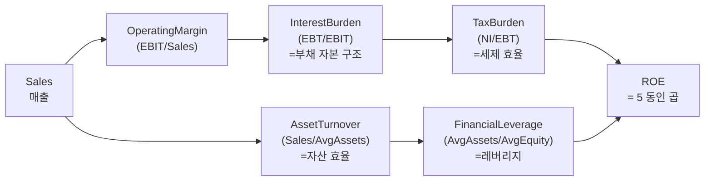

## 학술 근거

DuPont 사 (E.I. du Pont de Nemours, 1920 년대) 가 도입한 ROE 분해. CFA Institute Level 1 표준 (CFA Curriculum, FRA Reading 22). 핵심 식:

ROE = (NI / EBT) × (EBT / EBIT) × (EBIT / Sales) × (Sales / Avg Assets) × (Avg Assets / Avg Equity)
    = TaxBurden × InterestBurden × OperatingMargin × AssetTurnover × FinancialLeverage

각 항목의 의미:
- **TaxBurden** — 세후 / 세전. 1 에 가까울수록 세부담 낮음. 산업·국가·세제 의존.
- **InterestBurden** — 세전 / 영업이익. 1 에 가까울수록 이자비용 낮음. 부채 자본 구조 반영.
- **OperatingMargin** — 영업이익 / 매출. 사업 본업의 수익성.
- **AssetTurnover** — 매출 / 평균자산. 자산 효율 (자본 회전).
- **FinancialLeverage** — 평균자산 / 평균자기자본. 부채를 통한 자본 증폭 — equity multiplier.

ROE 가 같은 두 회사도 5 동인 분포가 다르면 사업 모델이 완전 다름. 예: 명품 회사는 OpMargin 높고 Turnover 낮음, 마트는 반대.

검증 사례:
- Penman (2013): DuPont 분해가 future earnings 예측에서 단순 ROE 보다 우월. RNOA (Return on Net Operating Assets) 와 결합 시 가장 강한 신호.
- Soliman (2008): 산업 평균 대비 OpMargin·Turnover 분해로 미래 수익률 예측 가능.

## L1 데이터로 직접 계산 (analysis axis 미사용)

dartlab 의 `c.show()` 가 L1 provider 데이터 그대로 노출. analysis 엔진의 `profitability` / `efficiency` axis 결과를 의존하지 않고 raw 시계열에서 직접 분해.

## 공개 호출 방식

```python
import dartlab
import polars as pl

c = dartlab.Company("005930")

is_df = c.show("IS", freq="Y")   # 손익계산서 (매출·영업이익·세전·순이익)
bs_df = c.show("BS", freq="Y")   # 재무상태표 (자산·자본 시계열)

years = ["2025", "2024", "2023", "2022", "2021"]

def dupontDecompose(is_df: pl.DataFrame, bs_df: pl.DataFrame, years: list[str]) -> pl.DataFrame:
    sales = is_df.filter(pl.col("snakeId") == "sales").select(years).to_numpy()[0]
    op = is_df.filter(pl.col("snakeId") == "operating_profit").select(years).to_numpy()[0]
    ebt = is_df.filter(pl.col("snakeId") == "earnings_before_tax").select(years).to_numpy()[0]
    ni = is_df.filter(pl.col("snakeId") == "net_income").select(years).to_numpy()[0]
    assets = bs_df.filter(pl.col("snakeId") == "total_assets").select(years).to_numpy()[0]
    equity = bs_df.filter(pl.col("snakeId") == "total_stockholders_equity").select(years).to_numpy()[0]

    avg_assets = [(assets[i] + assets[i+1]) / 2 for i in range(len(years)-1)]
    avg_equity = [(equity[i] + equity[i+1]) / 2 for i in range(len(years)-1)]

    rows = []
    for i, y in enumerate(years[:-1]):
        rows.append({
            "year": y,
            "taxBurden": ni[i] / ebt[i],
            "interestBurden": ebt[i] / op[i],
            "operatingMargin": op[i] / sales[i],
            "assetTurnover": sales[i] / avg_assets[i],
            "financialLeverage": avg_assets[i] / avg_equity[i],
            "roeReconstructed": (ni[i] / ebt[i]) * (ebt[i] / op[i]) * (op[i] / sales[i])
                               * (sales[i] / avg_assets[i]) * (avg_assets[i] / avg_equity[i]),
        })
    return pl.DataFrame(rows)

result = dupontDecompose(is_df, bs_df, years)
```

## 호출 동작 — 5 단 분석 구조

답변은 분석 5 단 (결론 / 근거 / 메커니즘 / 반례·한계 / 후속 모니터링) 매핑. DuPont 5 동인 분해 결과를 5 단 답안 구조에 재배치한다.

### 1. 결론 도출

회사의 *ROE 시계열 추세 + 5 동인 중 주도 동인 + 구조적 vs 일시적 분리* 를 한 문장 정량 결론으로.

좋은 결론 예시:
- "005930 (삼성전자) 5 년 ROE 14.8% → 11.2% (-3.6%p), 주도 동인 OperatingMargin (-2.8%p 기여) — 메모리 사이클 다운턴이 영업마진 압박. AssetTurnover·FinancialLeverage 안정 (각 ±0.05), TaxBurden 0.78 보합. **구조적 ROE 하락 (사업 마진)** 이지 *일시적 레버리지 변동* 아님."
- "035420 (NAVER) 5 년 ROE 12.5% → 9.8%, AssetTurnover (-0.4 기여) 가 주도 — 사업 확장 자산 증가 (커머스·콘텐츠 투자). OperatingMargin 22% 유지, FinancialLeverage 1.4 안정. **자산 효율 일시 저하 (CAPEX 사이클)** — 향후 자산 회수 시 ROE 회복 가능."

금지 — "ROE 15% = 좋음" 단정. 반드시 *5 동인 분포* + *주도 동인 식별* + *구조적 vs 일시적 분리* 동반.

### 2. 핵심 근거 수집

`requiredEvidence: skillRef + tableRef + valueRef + dateRef` 4 종 명시.

- **skillRef**: `engines.gather` 또는 `engines.company.show` (L1 raw IS/BS 호출), `engines.scan` (비교용 산업 평균). analysis axis 의존 X — *raw 직접 계산* 이 본 recipe 핵심.
- **sourceRef**: DART 공시 — 5 년 손익계산서 (sales, operating_profit, earnings_before_tax, net_income) + 5 년 재무상태표 (total_assets, total_stockholders_equity). 연결재무 기준.
- **tableRef** (4~5 행 시계열): year × {taxBurden, interestBurden, operatingMargin, assetTurnover, financialLeverage, roeReconstructed}.
- **valueRef**: 최근년도 5 동인 + 5 년 표준편차 (변동성) + 주도 동인 (표준편차 최대) + 산업 평균 비교.
- **dateRef**: 5 회계년도 (예: 2021-12-31 ~ 2025-12-31).

도구: `RunPython` (L1 wide DataFrame → snakeId 필터 → 6 항목 추출 → 5 동인 계산). `EngineCall` 보조 (industry peer 평균 비교).

### 3. 메커니즘 분석

ROE = 5 동인 곱. 인과 경로 시각:



각 동인의 *해석* (답변 본문에 명시):
- **OperatingMargin** ↓ → 사업 본업 수익성 (사이클·가격·비용 구조 변화)
- **AssetTurnover** ↓ → 자산 활용도 (CAPEX 후 회수 지연·재고 과다·매출채권 회전)
- **FinancialLeverage** ↑ → 부채로 자본 증폭 (위험 동반) — *quality 우위* 가 아닌 *증폭 효과*
- **InterestBurden** ↓ → 이자비용 증가 (부채·금리)
- **TaxBurden** 변동 → 세제·세무 조정 (보통 산업 안정)

**주도 동인 식별** 휴리스틱: 5 년 표준편차 가장 큰 동인이 ROE 변동의 주 원인 (70%+ 설명력이면 단일 동인 사이클).

### 4. 반례·한계

- **Falsifier**: `roeReconstructed` 와 원본 ROE (`net_income / avg_equity`) 차이 > 0.5%p 면 데이터 누락/이상.
- **음수 영업이익 (적자) 회사**: InterestBurden = EBT/EBIT 가 무한대 또는 음수. 적자 회사에 framework 단순 적용 X — 흑자 5 년 회사만 권장.
- **금융업 부적합**: 은행·보험 IS 구조 다름 (이자수익·보험료 = 매출). 별도 framework 필요.
- **earnings_before_tax snakeId 가용성**: 일부 회사 IS 에서 영업외손익 분리 안 됨. fallback — `net_income / (1 - taxRate)` 추정.
- **평균자산 단일 시점 가중**: 직전년말 + 당년말 / 2 사용 — 분기 가중평균 (Q1·Q2·Q3·Q4) 이 더 정확.
- **연결 vs 별도**: 본 recipe 는 연결재무 기준. 지주회사 (자회사 효과 큼) 는 분해 결과 해석 주의 — 별도 재무로 재실행 권장.
- **일회성 효과**: OperatingMargin 단발 변동 (영업외이익·자산매각 등) → 연간 분해 시 노이즈. 분기 시계열 (`freq="Q"`) 로 평활화 권장.
- **회계 기준 변경**: K-IFRS 자발적 정책 변경 (예: 운용리스 IFRS 16 도입) 시점 영향 미보정.
- **failureModes** — earnings_before_tax 가용성 / 분기 가중평균 / 연결 vs 별도 / 일회성 / 회계 기준 변경 — 답변 작성 시 self-check.

### 5. 후속 모니터링

답변 끝에 모니터링 표:

| 동인 | 현재값 | 5년 평균 | 산업 평균 | 임계값 (재분석 시그널) |
|---|---|---|---|---|
| OperatingMargin | (계산) | (계산) | (scan.ratio) | ±2%p 변동 |
| AssetTurnover | (계산) | (계산) | (scan.ratio) | ±0.1 변동 |
| FinancialLeverage | (계산) | (계산) | (scan.ratio) | ±0.2 변동 |
| roeReconstructed | (계산) | (계산) | (scan.ratio) | ±2%p YoY |

연계 절차:
- OperatingMargin 변동 → `recipes.fundamental.quality.workingCapitalQuality` (운전자본 효율)
- AssetTurnover 변동 → CAPEX 시계열 + `engines.analysis`
- FinancialLeverage 변동 → `recipes.fundamental.credit.distressDual` (부채 위험)
- 5 년 일관 quality compounder 인지 → `recipes.meta.screen.compounderCandidates`
- 자본 배분 평가 → `recipes.fundamental.quality.capitalAllocationScorecard`

재호출 트리거: "삼성전자 5 년 ROE 5 동인 분해", "DuPont 동인 표준편차 큰 항목 식별", "산업 평균 분해 + 회사 비교".

## 대표 반환 형태

`result : pl.DataFrame` — 컬럼:
- `year : str` — 4 기간 (5 년 시계열에서 평균자산 계산으로 1 기간 손실)
- `taxBurden : float` — NI/EBT
- `interestBurden : float` — EBT/EBIT
- `operatingMargin : float` — EBIT/Sales
- `assetTurnover : float` — Sales/AvgAssets
- `financialLeverage : float` — AvgAssets/AvgEquity
- `roeReconstructed : float` — 5 동인 곱 (원본 ROE 일치 확인)

## 한계

- **`earnings_before_tax` snakeId 가용성** — 일부 회사 IS 에서 영업외손익 분리 안 됨. fallback 으로 `net_income / (1 - taxRate)` 추정.
- **평균자산 단일 시점 가중** — Q1·Q2·Q3·Q4 가중평균이 더 정확하나 본 recipe 는 연말 + 전년말 평균만.
- **연결 vs 별도** — 한국 회사 연결재무 기준. 자회사 효과 큰 지주회사는 분해 해석 주의.
- **금융업 부적합** — 은행·보험 IS 구조 다름 (이자수익·보험료 매출). 별도 분해 framework 필요.

## 한국 / 미국 시장 차이

- **한국**: 법인세율 변동 작아 TaxBurden 안정. 영업외손익 비중 큰 회사 (지주·금융 자회사) 다수 → InterestBurden 변동 크게 나타나는 경우 주의.
- **미국**: 본 framework 의 본 시장. S&P 500 대표 회사 5 동인 평균 배포 — Damodaran 산업 데이터로 비교 가능.

## 연계 절차

1. 본 recipe → ROE 5 동인 시계열 도출.
2. 동인 변화 큰 (표준편차 큰) 항목 식별 — ROE 변동의 원인.
3. OperatingMargin 변동 → `recipes.fundamental.quality.workingCapitalQuality` 로 운전자본 효율 점검.
4. AssetTurnover 변동 → 자산 재투자 시점 (CAPEX 시계열) 분석.
5. FinancialLeverage 변동 → `recipes.fundamental.credit.distressDual` 로 부채 위험 점검.
6. 5 년 일관 quality compounder 인지 → `recipes.meta.screen.compounderCandidates` 와 상호 검증.

## 기본 검증

- `roeReconstructed` 와 원본 ROE (`net_income / avg_equity`) 차이 ≤ 0.5%p 이어야 분해 정확.
- 5 동인 변화율 표 확인 — 한 동인이 전체 ROE 변화의 70% 이상 설명하면 단일 동인 사이클.
- 산업 평균 분해와 비교 — 본 회사가 동종 대비 어느 동인이 우월/열위인지.
- 음수 영업이익 시 InterestBurden 무한대 — 흑자 5 년 회사만 적용 권장.
- "ROE 15% = 좋다" 단정 X — 5 동인 분포로 구조적 우위 (margin·turnover) vs 일시적 (leverage 상승) 구분.
