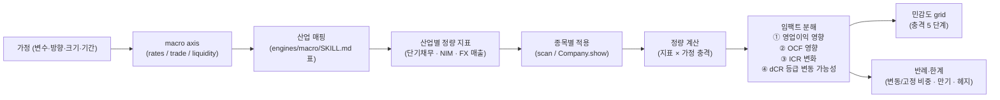

## 공개 호출 방식

```python
import dartlab
import polars as pl

# 1. macro 변수 현황 + 결측 확인
macro_axes = {}
for axis in ["rates", "trade", "liquidity"]:
    try:
        macro_axes[axis] = dartlab.macro(axis=axis, market="KR")
    except Exception as exc:
        macro_axes[axis] = {"error": str(exc)}

# 2. 산업 매핑 — rates 의 경우 은행·보험·증권·리츠·고PER 성장주
# (engines/macro/SKILL.md 의 산업별 macro 연결 표 참조)
mapping = {
    "rates": {
        "industries": ["은행", "보험", "증권", "리츠", "고PER 성장주", "고레버리지 비금융"],
        "metric_path": ["finance.account.shortTermDebt", "finance.ratio.icr"],
    },
}

# 3. 종목별 정량 계산 — 단기채무 × 가정 bp = 연환산 절감액
candidates = dartlab.scan(axis="debt")  # 부채구조 전종목
top = candidates.sort("shortTermDebt", descending=True).head(20)

shock_bp = 25  # 사용자 가정
results = []
for row in top.iter_rows(named=True):
    code = row["stockCode"]
    short_debt = row.get("shortTermDebt") or 0
    annual_saving = short_debt * shock_bp / 10000  # bp → %, 단위 정합
    results.append({
        "stockCode": code,
        "shortTermDebt": short_debt,
        "savingEstimate_bp25": annual_saving,
    })

emit_result(
    table=results[:10],
    values={
        "shockBp": shock_bp,
        "candidateCount": len(results),
        "macroNullAxes": [a for a, v in macro_axes.items() if isinstance(v, dict) and v.get("error")],
    },
    date="latest",
    sources=["dartlab://macro", "dartlab://scan/debt", "dartlab://scan/macroBeta"],
)
```

## 호출 동작 — 5 단 분석 구조

### 1. 결론 도출

*가정 (변수·방향·크기·기간) 명시* + *산업 매핑* + *종목별 정량 임팩트* 한 문장.

좋은 결론 예시:
- "한국 기준금리 -25bp 1년 외생 시나리오 — 단기채무 × 25bp 1 차 추정 기준 수혜 상위 3 = 한국전력 376.5억 / 다우기술 256.9억 / 현대차 216.0억. 산업 매핑상 은행은 *NIM 압박* 가능 (수혜 X). 변동/고정 비중·만기 분포는 별도 공시 필요."
- "USD/KRW +5% 절상 (1300 → 1365) — 수출 비중 80%+ 자동차·반도체 (예 - 005380·005930) FX 손익 +XX% 추정. 단 외화 부채·헤지 비중 별도 차감 필요. macro trade axis confidence = low (결측 다수)."

금지:
- 가정 크기 (bp, %) 명시 없이 *수혜* 표현.
- 단일 산업 매핑 (예 - "은행 NIM 우대") 만 인용. 종목별 정량 계산 동반 필수.
- macro 결과 결측 무시.

### 2. 핵심 근거 수집

`requiredEvidence: skillRef + tableRef + valueRef + dateRef + executionRef` 필수.

- **skillRef**: `engines.macro` (rates/trade/liquidity/scenario), `engines.scan` (debt/cashflow 등 전종목 분포), `engines.company` (개별 종목 단기채무·외화매출·FX 노출), `engines.analysis` (매크로 민감도), `engines.credit` (dCR 변동 추정).
- **tableRef** (3+ 표):
  1. **산업 매핑** — macro axis (rates/trade/liquidity/crisis/assets) × 영향 큰 산업 × 정량 지표 (예 - 단기채무·외화매출·NIM)
  2. **종목별 정량** — code · 시총 · 핵심 지표 (단기채무 · 외화매출 비중 · NIM) · 가정 충격 적용 결과 · 영업이익 대비 비율
  3. **민감도 grid** — 충격 -50% / -25% / 0 / +25% / +50% 5 단계 × 정량 결과
- **valueRef**: 가정 (충격 크기), 종목별 추정값, macro 결측 axis 수.
- **dateRef**: macro asOf · 종목 재무 기준 분기.
- **executionRef**: macro EngineCall · RunPython 가공 id.

도구 우선순위:
1. `EngineCall("macro", axis="rates"/"trade"/"liquidity")` — 현재값 + 결측 확인
2. `EngineCall("macro", axis="scenario", target="2008 금융위기" 등)` — preset 가정 활용 시
3. `EngineCall("scan", axis="debt"/"cashflow")` — 전종목 정량 후보
4. `EngineCall("Company.show", topic="BS"/"IS")` — 정밀 정량
5. `EngineCall("Company.analysis", axis="macro", sub="매크로민감도")` — 회사 단위 elasticity
6. `RunPython` — 시나리오 grid 계산 + 결측 처리

### 3. 메커니즘 분석

민감도 = *macro 변수 → 산업 매핑 → 회사 정량 → 손익·CF·신용도 분해*:



**산업 매핑 표** (engines/macro/SKILL.md 와 일관성 유지):

| macro 변수 | 영향 큰 산업 | 정량 지표 (회사 측) | 가정 → 임팩트 산식 (1 차) |
|---|---|---|---|
| 금리 (rates) | 은행·보험·증권·리츠·고PER 성장주·고레버리지 비금융 | 단기채무 · NIM · ICR · 변동/고정 비중 | 단기채무 × 가정 bp = 연환산 절감/증가액 |
| 환율 (USD/KRW) | 수출주 (반도체·자동차·조선) · 외화 부채 보유사 | 외화매출 비중 · 외화부채 · 헤지 비중 | (외화매출 - 외화부채) × FX 변동% |
| 유가 (WTI/Brent) | 정유·항공·운송·석유화학 | 원가 중 유가 비중 · 매출 중 유가 연동 비중 | 매출/원가 × 유가 변동% |
| 교역 (수출증가율) | 반도체·자동차·조선 (수출 비중 큰 KR) | 수출 매출 비중 · 주요 시장 점유 | 수출 매출 × 가정 증가율% |
| 유동성 (M2/NFCI) | 자산운용·증권·중소형 성장주 | 거래대금 · 차입 규모 · beta | (간접) valuation multiple 변동 |

**민감도 grid 예시** — 금리 -25bp 단일:

| 종목 | 단기채무 | -50bp | -25bp | 0 | +25bp | +50bp |
|---|---:|---:|---:|---:|---:|---:|
| 한전 015760 | 15.06조 | 753억 | 376.5억 | 0 | -376.5억 | -753억 |
| 다우기술 023590 | 10.28조 | 514억 | 256.9억 | 0 | -256.9억 | -514억 |
| 현대차 005380 | 8.64조 | 432억 | 216.0억 | 0 | -216.0억 | -432억 |

### 4. 반례·한계

- **Falsifier**: macro 현재값 결측 + 가정 외 baseline 부재 시 *외생 시나리오* 명시.
- **변동/고정 비중 미확인**: 단기채무 × bp 는 *완전 변동* 가정 1 차. 고정 비중 50% 면 절감액 절반.
- **만기 분포**: 25bp 인하 1 년 내 반영은 만기 도래 차입금 한정. 5 년 만기 고정 회사채는 영향 X (재발행 시점).
- **헤지 비중**: 환율·금리 swap·옵션 헤지 비중 차감 필요.
- **신용도 변동**: 단기채무 절감이 ICR 개선 → dCR 한 단계 상향 가능성. 그러나 *경기 침체* 동반 시 본업 약화로 상쇄.
- **회계 인식 시차**: macro 변수 → 재무 반영까지 1~3 분기 lag.
- **macro 결측 비중**: 4 axis 중 2+ axis 결측 시 confidence low.
- **2차 효과 누락**: 금리 인하 → 환율 약세 → 외화 부채 부담. 단일 변수 효과만 보면 net 오인.
- **외화 매출 vs 외화 부채 net**: 환율 절상 효과는 두 항목 net.

### 5. 후속 모니터링

| 신호 | 임계 | 의미 / 조치 |
|---|---|---|
| 변동/고정 비중 공시 | 분기 보고서 발표 | 절감액 정밀 재계산 |
| 만기 분포 | 1년 내 도래 차입금 비중 | 반영 속도 추정 |
| 헤지 비중 | swap·옵션 잔액 변동 | net 임팩트 재계산 |
| ICR 개선 | ±0.5 이상 변동 | dCR 등급 변동 검토 |
| macro axis 결측 보강 | 4 axis 비-null 화 | confidence 재계산 |
| 2차 효과 | 환율·유가 동시 변동 | 결합 시나리오 재구성 |

## 대표 반환 형태

- `tableRef:scenarioSensitivity:industry_mapping` — 산업 매핑 표
- `tableRef:scenarioSensitivity:company_quant` — 종목별 정량
- `tableRef:scenarioSensitivity:grid` — 민감도 grid
- `valueRef:scenarioSensitivity:shock` — 가정 충격 크기
- `valueRef:scenarioSensitivity:nullMacroAxes` — 결측 axis 수
- `executionRef:macro:axis_id` — macro EngineCall id

## 연계 절차

- 시나리오 base/bull/bear 합성 → `recipes.macro.scenarioAnalysis`
- 시장 regime 사전 점검 → `recipes.meta.screen.marketRegimeCheck`
- 회사 단위 매크로 elasticity → `engines.analysis.macroSensitivity`
- 회사 macro path 투영 → `recipes.macro.companyMacroPathProjection`
- 산업 stress map → `recipes.macro.koreaMacroStressMap`
- 후보 종목 → `recipes.macro.betaPeerScreen`

재호출 트리거: "금리 25bp 인하 수혜 종목", "환율 5% 절상 임팩트", "macro shock 정량 분해".

## 기본 검증

- 가정 (변수·방향·크기·기간) 명시.
- 산업 매핑 표 + 종목별 정량 계산 둘 다 포함.
- macro 결측 axis 명시.
- 변동/고정 비중·만기·헤지 한계 4 종 중 ≥ 2 종 명시.
- 민감도 grid 최소 3 단계 (예 - -25bp/0/+25bp).

## AI 직접 사용 방식

1. `ReadSkill` 에서 macro 변수 충격 질문이면 본 recipe 선정 (`scenarioAnalysis` 와 구분 — 본 recipe 는 *변수→산업→종목 정량 분해*, `scenarioAnalysis` 는 *base/bull/bear 합성*).
2. macro EngineCall 4 axis 호출 → 결측 axis 카운트.
3. 산업 매핑 표 (engines/macro/SKILL.md 의 산업 연결 표) 인용 또는 본 recipe 의 매핑 표 사용.
4. 종목 후보 — scan / 사용자 지정 / peer 추출.
5. RunPython 으로 정량 계산 + grid 작성.
6. 답변에 *가정 + 산업 매핑 + 종목 정량 + 민감도 grid + 한계 4 종* 5 셋 필수.
