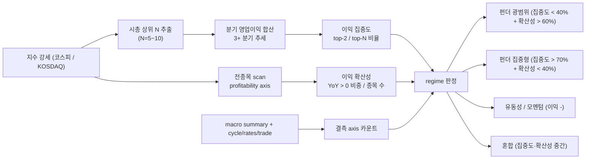

## 공개 호출 방식

```python
import dartlab
import polars as pl

top_codes = ["005930", "000660", "373220", "207940", "005380"]

flows = []
for code in top_codes:
    c = dartlab.Company(code)
    is_df = c.show("IS", freq="Q")
    period_cols = [col for col in is_df.columns if str(col)[:4].isdigit()]
    period_cols = sorted(period_cols, reverse=True)[:4]
    row = {"stockCode": code, "periods": period_cols}
    sales_row = is_df.filter(pl.col(is_df.columns[1]).str.contains("매출"))
    op_row = is_df.filter(pl.col(is_df.columns[1]).str.contains("영업이익"))
    for p in period_cols:
        if not sales_row.is_empty():
            row[f"sales_{p}"] = sales_row[p][0]
        if not op_row.is_empty():
            row[f"op_{p}"] = op_row[p][0]
    flows.append(row)

macro = {}
for axis in ["cycle", "rates", "trade", "liquidity", "summary"]:
    try:
        macro[axis] = dartlab.macro(axis=axis, market="KR")
    except Exception as exc:
        macro[axis] = {"error": str(exc)}

emit_result(
    table=flows,
    values={
        "topCount": len(top_codes),
        "macroAxesQueried": list(macro.keys()),
        "macroNullCount": sum(1 for v in macro.values() if v is None or (isinstance(v, dict) and not v)),
    },
    date="latest",
)
```

## 호출 동작 — 5 단 분석 구조

### 1. 결론 도출

*regime 판정* + *집중도 정량* + *확산성 정량* 한 문장 정량 결론.

좋은 결론 예시:
- "코스피 강세는 *반도체 집중 이익 장세 [conf:80]*. 시총 상위 5 합산 영업이익 97.7조 중 반도체 2 사 (삼성·SK하이닉스) 가 94.8조 = **97%**. 비반도체 3 사 (LG엔솔·삼성바이오·현대차) 합 2.9조. macro cycle = 확장·우호적 [conf:30] (rates/trade 결측), regime = *부분 펀더 + 반도체 주도* — 전 산업 동시 회복 X."

금지:
- "펀더 장세" 단정 시 집중도 비율 (예 - top-2 / top-N = X%) 명시 누락.
- 단일 분기 (예 - 2026Q1 만) 으로 regime 단정. 최소 3 분기 (예 - 2025Q3·Q4·2026Q1) 추세 동반.
- macro 결측 무시 — `currentRate=None` 같은 결측 솔직 인용.

### 2. 핵심 근거 수집

`requiredEvidence: skillRef + tableRef + valueRef + dateRef + executionRef` 필수.

- **skillRef**: `engines.macro` (cycle/rates/trade/liquidity/summary), `engines.scan` (전종목 이익 YoY 분포), `engines.company` (시총 상위 IS), `recipes.meta.screen.peerBenchmark` (산업 horizontal).
- **tableRef** (3+ 표):
  1. **시총 상위 N 분기 추세** — code · 매출 Q3·Q4·Q1 · 영업이익 Q3·Q4·Q1 · QoQ · YoY
  2. **이익 집중도** — top-2 / top-3 / top-5 합산 영업이익 vs 시장 전체 (또는 시총 상위 30) 비율
  3. **이익 확산성** — 전종목 영업이익 YoY > 0 비중, 영업이익률 > median 비중
  4. **매크로 axis** — cycle / rates / trade / liquidity 결과 + confidence + 결측 항목
- **valueRef**: 합산 매출·영업이익 · QoQ% · YoY% · 집중도 비율 · 확산성 비율.
- **dateRef**: 분기 기준 (예 - 2026Q1) · macro asOf · 비교 분기 (Q3·Q4).
- **executionRef**: macro EngineCall 실행 id · RunPython 가공 id.

도구 우선순위:
1. `EngineCall("macro", axis="summary", market="KR")` — 시장 종합
2. `EngineCall("macro", axis="cycle"/"rates"/"trade"/"liquidity")` — 4 axis
3. `EngineCall("Company.show", topic="IS", freq="Q")` — 시총 상위 N 각각
4. `EngineCall("scan", axis="profitability")` — 전종목 이익 분포
5. `RunPython` — 집중도·확산성 계산 + 매크로 결측 비중

### 3. 메커니즘 분석

regime 판정 = *이익 집중도 + 이익 확산성 + 매크로 신뢰도* 3 신호:



**regime 4 유형** (정량 임계):

| regime | 집중도 (top-2 / top-N) | 확산성 (YoY > 0 비중) | 매크로 confidence | 정의 |
|---|---|---|---|---|
| **펀더 광범위** | < 40% | > 60% | medium 이상 | 다수 종목 이익 회복 + 시장 광범위 |
| **펀더 집중형** | > 70% | < 40% | medium 이상 | 소수 (1~2) 산업 이익 폭증, 나머지 정체 |
| **유동성/모멘텀** | (이익 추세 무관) | 이익 감소 종목 다수 | high (유동성 우호) | 이익 약화 + 가격만 상승 |
| **혼합** | 40~70% | 40~60% | low~medium | 부분 펀더 + 부분 모멘텀 |

**임계 보조 (KR 시장 특성)**:
- 시총 가중 (KOSPI200 = 시총 상위 200) 자체가 *대형주 비중 큼* — top-5 가 시장 시총 30%+ 정상.
- 단일 산업 (반도체) sub-segment 1 위·2 위 합산이 시장 영업이익의 50%+ 면 "산업 집중형".
- macro axis 결측 비중 ≥ 50% → confidence low.

**확산성 보조 측정**:
- 전종목 영업이익 YoY > 0 비중 (예 - 2349 종목 중 1400 종 = 60%)
- 영업이익률 > 산업 median 비중
- 영업이익 절대값 증가 종목 수 / 분석 가능 종목 수

### 4. 반례·한계

- **Falsifier**: 시총 상위 N 중 이익 확인 가능 < 50% OR macro 4 axis 모두 결측 → regime 판정 *부분 펀더 [conf:30]* 이하.
- **시총 가중 vs 동일가중**: 코스피는 시총가중 → 상위 종목 영향 큼. 동일가중 인덱스 (KRX 동일가중) 와 다른 결론 가능.
- **base 효과**: 전분기 손실 → 이번 분기 흑자 = QoQ +∞%. 단발성 회복 vs 지속 추세 구분.
- **계절성**: 4 분기 (연말 일회성) vs 1 분기 (정상화) base 차이.
- **macro 결측**: cycle 만 결과 있고 rates/trade/liquidity 결측 시 *부분 confidence*.
- **인덱스 구성 변화**: M&A·신규 IPO·상장폐지로 상위 N 풀 변경. 전·후 비교 시 동일 풀 유지.
- **외화 매출 노출**: 환율 영향 큰 종목 (수출 80%+) 이익 = 환율 + 사업. 분리 필요.
- **세금·일회성**: 영업이익 vs 순이익 분리. 일회성 처분이익이 시총 상위에 몰리면 펀더로 오인.
- **시장 vs 종목 시점 차**: 분기 실적 발표 vs 주가 반영 시차 1~3 개월. 같은 시점 비교 권장.

### 5. 후속 모니터링

| 신호 | 임계 | 의미 / 조치 |
|---|---|---|
| 상위 2 사 합산 영업이익 | -10% QoQ | 펀더 집중형 약화 → regime 재평가 |
| 비상위 3 사 영업이익 | 흑자 전환 또는 +30% QoQ | 펀더 확산 신호 |
| 전종목 YoY > 0 비중 | ±10%p 이동 | 확산성 변동 |
| macro axis 결측 보강 | 4 axis 모두 비-null | confidence 재계산 |
| 인덱스 구성 변화 | M&A · IPO · 상장폐지 | 상위 N 풀 재구성 |
| 환율 변동 | USD/KRW ±5% | 외화 매출 종목 이익 재추정 |

## 대표 반환 형태

- `tableRef:regime:top_n_earnings_flow` — 시총 상위 N 분기 추세
- `tableRef:regime:concentration_breakdown` — top-2 / top-3 / top-N 비율
- `tableRef:regime:diffusion_stats` — 전종목 확산성 통계
- `valueRef:regime:concentration_pct` — 집중도 %
- `valueRef:regime:diffusion_pct` — 확산성 %
- `executionRef:macro:summary` — macro 종합 실행 id

## 연계 절차

- 상위 종목 peer 횡단 → `recipes.meta.screen.peerBenchmark`
- regime 판정 후 포트폴리오 재구성 → `recipes.meta.screen.portfolioConstruction`
- macro 변수 정량 임팩트 → `recipes.macro.scenarioSensitivityMatrix`
- 분기 변동성 의심 → `recipes.fundamental.quality.quarterlyAnomalyDetection`
- 매크로 사이클 깊이 → `engines.macro` axis="cycle" 또는 "summary"

재호출 트리거: "코스피 강세 펀더 vs 모멘텀", "시총 상위 이익 집중도", "전종목 확산성", "시장 regime 판정".

## 기본 검증

- 시총 상위 N ≥ 5 종.
- 분기 시계열 ≥ 3 분기.
- 집중도 + 확산성 둘 다 정량 (% 형태).
- macro axis ≥ 2 종 호출 + 결측 axis 명시.
- regime 판정 시 정량 임계 (집중도 X%, 확산성 Y%) 명시.

## AI 직접 사용 방식

1. `ReadSkill` 에서 사용자 질문과 `whenToUse`를 맞춰 본 recipe 선정.
2. 시총 상위 N 종이 명시되지 않으면 *시장 시총 상위 5~10* (사용자 시점 기준) 추정 명시.
3. 각 종목 EngineCall Company.show IS freq=Q 3+ 분기.
4. EngineCall macro 4 axis (cycle/rates/trade/liquidity).
5. RunPython 으로 집중도·확산성 계산.
6. regime 판정 + 정량 근거 + 매크로 결측 솔직 인용 + falsifier 한계 동반.
