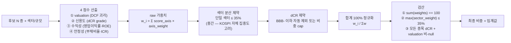

## 공개 호출 방식

```python
import dartlab
import polars as pl

candidates = ["005930", "005380", "105560", "017670", "005490"]

def safe(v, default=None):
    return v if v is not None else default

rows = []
for code in candidates:
    c = dartlab.Company(code)
    try:
        val = c.analysis(axis="valuation", sub="가치평가")
    except Exception:
        val = {}
    rel = (val or {}).get("relativeValuation") or {}
    pt = (val or {}).get("priceTarget") or {}
    dcf = (val or {}).get("dcfValuation") or {}
    try:
        cr = c.credit() if hasattr(c, "credit") else None
    except Exception:
        cr = None
    rows.append({
        "stockCode": code,
        "currentPrice": safe(dcf.get("currentPrice")),
        "PER": safe((rel.get("currentMultiples") or {}).get("PER")),
        "PBR": safe((rel.get("currentMultiples") or {}).get("PBR")),
        "dcfPerShare": safe(dcf.get("perShareValue")),
        "priceTargetWeighted": safe(pt.get("weightedTarget")),
        "upside": safe(pt.get("upside")),
        "signal": safe(pt.get("signal")),
        "dCR": (cr or {}).get("grade") if isinstance(cr, dict) else None,
    })

table = pl.DataFrame(rows)
emit_result(
    table=rows,
    values={
        "candidateCount": len(candidates),
        "nullValuationCount": sum(1 for r in rows if r["dcfPerShare"] is None),
        "nullCreditCount": sum(1 for r in rows if r["dCR"] is None),
    },
    date="latest",
)
```

## 호출 동작 — 5 단 분석 구조

답변은 5 단 (결론 / 핵심 근거 / 메커니즘 / 반례·한계 / 후속 모니터링) 매핑.

### 1. 결론 도출

*N 종목 비중 합 100%* + *섹터·factor·dCR 분산 종합* 한 문장 정량 결론.

좋은 결론 예시:
- "10억 5 종 — 005930 25% (2.5억) / 005380 20% (2억) / 105560 20% (2억) / 017670 20% (2억) / 005490 15% (1.5억). 합 100%. 섹터 5 분산 (반도체·자동차·금융·통신·소재), dCR 모두 A 이상 (AA·AA·A·AA+·AA+), DCF 괴리 큰 종목 (005930) 만 5%p 하향 적용."

금지:
- 비중 합이 99 또는 101 — 정확히 100 되도록 마지막 종목 잔여 처리 필수.
- 단일 섹터 50%+ 비중 — "분산" 단어 사용 금지.
- dCR null 또는 valuation null 종목 비중 부여 — *근거 부재* 표시 후 후보 풀에서 제외.

### 2. 핵심 근거 수집

`requiredEvidence: skillRef + tableRef + valueRef + dateRef` 필수.

- **skillRef**: `engines.analysis` (valuation), `engines.credit` (dCR), `engines.company` (재무 ratio), `recipes.meta.screen.peerBenchmark` (peer median).
- **tableRef** (3+ 표):
  1. 종목별 — code · 섹터 · 시총 · PER · PBR · DCF 적정주가 · dCR · 영업이익률
  2. 비중 — code · 비중 % · 금액 · 비중 근거 (3 점 — valuation 등급 · 신용도 등급 · 섹터 위치)
  3. 분산 — 섹터별 합산 비중 · factor 노출 (value / growth / quality / lowvol)
- **valueRef**: 각 종목의 currentPrice · PER · PBR · DCF perShare · dCR grade.
- **dateRef**: 재무 기준 분기 (예 — 2026Q1) · 가격 asOf.

도구 우선순위:
1. `EngineCall("Company.analysis", axis="valuation", sub="가치평가")` — N 종목 각각 (병렬 가능)
2. `EngineCall("credit", stockCode=...)` — dCR 등급
3. `CompareCompanies(stockCodes=candidates)` — 4 축 비교 표
4. `RunPython` — 비중 산출 알고리즘 + 합계 검산

### 3. 메커니즘 분석

비중 산출 = *4 점수 가중 합산* + *섹터 분산 제약* + *합계 100% 정규화*:



**4 점수 정의**:
- **valuation score** — DCF perShareValue vs currentPrice 괴리. -50% 이하 (저평가) = +2, -10% ~ -50% = +1, ±10% = 0, +10% 이상 (고평가) = -1
- **신용도 score** — AAA/AA+/AA/AA-/A+/A/A-/BBB+/BBB/BBB- 등급 매핑. AA 이상 = +2, A = +1, BBB+ ~ BBB = 0, BBB- 이하 = -2 (자동 제외 또는 5% cap)
- **수익성 score** — 영업이익률 산업 median ±σ 위치. +1σ 이상 = +2, +0.5σ = +1, ±0.5σ = 0, -0.5σ 이하 = -1
- **안정성 score** — 부채비율·ICR 종합. 부채비율 < 50% & ICR > 5 = +2, 부채비율 < 150% & ICR > 2 = +1, 부채비율 ≥ 200% 또는 ICR < 1 = -2

**섹터 분산 임계** (KR 시장 기준):
- 단일 섹터 ≤ 35% (시총 자체 집중도 고려, 25% 가 더 엄격)
- 동일 산업 sub-segment (예 - 반도체 메모리·비메모리) ≤ 50% 합산
- 무위험 자산 (현금·MMF) 비중 명시 권장 (시장 변동성 대응)

**리밸런싱 임계** (정적 비중이 아닌 동적 정의):
- 편차 ±5%p 이상 → 재조정
- 단일 종목 가격 -20% / +30% → 비중 재산정
- dCR 등급 한 단계 하향 → 비중 -5%p
- 분기 실적 발표 후 점수 변동 → 재평가

### 4. 반례·한계

- **Falsifier**: 후보 N 중 50%+ 가 valuation null 또는 dCR null → 본 절차 결론으로 사용 불가. 부재 명시 + 추가 데이터 확보 요구.
- **시총 집중**: KOSPI 상위 5 가 시장 시총 30%+ → 시총가중과 *factor 분산* 구분.
- **dCR 한계**: BBB- 이하 자동 제외하면 deep value 종목 (저평가 + 회복 가능) 누락. 매뉴얼 review 옵션 명시.
- **valuation 시점**: DCF 결과는 *가정 (WACC·g)* 민감. 같은 종목도 시점·가정 변경 시 결과 변동. *현 시점 baseline* 명시.
- **factor 노출 부재**: value/growth/momentum/quality/lowvol 5 factor 자동 분류 미지원 (외부 데이터 필요). *섹터 분산 + dCR + valuation* 3 축만 사용.
- **세금·수수료 미반영**: 비중 산출은 *총자산* 기준. 실 거래 시 거래세·수수료·세금 별도.
- **유동성 미반영**: 일평균 거래대금 작은 종목 (시총 1000 억 이하) 비중 ≥ 10% 시 매매 영향 명시 필요.

### 5. 후속 모니터링

| 신호 | 임계 | 조치 |
|---|---|---|
| 단일 종목 가격 | ±20% (분기 내) | 비중 재산정 + DCF 재평가 |
| 단일 섹터 비중 | ≥ 35% (price drift 후) | 리밸런싱 트리거 |
| dCR 등급 변동 | 한 단계 하향 | 비중 -5%p 또는 제외 |
| 분기 실적 발표 | 영업이익 ±20% surprise | 점수 재산출 → 비중 재계산 |
| 매크로 regime 변화 | regime shift (성장 → 침체) | factor 노출 재구성 |
| 신규 후보 출현 | DCF 괴리 -50% 이상 종목 | 후보 풀 추가 검토 |

## 대표 반환 형태

- `tableRef:portfolio:candidate_metrics` — 종목별 4 점수
- `tableRef:portfolio:weight_allocation` — 비중 + 금액 + 근거
- `tableRef:portfolio:sector_diversification` — 섹터·factor 노출
- `valueRef:portfolio:total_weight` — 비중 합 (100% 검산)
- `dateRef:portfolio:as_of` — 기준 시점

## 연계 절차

- peer 비교 깊이 → `recipes.meta.screen.peerBenchmark`
- 시장 regime 사전 점검 → `recipes.meta.screen.marketRegimeCheck`
- 종목별 valuation 깊이 → `recipes.fundamental.valuation.check`
- 분기 변동성 사전 진단 → `recipes.fundamental.quality.quarterlyAnomalyDetection`
- 후보 발굴 (compounder) → `recipes.meta.screen.compounderCandidates`

재호출 트리거: "10억 5 종 분산 포트폴리오", "섹터·신용도 종합 비중", "리밸런싱 임계 + 모니터링".

## 기본 검증

- 비중 합 == 100 (정확). 99 또는 101 검산 실패.
- max(sector_weight) ≤ 35.
- 모든 종목 dCR 비-null + valuation 비-null. null 종목 비중 부여 시 fail.
- 리밸런싱 임계 ≥ 4 종 명시 (가격·섹터·dCR·실적·매크로 중).

## AI 직접 사용 방식

1. `ReadSkill` 에서 사용자 질문과 `whenToUse`를 맞춰 본 recipe 선정.
2. 후보 N 종이 명시되지 않으면 `recipes.meta.screen.compounderCandidates` 또는 사용자 질문 안에서 직접 추출.
3. 각 종목 EngineCall valuation + credit 호출 → 4 점수 산출.
4. 비중 산출 + 섹터 검산 + 합계 100% 정규화 RunPython.
5. 답변에 *비중 표 + 섹터 분산 표 + 리밸런싱 임계 표* 3 종 필수.
6. `falsifier.description` — 50%+ null 시 반례 단락에 명시 + 결론 보류.
