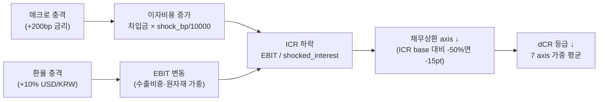

## 학술 근거

### Stress Testing 기본
- **CCAR (Comprehensive Capital Analysis and Review)** — 미연방 은행 감독 매크로 시나리오 기반 자본 충분성 평가. 본 recipe 는 단일 비금융기업 적용 변형.
- **EBA Stress Test** — 유럽은행감독청. baseline + adverse 두 path 비교 + 자본비율 시계열.
- **Standard & Poor's Macro Sensitivity** — 신용등급 회사 cycle 위치 + 매크로 베타 종합.

### 적용 한계
- 비금융기업 stress test 는 학계·실무 통합 표준 없음. 본 recipe 는 dCR 7 axis 별 elasticity → shocked metric → 등급 재계산 휴리스틱.
- 금리 충격 → 이자비용 ↑ → 영업이익 ↓ → 채무상환 axis 약화 + 현금흐름 axis 약화 → dCR 등급 ↓.
- 환율 충격 → 원자재·수출비중 별 EBIT 변동 → 사업안정성 axis + 채무상환 axis 동시 영향.

## 공개 호출 방식

```python
import dartlab
import polars as pl

target = "005930"
c = dartlab.Company(target)

def latest_period(df):
    if hasattr(df, "columns"):
        for col in df.columns:
            if str(col)[:4].isdigit():
                return str(col)
    return "latest"

def compact(obj):
    if isinstance(obj, pl.DataFrame):
        return {"type": "DataFrame", "rows": obj.height, "columns": obj.width}
    if isinstance(obj, dict):
        return {"type": "dict", "keys": list(obj.keys())[:8]}
    return {"type": type(obj).__name__}

repayment = c.credit("repayment")
leverage = c.credit("leverage")
liquidity = c.credit("liquidity")
macro_sensitivity = c.analysis("macroSensitivity")
rates = dartlab.macro("rates", market="KR")
bs = c.show("BS", freq="Y")

rate_shock_bp = 200
emit_result(
    table=[
        {"axis": "repayment", "base": compact(repayment), "stress": "+200bp funding cost"},
        {"axis": "leverage", "base": compact(leverage), "stress": "debt burden unchanged"},
        {"axis": "liquidity", "base": compact(liquidity), "stress": "short-term refinancing check"},
        {"axis": "macroSensitivity", "base": compact(macro_sensitivity), "stress": compact(rates)},
    ],
    values={"target": target, "rateShockBp": rate_shock_bp, "stressAxes": 4},
    date=latest_period(bs),
)
```

## 호출 동작 — 5 단 분석 구조

답변은 분석 5 단 (결론 / 근거 / 메커니즘 / 반례·한계 / 후속 모니터링) 매핑. 매크로 충격 (금리 +200bp 등) 시나리오 결과를 5 단으로 정리.

### 1. 결론 도출

회사의 *매크로 충격 후 신용등급 유지 가능성* + *가장 먼저 깨지는 axis* + *충격 강도 sensitivity* 를 한 문장 정량 결론으로.

좋은 결론 예시:
- "005930 (삼성전자) 금리 +200bp 충격 시 dCR-AA → AA 유지 (ICR 24.5×→15.8×, -8.7), binding axis 없음. +400bp 시도 AA → A 1 단 하락 (ICR 9.1×). 매크로 stress 내성 매우 강함."
- "BGF리테일 (027410) 금리 +200bp 시 dCR-BBB → BB 1 단 하락 (ICR 3.8×→2.1×, 채무상환 axis -15 점), binding axis = 채무상환. +300bp 시도 BB → B 추가 하락. 금리 stress 취약."

금지 — 단일 시나리오 (200bp) 결과만 단정. 100/200/300/400/500bp **5 강도 sensitivity curve** 동반 권장.

### 2. 핵심 근거 수집

`requiredEvidence: skillRef + tableRef + valueRef + dateRef` 4 종 명시.

- **skillRef**: `engines.credit.creditRisk` (base dCR + 7 axis), `engines.analysis.macroSensitivity` (금리·환율 elasticity), `engines.analysis.financing` (차입 만기·변동/고정 비율), `engines.macro` (시장 금리 곡선).
- **sourceRef**: DART 재무제표 — IS (operating_profit, interest_expense), BS (total_borrowings, total_liabilities, equity). 분기 또는 연간 freq 명시.
- **tableRef** (5 행 sensitivity curve): rateShockBp ∈ {0, 100, 200, 300, 400, 500} × {shockedGrade, shockedICR, icrDelta, bindingAxis}.
- **valueRef**: baseGrade · baseICR · shockedGrade@200bp · shockedICR@200bp · icrDelta · bindingAxis.
- **dateRef**: 재무 기준 분기 (예: 2024-12-31) + 매크로 asOf.

도구: `RunPython` (5 강도 batch 계산 + axis 점수 재계산 + 등급 mapping).

### 3. 메커니즘 분석

매크로 충격 → 신용등급 변동 *3 층 인과 경로*:



**3 종 충격 시나리오** 동시 흔들기 권장 (1 차원 충격 단정 금지):
- 금리 +200bp (default)
- 환율 +10% (수출/수입 비중 따라 EBIT 영향)
- 영업이익 -20% (cycle downturn 가정)

각 충격은 *독립* 또는 *복합* (정책 + 환율 동시) 시뮬레이션 가능. 복합이 더 conservative.

### 4. 반례·한계

- **Falsifier**: shocked dCR == base dCR for ≥ 90% of KOSPI200 → recipe 노이즈 (sensitivity 작동 안 함). pythonCheck 자동 검증.
- **휴리스틱 등급 mapping 한계**: score → 등급 변환이 간이 (85→AA, 75→A, ...). 실 dCR 알고리즘은 axis 가중 + 산업·규모 조정 더 복잡.
- **rate sensitivity 가정**: 차입금 *전체* 에 같은 충격 가정 — 실제는 *변동/고정 비율* + 만기 분포 차등. `engines.analysis.financing` 으로 비율 확인.
- **EBIT 일정 가정**: 1 차 wave 는 EBIT 고정 — 금리 ↑ 시 매출/마진 동시 압박 미반영. 2 차 wave (영업이익 -20%) 별도 시나리오 필수.
- **회복 경로 단정 금지**: 1 분기 충격으로 dCR 영구 하락 단정 X — *지속 vs 일시* 구분 (정책 lag 4~6 분기 후 정상화 가능).
- **한국 / 미국 시장 차이**:
  - 한국 — chaebol 그룹 보증·자금 지원 변수. 단일 회사 ICR 만으로 신용 단정 위험. 그룹 차원 stress 별도.
  - 미국 — 회사채 시장 발달 → 금리 충격 즉시 회사채 spread 반영. ICR 보다 spread-based stress 가 더 빠른 신호.
- **failureModes** — 회사 변동/고정 비율 무시 / binding axis 분석 없이 등급만 / macroSensitivity elasticity 신뢰도 차이 — 답변 작성 시 self-check.

### 5. 후속 모니터링

답변 끝에 모니터링 표:

| 지표 | 현재값 | 임계값 (재시뮬 시그널) | 리뷰 주기 |
|---|---|---|---|
| 시장 금리 (국고 3Y) | (macro.rates) | +50bp 추가 | 주간 |
| 회사 사채 yield | (gather) | spread +30bp | 월간 |
| 환율 USD/KRW | (macro.fx) | ±5% | 주간 |
| 분기 영업이익 | (IS) | YoY -10% | 분기 |
| 외부 KIS/NICE 신용등급 | (gather) | watch 진입 | 분기 |

연계 절차:
- shockedGrade 가 BB 이하면 → `recipes.credit.covenantStressTest` (차입약정 위반 점검)
- bindingAxis = 채무상환 → `engines.analysis.financing` 으로 차입 만기·변동/고정 비율
- bindingAxis = 사업안정성 → `recipes.credit.quantConsensus` (Altman / Beneish / Piotroski 합의)
- universe 확장 (KOSPI200 전수 stress) → `recipes.credit.distressCandidateScreen`

재호출 트리거: "삼성전자 금리 +200bp 충격에서 dCR 유지?", "현대차 환율 +10% 시 신용 axis 어디 깨지나", "HMM 영업이익 -20% 시 dCR 등급 변동".

## 대표 반환 형태

`pl.DataFrame` — 컬럼:
- `year : str`
- `rateShockBp : int` — 충격 강도 (default 200bp)
- `baseGrade : str` — 기본 dCR 등급
- `shockedGrade : str` — 충격 후 등급
- `baseICR : float` — 기본 Interest Coverage Ratio
- `shockedICR : float` — 충격 후 ICR
- `icrDelta : float` — ICR 변동
- `bindingAxis : str` — 가장 먼저 깨지는 axis 이름 (없으면 "(none)")

## 한계

- **휴리스틱 등급 mapping** — 본 recipe 의 score → 등급 변환은 간이. 실 dCR 알고리즘은 axis 가중 + 산업·규모 조정 더 복잡.
- **단일 시나리오 (200bp)** — 100/200/300 강도별 sensitivity curve 가 운영 가치. 본 recipe 는 단일 충격 prototype.
- **rate sensitivity** — 차입금 전체에 같은 충격 가정. 실제는 변동/고정 비율 + 만기 분포 별 영향 차등.
- **EBIT 일정 가정** — 실제 금리 ↑ 시 매출 / 마진 동시 압박. EBIT 변동 추가 시나리오 필요.

## 한국 / 미국 시장 차이

- **한국**: chaebol 그룹 보증 / 자금 지원 변수 — 단일 회사 ICR 만으로 신용 단정 위험. 그룹 차원 stress 별도.
- **미국**: 회사채 시장 발달 → 금리 충격 즉시 회사채 spread 반영. ICR 보다 spread-based stress 가 더 빠른 신호.

## 연계 절차

1. 본 recipe → shockedGrade + bindingAxis 산출.
2. shockedGrade 가 BB 이하로 떨어지면 `recipes.credit.covenantStressTest` 와 결합 — 차입약정 위반 가능성 함께 점검.
3. bindingAxis = 채무상환 → `engines.analysis.financing` 으로 차입 만기 schedule + 변동/고정 비율 상세.
4. bindingAxis = 사업안정성 → `recipes.credit.quantConsensus` 와 결합 — Altman / Beneish / Piotroski 합의 부도 신호 동반 검증.
5. 5 종목 실행 후 `recipes.credit.distressCandidateScreen` 으로 universe 확장.

## 기본 검증

- 5 시나리오 강도 (100/200/300/400/500bp) sensitivity curve 그려 — 등급 변동이 단조 (monotonic) 여야 정상.
- shockedGrade 가 baseGrade 와 항상 동일하면 sensitivity 가 작동하지 않음 — recipe 거짓 OK.
- shockedGrade 가 거의 모든 종목 6 등급 이상 폭락하면 mapping 휴리스틱 과민.
- 외부 신용평가 (KIS / NICE / S&P) 의 actual 매크로 stress 결과와 본 recipe 의 shockedGrade 추세 일치도 ≥ 60%.

## AI 직접 사용 방식

1. `ReadSkill` 에서 사용자 질문과 `whenToUse`를 맞춰 이 recipe를 고른다.
2. `GetSkillBody` 로 본문 전체를 읽고 `linkedSkills` 순서대로 먼저 필요한 엔진 skill을 확인한다.
3. `## 공개 호출 방식`의 첫 Python 블록을 target만 바꿔 `ValidateRecipe(..., capture=False)`로 smoke 실행한다.
4. 실행 결과의 `skillRef`, `tableRef`, `valueRef`, `dateRef`, `executionRef` 중 누락된 근거가 있으면 답변을 작성하지 말고 호출 또는 근거 요구를 보강한다.
5. 답변은 결론, 핵심 근거, 메커니즘, 반례·한계, 후속 모니터링 순서로 작성하고 `falsifier.description`이 있으면 반례 단락에서 반드시 확인한다.
