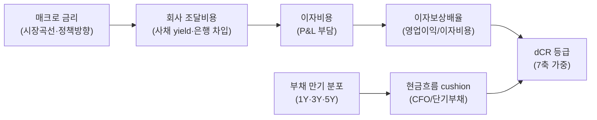

## 공개 호출 방식

```python
import dartlab
import polars as pl

target = "005930"
c = dartlab.Company(target)

def latest_period(df):
    if hasattr(df, "columns"):
        for col in df.columns:
            if str(col)[:4].isdigit():
                return str(col)
    return "latest"

def compact(obj):
    if isinstance(obj, pl.DataFrame):
        return {"type": "DataFrame", "rows": obj.height, "columns": obj.width}
    if isinstance(obj, dict):
        return {"type": "dict", "keys": list(obj.keys())[:8]}
    return {"type": type(obj).__name__}

repayment = c.credit("repayment")
leverage = c.credit("leverage")
liquidity = c.credit("liquidity")
credit_cashflow = c.credit("cashflow")
stability = c.analysis("stability")
cashflow = c.analysis("cashflow")
rates = dartlab.macro("rates", market="KR")
bs = c.show("BS", freq="Y")

emit_result(
    table=[
        {"axis": "repayment", "result": compact(repayment)},
        {"axis": "leverage", "result": compact(leverage)},
        {"axis": "liquidity", "result": compact(liquidity)},
        {"axis": "credit_cashflow", "result": compact(credit_cashflow)},
        {"axis": "stability", "result": compact(stability)},
        {"axis": "macro_rates", "result": compact(rates)},
    ],
    values={"target": target, "creditAxes": 4, "balanceSheetRows": bs.height},
    date=latest_period(bs),
)
```

## 호출 동작 — 5 단 분석 구조

답변은 시스템 프롬프트의 분석 5 단 (결론 / 근거 / 메커니즘 / 반례·한계 / 후속 모니터링) 과 1:1 매핑. dCR 등급 + 안정성·현금흐름 + 매크로 금리 3 축을 5 단으로 재배치한다.

### 1. 결론 도출

회사의 *신용 위험 종합 의견* 을 한 문장 정량 결론으로.

좋은 결론 예시:
- "005930 (삼성전자) 의 신용 위험은 dCR-AA (8.2/10), 7 축 중 안정성·현금흐름 우위 (각 9.1·9.4), 매크로 금리 +100bp 스트레스 시 ICR 24.5×→18.2× (여전히 투자등급 충분). 단기 만기 채무 (1 년 내) 1.2 조원·CFO 12 개월 분 6.4 조원 → 단기 상환 cushion 5.3 배."
- "027410 (BGF리테일) 의 신용 위험은 dCR-BBB (5.4/10), 7 축 중 부채 (3.2) + 이자보상 (4.1) 취약, 안정성 6.8·현금흐름 7.1 보통. 금리 +100bp 시 ICR 3.8×→2.6× — 투자등급 하한 근접."

금지 — dCR 등급 1 개로만 단정. "신용 양호/위험" 추상 평어. 반드시 *7 축 분해 + 매크로 sensitivity* 동반.

### 2. 핵심 근거 수집

`requiredEvidence: skillRef + tableRef + valueRef + dateRef` 4 종 모두 답변 인용.

- **skillRef**: `engines.credit` (dCR 산정 절차, detail=True 가중치 명시), `engines.analysis` (부채비율·ICR 분해), `engines.analysis` (CFO/부채 비율), `engines.macro` (금리 환경 + 시장 곡선).
- **sourceRef**: DART/EDGAR 공시 — 재무상태표 (부채 만기 분포) + 손익계산서 (이자비용·영업이익) + 현금흐름표 (CFO/FCF). 분기 보고서 asOf 명시.
- **tableRef** 4 개:
  1. credit.metricsHistory — dCR 등급·7 축 점수의 최근 8 분기 추이
  2. 안정성 표 — 부채비율·ICR·유동비율 (전년 동기 / 5 년 평균 대비)
  3. 현금흐름 표 — CFO·FCF·OCF/부채 (8 분기)
  4. 금리 시계열 — 시장금리 (국고 3 년·5 년) + 회사 조달금리 (사채 발행 yield)
- **valueRef** 5 종 이상: dCR grade · 7 축 점수 · 현재 ICR · OCF/부채 · 금리 +100bp 시나리오 후 ICR.
- **dateRef**: 분석 기준 분기 (예: 2025-12-31) + 매크로 금리 asOf.

도구: `EngineCall` (각 axis 단발) 또는 `RunPython` (5 호출 batch + 시나리오 stress 계산).

### 3. 메커니즘 분석

신용 위험의 *3 층 인과 경로* 를 mermaid graph LR + 단계별 bullet 로:



각 노드 라벨에 *수치 임계*:
- 매크로 금리 → 정책금리 ±25bp 가 조달비용 약 80% 반영 (T+1Q)
- 조달비용 → 이자비용 = 부채 × 평균 조달금리 (만기 분포로 가중)
- ICR < 2 → 신용 등급 하향 압력 (3 분기 연속 시 dCR 1 단 하락)
- CFO/단기부채 > 1.0 → 단기 상환 cushion OK, < 0.5 → 유동성 stress

분석 단락은 *왜 이 회사가 그 dCR 점수인지* 인과로 풀이 — 가중치만 나열 X.

### 4. 반례·한계

- **Falsifier**: dCR 등급 1 지표만으로 부도 위험 단정 금지 — 안정성·현금흐름·매크로 *3 종 모두 검토* 후에만 결론.
- **외부 등급 비교 금지**: dCR 과 S&P/Moody's 등급은 *정의·표본·시점* 모두 다름 — 1:1 매핑 안 됨. 외부 등급은 *참고 보조* 로만.
- **일회성 효과**: 분기 한 번의 영업이익 급감/급증 → ICR 급변 → dCR 단기 변동. **3~4 분기 추세** 동반 필수.
- **부채 만기 무시 금지**: 부채비율 200% 라도 만기 5+ 년 분산이면 안전, 70% 라도 1 년 내 50% 만기면 위험. 만기 분포 표 동반.
- **산업별 정상 수준**: 사이클성 (조선·건설) 부채비율 100% 이상이 정상, 비사이클성 (식음료) 50% 가 천정. 산업 peer 와 비교 필수.
- **failureModes** — 가중치 명시 누락 / 일회성 미보정 / 회사 조달금리 vs 시장금리 차이 무시 / 만기 분포 무시 / 산업 정상 수준 무시 — 답변 작성 시 self-check.

### 5. 후속 모니터링

답변 끝에 모니터링 지표 표:

| 지표 | 현재값 | 임계값 (하향 시그널) | 리뷰 주기 |
|---|---|---|---|
| dCR 종합 점수 | (credit.score) | 1 단 하락 | 분기 |
| ICR | (P&L) | < 2 (BBB), < 5 (A) | 분기 |
| CFO / 단기부채 | (CF·BS) | < 0.5 | 분기 |
| 회사 사채 yield | (gather) | +50bp 추가 | 월간 |
| 시장 금리 (국고 3Y) | (macro.rates) | +50bp | 주간 |

연계 절차:
- 매크로 금리 환경이 핵심이면 → `recipes.fundamental.credit.macroStress`
- 부채 covenant 검토면 → `recipes.fundamental.credit.covenantStressTest`
- 부채 만기·구조면 → `recipes.fundamental.credit.debtStructureAudit`
- 부실 위험 screening 면 → `recipes.fundamental.credit.distressFilter`

재호출 트리거: "삼성전자 dCR + 안정성 + 매크로", "신한지주 신용 위험 종합", "부채 만기 분포 + ICR + 시장금리".

## 대표 반환 형태

- `tableRef` 4 개 (credit metricsHistory + 안정성 표 + 현금흐름 표 + 금리 시계열).
- `valueRef` 5+ (dCR grade + 7 축 점수 + 현재 ICR + OCF/부채 + 금리 +100bp 시나리오 stress 결과).
- `dateRef` 1 개 (분석 기준 분기) + 매크로 asOf.
- `executionRef` (RunPython 결과 id).

## 연계 절차

1. `engines.company` — 회사 진입 (종목코드 → Company 인스턴스).
2. `engines.credit` — dCR 종합 + 7 축 (detail=True 가중치).
3. `engines.analysis` — 안정성 분해 (부채비율·ICR·유동비율).
4. `engines.analysis` — 현금흐름 quality (CFO·FCF·OCF/부채).
5. `engines.macro` — 금리 환경 + 회사 조달금리 elasticity.

## 기본 검증

- dCR 등급 명시 (예: `dCR-AA` / `dCR-BBB`) + 점수 (0~10) 함께.
- 시나리오 스트레스 (overrides 적용) 결과는 *가정 명시* (예: "+100bp 가정").
- 금리 +100bp 시 ICR 변동 추정 — *historic* 데이터 (실제 회사 사채 yield 추이) 뒷받침.
- 결론 단은 정량 (등급·점수·수치) — 추상 평어 단독 금지.

## AI 직접 사용 방식

1. `ReadSkill` 에서 사용자 질문과 `whenToUse`를 맞춰 이 recipe를 고른다.
2. `GetSkillBody` 로 본문 전체를 읽고 `linkedSkills` 순서대로 먼저 필요한 엔진 skill을 확인한다.
3. `## 공개 호출 방식`의 첫 Python 블록을 target만 바꿔 `ValidateRecipe(..., capture=False)`로 smoke 실행한다.
4. 실행 결과의 `skillRef`, `tableRef`, `valueRef`, `dateRef`, `executionRef` 중 누락된 근거가 있으면 답변을 작성하지 말고 호출 또는 근거 요구를 보강한다.
5. 답변은 결론, 핵심 근거, 메커니즘, 반례·한계, 후속 모니터링 순서로 작성하고 `falsifier.description`이 있으면 반례 단락에서 반드시 확인한다.
