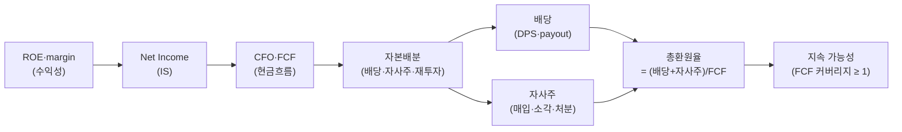

## 엔진 역할

본 skill 은 단일 axis 응용이 아니라 자본배분 + 현금흐름 + 수익성 세 축을 묶는 **recipe** 다. 각 axis 호출은 base SKILL `engines.analysis` 와 자식 응용 skill 에서 한다. 본 skill 은 묶음 절차와 판정 게이트만 제공한다.

## 연계 절차

1. engines.analysis — 자본배분 (배당 / 자사주 / 재투자 비중) 시계열 확인.
2. engines.analysis — OCF / FCF 시계열로 환원 재원의 지속 가능성 검산.
3. engines.analysis — ROE / 이익률 시계열로 환원 여력의 원천 확인.

## 판정 게이트

- 배당성향 / 총환원율 만으로 결론 짓지 않는다. 위 3 축 결과가 모두 일관되어야 "지속 가능" claim 을 허용.
- OCF &lt; 배당총액인 기간이 있으면 그 자체를 evidence 로 남기고 "차입 의존" flag.
- 자사주 매입은 일회성 / 반복 정책 구분 — 최근 3~5 기간의 빈도 + 평균 규모를 함께 본다.

## 기본 검증

claim 은 기간·metric·값을 포함하며 각 claim 은 해당 axis 결과의 `tableRef` / `valueRef` / `dateRef` 에 직접 묶는다. 본 recipe 는 base SKILL 또는 자식 axis skill 의 호출 방식·반환 키가 변경되면 같은 변경에서 갱신한다.

## 공개 호출 방식

```python
import dartlab

c = dartlab.Company("005930")

capital = c.analysis("financial", "자본배분")
cashflow = c.analysis("financial", "현금흐름")
profitability = c.analysis("financial", "수익성")
dividend = c.show("dividend")

emit_result({
    "target": "005930",
    "capitalAllocation": capital,
    "cashflow": cashflow,
    "profitability": profitability,
    "dividend": dividend,
})
```

## 호출 동작 — 5 단 분석 구조

답변은 분석 5 단 (결론 / 근거 / 메커니즘 / 반례·한계 / 후속 모니터링) 매핑. 자본배분 + 현금흐름 + 수익성 3 축을 5 단으로 재배치.

### 1. 결론 도출

회사의 *주주환원 정책 지속 가능성 + 총환원율·배당성향·FCF 커버리지* 한 문장 정량 결론.

좋은 결론 예시:
- "005930 (삼성전자) 5 년 총환원율 평균 78% (배당 52% + 자사주 매입 26%), 배당성향 30% (EPS 분모) / 26% (FCF 분모), FCF 커버리지 1.5× (FCF 평균 60 조원 vs 환원 40 조원). 자사주 매입 5 년 중 4 년 진행 (반복 정책 확인). **지속 가능성 강함** — 3 축 (자본배분·현금흐름·수익성) 모두 일관 우호."
- "OOOOOO 배당수익률 5.2% 매력적 단순 X — 배당성향 95% (EPS), FCF 커버리지 0.7× (5 년 중 3 년 OCF &lt; 배당총액 = 차입 의존). 자사주 매입 1 회 (일회성). **지속 가능성 취약** — 환원 수준 하향 가능."

금지 — 배당수익률만 보고 매력 단정. 반드시 **배당성향 (EPS·FCF 분모 양쪽) + FCF 커버리지 + 5 년 추세** 동반.

### 2. 핵심 근거 수집

`requiredEvidence: target + period + metric + table` 4 종 명시.

- **skillRef**: `engines.analysis` (자본배분 — 배당/자사주/재투자 비중), `engines.analysis` (OCF·FCF 5 년), `engines.analysis` (ROE·margin), `engines.scan` (산업 평균 환원율 비교).
- **sourceRef**: DART 공시 — CF (cash_flow_from_operations, FCF), 배당 (dividend) 시계열, BS (treasury stock = 자사주 잔액). `show("dividend")` raw DPS·payout·기준일.
- **tableRef** (3 표):
  1. 환원 시계열 — year × (DPS, 배당총액, 자사주 매입, 자사주 소각, 총환원율, FCF, FCF 커버리지)
  2. 자본배분 비중 — year × (배당%, 자사주%, 재투자%, 차입상환%)
  3. 산업 평균 비교 — 회사 vs 산업 (peer scan)
- **valueRef**: 5 년 평균 총환원율 · 5 년 평균 배당성향 (EPS) · 5 년 평균 배당성향 (FCF) · FCF 커버리지 · 자사주 소각 비중.
- **dateRef**: 5 회계년도 + 배당 기준일.

도구: `EngineCall` (3 axis) + `RunPython` (조합 + 산업 비교).

### 3. 메커니즘 분석

주주환원 = *3 축 일관 가능성* 인과 경로:



**자사주 종류 정확 구분** (답변에 명시):
- **매입 (treasury)** — 자금 사용, 시장 매입. 자사주로 BS 에 보유. *EPS 영구 제거 X* (재유통 가능).
- **소각 (cancel)** — 발행주식수 감소. **EPS 영구 제거 + BPS 상승**.
- **처분 (resell)** — 자사주 재매각. *희석 효과* (BPS↓).

같은 "자사주 매입 1 조원" 도 *후속 소각 여부* 가 본질. 답변에 *소각 비중* 명시.

**FCF 커버리지** 공식: FCF / (배당총액 + 자사주 매입). > 1 = 자체 현금으로 환원 가능 (지속). &lt; 1 = 차입 의존 (취약).

**5 년 시계열 필수**: 일회성 자사주 매입을 반복 정책으로 단정 X. 최근 3~5 기간 빈도·평균 규모 동반.

### 4. 반례·한계

- **Falsifier**: 근거 없는 배당 지속 가능성 단정 X — 3 축 (자본배분·현금흐름·수익성) 모두 일관 검증 후에만 "지속 가능" claim.
- **배당수익률 함정**: 주가 하락 시 배당수익률 spurious 상승. 분모 (주가) 안정 + 분자 (DPS) 안정 동시 검증.
- **배당성향 분모 명시**: EPS 분모 vs FCF 분모 결과 차이 큼 — *양쪽 모두 인용* 필수.
- **자사주 매입 vs 소각**: 매입만 + 소각 0 = quality 우위 약함. 소각 비중 50%+ 만 *진짜 환원*.
- **배당락 주가 영향**: adjusted vs raw 가격 명시. raw 가격으로 배당수익률 계산 시 배당락 후 잘못된 신호.
- **외국인 보유 변동**: 외국인 보유 ↑ → 배당 압력 ↑ (행동주의·ESG). 지속 가능성 신호 변동 가능.
- **차입 의존 flag**: OCF &lt; 배당총액 기간이 있으면 그 자체를 evidence 로 남기고 "차입 의존" flag.
- **failureModes** — payout 분모 / FCF 커버리지 / 자사주 종류 / 배당락 / 외국인 보유 — 답변 작성 시 self-check.

### 5. 후속 모니터링

답변 끝에 모니터링 표:

| 신호 | 현재값 | 5년 평균 | 임계값 (정책 변경 시그널) | 리뷰 주기 |
|---|---|---|---|---|
| 총환원율 | (계산) | (계산) | -10%p YoY | 분기 |
| 배당성향 (FCF 분모) | (계산) | (계산) | > 100% | 분기 |
| FCF 커버리지 | (계산) | (계산) | &lt; 1.0 | 분기 |
| 자사주 소각 비중 | (계산) | (계산) | 50% 이하 = treasury bloat | 연간 |
| 외국인 보유 비중 | (gather) | — | ±5%p | 분기 |
| 산업 평균 환원율 vs 회사 | (scan) | — | ±15%p 차이 | 연간 |

연계 절차:
- 배당 스트레스 테스트 → `recipes.fundamental.dividend.stressTest` (FCF -30% 시 환원 유지?)
- 배당 thesis 깊이 → `recipes.fundamental.dividend.thesis`
- 자본배분 종합 점수 → `recipes.fundamental.quality.capitalAllocationScorecard`
- 산업 환원 추세 → `engines.scan`
- ROE 동인 결합 → `recipes.fundamental.quality.dupontDriver`

재호출 트리거: "삼성전자 주주환원 정책", "배당성향 + 배당수익률 + 자사주 환원율", "자사주 매입 vs 소각 영향", "5 년 환원 추세 + FCF 커버리지".
