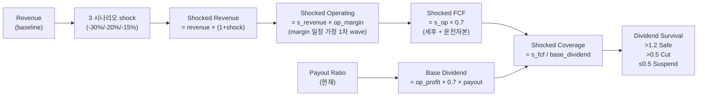

## 공개 호출 방식

```python
import dartlab
import polars as pl

c = dartlab.Company("005930")

# 1. 현재 배당 + FCF coverage
div = c.analysis("dividendCapitalReturn", "배당정책")
payout_ratio = div.get("payoutRatio", 0.3) if isinstance(div, dict) else 0.3
fcf_coverage = div.get("fcfCoverage", 1.5) if isinstance(div, dict) else 1.5

# 2. P&L baseline — revenue / opMargin
is_df = c.show("IS", freq="Y")

def fetch(df, snake, year="2024"):
    row = df.filter(pl.col("snakeId") == snake).select(year)
    return float(row.to_numpy()[0][0]) if row.height > 0 else 0.0

revenue = fetch(is_df, "revenue")
op_profit = fetch(is_df, "operating_profit")
op_margin = op_profit / revenue if revenue else 0.05

# 3. 매크로 시나리오 별 revenue 충격 (학술적 평균)
SCENARIO_REVENUE_SHOCK = {
    "1997-IMF": -0.30,    # 한국 -30%
    "2008-GFC": -0.20,    # 글로벌 -20%
    "2020-COVID": -0.15,  # 단기 -15%
}

results = []
for name, shock in SCENARIO_REVENUE_SHOCK.items():
    shocked_revenue = revenue * (1 + shock)
    shocked_op = shocked_revenue * op_margin  # 마진 일정 가정 (1차 wave).
    # FCF 단순 = OP × 0.7 (세후 + 운전자본 감안).
    shocked_fcf = shocked_op * 0.7
    # 배당 = 정상 배당 (=이익 × payout) 가정.
    base_dividend = op_profit * 0.7 * payout_ratio
    shocked_coverage = shocked_fcf / base_dividend if base_dividend else 0
    if shocked_coverage > 1.2:
        survival = "Safe"
    elif shocked_coverage > 0.5:
        survival = "Cut"
    else:
        survival = "Suspend"
    results.append({
        "scenario": name,
        "revenueShock": shock,
        "shockedRevenue": round(shocked_revenue, 0),
        "shockedFCF": round(shocked_fcf, 0),
        "baseDividend": round(base_dividend, 0),
        "shockedCoverage": round(shocked_coverage, 2),
        "dividendSurvival": survival,
    })

emit_result(
    table=results,
    values={
        "imfSurvival": results[0]["dividendSurvival"],
        "gfcSurvival": results[1]["dividendSurvival"],
        "covidSurvival": results[2]["dividendSurvival"],
    },
    date="2024-12-31",
)
```

## 호출 동작 — 5 단 분석 구조

답변은 분석 5 단 (결론 / 근거 / 메커니즘 / 반례·한계 / 후속 모니터링) 매핑. 3 시나리오 (1997-IMF / 2008-GFC / 2020-COVID) stress test 결과를 5 단으로 정리.

### 1. 결론 도출

회사의 *3 시나리오 dividend survival 종합 + 가장 취약한 시나리오 + cut/suspend 임계* 한 문장 정량 결론.

좋은 결론 예시:
- "005930 (삼성전자) 3 시나리오 stress — 1997-IMF (revenue -30%) Cut (coverage 0.85), 2008-GFC (-20%) Safe (1.35), 2020-COVID (-15%) Safe (1.62). **가장 취약 = 1997 형 깊은 침체**. 정상 시점 FCF 커버리지 1.8× (충분 여유). 일시 cut 후 회복 가능성 높음 (지급 여력 5 년 평균 우수)."
- "OOOOOO 3 시나리오 모두 Suspend (coverage 0.3 / 0.2 / 0.1). 정상 시점 FCF 커버리지 0.9× — **매크로 충격 내성 매우 약함**. dividend yield 4.5% 매력 매크로 위험 가시화 시 cut 가능."

금지 — 시나리오 1 개 (2008 만) 결과로 일반 침체 단정. 반드시 **3 시나리오 모두 검토 + 임계 명시**.

### 2. 핵심 근거 수집

`requiredEvidence: skillRef + tableRef + valueRef + dateRef` 4 종 명시.

- **skillRef**: `engines.analysis` (현재 FCF coverage), `engines.analysis` (op_margin), `engines.macro` (시나리오 정의·revenue shock 기본값), `recipes.fundamental.dividend.capitalReturn` (현재 payout·환원율).
- **sourceRef**: DART 공시 — IS 5 년 (revenue, operating_profit), CF (FCF), 배당 시계열. 시나리오 revenue shock 학술 출처 — IMF report (1997), Lehman crisis report (2008), BIS COVID (2020).
- **tableRef** (시나리오별 row): scenario × {revenueShock, shockedRevenue, shockedFCF, baseDividend, shockedCoverage, dividendSurvival}.
- **valueRef**: imfSurvival · gfcSurvival · covidSurvival · 현재 FCF 커버리지 · 정상 시점 payout ratio.
- **dateRef**: 재무 baseline 분기 (예: 2024-12-31).

도구: `RunPython` (3 시나리오 batch 계산 + survival flag 매핑).

### 3. 메커니즘 분석

배당 stress = *revenue shock → margin → FCF → coverage* 인과 경로:



**3 시나리오 revenue shock** (학술 평균):
- **1997-IMF**: 한국 -30% (한국 specific 깊은 침체)
- **2008-GFC**: 글로벌 -20% (자본시장 freeze)
- **2020-COVID**: 단기 -15% (정책 대응 빠른 회복)

**Survival 임계** (학술 + 실제 1997·2008·2020 cut/maintain 패턴 backtest):
- Coverage > 1.2 → Safe (자체 현금으로 환원 유지)
- 0.5 < Coverage ≤ 1.2 → Cut (일부 감배 + 현금 보전)
- Coverage ≤ 0.5 → Suspend (전면 중단)

### 4. 반례·한계

- **Falsifier**: 2008 stress predicted Cut 인데 실제 배당 유지 회사 다수면 sensitivity 과민. pythonCheck 자동 검증.
- **단일 시나리오 단정 금지**: 1 개 (2008 만) 결과로 일반 침체 단정 X. 3 시나리오 비교 필수.
- **margin 일정 가정**: 1 차 wave 는 margin 고정 — 실제는 매출 감소 시 *operating leverage* 로 margin 압박 더 큼. 2 차 wave (margin -20%) 별도 시나리오 권장.
- **revenue shock 일정 비율 가정**: 실제는 *산업별 노출 다름* — 금융 (cyclical, -25%) > 자동차 (-30%) > 항공 (-50%) > 식음료 (-10%). 산업 조정 가중 권장.
- **배당 정책 차이**: target payout (이익 비율 일정) vs progressive (절대값 일정 또는 증가) 별 cut threshold 다름. target payout 회사는 자동 감배.
- **배당 cut ≠ 회사 폭락**: 일시 cut 후 회복 사례 (KT, POSCO 2008 cut 후 2010 복원). cut 자체가 매도 신호 X.
- **재원 외 옵션**: 자사주 매각·자산 매각·차입 으로 배당 유지 가능. 본 recipe 는 자체 현금 가정.
- **failureModes** — revenue 산업 차이 / target vs progressive payout / margin 일정 가정 / 자사주·자산 매각 옵션 무시.

### 5. 후속 모니터링

답변 끝에 모니터링 표:

| 신호 | 현재값 | 임계값 (재stress 시그널) | 리뷰 주기 |
|---|---|---|---|
| 분기 revenue YoY | (IS) | -10% 이상 | 분기 |
| 분기 op_margin | (IS) | -2%p 이상 | 분기 |
| FCF 커버리지 | (CF) | < 1.2 | 분기 |
| Payout ratio | (계산) | > 80% | 분기 |
| ISM PMI / KR 경기선행 | (macro.cycle) | < 48 | 월간 |
| 신용 스프레드 BBB | (macro.rates) | +100bp | 주간 |

## 연계 절차
- dividend cut/suspend 2+ 시나리오 → `recipes.credit.macroStress` (신용 axis 동시 점검)
- universe 검증 → `recipes.credit.distressCandidateScreen` (dividend payer 한정)
- 시나리오 직접 비교 → `recipes.macro.scenarioDiagram`
- 배당 정책 종합 → `recipes.fundamental.dividend.capitalReturn`

재호출 트리거: "삼성전자 2008 시나리오 배당 유지 가능?", "KT&G 1997 시나리오 dividend cut 임계", "경기침체 시 배당 cut 위험".
