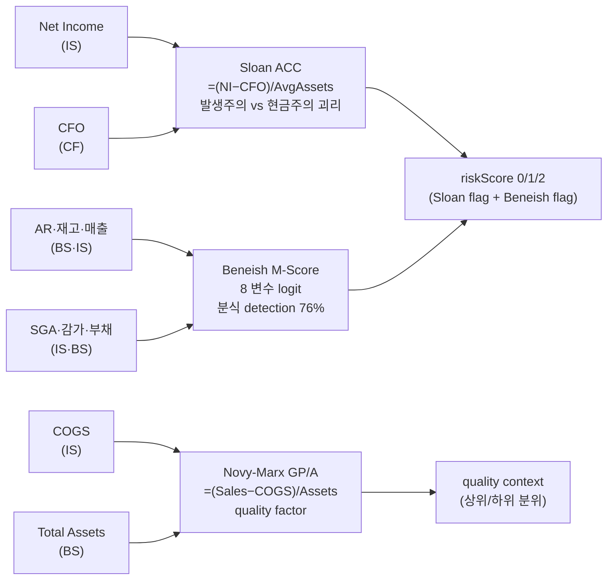

## 학술 근거

3 학술 framework 동시 적용 — 각 모델이 잡지 못하는 신호를 다른 모델이 보완.

### 1. Sloan Accruals (1996)
Richard Sloan, *"Do Stock Prices Fully Reflect Information in Accruals and Cash Flows about Future Earnings?"* (The Accounting Review):

- ACC = (NI − CFO) / Average Total Assets
- 발생액 (accruals) 이 큰 회사 → 미래 abnormal return 음(−). 1962-1991 백테스트 연 10%p 차이.
- 핵심 — 회계상 이익 ≠ 현금 이익. 차이가 클수록 미래 회귀 가능성.

### 2. Beneish M-Score (1999)
Daniel Beneish, *"The Detection of Earnings Manipulation"* (Financial Analysts Journal):

- M = −4.84 + 0.92·DSRI + 0.528·GMI + 0.404·AQI + 0.892·SGI + 0.115·DEPI − 0.172·SGAI − 0.327·LVGI + 4.679·TATA
- 8 변수 logit. M &gt; −1.78 = 분식 의심. 검증 76% 적중.
- Enron (1998 M-Score = +5.5) 분식 1 년 전 detection.

### 3. Novy-Marx GP/A (2013)
Robert Novy-Marx, *"The Other Side of Value: The Gross Profitability Premium"* (JFE):

- GP/A = (Sales − COGS) / Total Assets
- ROE·ROA 보다 강력 quality factor. 가치 (B/M) 와 음(-) 상관.

## L1 데이터 직접 계산

3 모델 모두 BS + IS + CF 의 raw snakeId 에서 직접 계산. analysis 의 `이익품질` axis 결과를 의존하지 않고 학술 공식 그대로 적용.

## 공개 호출 방식

```python
import dartlab
import polars as pl

target = "005930"
c = dartlab.Company(target)

def latest_period(df):
    if hasattr(df, "columns"):
        for col in df.columns:
            if str(col)[:4].isdigit():
                return str(col)
    return "latest"

def compact(obj):
    if isinstance(obj, pl.DataFrame):
        return {"type": "DataFrame", "rows": obj.height, "columns": obj.width}
    if isinstance(obj, dict):
        return {"type": "dict", "keys": list(obj.keys())[:8]}
    return {"type": type(obj).__name__}

earnings_quality = c.analysis("earningsQuality")
cashflow = c.analysis("cashflow")
stability = c.analysis("stability")
cf = c.show("CF", freq="Y")
is_df = c.show("IS", freq="Y")

emit_result(
    table=[
        {"test": "accrualQuality", "result": compact(earnings_quality)},
        {"test": "cashConversion", "result": compact(cashflow)},
        {"test": "balanceSheetSupport", "result": compact(stability)},
    ],
    values={"target": target, "triadChecks": 3, "cfRows": cf.height, "isRows": is_df.height},
    date=latest_period(cf),
)
```

## 호출 동작 — 5 단 분석 구조

답변은 분석 5 단 (결론 / 근거 / 메커니즘 / 반례·한계 / 후속 모니터링) 매핑. 3 모델 (Sloan · Beneish · Novy-Marx) 합의 결과를 5 단으로 정리.

### 1. 결론 도출

회사의 *이익 quality 종합 의견* + *3 모델 합의 점수 (0/1/2)* + *주도 위험 신호* 를 한 문장 정량 결론으로.

좋은 결론 예시:
- "005930 (삼성전자) 5 년 이익 quality riskScore 0/2 (Sloan ACC 0.03 < 0.10, Beneish M -2.41 < -1.78), GP/A 28.5% (상위 5%). **3 모델 합의 = 강한 quality 우위**, 분식 신호 부재. Novy-Marx 기준 산업 1 분위."
- "OOOOOO 5 년 riskScore 2/2 (Sloan ACC 0.18 > 0.10, Beneish M -0.52 > -1.78 분식 의심 zone), GP/A 4.2% (하위 20%). **3 모델 일관 위험 신호** — 정정공시·감사 의견 정밀 검증 필요."

금지 — 단일 모델 (Sloan 또는 Beneish 1 개) 신호로 분식 단정. 반드시 **3 모델 모두 검토 후 합의 점수 (0/1/2)** 인용.

### 2. 핵심 근거 수집

`requiredEvidence: skillRef + tableRef + valueRef + dateRef` 4 종 명시.

- **skillRef**: `engines.gather` 또는 `engines.company.show` (L1 raw BS/IS/CF). analysis axis (`이익품질`) 의존 X — *학술 공식 직접 적용* 이 본 recipe 핵심.
- **sourceRef**: DART 공시 — BS (total_assets, trade_receivables, ppe, current_assets, total_liabilities, long_term_debt), IS (sales, cost_of_sales, net_income, sga, depreciation), CF (cash_flow_from_operations). 연결재무 5 년 시계열.
- **tableRef** (5 년 시계열): year × {sloanAccruals, sloanFlag, beneishM, beneishFlag, gpa, gpaPct, riskScore}.
- **valueRef**: 최근년도 3 모델 점수 + 5 년 평균 + 산업 분위 (GP/A 산업 평균 대비).
- **dateRef**: 5 회계년도.

도구: `RunPython` (3 모델 batch 계산 + DataFrame join).

### 3. 메커니즘 분석

3 모델 *서로 다른 신호 포착* — 종합 합의가 강한 이유:



각 모델의 *해석* (답변 본문에 명시):
- **Sloan ACC > 0.10** → 발생주의 이익이 현금 이익을 크게 초과 — 미래 회귀 가능성. 1962-1991 백테스트 연 10%p 음 차이.
- **Beneish M > -1.78** → 8 변수 분식 의심 zone. Enron (1998 M=+5.5) 1 년 전 detection 성공.
- **Novy-Marx GP/A** → ROE·ROA 보다 강한 quality factor. 가치 (B/M) 와 음 상관.

**합의 게이트**: riskScore = 2 (Sloan + Beneish 모두 의심) 일 때만 *위험 claim*. 1/2 = watch list, 0/2 = clean.

### 4. 반례·한계

- **Falsifier**: 3 모델 중 1~2 만 의심해도 분식 단정 금지 — 3 모델 일관 (riskScore 2) 만 risk claim.
- **미국 임계의 KR 적용**: Sloan 임계 0.10, Beneish -1.78 모두 *미국 표본* 추정. KR chaebol 회계 특이성 (계열사 internal trading) 으로 DSRI·SGI false positive 가능.
- **분식 *예측* 아닌 *의심 신호***: 점수 통과해도 실제 분식 보장 X. 학술 통계 모델.
- **산업별 적합성**: 제조업 vs 서비스업 임계 분포 다름. Novy-Marx GP/A 는 `cost_of_sales` 분리 안 된 서비스업 (콘텐츠·플랫폼) 부적합.
- **snakeId 가용성**: Beneish 8 변수 모두 가용 필요. `sga`, `depreciation_expense`, `ppe` 일부 결손 → 0 처리 시 점수 왜곡. 가용 변수 수 답변에 명시.
- **연결 vs 별도**: chaebol 지주회사 별도재무 vs 연결재무 차이 큼. 본 recipe 연결 기준.
- **일회성 손익 (M&A)**: 영업외이익 큰 해 NI 급증 → Sloan ACC 단발 spike. 5 년 추세 동반.
- **SOX 효과**: 미국 SOX (2002) 이후 Beneish 검출률 다소 낮아짐 — 분식 회사도 8 변수 패턴 회피 학습.
- **failureModes** — 산업별 적합성 / Sloan 정의 (BS-OCF) 차이 / Beneish KR 매핑 / GP/A 분모 모호 / 합의 게이트 false negative — 답변 작성 시 self-check.

### 5. 후속 모니터링

답변 끝에 모니터링 표:

| 신호 | 현재값 | 5년 평균 | 임계값 | 리뷰 주기 |
|---|---|---|---|---|
| Sloan ACC | (계산) | (계산) | > 0.10 | 분기 |
| Beneish M | (계산) | (계산) | > -1.78 | 분기 |
| GP/A | (계산) | (계산) | 산업 하위 30% | 연간 |
| riskScore | 0/1/2 | (5년 평균) | 2 = watch | 분기 |
| 감사 의견 | (DART) | — | 한정·부적정 | 연간 |
| 정정공시 빈도 | (DART) | — | 3+/연 | 분기 |

연계 절차:
- riskScore = 2 → `recipes.fundamental.quality.workingCapitalQuality` (AR/Inv vs Sales gap)
- 분식 의심 → `c.disclosure(...)` 의 감사보고서 의견·정정공시 빈도
- GP/A 강 + Sloan 약 = 진짜 quality → `recipes.valuation.qualityValueScreen`
- 분식 + 부도 → `recipes.credit.distressDual` (강한 회피 신호)

재호출 트리거: "삼성전자 3 모델 합의 quality", "Sloan + Beneish + Novy-Marx 결합", "분식 의심 신호 (3 모델 일관)".

## 대표 반환 형태

`triad : pl.DataFrame` — 컬럼:
- `year : str`
- `sloanAccruals : float` — (NI−CFO)/AvgAssets
- `sloanFlag : bool` — &gt; 0.10 = 분식 의심
- `beneishM : float` — M-Score
- `beneishFlag : bool` — &gt; −1.78 = 분식 의심
- `gpa : float` — Gross Profit / Assets
- `gpaPct : float` — % 표기
- `riskScore : int` — 0 (안전), 1 (한 모델 의심), 2 (양 모델 의심)

## 한계

- **Sloan 임계 0.10** — 일반적 임계. 산업별 분포 다름 (제조업 &lt; 서비스업).
- **Beneish 8 변수 모두 가용** — `selling_general_admin_expenses`, `depreciation_expense`, `property_plant_equipment` 등 snakeId 일부 회사 결손 가능. fallback 으로 0 처리 시 점수 왜곡.
- **Novy-Marx GP/A** — `cost_of_sales` 분리 안 된 회사 (서비스업) 부적합. 매출원가 = 영업비용 가정 시 GP 과소.
- **3 모델 모두 미국 시장 학술 검증** — 한국 시장 직접 검증 부재. 한국 chaebol 회계 특이성으로 false positive 가능.
- **분식 *예측* 아닌 *의심 신호*** — 점수 통과해도 실제 분식 보장 X.

## 한국 / 미국 시장 차이

- **한국**: chaebol 계열사 internal trading 으로 매출/매출채권 변동 noise 큼 → DSRI · SGI 신뢰성 낮음. 별도재무 vs 연결재무 차이 큼.
- **미국**: 본 framework 의 본 시장. 8 변수 모두 신뢰성 높음. SOX (2002) 이후 Beneish 검출률 다소 낮아짐.

## 연계 절차

1. 본 recipe → 5 년 3 모델 점수 + riskScore.
2. riskScore = 2 (양 모델 의심) → `recipes.fundamental.quality.workingCapitalQuality` 의 AR/Inv vs Sales gap 점검.
3. 실제 분식 의심 회사 → 공시 (`c.disclosure(...)`) 의 감사보고서 의견·정정공시 빈도 검증.
4. GP/A 강 (상위 10%) + Sloan 약 (하위 30%) = 진짜 quality. `recipes.valuation.qualityValueScreen` 와 상호 검증.
5. `recipes.credit.distressDual` 와 결합 — 분식 의심 + 부도 위험 = 강한 회피 신호.

## 기본 검증

- 3 모델 점수 시계열 확인 — 단년도 점수 신뢰 X, 5 년 추세 봄.
- Sloan + Beneish 모두 의심 시 — 실제 분식 case study (대우조선·한진중공업 등) 와 비교.
- GP/A 변화 추세 — 안정 또는 상승 = quality 우월. 급락 = 산업 사이클 또는 경쟁 심화.
- "M-Score = +0.5 = 분식 확정" 단정 X — 의심 신호이지 결정 X.
- 학술 모델은 *통계적* 임. 단일 회사 단정 위험. 점수 + 정성 (감사 보고서·정정공시·CFO 교체 빈도) 결합.

## AI 직접 사용 방식

1. `ReadSkill` 에서 사용자 질문과 `whenToUse`를 맞춰 이 recipe를 고른다.
2. `GetSkillBody` 로 본문 전체를 읽고 `linkedSkills` 순서대로 먼저 필요한 엔진 skill을 확인한다.
3. `## 공개 호출 방식`의 첫 Python 블록을 target만 바꿔 `ValidateRecipe(..., capture=False)`로 smoke 실행한다.
4. 실행 결과의 `skillRef`, `tableRef`, `valueRef`, `dateRef`, `executionRef` 중 누락된 근거가 있으면 답변을 작성하지 말고 호출 또는 근거 요구를 보강한다.
5. 답변은 결론, 핵심 근거, 메커니즘, 반례·한계, 후속 모니터링 순서로 작성하고 `falsifier.description`이 있으면 반례 단락에서 반드시 확인한다.
