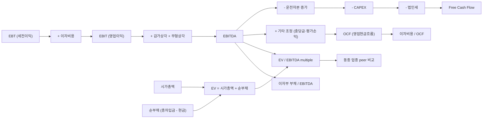

## 공개 호출 방식

```python
import dartlab
import polars as pl

target = "005300"  # 예 — 롯데칠성 (두산주류 인수)
c = dartlab.Company(target)

# 1. IS — EBIT / EBT / 이자비용 / 법인세
yis = c.show("IS", freq="Y")
qis = c.show("IS", freq="Q")

# 2. CF — 영업현금흐름 / CAPEX / 운전자본 변동 / 감가상각
ycf = c.show("CF", freq="Y")
qcf = c.show("CF", freq="Q")

# 3. BS — 이자부 부채 / 시가총액 → EV 산정 기초
ybs = c.show("BS", freq="Y")

# 4. 인수 공시 (가능 시)
merger_section = c.disclosure("인수") if hasattr(c, "disclosure") else None

ledger = {
    "is_years": yis.shape[1] - 2 if yis is not None else 0,
    "cf_loaded": ycf is not None,
    "bs_loaded": ybs is not None,
    "merger_section_loaded": merger_section is not None,
}

emit_result(
    table=[ledger],
    values={"target": target, "cfAvail": ycf is not None},
    date="latest",
)
```

## 호출 동작 — 5 단 분석 구조

### 1. 결론 도출

*4 단계 bridge + EV/EBITDA multiple + peer 비교 + CAPEX/운전자본 후 FCF + 부채상환 능력* 한 문장.

좋은 결론 예시:
- "두산주류 인수 케이스 — 인수가격 X 조원 / EBITDA Y = M 배 (EV/EBITDA). 동종 업종 (주류) 평균 K 배 대비 ±N%. EBT → EBIT → EBITDA bridge (감가상각 +Z%, 이자비용 +W%, 법인세 -L%). EBITDA → OCF bridge — 운전자본 증가 -P, CAPEX -Q → FCF = R. 인수가격 / FCF = S 년 회수. *EV/EBITDA 적정 [중간] + FCF 회수 [느림] [conf:65]*. counter — 시너지 가정 (매출 증가·원가 절감) 의 신뢰도 별도 검증."

금지:
- EBITDA 만 보고 multiple 적정 단정.
- CAPEX heavy 산업에서 EBITDA = 현금 단정.

### 2. 핵심 근거 수집

`requiredEvidence: skillRef + target + tableRef + valueRef + dateRef + sourceRef + executionRef` 필수.

- **target** (stockCode).
- **sourceRef**: 인수 공시 본문 (EV·EBITDA 산정 기초) + 사업보고서 CF 본문 + IS 본문.
- **tableRef** (4+ 표):
  1. **4 단계 bridge** — EBT (세전이익) → EBIT (영업이익) → EBITDA (감가상각·무형상각 추가) → OCF (운전자본·기타 조정)
  2. **EV/EBITDA multiple 시계열** — EV (시가총액 + 순부채) / EBITDA, 연도별 + 동종 peer 비교
  3. **FCF 분해** — EBITDA → CAPEX → 운전자본 변동 → 이자비용 → 법인세 → FCF
  4. **부채상환 능력** — 이자부 부채 / EBITDA 또는 이자부 부채 / OCF (DSCR proxy)
- **valueRef**: EBITDA 절대액, EV/EBITDA multiple, FCF, 부채/EBITDA 비율.
- **dateRef**: 사업연도·인수일·CAPEX 시점.
- **executionRef**: RunPython 으로 4 단계 bridge 계산.

### 3. 메커니즘 분석

EBITDA·OCF·인수가격 bridge = *4 단계 정의 차이 + EV/EBITDA multiple + FCF 분해 + 부채상환 능력 4 차원 동시 검증*:



**4 패턴 정량 신호**:

| 패턴 | 신호 | 임계 | 가중치 |
|---|---|---|---|
| **EV/EBITDA multiple** | peer 평균 대비 | ±50% 이상 차이 | high |
| **EBITDA → OCF 괴리** | OCF / EBITDA | < 70% (운전자본 누수 신호) | high |
| **CAPEX heavy** | CAPEX / EBITDA | ≥ 50% | high |
| **FCF 인수회수** | 인수가격 / 연 FCF | ≥ 15 년 | medium |
| **부채상환 위험** | 이자부 부채 / EBITDA | ≥ 5 배 | high |
| **이자보상비율** | EBIT / 이자비용 | < 2 배 | high |
| **일회성 이익 비중** | EBITDA 중 자산매각·평가이익 비중 | ≥ 20% | medium |

### 4. 반례·한계

- **Falsifier**: CF 본문 또는 EV 산정 기초 부재 시 적정성 판정 불가 — *Company.show CF 본문 + 인수 공시 EV 산정 본문 fetch 후 재호출*.
- **EBITDA ≠ 현금흐름**: EBITDA 는 *발생주의* 영업이익에 감가상각 추가 한 것이라 *현금* 이 아님. 운전자본 증가 (매출채권·재고) 시 EBITDA 크지만 OCF 작음. CAPEX heavy 산업 (조선·정유·통신) 에서는 EBITDA - CAPEX 가 사실상 0 인 경우 多.
- **시너지 가정 신뢰도**: 인수가격 산정 시 *합병 시너지* (매출 +X%·원가 -Y%) 를 EBITDA 에 미리 반영하면 multiple 이 인위적으로 낮아 보인다. 합병 전 standalone EBITDA 별도 검증.
- **정상화 (normalized) EBITDA**: 일회성 이익 (자산매각·평가이익·소송 환입) 을 *정상 EBITDA* 에 포함하면 과대평가. peer 비교 시 동일 정상화 기준 적용 의무.
- **peer 매칭 어려움**: 사업 mix 다양한 회사는 peer 매칭이 어려움 — *segment 별 EV/EBITDA* 산정 시도하거나 한계 메모.
- **금리·세율 환경**: EV/EBITDA multiple 은 *금리 환경* 에 민감 (저금리기 multiple 상승). 시점 다른 multiple 단순 비교 금지.
- **EBITDA 신뢰성 산업별 차이**: 서비스업·IT 는 CAPEX 낮아 EBITDA ≈ OCF 가까움. 제조업·통신·해운은 격차 큼.

### 5. 후속 모니터링

| 신호 | 임계 | 조치 |
|---|---|---|
| EV/EBITDA vs peer | ±50% 이상 | 적정성 [의심] |
| OCF / EBITDA | < 70% | 운전자본 누수 ledger |
| CAPEX / EBITDA | ≥ 50% | FCF 음전환 위험 |
| 부채 / EBITDA | ≥ 5 배 | LBO 위험 격상 |
| 이자보상비율 EBIT/이자 | < 2 배 | 부채상환 위험 격상 |
| 일회성 이익 비중 | ≥ 20% | 정상화 EBITDA 재계산 |
| 인수 후 EBITDA 추세 | -10% 이상 / 1Y | 시너지 가정 부정확 신호 |

## 대표 반환 형태

- `tableRef:ebitda:bridge_four_stage` — EBT→EBIT→EBITDA→OCF 4 단계 bridge
- `tableRef:ebitda:ev_ebitda_timeseries` — EV/EBITDA multiple 시계열
- `tableRef:ebitda:fcf_decomposition` — FCF 분해
- `tableRef:ebitda:debt_service` — 부채상환 능력
- `valueRef:ebitda:ev_ebitda_multiple` — 현재 multiple
- `valueRef:ebitda:ocf_ebitda_ratio` — OCF / EBITDA
- `valueRef:ebitda:fcf_payback_years` — FCF 회수 기간
- `valueRef:ebitda:debt_to_ebitda` — 부채 / EBITDA
- `sourceRef:ebitda:merger_id` — 인수 공시 id
- `executionRef:ebitda:calc_id` — RunPython 실행 id

## 연계 절차

- 매출 → 현금 bridge → `recipes.fundamental.quality.forensics.revenueToCashBridge`
- 합병비율 적정성 → `recipes.fundamental.quality.forensics.mergerRatioFairness`
- 영업권 손상 (시너지 가정 후행) → `recipes.fundamental.quality.forensics.goodwillImpairmentCheck`
- 현금흐름 ↔ 거버넌스 듀얼 신호 → `recipes.fundamental.quality.cashflowGovernanceDualSignal`
- valuation 깊이 → `recipes.fundamental.valuation.check`

재호출 트리거: "EBITDA 적정", "EV/EBITDA multiple", "인수가격 적정성", "EBITDA vs OCF 괴리", "LBO 부채상환".

## 기본 검증

- 4 단계 bridge (EBT/EBIT/EBITDA/OCF) 모두 계산.
- EV (시가총액 + 순부채) 산정 명시.
- 동종 업종 peer multiple 외부 비교.
- CAPEX / EBITDA + 운전자본 변동 동행.
- 부채 / EBITDA + 이자보상비율 동행.
- falsifier — 시너지 가정 신뢰도 별도 메모.

## AI 직접 사용 방식

1. `ReadSkill` 에서 EBITDA·EV multiple·인수가격 질문이면 본 recipe 선정.
2. target stockCode 확인.
3. `Company.show("IS", freq="Y")` + `Company.show("CF", freq="Y")` + `Company.show("BS", freq="Y")` 시계열.
4. `Company.disclosure("인수")` 또는 합병 공시 (EV·EBITDA 산정 본문).
5. RunPython 으로 4 단계 bridge + EV/EBITDA multiple + FCF 분해.
6. 동종 업종 peer multiple 외부 인용.
7. 답변에 *bridge ledger + multiple 시계열 + FCF 분해 + 부채상환 능력* 4 셋 + 반례·한계 필수.
