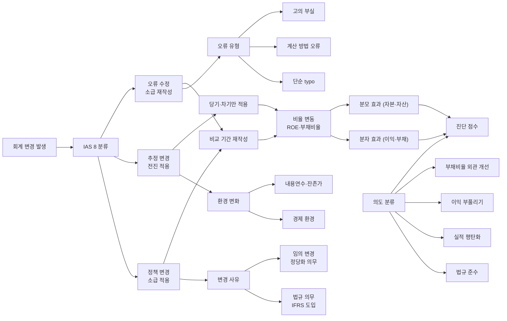

## 공개 호출 방식

AI 도구 실행 순서는 `EngineCall` 우선이다. `Company.show("IS"|"BS"|"CF")`, `Company.disclosure`, `scan.quality`, `scan.audit`, `scan.disclosureRisk` 는 엔진 호출로 근거를 먼저 확보한다. 아래 Python 블록은 확보한 L1/L1.5 근거를 `buildEvidenceForensicsMemo` 로 묶는 **RunPython fallback** 절차다 — 회계정책 변경 — 주석 본문 신호 추출.

```python
import dartlab
from dartlab.synth.evidenceForensics import buildEvidenceForensicsMemo

target = "005930"  # KOSPI/KOSDAQ 종목코드
c = dartlab.Company(target)

statements = {}
for topic in ("IS", "BS", "CF"):
    try:
        statements[topic] = c.show(topic, freq="Y")
    except TypeError:
        statements[topic] = c.show(topic)
    except Exception:
        pass

sectionTexts = {}
for topic in ("businessOverview", "riskFactors", "mdna", "notesDetail"):
    try:
        sectionTexts[topic] = str(c.show(topic))[:20000]
    except Exception:
        pass

try:
    disclosure = c.disclosure()
    events = disclosure.head(20).to_dicts() if hasattr(disclosure, "head") else list(disclosure)[:20]
except Exception:
    events = []

scanRows = []
for axis in ("quality", "audit", "disclosureRisk"):
    try:
        df = dartlab.scan(axis)
        rows = df.head(3).to_dicts() if hasattr(df, "head") else []
        for row in rows:
            row["axis"] = axis
        scanRows.extend(rows)
    except Exception:
        pass

memo = buildEvidenceForensicsMemo(
    target=target,
    market=str(getattr(c, "market", "KR")),
    companyName=str(getattr(c, "corpName", target)),
    statements=statements,
    sectionTexts=sectionTexts,
    events=events,
    scanRows=scanRows,
)

emit_result(
    table=memo["tables"]["noteSignalExtractor"],
    values={
        "target": target,
        "riskScore": memo["headline"].get("riskScore"),
        "signalCount": memo["headline"].get("signalCount"),
    },
    date=memo.get("asOf", "latest"),
    sources=memo["sources"],
)
```

## 호출 동작 — 5 단 분석 구조

### 1. 결론 도출

*정책 변경 시점 + IAS 8 분류 (정책·추정·오류) + 변경 전후 비율 변동 + IFRS 도입 효과 + 변경 의도* 한 문장.

좋은 결론 예시:
- "대한항공 케이스 — IFRS 16 리스 도입 (2019/01/01 의무 적용). 운용리스 (항공기·시설) 사용권자산 +X 조원 / 리스부채 +Y 조원. 부채비율 Z%p 악화 (분자 효과). 영업이익 -W (감가상각·이자 분리 효과). 정책 변경 분류 — IAS 8 의무 정책 변경 (법규). 소급 적용으로 비교 기간 (2018) 재작성 동행. *법규 의무 변경 [정상] + 부채비율 외관 악화 [분자 효과 분리 인식 필수] [conf:80]*. counter — IFRS 16 도입 자체는 *글로벌 항공사 동일 적용* 이라 경쟁 가치 평가 변화 X (재무 비율 만 변화)."

금지:
- 정책 변경 분류 (정책 vs 추정 vs 오류) 모호.
- 비율 변동 = 실적 변화 단정 시 *소급 적용·분자 분모 효과* 분리 누락.

### 2. 핵심 근거 수집

`requiredEvidence: skillRef + target + tableRef + valueRef + dateRef + sourceRef + executionRef` 필수.

- **target** (stockCode).
- **sourceRef**: 사업보고서 회계정책 섹션 + 정책 변경 공시 + 정정공시 본문 + IFRS 도입 시점 인용 (법규 보도).
- **tableRef** (4+ 표):
  1. **정책 변경 ledger** — 변경일 / 변경 사유 (IAS 8 분류 — 정책·추정·오류) / 변경 전 vs 후 회계 처리 / 소급 vs 전진 적용
  2. **변경 전후 비율 변동** — 변경 전 비율 (재작성 후 비교 기간 포함) vs 변경 후 / ROE·영업이익률·부채비율 / 분자 vs 분모 효과 분리
  3. **IFRS 도입 효과** — IFRS 16 (2019) / 17 (2023) / 9 (2018) / 18 (2027) 적용 시점 + 도입 효과 (자산·부채·자본·이익)
  4. **정책 변경 의도 매트릭스** — 법규 의무 / 경쟁사 동일 / 실적 평탄화 / 이익 부풀리기 / 부채비율 개선 / 법인세 절감
- **valueRef**: 변경 효과 절대액, 비율 변동 %p, 비교 기간 재작성 효과.
- **dateRef**: 변경일·IFRS 도입일·소급 적용 시점.
- **executionRef**: RunPython 으로 비율 분자/분모 효과 분해 + 시계열 회귀.

### 3. 메커니즘 분석

회계정책 변경 진단 = *분류 + 시점 + 효과 + 의도 4 차원 동시 검증*:



**5 패턴 정량 신호**:

| 패턴 | 신호 | 임계 | 가중치 |
|---|---|---|---|
| **정책 변경 빈도** | 5Y 내 정책 변경 횟수 | ≥ 3 회 | medium |
| **변경 효과 절대액** | 변경 효과 / 자본총계 | ≥ 10% | high |
| **IFRS 도입 동행** | IFRS 16/17/9/18 시점 vs 변경 시점 매칭 | 동행 | low (정상) |
| **임의 변경** | 법규 의무 X + 회사 자발 변경 | 발생 | high |
| **임의 변경 시점** | 분기·연도말 직전 변경 | 발생 | high |
| **오류 수정 횟수** | 5Y 내 소급 재작성 횟수 | ≥ 1 회 | medium |
| **오류 수정 핵심 숫자** | 재작성 매출·이익 변경 폭 | ≥ 5% | high |
| **경쟁사 동행** | 동종 업종 동일 변경 비율 | < 30% (회사 단독 변경) | medium |
| **변경 후 비율 개선** | 부채비율·이익률 즉시 개선 폭 | ≥ 10%p | high |

### 4. 반례·한계

- **Falsifier**: 사업보고서 회계정책 주석 또는 정정공시 본문 부재 시 분류·진단 불가 — *DART 사업보고서 주석 fetch + 정정공시 본문 fetch 후 재호출*.
- **IFRS 도입 의무 정상 변경**: IFRS 16 (리스 2019), IFRS 17 (보험 2023), IFRS 9 (금융상품 2018), IFRS 18 (재무제표 표시 2027 예정) 모두 *법규 의무* 변경. 도입 시점 동행 = 정상.
- **회계추정 변경 정상**: 감가상각 내용연수·매출채권 회수율·재고 평가·이연법인세자산 회수 가능성 등은 *경제 환경 변화* 시 정상 추정 변경. 단순 변경 = 부정 단정 금지.
- **오류 수정 분류**: 회계 오류 (IAS 8) = *과거 회계 의무 위반*. 다만 *단순 typo·첨부 누락·계산 오류* 도 다수 → 본문 변경 핵심 숫자 폭으로 분류 필요.
- **소급 vs 전진 적용 차이**: 정책 변경 = 소급 (비교 기간 재작성) / 추정 변경 = 전진 (당기·차기). 단순 비율 비교 시 *비교 기간 재작성 동행 인식* 필수.
- **분자 vs 분모 효과 분리**: IFRS 16 리스 도입 → 리스부채 +X (분자) + 자산 +X (분모) → 부채비율 *외관* 악화 (자본 분모 변화 적음). 실제 사업 가치 변화 X.
- **경쟁사 동행 정상**: 같은 시점에 동종 업종 회사들이 동일 정책 변경 시 *법규 또는 산업 관행* 변경. 회사 단독 변경 만 진단 신호.
- **회계 정책 vs 회계 추정 모호**: IAS 8 분류가 항상 명확하지 않음 — *경계 사례* (예 감가상각 정액→정률) 는 회사 판단. 회사 판단 인용 후 평가.

### 5. 후속 모니터링

| 신호 | 임계 | 조치 |
|---|---|---|
| 정책 변경 빈도 / 5Y | ≥ 3 회 | 정책 일관성 의심 |
| 변경 효과 / 자본 | ≥ 10% | 절대 효과 ledger |
| 임의 변경 발생 | 발생 | 정당화 의무 본문 확인 |
| 분기·연도말 직전 변경 | 발생 | 의도 의심 격상 |
| 오류 수정 핵심 숫자 변경 | ≥ 5% | 분식 가능성 격상 |
| 경쟁사 동행 비율 | < 30% | 회사 단독 변경 의심 |
| 변경 후 비율 개선 | ≥ 10%p | 의도 매트릭스 ledger |

## 대표 반환 형태

- `tableRef:policy:change_ledger` — 정책 변경 ledger
- `tableRef:policy:ratio_pre_post` — 변경 전후 비율 변동
- `tableRef:policy:ifrs_adoption` — IFRS 도입 효과
- `tableRef:policy:intent_matrix` — 정책 변경 의도 매트릭스
- `valueRef:policy:effect_to_equity` — 변경 효과 / 자본
- `valueRef:policy:ratio_delta` — 비율 변동 %p
- `valueRef:policy:correction_count` — 오류 수정 횟수
- `sourceRef:policy:note_id` — 회계정책 주석 id
- `sourceRef:policy:correction_id` — 정정공시 id
- `executionRef:policy:calc_id` — RunPython 실행 id

## 연계 절차

- 주석 신호 (회계정책 본문 동행) → `recipes.fundamental.quality.forensics.noteSignalExtractor`
- 사건 ↔ 재무 매칭 (변경 시점 ↔ 비율 변동) → `recipes.fundamental.quality.forensics.eventToStatementMatcher`
- 감사인 독립성 (변경 시점 ↔ 감사인 교체 동행) → `recipes.fundamental.quality.forensics.auditorIndependenceHistory`
- 공시 timing (정정공시 timing 동행) → `recipes.fundamental.quality.forensics.disclosureTimingAnomaly`

재호출 트리거: "회계정책 변경", "IFRS 16 17 9 도입", "회계추정 변경", "회계 오류 소급 재작성", "시가평가제도".

## 기본 검증

- 사업보고서 회계정책 주석 + 변경 공시 ≥ 1 종.
- IAS 8 분류 (정책 vs 추정 vs 오류) 명시.
- 소급 vs 전진 적용 차이 명시.
- 변경 전후 비율 분자 vs 분모 효과 분리.
- IFRS 도입 시점 (16/17/9/18) 명시.
- falsifier — 경쟁사 동행 반례 검토.

## AI 직접 사용 방식

1. `ReadSkill` 에서 회계정책·IFRS 도입·회계 오류 질문이면 본 recipe 선정.
2. target stockCode 확인.
3. `Company.show("IS","BS","CF","CIS",freq="Y")` 시계열.
4. `Company.show("회계정책")` 또는 사업보고서 주석 fetch.
5. `Company.disclosure("회계정책","정정")` 변경 timestamp.
6. `scan("disclosureRisk")` 횡단 비교.
7. RunPython 으로 비율 분자/분모 효과 분해 + 시계열 회귀.
8. 답변에 *정책 변경 ledger + 비율 변동 + IFRS 도입 효과 + 의도 매트릭스* 4 셋 + 반례·한계 필수.
