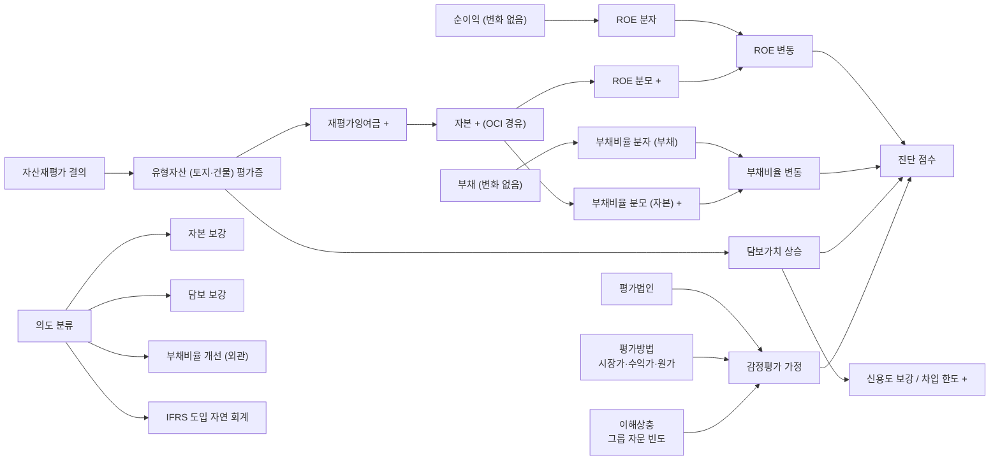

## 공개 호출 방식

```python
import dartlab
import polars as pl

target = "001040"  # 예 — CJ (자산재평가 적용 사례)
c = dartlab.Company(target)

# 1. BS — 유형자산·재평가잉여금 시계열
ybs = c.show("BS", freq="Y")
# 유형자산·재평가잉여금 행 추출
def find_rows(df, keywords: list[str]):
    pattern = "|".join(keywords)
    return df.filter(df[df.columns[1]].str.contains(pattern))

tangible_rows = find_rows(ybs, ["유형자산", "토지", "건물", "재평가잉여금"])

# 2. CIS — 기타포괄손익 (재평가잉여금 증감)
ycis = c.show("CIS", freq="Y") if hasattr(c, "show") else None

# 3. 감정평가·재평가 주석
revaluation_section = None
for topic in ("유형자산", "감정평가", "재평가"):
    try:
        sec = c.show(topic) if hasattr(c, "show") else None
        if sec is not None and hasattr(sec, "shape"):
            revaluation_section = sec
            break
    except Exception:
        continue

# 4. 자산재평가 결의 공시
reval_disc = c.disclosure("자산재평가") if hasattr(c, "disclosure") else None

ledger = {
    "tangible_rows": tangible_rows.height if tangible_rows is not None else 0,
    "cis_loaded": ycis is not None,
    "reval_section_loaded": revaluation_section is not None,
    "reval_disc_loaded": reval_disc is not None,
}

emit_result(
    table=[ledger],
    values={"target": target, "tangibleRows": tangible_rows.height if tangible_rows is not None else 0},
    date="latest",
)
```

## 호출 동작 — 5 단 분석 구조

### 1. 결론 도출

*재평가 시점 + 재평가증·재평가잉여금 시계열 + 비율 변동 (ROE/ROA/부채비율) + 의도 분류 + 감정평가 가정* 한 문장.

좋은 결론 예시:
- "CJ 케이스 — 재평가 시점 Y 년 토지·건물 평가증 X 조원 → 재평가잉여금 +Z 조원 (자본 +N%). 재평가 후 ROE 분모 효과 -M%p (자본 증가), 부채비율 -K%p (자본 분모 증가). 평가법인 A (그룹 자문 빈도 W 회) — 이해상충 가능성 [중간]. 재평가 의도 — 담보가치 상승 + 부채비율 개선 + 신용도 보강 [conf:60]. counter — 부동산 시장 실가치 상승 정상 회계 처리 가능성 별도. *재평가잉여금 = OCI (기타포괄손익) 이지 당기이익 아님* 명시."

금지:
- 재평가 자체를 game 단정 (정상 회계 처리 가능).
- ROE/부채비율 개선 = 진정성 단정 시 자본 분모 효과 누락.

### 2. 핵심 근거 수집

`requiredEvidence: skillRef + target + tableRef + valueRef + dateRef + sourceRef + executionRef` 필수.

- **target** (stockCode).
- **sourceRef**: 자산재평가 결의 공시 (DART 주요사항보고서) + 사업보고서 유형자산·감정평가 주석 + 평가법인·평가일·평가방법 본문.
- **tableRef** (4+ 표):
  1. **재평가 시점 ledger** — 재평가일 / 재평가 대상 자산 (토지·건물) / 평가법인 / 평가방법 (공정가 모델 vs 원가 모델)
  2. **재평가증·재평가잉여금 시계열** — 연도별 평가증 / 재평가잉여금 잔액 / 감액 (impairment) 발생 시점
  3. **비율 변동 ledger** — 재평가 전후 ROE / ROA / 부채비율 / 자본/자산 변동 (분자 vs 분모 효과 분리)
  4. **감정평가 가정** — 평가법인 / 평가일 / 평가방법 (시장가·수익가·원가) / 평가범위 / 이해상충 (그룹 자문 빈도)
- **valueRef**: 재평가증 절대액, 재평가잉여금 잔액, ROE 변동 %p, 부채비율 변동 %p.
- **dateRef**: 재평가일·평가일·재평가잉여금 인식일.
- **executionRef**: RunPython 으로 비율 시뮬레이션 + 분자 vs 분모 효과 분해.

### 3. 메커니즘 분석

자산재평가 진단 = *시점 + 증감 + 비율 변동 + 의도 + 감정평가 5 차원 동시 검증*:



**5 패턴 정량 신호**:

| 패턴 | 신호 | 임계 | 가중치 |
|---|---|---|---|
| **재평가 규모** | 재평가증 / 자산총계 | ≥ 10% | medium |
| **자본 보강 효과** | 재평가잉여금 / 자본총계 | ≥ 20% | high |
| **ROE 분모 효과** | 재평가 후 ROE 감소 / 자본 증가 비율 | 강한 분모 효과 신호 | high |
| **부채비율 개선** | 부채비율 (재평가 전 - 후) | ≥ 10%p 개선 | medium |
| **담보 효과** | 차입금 한도 증가 또는 신용등급 상향 동행 | 동행 발생 | medium |
| **평가법인 이해상충** | 평가법인 그룹 자문 history | 확인 발생 | medium |
| **재평가 빈도** | 동일 자산 재평가 횟수 / 5Y | ≥ 2 회 | medium |
| **재평가 후 감액** | 재평가증 후 5Y 내 감액 (impairment) | 발생 | high |

### 4. 반례·한계

- **Falsifier**: 유형자산 sections·재평가잉여금 본문 또는 자산재평가 공시 부재 시 진단 불가 — *Company.show BS 유형자산 sections + DART 자산재평가 결의 공시 fetch 후 재호출*.
- **부동산 실가치 상승 정상**: 한국 부동산 시장 (강남·여의도 등 도심) 실가치 상승은 *정상 회계 반영* 으로 보는 게 합리. 시장 평균 부동산 가격 상승률 비교 후 *시장 평균 대비 초과 증가* 만 진단 신호.
- **IFRS 도입 효과**: 2011 IFRS 도입 후 *공정가 모델* (revaluation model) vs *원가 모델* (cost model) 선택 가능. 공정가 모델 채택 자체는 정상 회계 정책 선택.
- **재평가잉여금 = OCI**: 재평가잉여금 증가는 *기타포괄손익 (OCI)* 이지 *당기손익* 아니다. ROE 분자 (당기이익) 에 영향 없음. ROE 변동은 *순수 분모 (자본) 효과*.
- **세무·법인세 효과 분리**: 재평가증은 *회계 잉여금* 이지 *세무상 손금* 아닌 경우 多. 법인세 영향 별도 평가.
- **감액 발생 시 정상**: 부동산 가격 하락 시 *감액* (impairment) 인식이 정상. 단순 감액 발생 = 회계 부실 단정 금지.
- **평가법인 자격**: 한국 감정평가사 자격은 *법정 자격* 이라 평가법인 변경 자체가 부정 신호 아님. 다만 *그룹 자문 빈도* 큰 평가법인은 이해상충 가능성 별도 메모.

### 5. 후속 모니터링

| 신호 | 임계 | 조치 |
|---|---|---|
| 재평가증 / 자산총계 | ≥ 10% | 진단 ledger 작성 |
| 재평가잉여금 / 자본 | ≥ 20% | 자본 보강 효과 |
| 부채비율 개선 폭 | ≥ 10%p | 분모 효과 분리 검증 |
| 평가법인 그룹 자문 history | 확인 | 이해상충 메모 |
| 재평가 빈도 / 5Y | ≥ 2 회 | 회계 정책 일관성 의심 |
| 재평가 후 5Y 내 감액 | 발생 | 평가 가정 부정확 신호 |
| 차입금 한도 증가 동행 | 동행 | 담보 효과 ledger |

## 대표 반환 형태

- `tableRef:reval:revaluation_timing` — 재평가 시점 ledger
- `tableRef:reval:surplus_timeseries` — 재평가잉여금 시계열
- `tableRef:reval:ratio_changes` — ROE/부채비율 변동
- `tableRef:reval:appraisal_assumptions` — 감정평가 가정
- `valueRef:reval:reval_to_assets` — 재평가증 / 자산총계
- `valueRef:reval:surplus_to_equity` — 재평가잉여금 / 자본
- `valueRef:reval:roe_delta` — ROE 변동 %p
- `valueRef:reval:debt_ratio_delta` — 부채비율 변동 %p
- `sourceRef:reval:disclosure_id` — 자산재평가 결의 공시 id
- `sourceRef:reval:note_id` — 사업보고서 유형자산 주석 id
- `executionRef:reval:calc_id` — RunPython 실행 id

## 연계 절차

- 주석 신호 (감정평가·재평가 동행) → `recipes.fundamental.quality.forensics.noteSignalExtractor`
- 계정 추적 (재평가잉여금 시계열) → `recipes.fundamental.quality.forensics.accountTraceLedger`
- 사건 ↔ 재무 매칭 (재평가 결의 ↔ BS 변화) → `recipes.fundamental.quality.forensics.eventToStatementMatcher`
- 영업권·자산 손상 (재평가 후 감액) → `recipes.fundamental.quality.forensics.goodwillImpairmentCheck`

재호출 트리거: "자산재평가", "재평가잉여금 증감", "토지 평가증 효과", "재평가 후 ROE", "공정가 모델 vs 원가 모델".

## 기본 검증

- BS 유형자산 시계열 ≥ 5 년.
- 재평가잉여금 잔액 시계열.
- 감정평가 가정 (평가법인·평가일·방법) 명시.
- ROE·부채비율 분자 vs 분모 효과 분리.
- 재평가잉여금 = OCI 임을 명시 (당기이익 아님).
- falsifier — 부동산 시장 실가치 상승 정상 회계 반례 메모.

## AI 직접 사용 방식

1. `ReadSkill` 에서 자산재평가·재평가잉여금·공정가 모델 질문이면 본 recipe 선정.
2. target stockCode 확인.
3. `Company.show("BS", freq="Y")` 유형자산·재평가잉여금 시계열.
4. `Company.show("CIS", freq="Y")` 기타포괄손익 변동.
5. `Company.disclosure("자산재평가")` 결의 timestamp + 본문.
6. `Company.show("유형자산")` 또는 사업보고서 감정평가 주석 fetch.
7. RunPython 으로 비율 분자/분모 효과 분해 + 시계열 회귀.
8. 답변에 *시점 ledger + 증감 시계열 + 비율 변동 + 의도 분류 + 감정평가 가정* 5 셋 + 반례·한계 필수.
