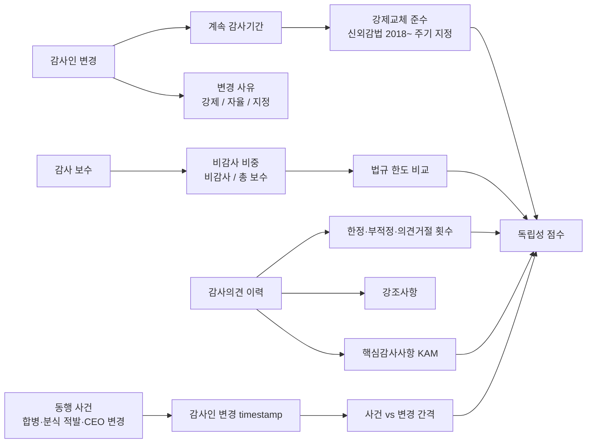

## 공개 호출 방식

```python
import dartlab
import polars as pl

target = "042660"  # 예 — 대우조선해양 (한화오션)
c = dartlab.Company(target)

# 1. 감사인 정보 — 사업보고서 감사 관련 섹션
auditor_info = None
for topic in ("감사인", "회계감사인", "감사보수", "감사관련"):
    try:
        sec = c.show(topic) if hasattr(c, "show") else None
        if sec is not None and hasattr(sec, "shape"):
            auditor_info = sec
            break
    except Exception:
        continue

# 2. 감사인 변경 공시
auditor_change = c.disclosure("감사인") if hasattr(c, "disclosure") else None

# 3. 감사의견·정정 공시
audit_opinion = c.disclosure("감사의견") if hasattr(c, "disclosure") else None

# 4. 횡단 — disclosureRisk
risk = dartlab.scan("disclosureRisk")
risk_row = risk.filter(pl.col("stockCode") == target) if "stockCode" in risk.columns else None

ledger = {
    "auditor_info_loaded": auditor_info is not None,
    "auditor_change_loaded": auditor_change is not None,
    "audit_opinion_loaded": audit_opinion is not None,
    "risk_row_loaded": risk_row is not None and risk_row.height > 0,
}

emit_result(
    table=[ledger],
    values={"target": target, "auditorAvail": auditor_info is not None},
    date="latest",
)
```

## 호출 동작 — 5 단 분석 구조

### 1. 결론 도출

*감사인 변경 시계열 + 강제교체 준수 + 비감사 보수 비중 + 감사의견 이력 + 동행 사건 timing* 한 문장.

좋은 결론 예시:
- "대우조선해양 케이스 — 감사인 시계열 (삼일 X 년 → 삼정 Y 년). 강제교체 의무 (신외감법 2018 ~ 주기적 지정제) 적용 시점부터 N 년 준수. 비감사 보수 / 총 보수 = Z% (법규 한도 W% 비교). 감사의견 — Y 년 한정의견 (감사 범위 제한 — 대우조선해양 사례). 핵심감사사항 (KAM) ≥ K 개 (복잡한 공사진행기준 회계). 분식 적발 시점 D vs 감사인 교체 시점 E (간격 M 분기). *감사인 독립성 [중간] + 한정의견 이력 [있음] [conf:60]*. counter — 분식 책임은 회사·감사 양쪽 분담 (4 권 회계와법 사례 참조)."

금지:
- 감사인 변경 단일 신호만으로 부정 단정.
- 강제교체 적용 시점 (신외감법 2018) 미명시.

### 2. 핵심 근거 수집

`requiredEvidence: skillRef + target + tableRef + valueRef + dateRef + sourceRef + executionRef` 필수.

- **target** (stockCode).
- **sourceRef**: 사업보고서 감사 섹션 (감사인명·감사보수·비감사 보수) + 감사인 변경 공시 + 감사보고서 (의견·강조사항·KAM).
- **tableRef** (4+ 표):
  1. **감사인 변경 시계열** — 회계법인명 / 시작 사업연도 / 종료 사업연도 / 계속 감사기간 / 변경 사유 (강제교체 / 자율 / 지정)
  2. **감사 보수 시계열** — 감사보수 / 비감사 보수 / 비감사 비중 / 법규 한도 비교
  3. **감사의견 이력** — 사업연도별 의견 (적정 / 한정 / 부적정 / 의견거절) + 강조사항 + 핵심감사사항 (KAM) 개수·주제
  4. **동행 사건 timing** — 감사인 변경 timestamp ↔ 합병·분식 적발·구조조정·CEO 변경 시점
- **valueRef**: 계속 감사기간 (연), 비감사 보수 비중 %, 한정의견 발생 횟수, KAM 개수.
- **dateRef**: 감사인 변경일·감사의견 발표일·동행 사건일.
- **executionRef**: RunPython 으로 변경 시계열 + 동행 timing 회귀.

### 3. 메커니즘 분석

감사인 독립성 진단 = *변경 시계열 + 강제교체 준수 + 비감사 보수 비중 + 감사의견 이력 + 동행 사건 timing 5 차원 동시 검증*:



**5 패턴 정량 신호**:

| 패턴 | 신호 | 임계 | 가중치 |
|---|---|---|---|
| **계속 감사기간** | 동일 회계법인 연속 감사 | ≥ 9 년 (강제교체 전 + 친밀도 위험) | medium |
| **강제교체 준수** | 신외감법 2018~ 주기적 지정제 위반 | 발생 | high |
| **비감사 보수** | 비감사 / 총 보수 | ≥ 50% | high |
| **한정의견** | 사업연도별 한정·부적정·의견거절 | 1 회 이상 / 10Y | high |
| **KAM 다수** | 핵심감사사항 개수 | ≥ 5 개 / 사업연도 | medium |
| **동행 사건** | 합병·분식 적발 D-3 ~ D+12M 내 감사인 변경 | 발생 | high |
| **담당 파트너 변경 빈도** | 담당 파트너 변경 (법인 동일) | 매년 변경 | low |

### 4. 반례·한계

- **Falsifier**: 감사인 정보 또는 감사의견 본문 부재 시 독립성 판정 불가 — *DART 사업보고서 감사 섹션 + 감사인 변경 공시 fetch 후 재호출*.
- **강제교체 정상 변경**: 신외감법 (2018 ~) 주기적 지정제 도입 후 *강제 변경* 이 정상 패턴이 되어 단순 변경 빈도만으로 부정 단정 금지. *변경 사유* (강제 / 자율 / 지정) 분류 필수.
- **감사 범위 제한 한정의견**: 한정의견 사유가 *회사 회계 부실* 이 아닌 *해외 자회사 자료 미입수* 등 *감사 범위 제한* 인 경우 회사 책임 한정. 의견 본문 사유 인용 필수.
- **비감사 보수 정상 영업**: 세무·내부통제 자문 등 정상 영업 가능. 다만 *법규 한도* (외부감사법 9 조의 4) 와 *친밀도 위험* 동행 평가.
- **KAM 도입 효과**: 핵심감사사항 (KAM) 은 2017 부터 의무 도입 → 단순 개수만으로 부정 단정 금지. 회사 사업 구조 복잡도 동행 평가.
- **회계법인 분쟁 시점**: 회계법인이 *분식 책임* 으로 처벌받은 경우라도 회사 측 책임이 별도. 책임 비중은 별도 법적 판단.
- **담당 파트너 변경**: 회계법인은 동일하지만 *담당 파트너* 가 매년 바뀌면 *법인 차원* 친밀도 신호는 약해진다. 다만 사업보고서가 *파트너명* 까지 다 공시하지 않음.

### 5. 후속 모니터링

| 신호 | 임계 | 조치 |
|---|---|---|
| 계속 감사기간 | ≥ 9 년 (강제교체 전) | 친밀도 위험 ledger |
| 강제교체 준수 위반 | 발생 | 즉시 격상 |
| 비감사 보수 비중 | ≥ 50% | 독립성 [약함] |
| 한정·부적정 의견 | 1 회 이상 / 10Y | 사유 본문 인용 |
| KAM 개수 | ≥ 5 개 | 사업 복잡도 동행 평가 |
| 동행 사건 (합병·분식) | D-3 ~ D+12M | timing 매칭 ledger |
| 감사보수 vs 매출 비율 | 동종 업종 평균 대비 | 외부 비교 메모 |

## 대표 반환 형태

- `tableRef:auditor:change_timeseries` — 감사인 변경 시계열
- `tableRef:auditor:fee_timeseries` — 감사 보수 시계열
- `tableRef:auditor:opinion_history` — 감사의견 이력
- `tableRef:auditor:event_timing` — 동행 사건 timing
- `valueRef:auditor:tenure_years` — 계속 감사기간 (연)
- `valueRef:auditor:nonaudit_ratio` — 비감사 보수 비중
- `valueRef:auditor:qualified_count` — 한정·부적정 의견 횟수
- `valueRef:auditor:kam_count` — KAM 개수
- `sourceRef:auditor:report_id` — 사업보고서 id
- `sourceRef:auditor:change_disclosure_id` — 감사인 변경 공시 id
- `executionRef:auditor:calc_id` — RunPython 실행 id

## 연계 절차

- 주석 신호 (계속기업·강조사항 동행) → `recipes.fundamental.quality.forensics.noteSignalExtractor`
- 공시 timing (감사의견 정정 동행) → `recipes.fundamental.quality.forensics.disclosureTimingAnomaly`
- 빅 배스 (감사인 변경 후 손상 인식) → `recipes.fundamental.quality.forensics.bigBathDetection`
- 사건 ↔ 재무 매칭 → `recipes.fundamental.quality.forensics.eventToStatementMatcher`

재호출 트리거: "감사인 변경", "계속 감사기간", "강제교체", "한정의견 이력", "비감사 보수 비중", "회계감사인 독립성".

## 기본 검증

- 감사인 시계열 ≥ 5 년.
- 강제교체 적용 시점 (신외감법 2018) 명시.
- 비감사 보수 비중 + 법규 한도 비교.
- 감사의견 이력 (적정 / 한정 / 부적정 / 의견거절) 분류.
- 동행 사건 timing 매칭.
- falsifier — 사업보고서 감사 섹션 부재 시 판정 보류.

## AI 직접 사용 방식

1. `ReadSkill` 에서 감사인·감사의견 질문이면 본 recipe 선정.
2. target stockCode 확인.
3. `Company.show("감사인")` 또는 사업보고서 감사 섹션 fetch.
4. `Company.disclosure("감사인")` 변경 timestamp + 사유.
5. `Company.disclosure("감사의견")` 의견·강조사항·KAM.
6. `scan("disclosureRisk")` 횡단 비교.
7. RunPython 으로 시계열 + 동행 timing 계산.
8. 답변에 *감사인 변경 + 보수 비중 + 의견 이력 + 동행 사건 timing* 4 셋 + 반례·한계 필수.
