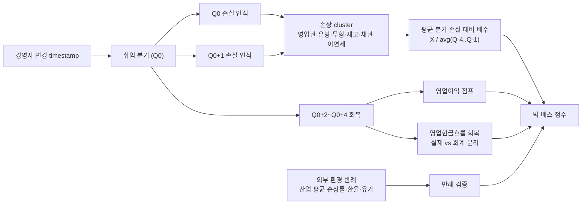

## 공개 호출 방식

```python
import dartlab
import polars as pl

target = "009540"  # 예 — 현대중공업
c = dartlab.Company(target)

# 1. 분기 IS — 일회성 손실 시계열 (영업외비용·기타비용·법인세 후 손익)
qis = c.show("IS", freq="Q")
yis = c.show("IS", freq="Y")

# 2. BS — 충당부채·이연법인세·영업권 잔액 시계열
qbs = c.show("BS", freq="Q")

# 3. 경영자 변경 공시 — timestamp 추출
exec_changes = c.disclosure("임원변동") if hasattr(c, "disclosure") else None

# 4. 손상차손·구조조정 본문 (가능 시)
impair_section = None
for topic in ("손상차손", "구조조정", "충당부채"):
    try:
        sec = c.show(topic) if hasattr(c, "show") else None
        if sec is not None:
            impair_section = sec
            break
    except Exception:
        continue

# 5. 빅 배스 ledger — IS / BS 매칭
bath_ledger = {
    "qis_quarters": qis.shape[1] - 2 if qis is not None else 0,
    "exec_changes_loaded": exec_changes is not None,
    "impair_section_loaded": impair_section is not None,
}

emit_result(
    table=[bath_ledger],
    values={
        "target": target,
        "execChangeLoaded": exec_changes is not None,
    },
    date="latest",
)
```

## 호출 동작 — 5 단 분석 구조

### 1. 결론 도출

*일회성 손실 분기 + 경영자 변경 timestamp + 차기 분기 회복 + 손상 cluster 동행* 한 문장.

좋은 결론 예시:
- "현대중공업 케이스 — 신임 사장 취임 D+Y 분기 손상차손 X 조원 (전년 평균 분기 손실의 N 배) + 구조조정 충당금 동시 인식. 차기 2~3 분기 인위적 회복 (영업이익 +Z% 점프) 동행. *빅 배스 패턴 [conf:70]*. counter — 조선 다운사이클 동시 발생 (산업 평균 손상률 W%) 으로 외부 환경 기여도 일부 인정. *경영자 의도 vs 산업 침체 분리 어려움* 한계 메모."

금지:
- 신임 경영자 단일 신호만으로 빅 배스 단정.
- 차기 분기 회복 = 인위적 단정 시 영업현금흐름 회복 동행 미확인.

### 2. 핵심 근거 수집

`requiredEvidence: skillRef + target + tableRef + valueRef + dateRef + sourceRef + executionRef` 필수.

- **target** (stockCode).
- **sourceRef**: 경영자 변경 공시 (DART 임원변동·주요사항보고) / 손상차손 주석 (감사보고서) / 합병·구조조정 공시.
- **tableRef** (4+ 표):
  1. **분기 일회성 손실 시계열** — 분기별 영업외비용 (손상차손·구조조정 비용·이연법인세 손상·재고·채권 손상)
  2. **경영자 변경 timing** — CEO·CFO 교체일·취임일 / 동일 분기 손실 인식 여부 / 직후 1~2 분기 패턴
  3. **손상 cluster 매트릭스** — 영업권·유형자산·무형자산·재고·매출채권·이연법인세자산 동시 인식 여부
  4. **차기 분기 회복 ledger** — 직후 2~4 분기 영업이익 / 영업현금흐름 회복 vs 평균 ratio
- **valueRef**: 일회성 손실 절대액, 평균 분기 손실 대비 배수, 차기 분기 회복 폭.
- **dateRef**: 경영자 취임일·손상 인식일·합병일·차기 분기 발표일.
- **executionRef**: RunPython 으로 손상 cluster + 회복 회귀 계산.

### 3. 메커니즘 분석

빅 배스 진단 = *경영자 변경 + 손상 cluster + 차기 회복 + 외부 환경 반례 4 차원 동시 검증*:



**6 패턴 정량 신호**:

| 패턴 | 신호 | 임계 | 가중치 |
|---|---|---|---|
| **경영자 변경 timing** | CEO·CFO 취임 분기 (Q0) 손실 인식 | Q0 또는 Q0+1 분기 발생 | high |
| **손상 cluster** | 동시 손상 항목 종류 | ≥ 3 종 (영업권·유형·재고 등) | high |
| **손실 배수** | Q0 손실 / 평균 분기 손실 (Q-8 ~ Q-1) | ≥ 5 배 | high |
| **차기 회복** | Q0+2~Q0+4 영업이익 점프 | 평균 분기 +30% 이상 | medium |
| **회복 진정성** | 영업현금흐름 (OCF) 회복 vs 영업이익 회복 | OCF 회복 < 영업이익 회복 → 회계 회복 신호 | high |
| **외부 환경 반례** | 동종 업종 평균 손상률 | 회사 손상률 / 업종 평균 ≥ 2 배 → 빅 배스 격상 | medium |

### 4. 반례·한계

- **Falsifier**: 경영자 변경 timestamp 또는 손상차손 주석 부재 시 빅 배스 판정 불가 — *DART 임원변동 공시 + 주석 fetch 후 재호출*.
- **외부 위기 동시 발생**: 신임 경영자 취임이 *위기 도래로 인한 교체* 인 경우 (조선·해운·정유 다운사이클) 시점 일치는 우연 + 실제 손상 합리성. 경영자 의도 vs 산업 침체 분리 어려움.
- **IFRS 36 손상검사 의무**: 결산일 손상 인식은 *법적 의무* (IFRS 36 회수가능액 비교) 라 4 분기 손실 집중 자체가 빅 배스 신호로 보기 어려운 경우 多.
- **실제 비용 감소 회복**: 차기 분기 회복이 *구조조정 효과* (인건비·임차료 감소) 라면 인위적 회복 아님. OCF 동행 회복 시 진정성 높음.
- **합병 PPA 영업권 즉시 손상**: 합병 직후 영업권 손상은 *과거 인수가 부적정* 회귀 가능성 큼. 이 경우 *과거 의사결정* 책임이지 *현재 빅 배스 의도* 와 다름.
- **이연법인세자산 손상 특수성**: 미래 과세소득 회복 가능성 평가 (IAS 12) 라 회계 추정 영역. 회복 시점 다시 환입되는 회계 처리 자체가 정상.
- **재고·매출채권 일괄 폐기**: 산업 정상 cycle (패션·반도체 재고 폐기) 인 경우 빅 배스 아님. 평균 분기 폐기율 대비 검증.

### 5. 후속 모니터링

| 신호 | 임계 | 조치 |
|---|---|---|
| 경영자 변경 후 분기 손실 배수 | ≥ 5 배 | 빅 배스 의심 격상 |
| 손상 cluster 동시 종류 | ≥ 3 종 | 패턴 ledger 작성 |
| 차기 분기 영업이익 점프 | ≥ +30% | 회복 진정성 검증 |
| OCF 회복 vs 영업이익 회복 | OCF < 영업이익 | 회계 회복 신호 격상 |
| 동종 업종 평균 손상률 비교 | 회사 / 업종 ≥ 2 배 | 빅 배스 점수 +1 |
| 환입 (Reversal) 발생 | 발생 | 과대 손상 인식 후행 신호 |

## 대표 반환 형태

- `tableRef:bigbath:quarterly_oneoff_loss` — 분기 일회성 손실 시계열
- `tableRef:bigbath:exec_change_timing` — 경영자 변경 ↔ 손실 매칭
- `tableRef:bigbath:impair_cluster` — 손상 cluster 매트릭스
- `tableRef:bigbath:post_recovery` — 차기 분기 회복 ledger
- `valueRef:bigbath:loss_multiple` — 평균 대비 손실 배수
- `valueRef:bigbath:recovery_jump_pct` — 차기 분기 영업이익 점프 %
- `valueRef:bigbath:score` — 빅 배스 종합 점수
- `sourceRef:bigbath:exec_change_id` — 임원변동 공시 id
- `sourceRef:bigbath:impair_note_id` — 손상차손 주석 id
- `executionRef:bigbath:calc_id` — RunPython 실행 id

## 연계 절차

- 영업권 손상 심층 → `recipes.fundamental.quality.forensics.goodwillImpairmentCheck`
- 사건 ↔ 재무 매칭 → `recipes.fundamental.quality.forensics.eventToStatementMatcher`
- 계정 추적 → `recipes.fundamental.quality.forensics.accountTraceLedger`
- 주석 신호 (계속기업·정정) → `recipes.fundamental.quality.forensics.noteSignalExtractor`
- 운전자본 압박 (재고·채권 손상 동행) → `recipes.fundamental.quality.forensics.workingCapitalPressureMap`
- 합병 PPA 영업권 → `recipes.fundamental.quality.forensics.mergerRatioFairness`

재호출 트리거: "신임 경영자 빅 배스", "취임 직후 손실", "손상차손 일시 집중", "구조조정 충당금 인식", "차기 회복 패턴".

## 기본 검증

- 분기 IS 시계열 ≥ 12 분기.
- 경영자 변경 timestamp 명시 (취임일·교체일).
- 손상 cluster 항목 ≥ 3 종.
- 차기 분기 영업이익 + OCF 동행 비교.
- 동종 업종 평균 손상률 외부 비교 메모.
- falsifier — 외부 환경 동시 발생 시 분리 어려움 명시.

## AI 직접 사용 방식

1. `ReadSkill` 에서 빅 배스·신임 경영자 손실 질문이면 본 recipe 선정.
2. target stockCode 확인.
3. `Company.show("IS", freq="Q")` 분기 손익 + `Company.show("BS", freq="Q")` 충당·영업권.
4. `Company.disclosure("임원변동")` 경영자 변경 timestamp.
5. `Company.show("손상차손")` 또는 `Company.show("충당부채")` 주석 본문.
6. RunPython 으로 6 패턴 신호 + 차기 회복 회귀 계산.
7. 답변에 *분기 손실 시계열 + 경영자 timing + 손상 cluster + 차기 회복 ledger* 4 셋 + 반례·한계 필수.
