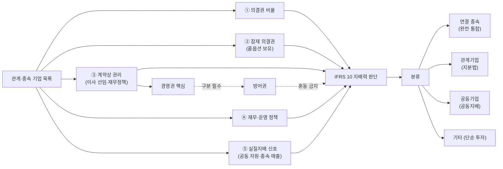

## 공개 호출 방식

AI 도구 실행 순서는 `EngineCall` 우선이다. `Company.panel("IS"|"BS"|"CF")`, `Company.disclosure`, `scan.quality`, `scan.audit`, `scan.disclosureRisk` 는 엔진 호출로 근거를 먼저 확보한다. 아래 Python 블록은 확보한 L1/L1.5 근거를 `buildEvidenceForensicsMemo` 로 묶는 **RunPython fallback** 절차다 — 지배력 판정 — falsifier 후보.

```python
import dartlab
from dartlab.synth.evidenceForensics import buildEvidenceForensicsMemo

target = "005930"  # KOSPI/KOSDAQ 종목코드
c = dartlab.Company(target)

statements = {}
for topic in ("IS", "BS", "CF"):
    try:
        statements[topic] = c.panel(topic, freq="Y")
    except TypeError:
        statements[topic] = c.panel(topic)
    except Exception:
        pass

sectionTexts = {}
for topic in ("businessOverview", "riskFactors", "mdna", "notesDetail"):
    try:
        sectionTexts[topic] = str(c.panel(topic))[:20000]
    except Exception:
        pass

try:
    disclosure = c.disclosure()
    events = disclosure.head(20).to_dicts() if hasattr(disclosure, "head") else list(disclosure)[:20]
except Exception:
    events = []

scanRows = []
for axis in ("quality", "audit", "disclosureRisk"):
    try:
        df = dartlab.scan(axis)
        rows = df.head(3).to_dicts() if hasattr(df, "head") else []
        for row in rows:
            row["axis"] = axis
        scanRows.extend(rows)
    except Exception:
        pass

memo = buildEvidenceForensicsMemo(
    target=target,
    market=str(getattr(c, "market", "KR")),
    companyName=str(getattr(c, "corpName", target)),
    statements=statements,
    sectionTexts=sectionTexts,
    events=events,
    scanRows=scanRows,
)

emit_result(
    table=memo["tables"]["falsifierLedger"],
    values={
        "target": target,
        "riskScore": memo["headline"].get("riskScore"),
        "signalCount": memo["headline"].get("signalCount"),
    },
    date=memo.get("asOf", "latest"),
    sources=memo["sources"],
)
```

## 호출 동작 — 5 단 분석 구조

### 1. 결론 도출

*IFRS 10 5 기준 매칭 + 종속/관계 분류 + 방어권 vs 경영권 + 지배력 신호 점수* 한 문장.

좋은 결론 예시:
- "207940 (삼바) 에피스 지분 50.1% — *합작 회사 (joint venture)* 였으나 2015년 옵션 행사 가능성 평가 후 *종속기업* 재분류. 방어권 (바이오젠 minority veto) 존재했으나 *경영권* 핵심 (이사 선임·재무정책) 은 삼바 보유. 분류 변경 시점 회계 처리 [conf:60] — 본 사건 8년 법적 논란."
- "현대쉘베이스오일 — 현대오일뱅크 지분 60%, 쉘 40%. *방어권 (소수 주주 보호)* 인지 *경영권 (공동지배)* 인지 합작계약서 본문 확인 필수 — 카카오 질의 사례 [conf:60]."

금지:
- IFRS 10 5 기준 매칭 없이 지배력 단정.
- 의결권 50%+ 만으로 실질지배 단정 (계약·옵션 평가 누락).
- 방어권 vs 경영권 구분 없이 결론.

### 2. 핵심 근거 수집

`requiredEvidence: skillRef + target + tableRef + valueRef + dateRef + sourceRef + executionRef` 필수.

- **target**: stockCode.
- **sourceRef**: 사업보고서 관계기업·종속기업 sections + 합작계약서 (DART 주요사항보고서·합작·M&A 공시 본문).
- **tableRef** (3+ 표):
  1. **종속·관계 기업 ledger** — 회사명 · 지분율 · 분류 (연결 종속 / 지분법 관계 / 합작) · 옵션 약정 · 의결권 변동
  2. **IFRS 10 5 기준 매트릭스** — 5 기준 (의결권·잠재 의결권·계약상 권리·재무정책·실질지배 신호) 매칭
  3. **방어권 vs 경영권 분리** — 합작계약서 또는 정관 조항 분석
- **valueRef**: 지분율·콜옵션 행사가·이사 선임 비율·재무정책 통제 정도.
- **dateRef**: 분류 결정 시점·옵션 발효 시점·합작 시작·종료 시점.
- **sourceRef**: 관계기업 sections id·합작 공시 id·합작계약서 id.
- **executionRef**: RunPython 계산 id.

### 3. 메커니즘 분석

지배력 판단 = *IFRS 10 5 기준 + 방어권 vs 경영권 분리 + 잠재 의결권 (옵션) 평가 + 분류 변경 시점 추적*:



**IFRS 10 5 기준 매트릭스**:

| 기준 | 종속 (연결) | 관계 (지분법) | 공동 | 단순투자 |
|---|---|---|---|---|
| 의결권 | > 50% 또는 실질 다수 | 20~50% | 합작계약상 공동 | < 20% |
| 잠재 의결권 (콜옵션) | 실행 시 다수 | 실행 시 20~50% | 균형 유지 | 미고려 |
| 이사 선임권 | 다수 임명 | 일부 (1~2 명) | 균등 | 없음 |
| 재무·운영 정책 통제 | 일방 결정 | 영향력 (지분법) | 합의 필요 | 비통제 |
| 실질지배 신호 | 공동 자원·종속 매출·일관 정책 | 영향력 신호 | 공동 사업·자원 | 없음 |

**방어권 vs 경영권 구분**:

| 항목 | 방어권 (Defensive Rights) | 경영권 (Substantive Rights) |
|---|---|---|
| 정관 변경 | 거부권 만 | 발의·승인권 |
| 자산 매각 | 한도 초과 시 거부 | 결정권 |
| 이사 선임 | 일부 추천 | 다수 선임 |
| 배당 결정 | 거부권 | 결정권 |
| M&A·합병 | 거부권 | 결정권 |
| 회계 정책 | 알림 | 결정 |

→ 방어권만 있으면 *지배력 X* (소수 주주 보호). 경영권 핵심 (이사 선임·재무 결정) 보유 시 *실질지배*.

**잠재 의결권 (콜옵션) 평가**:
- IFRS 10 은 *현재 행사 가능한* 옵션만 고려
- 행사 의지 + 행사 가능성 평가 필요
- 행사 후 의결권 비율 변화 시뮬레이션

**분류 변경 시점 신호**:
- 옵션 행사 또는 미행사 결정
- 합작 종료·해지
- 추가 지분 인수·매각
- 계약 갱신·종료

### 4. 반례·한계

- **Falsifier**: 관계기업 sections + 주요주주 + 합작 공시 중 2+ 부재 → 판정 불가.
- **합작계약서 비공개**: 핵심 조항 (이사 선임·재무 결정 권한) 미공개 시 외부 추정 한계.
- **IFRS vs K-IFRS vs 미국 GAAP**: 지배력 판단 기준 차이. 동일 합작이 다른 기준에서 다른 분류 가능.
- **잠재 의결권 평가의 주관성**: 옵션 행사 가능성·의지 평가는 *경영진 의도* 에 달림. 외부 검증 어려움.
- **방어권의 광범위**: 한국 정관·합작계약은 minority veto 다수 포함. 모두 방어권으로 분류해야 *기형적 종속 판정* 회피.
- **순환·이중 지배**: 지주사 구조에서 A→B→C 순환 시 단일 지배력 판단 복잡.
- **변경 시점 회계 처리**: 분류 변경 시 *공정가치 재평가* 영향 큼. 일회성 손익 발생 가능.

### 5. 후속 모니터링

| 신호 | 임계 | 조치 |
|---|---|---|
| 지분율 변동 | ±5%p | 분류 재평가 |
| 콜·풋옵션 행사 | 발생 | 잠재 의결권 재계산 |
| 합작계약 갱신·종료 | 발생 | 지배력 변경 시점 회계 |
| 이사회 구성 변화 | 다수 임명권 변동 | 경영권 핵심 재평가 |
| 재무정책 통제 변경 | 일방 → 합의 또는 반대 | 분류 변경 트리거 |
| 신규 합작·M&A 공시 | 신규 발생 | 추가 관계기업 ledger |
| 정관·합작계약 변경 | 핵심 조항 변경 | 방어권 vs 경영권 재분리 |

## 대표 반환 형태

- `tableRef:control:entity_ledger` — 관계·종속 기업 ledger
- `tableRef:control:ifrs10_matrix` — 5 기준 매트릭스
- `tableRef:control:defensive_vs_substantive` — 방어권 vs 경영권 비교
- `tableRef:control:potential_vote` — 잠재 의결권 시뮬레이션
- `valueRef:control:ownership_pct` — 지분율
- `valueRef:control:judge_score` — 지배력 판단 점수
- `sourceRef:control:notes_id` — 관계기업 sections id
- `sourceRef:control:joint_contract_id` — 합작계약 공시 id

## 연계 절차

- 합병비율·소수주주 → `recipes.fundamental.quality.forensics.mergerRatioFairness`
- 영업권 손상 (M&A 후 사후평가) → `recipes.fundamental.quality.forensics.goodwillImpairmentCheck`
- 사건 ↔ 재무 매칭 → `recipes.fundamental.quality.forensics.eventToStatementMatcher`
- 계정 추적 (분류 변경 회계 처리) → `recipes.fundamental.quality.forensics.accountTraceLedger`
- 하이브리드 증권 (분류 변경 동행) → `recipes.fundamental.quality.forensics.hybridSecurityClassification`
- TRS·파생 (잠재 의결권 동행) → `recipes.fundamental.quality.forensics.trsDerivativeUsage`
- 주석 신호 (합작·종속 키워드) → `recipes.fundamental.quality.forensics.noteSignalExtractor`

재호출 트리거: "실질지배력 판단", "삼성바이오 회계 논란", "현대오일뱅크 쉘 합작", "방어권 경영권 차이", "연결재무제표 작성 범위".

## 기본 검증

- 관계·종속 기업 ledger ≥ 1 종.
- IFRS 10 5 기준 모두 평가 (또는 데이터 부족 명시).
- 방어권 vs 경영권 분리 시도.
- 잠재 의결권 (콜옵션) 평가 또는 부재 명시.
- 분류 변경 시점 동행 추적 (해당 시).

## AI 직접 사용 방식

1. `ReadSkill` 에서 실질지배력·연결범위·합작·삼바 류 질문이면 본 recipe 선정.
2. `Company.panel("관계기업")` `Company.panel("종속기업")` `Company.panel("majorHolder")` 본문 추출.
3. `Company.panel("충당부채")` 옵션 약정.
4. `Company.disclosure(keyword="합작"/"인수", days=1825)` 합작·M&A 공시.
5. RunPython 으로 IFRS 10 5 기준 매트릭스 + 방어권 vs 경영권 분리 + 잠재 의결권 평가.
6. 답변에 *기업 ledger + 5 기준 매트릭스 + 방어권/경영권 비교 + 한계 (계약서 비공개)* 4 셋 필수.
