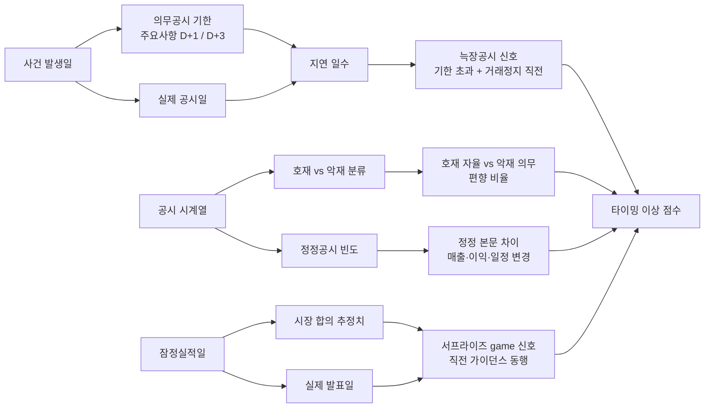

## 공개 호출 방식

```python
import dartlab
import polars as pl

target = "027410"  # 예 — 한화 (늑장공시 케이스)
c = dartlab.Company(target)

# 1. 공시 시계열 — 의무 vs 자율, 정정 빈도
disclosure_log = c.disclosure(window="3Y") if hasattr(c, "disclosure") else None

# 2. IS / BS 분기 — 공시-실적 연결
qis = c.show("IS", freq="Q")
qbs = c.show("BS", freq="Q")

# 3. 횡단 — disclosureRisk axis (정정·지연 빈도)
risk = dartlab.scan("disclosureRisk")

# 4. 호재/악재 분류 + timestamp ledger
timing_ledger = {
    "disclosure_count": disclosure_log.height if disclosure_log is not None and hasattr(disclosure_log, "height") else 0,
    "qis_quarters": qis.shape[1] - 2 if qis is not None else 0,
    "scan_risk_present": risk is not None and risk.filter(pl.col("stockCode") == target).height > 0,
}

emit_result(
    table=[timing_ledger],
    values={
        "target": target,
        "disclosureLoaded": disclosure_log is not None,
    },
    date="latest",
)
```

## 호출 동작 — 5 단 분석 구조

### 1. 결론 도출

*공시 timestamp 이상 + 호재·악재 균형 + 정정·반복 패턴 + 어닝 시즌 game 신호* 한 문장.

좋은 결론 예시:
- "한화 케이스 — 상장폐지 실질심사 사유 발생 D+N 일 공시 (의무공시 기한 초과). 동일 분기 호재 공시 X 건 (자율) vs 악재 공시 1 건 (의무). 정정공시 Y 회 발생, 정정 본문 핵심 숫자 변경 (매출 -Z%). *늑장공시 + 호재 부풀리기 결합 [conf:75]*. counter — 실제 사유 발생일 확정 어려움."

금지:
- 의무공시 기한 (법규) 미명시 단정.
- 호재 반복 공시 + 후속 매출 반영 비교 누락.

### 2. 핵심 근거 수집

`requiredEvidence: skillRef + target + tableRef + valueRef + dateRef + sourceRef + executionRef` 필수.

- **target** (stockCode).
- **sourceRef**: 공시 원문 (DART 주요사항보고 / 자율공시 / 정정공시). 외부 IR 자료·언론 보도 timing 별도.
- **tableRef** (4+ 표):
  1. **공시 timestamp ledger** — 공시일 / 사건 발생일 / 의무공시 기한 / 지연 일수 / 의무 vs 자율 구분
  2. **호재·악재 균형** — 분기·연도별 호재 (자율공시 多) vs 악재 (의무공시 多) 건수
  3. **정정공시 ledger** — 최초 공시일 / 정정일 / 본문 변경 핵심 (매출·이익·일정·숫자)
  4. **어닝 시즌 timing** — 잠정실적 발표일 / 확정 공시일 / 시장 합의 추정치 (있다면) vs 실제 차이
- **valueRef**: 지연 일수 평균·중앙값, 정정 횟수, 호재/악재 비율.
- **dateRef**: 분기 발표일·잠정실적일·정정일·사건 발생일.
- **executionRef**: RunPython 으로 timing 분포 + 정정 본문 차이 계산.

### 3. 메커니즘 분석

공시 타이밍 이상 진단 = *법규 기한 비교 + 호재·악재 균형 + 정정·반복 패턴 + 어닝 시즌 game 신호 4 차원 동시 검증*:



**4 패턴 정량 신호**:

| 패턴 | 신호 | 임계 | 가중치 |
|---|---|---|---|
| **늑장공시** | 사건 발생일 → 공시일 지연 | 의무공시 기한 초과 | high |
| **늑장공시** | 거래정지 직전 24h 내 부정 공시 | 발생 | high |
| **호재 부풀리기** | 동일 호재 (MOU·신사업) 반복 공시 횟수 | ≥ 3 회 / 6M | medium |
| **호재 부풀리기** | 호재 공시 후 12M 내 실제 매출 반영 | < 10% | high |
| **정정공시** | 정정 본문 핵심 숫자 변경 (매출·이익) | ≥ 5% 변경 | high |
| **어닝 게임** | 잠정실적 직전 비공식 가이던스 | 발생 | medium |
| **어닝 게임** | 매 분기 시장 추정 대비 +1~3% 흑자 | 4 분기 연속 | medium |

### 4. 반례·한계

- **Falsifier**: 공시 timestamp 또는 본문 부재 시 timing 진단 불가 — *DART 원문 fetch 후 재호출*.
- **사건 발생일 확정 어려움**: 의무공시 기한은 *사유 발생 익일* 기준인데, "발생일" 자체가 회사 내부 판단 (이사회 결의일·계약일·인지일) 이라 외부 판정이 항상 명확하지 않다. 늑장 단정 시 *법적 기한 vs 추정 발생일* 별도 메모.
- **반복 공시의 정당성**: 신사업 MOU·R&D 진행상황은 *진행상황 자율공시* 가 정상이라 단순 횟수만 보면 정상 패턴을 부풀리기로 오판할 수 있다. *실제 매출 반영* + *공시 본문 변화* 동행 검증.
- **정정공시 = 회계 부실 ≠**: 정정공시는 typo·첨부 누락 등 단순 정정도 다수. *본문 핵심 숫자 변경 폭* 으로 분류 필요.
- **어닝 서프라이즈 game 외부 소스 의존**: 시장 합의 추정치 (FnGuide·Bloomberg 등) 는 dartlab L1/L1.5 범위 밖. 외부 소스 인용 후 판단.
- **자율공시 편향**: 호재는 자율공시·악재는 의무공시 패턴 자체가 *제도적 구조* (한국 자율공시 도입 의도) 의 산물이라 단순 편향만으로 부풀리기 단정 금지.
- **거래정지 직전 부정 공시**: 거래정지 직전 24h 신호는 강하나, 거래정지 사유 자체가 *공시 누락* 인 경우 인과 역전 (공시 → 정지 vs 정지 → 공시). 사유 별도 확인.

### 5. 후속 모니터링

| 신호 | 임계 | 조치 |
|---|---|---|
| 지연 일수 평균 | ≥ 5 영업일 | 의무공시 위반 추적 |
| 정정공시 횟수 / 분기 | ≥ 3 회 | 정정 본문 차이 ledger 작성 |
| 호재 반복 공시 후속 매출 | < 10% / 12M | 부풀리기 신호 격상 |
| 어닝 서프라이즈 연속 | 4 분기 연속 ±1~3% | 가이던스 game 추적 |
| 정정 본문 매출 변경 폭 | ≥ 10% | 회계 부실 의심 격상 |
| 거래정지 직전 부정 공시 | 발생 | 늑장공시 가중치 high |

## 대표 반환 형태

- `tableRef:timing:disclosure_log` — 공시 timestamp ledger
- `tableRef:timing:event_vs_filing_lag` — 사건 발생 → 공시 지연 일수
- `tableRef:timing:positive_negative_balance` — 호재/악재 균형
- `tableRef:timing:correction_diff` — 정정공시 본문 차이
- `tableRef:timing:earnings_surprise` — 어닝 시즌 timing
- `valueRef:timing:avg_delay_days` — 평균 지연 일수
- `valueRef:timing:correction_count_quarter` — 분기당 정정 횟수
- `valueRef:timing:anomaly_score` — timing 이상 종합 점수
- `sourceRef:timing:disclosure_id` — 공시 id
- `executionRef:timing:calc_id` — RunPython 실행 id

## 연계 절차

- 사건 ↔ 재무 매칭 → `recipes.fundamental.quality.forensics.eventToStatementMatcher`
- 주석 신호 (계속기업·정정) → `recipes.fundamental.quality.forensics.noteSignalExtractor`
- 계정 추적 → `recipes.fundamental.quality.forensics.accountTraceLedger`
- 실질지배력 (정보 비대칭 동행) → `recipes.fundamental.quality.forensics.controllingPowerJudgment`
- 영업권 손상 (호재 반복 후 손상) → `recipes.fundamental.quality.forensics.goodwillImpairmentCheck`

재호출 트리거: "한화 늑장공시", "어닝 서프라이즈 game", "공시 timing 이상", "호재 부풀리기", "정정공시 패턴".

## 기본 검증

- 공시 시계열 ≥ 3 년.
- 의무공시 기한 (법규) 본문 인용.
- 호재·악재 분류 + 분기별 건수.
- 정정공시 발생 시 *본문 차이 핵심 숫자* 명시.
- falsifier — 사건 발생일 확정 어려움 메모.

## AI 직접 사용 방식

1. `ReadSkill` 에서 공시 timing 질문이면 본 recipe 선정.
2. target stockCode 확인.
3. `Company.disclosure(window="3Y")` 공시 시계열.
4. `Company.show("IS", freq="Q")` 분기 실적 — 어닝 시즌 timing 비교.
5. `scan("disclosureRisk")` 횡단 비교 — 동종 업종 평균 대비.
6. RunPython 으로 4 패턴 신호 점수 계산.
7. 답변에 *timestamp ledger + 호재·악재 균형 + 정정 차이 + 어닝 시즌 timing* 4 셋 + 반례·한계 필수.
