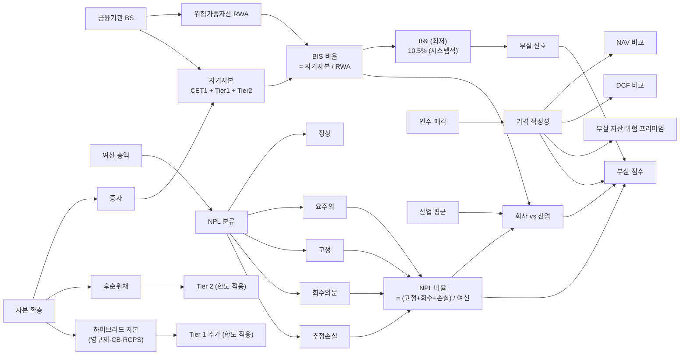

## 공개 호출 방식

AI 도구 실행 순서는 `EngineCall` 우선이다. `Company.show("IS"|"BS"|"CF")`, `Company.disclosure`, `scan.quality`, `scan.audit`, `scan.disclosureRisk` 는 엔진 호출로 근거를 먼저 확보한다. 아래 Python 블록은 확보한 L1/L1.5 근거를 `buildEvidenceForensicsMemo` 로 묶는 **RunPython fallback** 절차다 — 부실 금융기관 — 엔진 후보 메모.

```python
import dartlab
from dartlab.synth.evidenceForensics import buildEvidenceForensicsMemo

target = "005930"  # KOSPI/KOSDAQ 종목코드
c = dartlab.Company(target)

statements = {}
for topic in ("IS", "BS", "CF"):
    try:
        statements[topic] = c.show(topic, freq="Y")
    except TypeError:
        statements[topic] = c.show(topic)
    except Exception:
        pass

sectionTexts = {}
for topic in ("businessOverview", "riskFactors", "mdna", "notesDetail"):
    try:
        sectionTexts[topic] = str(c.show(topic))[:20000]
    except Exception:
        pass

try:
    disclosure = c.disclosure()
    events = disclosure.head(20).to_dicts() if hasattr(disclosure, "head") else list(disclosure)[:20]
except Exception:
    events = []

scanRows = []
for axis in ("quality", "audit", "disclosureRisk"):
    try:
        df = dartlab.scan(axis)
        rows = df.head(3).to_dicts() if hasattr(df, "head") else []
        for row in rows:
            row["axis"] = axis
        scanRows.extend(rows)
    except Exception:
        pass

memo = buildEvidenceForensicsMemo(
    target=target,
    market=str(getattr(c, "market", "KR")),
    companyName=str(getattr(c, "corpName", target)),
    statements=statements,
    sectionTexts=sectionTexts,
    events=events,
    scanRows=scanRows,
)

emit_result(
    table=memo["tables"]["engineCandidateMemo"],
    values={
        "target": target,
        "riskScore": memo["headline"].get("riskScore"),
        "signalCount": memo["headline"].get("signalCount"),
    },
    date=memo.get("asOf", "latest"),
    sources=memo["sources"],
)
```

## 호출 동작 — 5 단 분석 구조

### 1. 결론 도출

*BIS·NPL·LCR 시계열 + 자기자본 보강 + 부실 분류 매트릭스 + 인수·매각 가격 적정성 + 산업 평균 비교* 한 문장.

좋은 결론 예시:
- "외환은행-론스타 케이스 — 인수 시점 (2003) BIS X% (8% 기준 ±N%p) → 부실 분류 (요주의/고정/회수의문) Y% / 총 여신. 인수가 Z 조원 vs 추정 NAV K 조원 (가격 / NAV = M%, 30% 할인). 자기자본 보강 (증자·후순위채) 잠재 효과 시뮬레이션. *헐값매각 가능성 [중간] [conf:55]*. counter — 부실 자산 인수 위험 프리미엄 (negative goodwill 인정 가능성) + 외환위기 직후 정상 인수 시점 환경 별도 평가. 산업 평균 BIS·NPL 동행 비교 의무."

금지:
- BIS 8% 미달 단독으로 부실 단정 (시점 일시 변동 가능).
- 헐값매각 단정 시 인수자 위험 프리미엄 누락.

### 2. 핵심 근거 수집

`requiredEvidence: skillRef + target + tableRef + valueRef + dateRef + sourceRef + executionRef` 필수.

- **target** (stockCode).
- **sourceRef**: 사업보고서 감독 지표 주석 (BIS·NPL·LCR·RBC·K-ICS) + 자본확충 공시 + 인수·매각 공시 + 감독원 발표 (외부 webRef).
- **tableRef** (5+ 표):
  1. **감독 지표 시계열** — BIS·CET1·Tier1 (은행) / NCR (증권) / RBC·K-ICS (보험) / LCR·NSFR (유동성)
  2. **부실 분류 매트릭스** — 정상 / 요주의 / 고정 / 회수의문 / 추정손실 / 비율 시계열
  3. **자기자본 보강 ledger** — 증자·후순위채·하이브리드 자본 (영구채·CB) 시점·규모·인정 한도
  4. **인수·매각 가격 적정성** — 인수가 vs NAV / DCF / peer 비교 (3 방식)
  5. **산업 평균 비교** — 동종 업종 (은행·증권·보험) 평균 BIS·NPL·NIM 동행 비교
- **valueRef**: BIS 비율, NPL 비율, 대손비용 / 영업이익, 인수가 / NAV.
- **dateRef**: 감독 지표 발표일·자본확충일·인수·매각일.
- **executionRef**: RunPython 으로 시계열 회귀 + 산업 평균 차이 계산.

### 3. 메커니즘 분석

부실 금융기관 진단 = *감독 지표 + 자본 보강 + 부실 분류 + 매각 가격 + 산업 비교 5 차원 동시 검증*:



**5 패턴 정량 신호**:

| 패턴 | 신호 | 임계 | 가중치 |
|---|---|---|---|
| **BIS 자기자본비율** | 일반 은행 BIS | < 8% | high |
| **BIS 자기자본비율** | 시스템적 중요 은행 (D-SIB) | < 10.5% | high |
| **CET1 비율** | Common Equity Tier 1 | < 4.5% | high |
| **NPL 비율** | 고정+회수의문+추정손실 / 여신 | ≥ 5% | high |
| **NPL 비율 산업 비교** | 회사 NPL / 산업 평균 NPL | ≥ 1.5 배 | medium |
| **대손비용 비중** | 대손비용 / 영업이익 | ≥ 50% | high |
| **자본확충 빈도** | 5Y 내 자본확충 횟수 | ≥ 3 회 | medium |
| **하이브리드 자본 의존** | Tier 1 중 영구채·CB 비중 | ≥ 30% | medium |
| **LCR (유동성)** | 30 일 유동성 커버리지 | < 100% | high |
| **헐값매각 의심** | 인수가 / NAV | < 70% | medium |

### 4. 반례·한계

- **Falsifier**: 금융기관 감독 지표 본문 또는 자본확충 공시 부재 시 진단 불가 — *Company.show 주석 + DART 자본확충·인수·매각 공시 fetch 후 재호출*.
- **업권별 감독 지표 차이**: 은행 (BIS·CET1) / 증권 (NCR) / 보험 (RBC·K-ICS) / 저축은행 (BIS·고유 비율) — 지표 적용 다름. 단일 지표로 단정 금지.
- **분기말 일시 변동**: BIS·LCR 은 *분기말 자본조달·자산 매각 등 일시 조정* 가능. 시계열 ≥ 4 분기 동행 평가.
- **위험가중자산 (RWA) 산정 차이**: 표준방식 vs 내부등급방식 (IRB) 산정 결과 달라 단순 BIS 절대값 비교 한계. 산정 방법 명시 필수.
- **산업 cycle 동행**: 다운사이클 시 *전 산업 NPL 동시 상승* 정상. 단순 NPL 절대값 만으로 회사 단독 부실 단정 금지.
- **헐값매각 vs 부실 인수 정상**: 부실 자산 인수 (예 외환위기 직후) 시 *위험 프리미엄* 으로 가격 < NAV 정상 가능. negative goodwill 인정 가능성 별도.
- **후순위채·하이브리드 자본 한도**: 후순위채는 Tier 2 한도 (CET1 의 50% 이하) / 하이브리드 자본은 Tier 1 추가 한도 별도. 단순 자본 보강 = 정상 단정 금지.
- **저축은행 vs 일반 은행**: 저축은행은 *예금자보호 한도 5,000 만원* + 별도 BIS 적용 + 자산 5 조 미만 등 *제도 차이*. 일반 은행 기준 적용 금지.
- **K-ICS 도입 (2023) 자본 변동**: 보험사는 RBC → K-ICS 전환으로 자본 인식 변화. 도입 시점 동행 분석 필요.

### 5. 후속 모니터링

| 신호 | 임계 | 조치 |
|---|---|---|
| BIS 일반 은행 | < 8% / 2Q 연속 | 부실 격상 |
| CET1 | < 4.5% | 즉시 격상 |
| NPL 비율 | ≥ 5% | 부실 분류 ledger |
| NPL / 산업 평균 | ≥ 1.5 배 | 회사 단독 부실 의심 |
| 자본확충 빈도 / 5Y | ≥ 3 회 | 자본 부족 신호 |
| 하이브리드 자본 비중 | ≥ 30% | 자본 질 의심 |
| LCR | < 100% | 유동성 위기 |
| 인수가 / NAV | < 70% | 헐값매각 의심 |
| 대손비용 비중 / 영업이익 | ≥ 50% | 수익성 위기 |

## 대표 반환 형태

- `tableRef:dfi:supervisory_timeseries` — 감독 지표 시계열
- `tableRef:dfi:npl_classification` — 부실 분류 매트릭스
- `tableRef:dfi:capital_raise_ledger` — 자기자본 보강
- `tableRef:dfi:acquisition_appraisal` — 인수·매각 가격 적정성
- `tableRef:dfi:industry_compare` — 산업 평균 비교
- `valueRef:dfi:bis_ratio` — BIS 비율
- `valueRef:dfi:cet1_ratio` — CET1 비율
- `valueRef:dfi:npl_ratio` — NPL 비율
- `valueRef:dfi:lcr` — LCR
- `valueRef:dfi:price_to_nav` — 인수가 / NAV
- `sourceRef:dfi:supervisory_note_id` — 감독 지표 주석 id
- `sourceRef:dfi:capital_disclosure_id` — 자본확충 공시 id
- `executionRef:dfi:calc_id` — RunPython 실행 id

## 연계 절차

- 영구채·하이브리드 자본 분류 → `recipes.fundamental.quality.forensics.hybridSecurityClassification`
- 빅 배스 (신임 경영자 NPL 일회 인식) → `recipes.fundamental.quality.forensics.bigBathDetection`
- 합병비율 적정성 (인수 시) → `recipes.fundamental.quality.forensics.mergerRatioFairness`
- 주석 신호 (감독 지표 본문) → `recipes.fundamental.quality.forensics.noteSignalExtractor`

재호출 트리거: "BIS 자기자본비율", "NPL 부실 분류", "저축은행 사태", "외환은행 론스타 헐값매각", "보험사 K-ICS RBC", "SVB 시그니처".

## 기본 검증

- 감독 지표 (BIS·NPL·LCR) 시계열 ≥ 5 년.
- 업권 구분 (은행·증권·보험·저축은행) + 적용 지표 명시.
- 부실 분류 5 단계 (정상·요주의·고정·회수의문·추정손실) 비율.
- 자본 보강 (증자·후순위채·하이브리드) 한도 인용.
- 산업 평균 동행 비교.
- falsifier — 분기말 일시 변동·다운사이클 동행 반례 검토.

## AI 직접 사용 방식

1. `ReadSkill` 에서 금융기관 부실·BIS·NPL·헐값매각 질문이면 본 recipe 선정.
2. target stockCode 확인 (은행·증권·보험·저축은행 분류).
3. `Company.show("BS","IS",freq="Y")` 시계열.
4. `Company.show("BIS")` 또는 사업보고서 감독 지표 주석 fetch.
5. `Company.disclosure("자본확충","인수","합병")` 공시.
6. `scan("financialHealth")` 산업 평균 횡단.
7. RunPython 으로 5 차원 매트릭스 계산.
8. 답변에 *감독 지표 시계열 + 부실 분류 + 자본 보강 + 가격 적정성 + 산업 비교* 5 셋 + 반례·한계 필수.
