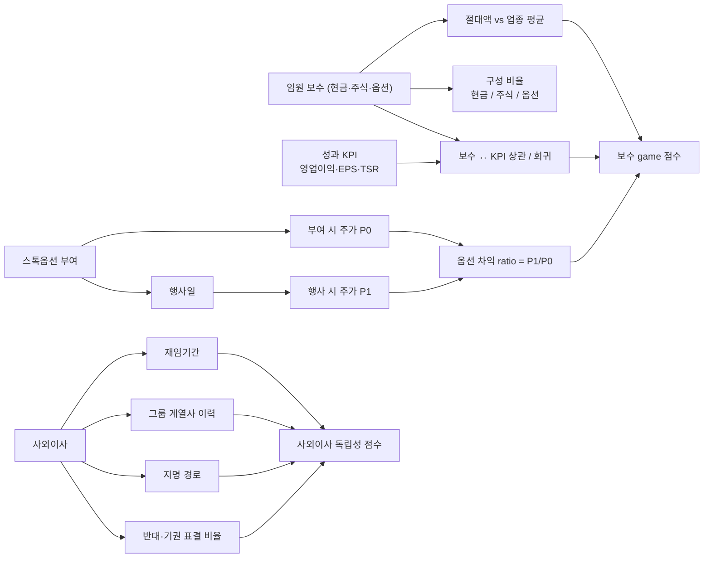

## 공개 호출 방식

AI 도구 실행 순서는 `EngineCall` 우선이다. `Company.show("IS"|"BS"|"CF")`, `Company.disclosure`, `scan.quality`, `scan.audit`, `scan.disclosureRisk` 는 엔진 호출로 근거를 먼저 확보한다. 아래 Python 블록은 확보한 L1/L1.5 근거를 `buildEvidenceForensicsMemo` 로 묶는 **RunPython fallback** 절차다 — 임원 보수 — 주석 신호.

```python
import dartlab
from dartlab.synth.evidenceForensics import buildEvidenceForensicsMemo

target = "005930"  # KOSPI/KOSDAQ 종목코드
c = dartlab.Company(target)

statements = {}
for topic in ("IS", "BS", "CF"):
    try:
        statements[topic] = c.show(topic, freq="Y")
    except TypeError:
        statements[topic] = c.show(topic)
    except Exception:
        pass

sectionTexts = {}
for topic in ("businessOverview", "riskFactors", "mdna", "notesDetail"):
    try:
        sectionTexts[topic] = str(c.show(topic))[:20000]
    except Exception:
        pass

try:
    disclosure = c.disclosure()
    events = disclosure.head(20).to_dicts() if hasattr(disclosure, "head") else list(disclosure)[:20]
except Exception:
    events = []

scanRows = []
for axis in ("quality", "audit", "disclosureRisk"):
    try:
        df = dartlab.scan(axis)
        rows = df.head(3).to_dicts() if hasattr(df, "head") else []
        for row in rows:
            row["axis"] = axis
        scanRows.extend(rows)
    except Exception:
        pass

memo = buildEvidenceForensicsMemo(
    target=target,
    market=str(getattr(c, "market", "KR")),
    companyName=str(getattr(c, "corpName", target)),
    statements=statements,
    sectionTexts=sectionTexts,
    events=events,
    scanRows=scanRows,
)

emit_result(
    table=memo["tables"]["noteSignalExtractor"],
    values={
        "target": target,
        "riskScore": memo["headline"].get("riskScore"),
        "signalCount": memo["headline"].get("signalCount"),
    },
    date=memo.get("asOf", "latest"),
    sources=memo["sources"],
)
```

## 호출 동작 — 5 단 분석 구조

### 1. 결론 도출

*임원 보수 절대액 + 업종 비교 + KPI 정합성 + 스톡옵션 timing + 사외이사 독립성* 한 문장.

좋은 결론 예시:
- "현대자동차 케이스 — 등기임원 평균 보수 X 억원, 업종 평균 (자동차 OEM) 대비 ±N%. 영업이익 시계열 vs 보수 시계열 상관계수 ρ=0.Y. 스톡옵션 부여일 주가 P0, 행사일 P1 (P1/P0 = M 배). 사외이사 평균 재임 Z 년, 그룹 계열사 이력 W 명 / 전체 K 명. *보수 ↔ KPI 정합 [중간] + 사외이사 독립성 [약함] [conf:55]*. counter — 보수 공시는 등기임원 한정이라 *미등기 회장·고문* 보수 누락 가능성."

금지:
- 절대액만 보고 과도 단정 (업종 평균 미비교).
- KPI 정의 (영업이익 vs EPS vs TSR) 미명시.

### 2. 핵심 근거 수집

`requiredEvidence: skillRef + target + tableRef + valueRef + dateRef + sourceRef + executionRef` 필수.

- **target** (stockCode).
- **sourceRef**: 사업보고서 임원보수 섹션 + 스톡옵션 부여·행사 공시 + 사외이사 명단·이력 공시.
- **tableRef** (4+ 표):
  1. **임원 보수 시계열** — 연도별 등기임원 보수 (개인별·합산), 현금 / 주식 / 옵션 구분
  2. **보수 ↔ KPI 정합성** — 영업이익·EPS·TSR (총주주수익률) 시계열 vs 보수 시계열 상관 / 회귀
  3. **스톡옵션 부여·행사 ledger** — 부여일·부여가·만기·행사일·행사가·차익 / 부여 직후·행사 직전 주가 변동
  4. **사외이사 독립성 매트릭스** — 재임기간 / 그룹 계열사 이력 / 지명 경로 (지배주주 / 기관) / 보수 / 표결 패턴
- **valueRef**: 평균 보수, 업종 평균 대비 배수, 상관계수 ρ, 옵션 차익 절대액, 사외이사 평균 재임 연수.
- **dateRef**: 보수 결정일·옵션 부여일·행사일·사외이사 재임 시작일.
- **executionRef**: RunPython 으로 상관·회귀 + 옵션 차익 계산.

### 3. 메커니즘 분석

임원 보수 진단 = *절대액 + KPI 정합 + 옵션 timing + 사외이사 독립성 4 차원 동시 검증*:



**4 패턴 정량 신호**:

| 패턴 | 신호 | 임계 | 가중치 |
|---|---|---|---|
| **보수 절대액** | 등기임원 평균 보수 / 업종 평균 | ≥ 2 배 | medium |
| **보수 ↔ KPI** | 영업이익 시계열 vs 보수 시계열 상관 ρ | < 0.3 → 정합성 약 | high |
| **단기 EPS 부풀리기** | 자사주 매입 + 보수 KPI = EPS 동행 | 자사주 매입 후 EPS 점프 | high |
| **옵션 부여 timing** | 부여 직전 3M 주가 변동 | 하락 직후 부여 (-10% 이상) | high |
| **옵션 행사 timing** | 행사 직전 1M 호재 공시 빈도 | ≥ 2 회 | medium |
| **사외이사 재임** | 평균 재임 / 권장 (6 년) | ≥ 9 년 | medium |
| **사외이사 그룹 이력** | 그룹 계열사 이력 보유자 / 전체 | ≥ 50% | high |
| **사외이사 표결** | 반대·기권 비율 | < 5% / 5 년 | medium |

### 4. 반례·한계

- **Falsifier**: 임원 보수 공시 본문 부재 또는 KPI 정의 부재 시 정합성 판정 불가 — *사업보고서 임원보수 섹션 fetch 후 재호출*.
- **미등기 임원 누락**: 공시 의무는 *등기임원* 한정이라 회장·고문·자회사 임원 보수 누락 多. 그룹 차원 보수 총량 별도 인지.
- **업종 평균 비교 어려움**: 동종 업종·규모 비교군 외부 데이터 (FnGuide·CEO Score 등) 가 dartlab L1/L1.5 범위 밖. 외부 인용 명시.
- **KPI 정의 다양성**: 보수 위원회 KPI 가 영업이익·EPS·TSR·비재무 (ESG·시장점유율) 등 혼합이라 단순 상관만으로 정합성 판단 어려움. 가능하면 보고서 본문 인용.
- **스톡옵션 정상 목적**: 인재 유치·장기 인센티브 정상 목적 인정. 단순 부여 = 부정 단정 금지. timing + 행사 차익 cluster 동행 시 의심.
- **사외이사 표결 자료 한계**: 공시는 결의안 본문만이라 *반대 표결 정확 회수* 추적 어려움. 회의록 별도 fetch 필요.
- **회장 가족 임원**: 실무 능력 검증 없이 사적 단정 금지. 다만 *지분 + 임원직 + 보수 + 의사결정 영향력* 4 요소 동행 시 의심.

### 5. 후속 모니터링

| 신호 | 임계 | 조치 |
|---|---|---|
| 등기임원 평균 보수 / 업종 평균 | ≥ 2 배 | 절대액 ledger 작성 |
| 영업이익 vs 보수 상관 ρ | < 0.3 | KPI 정합 [약함] 격상 |
| 옵션 부여 직전 주가 하락 | ≥ -10% / 3M | 의도적 부여 의심 |
| 옵션 행사 직전 호재 공시 | ≥ 2 회 / 1M | 행사 timing game 의심 |
| 사외이사 그룹 이력 비율 | ≥ 50% | 독립성 [약함] 격상 |
| 사외이사 반대·기권 비율 | < 5% / 5 년 | 거수기 의심 |
| 자사주 매입 + EPS 점프 동행 | 동행 | 분모 game 의심 |

## 대표 반환 형태

- `tableRef:exec:pay_timeseries` — 임원 보수 시계열
- `tableRef:exec:pay_vs_kpi` — 보수 ↔ KPI 정합성
- `tableRef:exec:option_grant_exercise` — 스톡옵션 부여·행사 ledger
- `tableRef:exec:board_independence` — 사외이사 독립성 매트릭스
- `valueRef:exec:pay_industry_ratio` — 업종 평균 대비 배수
- `valueRef:exec:pay_kpi_corr` — 보수 ↔ KPI 상관계수
- `valueRef:exec:option_profit` — 옵션 차익 절대액
- `valueRef:exec:board_indep_score` — 사외이사 독립성 점수
- `sourceRef:exec:report_id` — 사업보고서 id
- `executionRef:exec:calc_id` — RunPython 실행 id

## 연계 절차

- 실질지배력 (지분·표결 동행) → `recipes.fundamental.quality.forensics.controllingPowerJudgment`
- 빅 배스 (신임 경영자 동행) → `recipes.fundamental.quality.forensics.bigBathDetection`
- 공시 timing (옵션 부여·행사 timing 동행) → `recipes.fundamental.quality.forensics.disclosureTimingAnomaly`
- 주석 신호 (특수관계자 거래) → `recipes.fundamental.quality.forensics.noteSignalExtractor`

재호출 트리거: "임원 보수 과도", "스톡옵션 부여 timing", "사외이사 독립성", "성과급 KPI 정렬", "단기 EPS 보수 game".

## 기본 검증

- 등기임원 보수 시계열 ≥ 5 년.
- 영업이익·EPS·TSR 시계열 동기간 비교.
- 스톡옵션 부여·행사 ledger (가능 시).
- 사외이사 명단·재임기간·그룹 계열사 이력.
- 업종 평균 비교 외부 출처 명시.
- falsifier — 미등기 임원 누락 가능성 메모.

## AI 직접 사용 방식

1. `ReadSkill` 에서 임원 보수·스톡옵션·사외이사 질문이면 본 recipe 선정.
2. target stockCode 확인.
3. `Company.show("임원보수")` 또는 사업보고서 섹션 fetch.
4. `Company.show("IS", freq="Y")` 시계열 + EPS / TSR 보완.
5. `Company.disclosure("스톡옵션")` 부여·행사 timestamp.
6. `scan("governance")` 사외이사·지분율 횡단.
7. RunPython 으로 상관·옵션 차익·독립성 점수 계산.
8. 답변에 *보수 시계열 + KPI 정합 + 옵션 ledger + 사외이사 독립성* 4 셋 + 반례·한계 필수.
