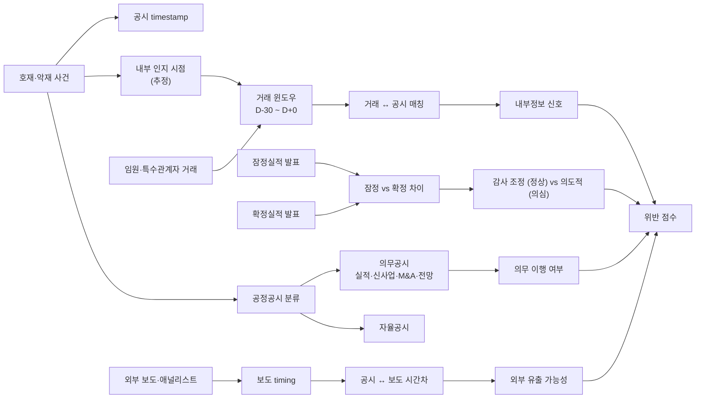

## 공개 호출 방식

AI 도구 실행 순서는 `EngineCall` 우선이다. `Company.show("IS"|"BS"|"CF")`, `Company.disclosure`, `scan.quality`, `scan.audit`, `scan.disclosureRisk` 는 엔진 호출로 근거를 먼저 확보한다. 아래 Python 블록은 확보한 L1/L1.5 근거를 `buildEvidenceForensicsMemo` 로 묶는 **RunPython fallback** 절차다 — 공정공시 위반 — event-statement 매칭.

```python
import dartlab
from dartlab.synth.evidenceForensics import buildEvidenceForensicsMemo

target = "005930"  # KOSPI/KOSDAQ 종목코드
c = dartlab.Company(target)

statements = {}
for topic in ("IS", "BS", "CF"):
    try:
        statements[topic] = c.show(topic, freq="Y")
    except TypeError:
        statements[topic] = c.show(topic)
    except Exception:
        pass

sectionTexts = {}
for topic in ("businessOverview", "riskFactors", "mdna", "notesDetail"):
    try:
        sectionTexts[topic] = str(c.show(topic))[:20000]
    except Exception:
        pass

try:
    disclosure = c.disclosure()
    events = disclosure.head(20).to_dicts() if hasattr(disclosure, "head") else list(disclosure)[:20]
except Exception:
    events = []

scanRows = []
for axis in ("quality", "audit", "disclosureRisk"):
    try:
        df = dartlab.scan(axis)
        rows = df.head(3).to_dicts() if hasattr(df, "head") else []
        for row in rows:
            row["axis"] = axis
        scanRows.extend(rows)
    except Exception:
        pass

memo = buildEvidenceForensicsMemo(
    target=target,
    market=str(getattr(c, "market", "KR")),
    companyName=str(getattr(c, "corpName", target)),
    statements=statements,
    sectionTexts=sectionTexts,
    events=events,
    scanRows=scanRows,
)

emit_result(
    table=memo["tables"]["eventToStatementMatcher"],
    values={
        "target": target,
        "riskScore": memo["headline"].get("riskScore"),
        "signalCount": memo["headline"].get("signalCount"),
    },
    date=memo.get("asOf", "latest"),
    sources=memo["sources"],
)
```

## 호출 동작 — 5 단 분석 구조

### 1. 결론 도출

*공시 timestamp ↔ 거래 매칭 + 호재·악재 공시 직전 거래 + 잠정 vs 확정 차이 + 공정공시 분류 + 외부 timing 동행* 한 문장.

좋은 결론 예시:
- "CJ E&M 케이스 — 잠정실적 발표 D-N 일 임원 X 명 매도 (Y 주, 평균 매도가 Z 원). 잠정실적 발표 후 주가 -K% (악재 동행). 잠정 vs 확정 영업이익 차이 M% (감사 후 조정). 직전 1 개월 호재 공시 빈도 L 회 → 매도 직전 cluster. *내부정보 유출 가능성 [높음] [conf:65]*. counter — 임원 단독 매매는 분산·세무·상속 정당 사유 가능. 거래 plan 사전 신고 본문 별도 fetch 필요."

금지:
- 사전 매매 단독 신호로 내부정보 단정.
- 외부 보도 timing 만 보고 정보 유출 단정 (webRef 마커 강행).

### 2. 핵심 근거 수집

`requiredEvidence: skillRef + target + tableRef + valueRef + dateRef + sourceRef + executionRef` 필수.

- **target** (stockCode).
- **sourceRef**: 임원거래 공시 (DART 임원거래·주식 변동) + 잠정·확정실적 공시 + 사업보고서 특수관계자 거래 + 외부 보도 (webRef 마커 + 1 차 검증).
- **tableRef** (4+ 표):
  1. **공시 timestamp ↔ 거래 매칭** — 호재·악재 공시일 / 직전 ±N 일 임원거래 timestamp / 거래 종류 (매수·매도·증여)
  2. **호재·악재 공시 직전 거래 매트릭스** — 매도 / 매수 / 증여 분류 × 공시 호재·악재 분류 × ±5/10/30 일 윈도우
  3. **잠정 vs 확정실적 차이** — 잠정실적 발표일 / 확정실적 발표일 / 매출·영업이익·순이익 차이 % / 직전 임원거래 cluster
  4. **공정공시 분류 ledger** — 의무공시 (실적·신사업·M&A·전망) vs 자율공시 / 의무 vs 자율 비율 / 의무공시 누락 의심
- **valueRef**: 임원거래 절대 수량·금액, 잠정 vs 확정 차이 %, 매도 직후 주가 변동.
- **dateRef**: 공시일·임원거래일·잠정실적일·확정실적일.
- **executionRef**: RunPython 으로 timing 분포 + 매도 vs 주가 변동 회귀.

### 3. 메커니즘 분석

내부정보·공정공시 진단 = *공시 timing + 거래 매칭 + 잠정/확정 차이 + 공정공시 분류 + 외부 동행 5 차원 동시 검증*:



**5 패턴 정량 신호**:

| 패턴 | 신호 | 임계 | 가중치 |
|---|---|---|---|
| **사전 매매** | 악재 공시 D-30 ~ D-1 임원 매도 건수 | ≥ 2 건 | high |
| **사전 매매** | 호재 공시 D-30 ~ D-1 임원 매수 건수 | ≥ 2 건 | high |
| **사전 매매 규모** | 평균 매도 수량 / 임원 보유 비율 | ≥ 30% | high |
| **잠정 vs 확정** | 영업이익 차이 % | ≥ 5% | medium |
| **잠정 vs 확정 직전 거래** | 잠정실적 D-30 임원거래 cluster | ≥ 2 건 | high |
| **공정공시 의무 위반** | 실적·신사업 공시 누락 발견 | 발생 | high |
| **외부 보도 동행** | 보도 D-1 ~ D-7 공시 직전 timestamp | 동행 | medium |
| **애널리스트 보고서 동행** | 보고서 발간 D-1 공시 직전 임원거래 | 동행 | medium |
| **반복 패턴** | 12M 내 동일 패턴 횟수 | ≥ 3 회 | high |

### 4. 반례·한계

- **Falsifier**: 임원·특수관계자 거래 본문 또는 공시 timestamp 부재 시 진단 불가 — *DART 임원거래 공시 + 잠정실적·확정실적 공시 fetch 후 재호출*. 외부 보도 timing 은 *webRef 외부 본문 untrusted* 마커 강행 + 1 차 출처 검증 의무.
- **사전 신고 plan**: 한국은 미국 10b5-1 plan 류 사전 매매 신고 제도 별도 (자본시장법 임원·주요주주 사전 신고). 사전 신고된 거래는 *정상 일정 매매* 정상 사유 인정.
- **임원 단독 매매 정당 사유**: 분산투자·세무·이혼·상속·자녀 학자금 등 정당 사유 가능. 단일 사건 ≠ 내부정보. *반복 패턴 + 공시 timing 매칭 cluster* 동행 시만 의심 격상.
- **잠정 vs 확정 정상 조정**: 잠정실적 (자체 산정) 과 확정실적 (감사 후) 차이는 *정상 회계 조정* (대손충당금·이연법인세·평가손익 조정 등). 단순 5% 차이 = 의도적 단정 금지.
- **공정공시 의무 범위 외**: 실적·신사업·M&A·전망 외 *진행상황·R&D 진척*은 의무공시 아닐 수 있음. 자율공시 정상.
- **외부 보도 자체 취재**: 언론·애널리스트가 *공개 데이터·업계 동향 자체 취재* 로 보도 가능. 단순 timing 동행만으로 정보 유출 단정 금지.
- **공정공시 제도 시점**: 한국 공정공시 (Regulation FD) 2002 시행. 그 이전 사례는 별도 기준 적용.
- **반복 패턴 의무**: 단일 사건은 정황. *반복 패턴 (12M 내 ≥ 3 회)* 만 위반 가능성 격상 의무.

### 5. 후속 모니터링

| 신호 | 임계 | 조치 |
|---|---|---|
| 악재 공시 D-30 임원 매도 | ≥ 2 건 | 사전 매매 의심 ledger |
| 호재 공시 D-30 임원 매수 | ≥ 2 건 | 사전 매매 의심 ledger |
| 잠정 vs 확정 영업이익 차이 | ≥ 5% | 감사 조정 vs 의도 분류 |
| 잠정실적 D-30 임원거래 cluster | ≥ 2 건 | 즉시 격상 |
| 공정공시 의무 위반 | 발생 | 법적 조사 가능성 추적 |
| 외부 보도 D-1 공시 직전 | 동행 | webRef 1 차 검증 |
| 반복 패턴 / 12M | ≥ 3 회 | 패턴 ledger 격상 |

## 대표 반환 형태

- `tableRef:fd:disclosure_trade_match` — 공시 ↔ 거래 매칭
- `tableRef:fd:pre_event_window` — 호재·악재 공시 직전 거래 매트릭스
- `tableRef:fd:preliminary_vs_confirmed` — 잠정 vs 확정실적 차이
- `tableRef:fd:fair_disclosure_classification` — 공정공시 분류
- `tableRef:fd:external_timing` — 외부 보도·애널리스트 timing
- `valueRef:fd:pre_trade_count` — 사전 매매 건수
- `valueRef:fd:trade_to_holding_pct` — 매도 / 임원 보유 비율
- `valueRef:fd:preliminary_diff_pct` — 잠정 vs 확정 차이 %
- `valueRef:fd:violation_score` — 위반 가능성 종합 점수
- `sourceRef:fd:exec_trade_id` — 임원거래 공시 id
- `sourceRef:fd:preliminary_id` — 잠정실적 공시 id
- `executionRef:fd:calc_id` — RunPython 실행 id

## 연계 절차

- 공시 timing (호재·악재 공시 timestamp) → `recipes.fundamental.quality.forensics.disclosureTimingAnomaly`
- 임원보수 (스톡옵션 행사 동행) → `recipes.fundamental.quality.forensics.executiveCompensationAudit`
- 주석 신호 (특수관계자 거래 본문) → `recipes.fundamental.quality.forensics.noteSignalExtractor`
- 실질지배력 (정보 비대칭 동행) → `recipes.fundamental.quality.forensics.controllingPowerJudgment`

재호출 트리거: "내부정보 유출", "공정공시 위반", "임원 사전 매매", "잠정 확정실적 차이", "CJ E&M 한미약품 패턴".

## 기본 검증

- 공시 시계열 ≥ 3 년 + 임원·특수관계자 거래 시계열 동행.
- 호재·악재 공시 직전 ±30 일 윈도우 매칭.
- 잠정 vs 확정실적 차이 정량.
- 공정공시 의무 vs 자율 분류.
- 외부 보도 동행 시 webRef 마커 + 1 차 검증.
- falsifier — 사전 신고 plan 정상 거래 반례 검토.

## AI 직접 사용 방식

1. `ReadSkill` 에서 내부정보·공정공시·사전 매매 질문이면 본 recipe 선정.
2. target stockCode 확인.
3. `Company.disclosure(window="3Y")` 공시 시계열 + 임원거래·잠정실적·확정실적 분리.
4. `Company.show("임원거래")` 또는 `Company.show("특수관계자거래")` 본문.
5. `Company.show("IS", freq="Q")` 잠정 vs 확정 분기 비교.
6. 외부 보도 timing 필요 시 `WebSearch` 호출 (webRef 마커 + 1 차 검증 의무).
7. RunPython 으로 timing 매칭 + 매도 cluster 분석.
8. 답변에 *timing 매칭 + 사전 거래 매트릭스 + 잠정/확정 차이 + 공정공시 분류 + 외부 동행* 5 셋 + 반례·한계 필수.
