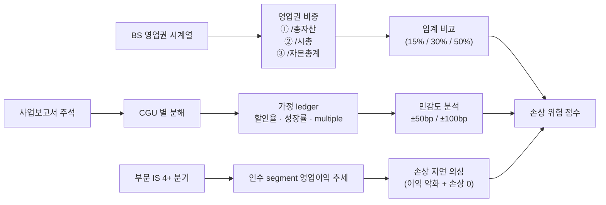

## 공개 호출 방식

```python
import dartlab
import polars as pl

target = "005380"  # 예 — 현대차 (구조 보유)
c = dartlab.Company(target)

# 1. BS — 영업권 / 무형자산 / 총자산 시계열
bs = c.show("BS", freq="Y")
period_cols = [col for col in bs.columns if str(col)[:4].isdigit()]
period_cols_5y = sorted(period_cols, reverse=True)[:5]

def get_row(df, label_substr):
    return df.filter(pl.col(df.columns[1]).str.contains(label_substr))

goodwill_row = get_row(bs, "영업권")
intangible_row = get_row(bs, "무형자산")
total_assets_row = get_row(bs, "자산총계")

# 2. 시총 (가능 시)
try:
    price = c.gather("price")
    latest_close = price["close"][-1] if not price.is_empty() else None
except Exception:
    latest_close = None

# 3. 부문 정보 (segment IS)
try:
    segments = c.show("부문정보") if "부문정보" in (c.topics if hasattr(c, "topics") else []) else None
except Exception:
    segments = None

# 4. 사업보고서 주석 — 영업권 손상검사
try:
    notes = c.disclosure("영업권") if hasattr(c, "disclosure") else None
except Exception:
    notes = None

rows = []
for p in period_cols_5y:
    if p not in bs.columns:
        continue
    gw = goodwill_row[p][0] if not goodwill_row.is_empty() else None
    intang = intangible_row[p][0] if not intangible_row.is_empty() else None
    ta = total_assets_row[p][0] if not total_assets_row.is_empty() else None
    gw_ratio = (gw / ta * 100) if (gw and ta) else None
    rows.append({
        "period": p,
        "goodwill": gw,
        "intangible_assets": intang,
        "total_assets": ta,
        "goodwill_pct_assets": gw_ratio,
    })

emit_result(
    table=rows,
    values={
        "target": target,
        "yearCount": len(rows),
        "notesAvailable": notes is not None,
        "segmentsAvailable": segments is not None,
    },
    date=period_cols_5y[0] if period_cols_5y else "latest",
)
```

## 호출 동작 — 5 단 분석 구조

### 1. 결론 도출

*영업권/총자산·시총 비율 + CGU 별 손상검사 가정 + 인수 segment 영업이익 추세 + 손상 위험 점수* 한 문장.

좋은 결론 예시:
- "005380 (현대차) 영업권 X 조 = 총자산 Y%·시총 Z% — 임계 (15%) 이내, 손상 위험 낮음. 인수 segment Q 영업이익 4 분기 추세 +5% 안정, 손상검사 할인율 12.5% (변경 없음 3 년 유지) — 가정 변경 점검 권장 [conf:70]."
- "두산밥캣 영업권 누적 4.2 조 = 총자산 38%·시총 65% — 임계 초과. 인수 segment 영업이익 -15% 추세, 손상 0 = *지연 가능성* [conf:60]. 주석 손상검사 가정 (할인율 11%·성장률 3%) 민감도 ±100bp 분석 필요."

금지:
- 영업권 비율만 보고 *위험* 단정. *인수 segment 영업이익 추세* 동행 필수.
- CGU 별 분해 없이 연결 영업권 합계만 검사.

### 2. 핵심 근거 수집

`requiredEvidence: skillRef + target + tableRef + valueRef + dateRef + sourceRef + executionRef` 필수.

- **target**: stockCode.
- **sourceRef**: 사업보고서 주석 (영업권 손상검사 가정 명시 — 할인율·성장률·CGU 분류).
- **tableRef** (4+ 표):
  1. **영업권 시계열** — 최근 5 년 BS 영업권 · 무형자산 · 총자산 · 영업권/자산 % · 영업권/시총 %
  2. **CGU 분해** — 사업 부문별 영업권 잔액 · 손상검사 가정 (할인율·성장률·multiple) · 회수가능액 vs 장부가
  3. **인수 segment 추세** — 부문 IS 영업이익 4+ 분기 (인수 후 누적 추세)
  4. **민감도 분석** — 할인율 ±50bp / 성장률 ±100bp 시 회수가능액 변동
- **valueRef**: 영업권/자산 %·영업권/시총 %·인수 segment 영업이익 추세·민감도 결과.
- **dateRef**: BS 기준일·주석 손상검사 시점·인수 segment 분기.
- **sourceRef**: 사업보고서 주석 id · 인수 공시 id.
- **executionRef**: RunPython 계산 id.

### 3. 메커니즘 분석

영업권 손상검사 정량 = *비중 임계 + CGU 가정 추적 + segment 추세 + 민감도*:



**영업권 비중 임계** (KR 시장 기준):

| 비율 | 보통 | 주의 | 위험 |
|---|---|---|---|
| 영업권 / 총자산 | < 5% | 5~15% | > 15% |
| 영업권 / 시총 | < 10% | 10~30% | > 30% |
| 영업권 / 자본총계 | < 20% | 20~50% | > 50% |

**손상 지연 신호** (정량):

| 신호 | 임계 | 가중치 |
|---|---|---|
| 인수 segment 영업이익 YoY | -10%+ 4 분기 연속 | high |
| 영업권 손상 인식 | 인수 후 3 년+ 0 | high |
| 손상검사 할인율 변경 | 5 년+ 변동 X | medium |
| CGU 분해 부재 | 주석 미명시 | medium |
| 민감도 분석 미명시 | 주석 누락 | low |

**손상검사 가정 검증**:
- **할인율 (WACC)** — 회사 위험 + 산업·국가 risk premium. 5 년 변동 X 면 *시장 변화 미반영* 의심.
- **영구 성장률 (g)** — 통상 1~3%. 5%+ 면 비현실적.
- **CGU 분류** — 사업 부문별 분해 명시. 연결 합계만이면 검증 약함.
- **multiple** — 산업 평균 EBITDA × — 산업 비교 가능.

### 4. 반례·한계

- **Falsifier**: 영업권 잔액 + 주석 가정 부재 시 판정 불가 — 주석 본문 확인 후 재호출.
- **회계 정책**: K-IFRS vs US GAAP 손상검사 빈도 차이. KR 은 연 1 회 의무, US 는 trigger event.
- **CGU 정의**: 회사 자체 결정. 광범위 정의 (사업 부문 = 회사 전체) 면 손상 인식 어려움.
- **민감도 비공개**: 주석에 민감도 분석 미명시 시 외부 추정 한계.
- **인수 시점 가정 vs 현 시점**: 인수 시 *시너지 가정* 이 후 사후평가에 그대로 유지되면 보수성 부족.
- **외환 환산**: 해외 종속사 영업권은 환율 영향. 환산 차이 vs 손상 분리 필요.
- **사업 부문 통합·분할**: 부문 변경 시 segment 추세 단절. 정합성 확인.

### 5. 후속 모니터링

| 신호 | 임계 | 조치 |
|---|---|---|
| 영업권/총자산 변동 | ±2%p 이상 | 인수·매각·손상 사건 확인 |
| 인수 segment 영업이익 | YoY -10% 4 분기 연속 | 손상검사 가정 재검증 권장 |
| 손상 인식 | 신규 발생 | CGU·금액·가정 변경 추적 |
| 할인율 변경 | 50bp 이상 | 시장 변화 반영 신호 |
| 영업권/시총 비율 | 30%+ 진입 | 시장이 손상 미반영 가격 의심 |
| 외부 평가기관 의견 | 의견 변경 | 손상검사 보고서 review |

## 대표 반환 형태

- `tableRef:goodwill:timeline` — 5 년 영업권 시계열
- `tableRef:goodwill:cgu_breakdown` — CGU 분해
- `tableRef:goodwill:segment_trend` — 인수 segment 추세
- `tableRef:goodwill:sensitivity` — 민감도 분석
- `valueRef:goodwill:assets_pct` — 영업권/자산 %
- `valueRef:goodwill:mkt_cap_pct` — 영업권/시총 %
- `valueRef:goodwill:impairment_score` — 손상 위험 점수
- `sourceRef:goodwill:notes_id` — 주석 id

## 연계 절차

- 합병비율 적정성 → `recipes.fundamental.quality.forensics.mergerRatioFairness`
- 주석 신호 (영업권 키워드) → `recipes.fundamental.quality.forensics.noteSignalExtractor`
- 사건 ↔ 재무 매칭 → `recipes.fundamental.quality.forensics.eventToStatementMatcher`
- 계정 추적 → `recipes.fundamental.quality.forensics.accountTraceLedger`
- 분기 변동성 → `recipes.fundamental.quality.quarterlyAnomalyDetection`

재호출 트리거: "영업권 손상 위험", "PPA 사후평가", "두산밥캣 영업권 추적", "M&A 영업권 누적".

## 기본 검증

- 영업권 5 년 시계열 + 총자산·시총 동행.
- CGU 분해 또는 부재 명시.
- 인수 segment 영업이익 4+ 분기.
- 손상검사 가정 (할인율·성장률) ≥ 2 종 명시 또는 부재 명시.
- 민감도 분석 ≥ 2 시나리오 또는 부재 명시.

## AI 직접 사용 방식

1. `ReadSkill` 에서 영업권·손상·M&A 사후평가 질문이면 본 recipe 선정.
2. `Company.show("BS")` 5 년 + 영업권·무형자산·총자산·자본총계 행 추출.
3. `Company.show("부문정보")` 또는 `Company.disclosure("영업권")` segment·주석.
4. RunPython 으로 비중 + 추세 + 민감도 계산.
5. 답변에 *영업권 시계열 + CGU 분해 + segment 추세 + 민감도* 4 셋 + 반례·한계 필수.
