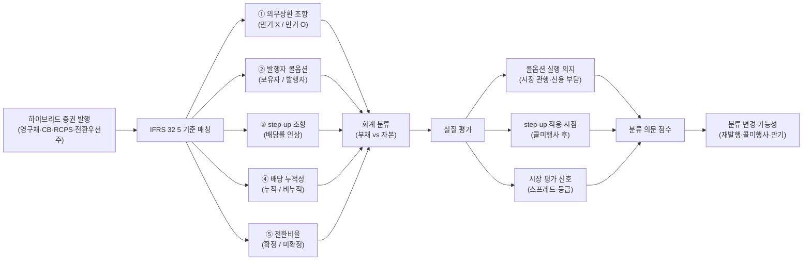

## 공개 호출 방식

AI 도구 실행 순서는 `EngineCall` 우선이다. `Company.show("IS"|"BS"|"CF")`, `Company.disclosure`, `scan.quality`, `scan.audit`, `scan.disclosureRisk` 는 엔진 호출로 근거를 먼저 확보한다. 아래 Python 블록은 확보한 L1/L1.5 근거를 `buildEvidenceForensicsMemo` 로 묶는 **RunPython fallback** 절차다 — 복합금융상품 분류 — 계정 추적.

```python
import dartlab
from dartlab.synth.evidenceForensics import buildEvidenceForensicsMemo

target = "005930"  # KOSPI/KOSDAQ 종목코드
c = dartlab.Company(target)

statements = {}
for topic in ("IS", "BS", "CF"):
    try:
        statements[topic] = c.show(topic, freq="Y")
    except TypeError:
        statements[topic] = c.show(topic)
    except Exception:
        pass

sectionTexts = {}
for topic in ("businessOverview", "riskFactors", "mdna", "notesDetail"):
    try:
        sectionTexts[topic] = str(c.show(topic))[:20000]
    except Exception:
        pass

try:
    disclosure = c.disclosure()
    events = disclosure.head(20).to_dicts() if hasattr(disclosure, "head") else list(disclosure)[:20]
except Exception:
    events = []

scanRows = []
for axis in ("quality", "audit", "disclosureRisk"):
    try:
        df = dartlab.scan(axis)
        rows = df.head(3).to_dicts() if hasattr(df, "head") else []
        for row in rows:
            row["axis"] = axis
        scanRows.extend(rows)
    except Exception:
        pass

memo = buildEvidenceForensicsMemo(
    target=target,
    market=str(getattr(c, "market", "KR")),
    companyName=str(getattr(c, "corpName", target)),
    statements=statements,
    sectionTexts=sectionTexts,
    events=events,
    scanRows=scanRows,
)

emit_result(
    table=memo["tables"]["accountTraceLedger"],
    values={
        "target": target,
        "riskScore": memo["headline"].get("riskScore"),
        "signalCount": memo["headline"].get("signalCount"),
    },
    date=memo.get("asOf", "latest"),
    sources=memo["sources"],
)
```

## 호출 동작 — 5 단 분석 구조

### 1. 결론 도출

*하이브리드 증권 잔액 + IFRS 32 5 기준 매칭 + 분류 의문 점수* 한 문장 결론.

좋은 결론 예시:
- "HMM 영구채 잔액 X 조 — *자본 분류* (IFRS 32 의무상환 X·콜옵션 발행자 보유·step-up 5%·배당 누적). step-up 조항 + 콜옵션 행사 의지로 *실질 부채 성격 신호* [conf:70]. 흥국생명 콜미행사 사례 후 분류 변경 검토 권장."
- "SK에코플랜트 RCPS step-up 조항 + 만기 5년 — 회계상 자본이지만 *실질 부채 성격*. 상환 시점 자본 차감 위험 정량 — 시총 대비 X%."

금지:
- IFRS 32 5 기준 매칭 누락.
- step-up 만 보고 자본 분류 부정 단정.
- 부채 분류된 RCPS 와 자본 분류된 RCPS ROE 단순 비교.

### 2. 핵심 근거 수집

`requiredEvidence: skillRef + target + tableRef + valueRef + dateRef + sourceRef + executionRef` 필수.

- **target**: stockCode.
- **sourceRef**: 사업보고서 주석 (차입금·자본·우선주 sections 명시) + 발행 공시 본문 (DART 주요사항보고서·발행 공시).
- **tableRef** (3+ 표):
  1. **하이브리드 증권 시계열** — 종목별 5 년 영구채·CB·RCPS·전환우선주 잔액 + 분류 (부채 vs 자본)
  2. **IFRS 32 5 기준 매칭** — 증권별 (의무 상환·발행자 콜옵션·step-up·배당 누적성·전환비율 확정) 매트릭스
  3. **분류 의문 신호** — step-up + 실행 의지·콜미행사 사례·시장 평가 시그널
- **valueRef**: 증권별 잔액·시총 대비 비율·step-up 조건·만기.
- **dateRef**: BS 기준일·발행 공시 시점·주석 보고 시점.
- **sourceRef**: 주석 sections id·발행 공시 id.
- **executionRef**: RunPython 계산 id.

### 3. 메커니즘 분석

부채-자본 분류 = *IFRS 32 5 기준 매트릭스 + 실질 vs 형식 분리 + 분류 변경 시점 추적*:



**IFRS 32 5 기준 매트릭스**:

| 기준 | 자본 분류 | 부채 분류 |
|---|---|---|
| 만기 (의무 상환) | 만기 X (영구) | 만기 O |
| 콜옵션 | 발행자 보유 | 보유자 보유 (put option) |
| step-up | 작거나 없음 | 큰 step-up (실질 만기) |
| 배당 누적성 | 비누적 (재량) | 누적 |
| 전환비율 | 확정 | 미확정 (조정 가능) |

**증권 유형별 일반 분류**:

| 유형 | 일반 분류 | 핵심 변수 |
|---|---|---|
| 영구채 (Perpetual) | 자본 (조건부) | step-up 정도·콜미행사 시 효과·시장 관행 |
| 전환사채 (CB) | 부채 (전환권 별도 자본 가능) | 전환권 분리·평가이익 분류 |
| 상환전환우선주 (RCPS) | 부채 (만기 상환 의무) | 콜옵션 보유자 / step-up |
| 전환우선주 | 자본 (조건부) | 전환비율 확정 여부 |
| 신주인수권부사채 (BW) | 부채 + 자본 (분리) | 분리형 vs 일체형 |

**분류 의문 신호 점수**:

| 신호 | 임계 | 가중치 |
|---|---|---|
| step-up 조항 (5%+ 인상) | 발생 | high |
| 콜미행사 사례 (시장) | 1+ 회 | high |
| 시장 스프레드 (CB·영구채) | 비교 가능 채권 대비 +200bp | high |
| 신용등급 변동 | 한 단계 하향 | medium |
| 발행 후 분류 변경 | 발생 | high |
| 만기 5년 이하 (영구채 명시) | 발생 | medium |

### 4. 반례·한계

- **Falsifier**: BS 자본·부채 5+ 년 + 차입금 sections 부재 시 판정 불가.
- **IFRS 정책 변경**: IFRS 도입 (2011) 전후 분류 기준 차이. 시계열 단절 가능.
- **콜옵션 실행 의지**: 시장 관행은 *콜 행사* 가 표준. 흥국생명 콜미행사 사례 (2022) 후 *행사 의지 의문* 증가 — 종목별 시장 평가 별도.
- **step-up 정도**: 100~200bp step-up 은 정상, 500bp+ 면 *실질 만기* 신호. 절대 기준 없음.
- **회계 vs 실질**: 회계상 자본인 영구채 + 콜미행사 시 *시장 평가는 부채 수준* — 수익률 분석 시 별도.
- **신용평가기관 분류**: 무디스·S&P 는 자체 hybrid 분류 (50% 자본 처리). 회계 분류와 다름.
- **발행 시점 vs 후속 변경**: 발행 시 자본 분류된 RCPS 가 step-up 발효 후 부채 분류로 변경되는 사례. 시계열 추적 필수.

### 5. 후속 모니터링

| 신호 | 임계 | 조치 |
|---|---|---|
| 콜미행사 사례 발생 | 시장 동일 발행자 | 분류 의문 점수 +high |
| step-up 발효 시점 | 발행 후 5~10 년 | 분류 변경 검토 트리거 |
| 신용등급 변동 | 한 단계 하향 | 시장 스프레드 재확인 |
| BS 자본·부채 항목 변동 | ±10% 이상 | 신규 발행·상환·재분류 신호 |
| 전환사채 평가손익 | 분기 변동 ±20% | 당기손익 vs OCI 분류 재확인 |
| 발행자 콜옵션 행사 | 1 년 내 | 자본 → 현금 차감 |
| 흥국생명 류 시장 사건 | 발생 | 본 종목 영향 정량 |

## 대표 반환 형태

- `tableRef:hybrid:security_timeline` — 증권별 잔액 5 년 + 분류
- `tableRef:hybrid:ifrs32_matrix` — 5 기준 매칭
- `tableRef:hybrid:signal_score` — 분류 의문 신호 점수
- `valueRef:hybrid:cap_pct` — 시총 대비 비율
- `valueRef:hybrid:stepup_bp` — step-up 절대값
- `sourceRef:hybrid:notes_id` — 주석 sections id
- `sourceRef:hybrid:disclosure_id` — 발행 공시 id

## 연계 절차

- 실질지배력·연결범위 → `recipes.fundamental.quality.forensics.controllingPowerJudgment`
- TRS·파생 (콜옵션 동행) → `recipes.fundamental.quality.forensics.trsDerivativeUsage`
- 계정 추적 (자본·부채 흐름) → `recipes.fundamental.quality.forensics.accountTraceLedger`
- 자본배분 (배당·자사주 동행) → `recipes.fundamental.quality.capitalAllocationScorecard`
- 주석 신호 (영구채·CB 키워드) → `recipes.fundamental.quality.forensics.noteSignalExtractor`
- 신용 등급 → `engines.credit`

재호출 트리거: "영구채 자본 분류 적정", "RCPS 부채 자본", "전환사채 회계 평가", "HMM 영구채", "SK에코플랜트 step-up", "흥국생명 콜미행사 영향".

## 기본 검증

- BS 자본·부채 시계열 ≥ 5 년.
- 사업보고서 주석 차입금 또는 자본 sections 확인 (또는 부재 명시).
- IFRS 32 5 기준 모두 평가 (또는 데이터 부족 명시).
- step-up·콜옵션 조건 정량 (bp 단위) 또는 부재 명시.
- 분류 의문 신호 점수 산출 (3 신호 이상 권장).

## AI 직접 사용 방식

1. `ReadSkill` 에서 영구채·CB·RCPS·전환우선주·하이브리드 증권 질문이면 본 recipe 선정.
2. `Company.show("BS", freq="Y")` 5 년 + 자본·부채 행 키워드 검색.
3. `Company.show("차입금")` 또는 `c.topics` 으로 차입금·약정 sections 확인.
4. `Company.disclosure(keyword="영구"/"전환"/"우선주", days=1825)` 발행 공시.
5. RunPython 으로 IFRS 32 5 기준 매트릭스 + 분류 의문 점수.
6. 답변에 *증권별 잔액 시계열 + 5 기준 매트릭스 + 신호 점수 + 시장 평가 한계* 4 셋 필수.
